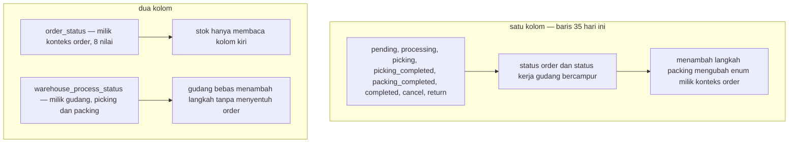
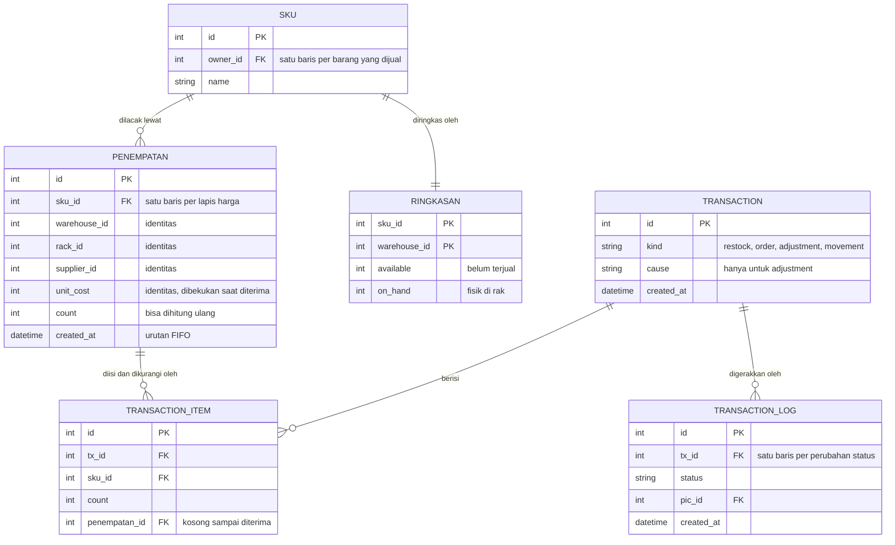

# Clarity — `stock_thoni/context.md`

Kritik, pertanyaan dan peringatan untuk [context.md](./context.md). **Dokumen itu milik Anda;
file ini milik saya.** Poin yang sudah dijawab **dihapus**, jadi isi file ini hanya yang masih terbuka.

Ditulis dalam Bahasa Indonesia mengikuti dokumennya — bilang saja kalau lebih enak Inggris.

Tetangga: [inventory (Heri)](../inventory/context_clarify.md) ·
[product](../product/context_clarify.md) ·
[order](../order/context_clarify.md) ·
[technical/stock/design.md](../../technical/stock/design_clarify.md).

---

# Yang tertutup ronde ini

| | |
| --- | --- |
| ✅ **Kapan stok bergerak** — §baris 38–46 | Ini tabel yang saya minta, dan Anda menulisnya lebih ringkas dari usulan saya. Tercatat: [stok-berkurang-saat-order-dibuat](./context_decision.md#stok-berkurang-saat-order-dibuat) |
| ✅ **`approved` vs barang mendarat** | `completed` yang menambah stok. Tercatat: [stok-bertambah-saat-restock-completed](./context_decision.md#stok-bertambah-saat-restock-completed) |
| ✅ **`cancel` dan `return` kembali ke daftar status Order** | Dua jalan itu yang dulu hilang, dan keduanya jalan pengembalian stok. Kontradiksinya **mengecil**, belum tertutup — lihat di bawah |

> 🎯 **Dan satu hal yang layak disebut:** aturan *"stok berkurang saat `Order - pending`"* **sejalan**
> dengan [order-created-is-finalize](../order/context_decision.md#order-created-is-finalize), yang sudah
> menjawab *"when is stock committed?"* dengan ***"at finalize, which is creation"***. Dua penulis, dua
> dokumen, satu aturan — tanpa saling menyalin. Itu tanda modelnya waras.

---

# Contradiction

## Daftar status `Order` masih beda dengan yang sudah diputuskan — tapi bedanya bukan lagi soal stok

> baris 35 — *"Order: `pending`, `processing`, `picking`, `picking_completed`, `packing_completed`, `completed`, `cancel`, `return`"*

Yang sudah diputuskan di [the-order-has-eight-statuses](../order/context_decision.md#the-order-has-eight-statuses):
`pending` · `processed` · `shipped` · `completed` · `problem` · `lost` · `return` · `cancel`.

| | |
| --- | --- |
| ✅ **sudah cocok** | `pending` · `completed` · `cancel` · `return` — dan keempatnya yang menyentuh stok |
| **beda nama** | `processing` vs `processed` |
| **ada di sini, tidak ada di keputusan** | `picking` · `picking_completed` · `packing_completed` |
| **ada di keputusan, tidak ada di sini** | `shipped` · `problem` · `lost` |

⚠ **Tapi tiga yang "berlebih" itu bukan karangan.** [order/context.md §Complete Journey](../order/context.md)
menggambar *"Warehouse Process Order (Packing/Picking)"* sebagai satu langkah, lalu *"set status
**warehouse process** `completed`"* — **terpisah** dari status order `shipped`. Jadi dokumen order
sendiri sudah memisahkan **status proses gudang** dari **status order**; daftar Anda mencampur keduanya
ke dalam satu kolom. (Enum di kode — `placed, confirmed, picking, packed, shipped, cancelled` — juga
masih daftar lama yang menurut keputusan itu harus dimigrasi.)

**→ Rekomendasi: pisahkan jadi dua kolom, jangan satu.** `picking` dan `packing` adalah **status kerja
gudang**, dan itu memang milik konteks ini — sedangkan delapan status order milik Heri
([member.md §Scope 2](../project/member.md)). Dipisah, keduanya benar sekaligus, dan menambah langkah
packing tidak lagi berarti mengubah enum konteks lain.

## Stok berkurang di awal dan tidak pernah dikurangi lagi — jadi tidak ada angka untuk barang di rak

Konsekuensi langsung dari [stok-berkurang-saat-order-dibuat](./context_decision.md#stok-berkurang-saat-order-dibuat),
dan ini yang paling mahal di antara semua yang tersisa.

> baris 45 — *"Kapan stok berkurang? Saat `Order - pending`"*
> baris 18 — *"dan berapa sisa stoknya"* — satu angka

Karena pengurangan terjadi saat order **dibuat**, dan tidak ada efek apa pun saat barang benar-benar
**keluar gedung**, maka *"sisa stok"* berarti **yang belum terjual** — bukan yang ada di rak. Barang
untuk order yang belum dipetik masih berdiri fisik di rak, tapi sudah tidak dihitung.

| yang bertanya | angka yang dia butuh | tersedia? |
| --- | --- | --- |
| marketplace — *"masih bisa dijual?"* | belum terjual | ✅ ini yang ada |
| pemetik — *"ada berapa di rak A-01?"* | fisik di rak | ⛔ tidak ada |
| opname — *"hitungan cocok?"* | fisik di rak | ⛔ tidak ada |

⚠ **Dan opname-lah yang membuat ini jadi uang.** Petugas menghitung barang fisik, lalu membandingkannya
dengan angka yang sudah dikurangi order-order yang belum dipetik — **setiap order terbuka akan terbaca
sebagai selisih**. Padahal [in-custody-shortfall-is-the-warehouses](../inventory/context_clarify.md#in-custody-shortfall-is-the-warehouses)
menjadikan selisih opname **tanggungan gudang**. Gudang menanggung uang untuk barang yang sebenarnya ada.

**→ Rekomendasi: dua angka, bukan satu.** `available` (belum terjual — yang sekarang sudah Anda punya)
dan `on_hand` (fisik di rak). `Order - pending` mengurangi `available`; yang mengurangi `on_hand` adalah
saat barang diserahkan ke ekspedisi. Keduanya bertemu lagi setelah pengiriman. ⚠ Ini menjawab dua
pertanyaan yang sudah lama terbuka di tetangga — [inventory Critique 2 dan 3](../inventory/context_clarify.md#critique),
*"Where can stock BE?"* dan *"What does available mean?"* — jadi kalau Anda putuskan di sini, dua file
ikut tertutup.

---

# Critique

| | Masalah | → Rekomendasi |
| --- | --- | --- |
| **1** | **`broken`, `lost`, `found_back` masih ditulis sebagai STATUS, padahal itu SEBAB** (baris 36) — dan sekarang jadi lebih terasa, karena baris 42 dan 46 menentukan arah stok lewat *"adjustment yang sifatnya menambah / mengurangi"*. **"Sifat"** itu bukan kolom: tandanya disimpulkan dari kata sebabnya. | Pisahkan **tiga enum kecil**: `kind` (restock/order/adjustment) · `status` (daur hidup) · `cause` (sebab). Arah `+`/`−` menempel di `cause`, jadi tidak perlu disimpulkan dari kata. |
| **2** | **Kosakata sebab sudah diputuskan di tempat lain, dan berbeda.** [the-ledger-speaks-the-business-words](../balance/context_decision.md#the-ledger-speaks-the-business-words) menetapkan `broken_good` · `lost_good` · `found`; dokumen ini menulis `found_back`. ⚠ Uang dari barang rusak/hilang diposting ke ledger balance — kalau katanya beda, postingnya tidak ketemu. | Pakai kata yang sudah diputuskan. Kalau `found_back` lebih benar menurut Anda, itu **pembalikan keputusan** dan tempatnya di `balance` (RULE 12). |
| **3** | **Opname menghasilkan *selisih*, bukan *kehilangan*.** [inventory Critique 3](../inventory/context_clarify.md#critique) sudah memisahkan **loss** (ada saksi, ada pelaku) dari **shortfall** (ketahuan saat menghitung, sebab tak diketahui). Harganya sama, tapi gudang yang *shortfall*-nya naik punya masalah berbeda dari yang *loss*-nya naik. | Tambahkan `shortfall` sebagai sebab tersendiri — sekaligus menyambungkan baris 30 (*"transaksi mutlak"*) ke aturan uang di [inventory §Stock loss 2](../inventory/context.md). |
| **4** | **Satu SKU = satu harga dan satu lokasi** (baris 15–16), padahal [technical/stock/design.md:21](../../technical/stock/design.md) — **dokumen Anda sendiri** — menulis *"smallest grain that we tracked is by `batch_id`"*, dan [batch-fifo-pricing](../product/context_clarify.md#batch-fifo-pricing) sudah memutuskan biaya disimpan per batch lalu ditarik FIFO. Barang yang datang tiga kali dengan tiga harga tidak punya *"berapa harganya"*. | Satu kalimat yang menurunkan kelima atribut itu satu tingkat: *"kelimanya dibawa setiap **penempatan**, dan `sisa stok` sebuah SKU adalah **penjumlahan**"*. |
| **5** | **`Order - return` menambah stok, tapi tidak disebut masuk ke penempatan yang mana** (baris 41). Barang retur punya harga yang sudah diputuskan — [return-price-is-the-orders-cogs](../product/context_clarify.md#return-price-is-the-orders-cogs), yaitu COGS tim pemesan — jadi ia **tidak bisa** digabung ke penempatan lama yang harganya lain tanpa mengubah biaya yang sudah dibekukan. | Retur **membuat penempatan baru** dengan harga COGS-nya sendiri. Sekalian jawab: barang retur masuk rak mana, dan siapa yang menaruhnya. |
| **6** | **`baris 34` menulis `approved` / `completed` dengan garis miring**, jadi belum jelas apakah itu dua status berurutan atau dua nama untuk satu hal. Efek stoknya sudah jelas (di `completed`), tapi jumlah statusnya belum. | Kalau keduanya ada: `approved` = gudang setuju menerima, `completed` = barang mendarat. Kalau hanya satu: pakai `completed`, dan buang `approved`. |
| **7** | **Definisi transaksi di baris 24 membuang dua aktivitas yang tetap harus tercatat** — **pindah rak** (jumlah tidak berubah) dan **transfer antar gudang** (total pemilik tetap). ⚠ Daftar baru di baris 38–46 mengonfirmasinya: tidak ada satu pun entri untuk perpindahan. Padahal [inventory Critique 4](../inventory/context_clarify.md#critique) menyebut **pemindahan yang tidak tercatat tidak bisa dibedakan dari kehilangan** saat opname — dan itu uang gudang. | Perluas satu kata: *"aktivitas yang mengubah stok — **jumlahnya atau tempatnya**"*, lalu tambahkan jenis keempat `movement` yang jumlahnya nol tapi tempatnya berubah. |
| **8** | **Dua dokumen menjelaskan satu konteks yang sama** — [inventory/context.md](../inventory/context.md) (Heri) dan dokumen ini. ⚠ Padahal [stock-merges-into-inventory](../inventory/context_decision.md#stock-merges-into-inventory) sudah memutuskan **tidak ada konteks stok terpisah**, dan folder `stock_thoni/` persis bentuk yang dihapus keputusan itu. | Pindahkan ke `business/inventory/` dengan nama yang menyatakan ini proposal tandingan. Siapa yang memilih di antara dua proposal masih terbuka di [member_clarify Q4](../project/member_clarify.md#question). |
| **9** | **Semua transaksi *"akan di-log agar bisa di-audit"* (baris 32), tapi tidak disebut apa isinya.** Audit butuh **siapa** dan **kapan** — tanpa itu log hanya mencatat bahwa sesuatu berubah, bukan siapa yang mengubahnya. ⚠ Paling menentukan justru saat selisih opname jadi tanggungan gudang. | Satu kalimat: *"setiap perubahan status mencatat siapa yang melakukannya dan kapan, dan tidak pernah diubah atau dihapus"*. |

---

# Proposed Design

**Bukan rancang ulang.** Aturan pergerakan stok sudah ada dan sudah benar. Yang kurang tinggal: **angka
kedua** untuk barang fisik, satu tingkat di bawah SKU, dan kolom sebab.

| tambahkan | di mana | kenapa |
| --- | --- | --- |
| `on_hand` di samping `available` | §SKU | opname menghitung barang fisik ([Contradiction 2](#stok-berkurang-di-awal-dan-tidak-pernah-dikurangi-lagi--jadi-tidak-ada-angka-untuk-barang-di-rak)) |
| **penempatan** sebagai tingkat di bawah SKU | §SKU | lima atribut itu miliknya, bukan milik SKU ([C4](#critique)) |
| `cause` sebagai kolom tersendiri | §Transaction | arah `+`/`−` berhenti disimpulkan dari kata ([C1](#critique)) |
| `shortfall` di samping `broken_good`, `lost_good`, `found` | §Adjustment | opname menghasilkan sebab yang berbeda ([C3](#critique)) |
| jenis keempat `movement` | §Transaction | pindah rak dan transfer antar gudang ([C7](#critique)) |
| `warehouse_process_status` terpisah dari `order_status` | §Transaction | picking dan packing milik gudang, delapan status order milik order ([Contradiction 1](#contradiction)) |

**Dua angka, dan kapan masing-masing bergerak:**

| momen | `available` | `on_hand` |
| --- | --- | --- |
| `Restock - completed` | `+` | `+` |
| `Order - pending` | `−` | tetap — barang masih di rak |
| diserahkan ke ekspedisi | tetap | `−` |
| `Order - cancel` | `+` | tetap |
| `Order - return` | `+` | `+` (penempatan baru, harga COGS) |
| `Adjustment` | ikut `cause` | ikut `cause` |
| `Movement` | tetap | tetap — hanya tempatnya berubah |

---

# Question

1. **Apakah ada angka untuk barang yang FISIK ada di rak, terpisah dari "sisa stok"?** 🆕 Dibuka oleh
   jawaban Anda sendiri: stok berkurang di `pending` dan tidak berkurang lagi saat barang keluar, jadi
   petugas opname membandingkan hitungan fisik dengan angka yang sudah dipotong order yang belum
   dipetik — **setiap order terbuka terbaca sebagai selisih**, dan selisih itu uang gudang.
   **→ Saran: dua angka — `available` dan `on_hand`.**
2. **`Order - return` menambah stok ke penempatan yang mana?** 🆕 Harganya sudah diputuskan (COGS tim
   pemesan), jadi tidak bisa digabung ke penempatan lama yang harganya berbeda.
   **→ Saran: retur membuat penempatan baru dengan harga COGS-nya sendiri.**
3. **Apakah `picking` / `packing_completed` itu status ORDER, atau status KERJA GUDANG?** Dokumen order
   sendiri sudah memisahkan keduanya. **→ Saran: dua kolom — `order_status` milik order, dan
   `warehouse_process_status` milik konteks ini.**
4. **Apakah `broken` / `lost` / `found_back` Anda maksud sebagai SEBAB, bukan status — dan setuju memakai
   kosakata `broken_good` / `lost_good` / `found` yang sudah diputuskan di balance?**
   **→ Saran: ya, plus `shortfall` untuk selisih opname.**
5. **Satu SKU punya satu harga dan satu lokasi, atau banyak penempatan?** Desain teknis Anda sendiri
   memakai `batch_id` sebagai grain terkecil. **→ Saran: banyak penempatan, dan sisa stok adalah
   penjumlahan.**
6. **Pindah rak dan transfer antar gudang — transaksi atau bukan?** Daftar baru di baris 38–46 tidak
   memuat keduanya. **→ Saran: masukkan sebagai jenis keempat `movement`.**
7. **Apakah proposal ini pindah ke `business/inventory/`?** Folder `stock_thoni/` masih berdiri di luar
   [stock-merges-into-inventory](../inventory/context_decision.md#stock-merges-into-inventory).
   **→ Saran: pindahkan, dengan nama yang menyatakan ini proposal tandingan milik Toni.**
