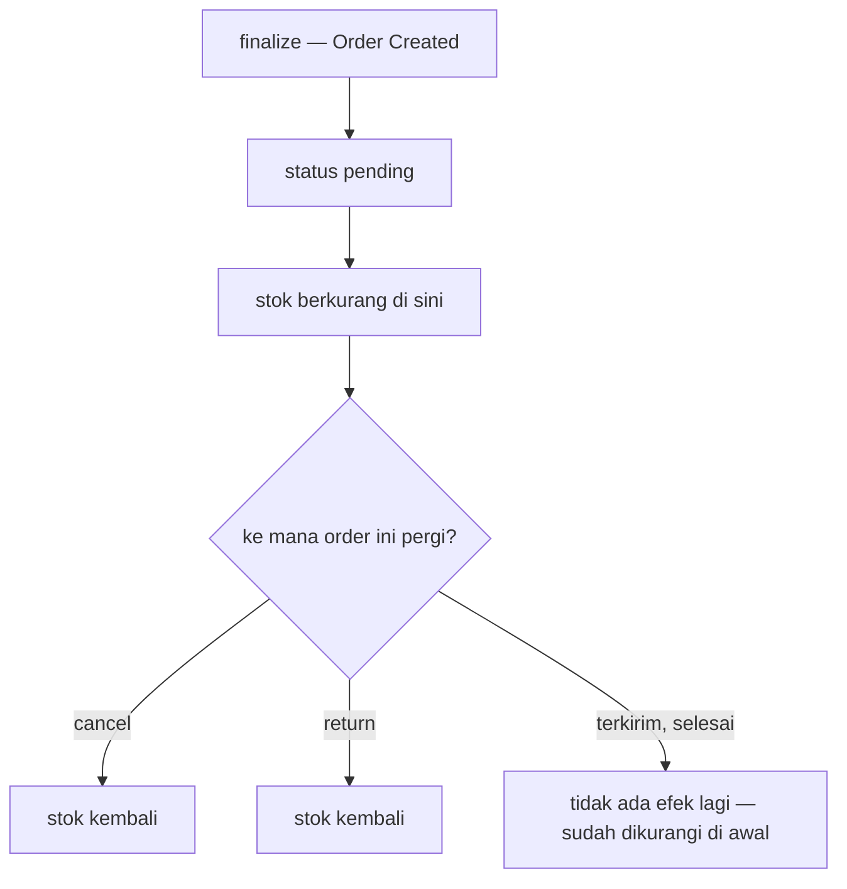
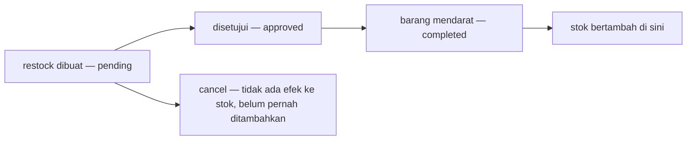

# Decisions — `stock_thoni/context.md`

Apa yang sudah diputuskan pemilik dokumen, dicatat sebelum dikerjakan. **Append-only** — keputusan yang
kelak dibalik diganti namanya dan referensinya di-grep (RULE 12), tidak pernah dihapus diam-diam.

| keputusan | isinya |
| --- | --- |
| [stok-berkurang-saat-order-dibuat](#stok-berkurang-saat-order-dibuat) | stok turun di `Order - pending`, dikembalikan oleh `cancel` dan `return` — dan ini **sejalan** dengan konteks order |
| [stok-bertambah-saat-restock-completed](#stok-bertambah-saat-restock-completed) | yang menambah stok adalah `completed`, yaitu saat barang mendarat — bukan saat disetujui |

---

## stok-berkurang-saat-order-dibuat

> `context.md` baris 44–46 — *"Kapan stok berkurang? Saat `Order - pending`"*
> `context.md` baris 38–41 — *"Kapan stok bertambah? Saat `Order - cancel` · Saat `Order - return`"*

**Putusannya.** Stok berkurang **saat order dibuat**, bukan saat dipetik dan bukan saat dikirim. Ada dua
jalan pengembalian, dan hanya dua: `cancel` dan `return`.

**✅ Ini sejalan dengan konteks order, bukan bertabrakan dengannya.**
[order-created-is-finalize](../order/context_decision.md#order-created-is-finalize) menutup pertanyaan
*"when is stock committed?"* dengan satu jawaban — ***"at finalize, which is creation"*** — dan
menegaskan draft *"holds nothing — no stock, no placement"*. `pending` adalah keadaan yang **dihasilkan**
oleh finalize. Jadi dua dokumen, dua penulis, satu aturan yang sama.

⚠ Konsekuensi yang ikut diputuskan, dicatat di sini supaya tidak ditemukan ulang nanti:
[order-created-is-finalize](../order/context_decision.md#order-created-is-finalize) menyatakan
**finalize boleh MENOLAK** — *"a refusal is an ordinary outcome, not an error path"*. Karena stok turun
tepat di momen itu, penolakan karena stok habis adalah jalur normal, bukan kegagalan sistem.

**Spesifikasinya.**

| momen | efek ke stok |
| --- | --- |
| `Order - pending` | `−` sejumlah baris order |
| `Order - cancel` | `+` balik |
| `Order - return` | `+` balik |
| status order lainnya | tidak ada efek — sudah dikurangi saat dibuat |

⚠ **Yang TIDAK ikut diputuskan**, dan sekarang terbuka di clarify: karena pengurangan terjadi di awal
dan tidak ada efek saat barang benar-benar keluar gedung, **tidak ada satu angka pun yang menyatakan
berapa barang yang secara fisik masih ada di rak**. Itu angka yang dipakai saat opname.

---

## stok-bertambah-saat-restock-completed

> `context.md` baris 34 — *"Restock: `pending`, `cancel`, `approved` / `completed`"*
> `context.md` baris 38–39 — *"Kapan stok bertambah? Saat `Restock - completed`"*

**Putusannya.** Yang menambah stok adalah **`completed`** — momen barang benar-benar mendarat — bukan
momen persetujuan. Sebelumnya dokumen hanya menulis `approved`, dan *disetujui* dengan *barang sampai*
adalah dua peristiwa berbeda yang bisa berjarak berhari-hari.

Ini juga menyelaraskan dokumen dengan kode yang sudah jalan: enum `RestockRequestStatus` memakai
`PENDING` · `FULFILLED` · `CANCELLED`, dan `stock_cost.go` hanya menghitung restock yang **fulfilled**
— *"A pending request is a price somebody hoped for, not one that was paid"*.

**Spesifikasinya.**

| momen | efek ke stok |
| --- | --- |
| `Restock - pending` | tidak ada |
| `Restock - approved` | tidak ada |
| `Restock - completed` | `+` sejumlah yang benar-benar diterima |
| `Restock - cancel` | tidak ada — tidak perlu kompensasi, karena belum pernah ditambahkan |

⚠ **Residu yang masih terbuka**, di clarify: baris 34 menulis `approved` / `completed` dengan garis
miring, jadi belum jelas apakah keduanya dua status berurutan atau dua nama untuk satu hal.
