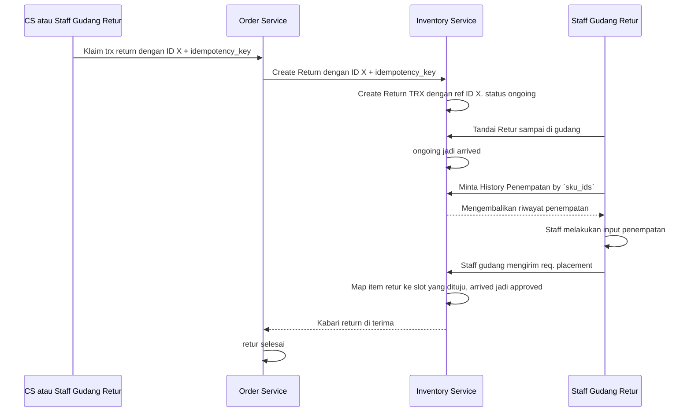

# Alur Return

## Berikut Alur Utama antar Service

```mermaid

sequenceDiagram

    participant U as CS atau Staff Gudang Retur
    participant O as Order Service
    participant I as Inventory Service
    participant S as Staff Gudang Retur

    U->>O: Klaim trx return dengan ID X + idempotency_key
    O->>I: Create Return dengan ID X + idempotency_key
    I->>I: Create Return TRX dengan ref ID X. status ongoing
    S->>I: Tandai Retur sampai di gudang
    I->>I: ongoing jadi arrived
    S->>I: Minta History Penempatan by `sku_ids`
    I-->>S: Mengembalikan riwayat penempatan
    S->>S: Staff melakukan input penempatan
    S->>I: Staff gudang mengirim req. placement
    I->>I: Map item retur ke slot yang dituju, arrived jadi approved
    I-->>O: Kabari return di terima
    O->>O: retur selesai

```
