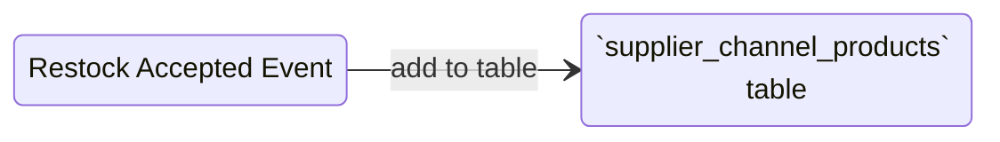

# Supplier Service

## General.
1. give selling team ability to manage supplier. like:
    - create supplier
    - update supplier
    - delete supplier
    - use it in restock.

2. selling team can discover / search other team suppliers.
3. other selling team can use other selling team supplier for their restock.
4. only selling team that can have supplier.

## Supplier Rule.
1. each selling team can manage their own supplier.
2. other selling team can use other selling team supplier when restock. its choose per product in restock. we talk further in restock.

## What Frontend Expected form this Service.
frontend use this service for 2 page supplier.
1. supplier managing page.
2. discover supplier. its for search other team supplier.

## Table Must Have.

1. table `suppliers`
    
    Field that must have:
    - `id` as primary key
    - `team_id`
    - `name`
    - `contact`
    - `address`
    - `description`
    - `deleted_at`
    - `updated_at`
    - `created_at`

2. table `supplier_channels`

    Field that must have:
    - `id` as primary key
    - `supplier_id`
    - `channel_type`
    - `name`
    - `uri`
    - `description`
    - `updated_at`
    - `created_at`

    field `channel_type` contain:
    - `shopee`
    - `lazada`
    - `tiktok`
    - `tokopedia`
    - `bukalapak`
    - `blibli`
    - `custom`

3. table `supplier_channel_products` 

    this table use for reference product in discover supplier frontend page.
    
    Field that must have:
    - `id` as primary key
    - `channel_id`
    - `product_id`, must be unique with `channel_id`
    - `created_at`

## How We Seed `supplier_channel_products`

# How We provide Analitical Data of Suppliers.

## Smallest Grain Reports.
### Daily Reports.
1. `supplier_product_daily_reports`

    field must exists.
    - `id`, for primary key
    - `day`
    - `supplier_id`
    - `product_id` 
    - `team_id`

    - `restock_count`
    - `restock_valuation`
    
    - `shipping_lost_count`
    - `shipping_lost_valuation`
    - `shipping_broken_count`
    - `shipping_broken_valuation`

    - `last_updated`

    composite unique:
    - `day`
    - `supplier_id`
    - `product_id` 
    - `team_id`

# How Supplier Service Rpc Deliver Analytical Data.
we adopt how settlement deliver analitical data. [see this](../settlement/analytic_context.md#how-rpc-api-deliver-analytical-data)

## What Metric that existed.
1. Daily
2. Monthly
3. Yearly
5. Supplier Grouped