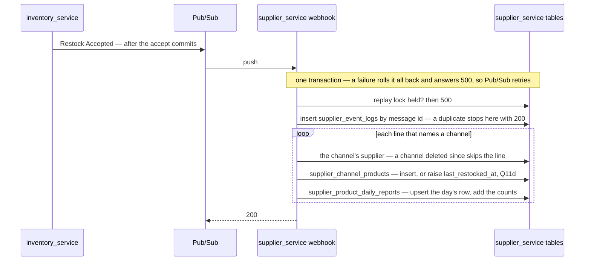
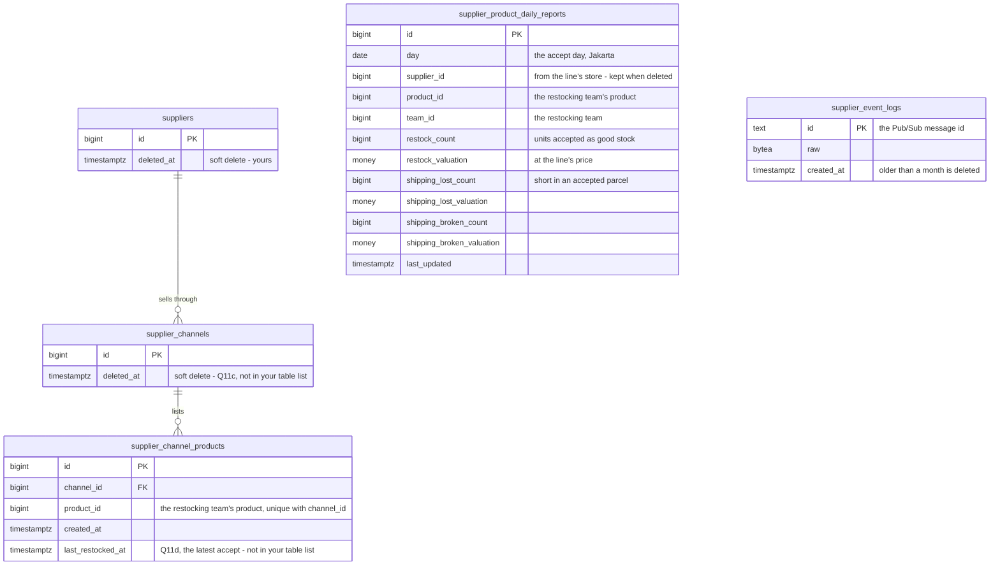
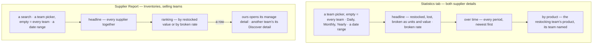
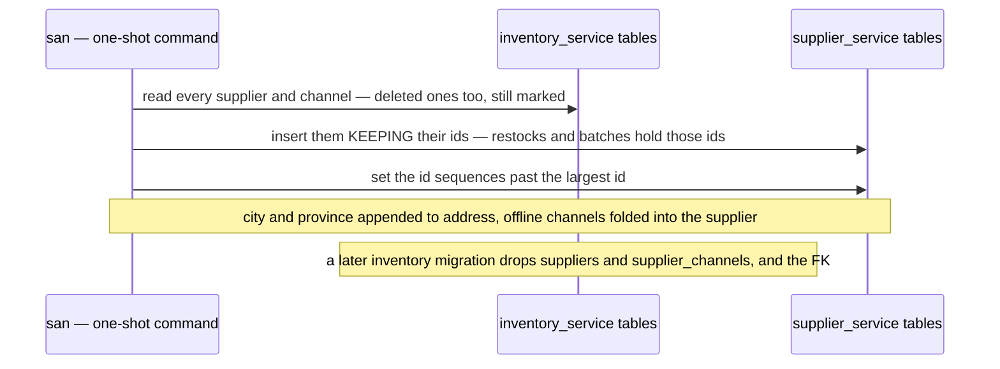
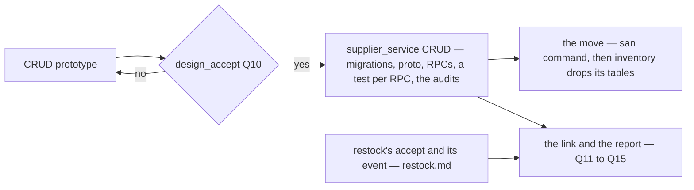
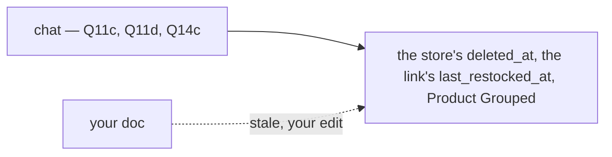
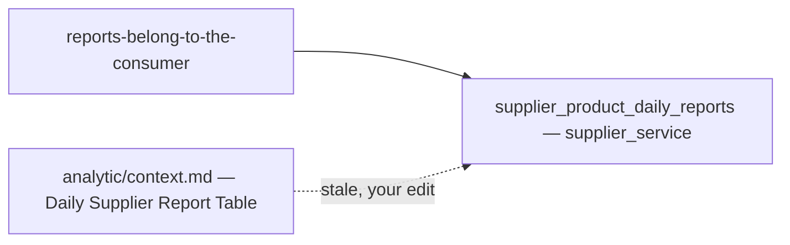
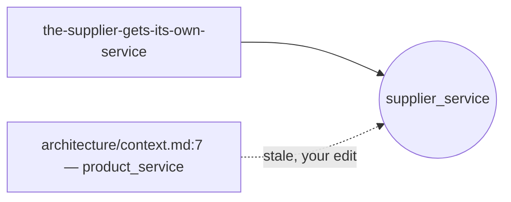

# Clarify — `supplier/context.md`

What I read out of [context.md](./context.md), and what has to be settled beside it. **That doc is yours — this
one is mine.** An answered point is deleted; what you settled is in [context_decision.md](./context_decision.md).

> **Built and audited (2026-10-07): 🆕 [Q19](#question)** — how far back the Supplier Report may rank. The performance
> audit's fixes are in (a one-year ranking 1.07 s → 90 ms); what is left is a limit only you can set.
>
> **In chat (2026-10-07): the figures' screens ACCEPTED — build them for real** — Q17 and Q18 answered, as recommended
> ([the-figures-screens-are-accepted](./context_decision.md#the-figures-screens-are-accepted), [rate-ranking-needs-50-units](./context_decision.md#rate-ranking-needs-50-units)); and two built-restock gaps decided: the restock's supplier
> until lines name a store ([the-supplier-comes-from-the-restock-until-lines-name-a-store](./context_decision.md#the-supplier-comes-from-the-restock-until-lines-name-a-store)), past accepts backfilled once
> ([past-accepts-are-backfilled-once](./context_decision.md#past-accepts-are-backfilled-once)). **Nothing is open.**
>
> **In chat (2026-10-07): a search and a team picker on the Supplier Report, the picker on the Statistics tab, and a Team
> filter on Discover** — [the-team-filter-picks-any-selling-team](./context_decision.md#the-team-filter-picks-any-selling-team) (against my two buttons), [the-supplier-report-searches-like-discover](./context_decision.md#the-supplier-report-searches-like-discover),
> [discover-filters-by-the-team-that-keeps-it](./context_decision.md#discover-filters-by-the-team-that-keeps-it) (**Q16 answered**, as recommended). Built. Q17 keeps its other four readings.
>
> **Prototyped (2026-10-07): the Statistics tab and the Supplier Report page**, on sample figures — [The screens](#the-screens).
> 🆕 [Q17](#question) — accept them · 🆕 [Q18](#question) — a broken rate on a handful of units tops the ranking.
> Re-examined: no new contradiction.
>
> **Building supplier_service (2026-10-07): 🆕 [Q16](#question)** — the accepted Discover screen searched the owning
> team's NAME, and supplier_service knows only the team's id. Recommend a Team filter instead.
>
> **In chat (2026-10-07): Q10c and Q15d answered, as recommended — nothing is open.** `custom` reads Other
> ([custom-is-labelled-other](./context_decision.md#custom-is-labelled-other)); a late correction lands in the six columns ([a-late-correction-lands-in-the-six-columns](./context_decision.md#a-late-correction-lands-in-the-six-columns)). What is left is the contradictions — your edits
> — and the [parked](#parked--talk-later) points.
>
> **In chat (2026-10-07): Q14 answered, as recommended** — a Statistics tab and a Supplier Report page, Product Grouped
> added ([the-figures-are-a-statistics-tab-and-a-supplier-report](./context_decision.md#the-figures-are-a-statistics-tab-and-a-supplier-report)); every team sees every team's figures ([every-selling-team-sees-every-teams-figures](./context_decision.md#every-selling-team-sees-every-teams-figures)). Left: **Q10c, Q15d**.
>
> **In chat (2026-10-07): Q13 answered** — every figure is read at the accept ([each-figure-is-read-at-the-accept](./context_decision.md#each-figure-is-read-at-the-accept)); 13a **against** my *units
> ordered*: `restock_count` is the units accepted as good stock, so lost and broken sit beside it.
>
> **In chat (2026-10-07): Q10a, b and Q11 answered, all as recommended** — the prototype is accepted and
> `supplier_service` is built next ([the-crud-prototype-is-accepted](./context_decision.md#the-crud-prototype-is-accepted), [existing-suppliers-move-with-their-ids](./context_decision.md#existing-suppliers-move-with-their-ids)); the link's four readings are decided ([every-accepted-line-links-its-own-product](./context_decision.md#every-accepted-line-links-its-own-product),
> [a-store-delete-is-soft-too](./context_decision.md#a-store-delete-is-soft-too), [a-link-remembers-its-last-restock](./context_decision.md#a-link-remembers-its-last-restock)). Your *"yes"* to 10c — *Other* or *Custom* — is read as nothing yet: [Q10c](#question). One
> contradiction — the store's `deleted_at` and the link's `last_restocked_at` are not in your doc
> ([chat-decisions-outran-your-doc](#chat-decisions-outran-your-doc)).
>
> **In chat (2026-10-07): delete is SOFT** — a deleted supplier stays, for the figures ([a-deleted-supplier-is-kept-for-its-figures](./context_decision.md#a-deleted-supplier-is-kept-for-its-figures)). It reverses Q8's
> hard delete, answers Q15c, and re-asks [Q11c](#question): is a store's delete soft too? Your table list gained
> `deleted_at` the same pass, which resolves [soft-delete-has-no-column](#soft-delete-has-no-column).
>
> **In chat (2026-10-07): Q15a, b answered** — the report is processed like settlement's
> ([the-report-is-processed-like-settlement](./context_decision.md#the-report-is-processed-like-settlement)), 15b against
> my recommendation. Settlement repairs past 30 days with a `system_adjustment` this report has no column for:
> 🆕 [Q15d](#question). Q15c stays open.
>
> **Re-examined after your seventh edit (2026-10-07).** The report gains `team_id` and the key (day, supplier, product,
> team) — Q12 closes, the team as recommended, the store left out
> ([the-report-is-keyed-by-team-not-by-store](./context_decision.md#the-report-is-keyed-by-team-not-by-store)).
> §Supplier Rule restates what is decided; its *"choose per product"* opens [restock Q12](../inventory/restock_clarify.md#question).
> No contradiction.
>
> **Re-examined after your sixth edit (2026-10-07).** §Whats defer became two sections, and both deferrals end: an
> accepted restock writes a channel's products
> ([restock-accepted-links-the-product-to-its-channel](./context_decision.md#restock-accepted-links-the-product-to-its-channel)),
> and a supplier is measured per product per day, read like settlement
> ([a-supplier-is-measured-per-product-per-day](./context_decision.md#a-supplier-is-measured-per-product-per-day)).
> It opened Q11–Q15; Q11 and Q12 are answered since.

| | |
| --- | --- |
| open | [Q19](#question) — the report's window, found by the performance audit |
| ✅ answered (2026-10-07) | [Q17](#question) — [the-figures-screens-are-accepted](./context_decision.md#the-figures-screens-are-accepted) · [Q18](#question) — [rate-ranking-needs-50-units](./context_decision.md#rate-ranking-needs-50-units) |
| ✅ answered (2026-10-07) | [Q16](#question) — [discover-filters-by-the-team-that-keeps-it](./context_decision.md#discover-filters-by-the-team-that-keeps-it) · Q17's team reading — [the-team-filter-picks-any-selling-team](./context_decision.md#the-team-filter-picks-any-selling-team) |
| ✅ answered (2026-10-07) | [Q10c](#question) — [custom-is-labelled-other](./context_decision.md#custom-is-labelled-other) · [Q15d](#question) — [a-late-correction-lands-in-the-six-columns](./context_decision.md#a-late-correction-lands-in-the-six-columns) |
| ✅ answered (2026-10-07) | [Q14](#question) — [the-figures-are-a-statistics-tab-and-a-supplier-report](./context_decision.md#the-figures-are-a-statistics-tab-and-a-supplier-report) · [every-selling-team-sees-every-teams-figures](./context_decision.md#every-selling-team-sees-every-teams-figures) |
| ✅ answered (2026-10-07) | [Q13](#question) — [each-figure-is-read-at-the-accept](./context_decision.md#each-figure-is-read-at-the-accept) |
| ✅ answered (2026-10-07) | [Q12](#question) by your key — [the-report-is-keyed-by-team-not-by-store](./context_decision.md#the-report-is-keyed-by-team-not-by-store) · [Q15a, b](#question) in chat — [the-report-is-processed-like-settlement](./context_decision.md#the-report-is-processed-like-settlement) · [Q15c](#question) in chat — [a-deleted-supplier-is-kept-for-its-figures](./context_decision.md#a-deleted-supplier-is-kept-for-its-figures) |
| ✅ accepted (2026-10-07) | [Q10a, b](#question) — [the-crud-prototype-is-accepted](./context_decision.md#the-crud-prototype-is-accepted), [existing-suppliers-move-with-their-ids](./context_decision.md#existing-suppliers-move-with-their-ids). `supplier_service` is being built |
| ✅ answered (2026-10-07) | [Q11](#question) — [every-accepted-line-links-its-own-product](./context_decision.md#every-accepted-line-links-its-own-product) · [a-store-delete-is-soft-too](./context_decision.md#a-store-delete-is-soft-too) · [a-link-remembers-its-last-restock](./context_decision.md#a-link-remembers-its-last-restock) |
| ✅ answered | Q1, Q3–Q9 — twenty decisions in [context_decision.md](./context_decision.md), two of them reversed or superseded |
| ➡ moved | Q2 → [restock Q1, Q2](../inventory/restock_clarify.md#question) |
| ⛔ still stale | your [technical/architecture/context.md:7](../../technical/architecture/context.md) puts the supplier in `product_service` — [where-the-supplier-lives](#where-the-supplier-lives) |

## Critique — your sixth edit

| # | Problem | → Recommend |
| --- | --- | --- |
| **1** | ✅ **Answered** — your key carries `team_id` | [the-report-is-keyed-by-team-not-by-store](./context_decision.md#the-report-is-keyed-by-team-not-by-store) |
| **2** | ✅ **Answered, against** — the store is not in the key | the same |
| **3** | ✅ **Answered, against** — `restock_count` is the units accepted | [each-figure-is-read-at-the-accept](./context_decision.md#each-figure-is-read-at-the-accept) |
| **4** | ✅ **Answered** — the line's price | the same |
| **5** | ✅ **Answered** — the accept day | the same |
| **6** | ✅ **Answered** — the short units of an accepted parcel | the same |
| **7** | ✅ **Answered** — a Statistics tab and a Supplier Report page | [the-figures-are-a-statistics-tab-and-a-supplier-report](./context_decision.md#the-figures-are-a-statistics-tab-and-a-supplier-report) |
| **8** | ✅ **Answered** — settlement's processing, whole: [the-report-is-processed-like-settlement](./context_decision.md#the-report-is-processed-like-settlement). Its repair past 30 days — [a-late-correction-lands-in-the-six-columns](./context_decision.md#a-late-correction-lands-in-the-six-columns) | — |
| **9** | ✅ **Answered** — delete is soft, the supplier stays | [a-deleted-supplier-is-kept-for-its-figures](./context_decision.md#a-deleted-supplier-is-kept-for-its-figures) |

## Recommendation

**Every number on a row is final the moment the accept commits — so the fold only ever ADDS.** The grain is now
settled (day × supplier × product × team), all six figures are movements, and every rollup — month, year, supplier — is
a plain SUM. That is why [each-figure-is-read-at-the-accept](./context_decision.md#each-figure-is-read-at-the-accept) — *accepted units, the line's price, the accept day* — hangs together: each is known at
accept and never revised, so no row has to be reopened later. The batch's price is the counter-example: it can be edited
after the fact ([batch.md](../inventory/batch.md) `batch_price_logs`), and a report valued at it would
have to follow every edit.

## Proposed Design

### The link and the report — one fold of the accept event



### The data — `supplier_service`, after the CRUD pass



Unique key `(day, supplier_id, product_id, team_id)` — yours. `money` is whatever
[stock Q4](../../technical/stock/design_clarify.md#question) settles.

### What the event has to carry — asked where it is produced

| on the event | feeds |
| --- | --- |
| the restocking `team_id`, the accept time | the key, `day` |
| each line — `product_id`, `supplier_channel_id` | the link, the key |
| each line — the accepted count, its price | `restock_count`, `restock_valuation` |
| each line — the broken and the short counts | `shipping_broken_*`, `shipping_lost_*` |

The payload is the restock's to define — [restock Q10c](../inventory/restock_clarify.md#question), where I had said *no
price*. Revised there.

### The screens

✅ **Accepted and built (2026-10-07)** — [the-figures-screens-are-accepted](./context_decision.md#the-figures-screens-are-accepted); kept here as the drawing it was accepted from. The spec is [the-figures-are-a-statistics-tab-and-a-supplier-report](./context_decision.md#the-figures-are-a-statistics-tab-and-a-supplier-report).
In Storybook: *Features/Suppliers/SupplierStatistics*, *Pages/Suppliers/SupplierReport*, and the Statistics tab on both
supplier details.



| ⚠ my reading | why |
| --- | --- |
| figures are **tables**, no chart | settlement's report is tables, and the app has no chart library — a chart is a choice for every report at once |
| units and value **share a cell**; a zero is one muted `0` | one fact read twice; a quiet day would otherwise print six zeroes |
| the report has **no series over time** | one supplier over time is its Statistics tab — a ranked row opens it |
| the sample ranks the **live** suppliers | the real ranking reads the daily rows, so a deleted supplier with figures in the window ranks too |

### The CRUD pass — what changes from the build

| | built (`inventory_service`) | becomes (`supplier_service`) | decided by |
| --- | --- | --- | --- |
| the service | inside `inventory_service` | `backend/services/supplier_service/` | [the-supplier-gets-its-own-service](./context_decision.md#the-supplier-gets-its-own-service) |
| the contract | `warehouse.inventory.v1` | `warehouse.supplier.v1` — ⚠ my spec | the same |
| `suppliers.code` | required, unique per team | — | [the-supplier-has-no-code](./context_decision.md#the-supplier-has-no-code) |
| `suppliers.province`, `city`, `deleted` | built | province, city — · `deleted` kept as `deleted_at`, a soft delete | [no-province-or-city](./context_decision.md#no-province-or-city) · [a-deleted-supplier-is-kept-for-its-figures](./context_decision.md#a-deleted-supplier-is-kept-for-its-figures) |
| `SupplierCreate` | any team | refuses a team that is not SELLING | [only-a-selling-team-has-suppliers](./context_decision.md#only-a-selling-team-has-suppliers) |
| `supplier_channels.type`, `contact`, `location` | online / offline | — every channel is a store | [the-supplier-lists-only-its-online-stores](./context_decision.md#the-supplier-lists-only-its-online-stores) |
| `supplier_channels.marketplace` | the shared list | `channel_type` — the same shared list | [channel-type-is-the-marketplace-list](./context_decision.md#channel-type-is-the-marketplace-list) |
| `supplier_channels.url` | optional | `uri` | the same |
| `supplier_channels.description` | — | 🆕 | the same |
| `restock_requests.supplier_id` | a real FK | an opaque id | [the-supplier-gets-its-own-service](./context_decision.md#the-supplier-gets-its-own-service) |

| RPC | who | |
| --- | --- | --- |
| `SupplierCreate` | selling Owner, Admin | name, contact, address, description · refuses a non-selling team |
| `SupplierUpdate` | the owning team's Owner, Admin | the same fields |
| `SupplierDelete` | the owning team's Owner, Admin | soft — hidden from every list and picker, still read by id · confirmed in the UI |
| `SupplierList` | the team | paginated, `q` on name · my team's — the discover scope comes after CRUD |
| `SupplierDetail` · `SupplierByIds` | as today | `SupplierByIds` stays cross-team — the warehouse reads a delivery's vendor — and returns a deleted supplier, marked |
| `SupplierChannelCreate` · `Update` | selling Owner, Admin | `channel_type`, `name`, `uri`, `description` |
| `SupplierChannelList` · `Delete` | as today | delete is soft — [a-store-delete-is-soft-too](./context_decision.md#a-store-delete-is-soft-too) |

### Moving what exists — ⚠ my proposal



A `san` command rather than a migration, because a migration of one service must not write another's tables (HARD
RULE 3).

### The order



The link and the report cannot be built before the restock's accept sends its event — and restock.md is still
[questioned](../inventory/restock_clarify.md#question).

## Question

1. ✅ **Answered — B uses A's row**:
   [a-team-restocks-from-another-teams-supplier](./context_decision.md#a-team-restocks-from-another-teams-supplier).
2. ➡ **Moved to the restock context** — now [restock Q1 and Q2](../inventory/restock_clarify.md#question).
3. ✅ **Answered — another team sees everything**:
   [another-team-sees-everything-of-a-supplier](./context_decision.md#another-team-sees-everything-of-a-supplier).
4. ✅ **Answered — no code**: [the-supplier-has-no-code](./context_decision.md#the-supplier-has-no-code).
5. ✅ **Answered — a website is a `custom` channel**:
   [the-supplier-lists-only-its-online-stores](./context_decision.md#the-supplier-lists-only-its-online-stores).
6. ✅ **Answered — its own `supplier_service`**:
   [the-supplier-gets-its-own-service](./context_decision.md#the-supplier-gets-its-own-service).
7. ✅ **Answered — the shared marketplace list**:
   [channel-type-is-the-marketplace-list](./context_decision.md#channel-type-is-the-marketplace-list).
8. ✅ **Answered — no province or city**: [no-province-or-city](./context_decision.md#no-province-or-city). 🔄 Its hard
   delete is reversed: [a-deleted-supplier-is-kept-for-its-figures](./context_decision.md#a-deleted-supplier-is-kept-for-its-figures).
9. ✅ **Closed — products are stored per channel**:
   [products-hang-off-a-channel](./context_decision.md#products-hang-off-a-channel).

Kept as lines so the numbers hold.

10. ✅ **10a, 10b accepted** — [the-crud-prototype-is-accepted](./context_decision.md#the-crud-prototype-is-accepted), [existing-suppliers-move-with-their-ids](./context_decision.md#existing-suppliers-move-with-their-ids).  **10c** — *Other*: [custom-is-labelled-other](./context_decision.md#custom-is-labelled-other).

11. ✅ **Answered — all four as recommended**, *"we are linking at restock"*, at accept: [every-accepted-line-links-its-own-product](./context_decision.md#every-accepted-line-links-its-own-product) · [a-store-delete-is-soft-too](./context_decision.md#a-store-delete-is-soft-too) ·
    [a-link-remembers-its-last-restock](./context_decision.md#a-link-remembers-its-last-restock).

12. ✅ **Answered by your key** — the team in, the store out:
    [the-report-is-keyed-by-team-not-by-store](./context_decision.md#the-report-is-keyed-by-team-not-by-store).

13. ✅ **Answered** — 13a against my *units ordered*, 13b–d as recommended: [each-figure-is-read-at-the-accept](./context_decision.md#each-figure-is-read-at-the-accept).

14. ✅ **Answered — all four as recommended**: [the-figures-are-a-statistics-tab-and-a-supplier-report](./context_decision.md#the-figures-are-a-statistics-tab-and-a-supplier-report) · [every-selling-team-sees-every-teams-figures](./context_decision.md#every-selling-team-sees-every-teams-figures).

15. ✅ **Answered** — 15a, b: [the-report-is-processed-like-settlement](./context_decision.md#the-report-is-processed-like-settlement) ·
    15c: [a-deleted-supplier-is-kept-for-its-figures](./context_decision.md#a-deleted-supplier-is-kept-for-its-figures) ·
    15d: [a-late-correction-lands-in-the-six-columns](./context_decision.md#a-late-correction-lands-in-the-six-columns). The template's own open points stay in
    [settlement's clarify](../settlement/analytic_context_clarify.md), and the supplier follows them.

16. ✅ **Answered — a Team filter**, as recommended: [discover-filters-by-the-team-that-keeps-it](./context_decision.md#discover-filters-by-the-team-that-keeps-it).

    *Was:* **Discover's search and the team's name** — found while building
    ([discover-searches-every-teams-suppliers](./context_decision.md#discover-searches-every-teams-suppliers)). The
    accepted prototype searched *"the supplier, its address and contact, its team and its stores' names"*. Built,
    `SupplierList`'s `q` reads everything but the team's name: supplier_service holds a team's **id**, its name lives
    in team_service, and searching it would mean asking team_service on every keystroke.

    | option | | |
    | --- | --- | --- |
    | **a Team filter** beside the search — `TeamSelect`, sent as a team id | exact, cheap, and the picker already exists | ✅ |
    | search the name — supplier_service asks team_service for matching teams first | one more cross-service call per search | ❌ |
    | copy each team's name into `suppliers` | a copy that goes stale on every rename | ❌ |

    **→ Recommend the Team filter.** *What breaks?* Typing *"Melati"* no longer finds Toko Melati's suppliers — you pick
    the team instead. Until you answer, the search simply does not reach the name.

17. ✅ **Accepted** — [the-figures-screens-are-accepted](./context_decision.md#the-figures-screens-are-accepted).

    *Was:* **Accept the figures' screens?** — the design_accept of [The screens](#the-screens), on sample figures. It accepts
    the reads derived from them too ([contract-accepted-with-the-screens](../../development_lifecycle_decision.md#contract-accepted-with-the-screens)):
    the series with a team filter, Product Grouped, and the ranking by value or by rate.

    **→ Recommend accept, with the four readings in that table** — the fifth, the team filter, you answered: a picker
    ([the-team-filter-picks-any-selling-team](./context_decision.md#the-team-filter-picks-any-selling-team)). *What breaks?* Nothing is built behind them until the
    restock's accept sends its event — accepting fixes what that event has to feed.

18. ✅ **Answered — a 50-unit minimum**: [rate-ranking-needs-50-units](./context_decision.md#rate-ranking-needs-50-units).

    *Was:* **A broken rate on a handful of units tops the ranking** — found while building. Ranked by rate, 1 broken of 2
    units (50%) beats 40 of 1.000 (4%): the supplier with the least evidence wins.

    | option | | |
    | --- | --- | --- |
    | **a minimum** — rank by rate only the suppliers with ≥ *N* units in the window; the rest follow, their rate muted | the order means something; *N* is yours | ✅ |
    | rank by **broken units** instead | the biggest supplier tops it, whatever its rate | ❌ |
    | the plain rate — as built | a two-unit supplier tops it | ❌ |

    **→ Recommend a minimum of 50 units.** *What breaks?* A new supplier is not rate-ranked until it has sent 50 units
    in the window — its rate still shows, after the others.

19. 🆕 **How far back may the Supplier Report rank?** — found by the
    [performance audit](../../../audits/services/supplier_service/performances/AnalyticGroupSearch.md#3-the-cost-is-every-row-in-the-window-and-no-limit-is-placed-on-the-window-).
    A ranking reads every daily row in its window, and the report's date range has no limit. One year now takes
    **90 ms**; three years of history ~600 ms — and a window "since the start" grows with every day of business. The
    Statistics tab is not affected: its series is already capped (366 days daily, 60 months, 20 years) and its
    per-supplier reads stay fast.

    ```mermaid
    flowchart LR
      W["the report's window"] --> C{"366 days or less?"}
      C -->|"yes"| R["ranked — about 90 ms for a year"]
      C -->|"no"| X["refused, the range named — pick a year at most"]
      M["later, on request — a monthly rollup written by the fold"] -.-> L["multi-year rankings, 6x fewer rows"]
    ```

    | option | | |
    | --- | --- | --- |
    | **cap the report's window at 366 days** — the daily series' cap | a year at most; a longer range is refused with a message saying so | ✅ |
    | a monthly rollup table, written by the same fold | multi-year rankings stay fast; a second table to keep in step, and the replay rebuilds both | later, on request |
    | no limit | a ranking over the whole history gets slower every day | ❌ |

    **→ Recommend the 366-day cap now, the rollup only when someone asks for a multi-year ranking.** *What breaks?*
    *"Which supplier was best over the last two years?"* cannot be asked in one go — it is two one-year rankings.

## Parked — talk later

Left over from [linking-products-is-deferred](./context_decision.md#linking-products-is-deferred), which has ended.
**Not counted as open:**

| | the point |
| --- | --- |
| what the discover page shows | a product's name and picture — and a price? The link has none; the report's value ÷ count would give what was paid there |
| search by product | *"who sells this item?"* — does the discover search reach the linked products? |

# Contradiction

**Re-examined after soft delete (2026-10-07): one new, already resolved** by your `deleted_at` edit — [soft-delete-has-no-column](#soft-delete-has-no-column).

**After your seventh edit (2026-10-07): none new.** §Supplier Rule agrees with
[a-team-restocks-from-another-teams-supplier](./context_decision.md#a-team-restocks-from-another-teams-supplier) and the
restock line's store; the key agrees with everything here.

**After your sixth edit:** one new — the supplier report has two builders. One stands —
where the supplier lives. And one of **mine** went stale: restock Q10c said the event needs no price; the report needs
it, revised there.

## chat-decisions-outran-your-doc

| decided in chat | your doc |
| --- | --- |
| [a-store-delete-is-soft-too](./context_decision.md#a-store-delete-is-soft-too) — a store's delete is soft | `supplier_channels` has no `deleted_at` |
| [a-link-remembers-its-last-restock](./context_decision.md#a-link-remembers-its-last-restock) — a link remembers its last restock | `supplier_channel_products` has no `last_restocked_at` |
| [the-figures-are-a-statistics-tab-and-a-supplier-report](./context_decision.md#the-figures-are-a-statistics-tab-and-a-supplier-report) — Product Grouped is the fourth metric | §What Metric that existed lists 1, 2, 3, 5 |

**One cause, seen twice today** — [soft-delete-has-no-column](#soft-delete-has-no-column) was the first, and you fixed it
by an edit. **→ Recommend:** add the two fields to your table list and *4. Product Grouped* to your metric list. Until
then I build from the decisions, and your doc reads as the older word. *What stops it recurring:* when a chat answer adds a field, I name it in the clarify
the same hour — as here — so the list never trails by more than one edit.



## soft-delete-has-no-column

✅ **Resolved by your edit (2026-10-07)** — `suppliers.deleted_at` is in your table list, a timestamp as recommended.
`supplier_channels` has none: that is [Q11c](#question), still open.

## the-supplier-report-has-two-builders

| where | says |
| --- | --- |
| [analytic/context.md](../analytic/context.md) §Streaming Processing | analytic's fold builds a *Daily Supplier Report Table* |
| [context.md](./context.md) §How We provide Analitical Data | `supplier_service` builds `supplier_product_daily_reports` from the restock event |

Yours here is right — [reports-belong-to-the-consumer](../analytic/context_decision.md#reports-belong-to-the-consumer)
gives each consumer its own reports. **→ Recommend:** analytic's diagram drops the box, as its
[C15](../analytic/context_clarify.md#critique) already asks; that edit is yours. A pattern that names a consumer's
table goes stale the day the consumer designs its own.



## where-the-supplier-lives

✅ **Decided — [the-supplier-gets-its-own-service](./context_decision.md#the-supplier-gets-its-own-service).** What is
left is the stale line:

| where | says |
| --- | --- |
| [technical/architecture/context.md:7](../../technical/architecture/context.md) | `product_service` — *"catalogue, markup %, … supplier, LinkMap"* ⛔ stale |
| [products-follow-the-unit-price](../project/member_decision.md#products-follow-the-unit-price) | *"`supplier` and `supplier_channel` live in `inventory_service`"* — true when written, annotated as moved |

**→ Recommend:** update architecture/context.md's service list — add `supplier_service`, and take the supplier out of
`product_service`'s line. That edit is yours. It is the one list that restates every context's home, so every context
that gets a service of its own leaves it stale: `shop_service` and `financial_account_service` are missing from it too
([architecture clarify](../../technical/architecture/context_clarify.md)).


