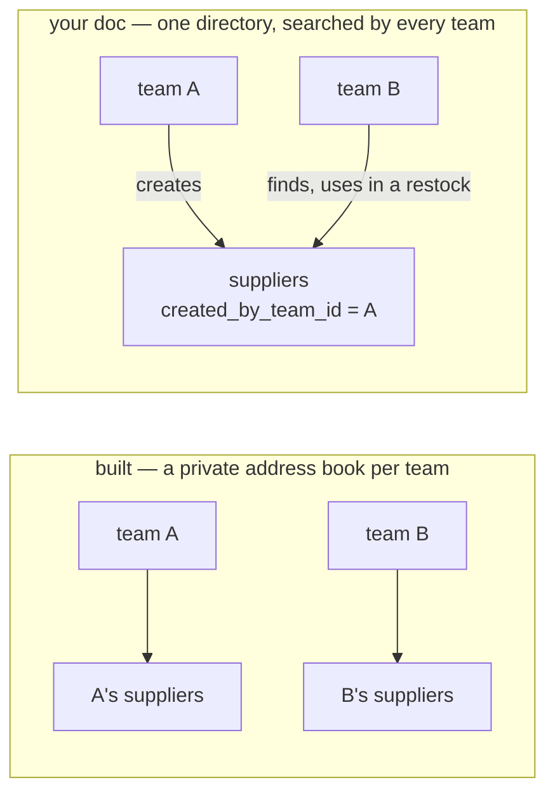
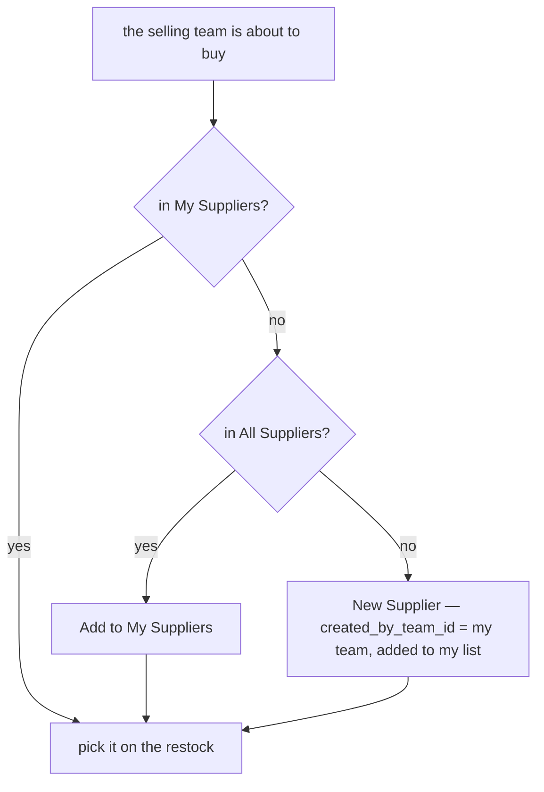
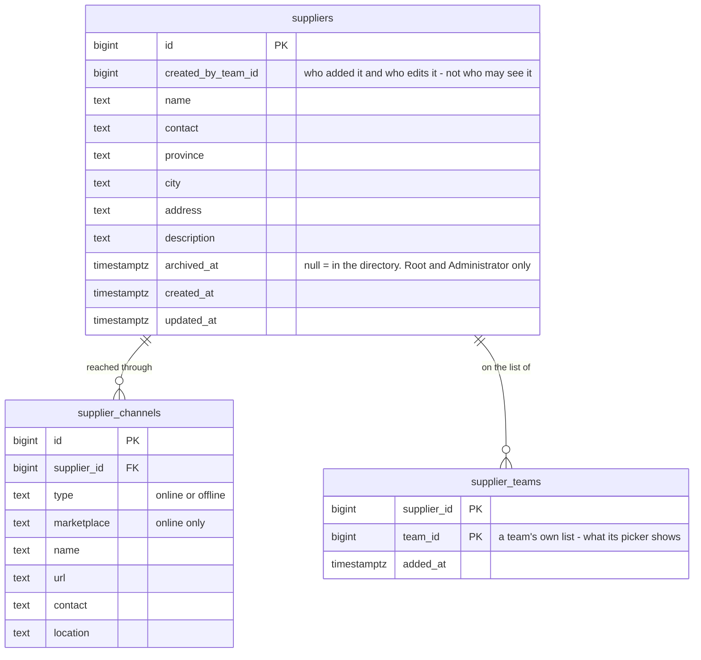
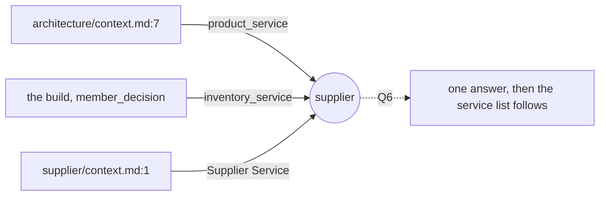
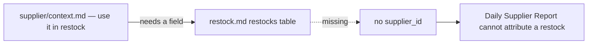

# Clarify — `supplier/context.md`

What I read out of [context.md](./context.md), and what has to be settled beside it. **That doc is yours — this
one is mine.** An answered point is deleted; what you settle is recorded in `context_decision.md`.

🆕 **First pass, 2026-10-06.** §Responsbility 1 already ships, inside `inventory_service`. What is new is
§Responsbility 2 — **a team finds another team's suppliers** — and `created_by_team_id`. Together they turn a
supplier from *one team's private contact* into *one directory of the company's vendors*, and most of what is
below follows from that one change.

## What already exists

Built in `inventory_service` (#103, #120): the `/suppliers` list, the supplier detail page, `SupplierSelect`.

| your doc | built | |
| --- | --- | --- |
| create | `SupplierCreate` — selling Owner, Admin | ✅ |
| update | `SupplierUpdate` | ✅ |
| delete | `SupplierDelete` — soft, `deleted = true`, frees the code | ✅ |
| use it in restock | `restock_requests.supplier_id` — optional, **the requesting team's own suppliers only**; copied onto every batch received from it | ✅ |
| discover / search other teams' suppliers | every read filters `team_id = the caller's team`. `SupplierByIds` crosses teams, but only for an id you already hold — it is not a search | ❌ |
| `created_by_team_id` | `team_id` — but it means **owner**: the only team that can see the row | 🔄 |
| — | `code` (unique per team), `name`, `contact`, `province`, `city`, `address`, `description` | not in your table |
| — | `supplier_channels` — how you reach them: **online** (a store on a marketplace, a link) or **offline** (a shop, a phone, a location) | not in your table |

## Critique

| # | Problem | → Recommend |
| --- | --- | --- |
| **1** | **"Discover" does not say whether team B USES A's supplier or COPIES it.** `created_by_team_id` reads as one shared row, but the build and the restock form both assume a supplier belongs to one team. This choice decides who edits, what delete does, and whether the Daily Supplier Report can add up across teams. | **One shared row, plus each team's own list** — [Q1](#question). Toko Melati on Shopee is one store whoever buys from it. |
| **2** | **A shared row breaks "delete".** Today delete hides the row. Shared, team A's delete would empty team B's picker for a vendor B still buys from. Same for edit: A renaming it rewrites B's records. | **Delete removes it from MY list only**; the creator edits — [Q2](#question). |
| **3** | **What another team SEES is not said.** A vendor's name, city and store link are facts about the vendor. What team A *paid* there, and how much, is A's business. ⚠ The built `SupplierService` says the opposite of your §2 — *"one team can never read another team's supplier"* — and the accept screen's `SupplierByIds` was the first crack in it. | **The supplier and its channels, in full; never another team's restocks or prices** — [Q3](#question). |
| **4** | **The table has no `name`.** `id`, `created_by_team_id` and two timestamps cannot be searched, so §2 has nothing to search on. The build's `code` is unique **per team**, so in a shared directory two teams' `TM01` collide. | **`name`, the address fields and the channels; drop `code`** — [Q4](#question). |
| **5** | ***"random url product"*** ([business_level.md:190](../business_level.md)) **is a purchase, not a vendor.** If each one-off link becomes a directory row, every other team's search fills with single-use entries. | **The supplier is whoever you paid**, and the link goes on the restock line — [Q5](#question). |
| **6** | **Your title says *Supplier Service*, and the supplier already has two other homes in your docs** — see [where-the-supplier-lives](#where-the-supplier-lives). | **Its own `supplier_service`** — [Q6](#question). |

## Recommendation

**One company-wide directory in its own `supplier_service`.** Any team may use any supplier; a team keeps its own
short list; only the creating team edits. Q1 comes first, because Q2–Q4 change shape if the answer is *copy*.

## Proposed Design

### The jobs

| who | does | how often |
| --- | --- | --- |
| selling Owner, Admin | add a vendor they have started buying from · fix its details · drop one they stopped using | weekly |
| selling Owner, Admin, CS | find a vendor before buying — first in the team's list, then in everyone's | weekly |
| selling CS | pick the vendor on a restock request | daily |
| warehouse crew | read the vendor's name on the delivery in their hands | daily |
| analytic | add up what the company bought from each vendor each day | every restock |

### Finding a vendor

### The data

- **Migration:** each built row becomes a directory row with `created_by_team_id = team_id`, plus one
  `supplier_teams` row for that team. A row already `deleted` gets no list row. `code` is dropped.
- **A restock keeps `supplier_id`.** Leaving `inventory_service` turns its foreign key into an opaque id, resolved
  through `SupplierByIds`, which is what the accept screen already does.

### The contract

| RPC | who | does |
| --- | --- | --- |
| `SupplierCreate` | selling Owner, Admin | a directory row + a row on my list |
| `SupplierUpdate` · `SupplierChannel*` writes | the **creating** team's Owner, Admin · Root, Administrator | edit the shared record |
| `SupplierList` | team members | paginated · filter `scope`: `MINE` (my list) or `ALL` (the directory) · `q` on name, city, channel name |
| `SupplierTeamAdd` | selling Owner, Admin | put a directory supplier on my list |
| `SupplierTeamRemove` | selling Owner, Admin | **the "delete" of your §1** — off my list, untouched for everyone else |
| `SupplierArchive` | Root, Administrator | take a duplicate or a vendor that is gone out of the directory |
| `SupplierByIds` · `SupplierDetail` | as today, any team | a name for an id · the full record |

### The screens

- **`/suppliers`** — two tabs, **My Suppliers** and **All Suppliers**. A row on *All* offers *Add to My
  Suppliers*. A row on *Mine* offers *Edit* (creator only) and *Remove from My Suppliers*, confirmed.
- **Supplier detail** — adds *Added by* (the creating team) to what it shows today.
- **The restock form's picker** — My Suppliers. When nothing matches, the empty state links to *All Suppliers*.

## Question

1. **When team B finds team A's supplier, does B use A's row or get a copy?** Critique 1.
   **→ Recommend: use A's row, and add it to B's own list (`supplier_teams`).** One row is one real vendor, so the
   Daily Supplier Report can say the company buys from Toko Melati through three teams — which is the leverage you
   would bargain with — and a corrected address reaches everyone. Copies bring back the duplicates the search was
   meant to prevent. The list keeps each team's picker short.
   *What breaks?* A team that wants to keep private notes about a vendor has nowhere to put them. Those would go
   on `supplier_teams` if you ever ask for them.

2. **Who may change a shared supplier, and what does "delete" do?** Critique 2. Three parts:

   | | the question | → Recommend |
   | --- | --- | --- |
   | **2a** | who edits the record and its channels? | **The creating team's Owner and Admin, plus Root and the Administrator.** A shared record changed by a team you do not know reads as corrupted data. A creator that has gone quiet leaves a wrong address, and Root fixes it |
   | **2b** | what does a team's *delete* do? | **It removes the supplier from that team's list, and nothing else.** Other teams' lists, past restocks and batches are untouched |
   | **2c** | can a directory row ever go? | **Archive only, by Root and the Administrator** — for duplicates and vendors that are gone. An archived supplier leaves the pickers and the search, and stays readable on every restock that named it |

3. **What does a team see of another team's supplier?** Critique 3.
   **→ Recommend: the record and its channels in full — name, city, contact, store links — and *Added by*.
   Never another team's restocks, prices or quantities.** A vendor's phone number is not a secret. What team A
   paid is. *"Who sells shoes, judging by what other teams bought"* is a bigger ask that exposes purchases — leave
   it out until you ask for it.

4. **What does a supplier carry?** Critique 4.
   **→ Recommend: `name` (required), `contact`, `province`, `city`, `address`, `description`, and its channels —
   as built. Drop `code`.** Unique per team, the code collides in a shared directory. A team prefix like the
   product code's ([the-code-is-composed-from-the-team-code](../product/context_decision.md#the-code-is-composed-from-the-team-code)) would fix the collision,
   but nobody scans a supplier at a shelf — people search for one by name, and city plus channel tell two
   *Toko Melati* apart better than a code does.

5. **Is a one-off product link a supplier?** Critique 5 — your
   [business_level.md:190](../business_level.md) says *"supplier can be just random url product"*.
   **→ Recommend: the supplier is whoever you paid — the store behind the link.** A Shopee link → that store, as
   an online channel. A plain website → the site, as an online channel with marketplace *Other*. The **product
   link itself** goes on the restock line — that is restock.md's to decide, see
   [restock-has-no-supplier](#restock-has-no-supplier).

6. **Does the supplier get its own `supplier_service`?** Critique 6 — your title says so; your architecture doc
   and the build say otherwise.
   **→ Recommend yes.** It is the only data whose reads are company-wide rather than team-scoped, it holds no
   quantity, and it follows the shop's precedent
   ([the-shop-gets-its-own-service](../shop/context_decision.md#the-shop-gets-its-own-service)). The cost:
   `restock_requests.supplier_id` stops being a real foreign key, and two tables and their data move.

# Contradiction

## where-the-supplier-lives

Three of your lines name three homes:

| where | says |
| --- | --- |
| [technical/architecture/context.md:7](../../technical/architecture/context.md) | `product_service` — *"catalogue, markup %, … supplier, LinkMap"* |
| [products-follow-the-unit-price](../project/member_decision.md#products-follow-the-unit-price) + the build | `inventory_service` — where `suppliers` and `supplier_channels` live today |
| [context.md:1](./context.md) | *"Supplier Service"* |

**→ Recommend:** settle it here ([Q6](#question)). Then update architecture/context.md's service list — that edit
is yours. It is the one list that restates every context's home, so every context that gains its own doc has
left it stale: `shop_service` and `financial_account_service` are missing from it too
([architecture clarify](../../technical/architecture/context_clarify.md)).

## restock-has-no-supplier

| where | says |
| --- | --- |
| [context.md:8](./context.md) | a supplier is for *"use it in restock"* |
| [inventory/restock.md](../inventory/restock.md) §Table Should We Have | `restocks` and `restock_items` have **no supplier field** |

The build has one: `restock_requests.supplier_id`, copied onto every batch received from it.
**→ Recommend:** `restocks.supplier_id` — one supplier per restock, because one parcel has one sender. Whether it
is required, and where the product link goes ([Q5](#question)), are restock.md's to answer: they move to its
clarify when that doc gets its pass.

