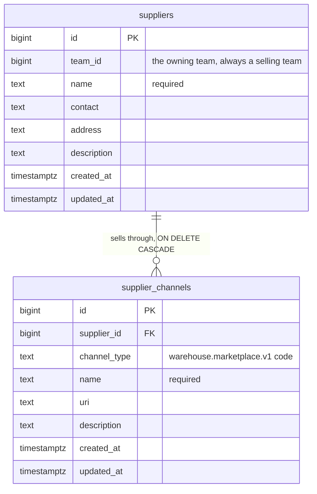
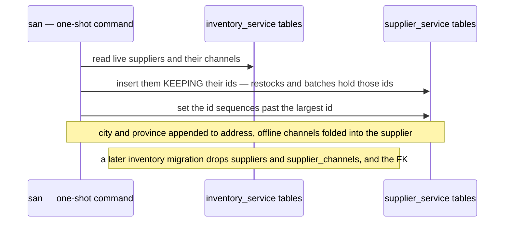
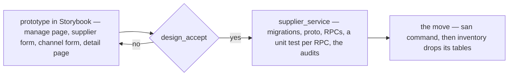
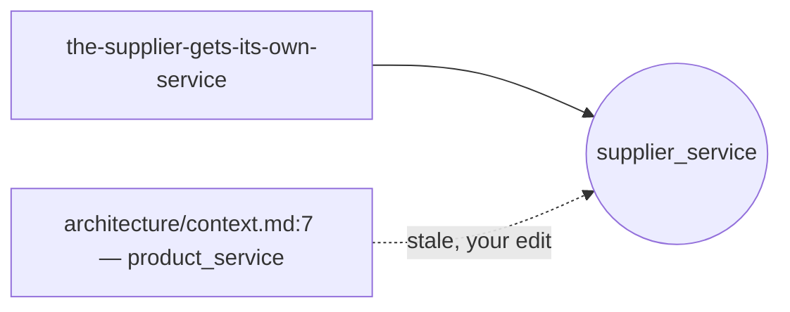

# Clarify — `supplier/context.md`

What I read out of [context.md](./context.md), and what has to be settled beside it. **That doc is yours — this
one is mine.** An answered point is deleted; what you settled is in [context_decision.md](./context_decision.md).

🔨 **The CRUD prototype is built (2026-10-06) and waits on your design_accept** — [Q10](#question). Preview it in
Storybook: **Pages/Suppliers/Suppliers**, **Pages/Suppliers/SupplierDetail**, **Components/Pickers/SupplierSelect**.

| | |
| --- | --- |
| ✅ answered (2026-10-06) | [Q7](#question) your edit — the shared marketplace list: [channel-type-is-the-marketplace-list](./context_decision.md#channel-type-is-the-marketplace-list) · [Q8](#question) drop all three, **hard delete**, against my recommendation: [no-province-city-or-soft-delete](./context_decision.md#no-province-city-or-soft-delete) · [Q6](#question) **its own `supplier_service`**, against my recommendation: [the-supplier-gets-its-own-service](./context_decision.md#the-supplier-gets-its-own-service) |
| ➡ moved | [Q2](#question) and the contradiction *restock-has-no-supplier* → [restock clarify](../inventory/restock_clarify.md#question) — *"for 2 we talk further in restock context"* |
| ✅ resolved | the contradiction *two-lists-of-marketplaces* — by your Q7 edit |
| ⏸ deferred | statistics, and seeding `supplier_channel_products` — your §Whats defer · [parked](#parked--talk-later) |
| ✅ your preview (2026-10-06, later) | the Channels tab searches, filters by type and pages — [the-channels-tab-searches-filters-and-pages](./context_decision.md#the-channels-tab-searches-filters-and-pages) · the Products tab searches and pages — [the-products-tab-searches-and-pages](./context_decision.md#the-products-tab-searches-and-pages) · **Discover Suppliers** and its detail, across every team — [discover-searches-every-teams-suppliers](./context_decision.md#discover-searches-every-teams-suppliers). All built |
| ✅ your preview (2026-10-06) | two horizontal tabs, **Channels** (one list with badges) and **Products** (sample rows) — [supplier-detail-has-channels-and-products-tabs](./context_decision.md#supplier-detail-has-channels-and-products-tabs), built. ⛔ My first reading, one *Channels* tab, was a misread: [superseded-channels-are-a-horizontal-tab](./context_decision.md#superseded-channels-are-a-horizontal-tab) |
| 🆕 +1 (2026-10-06) | [Q10](#question) — the design_accept of the CRUD prototype, with the two nods left over: the move, and *Other* vs *Custom* |
| ⛔ still stale | your [technical/architecture/context.md:7](../../technical/architecture/context.md) puts the supplier in `product_service` — [where-the-supplier-lives](#where-the-supplier-lives) |

## Proposed Design

### The CRUD pass — what changes from the build

| | built (`inventory_service`) | becomes (`supplier_service`) | decided by |
| --- | --- | --- | --- |
| the service | inside `inventory_service` | `backend/services/supplier_service/` | [the-supplier-gets-its-own-service](./context_decision.md#the-supplier-gets-its-own-service) |
| the contract | `warehouse.inventory.v1` | `warehouse.supplier.v1` — ⚠ my spec | the same |
| `suppliers.code` | required, unique per team | — | [the-supplier-has-no-code](./context_decision.md#the-supplier-has-no-code) |
| `suppliers.province`, `city`, `deleted` | built | — · delete is a hard delete | [no-province-city-or-soft-delete](./context_decision.md#no-province-city-or-soft-delete) |
| `SupplierCreate` | any team | refuses a team that is not SELLING | [only-a-selling-team-has-suppliers](./context_decision.md#only-a-selling-team-has-suppliers) |
| `supplier_channels.type`, `contact`, `location` | online / offline | — every channel is a store | [the-supplier-lists-only-its-online-stores](./context_decision.md#the-supplier-lists-only-its-online-stores) |
| `supplier_channels.marketplace` | the shared list | `channel_type` — the same shared list | [channel-type-is-the-marketplace-list](./context_decision.md#channel-type-is-the-marketplace-list) |
| `supplier_channels.url` | optional | `uri` | the same |
| `supplier_channels.description` | — | 🆕 | the same |
| `restock_requests.supplier_id` | a real FK | an opaque id | [the-supplier-gets-its-own-service](./context_decision.md#the-supplier-gets-its-own-service) |

### The data

### The contract

| RPC | who | |
| --- | --- | --- |
| `SupplierCreate` | selling Owner, Admin | name, contact, address, description · refuses a non-selling team |
| `SupplierUpdate` | the owning team's Owner, Admin | the same fields |
| `SupplierDelete` | the owning team's Owner, Admin | hard delete; channels cascade · confirmed in the UI |
| `SupplierList` | the team | paginated, `q` on name · my team's — the discover scope comes after CRUD |
| `SupplierDetail` · `SupplierByIds` | as today | `SupplierByIds` stays cross-team — the warehouse reads a delivery's vendor |
| `SupplierChannelCreate` · `Update` | selling Owner, Admin | `channel_type`, `name`, `uri`, `description` |
| `SupplierChannelList` · `Delete` | as today | |

### Moving what exists — ⚠ my proposal

The shop's move left this as a technical item. The supplier's is small enough to propose here:

A `san` command rather than a migration, because a migration of one service must not write another's tables (HARD
RULE 3).

### The screens

- **Suppliers** (`/inventories/suppliers`) — the Code column goes. Delete confirms, and says the supplier is removed
  for good.
- **Supplier form** — name, contact, address, description.
- **Supplier detail** — the supplier's fields on top; two horizontal tabs, **Channels** and **Products**
  ([supplier-detail-has-channels-and-products-tabs](./context_decision.md#supplier-detail-has-channels-and-products-tabs)).
- **Channel form** — channel type (`MarketplaceSelect`), name, link, description. No online/offline switch.
- **`SupplierSelect`** — shows and searches the name.

**Discover is prototyped, on SAMPLE data:** the pages are built
([discover-searches-every-teams-suppliers](./context_decision.md#discover-searches-every-teams-suppliers)); the cross-team
reads are supplier_service's to build. **Not in the CRUD pass:** the restock's side
([restock clarify](../inventory/restock_clarify.md#question)), and everything [parked](#parked--talk-later).

## Question

1. ✅ **Answered — B uses A's row**:
   [a-team-restocks-from-another-teams-supplier](./context_decision.md#a-team-restocks-from-another-teams-supplier).
2. ➡ **Moved to the restock context** (2026-10-06) — *"for 2 we talk further in restock context"*: now
   [restock Q1 and Q2](../inventory/restock_clarify.md#question).
3. ✅ **Answered — another team sees everything**:
   [another-team-sees-everything-of-a-supplier](./context_decision.md#another-team-sees-everything-of-a-supplier).
4. ✅ **Answered — no code**: [the-supplier-has-no-code](./context_decision.md#the-supplier-has-no-code).
5. ✅ **Answered — a website is a `custom` channel**:
   [the-supplier-lists-only-its-online-stores](./context_decision.md#the-supplier-lists-only-its-online-stores).
6. ✅ **Answered — its own `supplier_service`**:
   [the-supplier-gets-its-own-service](./context_decision.md#the-supplier-gets-its-own-service).
7. ✅ **Answered — the shared marketplace list**:
   [channel-type-is-the-marketplace-list](./context_decision.md#channel-type-is-the-marketplace-list).
8. ✅ **Answered — drop all three, hard delete**:
   [no-province-city-or-soft-delete](./context_decision.md#no-province-city-or-soft-delete).
9. ✅ **Closed — products are stored per channel**:
   [products-hang-off-a-channel](./context_decision.md#products-hang-off-a-channel).

Kept as lines so the numbers hold.

10. 🆕 **design_accept — the CRUD prototype.** Built to the [Proposed Design](#proposed-design), in Storybook, and wired
    to the RUNNING app through a translation step (`features/suppliers/adapt.ts`): the screens speak the decided shape,
    and the step makes up the code and the online type today's server still demands. It is deleted when
    `supplier_service` lands — the screens do not change then.

    | story | what to look at |
    | --- | --- |
    | Pages/Suppliers/Suppliers — *Default*, *AWarehouseTeam* | Name · Contact · Address, no Code or City · an old city folded into the address · New Supplier for a selling team only |
    | Pages/Suppliers/SupplierDetail — *Default*, *ProductsTab*, *AWebsiteOnly*, *NoChannelsYet* | the **Channels** and **Products** tabs · the channels by marketplace badge · an old offline shop reads as *Other* · the ⚠ 1 and ⚠ 2 marks |
    | Pages/Suppliers/SupplierDetail — *ManyChannels* | the Channels tab's search, type filter and pager; the Products tab's search and pager |
    | Pages/Suppliers/DiscoverSuppliers — *Default* | every team's suppliers, the owning team on each row, search · type filter · pager — ⚠ sample |
    | Pages/Suppliers/DiscoverSupplierDetail — *Default*, *ProductsTab* | another team's supplier, read-only, the same two tabs — ⚠ sample |
    | the menu | **My Supplier** and **Discover Supplier** under Inventories (⚠ my naming, after My Product / Discover Product) |
    | Components/Pickers/SupplierSelect | the name alone, searched by name |

    ⚠ **Two marks:** a channel's description is typed and thrown away — the old server has no field for it (⚠ 1); and
    the Products tab is invented rows, two per real channel, until the linking is designed (⚠ 2).
    Delete removes the supplier from every screen, though today's server still keeps the row underneath; the move does
    not carry it.

    | | the question | → Recommend |
    | --- | --- | --- |
    | **10a** | accept the screens? | **Yes**, then build `supplier_service` |
    | **10b** | the move of the existing suppliers — a one-shot `san` command copying rows **with their ids**, then `inventory_service` drops its tables ([Moving what exists](#moving-what-exists---my-proposal)) | **Yes** — restocks and batches hold those ids |
    | **10c** | the label on `custom`: the shared list says **Other** | **Keep Other** — one word for one value, on shops and suppliers alike |

## Parked — talk later

Your §Whats defer, and [linking-products-is-deferred](./context_decision.md#linking-products-is-deferred) ·
[statistics-are-deferred](./context_decision.md#statistics-are-deferred). **Not counted as open.** Written down only so
the later conversation starts from here:

| | the point |
| --- | --- |
| who writes a link | the owning team, by hand — or a restock line, automatically, once a product arrives from that channel? |
| whose product | `product_id` is a product in one team's catalogue. When team B restocks a product from A's channel, is it B's product that is linked, A's, or both? |
| what the discover page shows | the product's name and picture — and a price, which the link table does not have? |
| search by product | *"who sells this item?"* — does the discover search reach the linked products? |
| a restock's channel | a restock names a supplier, not a channel. Linking per channel may need the restock to say which store it was bought from |
| statistics | what a supplier's figures are (the analytic doc's *Daily Supplier Report*), and whether another team sees them under [another-team-sees-everything-of-a-supplier](./context_decision.md#another-team-sees-everything-of-a-supplier) |

# Contradiction

**Re-examined after the discover pages (2026-10-06):** [manage-and-discover-are-two-pages](./context_decision.md#manage-and-discover-are-two-pages)
said discover searches *every OTHER team's* suppliers; your *"search supplier across all team"* includes the
caller's own. A one-word drift in my record, not in your doc — annotated on the decision, and the pages follow your
wording. **Earlier:** *two-lists-of-marketplaces* is resolved by your Q7 edit;
*restock-has-no-supplier* moved to the [restock clarify](../inventory/restock_clarify.md#restock-has-no-supplier) with
Q2. One stands.

## where-the-supplier-lives

✅ **Decided — [the-supplier-gets-its-own-service](./context_decision.md#the-supplier-gets-its-own-service).** What is
left is the stale line:

| where | says |
| --- | --- |
| [technical/architecture/context.md:7](../../technical/architecture/context.md) | `product_service` — *"catalogue, markup %, … supplier, LinkMap"* ⛔ stale |
| [products-follow-the-unit-price](../project/member_decision.md#products-follow-the-unit-price) | *"`supplier` and `supplier_channel` live in `inventory_service`"* — true when written, annotated as moved |

**→ Recommend:** update architecture/context.md's service list — add `supplier_service`, and take the supplier out of
`product_service`'s line. That edit is yours. It is the one list that restates every context's home, so every context
that gets a service of its own leaves it stale: `shop_service` and `financial_account_service` are missing from it too
([architecture clarify](../../technical/architecture/context_clarify.md)).

