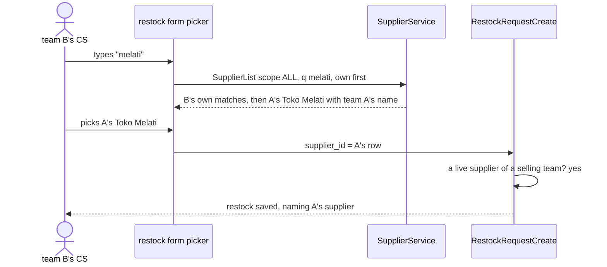
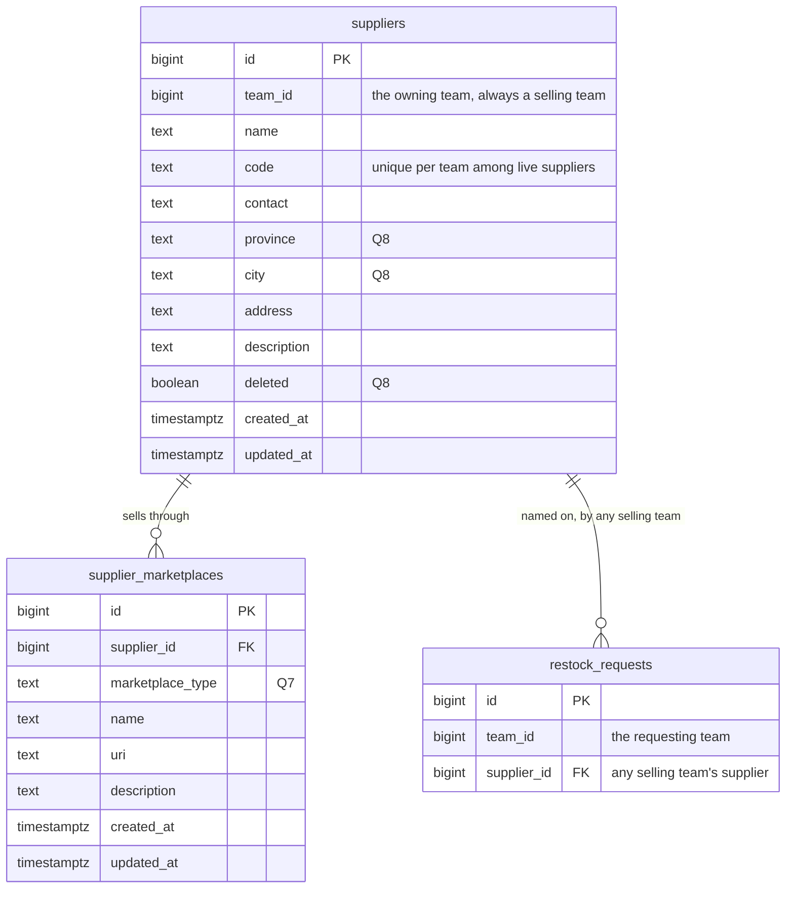
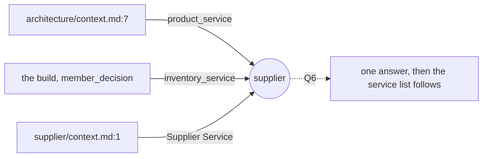
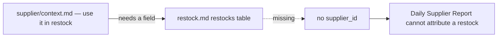
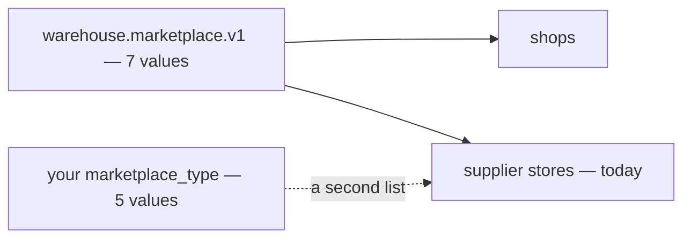

# Clarify — `supplier/context.md`

What I read out of [context.md](./context.md), and what has to be settled beside it. **That doc is yours — this
one is mine.** An answered point is deleted; what you settled is in [context_decision.md](./context_decision.md).

| | |
| --- | --- |
| 🔄 your edit (2026-10-06, third) | §General 3 and 4, and §What Frontend Expected |
| ✅ answered by it | [Q1](#question) — B uses A's row, no copy, **against my recommendation**: [a-team-restocks-from-another-teams-supplier](./context_decision.md#a-team-restocks-from-another-teams-supplier) · [only-a-selling-team-has-suppliers](./context_decision.md#only-a-selling-team-has-suppliers) · [manage-and-discover-are-two-pages](./context_decision.md#manage-and-discover-are-two-pages) |
| 🔄 re-opened | [Q2](#question) — with A's row on B's restock, A's edit and delete reach B, and B's restock form has to find A's supplier |
| 🔄 revised | [Q6](#question) — *"frontend use this service"* reads as the `SupplierService` the pages call |
| ✅ earlier | [Q4](#question) the code stays · [Q5](#question) a website is a `custom` marketplace |

## What already exists

Built in `inventory_service` (#103, #120): the manage page, the supplier detail page, `SupplierSelect`.

| your doc | built | |
| --- | --- | --- |
| §General 1 — create · update · delete · use in restock | ✅ — but only the team's **own** suppliers on its restock | ✅ |
| §General 2 — discover other teams' suppliers | every read filters by the caller's team. `SupplierByIds` crosses teams only for an id you already hold | ❌ |
| §General 3 — use another team's supplier on my restock | [restock_request_create.go:16](../../../backend/services/inventory_service/inventory_v1/restock_request_create.go#L16) refuses it | ❌ |
| §General 4 — only a selling team has suppliers | `SupplierCreate` writes into any team — Root and the Administrator can create one in a warehouse team | ⚠ |
| page 1 — manage | `/inventories/suppliers` | ✅ |
| page 2 — discover | — | ❌ |
| §Table Must Have | the fields, plus `province`, `city`, `deleted` ([Q8](#question)) · channels, not marketplaces ([decided](./context_decision.md#the-supplier-lists-only-its-online-stores)) | 🔄 |

## Critique

| # | Problem | → Recommend |
| --- | --- | --- |
| **1** | **A's row on B's restock means A's edit and delete reach B.** A rename changes the name on B's past restocks. A delete today hides the row from every read, so it disappears from B's picker while B still buys there. | **Accept it, with delete kept soft** — [Q2a](#question). |
| **2** | **How B's restock form finds A's supplier is not said.** The discover page *finds* it, but the restock form's picker is where it is *used*, and today that picker shows B's own only. | **The picker searches every selling team's, B's own first** — [Q2b](#question). |
| **3** | **What another team sees on the discover page is not said.** A vendor's name, contact and stores are facts about the vendor. What A *paid* there is A's business. | **The supplier and its stores, plus the owning team — never A's restocks or prices** — [Q3](#question). |
| **4** | ***Supplier Service* — your architecture doc puts the supplier in `product_service`** — see [where-the-supplier-lives](#where-the-supplier-lives). | **Stay in `inventory_service`** — [Q6](#question). |
| **5** | **`marketplace_type` is a second list of marketplaces** — see [two-lists-of-marketplaces](#two-lists-of-marketplaces). | **One list, with `custom` as its *Other*** — [Q7](#question). |
| **6** | **Three built fields are not on your list** — `province`, `city`, `deleted`. | **Keep all three** — [Q8](#question). |

## Recommendation

**Q2 first** — it decides what the restock form's picker shows and what a delete does to another team. The rest of the
build follows from the three decisions already made: the discover page, opening the reads across teams, relaxing the
restock's check, and enforcing §General 4.

## Proposed Design

### The jobs

| who | does | how often |
| --- | --- | --- |
| selling Owner, Admin | add a vendor · fix its details · delete one the team stopped using | weekly |
| selling Owner, Admin, CS | look for a vendor other teams already buy from | weekly |
| selling CS | pick the vendor on a restock request — ours or another team's | daily |
| warehouse crew | read the vendor's name on the delivery in their hands | daily |

### Using another team's supplier

### The data

### The contract

| RPC | who | change |
| --- | --- | --- |
| `SupplierCreate` | selling Owner, Admin | + refuses a team that is not SELLING |
| `SupplierUpdate` · `SupplierDelete` | the **owning** team's Owner, Admin | none |
| `SupplierList` | the team | + filter `scope`: `MINE` (manage page) · `OTHERS` (discover page) · `ALL`, own first (the restock picker). Every row carries its `team_id`; the team's name comes from `team_service`, as elsewhere |
| `SupplierDetail` · `SupplierMarketplaceList` | the team | + answer for another team's supplier, instead of `NotFound` |
| `SupplierMarketplace*` writes | the owning team's Owner, Admin | replaces `SupplierChannel*` ([decided](./context_decision.md#the-supplier-lists-only-its-online-stores)) |
| `RestockRequestCreate` · `RestockRequestUpdate` | as today | the supplier check: a live supplier of **any selling team** |

### The screens

- **Suppliers** (`/inventories/suppliers`) — as built, my team's.
- **Discover Suppliers** (`/inventories/suppliers/discover`) — a search, the marketplace filter, and rows of name ·
  owning team · stores · city. A row opens the detail page.
- **Supplier detail** — another team's supplier opens **read-only**: no Edit or Delete, and the owning team is shown.
- **`SupplierSelect`** in the restock form — two groups, *Our suppliers* then *Other teams*, each row of the second
  carrying its team.

## Question

1. ✅ **Answered 2026-10-06 — B uses A's row**:
   [a-team-restocks-from-another-teams-supplier](./context_decision.md#a-team-restocks-from-another-teams-supplier).
   Kept as a line so the numbers hold.

2. 🔄 **Re-opened by Q1's answer: what reaches B from A, and how B finds it.** Critiques 1 and 2.

   | | the question | → Recommend |
   | --- | --- | --- |
   | **2a** | A's edit and delete reach B's restocks — accept? | **Accept, with delete soft.** Only A's Owner and Admin (and Root, the Administrator) edit. A delete takes it out of every picker and the discover page, and every restock that named it keeps showing it — `SupplierByIds` already returns deleted rows. Refusing A's delete while B still buys there would mean tracking who uses what across teams, for a rare case. B can always create its own |
   | **2b** | how does B's restock form find A's supplier? | **The picker searches every selling team's live suppliers, B's own listed first**, another team's with that team's name. The discover page is for looking before buying; the picker is where the buying happens, and B should not have to go to another page first. The alternative, B saving a discovered supplier to a list, needs a table of its own |

   *What breaks?* A could rename a row into a different vendor, and B's past restocks would follow it. I think that
   is misuse, not a design case. If you disagree, the restock would have to keep its own copy of the name.

3. **What does a team see of another team's supplier?** Critique 3.
   **→ Recommend: the supplier and its stores in full, and the owning team's name — never that team's restocks,
   prices or quantities.** The owning team's name tells B who to ask. What A paid is A's business.
   *"Who sells shoes, judging by what other teams bought"* exposes purchases — leave it out until you ask for it.

4. ✅ **Answered by your edit** — the code stays: [the-supplier-keeps-its-code](./context_decision.md#the-supplier-keeps-its-code).

5. ✅ **Answered by your edit** — a website is a `custom` marketplace on a supplier:
   [the-supplier-lists-only-its-online-stores](./context_decision.md#the-supplier-lists-only-its-online-stores).

6. **Does *Supplier Service* mean its own backend service, or the `SupplierService` already in `inventory_service`?**
   Critique 4.
   **→ Recommend: the one already built.** Your §What Frontend Expected says the two pages *"use this service"* — what
   a page calls is the RPC service, and that is `SupplierService`. Staying keeps `restock_requests.supplier_id` a real
   foreign key, and nothing in your doc needs a separate service. Moving costs two tables and that foreign key.

7. **Is `marketplace_type` its own list, or the shared `Marketplace` list?** Critique 5.
   **→ Recommend: the shared list** (`warehouse.marketplace.v1`), with your `custom` as its *Other*. A platform is
   then added once for shops and suppliers alike, and a team can buy from a Blibli or Bukalapak store as easily as it
   sells on one. If you are deliberately limiting supplier stores to the four, say so and I will record that.

8. **Three built fields are not on your list: `province`, `city`, `deleted`. Drop them?** Critique 6.
   **→ Recommend: keep all three.** `deleted` is what makes [Q2a](#question)'s soft delete possible: restocks and
   batches name the supplier forever, so a hard delete would orphan them — and now across teams. `province` and `city`
   are what the discover page filters on — *"a vendor in Bandung"* cannot be filtered out of a free-text address.

# Contradiction

**Re-examined after the third edit: nothing new in your doc.** §General 3 changes the build's rule that a team sees only
its own suppliers; that is recorded as a decision with the sites it changes
([a-team-restocks-from-another-teams-supplier](./context_decision.md#a-team-restocks-from-another-teams-supplier)), not a
contradiction. Three stand from before.

## where-the-supplier-lives

| where | says |
| --- | --- |
| [technical/architecture/context.md:7](../../technical/architecture/context.md) | `product_service` — *"catalogue, markup %, … supplier, LinkMap"* |
| [products-follow-the-unit-price](../project/member_decision.md#products-follow-the-unit-price) + the build | `inventory_service`, as `SupplierService` |
| [context.md:1](./context.md) | *"Supplier Service"* — the name of the built `SupplierService`, or a service of its own ([Q6](#question)) |

**→ Recommend:** settle it in [Q6](#question), then update architecture/context.md's service list — that edit is
yours. It is the one list that restates every context's home, so every context with a doc of its own has left it
stale: `shop_service` and `financial_account_service` are missing from it too
([architecture clarify](../../technical/architecture/context_clarify.md)).

## restock-has-no-supplier

| where | says |
| --- | --- |
| [context.md](./context.md) §General 1 and 3 | a supplier is for *"use it in restock"* — now any selling team's |
| [inventory/restock.md](../inventory/restock.md) §Table Should We Have | `restocks` and `restock_items` have **no supplier field** |

The build has one: `restock_requests.supplier_id`, copied onto every batch received from it.
**→ Recommend:** `restocks.supplier_id`, one supplier per restock, because one parcel has one sender. Whether it is
required, and whether a one-off product link goes on the restock line, are restock.md's to answer. They move to its
clarify when that doc gets its pass.

## two-lists-of-marketplaces

| where | says |
| --- | --- |
| [context.md](./context.md) §Table Must Have 2 | `marketplace_type` — `shopee` · `lazada` · `tiktok` · `tokopedia` · `custom` |
| [a-shop-is-a-name-a-code-and-a-marketplace](../shop/context_decision.md#a-shop-is-a-name-a-code-and-a-marketplace) | one list of seven, *"shared with supplier channels"* — adds Blibli and Bukalapak, and calls the rest *Other* |

**→ Recommend:** one list ([Q7](#question)). Two lists drift: a platform added for shops is missing for suppliers,
and *Other* and `custom` become two words for one thing.

