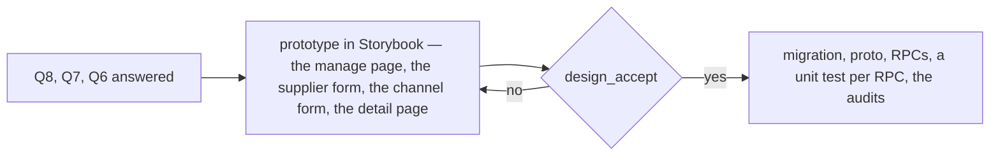
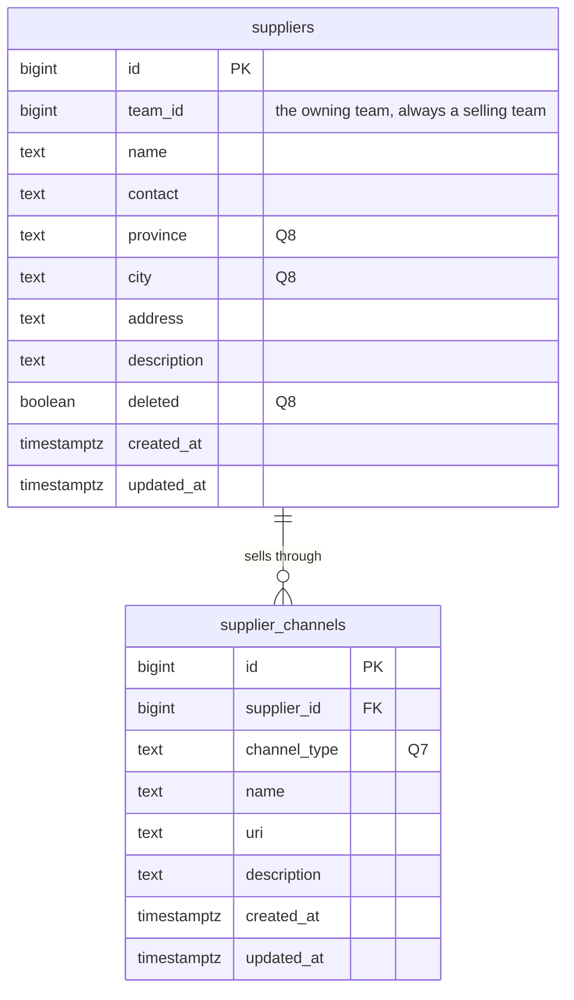
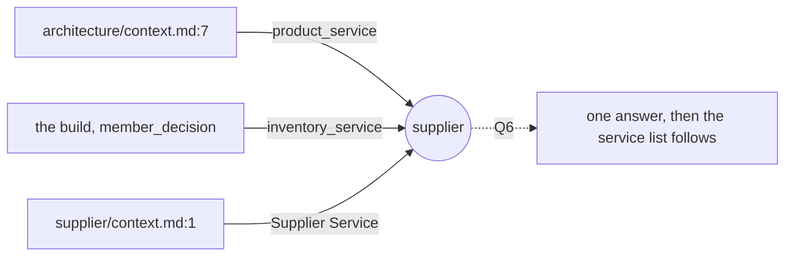
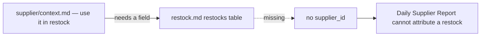
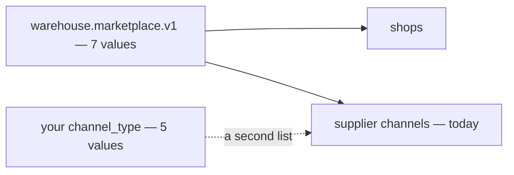

# Clarify — `supplier/context.md`

What I read out of [context.md](./context.md), and what has to be settled beside it. **That doc is yours — this
one is mine.** An answered point is deleted; what you settled is in [context_decision.md](./context_decision.md).

| | |
| --- | --- |
| 🔄 your fourth edit (2026-10-06) | `code` removed · the channels table keeps the name `supplier_channels`, with `channel_type` · 🆕 `supplier_channel_products` |
| ✅ recorded | [the-supplier-has-no-code](./context_decision.md#the-supplier-has-no-code) — reverses Q4's earlier answer · [products-hang-off-a-channel](./context_decision.md#products-hang-off-a-channel) — closes [Q9](#question) · [linking-products-is-deferred](./context_decision.md#linking-products-is-deferred) — in chat: *"we talk later … focus basic crud first"* |
| 🎯 focus | **Basic CRUD of suppliers and channels.** Three questions decide its shape — [Q8](#question), [Q7](#question), [Q6](#question) — and [Q2a](#question) decides its delete. The linking is [parked](#parked--talk-later) |
| ✅ earlier | [Q1](#question) B uses A's row · [Q3](#question) another team sees everything · [Q5](#question) a website is a `custom` channel |

## What already exists

Built in `inventory_service` (#103, #120): the manage page, the supplier detail page, `SupplierSelect`.

| your doc | built | |
| --- | --- | --- |
| §General 1 — create · update · delete | ✅ — `SupplierCreate` · `SupplierUpdate` · `SupplierDelete` (soft) | ✅ |
| §General 1, 3 — use in restock, any team's | own team's only — [restock_request_create.go:16](../../../backend/services/inventory_service/inventory_v1/restock_request_create.go#L16) | ❌ |
| §General 2 — discover | every read filters by the caller's team | ❌ |
| §General 4 — only a selling team | `SupplierCreate` writes into any team | ⚠ |
| `suppliers` | `name`, `contact`, `address`, `description` ✅ · `code` — to drop · `province`, `city`, `deleted` — not on your list ([Q8](#question)) | 🔄 |
| `supplier_channels` | the name matches · `type` online/offline, `marketplace`, `url`, `contact`, `location` → `channel_type`, `uri`, `description` ([decided](./context_decision.md#the-supplier-lists-only-its-online-stores)) | 🔄 |
| `supplier_channel_products` | — | [parked](#parked--talk-later) |

## Critique

| # | Problem | → Recommend |
| --- | --- | --- |
| **1** | **A's row on B's restock means A's edit and delete reach B.** A rename changes the name on B's past restocks; a delete takes it out of B's picker while B still buys there. | **Accept it, with delete kept soft** — [Q2a](#question). |
| **2** | **How B's restock form finds A's supplier is not said.** Not CRUD — it comes with §General 3. | **The picker searches every selling team's, B's own first** — [Q2b](#question). |
| **3** | ***Supplier Service* — your architecture doc puts the supplier in `product_service`** — see [where-the-supplier-lives](#where-the-supplier-lives). It matters NOW: the CRUD pass rewrites the tables, and it should do so in the service they will stay in. | **Stay in `inventory_service`** — [Q6](#question). |
| **4** | **`channel_type` is a second list of marketplaces** — see [two-lists-of-marketplaces](#two-lists-of-marketplaces). The CRUD pass writes it into the proto. | **One list, with `custom` as its *Other*** — [Q7](#question). |
| **5** | **Three built fields are not on your list** — `province`, `city`, `deleted`. The CRUD pass's migration either drops them or keeps them. | **Keep all three** — [Q8](#question). |

## Recommendation

**Answer Q8, Q7 and Q6, and the CRUD pass can start** — they fix its table, its proto and its home. Q2a fixes what its
delete does. Q2b waits for the restock side of §General 3.

## Proposed Design

### The CRUD pass — what changes from the build

| | built | becomes | why |
| --- | --- | --- | --- |
| `suppliers.code` | required, unique per team | dropped | [the-supplier-has-no-code](./context_decision.md#the-supplier-has-no-code) |
| `suppliers.province`, `city` | optional | kept, if Q8 | [Q8](#question) |
| `suppliers.deleted` | soft delete | kept, if Q8 and Q2a | [Q2a](#question), [Q8](#question) |
| `SupplierCreate` | any team | refuses a team that is not SELLING | [only-a-selling-team-has-suppliers](./context_decision.md#only-a-selling-team-has-suppliers) |
| `supplier_channels.type` | online · offline | dropped — every channel is a store | [the-supplier-lists-only-its-online-stores](./context_decision.md#the-supplier-lists-only-its-online-stores) |
| `supplier_channels.marketplace` | the shared list of 7 | `channel_type` — which list is Q7 | [Q7](#question) |
| `supplier_channels.url` | optional | `uri` | decided |
| `supplier_channels.contact`, `location` | offline only | dropped — folded into the supplier on migration | decided |
| `supplier_channels.description` | — | 🆕 | decided |

Frontend-first, as every pass is:

### The data — after the CRUD pass

### The contract — the CRUD pass

| RPC | who | change |
| --- | --- | --- |
| `SupplierCreate` · `SupplierUpdate` | selling Owner, Admin | − `code` · Create refuses a non-selling team |
| `SupplierDelete` | selling Owner, Admin | none — soft, if Q2a |
| `SupplierList` · `SupplierDetail` · `SupplierByIds` | as today | − `code`, and the code sort |
| `SupplierChannelCreate` · `Update` | selling Owner, Admin | `channel_type`, `name`, `uri`, `description` — − `type`, `contact`, `location` |
| `SupplierChannelList` · `Delete` | as today | none |

**After the CRUD pass, not in it:** the discover page and the cross-team reads
([manage-and-discover-are-two-pages](./context_decision.md#manage-and-discover-are-two-pages)), the restock's
any-team check ([a-team-restocks-from-another-teams-supplier](./context_decision.md#a-team-restocks-from-another-teams-supplier)),
and everything [parked](#parked--talk-later).

### The screens — the CRUD pass

- **Suppliers** (`/inventories/suppliers`) — the Code column goes; rows are keyed by name.
- **Supplier form** — name, contact, address, description (and province, city, if Q8). No code.
- **Channel form** — channel type, name, link, description. No online/offline switch, no contact or location.
- **`SupplierSelect`** — shows and searches the name.

## Question

1. ✅ **Answered 2026-10-06 — B uses A's row**:
   [a-team-restocks-from-another-teams-supplier](./context_decision.md#a-team-restocks-from-another-teams-supplier).
   Kept as a line so the numbers hold.

2. **What reaches B from A, and how B finds it.** Critiques 1 and 2.

   | | the question | → Recommend |
   | --- | --- | --- |
   | **2a** | A's edit and delete reach B's restocks — accept? | **Accept, with delete soft.** Only A's Owner and Admin (and Root, the Administrator) edit. A delete takes it out of every picker and the discover page, and every restock that named it keeps showing it — `SupplierByIds` already returns deleted rows. Refusing A's delete while B still buys there would mean tracking who uses what across teams, for a rare case |
   | **2b** | how does B's restock form find A's supplier? | **The picker searches every selling team's live suppliers, B's own listed first**, another team's with that team's name. B should not have to visit the discover page before every restock. *Not CRUD — it can wait for the restock side of §General 3* |

3. ✅ **Answered 2026-10-06 — another team sees everything**:
   [another-team-sees-everything-of-a-supplier](./context_decision.md#another-team-sees-everything-of-a-supplier).
   Kept as a line so the numbers hold.

4. ✅ **Answered by your fourth edit — no code**: [the-supplier-has-no-code](./context_decision.md#the-supplier-has-no-code),
   which reverses the earlier *keep it*. Kept as a line so the numbers hold.

5. ✅ **Answered by your edit** — a website is a `custom` channel on a supplier:
   [the-supplier-lists-only-its-online-stores](./context_decision.md#the-supplier-lists-only-its-online-stores).

6. **Does *Supplier Service* mean its own backend service, or the `SupplierService` already in `inventory_service`?**
   Critique 3.
   **→ Recommend: the one already built.** Your §What Frontend Expected says the two pages *"use this service"* — what
   a page calls is the RPC service, and that is `SupplierService`. Staying keeps `restock_requests.supplier_id` a real
   foreign key, and nothing in your doc needs a separate service. Moving costs two tables and that foreign key — and
   if it is going to move, the CRUD pass is the cheapest moment, because it rewrites the tables anyway.

7. **Is `channel_type` its own list, or the shared `Marketplace` list?** Critique 4.
   **→ Recommend: the shared list** (`warehouse.marketplace.v1`), with your `custom` as its *Other*. A platform is
   then added once for shops and suppliers alike, and a team can buy from a Blibli or Bukalapak store as easily as it
   sells on one. If you are deliberately limiting supplier channels to the four, say so and I will record that.

8. **Three built fields are not on your list: `province`, `city`, `deleted`. Drop them?** Critique 5.
   **→ Recommend: keep all three.** `deleted` is what makes [Q2a](#question)'s soft delete possible: restocks and
   batches name the supplier forever, so a hard delete would orphan them — and now across teams. `province` and `city`
   are what the discover page will filter on — *"a vendor in Bandung"* cannot be filtered out of a free-text address.

9. ✅ **Closed by your fourth edit** — products are stored per channel, not derived from restocks:
   [products-hang-off-a-channel](./context_decision.md#products-hang-off-a-channel). What was left of it is
   [parked](#parked--talk-later). Kept as a line so the numbers hold.

## Parked — talk later

[linking-products-is-deferred](./context_decision.md#linking-products-is-deferred). **Not counted as open.** Written
down only so the later conversation starts from here:

| | the point |
| --- | --- |
| who writes a link | the owning team, by hand — or a restock line, automatically, once a product arrives from that channel? |
| whose product | `product_id` is a product in one team's catalogue. When team B restocks a product from A's channel, is it B's product that is linked, A's, or both? |
| what the discover page shows | the product's name and picture — and a price, which the link table does not have? |
| search by product | *"who sells this item?"* — does the discover search reach the linked products? |
| a restock's channel | a restock names a supplier, not a channel. Linking per channel may need the restock to say which store it was bought from |

# Contradiction

**Re-examined after the fourth edit:** nothing new. `code` and `supplier_channel_products` each replace a decision, and
both are recorded as decisions rather than contradictions. Three stand from before.

## where-the-supplier-lives

| where | says |
| --- | --- |
| [technical/architecture/context.md:7](../../technical/architecture/context.md) | `product_service` — *"catalogue, markup %, … supplier, LinkMap"* |
| [products-follow-the-unit-price](../project/member_decision.md#products-follow-the-unit-price) + the build | `inventory_service`, as `SupplierService` |
| [context.md:1](./context.md) | *"Supplier Service"* — the name of the built `SupplierService`, or a service of its own ([Q6](#question)) |

**→ Recommend:** settle it in [Q6](#question), then update architecture/context.md's service list — that edit is
yours. It is the one list that restates every context's home, so every context with a doc of its own has left it
stale: `shop_service` and `financial_account_service` are missing from it too
([architecture clarify](../../technical/architecture/context_clarify.md)).

## restock-has-no-supplier

| where | says |
| --- | --- |
| [context.md](./context.md) §General 1 and 3 | a supplier is for *"use it in restock"* — now any selling team's |
| [inventory/restock.md](../inventory/restock.md) §Table Should We Have | `restocks` and `restock_items` have **no supplier field** |

The build has one: `restock_requests.supplier_id`, copied onto every batch received from it.
**→ Recommend:** `restocks.supplier_id`, one supplier per restock, because one parcel has one sender. Whether it is
required, and whether it should name a channel as well ([Parked](#parked--talk-later)), are restock.md's to answer.
They move to its clarify when that doc gets its pass.

## two-lists-of-marketplaces

| where | says |
| --- | --- |
| [context.md](./context.md) §Table Must Have 2 | `channel_type` — `shopee` · `lazada` · `tiktok` · `tokopedia` · `custom` |
| [a-shop-is-a-name-a-code-and-a-marketplace](../shop/context_decision.md#a-shop-is-a-name-a-code-and-a-marketplace) | one list of seven, *"shared with supplier channels"* — adds Blibli and Bukalapak, and calls the rest *Other* |

**→ Recommend:** one list ([Q7](#question)). Two lists drift: a platform added for shops is missing for suppliers,
and *Other* and `custom` become two words for one thing.

