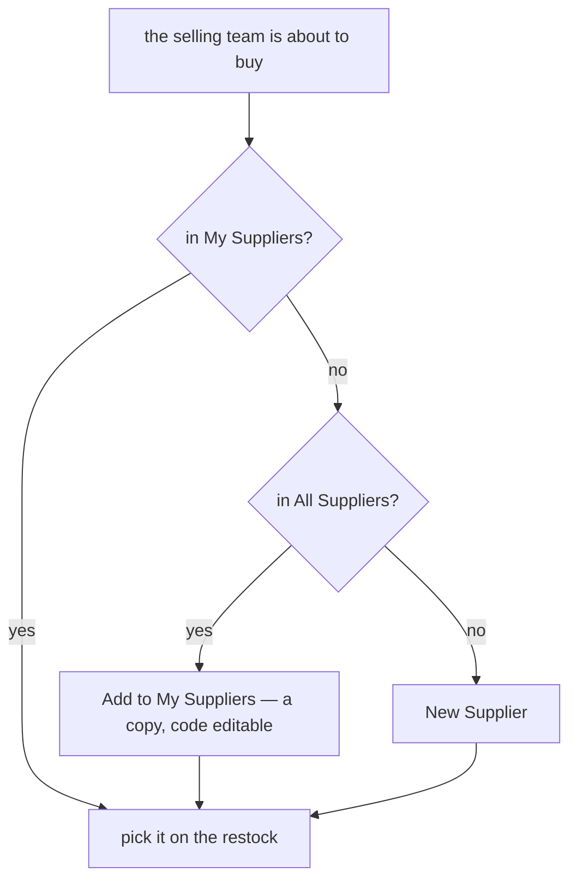
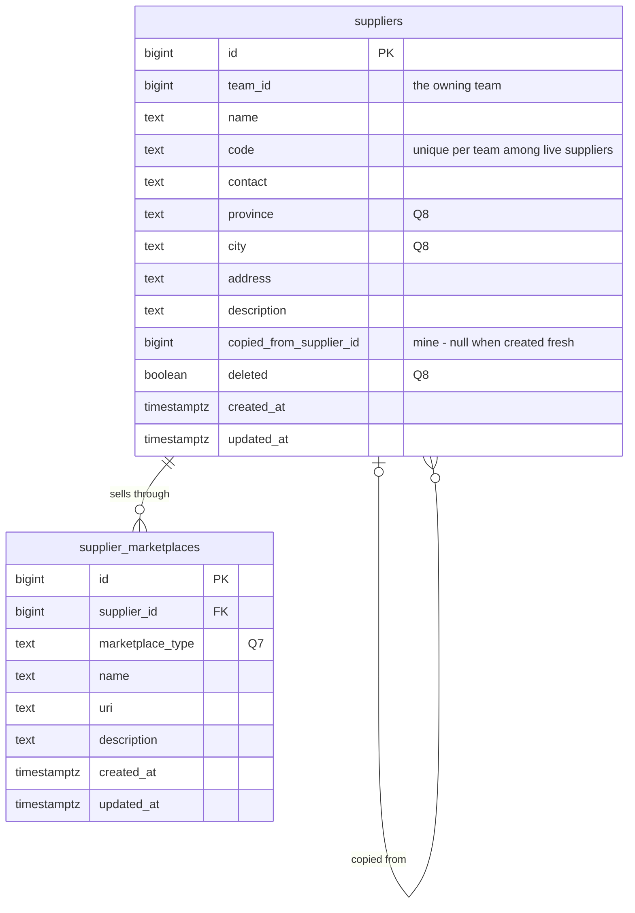
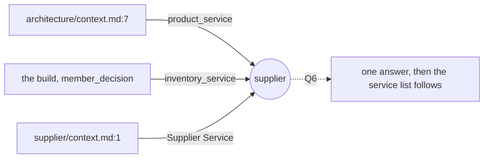
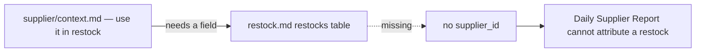
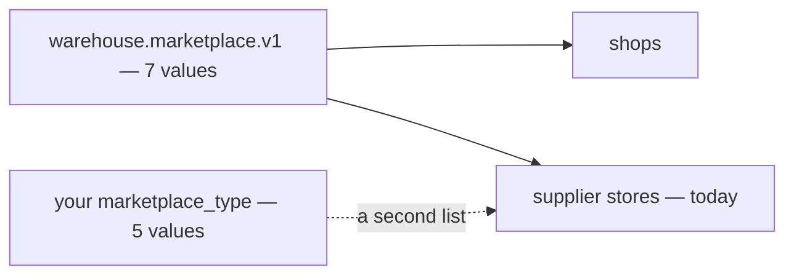

# Clarify — `supplier/context.md`

What I read out of [context.md](./context.md), and what has to be settled beside it. **That doc is yours — this
one is mine.** An answered point is deleted; what you settled is in [context_decision.md](./context_decision.md).

| | |
| --- | --- |
| 🔄 your edit (2026-10-06) | §Table Must Have — `team_id` replaces `created_by_team_id`, the supplier gains its fields, and `supplier_marketplaces` replaces the channels |
| ✅ answered by it | [Q4](#question) — the code stays: [the-supplier-keeps-its-code](./context_decision.md#the-supplier-keeps-its-code) · [Q5](#question) — a website is a `custom` marketplace: [the-supplier-lists-only-its-online-stores](./context_decision.md#the-supplier-lists-only-its-online-stores) |
| 🔄 re-asked | [Q1](#question) — `team_id` makes each supplier one team's, so the question is now **copy or reference**, and Q2 (edit rights) folds into it. **My recommendation changes to copy** |
| 🔄 revised | [Q6](#question) — under a copy, *Supplier Service* is best read as the `SupplierService` already in `inventory_service` |
| 🆕 +2 | [Q7](#question) your marketplace list vs the shared one · [Q8](#question) three built fields not on your list |

## What already exists

Built in `inventory_service` (#103, #120): the `/suppliers` list, the supplier detail page, `SupplierSelect`.

| your doc | built | |
| --- | --- | --- |
| create · update · delete | `SupplierCreate` · `SupplierUpdate` · `SupplierDelete` (soft) — selling Owner, Admin | ✅ |
| use it in restock | `restock_requests.supplier_id` — optional, **the requesting team's own suppliers only**; copied onto every batch received from it | ✅ |
| discover / search other teams' suppliers | every read filters `team_id = the caller's team`. `SupplierByIds` crosses teams only for an id you already hold | ❌ |
| `suppliers` — `team_id`, `name`, `code`, `contact`, `address`, `description` | all built — plus `province`, `city`, `deleted` ([Q8](#question)) | ✅ |
| `supplier_marketplaces` | `supplier_channels` — its online rows match; offline rows fold into the supplier ([decided](./context_decision.md#the-supplier-lists-only-its-online-stores)) | 🔄 |
| `marketplace_type` — 5 values | the shared `Marketplace` list — 7 values ([Q7](#question)) | 🔄 |

## Critique

| # | Problem | → Recommend |
| --- | --- | --- |
| **1** | **`team_id` makes a supplier one team's, and §2 still lets every other team find it — what they DO with it is unsaid.** If team B picks A's row on B's restock, A's edit rewrites B's records and A's delete empties B's picker. | **B copies it into its own list** — [Q1](#question). |
| **2** | **What another team SEES is not said.** A vendor's name, contact and stores are facts about the vendor. What team A *paid* there is A's business. ⚠ The built `SupplierService` says *"one team can never read another team's supplier"* — your §2 reverses it. | **The supplier and its stores, plus who owns it; never another team's restocks or prices** — [Q3](#question). |
| **3** | ***Supplier Service* — and your architecture doc puts the supplier in `product_service`** — see [where-the-supplier-lives](#where-the-supplier-lives). | **Stay in `inventory_service`**, if Q1 is copy — [Q6](#question). |
| **4** | 🆕 **`marketplace_type` is a second list of marketplaces.** The shared `Marketplace` list has 7 — Blibli, Bukalapak and *Other* are not on yours, and *Other* is your `custom` — see [two-lists-of-marketplaces](#two-lists-of-marketplaces). | **One list: the shared one, with `custom` as its *Other*** — [Q7](#question). |
| **5** | 🆕 **Three built fields are not on your list.** `deleted` carries §1's delete; `province` and `city` are what an area search filters on. | **Keep all three** — [Q8](#question). |

## Recommendation

**Copy.** It keeps every built rule — one team's row, the team's own edit and delete, the restock's own-team check —
and adds only two things: a search across teams, and *Add to My Suppliers*. Q1 first, because Q3 and Q6 follow it.

## Proposed Design

### The jobs

| who | does | how often |
| --- | --- | --- |
| selling Owner, Admin | add a vendor · fix its details · add another team's vendor to their own list | weekly |
| selling Owner, Admin, CS | find a vendor before buying — first in the team's list, then in everyone's | weekly |
| selling CS | pick the vendor on a restock request | daily |
| warehouse crew | read the vendor's name on the delivery in their hands | daily |

### Finding a vendor

### The data

`copied_from_supplier_id` is my addition. It lets *All Suppliers* mark a vendor *Added* instead of offering it twice,
and lets a report count one vendor across the teams that copied it.

### The contract

| RPC | who | change |
| --- | --- | --- |
| `SupplierCreate` · `SupplierUpdate` · `SupplierDelete` | selling Owner, Admin | none — own team only |
| `SupplierList` | the team | + filter `scope`: `MINE` (today's) or `ALL` — every other team's live suppliers, searched on name, code and store name, with the owning team |
| `SupplierCopy` | selling Owner, Admin | 🆕 copies another team's supplier and its stores into mine. Takes the `code`, prefilled with theirs, because it may clash with one of mine |
| `SupplierMarketplace*` | Owner, Admin write · the team reads | replaces `SupplierChannel*` ([decided](./context_decision.md#the-supplier-lists-only-its-online-stores)) |
| `SupplierByIds` · `SupplierDetail` | as today | none |

### The screens

- **`/suppliers`** — two tabs, **My Suppliers** (today's list) and **All Suppliers**. A row on *All* shows the owning
  team and offers *Add to My Suppliers*, or *Added* when it is already copied.
- **The restock form's picker** — My Suppliers only, as today. When nothing matches, the empty state links to
  *All Suppliers*.

## Question

1. **When team B finds team A's supplier, does B copy it or use A's row?** Critique 1.
   **→ Recommend: copy.** Last round I said one shared row. Your `team_id` changed my mind: with an owner on every
   row, sharing it means one team's edit and delete reach into another team's restocks.

   | | **copy** — recommend | **use A's row** |
   | --- | --- | --- |
   | B's restock names | B's own row | A's row |
   | A edits or deletes it | B is untouched | B's records change, and B's picker loses it |
   | a wrong address | each team fixes its own | only A can fix it |
   | one vendor across teams | through `copied_from_supplier_id` | one row |
   | what changes in the build | a search and a copy | edit rights, delete, and the restock's own-team check |

   *What breaks?* A correction A makes never reaches B's copy. I think that is the right price — B chose to own its
   copy.

2. ➡ **Folded into Q1** (2026-10-06) — who edits a shared row only arises if the answer is *use A's row*. Kept as a
   line so the numbers hold.

3. **What does a team see of another team's supplier?** Critique 2.
   **→ Recommend: the supplier and its stores in full, and the owning team's name — never that team's restocks,
   prices or quantities.** A vendor's phone number is not a secret, and the owning team's name tells B who to ask.
   What A paid is A's business. *"Who sells shoes, judging by what other teams bought"* exposes purchases — leave it
   out until you ask for it.

4. ✅ **Answered by your edit** — the code stays: [the-supplier-keeps-its-code](./context_decision.md#the-supplier-keeps-its-code).

5. ✅ **Answered by your edit** — a website is a `custom` marketplace on a supplier:
   [the-supplier-lists-only-its-online-stores](./context_decision.md#the-supplier-lists-only-its-online-stores).

6. **Does *Supplier Service* mean its own backend service, or the `SupplierService` already in `inventory_service`?**
   Critique 3.
   **→ Recommend: the one already built, if Q1 is copy.** Under a copy, every write stays inside one team, and
   `restock_requests.supplier_id` stays a real foreign key in the same service. A separate service pays for a move
   and makes that key unenforced, for nothing a copy needs. I recommended a service of its own last round only
   because one shared row would have been read company-wide.

7. 🆕 **Is `marketplace_type` its own list, or the shared `Marketplace` list?** Critique 4.
   **→ Recommend: the shared list** (`warehouse.marketplace.v1`), with your `custom` as its *Other*. A platform is
   then added once for shops and suppliers alike, and a team can buy from a Blibli or Bukalapak store as easily as it
   sells on one. If you are deliberately limiting supplier stores to the four, say so and I will record that.

8. 🆕 **Three built fields are not on your list: `province`, `city`, `deleted`. Drop them?** Critique 5.
   **→ Recommend: keep all three.** `deleted` is how §1's delete works: restocks and batches name the supplier
   forever, so a hard delete would orphan them. `province` and `city` are what *All Suppliers* filters on — *"a
   vendor in Bandung"* cannot be filtered out of a free-text address.

# Contradiction

## where-the-supplier-lives

| where | says |
| --- | --- |
| [technical/architecture/context.md:7](../../technical/architecture/context.md) | `product_service` — *"catalogue, markup %, … supplier, LinkMap"* |
| [products-follow-the-unit-price](../project/member_decision.md#products-follow-the-unit-price) + the build | `inventory_service`, as `SupplierService` |
| [context.md:1](./context.md) | *"Supplier Service"* — the name of the built `SupplierService`, or a service of its own ([Q6](#question)) |

**→ Recommend:** settle it in [Q6](#question), then update architecture/context.md's service list — that edit is
yours. It is the one list that restates every context's home, so every context with a doc of its own has left it
stale: `shop_service` and `financial_account_service` are missing from it too
([architecture clarify](../../technical/architecture/context_clarify.md)).

## restock-has-no-supplier

| where | says |
| --- | --- |
| [context.md:8](./context.md) | a supplier is for *"use it in restock"* |
| [inventory/restock.md](../inventory/restock.md) §Table Should We Have | `restocks` and `restock_items` have **no supplier field** |

The build has one: `restock_requests.supplier_id`, copied onto every batch received from it.
**→ Recommend:** `restocks.supplier_id`, one supplier per restock, because one parcel has one sender. Whether it is
required, and whether a one-off product link goes on the restock line, are restock.md's to answer. They move to its
clarify when that doc gets its pass.

## two-lists-of-marketplaces

| where | says |
| --- | --- |
| [context.md](./context.md) §Table Must Have 2 | `marketplace_type` — `shopee` · `lazada` · `tiktok` · `tokopedia` · `custom` |
| [a-shop-is-a-name-a-code-and-a-marketplace](../shop/context_decision.md#a-shop-is-a-name-a-code-and-a-marketplace) | one list of seven, *"shared with supplier channels"* — adds Blibli and Bukalapak, and calls the rest *Other* |

**→ Recommend:** one list ([Q7](#question)). Two lists drift: a platform added for shops is missing for suppliers,
and *Other* and `custom` become two words for one thing.

