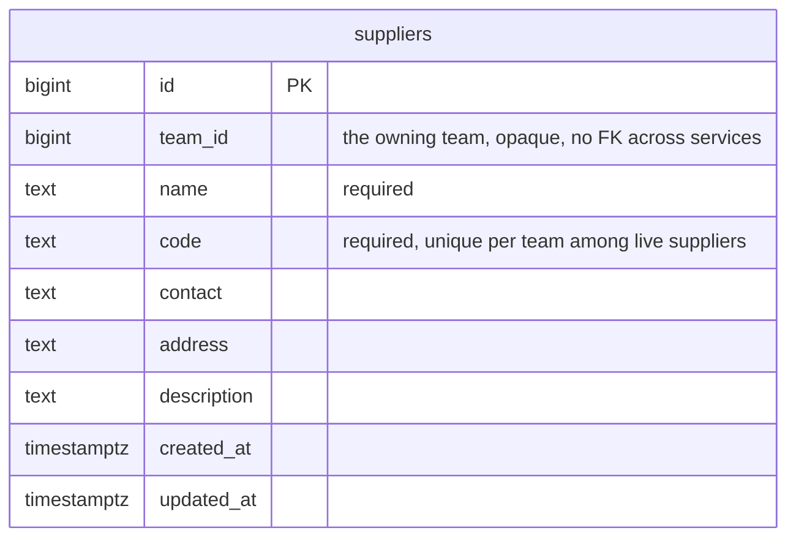
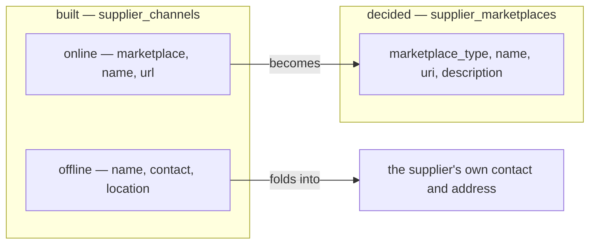
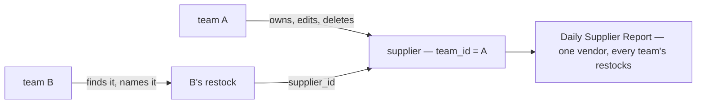
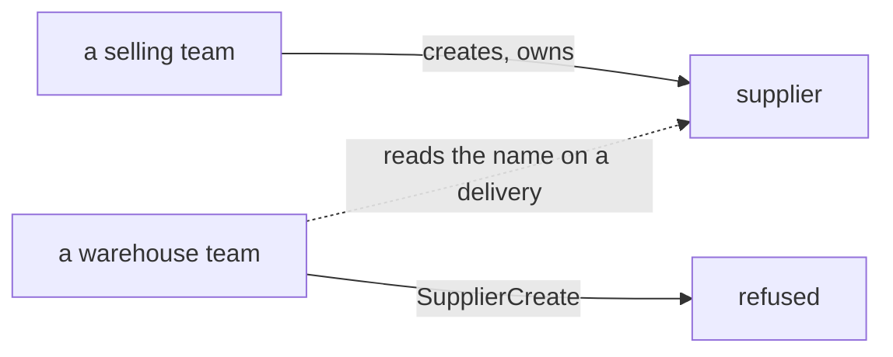
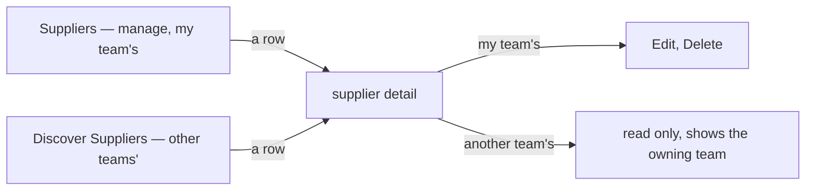

# Decisions — `supplier/context.md`

What the owner settled, recorded before it is acted on. **Append-only** — a decision that is later reversed is
renamed and its references grepped (RULE 12), never quietly edited away. The open set is
[context_clarify.md](./context_clarify.md).

| decision | says | from |
| --- | --- | --- |
| [the-supplier-keeps-its-code](#the-supplier-keeps-its-code) | a supplier is one team's row: name, code, contact, address, description | your §Table Must Have edit, 2026-10-06 — answers Q4, against my *drop `code`* |
| [the-supplier-lists-only-its-online-stores](#the-supplier-lists-only-its-online-stores) | `supplier_marketplaces` replace `supplier_channels`; a physical vendor is reached through the supplier's own contact and address | the same edit — answers Q5 |
| [a-team-restocks-from-another-teams-supplier](#a-team-restocks-from-another-teams-supplier) | team B names team A's supplier on B's own restock — one row per vendor, no copy | your §General 3, 2026-10-06 — answers Q1, against my *copy* |
| [only-a-selling-team-has-suppliers](#only-a-selling-team-has-suppliers) | a supplier's `team_id` is always a selling team | your §General 4, 2026-10-06 |
| [manage-and-discover-are-two-pages](#manage-and-discover-are-two-pages) | one page manages my team's suppliers, another searches every other team's | your §What Frontend Expected, 2026-10-06 |

## the-supplier-keeps-its-code

> Owner, in [context.md](./context.md) §Table Must Have *(2026-10-06)*: `suppliers` — `id`, `team_id`, `name`, `code`,
> `contact`, `address`, `description`, `updated_at`, `created_at`. It replaces the first draft's `created_by_team_id`.
> It answers [Q4](./context_clarify.md#question), **against my recommendation**: I had said drop `code`, because I had
> read the supplier as one row shared across teams, where two teams' codes collide. With `team_id`, the row is one
> team's, so a code unique per team collides with nobody.

**The verdict.** A supplier belongs to **one team** and carries a name, a code, a contact, an address and a
description. The code is that team's short handle for it.

**The spec.** Built as is — `SupplierCreate` and `SupplierUpdate` already take all five fields, and
`suppliers_team_code_active_unique` makes the code unique per team among live suppliers. Three built fields are not
on your list — `province`, `city`, `deleted` — and stay until [Q8](./context_clarify.md#question) answers.
Whether another team USES this row or copies it is still [Q1](./context_clarify.md#question).

## the-supplier-lists-only-its-online-stores

> Owner, in [context.md](./context.md) §Table Must Have *(2026-10-06)*: `supplier_marketplaces` — `id`, `supplier_id`,
> `marketplace_type` (`shopee` · `lazada` · `tiktok` · `tokopedia` · `custom`), `name`, `uri`, `description`,
> `updated_at`, `created_at`. It answers [Q5](./context_clarify.md#question): a website bought from is a supplier
> with a `custom` marketplace and its `uri`.

**The verdict.** A supplier lists the **online stores** it sells through — one row per store, on a marketplace or
a `custom` site. A **physical** vendor has no row here: it is reached through the supplier's own `contact` and
`address`.

**The spec.**

| | built `supplier_channels` | decided `supplier_marketplaces` |
| --- | --- | --- |
| kind | `type` online · offline | none — every row is online |
| platform | `marketplace`, online only | `marketplace_type`, required — which list is [Q7](./context_clarify.md#question) |
| store name | `name` | `name` |
| link | `url`, optional | `uri` |
| | `contact`, `location` | gone — they are the supplier's own fields |
| | — | `description` 🆕 |

- **Migration.** An online channel becomes a marketplace row (`url` → `uri`). An offline channel's `contact` and
  `location` fill the supplier's `contact` and `address` when those are empty, and otherwise are appended to its
  `description`, so nothing typed is lost.
- **`SupplierChannel*` become `SupplierMarketplace*`**, same roles: the selling Owner and Admin write, the whole team
  reads.

## a-team-restocks-from-another-teams-supplier

> Owner, in [context.md](./context.md) §General 3 *(2026-10-06)*: *"other selling team can use other selling team
> supplier for their restock."* It answers [Q1](./context_clarify.md#question), **against my recommendation**: I had
> said copy, so that one team's edit and delete could never reach another team's restocks.

**The verdict.** There is **one row per vendor**, owned by the team that created it. Any selling team may name it on its
own restock, without copying it.

**The spec.**

| site | today | becomes |
| --- | --- | --- |
| [restock_request_create.go:16](../../../backend/services/inventory_service/inventory_v1/restock_request_create.go#L16) and the update | the supplier must belong to the **requesting** team, or `NotFound` | a **live supplier of any selling team** |
| `SupplierService`'s comment, `RestockRequest.supplier_id`'s comment | *"one team can never read another team's supplier"* | rewritten — `SupplierByIds` is no longer the one exception |
| `restock_requests.supplier_id` | a real FK to `suppliers` | unchanged — a foreign key does not care which team owns the row |

What it leaves open: what A's edit and delete do to B's restocks, and how B's restock form finds A's supplier —
[Q2](./context_clarify.md#question).

## only-a-selling-team-has-suppliers

> Owner, in [context.md](./context.md) §General 4 *(2026-10-06)*: *"only selling team that can have supplier."*

**The verdict.** A supplier's `team_id` is always a **selling** team. A warehouse team still **reads** a supplier, because
it reads the vendor's name on the delivery at its door, but it never owns one.

**The spec.** `SupplierCreate` refuses a team whose type is not SELLING, with one lookup in `team_service`. Today it
writes into any team it is given ([supplier_create.go:12](../../../backend/services/inventory_service/inventory_v1/supplier_create.go#L12)).
The selling roles on its policy keep out a warehouse's own people, but Root and the Administrator bypass the scope, and
they can create one in a warehouse team.

## manage-and-discover-are-two-pages

> Owner, in [context.md](./context.md) §What Frontend Expected *(2026-10-06)*: *"frontend use this service for 2 page
> supplier. 1. supplier managing page. 2. discover supplier. its for search other team supplier."*

**The verdict.** **Two pages.** One manages my team's suppliers. The other searches every other selling team's.

**The spec.**

| page | route | built |
| --- | --- | --- |
| manage | `/inventories/suppliers` — `pages/suppliers/` | ✅ as is |
| discover | `/inventories/suppliers/discover` — 🆕 `pages/supplier-discover/` | ❌ |
| detail | `/inventories/suppliers/:supplierId` — `pages/supplier-detail/` | ✅ for my team's · ❌ another team's answers `NotFound` today |
