# Decisions — `supplier/context.md`

What the owner settled, recorded before it is acted on. **Append-only** — a decision that is later reversed is
renamed and its references grepped (RULE 12), never quietly edited away. The open set is
[context_clarify.md](./context_clarify.md).

| decision | says | from |
| --- | --- | --- |
| ⛔ [reversed-the-supplier-keeps-its-code](#reversed-the-supplier-keeps-its-code) | ~~a supplier carries a code~~ — reversed by [the-supplier-has-no-code](#the-supplier-has-no-code) | your §Table Must Have edit, 2026-10-06 |
| [the-supplier-lists-only-its-online-stores](#the-supplier-lists-only-its-online-stores) | every `supplier_channels` row is an online store, typed by `channel_type`; a physical vendor is reached through the supplier's own contact and address | the same edit — answers Q5 · 🔄 table name settled by your fourth edit |
| [a-team-restocks-from-another-teams-supplier](#a-team-restocks-from-another-teams-supplier) | team B names team A's supplier on B's own restock — one row per vendor, no copy | your §General 3, 2026-10-06 — answers Q1, against my *copy* |
| [only-a-selling-team-has-suppliers](#only-a-selling-team-has-suppliers) | a supplier's `team_id` is always a selling team | your §General 4, 2026-10-06 |
| [manage-and-discover-are-two-pages](#manage-and-discover-are-two-pages) | one page manages my team's suppliers, another searches every other team's | your §What Frontend Expected, 2026-10-06 |
| [another-team-sees-everything-of-a-supplier](#another-team-sees-everything-of-a-supplier) | every selling team sees a supplier's record, its channels, and its products | in chat, 2026-10-06 — answers Q3, against my *never their purchases* |
| [the-supplier-has-no-code](#the-supplier-has-no-code) | `suppliers` has no `code` | your fourth edit, 2026-10-06 — reverses [reversed-the-supplier-keeps-its-code](#reversed-the-supplier-keeps-its-code) |
| [products-hang-off-a-channel](#products-hang-off-a-channel) | a supplier's products are stored, one row per product per channel — not derived from restocks | your fourth edit, 2026-10-06 — closes Q9 |
| [linking-products-is-deferred](#linking-products-is-deferred) | how a product gets linked to a channel is talked about later; the next pass is basic CRUD | in chat, 2026-10-06 |
| [statistics-are-deferred](#statistics-are-deferred) | a supplier's statistics are defined later, not in the CRUD pass | your §Whats defer, 2026-10-06 |
| [channel-type-is-the-marketplace-list](#channel-type-is-the-marketplace-list) | `channel_type` is the shared marketplace list; `custom` is its *Other* | your edit, 2026-10-06 — answers Q7, as recommended |
| [no-province-city-or-soft-delete](#no-province-city-or-soft-delete) | a supplier is exactly your listed fields; delete is a hard delete | in chat, 2026-10-06 — answers Q8, against my *keep all three* |
| [the-supplier-gets-its-own-service](#the-supplier-gets-its-own-service) | suppliers and channels move to their own `supplier_service` | in chat, 2026-10-06 — answers Q6, against my *stay in inventory_service* |
| [channels-are-a-horizontal-tab](#channels-are-a-horizontal-tab) | on the supplier detail page the channels sit under a horizontal **Channels** tab; the supplier's own fields stay above it | in chat, 2026-10-06 — against my *vertical tabs, Info and Channels* |

## reversed-the-supplier-keeps-its-code

⛔ **Reversed 2026-10-06** by [the-supplier-has-no-code](#the-supplier-has-no-code) — your next edit removed `code`. Renamed per RULE 12; kept below as it was decided.

> Owner, in [context.md](./context.md) §Table Must Have *(2026-10-06)*: `suppliers` — `id`, `team_id`, `name`, `code`,
> `contact`, `address`, `description`, `updated_at`, `created_at`. It replaces the first draft's `created_by_team_id`.
> It answers [Q4](./context_clarify.md#question), **against my recommendation**: I had said drop `code`, because I had
> read the supplier as one row shared across teams, where two teams' codes collide. With `team_id`, the row is one
> team's, so a code unique per team collides with nobody.

**The verdict.** A supplier belongs to **one team** and carries a name, a code, a contact, an address and a
description. The code is that team's short handle for it.

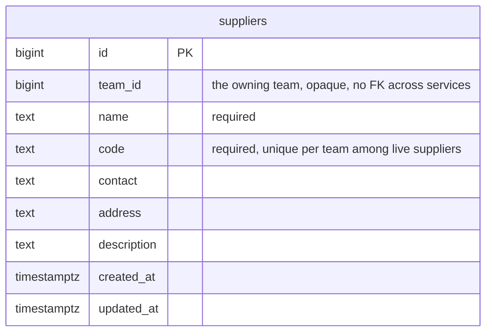

**The spec.** Built as is — `SupplierCreate` and `SupplierUpdate` already take all five fields, and
`suppliers_team_code_active_unique` makes the code unique per team among live suppliers. Three built fields are not
on your list — `province`, `city`, `deleted` — and stay until [Q8](./context_clarify.md#question) answers.
Whether another team USES this row or copies it is still [Q1](./context_clarify.md#question).

## the-supplier-lists-only-its-online-stores

🔄 **Renamed by your fourth edit (2026-10-06):** the table keeps the built name **`supplier_channels`**, and `marketplace_type` is **`channel_type`**. The verdict holds. Below, read `supplier_marketplaces` as `supplier_channels` — and `SupplierChannel*` keeps its name.

> Owner, in [context.md](./context.md) §Table Must Have *(2026-10-06)*: `supplier_marketplaces` — `id`, `supplier_id`,
> `marketplace_type` (`shopee` · `lazada` · `tiktok` · `tokopedia` · `custom`), `name`, `uri`, `description`,
> `updated_at`, `created_at`. It answers [Q5](./context_clarify.md#question): a website bought from is a supplier
> with a `custom` marketplace and its `uri`.

**The verdict.** A supplier lists the **online stores** it sells through — one row per store, on a marketplace or
a `custom` site. A **physical** vendor has no row here: it is reached through the supplier's own `contact` and
`address`.

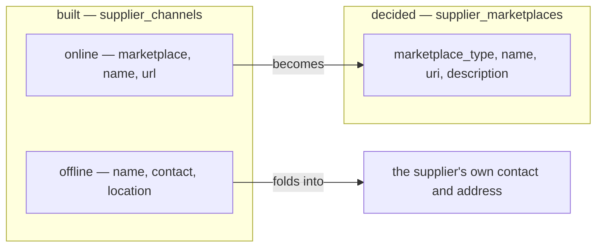

**The spec.**

| | built `supplier_channels` | decided `supplier_marketplaces` |
| --- | --- | --- |
| kind | `type` online · offline | none — every row is online |
| platform | `marketplace`, online only | `marketplace_type`, required — which list is [Q7](./context_clarify.md#question) |
| store name | `name` | `name` |
| link | `url`, optional | `uri` |
| | `contact`, `location` | gone — they are the supplier's own fields |
| | — | `description` 🆕 |

- **Migration.** An online channel becomes a marketplace row (`url` → `uri`). An offline channel's `contact` and
  `location` fill the supplier's `contact` and `address` when those are empty, and otherwise are appended to its
  `description`, so nothing typed is lost.
- **`SupplierChannel*` become `SupplierMarketplace*`**, same roles: the selling Owner and Admin write, the whole team
  reads.

## a-team-restocks-from-another-teams-supplier

> Owner, in [context.md](./context.md) §General 3 *(2026-10-06)*: *"other selling team can use other selling team
> supplier for their restock."* It answers [Q1](./context_clarify.md#question), **against my recommendation**: I had
> said copy, so that one team's edit and delete could never reach another team's restocks.

**The verdict.** There is **one row per vendor**, owned by the team that created it. Any selling team may name it on its
own restock, without copying it.

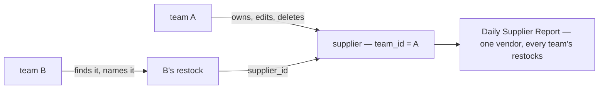

**The spec.**

| site | today | becomes |
| --- | --- | --- |
| [restock_request_create.go:16](../../../backend/services/inventory_service/inventory_v1/restock_request_create.go#L16) and the update | the supplier must belong to the **requesting** team, or `NotFound` | a **live supplier of any selling team** |
| `SupplierService`'s comment, `RestockRequest.supplier_id`'s comment | *"one team can never read another team's supplier"* | rewritten — `SupplierByIds` is no longer the one exception |
| `restock_requests.supplier_id` | a real FK to `suppliers` | unchanged — a foreign key does not care which team owns the row · 🔄 **removed by [the-supplier-gets-its-own-service](#the-supplier-gets-its-own-service)** |

What it leaves open: what A's edit and delete do to B's restocks, and how B's restock form finds A's supplier —
[Q2](./context_clarify.md#question).

## only-a-selling-team-has-suppliers

> Owner, in [context.md](./context.md) §General 4 *(2026-10-06)*: *"only selling team that can have supplier."*

**The verdict.** A supplier's `team_id` is always a **selling** team. A warehouse team still **reads** a supplier, because
it reads the vendor's name on the delivery at its door, but it never owns one.

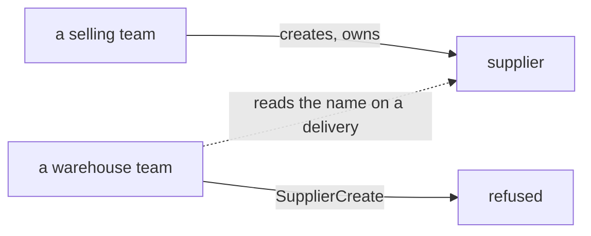

**The spec.** `SupplierCreate` refuses a team whose type is not SELLING, with one lookup in `team_service`. Today it
writes into any team it is given ([supplier_create.go:12](../../../backend/services/inventory_service/inventory_v1/supplier_create.go#L12)).
The selling roles on its policy keep out a warehouse's own people, but Root and the Administrator bypass the scope, and
they can create one in a warehouse team.

## manage-and-discover-are-two-pages

> Owner, in [context.md](./context.md) §What Frontend Expected *(2026-10-06)*: *"frontend use this service for 2 page
> supplier. 1. supplier managing page. 2. discover supplier. its for search other team supplier."*

**The verdict.** **Two pages.** One manages my team's suppliers. The other searches every other selling team's.

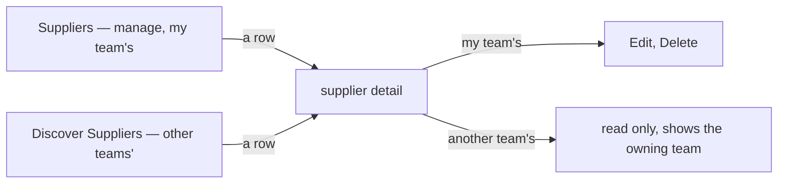

**The spec.**

| page | route | built |
| --- | --- | --- |
| manage | `/inventories/suppliers` — `pages/suppliers/` | ✅ as is |
| discover | `/inventories/suppliers/discover` — 🆕 `pages/supplier-discover/` | ❌ |
| detail | `/inventories/suppliers/:supplierId` — `pages/supplier-detail/` | ✅ for my team's · ❌ another team's answers `NotFound` today |

## another-team-sees-everything-of-a-supplier

🔄 **Its spec is superseded (2026-10-06)** by [products-hang-off-a-channel](#products-hang-off-a-channel): your `supplier_channel_products` table stores the link, so the products no longer come from restock lines, and Q9 closes. The verdict holds — another team sees everything.

> Owner, in chat *(2026-10-06)*: *"for q3, other team see all, supplier, channel and product"*. It answers
> [Q3](./context_clarify.md#question), **against my recommendation**: I had said another team sees the supplier and
> its stores, but never what the owning team bought there.

**The verdict.** Nothing about a supplier is private to the team that owns it. Every selling team sees its
**record**, its **stores** (`supplier_marketplaces`) and its **products**, meaning what has been bought from it.

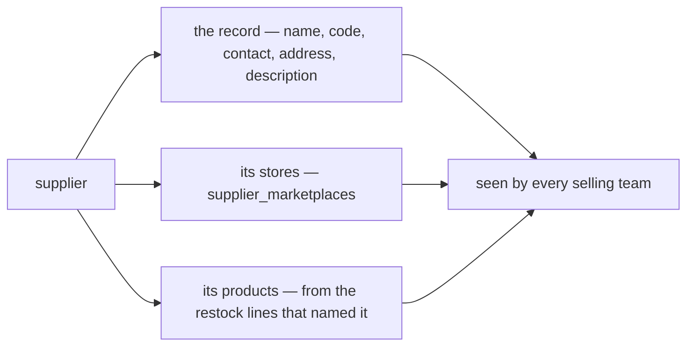

**The spec.**

- **The products come from the restocks.** There is no supplier-to-product table, and none is needed: a restock
  line already keeps `product_id`, `sku`, a snapshot of the product's `name` and the unit `price`
  ([00005_restock_request_items.sql](../../../backend/services/inventory_service/db_migrations/00005_restock_request_items.sql)),
  and its restock names the supplier. A supplier's products are the distinct products on those lines, from every team.
- **Its own read, paginated.** A supplier that has supplied for years has a long product list, so it is a list RPC
  with a page filter (HARD RULE 9), not a field on the supplier.
- **Still open:** which restocks count, whether the price shows, and whether the discover search reaches product
  names — [Q9](./context_clarify.md#question).

## the-supplier-has-no-code

> Owner, in [context.md](./context.md) §Table Must Have 1 *(2026-10-06, the fourth edit)*: `suppliers` — `id`, `team_id`,
> `name`, `contact`, `address`, `description`, `updated_at`, `created_at`. `code` is gone. It reverses
> [reversed-the-supplier-keeps-its-code](#reversed-the-supplier-keeps-its-code), and lands where my first pass's Q4 began.

**The verdict.** A supplier has **no code**. People find it by its name, its owning team and its channels.

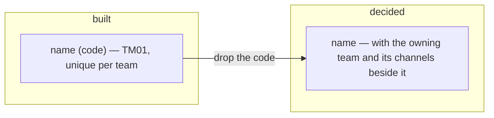

**The spec.** Every site that carries the code loses it:

| site | change |
| --- | --- |
| `suppliers.code` and `suppliers_team_code_active_unique` | dropped by a migration |
| `Supplier.code`, `SupplierCreateRequest.code`, `SupplierUpdateRequest.code`, `SUPPLIER_ROW_SORT_CODE` | removed, numbers reserved |
| the form dialog, the list's Code column, the detail page's badge | removed |
| `SupplierSelect` — shows `name (code)`, searches the code | shows the name, searches the name |
| e2e and story test ids — `supplier-row-${code}` | keyed by id |

Nothing takes over the code's uniqueness: as built, two suppliers in one team may share a name.

## products-hang-off-a-channel

> Owner, in [context.md](./context.md) §Table Must Have 3 *(2026-10-06, the fourth edit)*: `supplier_channel_products` —
> `id`, `channel_id`, `product_id` (unique with `channel_id`), `created_at` — *"use for reference product in discover
> supplier frontend page."* It supersedes the derived-from-restocks spec of
> [another-team-sees-everything-of-a-supplier](#another-team-sees-everything-of-a-supplier), and closes
> [Q9](./context_clarify.md#question): which restocks count and whether a price shows were questions about the
> derived list, which no longer exists.

**The verdict.** A supplier's products are **stored**: one row per product **per channel**, so the discover page can
show what each store sells. A product is listed once per channel.

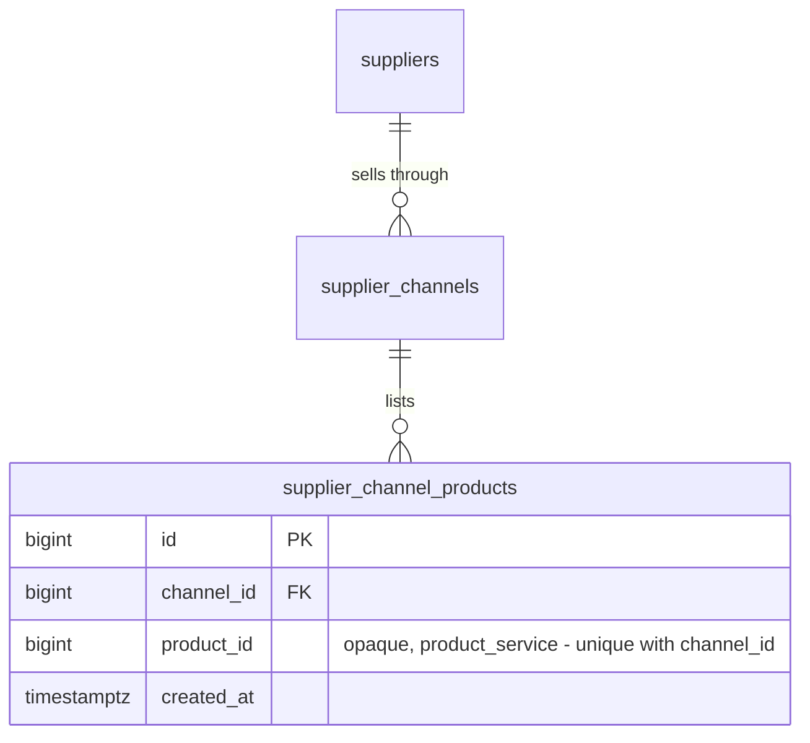

**The spec.** The table as written. How a row gets written is
[linking-products-is-deferred](#linking-products-is-deferred).

## linking-products-is-deferred

> Owner, in chat *(2026-10-06)*: *"for how we linked to supplier_channel_products we talk later, its complex, we are
> focus basic crud first"*.

**The verdict.** The next pass is **basic CRUD** of suppliers and their channels. How a product gets linked to a
channel is **talked about later**, along with everything that depends on it.

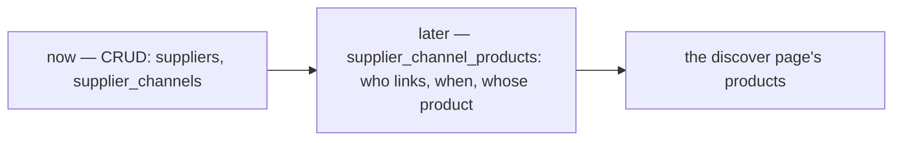

**The spec.**

- `supplier_channel_products` is **created with the linking pass, not now** — my reading of *focus basic CRUD first*.
  A table with nothing writing to it has nothing to test.
- What is parked is listed in the clarify's [Parked](./context_clarify.md#parked--talk-later) section, so the later
  conversation starts from it rather than from nothing. None of it is counted as open.

## statistics-are-deferred

> Owner, in [context.md](./context.md) §Whats defer *(2026-10-06, the fifth edit)*: *"defining statistic"* and
> *"defining how we seed `supplier_channel_products`"*. The second is
> [linking-products-is-deferred](#linking-products-is-deferred), now written into your doc as well.

**The verdict.** What a supplier's **statistics** are is defined **later**. The CRUD pass builds no figures.

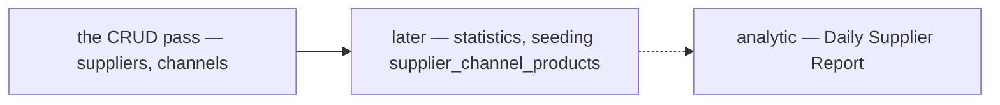

**The spec.** Nothing is built for it now. The analytic doc already names a *Daily Supplier Report Table*; its grain is
an open question in [analytic's clarify](../analytic/context_clarify.md#question), and the supplier's statistics are
defined against it when this is picked up.

## channel-type-is-the-marketplace-list

> Owner, in chat *(2026-10-06)*: *"for 7 im edited again"* — and [context.md](./context.md) §Table Must Have 2 now lists
> `shopee` · `lazada` · `tiktok` · `tokopedia` · `bukalapak` · `blibli` · `custom`. It answers
> [Q7](./context_clarify.md#question), as recommended: the seven are the shared list's seven, with `custom` as its
> *Other*. It resolves the contradiction *two-lists-of-marketplaces*.

**The verdict.** A channel's type is the **shared marketplace list** — the one shops use. A platform added for shops
is there for suppliers too.

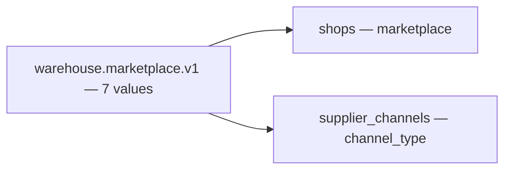

**The spec.** `SupplierChannel.channel_type` is a `warehouse.marketplace.v1.Marketplace`; your `custom` is
`MARKETPLACE_OTHER`, stored as the shared code `other` by
[san_marketplace](../../../backend/pkgs/san_marketplace/marketplace.go). The channel form reuses `MarketplaceSelect`.
⚠ If you want the word *Custom* rather than *Other* on a supplier channel, say so: it is a label, not a new value.

## no-province-city-or-soft-delete

> Owner, in chat *(2026-10-06)*: *"for q8, yes"*, confirmed the same day as **drop all three**. It answers
> [Q8](./context_clarify.md#question), **against my recommendation**, which was to keep `province`, `city` and
> `deleted`.

**The verdict.** A supplier is **exactly the fields on your list**. There is no province or city, and **delete is a
hard delete**: the row is gone, and its channels with it.

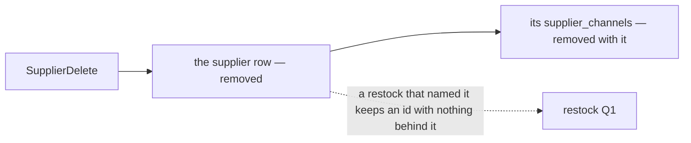

**The spec.**

| site | change |
| --- | --- |
| `province`, `city` | not in `supplier_service`'s table. On the move, a non-empty city or province is appended to `address`, so nothing typed is lost |
| `deleted` | not in the table. Rows already soft-deleted are not moved |
| `SupplierDelete` | deletes the row; `supplier_channels` cascade |
| `SupplierByIds` | a deleted supplier is simply absent, as its contract already allows for an unknown id |

**What it does NOT settle:** what a restock shows once its supplier is deleted, and whether A may delete a supplier B's
restocks name. Both are the restock's questions — moved there with Q2
([restock clarify](../inventory/restock_clarify.md#question)).

## the-supplier-gets-its-own-service

> Owner, in chat *(2026-10-06)*: *"for 6 yes"*, confirmed the same day as **its own `supplier_service`**. It answers
> [Q6](./context_clarify.md#question), **against my recommendation**, which was to stay in `inventory_service`. It
> settles the contradiction *where-the-supplier-lives* — except that your architecture doc still says
> `product_service`.

**The verdict.** Suppliers and their channels leave `inventory_service` for a service of their own,
**`supplier_service`**. Restocks name a supplier by an opaque id, as an order names a shop.

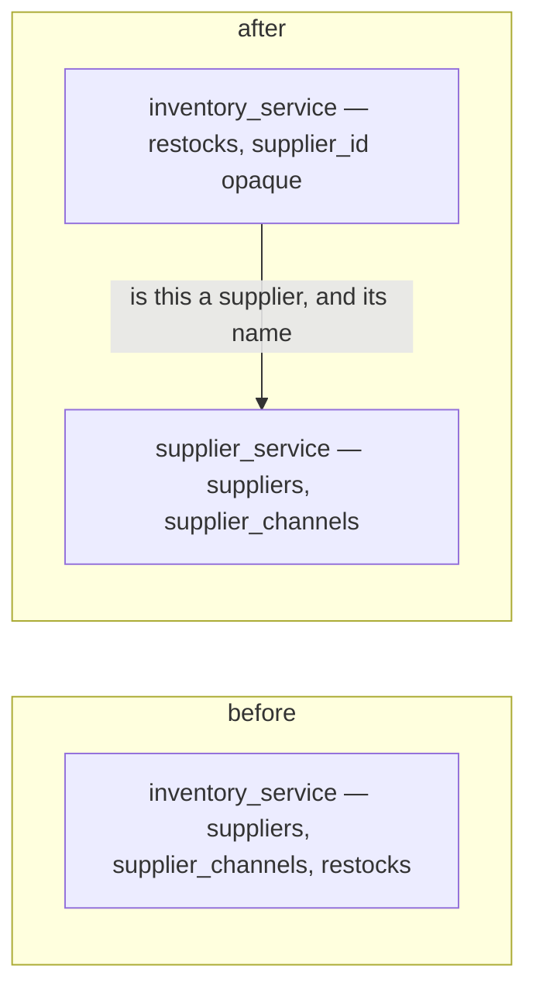

**The spec.**

| | |
| --- | --- |
| the service | `backend/services/supplier_service/` — `supplier_v1/` (one file per RPC, a unit test beside each), `supplier_service_models/`, `db_migrations/`, a `register.go` and a Wire provider (HARD RULE 2) |
| it owns | `suppliers` · `supplier_channels` · later `supplier_channel_products` ([linking-products-is-deferred](#linking-products-is-deferred)) |
| its contract | ⚠ my spec: `proto/warehouse/supplier/v1/`, package `warehouse.supplier.v1` — `SupplierService` and `SupplierChannelService` move there. A breaking move for the frontend's two clients |
| `restock_requests.supplier_id` | loses its foreign key — an opaque id. The restock's check of it becomes a call to `supplier_service`, designed with the restock ([restock clarify](../inventory/restock_clarify.md#question)) |
| what it calls | `team_service` — is the team a selling team ([only-a-selling-team-has-suppliers](#only-a-selling-team-has-suppliers)) |
| who calls it | `inventory_service` for a restock's supplier · the frontend's two pages and `SupplierSelect` |
| docs | `docs/database-schema.md` gains a `supplier_service` section; `docs/services/supplier_service/rpc.md` if a flow crosses services |

🔄 It changes [a-team-restocks-from-another-teams-supplier](#a-team-restocks-from-another-teams-supplier)'s last spec row:
the foreign key it called *unchanged* is the one this removes.

**What it does NOT settle:** ⚠ **moving the suppliers that exist** — copying the rows with their ids (restocks and
batches hold them), then `inventory_service` dropping its tables. A technical item, as the shop's move was; proposed in
the [clarify](./context_clarify.md#proposed-design). And your
[technical/architecture/context.md](../../technical/architecture/context.md) service list still puts the supplier in
`product_service` — your edit.

## channels-are-a-horizontal-tab

> Owner, in chat *(2026-10-06)*, previewing the CRUD prototype: *"no just add hrizontal tab channel"* — against my
> recommendation, which was rack detail's vertical tabs with the supplier's fields moved into an *Info* tab.

**The verdict.** The supplier's own fields stay where they are, at the top of the page. Below them, the channels sit
under a **horizontal** tab row, with **Channels** as its first and, for now, only tab. That row is where the parked
products per channel and the statistics land later
([linking-products-is-deferred](#linking-products-is-deferred), [statistics-are-deferred](#statistics-are-deferred)).

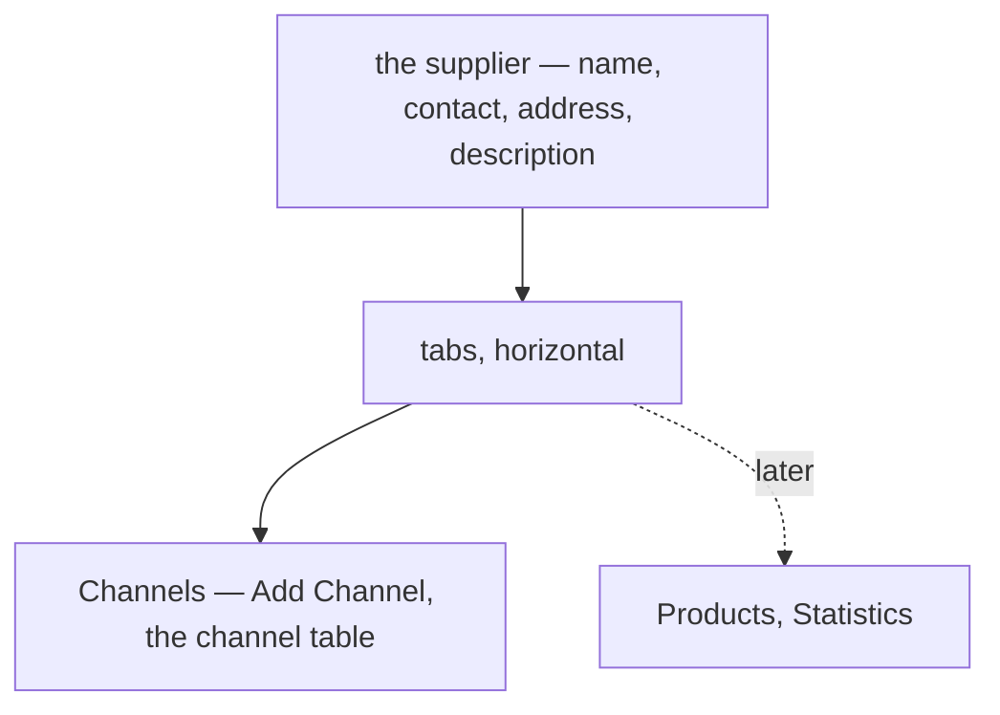

**The spec.** Built in the prototype: `Tabs.Root` with the default horizontal orientation, as team detail uses; the
**Channels** tab is open on arrival and holds Add Channel and the table. Story:
`Pages/Suppliers/SupplierDetail — TheChannelsAreAHorizontalTab`.
