# Decisions — `supplier/context.md`

What the owner settled, recorded before it is acted on. **Append-only** — a decision that is later reversed is
renamed and its references grepped (RULE 12), never quietly edited away. The open set is
[context_clarify.md](./context_clarify.md).

| decision | says | from |
| --- | --- | --- |
| ⛔ [reversed-the-supplier-keeps-its-code](#reversed-the-supplier-keeps-its-code) | ~~a supplier carries a code~~ — reversed by [the-supplier-has-no-code](#the-supplier-has-no-code) | your §Table Must Have edit, 2026-10-06 |
| [the-supplier-lists-only-its-online-stores](#the-supplier-lists-only-its-online-stores) | every `supplier_channels` row is an online store, typed by `channel_type`; a physical vendor is reached through the supplier's own contact and address | the same edit — answers Q5 · 🔄 table name settled by your fourth edit |
| [a-team-restocks-from-another-teams-supplier](#a-team-restocks-from-another-teams-supplier) | team B names team A's supplier on B's own restock — one row per vendor, no copy | your §General 3, 2026-10-06 — answers Q1, against my *copy* |
| [only-a-selling-team-has-suppliers](#only-a-selling-team-has-suppliers) | a supplier's `team_id` is always a selling team | your §General 4, 2026-10-06 |
| [manage-and-discover-are-two-pages](#manage-and-discover-are-two-pages) | one page manages my team's suppliers, another searches every other team's | your §What Frontend Expected, 2026-10-06 |
| [another-team-sees-everything-of-a-supplier](#another-team-sees-everything-of-a-supplier) | every selling team sees a supplier's record, its channels, and its products | in chat, 2026-10-06 — answers Q3, against my *never their purchases* |
| [the-supplier-has-no-code](#the-supplier-has-no-code) | `suppliers` has no `code` | your fourth edit, 2026-10-06 — reverses [reversed-the-supplier-keeps-its-code](#reversed-the-supplier-keeps-its-code) |
| [products-hang-off-a-channel](#products-hang-off-a-channel) | a supplier's products are stored, one row per product per channel — not derived from restocks | your fourth edit, 2026-10-06 — closes Q9 |
| [linking-products-is-deferred](#linking-products-is-deferred) | how a product gets linked to a channel is talked about later; the next pass is basic CRUD · 🔄 **ended** by [restock-accepted-links-the-product-to-its-channel](#restock-accepted-links-the-product-to-its-channel) | in chat, 2026-10-06 |
| [statistics-are-deferred](#statistics-are-deferred) | a supplier's statistics are defined later, not in the CRUD pass · 🔄 **ended** by [a-supplier-is-measured-per-product-per-day](#a-supplier-is-measured-per-product-per-day) | your §Whats defer, 2026-10-06 |
| [channel-type-is-the-marketplace-list](#channel-type-is-the-marketplace-list) | `channel_type` is the shared marketplace list; `custom` is its *Other* | your edit, 2026-10-06 — answers Q7, as recommended |
| [no-province-or-city](#no-province-or-city) | a supplier has no province or city · 🔄 *renamed from `no-province-city-or-soft-delete`* — its ~~hard delete~~ is reversed by [a-deleted-supplier-is-kept-for-its-figures](#a-deleted-supplier-is-kept-for-its-figures) | in chat, 2026-10-06 — answers Q8, against my *keep all three* |
| [the-supplier-gets-its-own-service](#the-supplier-gets-its-own-service) | suppliers and channels move to their own `supplier_service` | in chat, 2026-10-06 — answers Q6, against my *stay in inventory_service* |
| ⛔ [superseded-channels-are-a-horizontal-tab](#superseded-channels-are-a-horizontal-tab) | ~~one horizontal Channels tab~~ — a MISREAD, superseded by [supplier-detail-has-channels-and-products-tabs](#supplier-detail-has-channels-and-products-tabs) | in chat, 2026-10-06 |
| [supplier-detail-has-channels-and-products-tabs](#supplier-detail-has-channels-and-products-tabs) | the supplier detail has two horizontal tabs, **Channels** (one list, a marketplace badge per row) and **Products** (sample rows for now) | in chat, 2026-10-06 |
| [the-channels-tab-searches-filters-and-pages](#the-channels-tab-searches-filters-and-pages) | the Channels tab has a search, a channel-type filter and a pager | in chat, 2026-10-06 |
| [the-products-tab-searches-and-pages](#the-products-tab-searches-and-pages) | the Products tab has a search and a pager | in chat, 2026-10-06 |
| [discover-searches-every-teams-suppliers](#discover-searches-every-teams-suppliers) | Discover Suppliers and its detail are pages of their own, searching suppliers across ALL teams; Suppliers is the list a team manages | in chat, 2026-10-06 — refines [manage-and-discover-are-two-pages](#manage-and-discover-are-two-pages) |
| [restock-accepted-links-the-product-to-its-channel](#restock-accepted-links-the-product-to-its-channel) | an accepted restock adds each line's product to the channel the line names — nobody links by hand | your §How We Seed, 2026-10-07 — ends [linking-products-is-deferred](#linking-products-is-deferred), answers restock Q10a as recommended |
| [a-supplier-is-measured-per-product-per-day](#a-supplier-is-measured-per-product-per-day) | `supplier_product_daily_reports` counts what was restocked, lost and broken, per supplier, product and day; read like settlement's — daily, monthly, yearly, grouped by supplier | your §How We provide Analitical Data, 2026-10-07 — ends [statistics-are-deferred](#statistics-are-deferred) · 🔄 key set by [the-report-is-keyed-by-team-not-by-store](#the-report-is-keyed-by-team-not-by-store) |
| [the-report-is-keyed-by-team-not-by-store](#the-report-is-keyed-by-team-not-by-store) | the daily report is unique on (day, supplier, product, team) — the restocking team is in it, the store is not | your §Smallest Grain Reports edit, 2026-10-07 — answers Q12a as recommended, Q12b against |
| [the-report-is-processed-like-settlement](#the-report-is-processed-like-settlement) | the report is folded and repaired the way settlement's is — a lock, a dedup table, an atomic upsert; a broker replay within 30 days, an adjustment beyond | in chat, 2026-10-07 — answers Q15a as recommended, Q15b against |
| [the-crud-prototype-is-accepted](#the-crud-prototype-is-accepted) | the CRUD prototype's screens — and the contract they speak — are accepted; `supplier_service` is built next | in chat, 2026-10-07 — answers Q10a as recommended |
| [existing-suppliers-move-with-their-ids](#existing-suppliers-move-with-their-ids) | today's suppliers and stores move to `supplier_service` by a one-shot `san` command, ids kept, deleted ones too | in chat, 2026-10-07 — answers Q10b as recommended |
| [every-accepted-line-links-its-own-product](#every-accepted-line-links-its-own-product) | every accepted line naming a store links that store to the line's own product, however its units arrived; the team is shown | in chat, 2026-10-07 — answers Q11a, Q11b as recommended |
| [a-store-delete-is-soft-too](#a-store-delete-is-soft-too) | deleting a store hides it, as deleting a supplier does | in chat, 2026-10-07 — answers Q11c as recommended |
| [a-link-remembers-its-last-restock](#a-link-remembers-its-last-restock) | a link carries `last_restocked_at`, raised by every accept; nobody removes a link | in chat, 2026-10-07 — answers Q11d as recommended |
| [each-figure-is-read-at-the-accept](#each-figure-is-read-at-the-accept) | `restock_count` is the units ACCEPTED as good stock; values at the line's price; the row is the accept day; `shipping_lost` is units short in an accepted parcel | in chat, 2026-10-07 — answers Q13a against my *units ordered*, Q13b–d as recommended |
| [the-figures-are-a-statistics-tab-and-a-supplier-report](#the-figures-are-a-statistics-tab-and-a-supplier-report) | the figures are read on a Statistics tab of both supplier details, and on a Supplier Report page ranking suppliers; the metrics gain Product Grouped | in chat, 2026-10-07 — answers Q14a–c as recommended |
| [every-selling-team-sees-every-teams-figures](#every-selling-team-sees-every-teams-figures) | every selling team sees every team's figures for any supplier, its own team a filter | in chat, 2026-10-07 — answers Q14d as recommended |
| [custom-is-labelled-other](#custom-is-labelled-other) | the `custom` channel type reads **Other**, as on shops | in chat, 2026-10-07 — answers Q10c as recommended |
| [a-late-correction-lands-in-the-six-columns](#a-late-correction-lands-in-the-six-columns) | a figure wrong past the 30-day replay is corrected by an adjustment event whose six deltas land in the six columns — no `system_adjustment` | in chat, 2026-10-07 — answers Q15d as recommended |
| [a-deleted-supplier-is-kept-for-its-figures](#a-deleted-supplier-is-kept-for-its-figures) | delete is SOFT: a deleted supplier leaves every list and picker, and every past restock and figure still reads its name | in chat, 2026-10-07 — reverses the hard-delete half of [no-province-or-city](#no-province-or-city), answers Q15c |
| [the-team-filter-picks-any-selling-team](#the-team-filter-picks-any-selling-team) | the figures' team filter is a selling-team picker, empty = every team — on the Supplier Report and the Statistics tab alike | in chat, 2026-10-07 — answers the first reading of Q17, against my *two buttons* |
| [the-supplier-report-searches-like-discover](#the-supplier-report-searches-like-discover) | the Supplier Report has a search — supplier name, address, contact, store names — and its headline totals what it finds | in chat, 2026-10-07 |
| [discover-filters-by-the-team-that-keeps-it](#discover-filters-by-the-team-that-keeps-it) | Discover Supplier has a Team filter — the team that keeps the supplier, sent as `owner_team_id`; the search does not read team names | in chat, 2026-10-07 — answers Q16 as recommended |
| [the-figures-screens-are-accepted](#the-figures-screens-are-accepted) | the Statistics tab and the Supplier Report are accepted, and the reads derived from them; the figures are built for real | in chat, 2026-10-07 — answers Q17 as recommended |
| [the-supplier-comes-from-the-restock-until-lines-name-a-store](#the-supplier-comes-from-the-restock-until-lines-name-a-store) | a line's figures go to the RESTOCK's supplier while restock lines name no store; the fold switches to the line's store when they do | in chat, 2026-10-07 — as recommended |
| [past-accepts-are-backfilled-once](#past-accepts-are-backfilled-once) | restocks accepted before the event existed are folded once, by a `san` command, through the same fold | in chat, 2026-10-07 — as recommended |
| [rate-ranking-needs-50-units](#rate-ranking-needs-50-units) | ranked by broken rate, a supplier needs 50 units in the window; those under it follow, their rate muted | in chat, 2026-10-07 — answers Q18 as recommended |
| [suppliers-is-a-menu-group-like-products](#suppliers-is-a-menu-group-like-products) | the menu's **Suppliers** is a group of its own — My Supplier, Discover Supplier, Supplier Report — not three children of Inventories | in chat, 2026-10-07 |

## reversed-the-supplier-keeps-its-code

⛔ **Reversed 2026-10-06** by [the-supplier-has-no-code](#the-supplier-has-no-code) — your next edit removed `code`. Renamed per RULE 12; kept below as it was decided.

> Owner, in [context.md](./context.md) §Table Must Have *(2026-10-06)*: `suppliers` — `id`, `team_id`, `name`, `code`,
> `contact`, `address`, `description`, `updated_at`, `created_at`. It replaces the first draft's `created_by_team_id`.
> It answers [Q4](./context_clarify.md#question), **against my recommendation**: I had said drop `code`, because I had
> read the supplier as one row shared across teams, where two teams' codes collide. With `team_id`, the row is one
> team's, so a code unique per team collides with nobody.

**The verdict.** A supplier belongs to **one team** and carries a name, a code, a contact, an address and a
description. The code is that team's short handle for it.

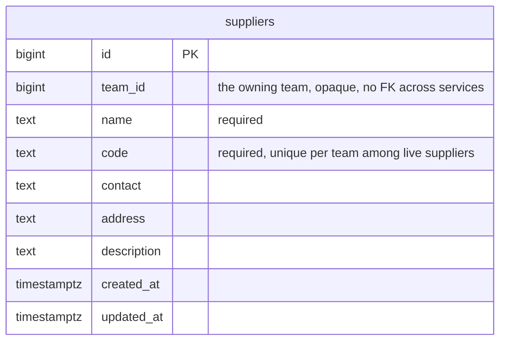

**The spec.** Built as is — `SupplierCreate` and `SupplierUpdate` already take all five fields, and
`suppliers_team_code_active_unique` makes the code unique per team among live suppliers. Three built fields are not
on your list — `province`, `city`, `deleted` — and stay until [Q8](./context_clarify.md#question) answers.
Whether another team USES this row or copies it is still [Q1](./context_clarify.md#question).

## the-supplier-lists-only-its-online-stores

🔄 **Renamed by your fourth edit (2026-10-06):** the table keeps the built name **`supplier_channels`**, and `marketplace_type` is **`channel_type`**. The verdict holds. Below, read `supplier_marketplaces` as `supplier_channels` — and `SupplierChannel*` keeps its name.

> Owner, in [context.md](./context.md) §Table Must Have *(2026-10-06)*: `supplier_marketplaces` — `id`, `supplier_id`,
> `marketplace_type` (`shopee` · `lazada` · `tiktok` · `tokopedia` · `custom`), `name`, `uri`, `description`,
> `updated_at`, `created_at`. It answers [Q5](./context_clarify.md#question): a website bought from is a supplier
> with a `custom` marketplace and its `uri`.

**The verdict.** A supplier lists the **online stores** it sells through — one row per store, on a marketplace or
a `custom` site. A **physical** vendor has no row here: it is reached through the supplier's own `contact` and
`address`.

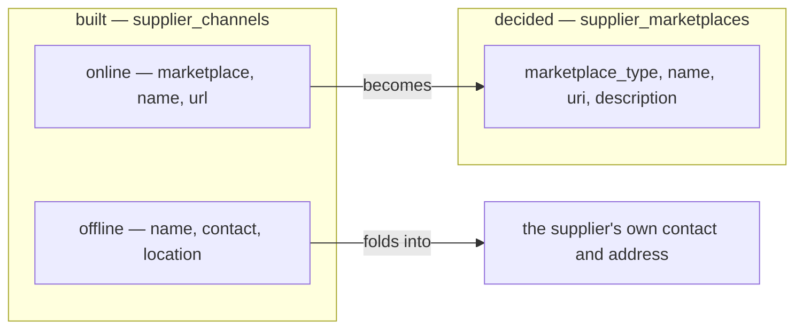

**The spec.**

| | built `supplier_channels` | decided `supplier_marketplaces` |
| --- | --- | --- |
| kind | `type` online · offline | none — every row is online |
| platform | `marketplace`, online only | `marketplace_type`, required — which list is [Q7](./context_clarify.md#question) |
| store name | `name` | `name` |
| link | `url`, optional | `uri` |
| | `contact`, `location` | gone — they are the supplier's own fields |
| | — | `description` 🆕 |

- **Migration.** An online channel becomes a marketplace row (`url` → `uri`). An offline channel's `contact` and
  `location` fill the supplier's `contact` and `address` when those are empty, and otherwise are appended to its
  `description`, so nothing typed is lost.
- **`SupplierChannel*` become `SupplierMarketplace*`**, same roles: the selling Owner and Admin write, the whole team
  reads.

## a-team-restocks-from-another-teams-supplier

🔄 **Restated 2026-10-07** in your §Supplier Rule: *"each selling team can manage their own supplier"*, and another team's supplier is *"choose per product in restock"* — per line, as [a-line-names-the-channel-it-was-bought-from](../inventory/restock_decision.md#a-line-names-the-channel-it-was-bought-from) already says. The rest is the restock's: [restock Q2, Q3, Q12](../inventory/restock_clarify.md#question).

> Owner, in [context.md](./context.md) §General 3 *(2026-10-06)*: *"other selling team can use other selling team
> supplier for their restock."* It answers [Q1](./context_clarify.md#question), **against my recommendation**: I had
> said copy, so that one team's edit and delete could never reach another team's restocks.

**The verdict.** There is **one row per vendor**, owned by the team that created it. Any selling team may name it on its
own restock, without copying it.

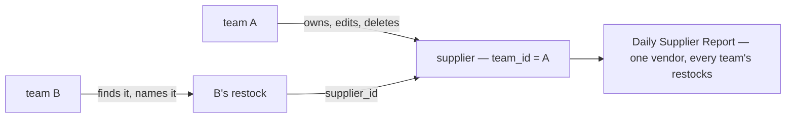

**The spec.**

| site | today | becomes |
| --- | --- | --- |
| [restock_request_create.go:16](../../../backend/services/inventory_service/inventory_v1/restock_request_create.go#L16) and the update | the supplier must belong to the **requesting** team, or `NotFound` | a **live supplier of any selling team** |
| `SupplierService`'s comment, `RestockRequest.supplier_id`'s comment | *"one team can never read another team's supplier"* | rewritten — `SupplierByIds` is no longer the one exception |
| `restock_requests.supplier_id` | a real FK to `suppliers` | unchanged — a foreign key does not care which team owns the row · 🔄 **removed by [the-supplier-gets-its-own-service](#the-supplier-gets-its-own-service)** |

What it leaves open: what A's edit and delete do to B's restocks, and how B's restock form finds A's supplier —
[Q2](./context_clarify.md#question).

## only-a-selling-team-has-suppliers

> Owner, in [context.md](./context.md) §General 4 *(2026-10-06)*: *"only selling team that can have supplier."*

**The verdict.** A supplier's `team_id` is always a **selling** team. A warehouse team still **reads** a supplier, because
it reads the vendor's name on the delivery at its door, but it never owns one.

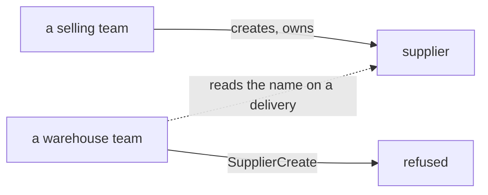

**The spec.** `SupplierCreate` refuses a team whose type is not SELLING, with one lookup in `team_service`. Today it
writes into any team it is given ([supplier_create.go:12](../../../backend/services/inventory_service/inventory_v1/supplier_create.go#L12)).
The selling roles on its policy keep out a warehouse's own people, but Root and the Administrator bypass the scope, and
they can create one in a warehouse team.

## manage-and-discover-are-two-pages

🔄 **Refined 2026-10-06** by [discover-searches-every-teams-suppliers](#discover-searches-every-teams-suppliers): discover searches ALL teams' suppliers, the caller's own included — not only *other* teams'.

> Owner, in [context.md](./context.md) §What Frontend Expected *(2026-10-06)*: *"frontend use this service for 2 page
> supplier. 1. supplier managing page. 2. discover supplier. its for search other team supplier."*

**The verdict.** **Two pages.** One manages my team's suppliers. The other searches every other selling team's.

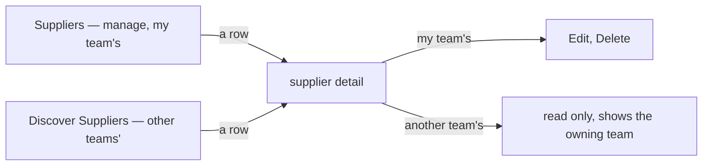

**The spec.**

| page | route | built |
| --- | --- | --- |
| manage | `/inventories/suppliers` — `pages/suppliers/` | ✅ as is |
| discover | `/inventories/suppliers/discover` — 🆕 `pages/supplier-discover/` | ❌ |
| detail | `/inventories/suppliers/:supplierId` — `pages/supplier-detail/` | ✅ for my team's · ❌ another team's answers `NotFound` today |

## another-team-sees-everything-of-a-supplier

🔄 **Its spec is superseded (2026-10-06)** by [products-hang-off-a-channel](#products-hang-off-a-channel): your `supplier_channel_products` table stores the link, so the products no longer come from restock lines, and Q9 closes. The verdict holds — another team sees everything.

> Owner, in chat *(2026-10-06)*: *"for q3, other team see all, supplier, channel and product"*. It answers
> [Q3](./context_clarify.md#question), **against my recommendation**: I had said another team sees the supplier and
> its stores, but never what the owning team bought there.

**The verdict.** Nothing about a supplier is private to the team that owns it. Every selling team sees its
**record**, its **stores** (`supplier_marketplaces`) and its **products**, meaning what has been bought from it.

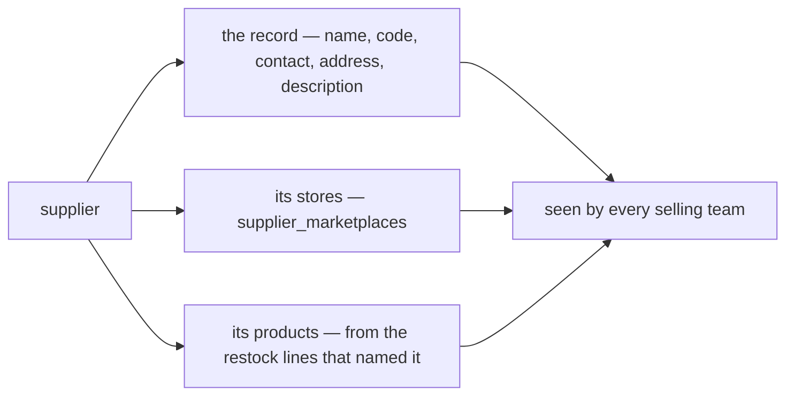

**The spec.**

- **The products come from the restocks.** There is no supplier-to-product table, and none is needed: a restock
  line already keeps `product_id`, `sku`, a snapshot of the product's `name` and the unit `price`
  ([00005_restock_request_items.sql](../../../backend/services/inventory_service/db_migrations/00005_restock_request_items.sql)),
  and its restock names the supplier. A supplier's products are the distinct products on those lines, from every team.
- **Its own read, paginated.** A supplier that has supplied for years has a long product list, so it is a list RPC
  with a page filter (HARD RULE 9), not a field on the supplier.
- **Still open:** which restocks count, whether the price shows, and whether the discover search reaches product
  names — [Q9](./context_clarify.md#question).

## the-supplier-has-no-code

> Owner, in [context.md](./context.md) §Table Must Have 1 *(2026-10-06, the fourth edit)*: `suppliers` — `id`, `team_id`,
> `name`, `contact`, `address`, `description`, `updated_at`, `created_at`. `code` is gone. It reverses
> [reversed-the-supplier-keeps-its-code](#reversed-the-supplier-keeps-its-code), and lands where my first pass's Q4 began.

**The verdict.** A supplier has **no code**. People find it by its name, its owning team and its channels.

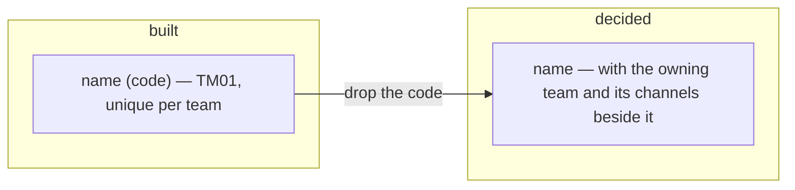

**The spec.** Every site that carries the code loses it:

| site | change |
| --- | --- |
| `suppliers.code` and `suppliers_team_code_active_unique` | dropped by a migration |
| `Supplier.code`, `SupplierCreateRequest.code`, `SupplierUpdateRequest.code`, `SUPPLIER_ROW_SORT_CODE` | removed, numbers reserved |
| the form dialog, the list's Code column, the detail page's badge | removed |
| `SupplierSelect` — shows `name (code)`, searches the code | shows the name, searches the name |
| e2e and story test ids — `supplier-row-${code}` | keyed by id |

Nothing takes over the code's uniqueness: as built, two suppliers in one team may share a name.

## products-hang-off-a-channel

🔄 **How a row is written is now [restock-accepted-links-the-product-to-its-channel](#restock-accepted-links-the-product-to-its-channel)** (2026-10-07) — the deferral named in its spec has ended.

> Owner, in [context.md](./context.md) §Table Must Have 3 *(2026-10-06, the fourth edit)*: `supplier_channel_products` —
> `id`, `channel_id`, `product_id` (unique with `channel_id`), `created_at` — *"use for reference product in discover
> supplier frontend page."* It supersedes the derived-from-restocks spec of
> [another-team-sees-everything-of-a-supplier](#another-team-sees-everything-of-a-supplier), and closes
> [Q9](./context_clarify.md#question): which restocks count and whether a price shows were questions about the
> derived list, which no longer exists.

**The verdict.** A supplier's products are **stored**: one row per product **per channel**, so the discover page can
show what each store sells. A product is listed once per channel.

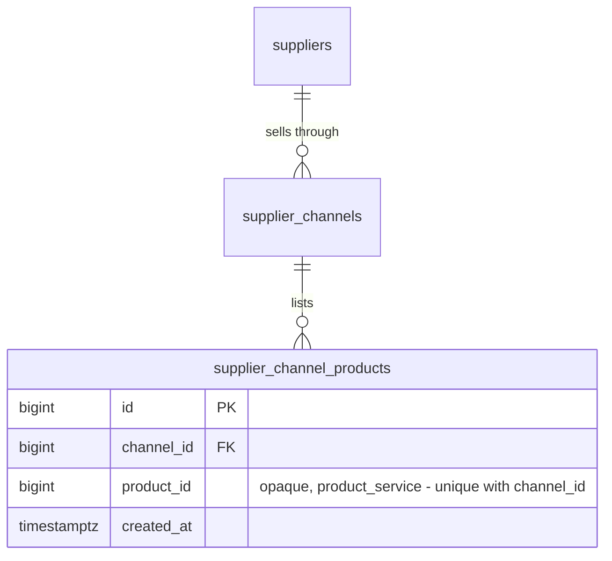

**The spec.** The table as written. How a row gets written is
[linking-products-is-deferred](#linking-products-is-deferred).

## linking-products-is-deferred

🔄 **Ended 2026-10-07** by [restock-accepted-links-the-product-to-its-channel](#restock-accepted-links-the-product-to-its-channel) — your §How We Seed says who writes a link. The verdict was *later*; this is later, so the name is kept.

> Owner, in chat *(2026-10-06)*: *"for how we linked to supplier_channel_products we talk later, its complex, we are
> focus basic crud first"*.

**The verdict.** The next pass is **basic CRUD** of suppliers and their channels. How a product gets linked to a
channel is **talked about later**, along with everything that depends on it.

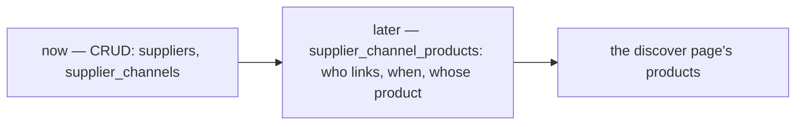

**The spec.**

- `supplier_channel_products` is **created with the linking pass, not now** — my reading of *focus basic CRUD first*.
  A table with nothing writing to it has nothing to test.
- What is parked is listed in the clarify's [Parked](./context_clarify.md#parked--talk-later) section, so the later
  conversation starts from it rather than from nothing. None of it is counted as open.

## statistics-are-deferred

🔄 **Ended 2026-10-07** by [a-supplier-is-measured-per-product-per-day](#a-supplier-is-measured-per-product-per-day) — your §How We provide Analitical Data defines them. The CRUD pass still builds no figures.

> Owner, in [context.md](./context.md) §Whats defer *(2026-10-06, the fifth edit)*: *"defining statistic"* and
> *"defining how we seed `supplier_channel_products`"*. The second is
> [linking-products-is-deferred](#linking-products-is-deferred), now written into your doc as well.

**The verdict.** What a supplier's **statistics** are is defined **later**. The CRUD pass builds no figures.

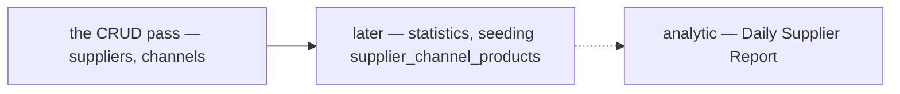

**The spec.** Nothing is built for it now. The analytic doc already names a *Daily Supplier Report Table*; its grain is
an open question in [analytic's clarify](../analytic/context_clarify.md#question), and the supplier's statistics are
defined against it when this is picked up.

## channel-type-is-the-marketplace-list

> Owner, in chat *(2026-10-06)*: *"for 7 im edited again"* — and [context.md](./context.md) §Table Must Have 2 now lists
> `shopee` · `lazada` · `tiktok` · `tokopedia` · `bukalapak` · `blibli` · `custom`. It answers
> [Q7](./context_clarify.md#question), as recommended: the seven are the shared list's seven, with `custom` as its
> *Other*. It resolves the contradiction *two-lists-of-marketplaces*.

**The verdict.** A channel's type is the **shared marketplace list** — the one shops use. A platform added for shops
is there for suppliers too.

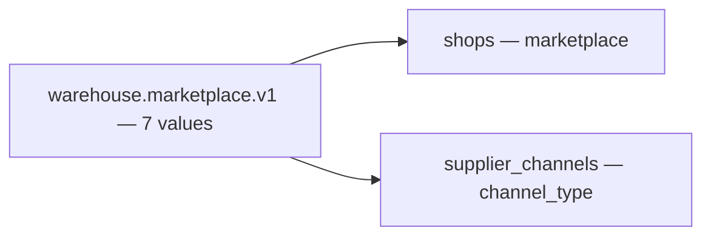

**The spec.** `SupplierChannel.channel_type` is a `warehouse.marketplace.v1.Marketplace`; your `custom` is
`MARKETPLACE_OTHER`, stored as the shared code `other` by
[san_marketplace](../../../backend/pkgs/san_marketplace/marketplace.go). The channel form reuses `MarketplaceSelect`.
⚠ If you want the word *Custom* rather than *Other* on a supplier channel, say so: it is a label, not a new value.

## no-province-or-city

🔄 **Renamed 2026-10-07** from `no-province-city-or-soft-delete` (RULE 12). Its **hard-delete half is reversed** by [a-deleted-supplier-is-kept-for-its-figures](#a-deleted-supplier-is-kept-for-its-figures) — read *delete is a hard delete*, the `deleted` row and the cascade below as superseded. The province-and-city half holds.

> Owner, in chat *(2026-10-06)*: *"for q8, yes"*, confirmed the same day as **drop all three**. It answers
> [Q8](./context_clarify.md#question), **against my recommendation**, which was to keep `province`, `city` and
> `deleted`.

**The verdict.** A supplier is **exactly the fields on your list**. There is no province or city, and **delete is a
hard delete**: the row is gone, and its channels with it.

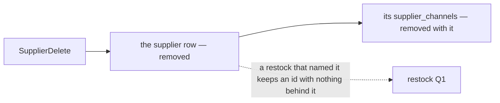

**The spec.**

| site | change |
| --- | --- |
| `province`, `city` | not in `supplier_service`'s table. On the move, a non-empty city or province is appended to `address`, so nothing typed is lost |
| `deleted` | not in the table. Rows already soft-deleted are not moved |
| `SupplierDelete` | deletes the row; `supplier_channels` cascade |
| `SupplierByIds` | a deleted supplier is simply absent, as its contract already allows for an unknown id |

**What it does NOT settle:** what a restock shows once its supplier is deleted, and whether A may delete a supplier B's
restocks name. Both are the restock's questions — moved there with Q2
([restock clarify](../inventory/restock_clarify.md#question)).

## the-supplier-gets-its-own-service

> Owner, in chat *(2026-10-06)*: *"for 6 yes"*, confirmed the same day as **its own `supplier_service`**. It answers
> [Q6](./context_clarify.md#question), **against my recommendation**, which was to stay in `inventory_service`. It
> settles the contradiction *where-the-supplier-lives* — except that your architecture doc still says
> `product_service`.

**The verdict.** Suppliers and their channels leave `inventory_service` for a service of their own,
**`supplier_service`**. Restocks name a supplier by an opaque id, as an order names a shop.

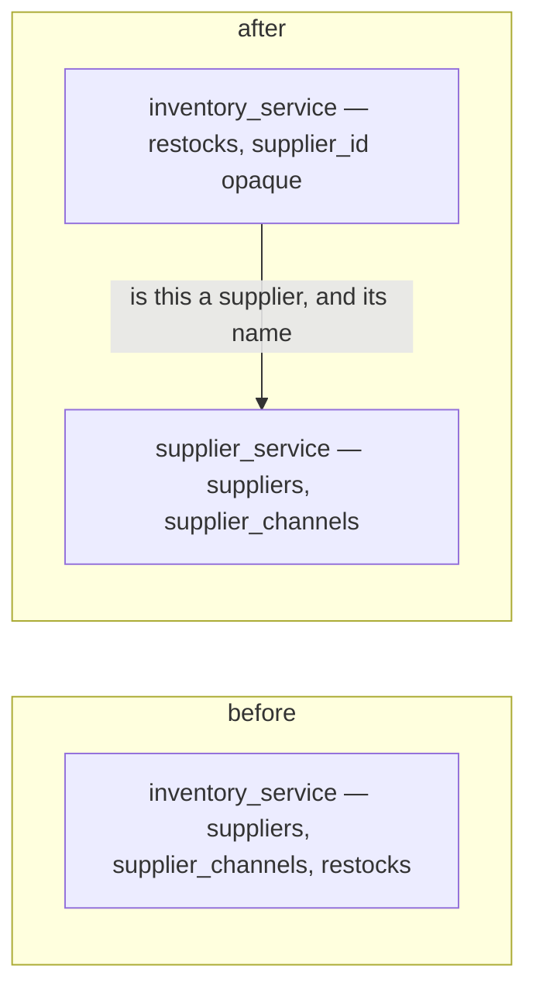

**The spec.**

| | |
| --- | --- |
| the service | `backend/services/supplier_service/` — `supplier_v1/` (one file per RPC, a unit test beside each), `supplier_service_models/`, `db_migrations/`, a `register.go` and a Wire provider (HARD RULE 2) |
| it owns | `suppliers` · `supplier_channels` · later `supplier_channel_products` ([linking-products-is-deferred](#linking-products-is-deferred)) |
| its contract | ⚠ my spec: `proto/warehouse/supplier/v1/`, package `warehouse.supplier.v1` — `SupplierService` and `SupplierChannelService` move there. A breaking move for the frontend's two clients |
| `restock_requests.supplier_id` | loses its foreign key — an opaque id. The restock's check of it becomes a call to `supplier_service`, designed with the restock ([restock clarify](../inventory/restock_clarify.md#question)) |
| what it calls | `team_service` — is the team a selling team ([only-a-selling-team-has-suppliers](#only-a-selling-team-has-suppliers)) |
| who calls it | `inventory_service` for a restock's supplier · the frontend's two pages and `SupplierSelect` |
| docs | `docs/database-schema.md` gains a `supplier_service` section; `docs/services/supplier_service/rpc.md` if a flow crosses services |

🔄 It changes [a-team-restocks-from-another-teams-supplier](#a-team-restocks-from-another-teams-supplier)'s last spec row:
the foreign key it called *unchanged* is the one this removes.

**What it does NOT settle:** ⚠ **moving the suppliers that exist** — copying the rows with their ids (restocks and
batches hold them), then `inventory_service` dropping its tables. A technical item, as the shop's move was; proposed in
the [clarify](./context_clarify.md#proposed-design). And your
[technical/architecture/context.md](../../technical/architecture/context.md) service list still puts the supplier in
`product_service` — your edit.

## superseded-channels-are-a-horizontal-tab

⛔ **Superseded the same day — it was a MISREAD.** *"no just add hrizontal tab channel"* meant tabs BY channel type, not one
tab named Channels; and the owner then replaced both with [supplier-detail-has-channels-and-products-tabs](#supplier-detail-has-channels-and-products-tabs).
Renamed per RULE 12; kept below as it was recorded.

> Owner, in chat *(2026-10-06)*, previewing the CRUD prototype: *"no just add hrizontal tab channel"* — against my
> recommendation, which was rack detail's vertical tabs with the supplier's fields moved into an *Info* tab.

**The verdict.** The supplier's own fields stay where they are, at the top of the page. Below them, the channels sit
under a **horizontal** tab row, with **Channels** as its first and, for now, only tab. That row is where the parked
products per channel and the statistics land later
([linking-products-is-deferred](#linking-products-is-deferred), [statistics-are-deferred](#statistics-are-deferred)).

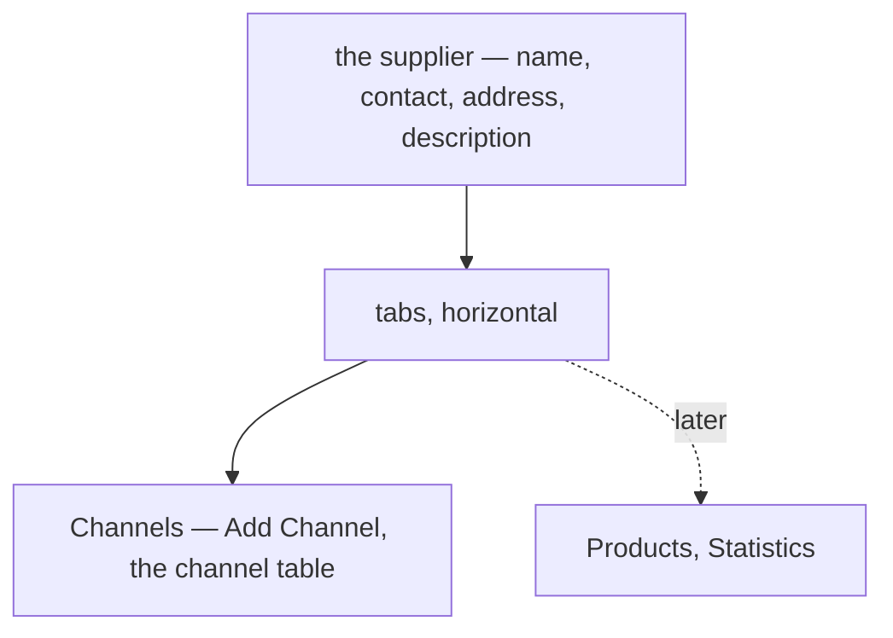

**The spec.** Built in the prototype: `Tabs.Root` with the default horizontal orientation, as team detail uses; the
**Channels** tab is open on arrival and holds Add Channel and the table. Story:
`Pages/Suppliers/SupplierDetail — TheChannelsAreAHorizontalTab`.

## supplier-detail-has-channels-and-products-tabs

> Owner, in chat *(2026-10-06)*, previewing the CRUD prototype: *"i mean tab shopee tokopedia tiktok and etc"*, then
> *"i have better idea, in supplier detail we have tab "Channel" and "Products""*. Confirmed with two sketches the same
> day: the Channels tab is **one list with badges**, and the Products tab shows **sample rows, marked sample** — both
> as I recommended for the first, against my *empty, marked not built* for the second. It supersedes
> [superseded-channels-are-a-horizontal-tab](#superseded-channels-are-a-horizontal-tab), and the per-marketplace tabs,
> which were built and never recorded.

**The verdict.** The supplier's own fields sit on top. Under them, two **horizontal** tabs: **Channels** — every store
in one list, each row wearing its marketplace's badge — and **Products** — what the supplier sells, each with the
channel it is bought from ([products-hang-off-a-channel](#products-hang-off-a-channel)).

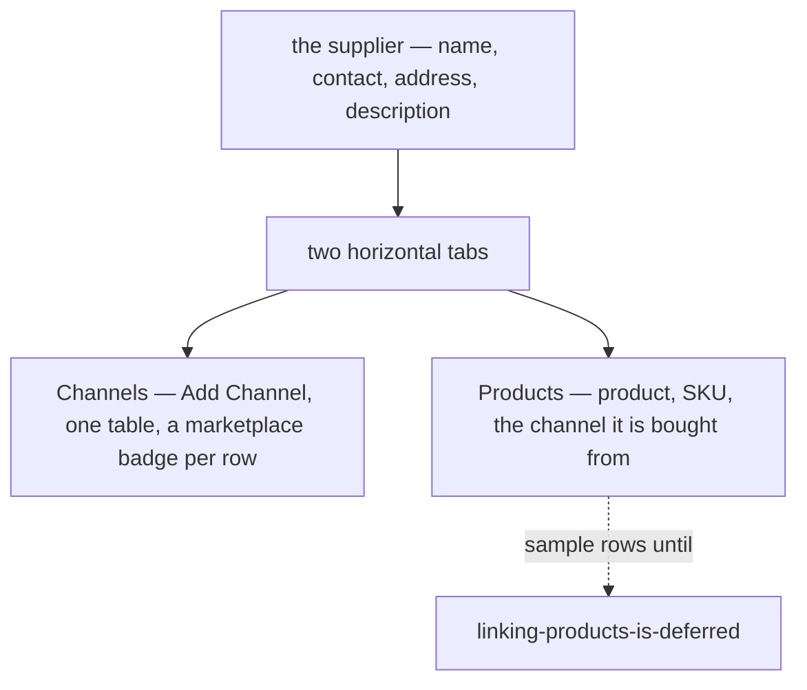

**The spec.**

| | |
| --- | --- |
| the page | `pages/supplier-detail` — `Tabs.Root` horizontal, Channels open on arrival, only the open tab mounted |
| Channels | `components/ChannelsPanel.tsx` — Channel (badge + name) · Link · Description · actions |
| Products | `components/ProductsPanel.tsx` — Product · SKU · Channel (badge + name). ⚠ **sample**: two invented products per real channel (`sampleProducts.ts`), and a `sample` mark on the tab and in the page's summary. Real rows wait on the linking ([linking-products-is-deferred](#linking-products-is-deferred)) |
| stories | `Pages/Suppliers/SupplierDetail` — *ChannelsAndProductsTabs*, *ChannelsAreOneListWithBadges*, *ProductsNameTheirChannel*, *ProductsTab* |

## the-channels-tab-searches-filters-and-pages

> Owner, in chat *(2026-10-06)*: *"channel tab can search and filter by channel type, dont forget pagination too"*.

**The verdict.** The Channels tab — on the manage detail and the discover detail alike — has a **search** (the
channel's name, link and description), a **channel-type filter** (the shared marketplace list, empty = every type)
and a **pager** (10 · 20 · 50).

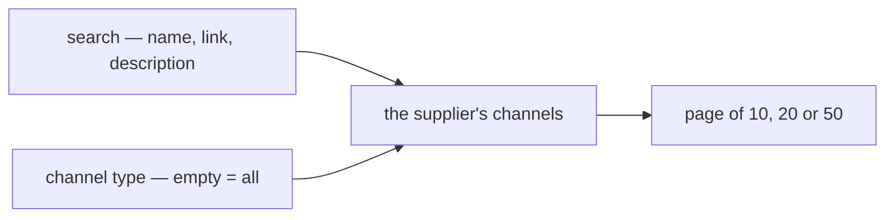

**The spec.** `features/suppliers/ChannelBrowser.tsx`, through the shared `FilterBar` (a bottom sheet on a phone).
⚠ In the BROWSER for now (`channelPage` in `adapt.ts`), over the supplier's whole list: the old
SupplierChannelList takes a supplier and a page and nothing to search or filter by. **supplier_service's
`SupplierChannelList` takes `q`, `channel_type` and a page** — the screen does not change when it does.

## the-products-tab-searches-and-pages

> Owner, in chat *(2026-10-06)*: *"product tab can search, and dont forget pagination too"*.

**The verdict.** The Products tab has a **search** (the product, its SKU, or the channel it is bought from) and a
**pager** (10 · 20 · 50).

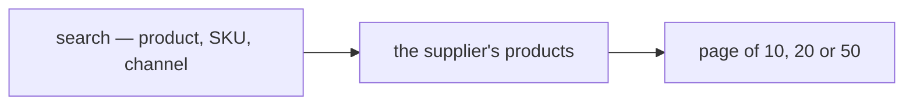

**The spec.** `features/suppliers/ProductBrowser.tsx`. ⚠ Over SAMPLE rows until the channel-product linking is
designed ([linking-products-is-deferred](#linking-products-is-deferred)); the real read searches and pages on the
server.

## discover-searches-every-teams-suppliers

> Owner, in chat *(2026-10-06)*: *"create discover supplier page, the context is focus on search supplier across all
> team. its independently from suppliers page. and suppliers page is list for supplier that we managed. do it for
> detail too"*. It refines [manage-and-discover-are-two-pages](#manage-and-discover-are-two-pages), which said
> *every OTHER team's*.

**The verdict.** Two pairs of pages, independent of each other:

| | list | detail |
| --- | --- | --- |
| **My Supplier** — what this team manages | `/inventories/suppliers` | `/inventories/suppliers/:id` — editable |
| **Discover Supplier** — every team's, searched across teams | `/inventories/suppliers/discover` | `/inventories/suppliers/discover/:id` — read-only, names the owning team |

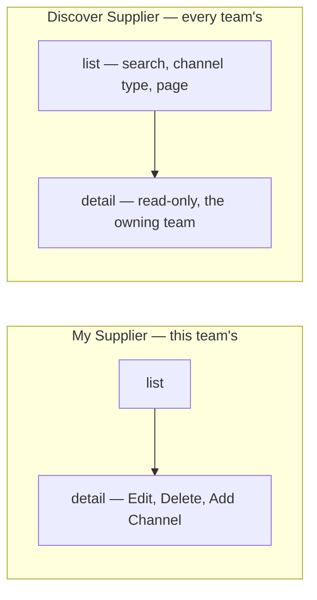

**The spec.**

| | |
| --- | --- |
| the list | `pages/supplier-discover` — Supplier (name, address) · Team (`TeamItem`) · Channels (a badge per type, ×n) · Contact. Search reads the supplier, its address and contact, its team and its stores' names; the filter is "has a store of this type"; a pager of 10 · 20 · 50 |
| the detail | `pages/supplier-discover-detail` — the supplier, the team that keeps it, and the same Channels and Products tabs as the manage detail, with no actions |
| the menu | ⚠ my spec: **My Supplier** and **Discover Supplier** under Inventories for a selling team — the same pair as My Product and Discover Product |
| ⚠ the data | **SAMPLE** (`features/suppliers/discover.ts`): no server searches every team's suppliers yet. supplier_service's `SupplierList` needs a cross-team scope and `SupplierDetail` / `SupplierChannelList` must answer for another team's supplier |

## restock-accepted-links-the-product-to-its-channel

🔄 **Its readings are decided** (2026-10-07): [every-accepted-line-links-its-own-product](#every-accepted-line-links-its-own-product) · [a-store-delete-is-soft-too](#a-store-delete-is-soft-too) · [a-link-remembers-its-last-restock](#a-link-remembers-its-last-restock) — a redelivered event now raises `last_restocked_at` at most, instead of writing nothing.

🔄 **2026-10-07** — delete is soft ([a-deleted-supplier-is-kept-for-its-figures](#a-deleted-supplier-is-kept-for-its-figures)), so a deleted supplier's links stay, hidden with it. Whether a store's own delete is soft too is [Q11c](./context_clarify.md#question).

> Owner, in [context.md](./context.md) §How We Seed `supplier_channel_products` *(2026-10-07)*: *"Restock Accepted
> Event"* → *"add to table"*; and [restock.md](../inventory/restock.md) §Restock Accepted Flow: *"for what case that
> `supplier_service` listen restock accept, see supplier context"*. It ends
> [linking-products-is-deferred](#linking-products-is-deferred), and answers
> [restock Q10a](../inventory/restock_clarify.md#question) as recommended.

**The verdict.** A channel's product list is written by the **restocks**, never by hand. When a restock is accepted,
every line that names a channel adds its product to that channel — once, however many times it is bought there again.

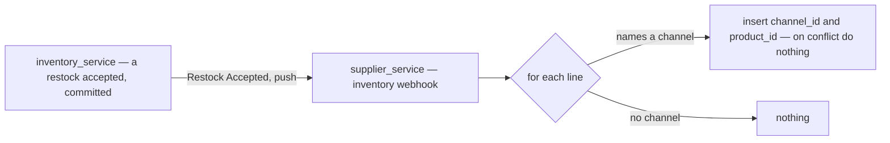

**The spec.**

| | |
| --- | --- |
| the source | the *Restock Accepted* event, by push — [accept-is-one-transaction-then-an-event](../inventory/restock_decision.md#accept-is-one-transaction-then-an-event) |
| one row per | accepted line naming a `supplier_channel_id` → (`channel_id`, the line's `product_id`) |
| redelivered | the unique (`channel_id`, `product_id`) — the second insert writes nothing, so the link needs no dedup table of its own |
| by hand | never — no RPC writes or removes a link; a row goes only with its channel, when the hard delete cascades |
| on screen | a new supplier's **Products** tab is empty until a restock bought from it is accepted |
| ⚠ my reading | whose product, which lines, and a channel deleted before the event lands — [Q11](./context_clarify.md#question) |

**What it does NOT settle:** what the discover page shows beside a product, and whether its search reaches products —
both still [parked](./context_clarify.md#parked--talk-later).

## a-supplier-is-measured-per-product-per-day

🔄 **Its key is set** (2026-10-07) by [the-report-is-keyed-by-team-not-by-store](#the-report-is-keyed-by-team-not-by-store) — Q12 closes. **Its write side** by [the-report-is-processed-like-settlement](#the-report-is-processed-like-settlement).

> Owner, in [context.md](./context.md) §How We provide Analitical Data of Suppliers *(2026-10-07)*:
> `supplier_product_daily_reports` — `id`, `day`, `supplier_id`, `product_id`, `restock_count` · `restock_valuation`,
> `shipping_lost_count` · `shipping_lost_valuation`, `shipping_broken_count` · `shipping_broken_valuation`,
> `last_updated`; and §How Supplier Service Rpc Deliver Analytical Data: *"we adopt how settlement deliver analitical
> data"* — Daily, Monthly, Yearly, Supplier Grouped. It ends [statistics-are-deferred](#statistics-are-deferred).

**The verdict.** A supplier's figures are counted **per supplier, per product, per day**: what was restocked from it,
and how much of that was lost or broken on the way — each as units and as value. They are read back the way
settlement's are: a series by day, month or year, or a ranking grouped by supplier.

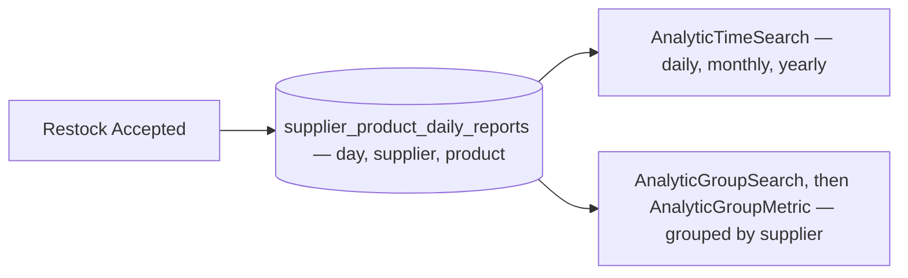

**The spec.**

| | |
| --- | --- |
| the table | as written, in `supplier_service` |
| the measures | six, all **movements** — monthly, yearly and grouped are plain sums. Settlement's SUM-vs-LAST problem ([its clarify](../settlement/analytic_context_clarify.md#-and-the-tracked-field-list-does-not-aggregate-uniformly--the-grouped-rpcs-walk-into-it)) does not arise: there is no balance here |
| the reads | `AnalyticTimeSearch` · `AnalyticGroupSearch` + `AnalyticGroupMetric`, per [settlement's §How Rpc Api Deliver](../settlement/analytic_context.md#how-rpc-api-deliver-analytical-data) — and the open points on that shape are answered once, there |
| ⚠ my reading | it is fed by the *Restock Accepted* event — the only event `supplier_service` hears |

**What it does NOT settle:** the key — whose restock, which store ([Q12](./context_clarify.md#question)); what each
number counts ([Q13](./context_clarify.md#question)); the screens and who sees them ([Q14](./context_clarify.md#question));
the write side and its repair ([Q15](./context_clarify.md#question)).

## the-report-is-keyed-by-team-not-by-store

> Owner, in [context.md](./context.md) §Smallest Grain Reports *(2026-10-07)*: `supplier_product_daily_reports` gains
> `team_id`, and a *"composite unique: `day`, `supplier_id`, `product_id`, `team_id`"*. It answers
> [Q12a](./context_clarify.md#question) as recommended, and Q12b **against** my recommendation by leaving the store out
> of the key.

**The verdict.** One row per **day, supplier, product and restocking team**. A team reads its own purchases from a
supplier by its `team_id`. The figures stop at the supplier — they do not say which of its stores.

```mermaid
flowchart LR
  L["an accepted line — product, store"] -->|"the store's supplier"| K["key — day, supplier, product, team"]
  T["the restock's team"] --> K
  K --> R[("supplier_product_daily_reports")]
```

**The spec.**

| | |
| --- | --- |
| `team_id` | the restocking team, from the event — not the supplier's owning team |
| `supplier_id` | found at the fold from the line's `supplier_channel_id` |
| the unique key | (`day`, `supplier_id`, `product_id`, `team_id`) — the upsert's conflict target |
| a team's own figures | `WHERE team_id = …` — no call to `product_service` |
| what is NOT kept | which store a figure came from: *"which of Melati's stores sends the broken ones?"* cannot be asked of the report. The link table still says which store sells which product |

⚠ **Read from your key, not from a sentence.** If the store was left out because it was not reached yet rather than on
purpose, say so — adding a key column later means refolding the history, and Pub/Sub replays only 30 days.

## the-report-is-processed-like-settlement

🔄 **Its adjustment is [a-late-correction-lands-in-the-six-columns](#a-late-correction-lands-in-the-six-columns)** (Q15d). **Q15c was answered the same day** by [a-deleted-supplier-is-kept-for-its-figures](#a-deleted-supplier-is-kept-for-its-figures).

> Owner, in chat *(2026-10-07)*: *"for q15 we adopt how settlement processing analytic"*. It answers
> [Q15a](./context_clarify.md#question) as recommended, and Q15b **against** my recommendation, which was to repair by
> re-folding the accepted restocks instead of replaying the broker. Q15c — a deleted supplier's rows — is not about
> processing, and stays open.

**The verdict.** `supplier_service` folds *Restock Accepted* exactly as settlement folds its events — and is repaired
the same way: a replay from the broker within 30 days, an adjustment beyond.

```mermaid
flowchart TD
  E["Restock Accepted, pushed to /event/sub_id/push"] --> L{"process_event_lock held?"}
  L -->|"yes"| R5["500 — the broker retries"]
  L -->|"no"| D{"insert supplier_event_logs by message id"}
  D -->|"duplicate"| OK["200"]
  D -->|"new"| F["the links, and the day's row upserted — one transaction"]
  F --> OK
  X["a wrong figure"] --> W{"within 30 days?"}
  W -->|"yes"| RC["AnalyticReplayCompute"]
  W -->|"no"| ADJ["an adjustment — Q15d"]
```

**The spec — settlement's steps, read for the supplier.**

| [settlement](../settlement/analytic_context.md) | `supplier_service` |
| --- | --- |
| the webhook `/event/[sub_id]/push` | the same, on `supplier_service` |
| `settlement_event_logs` — message id, raw, created_at | `supplier_event_logs`, the same columns; rows older than a month deleted by `AnalyticMaintenanceRun` |
| `process_event_lock` | the supplier's own — one service's replay never blocks another's |
| the day — `created_at` in GMT+7 | the event's time in GMT+7 — the accept, which is what [Q13c](./context_clarify.md#question) recommends |
| the day's row — one atomic upsert | the same, adding the six counts on (`day`, `supplier_id`, `product_id`, `team_id`) |
| every later day shifted · the balance-state report | **do not apply** — nothing here is a balance |
| `AnalyticReplayCompute` — lock, delete the daily rows and the event logs from a date, seek, unlock | the same, on the supplier's tables. `supplier_channel_products` is **not** deleted: a replayed link conflicts on its key and changes nothing |
| beyond 30 days — a `system_adjustment` sent to the broker | ⚠ the report has no such column — [Q15d](./context_clarify.md#question) |

**What it does NOT settle:** a deleted supplier's rows ([Q15c](./context_clarify.md#question)); the adjustment
([Q15d](./context_clarify.md#question)); and the template's own open points — the 30-day edge, the replay's deletes in
one transaction, the seek's clock — which are answered once, in
[settlement's clarify](../settlement/analytic_context_clarify.md), and followed here.

## a-deleted-supplier-is-kept-for-its-figures

> Owner, in chat *(2026-10-07)*: *"when supplier deleted, it still show, because we soft delete it and still need that
> for valid analytic"*. It reverses the hard-delete half of [no-province-or-city](#no-province-or-city) — Q8's *drop
> `deleted`*, which was **against** my recommendation to keep it — and answers [Q15c](./context_clarify.md#question).

**The verdict.** Deleting a supplier **hides** it; it does not erase it. It leaves My Supplier, Discover and the restock
picker — and every past restock, every daily row and the ranking still show its name.

```mermaid
flowchart LR
  D["SupplierDelete"] --> F["suppliers.deleted_at set — the row stays"]
  F --> H["hidden — My Supplier, Discover, the restock picker"]
  F --> K["still read by id — a past restock line, the daily report, the ranking"]
```

**The spec.**

| | |
| --- | --- |
| `suppliers.deleted_at` | 🔄 in your table list since your edit the same day — a timestamp ([soft-delete-has-no-column](./context_clarify.md#soft-delete-has-no-column), resolved) |
| `SupplierDelete` | sets it. The row, its channels and their links stay |
| `SupplierList`, Discover, the restock picker | leave a deleted supplier out |
| `SupplierByIds` | returns it, marked deleted — as today's server already does |
| the daily report | untouched: its rows keep a supplier with a name |
| the move ([Q10b](./context_clarify.md#question)) | carries deleted suppliers too, still marked — restocks, batches and figures name them |

**What it does NOT settle:** whether a **store's** delete is soft too ([Q11c](./context_clarify.md#question)).

## the-crud-prototype-is-accepted

🔄 **Built 2026-10-07.** `features/suppliers/adapt.ts` is NOT deleted, as drawn below: every feature folder has an `adapt.ts` — the house proto-to-record mapper — so it stays, and only the translation in it goes (the made-up code, the online/offline fold). The screens did not change.

> Owner, in chat *(2026-10-07)*: *"for q10 yes"* — [Q10a](./context_clarify.md#question), as recommended. Per
> [contract-accepted-with-the-screens](../../development_lifecycle_decision.md#contract-accepted-with-the-screens), the
> contract derived from the screens is accepted at the same gate.

**The verdict.** The supplier screens are accepted as built — My Supplier, the supplier detail with its Channels and
Products tabs, Discover Supplier and its detail, `SupplierSelect`. `supplier_service` is built next, behind them.

```mermaid
flowchart LR
  P["the prototype — on today's server, through adapt.ts"] -->|"accepted"| S["supplier_service — warehouse.supplier.v1"]
  S --> W["the screens point at it — adapt.ts is deleted"]
```

**The spec.**

| | |
| --- | --- |
| the service | `backend/services/supplier_service/` — [the-supplier-gets-its-own-service](#the-supplier-gets-its-own-service) |
| the contract | `warehouse.supplier.v1` — the CRUD RPCs in the clarify's [CRUD pass](./context_clarify.md#the-crud-pass--what-changes-from-the-build), soft deletes per [a-deleted-supplier-is-kept-for-its-figures](#a-deleted-supplier-is-kept-for-its-figures) and [a-store-delete-is-soft-too](#a-store-delete-is-soft-too) |
| the screens | unchanged — the translation step goes |
| NOT in this build | the link and the report — they need the restock's accept, and Q13–Q15 |

## existing-suppliers-move-with-their-ids

🔄 **Built 2026-10-07** as `san supplier move`, which `dev setup` runs after migrating. Every service shares ONE database, so supplier_service could not create `suppliers` beside inventory_service's: inventory's `00023` renames its tables — and their indexes and sequences — to `legacy_*`, and is pinned before supplier_service in every apply order. The drop is still a later pass. The move REFUSES, writing nothing, if a supplier created before it ran holds a moving id.

> Owner, in chat *(2026-10-07)*: *"for q10 yes"* — [Q10b](./context_clarify.md#question), as recommended.

**The verdict.** The suppliers that exist today move to `supplier_service` **as they are** — same ids, deleted ones still
marked — so every restock and batch that names one still finds it.

```mermaid
sequenceDiagram
  participant SAN as san — one-shot command
  participant INV as inventory_service tables
  participant SUP as supplier_service tables
  SAN->>INV: read every supplier and store — deleted ones too
  SAN->>SUP: insert them KEEPING their ids — a row already there is skipped
  SAN->>SUP: set the id sequences past the largest id
  Note over INV: dropped by a LATER inventory migration, once the move has run everywhere
```

**The spec.**

| | |
| --- | --- |
| folded | city and province appended to `address`; an offline store's contact and location into the supplier ([the-supplier-lists-only-its-online-stores](#the-supplier-lists-only-its-online-stores)); `code` dropped |
| a store | online → `channel_type` from its marketplace, `url` → `uri`. Offline → folded, not moved |
| deleted | moved with `deleted_at` set — from the row's `updated_at`, the built `deleted` flag has no time |
| run twice | inserts nothing it already has |
| ⚠ the drop | **a later pass**, after the move has run on every database. Shipped together, a fresh `migrate up-all` would drop the rows before the command could copy them |

## every-accepted-line-links-its-own-product

> Owner, in chat *(2026-10-07)*: *"for q11, we are linking at restock"*, confirmed as *"at accept — all of Q11 yes"* —
> [Q11a, Q11b](./context_clarify.md#question), as recommended.

**The verdict.** Every accepted line that names a store links that store to **the line's own product** — the
restocking team's — however its units arrived. Two teams buying one item there are two rows, each naming its team.

```mermaid
flowchart LR
  B["team B's line — its KP-01, Melati Shopee, 5 broken"] -->|"accepted"| L1["link — B's product"]
  C["team C's line — its TS-BLK, Melati Shopee"] -->|"accepted"| L2["link — C's product"]
  L1 --> CH["Melati — Shopee store"]
  L2 --> CH
```

**The spec.**

| | |
| --- | --- |
| the product | the line's `product_id` — the restocking team's |
| which lines | every accepted line naming a store — broken and short ones included |
| the Products tab | Product · SKU · **Team** · Store |
| never | a restock set `lost` or `cancel` — it is never accepted |

## a-store-delete-is-soft-too

> Owner, in chat *(2026-10-07)*: *"all of Q11 yes"* — [Q11c](./context_clarify.md#question), as recommended.

**The verdict.** Deleting a **store** hides it, as deleting a supplier does. A restock line still finds its store, the
store still finds its supplier, and every figure lands.

```mermaid
flowchart LR
  D["SupplierChannelDelete"] --> F["supplier_channels.deleted_at set — the row stays"]
  F --> H["hidden — the Channels tab, the restock picker"]
  F --> K["still found — a restock line, the fold, the report"]
```

**The spec.**

| | |
| --- | --- |
| `supplier_channels.deleted_at` | ⚠ not in your table list — [Contradiction](./context_clarify.md#chat-decisions-outran-your-doc) |
| `SupplierChannelDelete` | sets it; the store's links stay, hidden with it |
| a supplier deleted | its stores are NOT marked — they hide with it, and come back with it |
| the fold | never looks at a delete — it counts and it links |

## a-link-remembers-its-last-restock

> Owner, in chat *(2026-10-07)*: *"all of Q11 yes"* — [Q11d](./context_clarify.md#question), as recommended.

**The verdict.** A link remembers the **last** accept that named it. Nobody removes a link: one a store stopped selling
sinks, dated, to the bottom of the Products tab.

```mermaid
flowchart LR
  E["an accept naming the store and product"] --> X{"link exists?"}
  X -->|"no"| I["insert — created_at, last_restocked_at"]
  X -->|"yes"| U["last_restocked_at — the later of the two"]
```

**The spec.**

| | |
| --- | --- |
| `supplier_channel_products.last_restocked_at` | ⚠ not in your table list — [Contradiction](./context_clarify.md#chat-decisions-outran-your-doc) |
| the write | `ON CONFLICT (channel_id, product_id) DO UPDATE SET last_restocked_at = GREATEST(old, new)` — a late or repeated event never lowers it |
| the Products tab | newest first, showing *last bought* |
| removal | none — a second writer, worth adding the day a wrong link is actually seen |

## each-figure-is-read-at-the-accept

> Owner, in chat *(2026-10-07)*: *"for q13 restock_count is unit when restock accepted, and rest q13 follow your
> recomendation"*. It answers [Q13a](./context_clarify.md#question) **against** my recommendation — *units ordered* — and
> Q13b, c, d as recommended.

**The verdict.** Every figure on a row is what the **accept** knows: the good units that became stock, what was short and
what was broken, each valued at the price the supplier charged, on the day the restock was accepted.

```mermaid
flowchart LR
  O["a line — 10 ordered at Rp 30.000"] --> A["accepted on the 3rd"]
  A --> G["restock_count 7 — good stock, Rp 210.000"]
  A --> B["shipping_broken_count 2 — Rp 60.000"]
  A --> M["shipping_lost_count 1 — short in the box, Rp 30.000"]
```

**The spec.**

| | |
| --- | --- |
| `restock_count` | the line's units **accepted as good stock** — the batch's `init_stock_count` |
| lost, broken | **beside** it, not inside: ordered ≈ restock + lost + broken; a broken rate is broken ÷ (restock + lost + broken) |
| `*_valuation` | units × **the line's price** — what the supplier charged. Never the batch's landed price, which [batch_price_logs](../inventory/batch.md) can edit later |
| `day` | the **accept** day, Jakarta time — settlement's *created_at in GMT+7*, read for the accept |
| `shipping_lost` | units **short in an accepted parcel** — restock's problem rows. A parcel never received is not counted. If restock [Q6c](../inventory/restock_clarify.md#question) renames the short unit `missing`, these columns follow |

## the-figures-are-a-statistics-tab-and-a-supplier-report

🔄 **Prototyped 2026-10-07** on sample figures — [The screens](./context_clarify.md#the-screens); its design_accept is [Q17](./context_clarify.md#question), and ranking by rate raised [Q18](./context_clarify.md#question).

> Owner, in chat *(2026-10-07)*: *"for q14, i follow your recomendation"* — [Q14a, b, c](./context_clarify.md#question),
> as recommended.

**The verdict.** A supplier's figures are read in **two places**: a **Statistics** tab on both supplier details — the
series by day, month or year, and by product — and a **Supplier Report** page that ranks suppliers over a period. The
metrics gain a fourth: **Product Grouped**.

```mermaid
flowchart LR
  MD["My Supplier detail"] --> T["tabs — Channels, Products, Statistics"]
  DD["Discover Supplier detail"] --> T
  T --> ST["Statistics — a period and a grain, the six figures as a series, and by product"]
  RP["Supplier Report — a page under Inventories"] --> RK["suppliers ranked by restocked value or broken rate, over a period"]
```

**The spec.**

| | |
| --- | --- |
| the Statistics tab | beside Channels and Products, on both details · a period and a grain (`PeriodGrainPicker`) · the six figures as a series (`AnalyticTimeSearch`) · a table by product (Product Grouped) |
| the Supplier Report | a page under Inventories · suppliers ranked by restocked value or broken rate over a period (`AnalyticGroupSearch`, then `AnalyticGroupMetric`) |
| Product Grouped | 🆕 the fourth metric — ⚠ your §What Metric that existed still lists 1, 2, 3, 5 ([Contradiction](./context_clarify.md#chat-decisions-outran-your-doc)) |
| built | ❌ — a prototype on sample figures comes first; the real figures wait on the restock's accept |

## every-selling-team-sees-every-teams-figures

> Owner, in chat *(2026-10-07)*: *"for q14, i follow your recomendation"* — [Q14d](./context_clarify.md#question), as
> recommended.

**The verdict.** A supplier's figures are **not private** to the team that bought: every selling team sees every team's
figures for any supplier, and can narrow them to its own. A broken rate is worth most to the team that has not bought
there yet.

```mermaid
flowchart LR
  A["team A's restocks"] --> R[("daily rows — team_id")]
  B["team B's restocks"] --> R
  R --> V["read by every selling team"]
  V --> F["team filter — empty is every team"]
```

**The spec.**

| | |
| --- | --- |
| the call's scope | the caller's team, as on every read — the rows it may return are every team's |
| the team filter | `team_id` on the daily rows — empty means every team |
| consistent with | [another-team-sees-everything-of-a-supplier](#another-team-sees-everything-of-a-supplier) |

## custom-is-labelled-other

> Owner, in chat *(2026-10-07)*: *"for 10c, yes, Other"* — [Q10c](./context_clarify.md#question), as recommended.

**The verdict.** Your `custom` channel type is shown as **Other** — the same word, for the same value, that a shop's
marketplace uses.

```mermaid
flowchart LR
  E["MARKETPLACE_OTHER — stored as other"] --> SH["a shop — Other"]
  E --> SU["a supplier's store — Other"]
```

**The spec.** Nothing to build: `MarketplaceSelect` and `MarketplaceBadge` already say Other
([channel-type-is-the-marketplace-list](#channel-type-is-the-marketplace-list)).

## a-late-correction-lands-in-the-six-columns

> Owner, in chat *(2026-10-07)*: *"for 15d i follow your recomendation"* — [Q15d](./context_clarify.md#question), as
> recommended.

**The verdict.** A figure found wrong after the 30-day replay window is corrected **in the six columns themselves** — a
lost restock was a real restock, so the corrected count is a count like any other. There is no `system_adjustment`.

```mermaid
flowchart LR
  M["March — 10 shirts from Melati never counted, found in June"] --> R["Root — san command"]
  R --> P["AnalyticAdjust RPC — Root only"]
  P --> E["an adjustment event — day, supplier, product, team, six deltas"]
  E --> F["the same fold — restock_count +10 on March's row"]
```

**The spec.**

| | |
| --- | --- |
| the event | day · supplier · product · team · the six deltas, any of them 0 — ⚠ its name is mine to choose at build |
| who sends it | a Root-only RPC, called by a `san` command (HARD RULE 3b) — never a hand-written UPDATE |
| the fold | the same upsert and the same dedup by message id as *Restock Accepted* |
| what it costs | the report no longer shows that a figure was corrected — a count, not money a team is owed |

## the-team-filter-picks-any-selling-team

> Owner, in chat *(2026-10-07)*: *"in supplier report, add search, team filter"*, confirmed as **the restocking team**, and
> **the same picker on the Statistics tab**. It answers the first reading of [Q17](./context_clarify.md#question)
> **against** the prototype's two buttons — *Every Team / Our Team*.

**The verdict.** Whose restocks the figures count is picked from **every selling team** — one picker, empty = every
team. Your own team is one of the choices; another team is too.

```mermaid
flowchart LR
  P["team picker — selling teams, empty = every team"] -->|"empty"| E["every team's restocks"]
  P -->|"Toko Melati"| M["only Toko Melati's restocks — ours, if it is ours"]
  P -->|"Toko Kenanga"| K["only Toko Kenanga's restocks"]
  E --> R[("daily rows — team_id")]
  M --> R
  K --> R
```

**The spec.**

| | |
| --- | --- |
| the control | `TeamSelect`, selling teams only, placeholder *Every team* — `RestockTeamFilter` in `features/suppliers/FigureParts.tsx` |
| where | the Supplier Report and the Statistics tab of both supplier details, in a `FilterBar` |
| the read | `team_id` on the daily rows, `0` = every team — [every-selling-team-sees-every-teams-figures](#every-selling-team-sees-every-teams-figures)'s filter, unchanged |
| a team picked | the Statistics tab's by-product table drops its Team column — it would name that team on every row |

## the-supplier-report-searches-like-discover

> Owner, in chat *(2026-10-07)*: *"in supplier report, add search, team filter"*.

**The verdict.** The Supplier Report finds suppliers the way Discover does, and its headline is the total of what the
search found — not of every supplier.

```mermaid
flowchart LR
  Q["the search — pekalongan"] --> S["suppliers whose name, address, contact or a live store's name match"]
  S --> H["the headline — those suppliers together"]
  S --> R["the ranking — those suppliers"]
```

**The spec.**

| | |
| --- | --- |
| matches | the supplier's name, address and contact, and its live stores' names — `SupplierList`'s `q`, so the two pages cannot disagree about what a search means |
| not | a team's name — [discover-filters-by-the-team-that-keeps-it](#discover-filters-by-the-team-that-keeps-it) |
| the read | the ranking (`AnalyticGroupSearch`) takes the same `q` — supplier_service holds both the suppliers and the daily rows, so it is a join, not a call |
| debounced | one request per settled word |

## discover-filters-by-the-team-that-keeps-it

> Owner, in chat *(2026-10-07)*: *"in discover supplier too"* — beside the report's search and team filter. It answers
> [Q16](./context_clarify.md#question) **as recommended**: a Team filter, not a search over team names.

**The verdict.** Discover Supplier picks the team whose suppliers it lists. Typing a team's name in the search finds
nothing — the team is picked, not typed.

```mermaid
sequenceDiagram
  participant UI as Discover Supplier
  participant SUP as supplier_service
  UI->>SUP: SupplierList — EVERY_TEAM, q, channel_type, owner_team_id 15
  SUP-->>UI: only the live suppliers team 15 keeps
```

**The spec.**

| | |
| --- | --- |
| the contract | `SupplierListFilter.owner_team_id` — `0` = any team. Not `team_id`: the request's own `team_id` is the caller's scope |
| the query | `suppliers.team_id = ?` — served by `suppliers_team_live_idx` |
| under OWN | ANDed with the scope — another team's id lists nothing |
| the control | `TeamSelect`, selling teams only (only-a-selling-team-has-suppliers), placeholder *Any team*, beside the search and the type filter |

## the-figures-screens-are-accepted

🔄 **Built 2026-10-07** — the event, the fold, the four reads, the replay and maintenance, the backfill; the screens read real figures and the sample is deleted. State: [development_state/supplier/context.md](../../development_state/supplier/context.md).

> Owner, in chat *(2026-10-07)*: *"i accept the frontend supplier, can we make fully implement ?"* — the design_accept of
> [Q17](./context_clarify.md#question), as recommended. Per
> [contract-accepted-with-the-screens](../../development_lifecycle_decision.md#contract-accepted-with-the-screens), the
> reads derived from the screens are accepted at the same gate.

**The verdict.** The Statistics tab and the Supplier Report are accepted as prototyped — tables, units and value in one
cell, no series on the report, the team picker and the report's search. The figures behind them are built for real.

```mermaid
flowchart LR
  P["the prototype — sample figures"] -->|"accepted"| C["warehouse.supplier.v1 — the analytic reads"]
  C --> F["supplier_service folds Restock Accepted"]
  F --> S["the screens read real figures — the sample is deleted"]
```

**The spec.**

| | |
| --- | --- |
| the reads | `SupplierAnalyticService` — `AnalyticTimeSearch` (one supplier's series and its window total), `AnalyticProductSearch` (Product Grouped), `AnalyticGroupSearch` (the ranking, with the search and the team picker), `AnalyticGroupMetric` (a ranked page's figures) |
| the repair | `SupplierAnalyticMaintenanceService` — `AnalyticReplayCompute`, `AnalyticMaintenanceRun`, as settlement's ([the-report-is-processed-like-settlement](#the-report-is-processed-like-settlement)) |
| NOT in it | the Products tab — it needs a store on each restock line ([the-supplier-comes-from-the-restock-until-lines-name-a-store](#the-supplier-comes-from-the-restock-until-lines-name-a-store)) |

## the-supplier-comes-from-the-restock-until-lines-name-a-store

> Owner, in chat *(2026-10-07)*: **"Build now"** — asked because the built restock names a supplier on the RESTOCK and no
> store on its lines, while [the-report-is-keyed-by-team-not-by-store](#the-report-is-keyed-by-team-not-by-store) finds a
> line's supplier through its store.

**The verdict.** Until restock lines name a store, every line of a restock counts for the restock's supplier. The table,
its key and the screens are as decided; only where the fold reads `supplier_id` from changes, the day lines gain a store.

```mermaid
flowchart LR
  R["restock — supplier 31"] --> L1["line — product 5"]
  R --> L2["line — product 9"]
  L1 --> K1["row — day, supplier 31, product 5, team"]
  L2 --> K2["row — day, supplier 31, product 9, team"]
  S["later — a line names its store"] -.->|"the fold reads the store's supplier instead"| K1
```

**The spec.**

| | |
| --- | --- |
| `RestockAccepted.supplier_id` | the restock's — `0` when the restock names none, and then nothing is folded |
| the link (`supplier_channel_products`) | **not built** — it is a store-to-product row, and no line names a store. The Products tab stays sample |
| the day lines gain a store | restock [Q3](../inventory/restock_clarify.md#question) / [Q12](../inventory/restock_clarify.md#question) — the event gains the line's store, the fold reads the supplier from it, and the link is built then. Rows already folded do not move |

## past-accepts-are-backfilled-once

> Owner, in chat *(2026-10-07)*: **"Backfill once"** — asked because restocks accepted before the event existed were never
> sent to the broker.

**The verdict.** A one-shot `san` command folds every restock accepted before the live fold began, through the same fold
code. Run again, it does nothing and says so.

```mermaid
sequenceDiagram
  participant SAN as san supplier backfill-figures
  participant INV as inventory tables
  participant SUP as supplier_service fold
  SAN->>SUP: already backfilled? then stop
  SAN->>INV: every accepted restock naming a supplier, accepted before the live fold began
  loop each restock
    SAN->>SUP: the same RestockAccepted the accept would have sent — the same fold, the same dedup
  end
  SAN->>SUP: mark backfilled
```

**The spec.**

| | |
| --- | --- |
| the event | built by the same function the accept uses — `event_id` `restock-accepted:<id>`, so a restock folded live is claimed already |
| the cutoff | `figures_live_since` — the earliest accept the WEBHOOK has folded, kept in `supplier_service_metadata`. The dedup rows are pruned after 45 days; the cutoff is not, so a late backfill cannot fold a live restock twice |
| run twice | `figures_backfilled` in the same table — the second run folds nothing |
| `dev setup` | runs it after the supplier move |

## rate-ranking-needs-50-units

> Owner, in chat *(2026-10-07)*: **"50 units"** — [Q18](./context_clarify.md#question), as recommended.

**The verdict.** Ranked by broken rate, only a supplier with at least 50 units received in the window is rated against the
others. The rest follow — still listed, their rate shown muted.

```mermaid
flowchart LR
  A["Melati — 40 broken of 1.000, 4%"] --> R1["rank 1"]
  B["Sinar — 3 broken of 120, 2,5%"] --> R2["rank 2"]
  C["Toko Kecil — 1 broken of 2, 50%"] --> R3["after them — rate muted"]
```

**The spec.**

| | |
| --- | --- |
| units | restocked + lost + broken in the window — every unit that came off the supplier |
| the order | units ≥ 50 first, by rate descending; then the rest, by rate; ties by restocked value |
| the number | `AnalyticGroupSearchResponse.rate_min_units` — the screen reads it, never its own copy |
| by value | unchanged — the minimum is for the rate only |

## suppliers-is-a-menu-group-like-products

> Owner, in chat *(2026-10-07)*: *"make suppliers as parent menu like product, and its have child"*.

**The verdict.** A selling team's menu has a **Suppliers** group, shaped like **Products**, right under Inventories. The
supplier pages leave Inventories, where they read as a kind of stock — a supplier is who the stock comes FROM.

```mermaid
flowchart LR
  P["Products — My Product, Discover Product"] --> I["Inventories — Restock, Placements, …"]
  I --> S["Suppliers — My Supplier, Discover Supplier, Supplier Report"]
```

**The spec.**

| | |
| --- | --- |
| the group | `nav.suppliers`, the factory icon, a selling team's alone — a warehouse does not own the suppliers it receives from (#212) |
| the routes | unchanged, `/inventories/suppliers/…` — only the menu moved; "where am I" matches the longest prefix, so the three still win over Inventories' own children |
