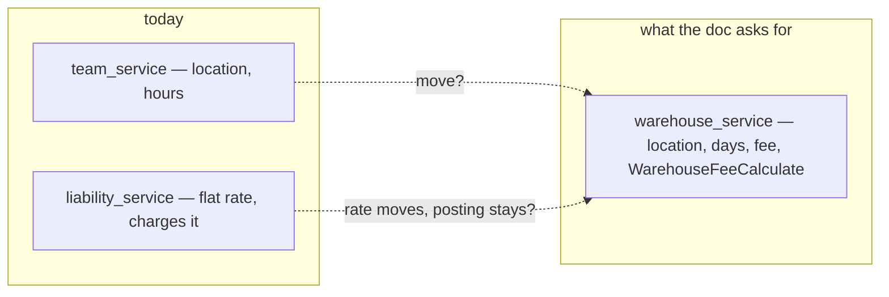
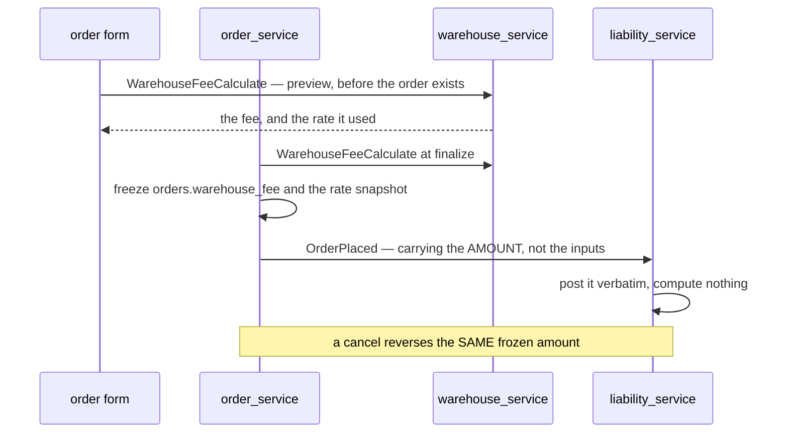
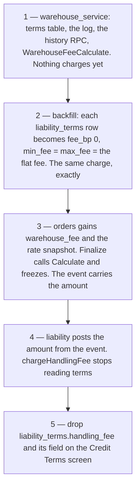
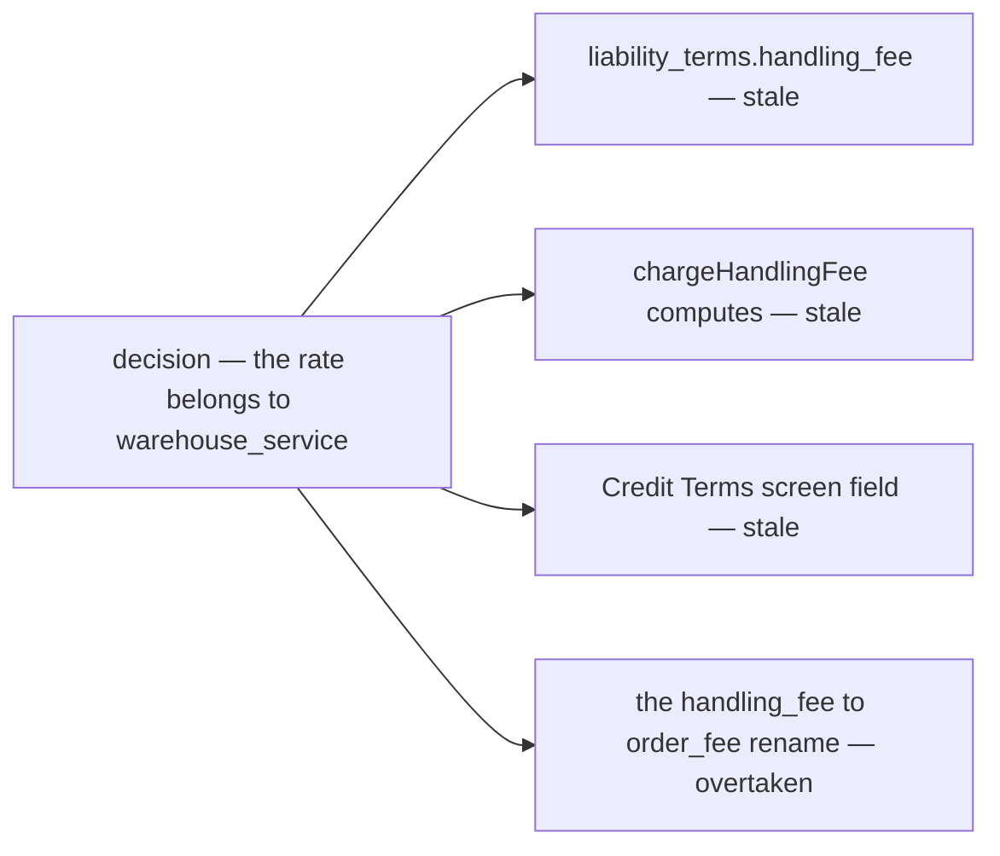
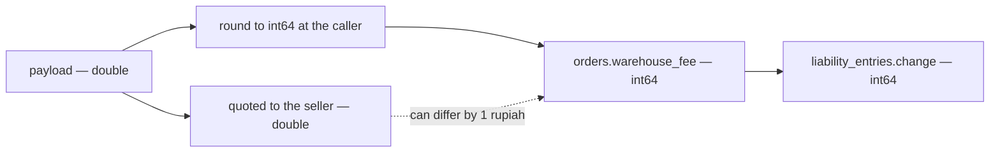

# Clarity — warehouse `context.md`

What [context.md](./context.md) leaves open. **That doc is yours — this one is mine.** Answered points are
deleted, so this file is always the current open set; what you settle goes in `context_decision.md`.

> 🆕 **First pass, 2026-09-16.** Three of the four things the doc asks for **already exist somewhere else in the
> build** — the location and the open/close grid are a shipped table in `team_service`, and the order fee is a
> shipped **flat** rate in `liability_service`. So the first question is not *how do we build this*, it is
> **what does `warehouse_service` TAKE OVER**, and what happens to the rate that is already charging money.
>
> 🔄 **Revised the same day — you added the `WarehouseFeeCalculate` payload.** ✅ It settles two things I had
> asked for: the RPC takes a **basis, not an `order_id`** (so `warehouse_service` never depends on
> `order_service`), and it **echoes the rate it used**, which is what makes a charge explainable months later.
> ✅ **Then §Responsbility 2 settled the biggest question in this file** — *warehouse gives the RPC, balance
> handles and records, order calls it*. Recorded as
> [warehouse-prices-balance-records](./context_decision.md#warehouse-prices-balance-records), and it closes the
> ownership fork outright: the rate lives where the calculation lives, balance is **told** the amount, and the
> number is fixed when the order calls. What is left of it is one narrow question — whether
> `liability_terms.handling_fee`, which stores a rate and computes from it **today**, is
> [dropped](#is-the-old-flat-rate-column-dropped).
>
> ⛔ **The payload still opens three sharper ones:** every money field in it is a **`double`**, where this system has
> **no float anywhere** — `int64` whole rupiah in every proto, stated as a rule in
> [expense.proto](../../../proto/warehouse/expense/v1/expense.proto) · the request names **no selling team**, which
> both kills the per-pair rate liability already charges **and** leaves the message with no `use_scope` field, so
> the access interceptor cannot scope it · and it prices **one** warehouse per call, so the order form comparing
> three is three round trips.

Siblings: [order](../order/context_clarify.md) · [balance](../balance/context_clarify.md) ·
[inventory](../inventory/context_clarify.md) · [technical/balance](../../technical/balance/team_balance_design_clarify.md).

---

## What is already built, before anything is designed

| what your doc asks for | where it lives TODAY | shape today |
| --- | --- | --- |
| Location Info | `team_service.warehouse_infos.location` | one free-text line, no region codes |
| Open/Close Order Day | `team_service.warehouse_infos.receiving_hours` + `operating_hours` | a weekly JSONB grid, ⛔ **read by nobody — no RPC consults it** |
| Fee Configuration | `liability_service.liability_terms.handling_fee` | a **flat rupiah amount per order**, per creditor→debtor **pair**, `0` = charge nothing |
| `WarehouseFeeCalculate` | nothing | the fee is computed **inside liability**, from the `OrderPlaced` push, and never returned to anyone. Your payload is the first statement of it as a contract — see [the proto](#the-payload-as-i-would-write-it) |
| `orders.warehouse_fee` *(order context)* | nothing | ⛔ the column does not exist — no order stores what it was charged |



---

## Proposed Design

### a-warehouse-is-a-warehouse-team

A warehouse is **a team of `TEAM_TYPE_WAREHOUSE`**, and `warehouse_id` everywhere in the build is that team's
id — on `orders`, on every stock row, on every rack, on `warehouse_products`. Keep it. `warehouse_service`
then owns the **profile of a warehouse team**, never a second identity.

**→ Recommend:** one profile row per warehouse team, `UNIQUE (warehouse_id)`. A team that opens a second
building becomes a **second team** — that keeps stock, racks and orders addressable by one id with no
migration. If a team must ever run two buildings under one balance, say so now, because it changes the grain
of `stock`, `racks` and `orders.warehouse_id` and nothing else about this design.

### the-warehouse-profile-moves-out-of-team-service

`warehouse_infos` is a warehouse-only table sitting in the service that owns **identity**. Your doc claims its
two columns for `warehouse_service`.

**→ Recommend: move it.** `team_service` goes back to *who exists*, `warehouse_service` owns *what a warehouse
is like* — location, calendar, fee. Splitting them instead (fee here, hours there) means a warehouse profile
screen has to call two services, and the owner of one property cannot say who owns the other.

| step | |
| --- | --- |
| 1 | `warehouse_service/db_migrations` creates `warehouses` (location) + `warehouse_days` + `warehouse_fee_terms` |
| 2 | one-off backfill copies `team_service.warehouse_infos` across, then drops it |
| 3 | `WarehouseInfoDetail` / `WarehouseInfoUpdate` move to `warehouse.warehouse.v1` — the two frontend call sites change with them |

### the-fee-is-basis-points-with-a-floor-and-a-cap

`fee_percent` as a float over money is how rounding bugs get written. Money is `int64` rupiah everywhere in
this system, and `liability_terms.product_markup_bp` **already** uses basis points for exactly this reason.

```
fee = clamp( basis * fee_bp / 10000 , min_fee , max_fee )
```

| field | type | meaning |
| --- | --- | --- |
| `fee_bp` | `int64` | 250 = 2.5%. No float, ever |
| `min_fee` | `int64` | 🆕 **not in your list — I think it is missing.** Picking and packing a Rp 10.000 order is the same work as a Rp 1.000.000 one. At 2.5% the small one pays Rp 250 |
| `max_fee` | `int64 NULL` | ⚠ **NULL = uncapped, and `0` must be REFUSED.** `liability_terms.credit_limit` already carries this trap — nil is unlimited, 0 is nothing — and it is the one field in that table with a warning comment on it |
| no row at all | — | **charge nothing.** The same default liability already ships: a warehouse that configured nothing is not silently billing anybody |

### the-payload-as-i-would-write-it

Your payload, and the same contract with the four changes I am arguing for. The shape is yours — the types are
where I disagree.

```proto
// what you wrote                          // what I would write
message WarehouseFeeCalculateRequest {
  double order_total = 1;                  //  int64 order_total     — whole rupiah, never a float
  uint64 warehouse_id = 2;                 //  uint64 warehouse_id
                                           //  uint64 team_id        — the SELLING team: the pair's rate, AND the scope
                                           //  repeated items        — price several warehouses in one call
}

message WarehouseFeeCalculateResponse {
  uint64 warehouse_id = 1;                 //  uint64 warehouse_id
  double order_total = 2;                  //  int64 order_total     — echoed back as given
  double max_fee = 3;                      //  optional int64 max_fee — ABSENT = uncapped
  double fee_percent = 4;                  //  int64 fee_bp          — 250 = 2.5%
                                           //  int64 min_fee         — the floor the doc has no field for
                                           //  bool configured       — false = no rate set, charge nothing
                                           //  Source source         — PAIR row or DEFAULT row answered
  double calculated_warehouse_fee = 5;     //  int64 calculated_warehouse_fee — already rounded
}
```

| change | why |
| --- | --- |
| **`int64`, not `double`** | there is **not one `double` in this repo's protos**, and `expense.proto` states the rule: *"Money is whole rupiah as int64, like every other money field in this system."* A fee crossing the wire as a float is converted to `int64` at both ends — that conversion is where `12.499999` becomes `12` — and the ledger it lands in is `int64` regardless. See [Contradiction](#money-is-a-double-here-and-an-integer-everywhere-else) |
| **`team_id` in the request** | without it the rate cannot differ per seller, which **loses a capability liability already has**. ⚠ And it is not only a rate question: a request message carries its team scope as a **field** (`use_scope`), never a header — with no team on this message the interceptor has nothing to scope, so the policy collapses to *root/admin only* or to *any authenticated caller* |
| **`repeated` items** | the order form's real question is *"what would this order cost me at each of these warehouses"*. One call, one page of rows — the same reason the guideline makes cross-service reads `ByIDs` rather than a call per id. The response already echoes `warehouse_id`, which only earns its place in a batch |
| **`configured` + `min_fee` + `source`** | `calculated_warehouse_fee = 0` today cannot be told apart from *no rate set*, and both are normal. `min_fee` has no field at all, so a floor cannot be expressed even if you want one |

**→ Recommend one more line in the doc: what it ROUNDS to.** `order_total × fee_bp / 10000` is fractional, and
with `double` the rounding is invisible until the ledger truncates it. State *round half up to whole rupiah, in
the RPC*, so the number the order freezes, the number the seller was shown and the number liability posts are
one number.

### the-order-freezes-the-fee-and-the-ledger-posts-it

The fee must be computed **once**, at finalize, and stored. Today liability recomputes it from its own terms
when the push arrives — so a rate edited between commit and delivery charges a number the order never saw.



| | |
| --- | --- |
| the RPC is **pure** | it reads config, writes nothing, and knows nothing about orders — which is what lets the form preview a fee for a warehouse the seller has not chosen yet |
| ✅ it takes a **basis**, not an `order_id` | **your payload says so** — `order_total` + `warehouse_id`. `warehouse_service` never depends on `order_service` to price work |
| ✅ it returns the **rate snapshot** | **your payload says so** — it echoes `max_fee` and `fee_percent`, so a disputed charge can be explained months later. I would add `min_fee` and which row answered |
| ⛔ it is **batch** | not yet — one warehouse per call. [Why it should be](#the-payload-as-i-would-write-it) |
| history | no effective-dating. The order froze the amount, and a `warehouse_fee_terms_log` records who changed the rate and when — the pattern `liability_terms_log` already uses |

### the-rate-moves-in-five-steps-and-no-day-charges-differently

The elaboration of [who-owns-the-rate-after-this](#who-owns-the-rate-after-this). **What is true today, read
off the code** — this is what any answer has to survive:

| | today |
| --- | --- |
| the rate | `liability_terms.handling_fee`, `int64`, **flat per order**, grain `(creditor, debtor)` with `counterparty_id = 0` as the default row |
| the lookup | `termsFor(warehouse, seller)` → the pair's row, else the default, else nothing |
| nothing configured | **charges nothing.** Also: no warehouse on the order, or the warehouse IS the seller → nothing |
| when it is charged | on the `OrderPlaced` **push**, at-least-once, idempotent on `(source_type, source_id, counterparty)` — **not at order time** |
| the reversal | ⚠ `ReverseOrder` **reads back what was charged** and never recomputes, *"a rate changed between placement and cancellation would make it disagree by design"* |
| governance already built | actor on every edit · a **`reason` required** when the editor is not the creditor's own person · `liability_terms_log` · `LiabilityTermsHistoryList` |
| what the order keeps | **nothing.** The fee exists only as a ledger row |

⚠ **The reversal leg is the argument.** Liability already refuses to recompute a fee it once posted, for exactly
the reason the charge leg should not compute one either: the rate can change underneath. Half of that principle
is shipped.

**The fork, and why it is not really three-sided:**

| | |
| --- | --- |
| ✅ **A — the rate moves**, balance posts what it is handed | **DECIDED** — [warehouse-prices-balance-records](./context_decision.md#warehouse-prices-balance-records). One owner, one number. Same shape as [the-cross-markup-belongs-to-the-product](../balance/context_decision.md#the-cross-markup-belongs-to-the-product) |
| **B — the rate stays**, `warehouse_service` only calculates | ⛔ ruled out: `WarehouseFeeCalculate` would be a proxy for another service's column, and `warehouse_service` would own nothing it can answer for |
| **C — both hold a copy** | ⛔ **still reachable by accident** — it is what happens if `fee_bp` lands in `warehouse_service` while `handling_fee` stays in balance. It is **#5 in the rollup happening a second time**: one number quoted, another charged, nothing comparing them. This is why [is-the-old-flat-rate-column-dropped](#is-the-old-flat-rate-column-dropped) is still open |

**Five steps, each deployable on its own, none of them changing a charge:**



**The charge only ever changes when a warehouse edits its own rate** — step 2 reproduces today's flat fee as a
degenerate percent (`0%`, floor = cap), so every pair keeps paying what it pays until somebody decides otherwise.

⚠ **Four things must travel with the rate or the move is a regression:** the **pair grain** and its default row ·
the **actor + `reason`** on every edit · the **history** RPC · and *nothing configured = charge nothing*. They
are all built in liability today, and none of them is in your field list.

### closed-means-refused

An open/close grid nothing consults is decoration — that is its state today.

| | → |
| --- | --- |
| order create / finalize names a warehouse closed at that moment | **refuse**, naming the day and the next opening |
| the warehouse picker | shows closed warehouses **disabled**, with the reason |
| timezone | one, fixed: **Asia/Jakarta**. A per-warehouse timezone is a real feature only when a warehouse sits outside WIB |
| one-off dates | the weekly grid cannot say *Idul Fitri*. **→ Recommend a `warehouse_closures` exception list** (date, reason) beside the grid |
| receiving vs operating | keep both, and be explicit: **`receiving_hours` gates orders, `operating_hours` gates restock and return arrival** |

---

## Critique

| | Problem | → Recommend |
| --- | --- | --- |
| **money-is-a-double** | 🆕 every money field in the payload is `double`. **There is not one `double` or `float` in any proto in this repo** — money is `int64` whole rupiah, and `expense.proto` writes it down as a rule. A float basis × a float percent is rounded twice before it reaches an `int64` ledger, invisibly, and two callers can disagree about the last rupiah | **`int64` rupiah and `fee_bp` basis points** — [the payload](#the-payload-as-i-would-write-it). Rupiah has no sub-unit anybody charges in, so the fraction has nowhere legitimate to live |
| **the-request-names-no-seller** | 🆕 `{order_total, warehouse_id}` cannot express *whose* order. It **silently drops the per-pair rate** liability already charges, and it leaves the message with no `use_scope` field — so the roling system has no team to scope the call to and the policy has to be all-or-nothing | add `team_id`, and let it be both the pair key and the scope |
| **one-warehouse-per-call** | 🆕 the seller's real question is which of several warehouses is cheapest for this order. One call each, and the response echoes `warehouse_id` as though it were already a batch | `repeated` in, `repeated` out |
| **zero-is-two-different-answers** | 🆕 `calculated_warehouse_fee = 0` means both *this warehouse charges nothing* and *no rate has been configured*, and both are normal states | a `configured` bool. ⚠ The same trap as `max_fee = 0` (cap of zero) vs absent (uncapped) — `liability_terms.credit_limit` has it already |
| **percent-of-what** | 🔄 **narrowed by the payload — you named `order_total`, and the build has four candidates for that word.** `orders.total` is `subtotal + shipping_cost`, beside `subtotal`, `cogs` and `marketplace_total` | **goods `subtotal`, frozen at finalize.** The warehouse handled goods, not courier money, and `marketplace_total` is `0` on a phone order. One word in the doc settles it |
| **flat-vs-percent-is-a-live-rate-change** | `liability_terms.handling_fee` is charging money **today**, flat per order. A percent with a cap is not an extension of it — it is a different contract for every existing pair | a migration that reads each pair's flat fee and writes `fee_bp = 0, min_fee = max_fee = <the flat fee>`, reproducing today's charge exactly, and the warehouse edits from there. Never a silent reinterpretation of the old column |
| **two-services-would-own-one-rate** | if the rate moves to `warehouse_service` and `liability_terms.handling_fee` stays, both are *the fee* and nothing says which wins. See [Contradiction](#the-fee-rate-would-exist-in-two-services) | **liability keeps the posting and the credit limit, and loses the rate.** Drop `handling_fee` from `liability_terms` in the same change that adds `warehouse_fee_terms` |
| **the-pair-override-disappears** | your field list is one config per warehouse. `liability_terms` is per **pair**, with `counterparty_id = 0` as the default row — so a warehouse can already price one seller differently, and that capability would vanish | keep the pair grain: `(warehouse_id, selling_team_id)`, `selling_team_id = 0` = the default row. The same shape liability already uses, so the screen and the concept carry over |
| **nobody-reads-the-calendar** | `receiving_hours` has a table, a proto, an editor and a test, and **no caller** — an order can be placed into a warehouse that is shut | [closed-means-refused](#closed-means-refused) |
| **location-is-free-text** | one string cannot be matched against `region_service`, cannot suggest the nearest warehouse, and cannot fill a courier pickup form. `orders` already freezes provinsi→desa codes **and** names for exactly this reason | the same shape as the order address: codes + names + `address_line`, with the free text kept as the last line |
| **who-may-change-a-price-others-pay** | `WarehouseInfoUpdate` is `WAREHOUSE_OWNER` / `WAREHOUSE_ADMIN`. A fee is money other teams owe — a rate edited unilaterally at 2am changes every order placed after it | the rate is writable by `ROOT`/`ADMIN` **and** the warehouse owner, every edit is logged with the actor, and the seller sees the rate on the order form before finalizing. If a rate is meant to be *agreed* rather than *set*, that is a different feature and worth saying |
| **the-fee-is-invisible-to-the-payer** | nothing in the doc lets a selling team **see** a warehouse's rate before choosing it. Today the first sight of the charge is a ledger row | `WarehouseFeeCalculate` is callable by any authenticated team, pricing the caller's own pair, and the warehouse picker shows the fee beside each candidate |
| **responsibility-is-one-line** | *"manage warehouse teams"* is the only stated responsibility, and it is the one thing `team_service` already does. What is **not** ours is unwritten — stock is inventory's, the balance is liability's, the racks are inventory's | a *Whats Not* section, like the order context has. It is what stops this service growing into the warehouse's everything |
| **no-cancel-rule** | balance context says `order_fee` *"can be canceled in order canceled"*. Nothing here says whether a **return** or a **lost** parcel refunds the fee — the work was done either way | **the charge stands on return and on lost**, reversed only on `cancel`. Worth one line, because the opposite is arguable and someone will ask |

---

## Question

### is-the-money-an-integer-rupiah
*(new — the payload prices everything in `double`)* Every money field in this system is `int64` whole rupiah and
no proto has a float. **→ Recommend `int64` for `order_total`, `max_fee`, `min_fee` and
`calculated_warehouse_fee`, and `fee_bp` (250 = 2.5%) for the rate** — plus one line saying the RPC **rounds
half up to whole rupiah**, so the quoted, frozen and posted numbers are the same number.

### does-order-total-include-shipping
*(narrowed — you named `order_total`, and the build has four numbers that answer to it)* `orders.total` is
`subtotal + shipping_cost`, beside `subtotal`, `cogs` and `marketplace_total`.
**→ Recommend goods `subtotal`** — the warehouse should not take a percentage of courier money, and
`marketplace_total` is `0` for an order taken over the phone, which would silently make that fee 0 too.

### does-the-request-name-the-selling-team
*(was does-the-fee-stay-per-pair — the payload makes it sharper)* `{order_total, warehouse_id}` has no seller in
it, so the rate cannot vary per pair — which `liability_terms` does today — and the message has no `use_scope`
field for the access interceptor. **→ Recommend `team_id` in the request**, serving as both the pair key and the
scope, with `team_id = 0` on the terms row as the default rate.

### does-a-min-fee-exist
A cap with no floor prices small orders at nearly nothing while the picking work is identical, and the payload
has no field for one. **→ Recommend adding `min_fee`**, defaulting to 0 so it changes nothing until a warehouse
sets it.

### what-does-it-return-when-nothing-is-configured
*(new)* A warehouse that has set no rate and a warehouse that charges 0 return the same response.
**→ Recommend a `configured` bool**, with *not configured* meaning **charge nothing** — the default liability
already ships.

### does-it-price-several-warehouses-at-once
*(new)* The order form's question is which warehouse is cheapest for this order, and the response already echoes
`warehouse_id` as if it were a batch. **→ Recommend `repeated` items in and out**, one call.

### is-the-old-flat-rate-column-dropped
*(what is left of who-owns-the-rate-after-this, now that
[warehouse-prices-balance-records](./context_decision.md#warehouse-prices-balance-records) has settled the fork)*
`liability_terms.handling_fee` **stores a rate and computes from it today**. The decision leaves balance
recording only — so does that column go, in the same change?
**→ Recommend yes, dropped at step 5** of [the move](#the-rate-moves-in-five-steps-and-no-day-charges-differently).
⚠ Doing nothing is not neutral: a `fee_bp` in `warehouse_service` while `handling_fee` stays **is** the
two-copies option, chosen by accident. ⚠ And decide it **before**
[technical/balance Q8](../../technical/balance/team_balance_design_clarify.md#question) renames that column.

### how-does-the-amount-reach-balance
*(what is left of does-the-order-freeze-the-fee —
[warehouse-prices-balance-records](./context_decision.md#warehouse-prices-balance-records) settled that balance is
**told**, since it has no rate to compute from)* Does the amount ride on the `OrderPlaced` event balance already
consumes, or does balance call back for it? And is it kept on `orders.warehouse_fee`, the column the order
context promises and the build does not have?
**→ Recommend both: stored on the order, and carried on the event** — [the design](#the-order-freezes-the-fee-and-the-ledger-posts-it).
An event that carries ids only would force balance to ask somebody, and the only service that knows is the one
that already has the number.

### does-the-warehouse-profile-move-out-of-team-service
`warehouse_infos` (location + both weekly grids) lives in `team_service` and is built. Does it move whole into
`warehouse_service`? **→ Recommend yes, in one migration** — otherwise the warehouse profile is owned by two
services and the doc is true of neither.

### what-does-a-closed-day-actually-do
Refuse the order · warn and allow · queue it to the next open day. And does it gate **restock arrival** too?
**→ Recommend refuse for orders (`receiving_hours`) and refuse for arrivals (`operating_hours`)**, both naming
the next opening. Today neither is read at all.

### are-there-one-off-closures
The weekly grid cannot express a public holiday. **→ Recommend a `warehouse_closures` date list** with a
reason, read by the same check.

### is-the-fee-refunded-on-return-or-lost
Balance context reverses `order_fee` on **cancel**. Return and lost are unstated.
**→ Recommend the charge stands** on both — the warehouse did the work.

### is-a-warehouse-ever-two-buildings
Everything built assumes `warehouse_id` is a warehouse **team**. If one team can run two locations, that
changes `stock`, `racks` and `orders.warehouse_id` — not this service. **→ Recommend one team per building.**

### what-is-NOT-the-warehouse-services-job
Stock, racks and opname are inventory's. The balance and the posting are liability's. Identity and membership
are team's. **→ Recommend a *Whats Not* section** naming those four, as the order context has.

---

# Contradiction

## the-fee-rate-would-exist-in-two-services

One decision — *the fee config belongs to `warehouse_service`* — leaves **four** sites asserting the old
answer. Grouped by cause, not by symptom.

| site | what it says today | |
| --- | --- | --- |
| `liability_terms.handling_fee` | *"Flat per order, whole rupiah"* — and it is **charging** | the rate, in the wrong service and the wrong shape |
| `chargeHandlingFee` ([order_fees.go](../../../backend/services/liability_service/liability_v1/order_fees.go)) | computes the fee from those terms at push time | would have to post a number it is handed |
| the Credit Terms screen | edits *Handling fee* beside the credit limit | the fee field leaves, the limit stays |
| [technical/balance Q8](../../technical/balance/team_balance_design_clarify.md#question) | asks whether `handling_fee` should be **renamed** `order_fee` | ⚠ **overtaken** — a column about to move should not be renamed first |

✅ **Which is wrong is no longer a judgement call** —
[warehouse-prices-balance-records](./context_decision.md#warehouse-prices-balance-records) says balance *handles
and records*, so **every site above that COMPUTES is stale**. What is left is disposal and ordering:
**→ Recommend** answering [is-the-old-flat-rate-column-dropped](#is-the-old-flat-rate-column-dropped) **before**
that Q8 rename runs, or the rename lands on a column that is being deleted.



## money-is-a-double-here-and-an-integer-everywhere-else

*"`double order_total` … `double max_fee` … `double calculated_warehouse_fee`"* (§Rpc That Must Exist) — while
[expense.proto](../../../proto/warehouse/expense/v1/expense.proto) states *"Money is whole rupiah as int64, like
every other money field in this system"*, and a grep for `double`/`float` across **every** proto in
[proto/warehouse/](../../../proto/warehouse/) returns **nothing**. `orders.total`, `liability_terms.handling_fee`,
`liability_entries.change`, every stock valuation — all `int64`.

**Which is wrong:** the payload — it is the newer text, but it is the only float in a system that decided
against them everywhere else. **→ Recommend** [int64 and basis points](#the-payload-as-i-would-write-it).
⚠ **The pattern worth recording:** a money type is chosen once per *field*, and the places that get it wrong are
the ones written as a payload sketch rather than beside an existing column — there is no column next to
`WarehouseFeeCalculate` to copy the type from.



## the-warehouse-profile-is-already-owned-elsewhere

*"Property or Field that must Have — Location Info, Open/Close Order Day info"* (this doc) — while
[database-schema.md](../../database-schema.md) has **`warehouse_infos`** holding exactly those, in
`team_service`, with `WarehouseInfoDetail` / `WarehouseInfoUpdate` shipped and a frontend editor on them.
**Which is wrong:** neither — they are the same requirement written twice, in two services.
**→ Recommend** [the move](#the-warehouse-profile-moves-out-of-team-service), so one of them stops being true.

## the-order-fee-column-the-order-context-promises-is-not-built

*"`warehouse_fee`"* in [order/context.md](../order/context.md) §Table That Must Have — while no `warehouse_fee`
column, field or proto exists anywhere in the build, and the amount lives **only** as a `liability_entries` row
posted after the fact. **Which is wrong:** the build. **→ Recommend** the freeze
([does-the-order-freeze-the-fee](#does-the-order-freeze-the-fee)) — it is the same change that makes this
column mean something.

---

# Awaiting

- **What the fee is FOR, in the warehouse's words** — per order, per line, per unit, per volume? A percent of
  money says the warehouse is paid as a commission on sales, which is a business stance worth stating
  explicitly, because everything downstream (returns, short picks, cross-product orders) inherits it.
- **Whether a warehouse can refuse a selling team outright** — today a seller picks any warehouse and the fee
  decides the price. A *not accepting new sellers* state is unwritten.
- **Capacity** — nothing yet says a warehouse can be full, or that an order can be refused for volume.
