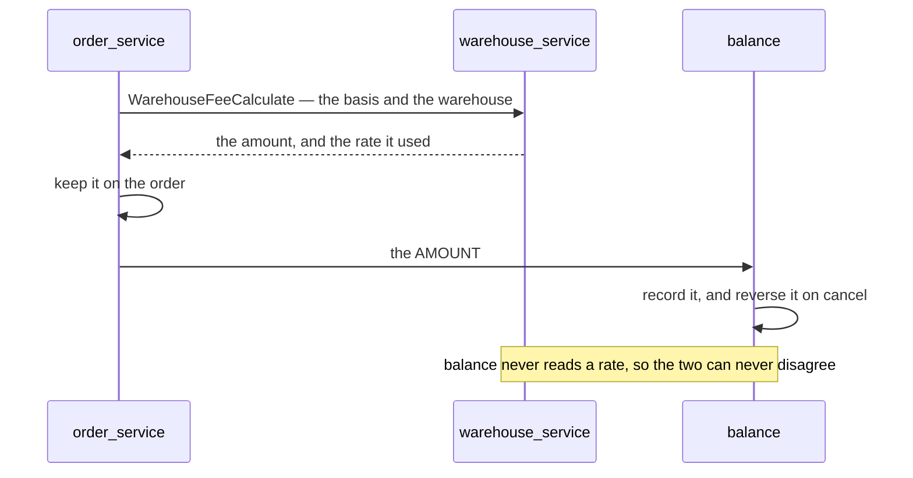

# Decisions — warehouse `context.md`

What the owner decided, recorded before it is acted on. **Append-only** — a reversal is a new entry that renames
the old one, never an edit to it (HARD RULE 12). The open set lives in [context_clarify.md](./context_clarify.md).

| decision | in one line |
| --- | --- |
| [warehouse-prices-balance-records](#warehouse-prices-balance-records) | `warehouse_service` owns the rate and calculates it, `order_service` calls, `balance` handles and records |

---

## warehouse-prices-balance-records

**Decided 2026-09-16**, written into `context.md` §Responsbility 2:

> *"for `warehouse_fee` warehouse service just give rpc for calculate. how the fee handle and recorded is
> responsbility of [balance](../balance/context.md) and called by [order](../order/context.md)"*

It settles the fork this context opened with — three services, three jobs, no overlap.

| service | owns | does NOT |
| --- | --- | --- |
| `warehouse_service` | the fee **configuration** (§Property 3) and the **calculation** (`WarehouseFeeCalculate`) | never posts, never records, never knows an order exists |
| `order_service` | **calling** it, and carrying the answer | never computes a rate |
| `balance` / `liability_service` | **handling and recording** — the entry, the reversal, the balance | **stops computing the fee.** A service that does not own the rate cannot derive the amount |

**What follows from it, and is therefore not open any more:**

1. **The rate lives in `warehouse_service`.** The calculation is warehouse's, and a calculation needs the config
   it reads — they cannot sit in different services.
2. **`balance` is TOLD the amount.** With no rate to read, it has nothing to compute from. This is already how
   its **reversal** leg behaves: `ReverseOrder` reads back what was charged and never recomputes, *"a rate
   changed between placement and cancellation would make it disagree by design"*.
3. **The fee is fixed when the order calls** — *called by order*, not at push time. The number the seller is
   shown, the number the order keeps and the number balance records are one number.

⚠ **What it does NOT settle**, and is still open in the clarify: whether `liability_terms.handling_fee` — the
flat rate balance stores and computes from **today** — is dropped in the same change
([is-the-old-flat-rate-column-dropped](./context_clarify.md#is-the-old-flat-rate-column-dropped)). Leaving it is
how the system ends up with two rates by accident.
