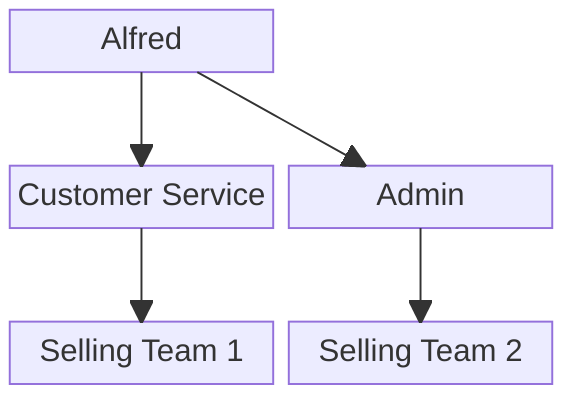

# User Contexts.

## General.
1. User can be have different role across teams.

## Role That exists across teams.
1. warehouse team.
    - The Owner
    - The Admin
    - The Packer. 

2. selling team.
    - The Owner.
    - The Admin.
    - The Customer Service.

3. admin team.
    - The Owner.
    - The Admin.

4. root team.
    - The Root.
