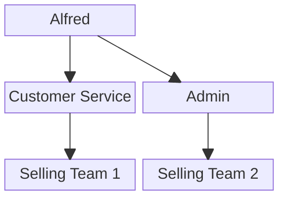
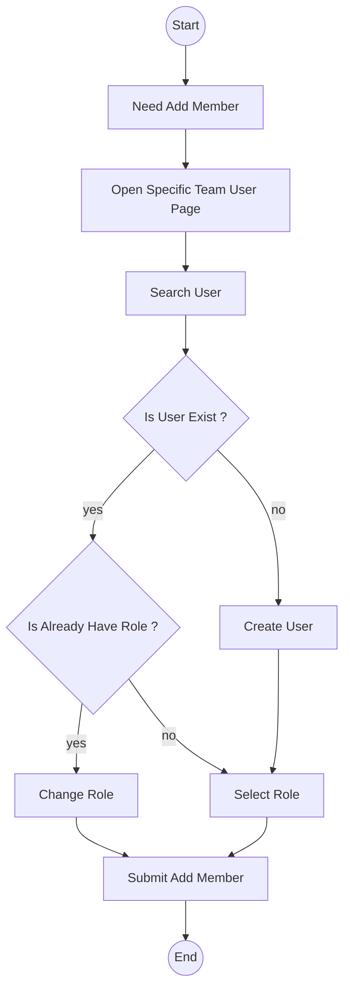

# User Contexts.

## General.
1. User can be have different role across teams.

```mermaid
block-beta

columns 2

a["Alfred"]

space:1
space:2

cs["Customer Service"]
adm["Admin"]

space:2

s1["Selling Team 1"]
s2["Selling Team 2"]

a-->cs
a-->adm
cs-->s1
adm-->s2

```
2. One person have only one role in one team. in different team it can be another role.

## General Data In Users.
1. name
2. username
3. email

## Responsbility.
1. Manage create, suspend, update user.
2. Manage role user.
3. Manage Authentication.
4. Manage user member on the team.

## Default Data for Developments.
1. We have root user that have username `root` with password `root1234` and email `root@pdc.com`. its added by migration or tools in `tools/san`

## Role That exists across teams.
### warehouse team.
1. The Owner. Called `warehouse_owner`

    General:
    - Owner can't create another owner

    Responsbility:
    - manage member

2. The Admin. Called `warehouse_admin`

    Responsbility:
    - manage member

3. The Staff, Called `warehouse_staff`.

    Responsible:
    - Receive restock & return.
    - accepting order.
    - processing order.
    - receives, shelves, picks, packs and hands over to the courier.

### selling team.
1. The Owner. Called `selling_owner`
    
    General:
    - Owner can't create another owner

    Responsbility:
    - set markup
    - reserve
    - lock
    - manage member

2. The Admin. Called `selling_admin`

    Responsbility:
    - set markup
    - reserve
    - lock
    - manage member

3. The Customer Service. Called `selling_cs`

### admin team.
1. The Owner. Called `admin_owner`

    General:
    - Owner can't create another owner

    Responsbility:
    - manage member

2. The Admin. Called `admin_administrator`

### root team.
1. The Root. Called `root`. root is generated by default. No one can assign to other user with root role. root is superuser and can do whatever.
    - root can add or remove or reset password by developer tool in `tools/san`
    - root can be more than one user.

2. The System Administrator. Called `administrator`. this role responsible for:
    - create warehouse/selling/admin team.

    Granted by:
    - The Root.

## Suspend Users.
1. no user can be deleted in our system. we just do suspend.
2. Only Root and Administrator can supend user. 
3. Root can't suspend another root.
4. administrator can't suspend another administrator. Only root can do it.

## How Managing Team User Member.
### How Root/Administrator/Owner/Admin add member team.

```mermaid
flowchart TD

s(("Start"))
e(("End"))

s-->need["Need Add Member"]
need-->userp["Open Specific Team User Page"]
userp-->search["Search User"]
search-->isexist{"Is User Exist ?"}
isexist-->|yes|isrole{"Is Already Have Role ?"}
isrole-->|no|srole["Select Role"]
isrole-->|yes|crole["Change Role"]
crole-->submit
isexist-->|no|create["Create User"]
create-->srole
srole-->submit["Submit Add Member"]

submit-->e
```
