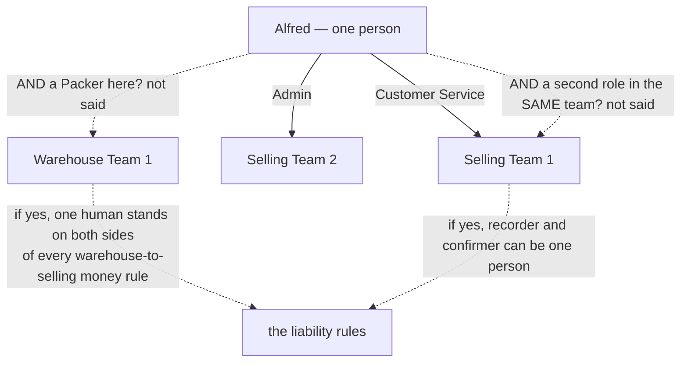
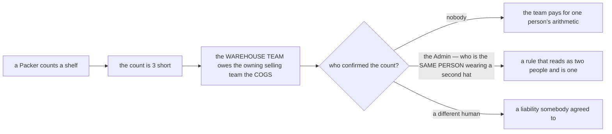

# Clarity — `user_context.md`

The roles I read out of [user_context.md](./context.md), and what naming them
forces the rest of the requirement set to answer. **That doc is yours — this one is mine.** Answered
points are **deleted**, so this file is always the current open set.

> **Re-examined after your update.** ✅ **Your `block-beta` diagram parses** — `npm run lint:mermaid`
> covers `docs/` and went from 128 to 129 diagrams with no failure, so nothing is broken there.
>
> **Closed and deleted:** *may one person hold roles in several teams* — §General answers **yes**,
> explicitly and with a picture. **Narrowed, not deleted:** the two halves that picture does *not* cover —
> two roles in **one** team, and roles in teams of **different types** — because those are the two that
> decide whether a separation-of-duties rule means anything ([Critique 6](#critique)).
>
> ⚠ **One correction to the record:** the `admin team` and `root team` role sets are **not** new — they
> were in the first version of this doc. The only new content this round is §General and its diagram.

Siblings: [business_level](../business_level_clarify.md) · [stock_context](../stock/context_clarify.md) ·
[order_context](../order/context_clarify.md) · [balance_context](../balance/context_clarify.md).

---

## Proposed Design

### The rules, named

#### a-role-is-a-membership-not-a-person
A user *"can be have different role across teams"* — Alfred is **Customer Service in Selling Team 1** and
**Admin in Selling Team 2**. So a role is a property of the **pair** (person, team), never of the person,
and every "which role may do X" in the requirement set has to be read as "which role **in which team**".
*(§General 1 and its diagram)*

#### roles-are-per-team-type
Each team type carries its own role set. There is no global role list.
*(§Role That exists across teams)*

#### warehouse-roles-are-owner-admin-packer
A warehouse team has **The Owner**, **The Admin**, **The Packer** — the Packer being the only role in the
requirement set that names a person on the floor. *(§1)*

#### selling-roles-are-owner-admin-customer-service
A selling team has **The Owner**, **The Admin**, **The Customer Service** — CS being the person
[order_context](../order/context.md) says records orders by hand. *(§2)*

#### admin-and-root-have-no-floor-role
The admin team has Owner and Admin, the root team has only **The Root**. Neither has anyone who touches
goods — and the root team has **no Owner at all**. *(§3–4)*

### What §General settles, and the two hats it does not draw

**The drawn case is two roles in two teams of the SAME type.** The two undrawn cases are the ones that
carry money: a person in a **warehouse** team *and* a **selling** team, and a person holding **two roles
in one team**.

### What the four teams' responsibilities need a role for — and which have none

| The act *(and the money it moves)* | Which role does it | Status |
| --- | --- | --- |
| record an order *(commits stock, charges the order fee)* | **Customer Service** | ✅ `order_context` |
| pick and pack *(the goods leave)* | **Packer**, presumably | ⚠ the role is named for packing only — [Critique 1](#critique) |
| hand over to the courier *(custody ends)* | ? | **no role** |
| accept a restock *(sets `UnitPrice`, posts balance cause 2)* | ? | **no role** — [Critique 3](#critique) |
| declare goods broken or lost *(creates a warehouse liability)* | ? | **no role** — [Critique 2](#critique) |
| do the opname *(a shortfall is a warehouse liability)* | ? | **no role** — [Critique 2](#critique) |
| set the cross markup, the reserve, the shared lock | ? | **no role** — [Critique 4](#critique) |
| set a debt threshold | *"team owner"* | ✅ the word has a definition — whose owner is open in [balance_context](../balance/context_clarify.md#question) |
| **assign a role to a person** | ? | **no role** — and none possible for the root team, [Critique 7](#critique) |

### The separation-of-duty problem, now with one human in it

**→ Recommend** state the rule against the **person**, not the role: *the human who records may not be the
human who confirms.* [a-role-is-a-membership-not-a-person](#a-role-is-a-membership-not-a-person) is
precisely what makes the role-only version unenforceable.

---

## Critique

| | Problem | → Recommend |
| --- | --- | --- |
| **1** | **The floor role is called "Packer", but packing is one of at least five things that happen to goods in the building.** Someone receives and counts a delivery, someone shelves it, someone picks an order, someone packs it, someone hands it to the courier. Naming the role after the fourth act leaves the other four unassigned or silently assumed to be the same person. That assumption may be right in a small warehouse — it should be written, because the moment there are two people it decides who stands where. | Either **rename the role for the whole job** — *Warehouse Staff / Operator* — or **name the acts each role may perform**. I would rename: one floor role that receives, shelves, picks, packs and hands over is honest about a small operation, and it grows by adding roles rather than by redefining the word "Packer". |
| **2** | **The rules that create money still name no role — and §General has just made the obvious fix insufficient.** [in-custody-shortfall-is-the-warehouses](../stock/context_clarify.md#in-custody-shortfall-is-the-warehouses) makes an unexplained count a **debt**, so whoever may record a count may create a debt for their own team. The natural answer — *Packer records, Admin confirms* — is now satisfiable by **one human holding both roles**, and the doc's own example shows a person holding two. | Two rules, not one: **a Packer records, an Owner or Admin confirms**, **and the confirming human must not be the recording human**. The second sentence is the one that survives [a-role-is-a-membership-not-a-person](#a-role-is-a-membership-not-a-person). |
| **3** | **No role accepts a restock, and it is the most financial act in the warehouse.** It fixes the arrived quantity, it fixes `UnitPrice` for that batch ([unit-price-is-landed-cost](../product/context_clarify.md#unit-price-is-landed-cost)), and the *Additional Warehouse Fee* typed at that moment both raises what the selling team owes and permanently changes what their goods are worth. Nobody is entitled to do it. | **Owner or Admin accepts; a Packer may count.** The count is physical work, the acceptance is a financial commitment against another team, and they should not be the same click — nor, per [Critique 2](#critique), the same person. |
| **4** | **The selling side has the mirror gap.** [reserved-stock-is-never-shared](../product/context_clarify.md#reserved-stock-is-never-shared), [shared-lock-stops-sharing-entirely](../product/context_clarify.md#shared-lock-stops-sharing-entirely) and the cross markup decide what other teams pay and whether they may buy at all — and no role is named for setting them. If Customer Service can change a markup, the person taking orders can reprice another team's supply mid-day. | **Owner or Admin sets the markup, the reserve and the lock. Customer Service records orders and nothing else.** State it, because CS is the role most people will hold, and the default when nothing is said is "everyone". |
| **5** | **"The Admin" means three different jobs under one word, and §General now lets one person hold two of them at once.** A **warehouse** Admin manages one warehouse; a **selling** Admin manages one selling team; the **admin team's** Admin manages, per `business_level.md` §Admin, *"all resource warehouse and selling team"*. Alfred is Admin in Selling Team 2 today — if he is also Admin in the admin team tomorrow, the same word on the same person means two vastly different powers, separated only by which team a request is scoped to. | Give them distinct names — **Team Admin** (inside a warehouse or selling team) and **Platform Admin** (the admin team) — or state plainly that **scope, not role name, is what separates them**, and that a Team Admin's powers never leak to another team. As written, "Admin" is ambiguous exactly where being wrong grants somebody power over another team's money. |
| **6** | **§General answers roles across teams and leaves the two cases that carry money undrawn.** Both teams in the diagram are **selling** teams. Nothing says whether one person may hold roles in teams of **different types** — a Packer in Warehouse 1 who is also Customer Service in Selling Team 1 stands on both sides of [warehouse-reimburses-unit-price](../business_level_clarify.md#warehouse-reimburses-unit-price): he can take the order, pick the goods, and record the loss. Nothing says whether one person may hold **two roles in one team** either, which is what [Critique 2](#critique) turns on. | Say both. I would **allow cross-type membership** (a small operation needs it) but **forbid a second role in the same team** — one membership, one role — and add the person-level rule from [Critique 2](#critique). That way the flexibility stays and the checks still mean something. |
| **7** | **No role assigns roles, and the root team has nobody who could.** Somebody adds a Packer, removes a Customer Service, promotes an Admin — the act by which every other permission is granted, with no owner. And [admin-and-root-have-no-floor-role](#admin-and-root-have-no-floor-role) gives the root team **only** The Root: no Owner, so no one is named who may add or remove a Root. | **The team owner assigns roles within their team; the admin team may assign anywhere; nobody assigns their own.** For the root team, say who may grant The Root — I would make it Root-only and require an existing Root, so the set can never be enlarged from outside. And role changes are **recorded**, same evidence requirement as [transparency accounting](../business_level_clarify.md#critique). |
| **8** | **`business_level.md` §Root says "highest access for all resource" and this doc says the root team's role is "The Root" — neither says whether that access is SCOPED.** Every other rule in the requirement set is written per team: a balance is between a pair, an order belongs to a shop's team, a liability belongs to a warehouse. Whether Root and the admin team stand *outside* that scoping — seeing and acting on every team's money without being a member — is a business question the docs have not asked. | State it: I would say **Root and the admin team are unscoped for READS and scoped for WRITES**, so support can see everything and still cannot quietly post into a team's ledger. Whatever you choose, it belongs in the requirement rather than being discovered later from behaviour. |

---

## Question

1. **Is "Packer" the whole floor job, or only the packing bench?** ([Critique 1](#critique))
   **→ I recommend one floor role covering receive, shelve, pick, pack, hand over.**
2. **May one person hold roles in teams of DIFFERENT types, and two roles in ONE team?**
   ([Critique 6](#critique)) **→ I recommend yes to cross-type, no to two roles in one team.**
3. **Is the separation rule about the ROLE or about the PERSON?** ([Critique 2](#critique))
   **→ I recommend the person — the role version is unenforceable now that one human can hold two.**
   ⚠ **`stock_context.md`'s receiving flow does not contradict this — it declines to address it, and that
   is worth saying precisely.** The actor is *"Warehouse Team Member"*, which could be any of Owner, Admin
   or Packer, so no role is excluded. But the flow runs **one actor end to end** — accept, input losses,
   input broken, set placements — with **no second party anywhere**, and it is the first place a confirm
   step would appear if one existed. Evidence of a single-actor procedure, not a decision against a
   confirm step.
4. **Which role may perform the money-setting acts** — accept a restock and type its fee, and set the
   markup, reserve and lock? ([Critique 3](#critique), [Critique 4](#critique))
   **→ I recommend Owner or Admin for all of them, never the person counting and never Customer Service.**
5. **Who assigns roles, who may grant The Root, and is Root's access scoped?**
   ([Critique 7](#critique), [Critique 8](#critique)) **→ I recommend owner-within-team, Root-grants-Root,
   and unscoped reads with scoped writes.**

---

# Contradiction

**None between this doc and the four-team model.** [roles-are-per-team-type](#roles-are-per-team-type)
lists exactly the four teams of `business_level.md` §Business Entity and adds no fifth, and §General's
example stays inside two selling teams. Recorded as an answer rather than as silence.

The tension this doc creates is with the **liability rules**, not the team list, and it is the *second
site of a contradiction already recorded* — so it is filed there rather than duplicated here:
[business_level_clarity → a team is liable for records it does not solely control](../business_level_clarify.md#a-team-is-liable-for-records-it-does-not-solely-control).
§General adds the sharper version of it: the outsider who can move a team's numbers need not be another
team at all — it can be **one of that team's own people, wearing a hat from somewhere else**.

---

# Awaiting

- **What a role can DO.** The doc now says a role is per-team and a person may hold several. It still
  never says what any of them may *do* — and the money rules elsewhere are written as if the answer
  existed.
- **No role for a supplier-facing or courier-facing act**, though both are daily and both are where goods
  and money cross the business boundary.
