# Clarity — `context.md`

The roles I read out of [context.md](./context.md), and what naming them
forces the rest of the requirement set to answer. **That doc is yours — this one is mine.** Answered
points are **deleted**, so this file is always the current open set.

> **Re-examined after your updates of 2026-10-02 and 2026-10-05.** Question numbers are **kept**, so a number
> means what it meant when you last saw the list.
>
> | You changed | What it did here |
> | --- | --- |
> | added §Responsbility, §Default Data | ▲ **Q7** the build hard-deletes users, now [a-user-is-never-deleted](./context_decision.md#a-user-is-never-deleted) · Q6, below |
> | Packer → **Staff** | ✅ **Q1** closed, [warehouse-staff-is-the-whole-floor-job](./context_decision.md#warehouse-staff-is-the-whole-floor-job) · 14 stale "Packer"s fixed, [the-packer-rename-left-fourteen-sites](#the-packer-rename-left-fourteen-sites) · **Q4** narrowed: the build lets Staff *accept* a restock |
> | §General 2, one role per team | ✅ **Q2** closed, [one-role-per-person-per-team](./context_decision.md#one-role-per-person-per-team) |
> | *"what count? we talk in user context"* | ➡ **Q3 moved to [inventory Q12](../inventory/context_clarify.md#question)**. A stock count is inventory's act, so who confirms it is inventory's to decide. Its separation-of-duty section and Critique 2 went with it |
> | §root team rewritten, a System Administrator added | ✅ [root-is-granted-only-through-san](./context_decision.md#root-is-granted-only-through-san) · ✅ [root-can-do-anything](./context_decision.md#root-can-do-anything), against my recommendation · **Q5** narrows to everyone else · ⚠ the build lets the app grant Root three ways (Critique 11) · ▲ **Q8** one Root or several · ▲ **Q9** what the System Administrator may do (Critique 12) |
> | §Default Data, three edits, and *"its okay write password in migration"* | ✅ **Q6** closed: [dev-root-password-is-root1234](./context_decision.md#dev-root-password-is-root1234), written by the migration, [the-migration-writes-the-dev-root-password](./context_decision.md#the-migration-writes-the-dev-root-password) — against my recommendation. Critique 9 deleted |
> | *(you asked)* elaborate the next question | 🔄 **Q7** split into five parts, checked against the build |
> | *"for 7a, 7b, i follow your recomend, for 7c …"* | ✅ **7a** [a-user-is-never-deleted](./context_decision.md#a-user-is-never-deleted) · ✅ **7b** [the-username-is-editable](./context_decision.md#the-username-is-editable) · ✅ **7c** [superseded-two-levels-of-suspend](./context_decision.md#superseded-two-levels-of-suspend), wider than I recommended · ▲ **7f** may a team Admin suspend the Owner. Critique 10 deleted |
> | *"for 7e yes its only root and administrator, for 7d, i follow your recomendation"* | ✅ **7d** [a-suspended-user-is-never-picked](./context_decision.md#a-suspended-user-is-never-picked) · ✅ **7e** [erase-keeps-the-row](./context_decision.md#erase-keeps-the-row), wider than I recommended · **Q7** is now only 7f |
> | §Suspend Users added, §Responsbility 4 *"manage user member on the team"* | ✅ [only-root-and-the-administrator-suspend](./context_decision.md#only-root-and-the-administrator-suspend). You changed your mind on 7c: team owners no longer suspend, so 7f is moot and **Q7 is closed** · ✅ §Responsbility 4 matches the build |
> | §Role That exists across teams: a code name per role, Staff's list, *"root can be more than one user"*, *"Granted by: The Root"* | ✅ [every-role-has-a-code-name](./context_decision.md#every-role-has-a-code-name) · ✅ [root-can-be-several](./context_decision.md#root-can-be-several) closes **Q8** · ✅ [root-grants-the-administrator](./context_decision.md#root-grants-the-administrator) narrows **Q5** · 🔄 Staff's list grows · Critique 5 deleted, the names answer it · ▲ **Q10** are the names the code's names (Critique 13) · ⚠ a broken code span on line 44 (Critique 14) |
> | *"for q4, yes"* (confirmed: Staff accepts) · added §How Managing Team User Member | ✅ [staff-accepts-the-restock](./context_decision.md#staff-accepts-the-restock), against my recommendation, Critique 3 deleted, **Q4** keeps only the markup half · ✅ [owner-root-and-administrator-add-members](./context_decision.md#owner-root-and-administrator-add-members) narrows **Q5** · ▲ **Q11** how an Owner finds the person (Critique 15, Critique 16) · your diagram parses |
> | §Role: *"Owner can't create another owner"*, the selling Owner's and Admin's responsibilities | ✅ [the-selling-owner-and-admin-set-markup-reserve-and-lock](./context_decision.md#the-selling-owner-and-admin-set-markup-reserve-and-lock) closes **Q4** as recommended, Critique 4 deleted · ✅ [an-owner-never-makes-another-owner](./context_decision.md#an-owner-never-makes-another-owner) · ✅ [the-selling-admin-manages-members](./context_decision.md#the-selling-admin-manages-members), against my recommendation · **Q5** narrows to the warehouse and admin teams' Admins · ⚠ one contradiction inside your doc, [the-member-flow-leaves-out-the-admins](#the-member-flow-leaves-out-the-admins) |
> | *"1 yes"* — Q20 | ✅ all four readings confirmed, written into their decisions. **Nothing is open in this context** |
> | *"make member and membership history as tab"* | ✅ [the-history-is-a-tab-beside-the-members](./context_decision.md#the-history-is-a-tab-beside-the-members) — built in the prototype. No question changes |
> | §General Data In Users: name, username, email, short_code *(written 2026-10-02, found 2026-10-05)* · `auth/context.md` deleted | ▲ **Q24** what short_code is for (Critique 25) · ▲ **Q25** the list has no phone (Critique 26) · ⚠ Q23 waits on Q24, because a required short_code adds a field to both create forms · auth: nothing changes, §Responsbility 3 already has it and no doc linked to the deleted file |
> | *"for q24, its just for unique alias"* | ✅ [superseded-short-code-is-a-unique-alias](./context_decision.md#superseded-short-code-is-a-unique-alias), against my reading. The paper rules are deleted · 🔄 **Q24** narrows to four parts: does it replace the per-team alias, is it required, its format and who changes it, is it searchable |
> | *"i cancel it"*, short_code removed from §General Data | ✅ [a-user-has-no-short-code](./context_decision.md#a-user-has-no-short-code) supersedes the alias decision · ✅ **Q24** closed · Critique 25 deleted · Q23 waits on nothing again · the sites it left are [short-code-was-cancelled](#short-code-was-cancelled) |
> | *(you asked)* elaborate Q21 | 🔄 **Q21** split into three parts, checked against the build: the orders page's creator filter is a third site · ⚠ the floor roles are refused on four of six who filters **today**, and a selling Owner on *accepted by* once a warehouse is picked · ⚠ the suspended rule, as specified, would hide former staff from every filter |
> | *"yes for 3 question i follow your recomendation"*, confirmed as all four | ✅ **Q21** [a-who-filter-lists-the-people-on-its-rows](./context_decision.md#a-who-filter-lists-the-people-on-its-rows) · [whoever-reads-a-list-may-filter-it](./context_decision.md#whoever-reads-a-list-may-filter-it) · [a-filter-keeps-former-and-suspended-people](./context_decision.md#a-filter-keeps-former-and-suspended-people) · ✅ **Q22** [an-admin-changes-nobodys-role](./context_decision.md#an-admin-changes-nobodys-role) · ✅ **Q23** design_accept passed, [the-user-prototype-is-accepted](./context_decision.md#the-user-prototype-is-accepted) · [a-root-team-form-starts-with-no-role](./context_decision.md#a-root-team-form-starts-with-no-role) · [an-account-is-made-only-from-the-member-search](./context_decision.md#an-account-is-made-only-from-the-member-search), New User removed · ✅ **Q25** [a-user-is-name-username-email-phone-and-photo](./context_decision.md#a-user-is-name-username-email-phone-and-photo) · [only-name-and-username-are-required](./context_decision.md#only-name-and-username-are-required) · Critiques 23, 24, 26 deleted · ⚠ your §General Data now lags the record, [phone-and-photo-joined-the-record](#phone-and-photo-joined-the-record) · ▲ **Q26** is the rename still on hold, now the build starts |
> | *"commit … and continue"* — the prototype built | ▲ **Q23** design_accept, [what accepting it accepts](#the-prototype--what-accepting-it-accepts) · ▲ **Q21** the restock filters lose their search (Critique 23) · ▲ **Q22** an Admin never changes a role (Critique 24) |
> | *"for q17, q19 i follow your recomendation, for q18 settlement is customer service too"* | ✅ [removing-a-member-drops-their-shop-access](./context_decision.md#removing-a-member-drops-their-shop-access) · ✅ [customer-service-runs-orders-restock-requests-and-settlements](./context_decision.md#customer-service-runs-orders-restock-requests-and-settlements), against my recommendation on settlements · ✅ [the-warehouse-admin-equals-the-owner-except-money](./context_decision.md#the-warehouse-admin-equals-the-owner-except-money) · Critique 21 deleted · only **Q20** left |
> | the member-flow heading now names the Admin | ✅ [the-member-flow-leaves-out-the-admins](#the-member-flow-leaves-out-the-admins) resolved · your diagram parses |
> | §warehouse team, line 51: `warehouse_admin` fixed | ✅ Critique 14 deleted |
> | *"elaborate one by one"* | ▲ **Q17** removing a member · ▲ **Q18** what Customer Service does · ▲ **Q19** is the warehouse Admin the Owner's equal · ▲ **Q20** confirm four of my readings. The three Awaiting items became Q17–Q19 |
> | *"for q12, q13, q14, q15, 1q6 i follow your recomendation"* | ✅ [the-admin-team-monitors-all-and-manages-its-own](./context_decision.md#the-admin-team-monitors-all-and-manages-its-own) · ✅ [every-role-change-is-logged](./context_decision.md#every-role-change-is-logged) · ✅ [an-override-is-stamped-in-every-service](./context_decision.md#an-override-is-stamped-in-every-service) · ✅ [the-two-administrators-have-distinct-labels](./context_decision.md#the-two-administrators-have-distinct-labels) · ✅ [one-account-per-phone-stays-a-refusal](./context_decision.md#one-account-per-phone-stays-a-refusal). Critiques 17–20 and 22 deleted, the admin-team contradiction resolved. **No question is open** |
> | *"any critique?"* | ▲ six critiques of the design as decided (Critiques 17–22) · ▲ **Q12–Q16** · one contradiction, [the-admin-team-manages-nothing-but-itself](#the-admin-team-manages-nothing-but-itself) |
> | *"proto is mapped with new our role"*, then: rename **not yet**, admin roles *"Team management only"* | ✅ [admin-team-roles-manage-only-their-team](./context_decision.md#admin-team-roles-manage-only-their-team) · the proto still has the old names, so the rename stays decided and unbuilt |
> | *"for q11 i follow your recomendation"* | ✅ **Q11** closed, all six as recommended: [only-member-managers-open-the-search](./context_decision.md#only-member-managers-open-the-search) · [managers-search-by-exact-username-phone-or-email](./context_decision.md#managers-search-by-exact-username-phone-or-email) · [a-result-shows-the-phones-last-four-digits](./context_decision.md#a-result-shows-the-phones-last-four-digits) · [change-role-only-below-your-own](./context_decision.md#change-role-only-below-your-own) · [a-phone-or-email-belongs-to-one-account](./context_decision.md#a-phone-or-email-belongs-to-one-account) · [a-shop-grant-picks-from-the-teams-members](./context_decision.md#a-shop-grant-picks-from-the-teams-members). Critiques 15 and 16 deleted. **No question is open in this context** |
> | §How Root/Administrator/Owner add member team: *"Is Already Have Role ? → yes → Change Role"* | ✅ [an-existing-member-gets-change-role](./context_decision.md#an-existing-member-gets-change-role), against my 11d recommendation · **11d** narrows to *whose* role that step may change · your diagram parses |
> | *(you asked)* elaborate the next question | 🔄 **Q11** split into six parts, checked against the build. ⚠ Two finds: re-adding a member overwrites their role, and a shop grant searches everyone |
> | §warehouse team: the Admin *"manage member"*, the admin team's Owner *"manage member"* | ✅ [the-admin-team-admin-alone-does-not-manage-members](./context_decision.md#the-admin-team-admin-alone-does-not-manage-members) supersedes the Q5 half that kept the warehouse Admin out · the member flow's heading now leaves out **both** Admins |
> | *"for q5 no, for q9 keep do anything, for q 10 yes, for q11, we provide search popup"* | ✅ **Q5** [superseded-only-the-selling-admin-manages-members](./context_decision.md#superseded-only-the-selling-admin-manages-members) · [no-admin-makes-another-admin](./context_decision.md#no-admin-makes-another-admin) · ✅ **Q9** [the-administrator-can-do-anything](./context_decision.md#the-administrator-can-do-anything), against my recommendation · ✅ **Q10** [the-role-names-are-the-codes-names](./context_decision.md#the-role-names-are-the-codes-names), as recommended · ✅ [a-member-is-found-in-a-search-popup](./context_decision.md#a-member-is-found-in-a-search-popup), and **Q11** narrows to what the popup matches · Critiques 7, 11, 12, 13 deleted |

Siblings: [business_level](../business_level_clarify.md) · [inventory_context](../inventory/context_clarify.md) ·
[order_context](../order/context_clarify.md) · [balance_context](../balance/context_clarify.md).

---

## Proposed Design

### The rules, named

#### a-role-is-a-membership-not-a-person
A user *"can be have different role across teams"* — Alfred is **Customer Service in Selling Team 1** and
**Admin in Selling Team 2**. So a role is a property of the **pair** (person, team), never of the person,
and every "which role may do X" in the requirement set has to be read as "which role **in which team**".
One person holds **at most one role in a team**
([one-role-per-person-per-team](./context_decision.md#one-role-per-person-per-team)).
*(§General 1, its diagram, and §General 2)*

#### roles-are-per-team-type
Each team type carries its own role set. There is no global role list.
*(§Role That exists across teams)*

#### warehouse-roles-are-owner-admin-staff
A warehouse team has **The Owner** (`warehouse_owner`), **The Admin** (`warehouse_admin`), **The Staff**
(`warehouse_staff`). Staff is the whole floor job: receive a restock or a return, accept and process an order, shelve,
pick, pack, hand over ([warehouse-staff-is-the-whole-floor-job](./context_decision.md#warehouse-staff-is-the-whole-floor-job)). The Owner and the
Admin manage members ([the-admin-team-admin-alone-does-not-manage-members](./context_decision.md#the-admin-team-admin-alone-does-not-manage-members)). *(§warehouse team)*

#### selling-roles-are-owner-admin-customer-service
A selling team has **The Owner** (`selling_owner`), **The Admin** (`selling_admin`), **The Customer Service**
(`selling_cs`) — CS being the person
[order_context](../order/context.md) says records orders by hand. The Owner and the Admin set the markup, the reserve
and the lock, and manage members ([the-selling-owner-and-admin-set-markup-reserve-and-lock](./context_decision.md#the-selling-owner-and-admin-set-markup-reserve-and-lock), [the-selling-admin-manages-members](./context_decision.md#the-selling-admin-manages-members)). No Owner makes another Owner, in any team ([an-owner-never-makes-another-owner](./context_decision.md#an-owner-never-makes-another-owner)). *(§selling team)*

#### admin-and-root-have-no-floor-role
The admin team has Owner (`admin_owner`) and Admin (`admin_administrator`). The root team has **The Root** (`root`)
and **The System Administrator** (`administrator`). Neither has
anyone who touches goods, and the root team has **no Owner**. *(§admin team, §root team)*

#### system-administrator-creates-teams
The root team's second role, the **System Administrator** (`administrator`), has one listed job: create warehouse,
selling and admin teams, and it can do anything ([the-administrator-can-do-anything](./context_decision.md#the-administrator-can-do-anything)). Root grants it ([root-grants-the-administrator](./context_decision.md#root-grants-the-administrator)). *(§root team 2)*

#### user-service-owns-users-roles-and-authentication
The user context creates, suspends and updates users, assigns their roles, manages who is a member of each team, and
owns authentication. *(§Responsbility 1–4)*

#### dev-root-logs-in-as-root
In development there is a root account: username `root`, password `root1234`, email `root@pdc.com`, written by a
migration ([the-migration-writes-the-dev-root-password](./context_decision.md#the-migration-writes-the-dev-root-password)). *(§Default Data 1)*

### The user record — decided

Name, username, email, phone and photo; name and username required; the per-team `alias` removed. See
[a-user-is-name-username-email-phone-and-photo](./context_decision.md#a-user-is-name-username-email-phone-and-photo) and
[only-name-and-username-are-required](./context_decision.md#only-name-and-username-are-required).

### §Responsbility against what is built

| Responsibility | Built as | |
| --- | --- | --- |
| create, suspend, update user | `CreateUser` · `SuspendUser` · `UpdateUser` · `UpdateProfile` | ✅ |
| manage a user's role | `TeamUserUpdate` · `RoleResolve` | ✅ — *who* may assign is decided, [change-role-only-below-your-own](./context_decision.md#change-role-only-below-your-own), not built |
| manage a team's members | `TeamUserUpdate` (add, remove) · `TeamAccessList` · `UserTeams` | ✅ |
| manage authentication | `Login` · `Logout` · `CheckAccess` · three password resets (own, by admin, by OTP) | ✅ |
| *not listed* | **`DeleteUser`**, a hard delete, a row action on the Users screen | ⛔ to be removed — [a-user-is-never-deleted](./context_decision.md#a-user-is-never-deleted) |

### Where the dev root is made

Decided: a migration writes it, and only while root's password is still empty, so a production password that was
already set is never overwritten. See [the-migration-writes-the-dev-root-password](./context_decision.md#the-migration-writes-the-dev-root-password).

### What §General settles, and what it does not

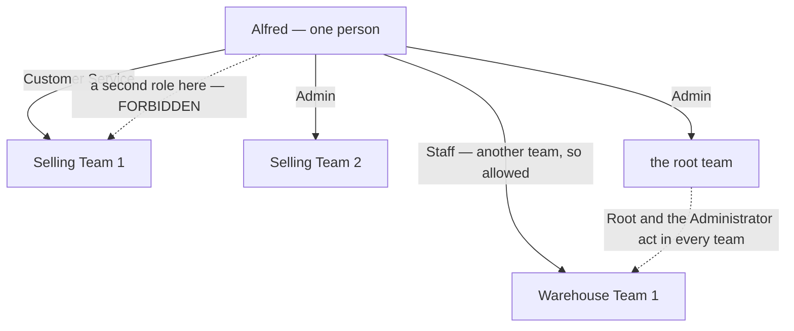
```mermaid
flowchart TB
  A["Alfred — one person"]
  A -->|"Customer Service"| S1["Selling Team 1"]
  A -->|"Admin"| S2["Selling Team 2"]
  A -->|"Staff — another team, so allowed"| W["Warehouse Team 1"]
  A -.->|"a second role here — FORBIDDEN"| S1
  A -->|"Admin"| RT["the root team"]
  RT -.->|"Root and the Administrator act in every team"| W
```

**Settled:** one role per team, and any role in any other team. Root may do anything in any team ([root-can-do-anything](./context_decision.md#root-can-do-anything)),
and so may the System Administrator ([the-administrator-can-do-anything](./context_decision.md#the-administrator-can-do-anything)). Whether one person may record and confirm the same stock count is inventory's question,
[inventory Q12](../inventory/context_clarify.md#question).

### What the build already lets the undocumented roles do

Every request message names who may call it, so the build has an answer your doc does not have yet.

| role | your doc lists | the build allows | among them, acts that move money |
| --- | --- | --- | --- |
| `selling_cs` | nothing | **62 calls** | create and cancel a restock request · post a settlement · import a settlement file · create and cancel an order — ✅ all of it, [customer-service-runs-orders-restock-requests-and-settlements](./context_decision.md#customer-service-runs-orders-restock-requests-and-settlements) |
| `warehouse_owner` | manage member | **85 calls** | set the liability terms (what a selling team pays) · record and confirm a payment · move money between financial accounts, add capital, reconcile |
| `warehouse_admin` | manage member | **the same 85** | the same today — ✅ minus liability terms, transfer and capital, [the-warehouse-admin-equals-the-owner-except-money](./context_decision.md#the-warehouse-admin-equals-the-owner-except-money) |

Couriers and suppliers, which the old Awaiting list named: handing over to the courier is Staff's
([warehouse-staff-is-the-whole-floor-job](./context_decision.md#warehouse-staff-is-the-whole-floor-job)). The supplier
list is kept by the selling Owner and Admin, and Customer Service creates restock requests, in the build only.

### Removing a member — decided, [removing-a-member-drops-their-shop-access](./context_decision.md#removing-a-member-drops-their-shop-access)

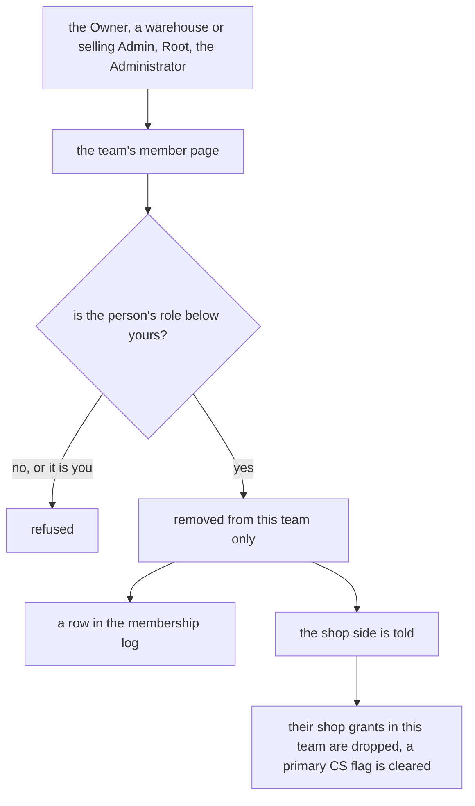
```mermaid
flowchart TD
  W["the Owner, a warehouse or selling Admin, Root, the Administrator"] --> P["the team's member page"]
  P --> R{"is the person's role below yours?"}
  R -->|"no, or it is you"| X["refused"]
  R -->|"yes"| D["removed from this team only"]
  D --> LOG["a row in the membership log"]
  D --> EV["the shop side is told"]
  EV --> G["their shop grants in this team are dropped, a primary CS flag is cleared"]
```

The person keeps their account and their other teams, and every record they made keeps their name.

### What the four teams' responsibilities need a role for — and which have none

| The act *(and the money it moves)* | Which role does it | Status |
| --- | --- | --- |
| record an order *(commits stock, charges the order fee)* | **Customer Service** | ✅ `order_context` |
| receive a restock or a return, accept and process an order, shelve, pick, pack, hand over to the courier *(the goods come in, and leave)* | **Staff** | ✅ [warehouse-staff-is-the-whole-floor-job](./context_decision.md#warehouse-staff-is-the-whole-floor-job) |
| accept a restock *(sets `UnitPrice`, posts balance cause 2)* | **Staff** | ✅ [staff-accepts-the-restock](./context_decision.md#staff-accepts-the-restock) |
| declare goods broken or lost *(creates a warehouse liability)* | ? | ⚠ **built as Owner or Admin**, one step, nobody confirms — [inventory Q12](../inventory/context_clarify.md#question) |
| do the opname *(a shortfall is a warehouse liability)* | ? | ⚠ **built as Owner or Admin**, Staff refused, nobody confirms — [inventory Q12](../inventory/context_clarify.md#question) |
| set the cross markup, the reserve, the shared lock | **the selling Owner and Admin** | ✅ [the-selling-owner-and-admin-set-markup-reserve-and-lock](./context_decision.md#the-selling-owner-and-admin-set-markup-reserve-and-lock) |
| set a debt threshold | *"team owner"* | ✅ the word has a definition — whose owner is open in [balance_context](../balance/context_clarify.md#question) |
| **add a member to a team** | **Root, the Administrator, the team's Owner, the warehouse and selling Admins** | ✅ [owner-root-and-administrator-add-members](./context_decision.md#owner-root-and-administrator-add-members) |
| **assign a role to a person** | **whoever adds members, only below their own role** | ✅ Root: **nobody** in the app, only `tools/san` ([root-is-granted-only-through-san](./context_decision.md#root-is-granted-only-through-san)) · every other role: [change-role-only-below-your-own](./context_decision.md#change-role-only-below-your-own), and an Admin changes nobody's ([an-admin-changes-nobodys-role](./context_decision.md#an-admin-changes-nobodys-role)) |
| create a team | **System Administrator** | ✅ named, and it can do anything — [the-administrator-can-do-anything](./context_decision.md#the-administrator-can-do-anything) |

### The prototype — accepted

design_accept passed on 2026-10-05 ([the-user-prototype-is-accepted](./context_decision.md#the-user-prototype-is-accepted)).
The one change it asked for is made: **New User** is gone, and the Add Member popup's Create is the only way an account is
made ([an-account-is-made-only-from-the-member-search](./context_decision.md#an-account-is-made-only-from-the-member-search)).
Next is backend analysis, which builds the decided-not-built list in the
[state report](../../development_state/user/context.md).

### Build order — proposed

[Q26](#question). Three steps, the rename first, because every later step names roles.

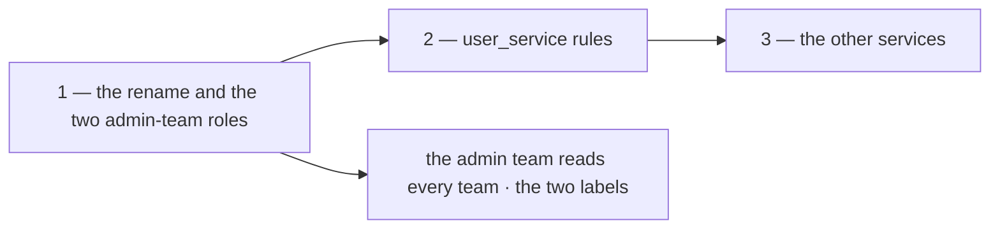
```mermaid
flowchart LR
  R["1 — the rename and the two admin-team roles"] --> U["2 — user_service rules"]
  U --> O["3 — the other services"]
  R --> A["the admin team reads every team · the two labels"]
```

| step | what | items in the state report |
| --- | --- | --- |
| 1 | rename the roles, add `admin_owner` and `admin_administrator`, the admin team's reads, the labels | 1 · 12 · 15 |
| 2 | grant checks, the search, one account per phone or email, suspend by role, no delete, erase, the username, the dev root, `san` adds and removes a Root, the membership log, removal, the record | 2–11 · 13 · 16 · 19 |
| 3 | the override stamp, the warehouse Admin's money limits, the who filters in inventory and selling | 14 · 17 · 18 |

---

## Critique

One open, from design_accept (27). Critiques 23, 24 and 26 were answered with Q21, Q22 and Q25 on 2026-10-05.

### Critique 27 — the build starts, and the step it starts with is on hold

The decided-not-built list puts the rename first, because every later item names roles. You held it on 2026-10-02
(*"not yet"*), when nothing was being built. Now something is.

| if step 2 is built before the rename | the cost |
| --- | --- |
| grant checks, search policy, suspend by role, the membership log | each adds role references under the old names, and all of them are renamed again after |
| the admin team's reads, the two labels | cannot be built at all: `admin_owner` and `admin_administrator` do not exist yet |

Renaming keeps every role number, so no stored role changes. The two new roles move only an admin-type team's members,
and dev has none.

**→ Recommend:** lift the hold and do the rename first, as [build order](#build-order--proposed) step 1. It is mechanical,
and it is cheapest on today's code. [Q26](#question).

---

## Question

**One open**, Q26, from design_accept. Q3–Q25 are answered and recorded in [context_decision.md](./context_decision.md).

3. ➡ **Moved to [inventory Q12](../inventory/context_clarify.md#question)** (2026-10-02). Who confirms a stock count
   or a loss is inventory's to decide, not the user context's. Its root-team part follows [Q5](#question).
4. ✅ **Answered** (2026-10-02): Staff accepts a restock ([staff-accepts-the-restock](./context_decision.md#staff-accepts-the-restock)), and the selling Owner and
   Admin set the markup, the reserve and the lock ([the-selling-owner-and-admin-set-markup-reserve-and-lock](./context_decision.md#the-selling-owner-and-admin-set-markup-reserve-and-lock)).
5. ✅ **Answered** (2026-10-02): the warehouse and selling Admins manage members, the admin team's does not ([the-admin-team-admin-alone-does-not-manage-members](./context_decision.md#the-admin-team-admin-alone-does-not-manage-members)), and no Admin makes
   another Admin ([no-admin-makes-another-admin](./context_decision.md#no-admin-makes-another-admin)).
6. ✅ **Answered** (2026-10-02): the migration writes `root1234` — [the-migration-writes-the-dev-root-password](./context_decision.md#the-migration-writes-the-dev-root-password).
7. ✅ **Answered** (2026-10-02): never deleted, and only Root and the Administrator suspend — [only-root-and-the-administrator-suspend](./context_decision.md#only-root-and-the-administrator-suspend).
8. ✅ **Answered** (2026-10-02): several Roots, added and removed only through `tools/san` — [root-can-be-several](./context_decision.md#root-can-be-several).
9. ✅ **Answered** (2026-10-02): the Administrator keeps "do anything" — [the-administrator-can-do-anything](./context_decision.md#the-administrator-can-do-anything).
10. ✅ **Answered** (2026-10-02): the names are the code's names — [the-role-names-are-the-codes-names](./context_decision.md#the-role-names-are-the-codes-names).
11. ✅ **Answered** (2026-10-02): all six parts as recommended — [only-member-managers-open-the-search](./context_decision.md#only-member-managers-open-the-search), [managers-search-by-exact-username-phone-or-email](./context_decision.md#managers-search-by-exact-username-phone-or-email), [a-result-shows-the-phones-last-four-digits](./context_decision.md#a-result-shows-the-phones-last-four-digits),
    [change-role-only-below-your-own](./context_decision.md#change-role-only-below-your-own), [a-phone-or-email-belongs-to-one-account](./context_decision.md#a-phone-or-email-belongs-to-one-account), [a-shop-grant-picks-from-the-teams-members](./context_decision.md#a-shop-grant-picks-from-the-teams-members).
12. ✅ **Answered** (2026-10-02): monitor all, manage own — [the-admin-team-monitors-all-and-manages-its-own](./context_decision.md#the-admin-team-monitors-all-and-manages-its-own).
13. ✅ **Answered** (2026-10-02): a membership log — [every-role-change-is-logged](./context_decision.md#every-role-change-is-logged).
14. ✅ **Answered** (2026-10-02): overrides stamped in every service — [an-override-is-stamped-in-every-service](./context_decision.md#an-override-is-stamped-in-every-service).
15. ✅ **Answered** (2026-10-02): *System Administrator* and *Admin Team Admin* — [the-two-administrators-have-distinct-labels](./context_decision.md#the-two-administrators-have-distinct-labels).
16. ✅ **Answered** (2026-10-02): one account per phone stays a refusal — [one-account-per-phone-stays-a-refusal](./context_decision.md#one-account-per-phone-stays-a-refusal).
17. ✅ **Answered** (2026-10-02): the same people who add remove, only below their own role — [removing-a-member-drops-their-shop-access](./context_decision.md#removing-a-member-drops-their-shop-access).
18. ✅ **Answered** (2026-10-02): Customer Service runs orders, restock requests and settlements — [customer-service-runs-orders-restock-requests-and-settlements](./context_decision.md#customer-service-runs-orders-restock-requests-and-settlements).
19. ✅ **Answered** (2026-10-02): the warehouse Admin equals the Owner except three money acts — [the-warehouse-admin-equals-the-owner-except-money](./context_decision.md#the-warehouse-admin-equals-the-owner-except-money).
20. ✅ **Answered** (2026-10-02): all four readings confirmed — any team type, nobody suspends themselves, the last Root
    cannot be removed, and a phone matches however it is written.
21. ✅ **Answered** (2026-10-05): a who filter lists the people on its own rows, open to whoever reads the list, former and
    suspended people kept — [a-who-filter-lists-the-people-on-its-rows](./context_decision.md#a-who-filter-lists-the-people-on-its-rows), [whoever-reads-a-list-may-filter-it](./context_decision.md#whoever-reads-a-list-may-filter-it), [a-filter-keeps-former-and-suspended-people](./context_decision.md#a-filter-keeps-former-and-suspended-people).
22. ✅ **Answered** (2026-10-05): an Admin changes nobody's role — [an-admin-changes-nobodys-role](./context_decision.md#an-admin-changes-nobodys-role).
23. ✅ **Answered** (2026-10-05): design_accept passed, a root-team form starts with no role, New User removed —
    [the-user-prototype-is-accepted](./context_decision.md#the-user-prototype-is-accepted), [a-root-team-form-starts-with-no-role](./context_decision.md#a-root-team-form-starts-with-no-role), [an-account-is-made-only-from-the-member-search](./context_decision.md#an-account-is-made-only-from-the-member-search).
24. ✅ **Answered** (2026-10-05): there is no short_code — [a-user-has-no-short-code](./context_decision.md#a-user-has-no-short-code). It was briefly a
    unique alias, now [superseded-short-code-is-a-unique-alias](./context_decision.md#superseded-short-code-is-a-unique-alias).
25. ✅ **Answered** (2026-10-05): name, username, email, phone and photo; name and username required; the per-team `alias`
    removed — [a-user-is-name-username-email-phone-and-photo](./context_decision.md#a-user-is-name-username-email-phone-and-photo), [only-name-and-username-are-required](./context_decision.md#only-name-and-username-are-required).
26. **The role rename is on hold since 2026-10-02. Now that the build starts, is it still?** ([Critique 27](#critique))
    **→ Recommend: lift it, and build it first**, as [build order](#build-order--proposed) step 1. Kept on hold, step 2
    builds on the old names and step 1's admin-team items wait.

---

# Contradiction

**Re-checked after Q21, Q22, Q23 and Q25 (2026-10-05): one, between your doc and the decisions** —
[phone-and-photo-joined-the-record](#phone-and-photo-joined-the-record). Two of my own decisions were read narrower and
each now carries a 🔄 pointer, which is not a contradiction: [a-suspended-user-is-never-picked](./context_decision.md#a-suspended-user-is-never-picked)
covers pickers that give, and [change-role-only-below-your-own](./context_decision.md#change-role-only-below-your-own)'s
Admin row grants nothing.

**None between this doc and the four-team model.** [roles-are-per-team-type](#roles-are-per-team-type)
lists exactly the four teams of `business_level.md` §Business Entity and adds no fifth, and §General's
example stays inside two selling teams. Recorded as an answer rather than as silence.

**Re-checked after §Responsbility and §Default Data (2026-10-02): still none within the requirement set.**
§Default Data disagrees with the **build and the FAQ**, not with another requirement doc. That is a gap
to build, now decided ([the-migration-writes-the-dev-root-password](./context_decision.md#the-migration-writes-the-dev-root-password)),
and the docs it will make stale are [the-migration-now-writes-the-dev-password](#the-migration-now-writes-the-dev-password).

**Re-checked after §General 2: none.** One stale pointer, fixed: business_level_clarify Critique 5 sent the
small-operation case to user Q2, which is now
[one-role-per-person-per-team](./context_decision.md#one-role-per-person-per-team).

The tension this doc creates is with the **liability rules**, not the team list, and it is the *second
site of a contradiction already recorded* — so it is filed there rather than duplicated here:
[business_level_clarity → a team is liable for records it does not solely control](../business_level_clarify.md#a-team-is-liable-for-records-it-does-not-solely-control).
§General adds the sharper version of it: the outsider who can move a team's numbers need not be another
team at all — it can be **one of that team's own people, wearing a hat from somewhere else**.

**Re-checked after [a-user-has-no-short-code](./context_decision.md#a-user-has-no-short-code) (2026-10-05): none between docs.**
short_code lived only in my own files for a few minutes. What it left is [short-code-was-cancelled](#short-code-was-cancelled).

**Re-checked after §General Data (2026-10-05): none recorded, one possible.** The list has no phone, and four decisions
you made search, match and send on it. It is either an omission or a removal, and only you know which, so it is
[Q25](#question) rather than an entry here. Nothing else in the requirement set mentions short_code. *Q25 answered: an
omission, now [phone-and-photo-joined-the-record](#phone-and-photo-joined-the-record).*

**Re-checked after building the prototype (2026-10-02): none between docs.** Both finds were in my own decisions, not
between docs, and were Critiques 23 and 24, answered as [Q21 and Q22](#question). One code site said the opposite of
[a-user-is-never-deleted](./context_decision.md#a-user-is-never-deleted): the e2e spec's DeleteUser test. It now checks that no Delete is offered.

**Re-checked after §How Managing Team User Member: none.** It extends the Administrator's job beyond *"create teams"*,
which [Q9](#question) now lists. It does not contradict it.

**Re-checked after the role names: none between docs.** The names disagree with the **build**, which is now build work —
[the-role-names-are-the-codes-names](./context_decision.md#the-role-names-are-the-codes-names) — not a contradiction.

**Re-checked after §root team: none between docs.** `business_level.md` §Root, *"highest access for all resource"*,
agrees with *"root is superuser and can do whatever"*. The ripple is in my own files, below.

## phone-and-photo-joined-the-record

**The example.** Your doc and the decision now list different fields:

> `context.md` §General Data In Users: *"1. name 2. username 3. email"*
>
> [a-user-is-name-username-email-phone-and-photo](./context_decision.md#a-user-is-name-username-email-phone-and-photo): name, username, email, **phone, photo**

The decision is later and is the one that stands. My sites are fixed: the index row of
[a-user-has-no-short-code](./context_decision.md#a-user-has-no-short-code) said *"A user is name, username and email"* and
now points on, and its section carries a 🔄.

**→ Recommend:** add phone and photo to §General Data, and mark name and username required. What stops it recurring: a
field list in your doc is the record's first copy, so a decision that changes the record names the doc's list as a site.

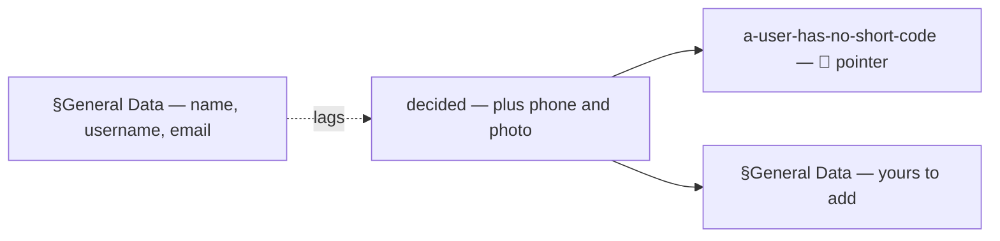
```mermaid
flowchart LR
  G["§General Data — name, username, email"] -.->|"lags"| D["decided — plus phone and photo"]
  D --> S["a-user-has-no-short-code — 🔄 pointer"]
  D --> Y["§General Data — yours to add"]
```

## short-code-was-cancelled

**The example.** You made short_code *"just for unique alias"*, then *"i cancel it"* and removed it from §General
Data. The second wins ([a-user-has-no-short-code](./context_decision.md#a-user-has-no-short-code)). Five of my sites said the first:

| site | it said | now |
| --- | --- | --- |
| the decision `short-code-is-a-unique-alias` | a unique alias | renamed [superseded-short-code-is-a-unique-alias](./context_decision.md#superseded-short-code-is-a-unique-alias), ⛔ kept as a record |
| [the user record](#the-user-record--proposed) | a short_code row, required | removed. Required is name and username |
| Critique 25, Q24 | four rules for it | deleted, closed |
| Q23 | waits on Q24 | waits on nothing |
| Q25, and the state report | *required: name, username, short_code* · a build row for the column | name and username · the row removed |

**→ Recommend** (what stops it recurring): nothing to change. The `superseded-` rename did its job, and nothing was
built in between.

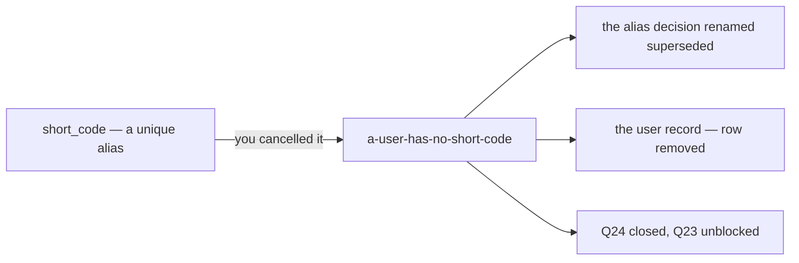
```mermaid
flowchart LR
  A["short_code — a unique alias"] -->|"you cancelled it"| B["a-user-has-no-short-code"]
  B --> D["the alias decision renamed superseded"]
  B --> T["the user record — row removed"]
  B --> Q["Q24 closed, Q23 unblocked"]
```

## the-admin-team-manages-nothing-but-itself

> ✅ **Resolved (2026-10-02)** by [the-admin-team-monitors-all-and-manages-its-own](./context_decision.md#the-admin-team-monitors-all-and-manages-its-own): the admin team reads every team and writes only inside itself. Kept,
> not deleted, so the record shows what was found.

**The example.** Two statements, read together, leave the admin team without a job:

> `business_level.md` §Admin Team: *"Monitoring and manage all resource warehouse and selling team."*
>
> [admin-team-roles-manage-only-their-team](./context_decision.md#admin-team-roles-manage-only-their-team): the admin team's roles *"edit its team"* and *"manage its members"*, nothing else.

Neither is wrong on its own: the decision is about the admin team's **own** team, the business line about **every
other** team. But nothing gives the admin team that second reach, so the business line is unbuildable as decided.

**→ Recommend:** answer [Q12](#question). I would give the admin team **read** reach over every warehouse and selling
team, and keep its writes inside itself.

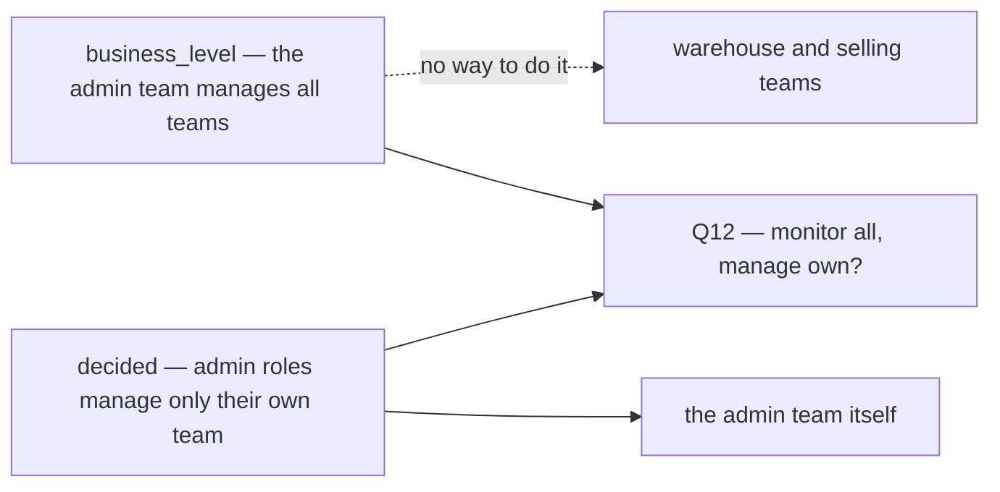
```mermaid
flowchart LR
  B["business_level — the admin team manages all teams"] -.->|"no way to do it"| T["warehouse and selling teams"]
  D["decided — admin roles manage only their own team"] --> A["the admin team itself"]
  B --> Q["Q12 — monitor all, manage own?"]
  D --> Q
```

## team-level-suspend-was-reversed

**The example.** You decided *"for team owner and team admin, its just allow suspend on team scope"*, then §Suspend
Users 2: *"Only Root and Administrator can supend user."* The second wins ([only-root-and-the-administrator-suspend](./context_decision.md#only-root-and-the-administrator-suspend)). Three places still said the first:

| site | it said | now |
| --- | --- | --- |
| the decision `two-levels-of-suspend` | a team's Owner or Admin suspends a member | renamed [superseded-two-levels-of-suspend](./context_decision.md#superseded-two-levels-of-suspend), ⛔ kept as a record |
| [a-suspended-user-is-never-picked](./context_decision.md#a-suspended-user-is-never-picked) | a row for *"suspended in one team"* | struck through, ⛔ lapsed |
| Q7f | may a team's Admin suspend its Owner | gone with it, Q7 closed |

**→ Recommend** (what stops it recurring): nothing to change. A reversal renamed with `superseded-` and linked to its
successor is the rule working, so the next reader sees both and which one stands.

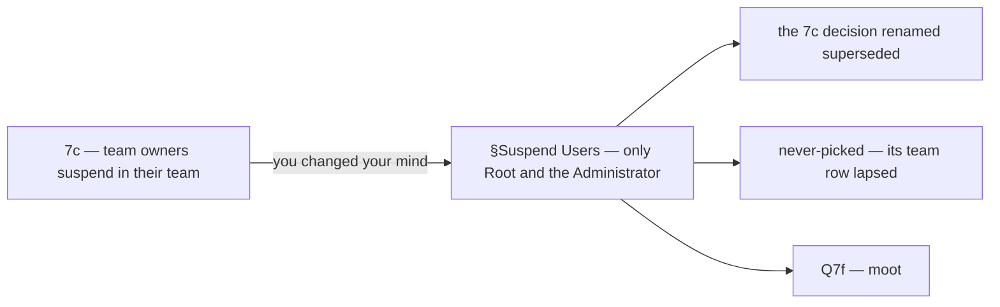
```mermaid
flowchart LR
  A["7c — team owners suspend in their team"] -->|"you changed your mind"| B["§Suspend Users — only Root and the Administrator"]
  B --> S["the 7c decision renamed superseded"]
  B --> P["never-picked — its team row lapsed"]
  B --> F["Q7f — moot"]
```

## the-administrator-keeps-do-anything

**The example.** I recommended *"narrowed to that list … 'Do anything' stays Root's alone"* (Q9, Critique 12). You
decided *"keep do anything"* ([the-administrator-can-do-anything](./context_decision.md#the-administrator-can-do-anything)). Four places still pointed at Q9 as open:

| site | now |
| --- | --- |
| Critique 12 | deleted, answered |
| [inventory Q12d](../inventory/context_clarify.md#question) — *"whether the root team's Admin may too is user Q9"* | the Administrator may confirm, as Root may |
| [root-can-do-anything](./context_decision.md#root-can-do-anything)'s spec | points at the new decision |
| the suspend and erase decisions' *"whether that is ROLE_ADMIN is Q9"* | point at the new decision |

**→ Recommend:** nothing more. The limits you wrote still bound it — no Administrator grants Root or another
Administrator, or suspends either — so *"anything"* reads as *anything except those*.

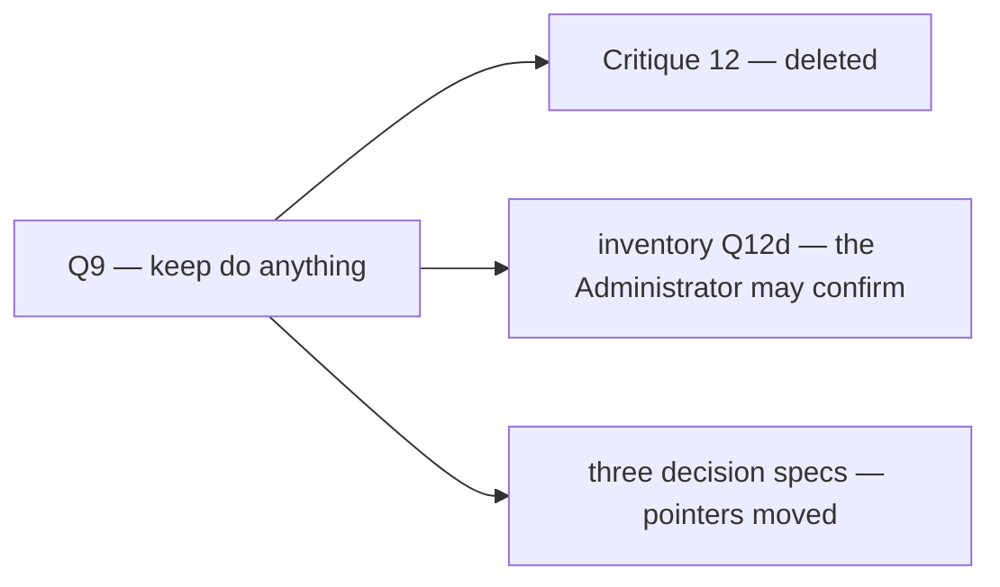
```mermaid
flowchart LR
  D["Q9 — keep do anything"] --> C["Critique 12 — deleted"]
  D --> I["inventory Q12d — the Administrator may confirm"]
  D --> P["three decision specs — pointers moved"]
```

## the-member-flow-leaves-out-the-admins

> ✅ **Resolved (2026-10-02):** the heading now reads *"How Root/Administrator/Owner/Admin add member team"*. Which Admin
> may is said by each role's own list: the warehouse and selling Admins, not the admin team's. Kept, not deleted, so the
> record shows what was found.

**The example.** Two lines of your doc disagree on who adds a member:

> §How Managing Team User Member: *"How **Root/Administrator/Owner** add member team"*
>
> §selling team, The Admin: *"Responsbility: … **manage member**"* — and since, §warehouse team, The Admin, the same

The Admins' lines are later and more specific, so I recorded them ([the-admin-team-admin-alone-does-not-manage-members](./context_decision.md#the-admin-team-admin-alone-does-not-manage-members), [the-selling-admin-manages-members](./context_decision.md#the-selling-admin-manages-members)), and I think the heading is the one to change.

**→ Recommend:** the heading names the warehouse and selling Admins too, or says *"who manages members"* and lets each role's list say who.
What stops it recurring: a heading that lists roles is a second copy of the role lists, so it goes stale whenever one
of them grows.

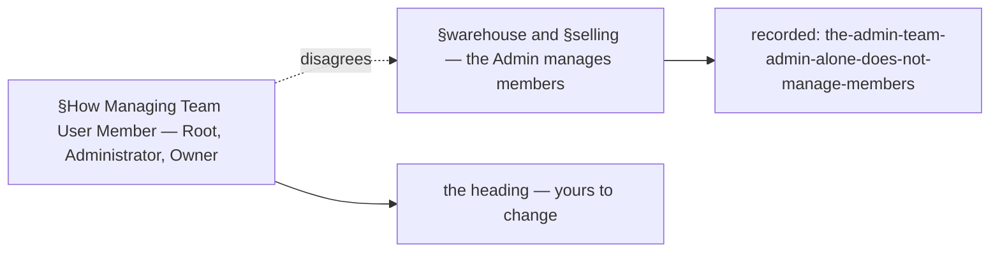
```mermaid
flowchart LR
  H["§How Managing Team User Member — Root, Administrator, Owner"] -.->|"disagrees"| S["§warehouse and §selling — the Admin manages members"]
  S --> D["recorded: the-admin-team-admin-alone-does-not-manage-members"]
  H --> Q["the heading — yours to change"]
```

## the-migration-now-writes-the-dev-password

**The example.** Four places say the opposite of [the-migration-writes-the-dev-root-password](./context_decision.md#the-migration-writes-the-dev-root-password): the FAQ (*"a fresh migration creates the root account with
an **empty password** … so no default password can ever ship to production"*), `san seed root`'s description and
[docs/tools/san.md](../../tools/san.md) (*"a default password in the migration would ship to production"*), and
migration 00003's comment. They describe the code as it is today, so they are true **until the build lands**, and
false after. My own proposal (the migration stays passwordless) is deleted.

**→ Recommend:** the commit that adds the migration rewrites the FAQ, the `seed root` description and san.md
**in the same change**. 00003 is left alone, because it has already run; 00005's own comment says what replaced it.

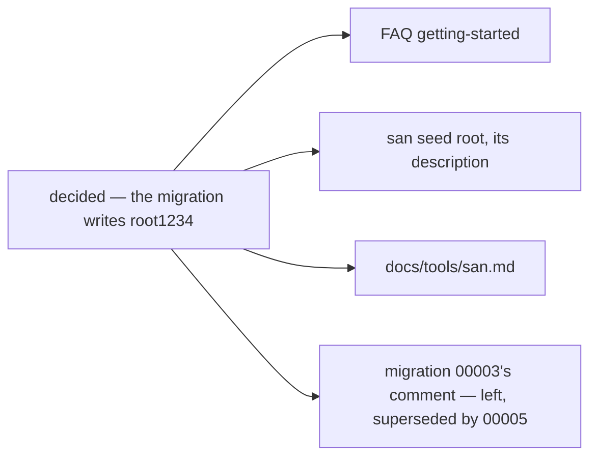
```mermaid
flowchart LR
  D["decided — the migration writes root1234"] --> F["FAQ getting-started"]
  D --> S["san seed root, its description"]
  D --> M["docs/tools/san.md"]
  D --> O["migration 00003's comment — left, superseded by 00005"]
```

## root-can-do-anything-reversed-my-scoped-writes

**The example.** I recommended *"Root … unscoped for READS and scoped for WRITES"* (old Critique 8 and Q5). You
decided *"root is superuser and can do whatever"* ([root-can-do-anything](./context_decision.md#root-can-do-anything)). Three places still argued from my version:

| site | it said | now |
| --- | --- | --- |
| Critique 8 | Root's scope is unasked | deleted, answered |
| Q5 | *"with scoped writes, it may not"* confirm another team's count | removed |
| [inventory Q12d](../inventory/context_clarify.md#question) | follows Q5, so **no** | **Root may**. Still open there: recorded as an override, never their own record |

**→ Recommend** (what stops it recurring): a question that depends on another one names it, as Q12d named Q5,
so the dependent row is found by a grep the moment the first is answered.

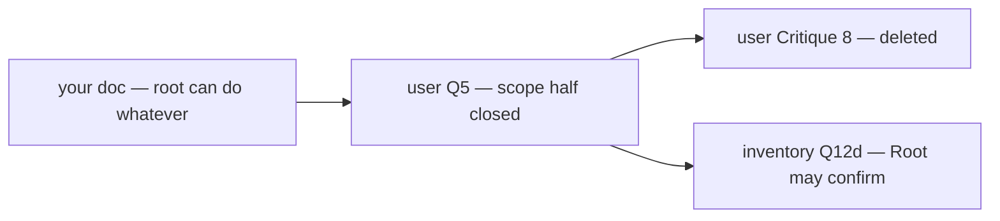
```mermaid
flowchart LR
  D["your doc — root can do whatever"] --> Q5["user Q5 — scope half closed"]
  Q5 --> C8["user Critique 8 — deleted"]
  Q5 --> I["inventory Q12d — Root may confirm"]
```

## the-packer-rename-left-fourteen-sites

**The example.** Your doc now says *"The Staff, called `WAREHOUSE_STAFF`"*
([warehouse-staff-is-the-whole-floor-job](./context_decision.md#warehouse-staff-is-the-whole-floor-job)). My other
clarify files still named the role *"Packer"*. business_level_clarify's role table read *"Warehouse | Owner, Admin,
**Packer**"*, and balance_clarify linked to `#warehouse-roles-are-owner-admin-packer`, an anchor the rename removed.
The docs were stale, not your line. All are fixed:

| file | sites |
| --- | ---: |
| [business_level_clarify.md](../business_level_clarify.md) | 6 — the role table, the stock-management actor, the §Admin quote, the one-human paragraph, a diagram, the volumes line |
| [inventory/context_clarify.md](../inventory/context_clarify.md) | 3 |
| [mcp/context_clarify.md](../mcp/context_clarify.md) | 3, plus 1 in its state report |
| [product/context_clarify.md](../product/context_clarify.md) | 1 |
| [balance/context_clarify.md](../balance/context_clarify.md) | 1 — the link anchor |

Left on purpose: order_clarify's *"picker, packer, handover time"* names who did an act to an order, not a role,
and product's `_decision.md` is append-only.

**→ Recommend** (what stops it recurring): another doc names a role by **linking** to
[warehouse-roles-are-owner-admin-staff](#warehouse-roles-are-owner-admin-staff) and its siblings, rather than
retyping the word. A link breaks loudly when a rule is renamed, and a retyped word just goes stale.

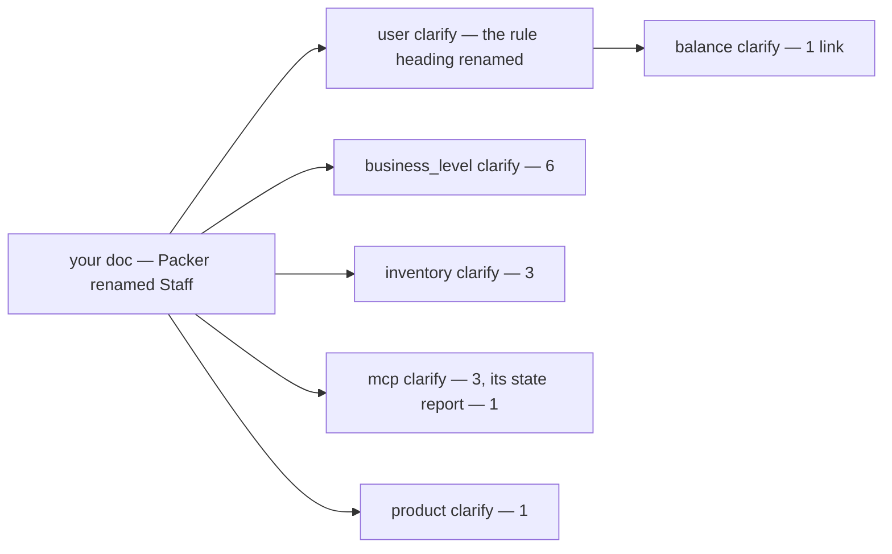
```mermaid
flowchart LR
  D["your doc — Packer renamed Staff"] --> U["user clarify — the rule heading renamed"]
  U --> B["balance clarify — 1 link"]
  D --> BL["business_level clarify — 6"]
  D --> I["inventory clarify — 3"]
  D --> M["mcp clarify — 3, its state report — 1"]
  D --> P["product clarify — 1"]
```

---

# Awaiting

**Your answer to [Q26](#question)**, which decides where backend analysis starts. design_accept passed on 2026-10-05
([the-user-prototype-is-accepted](./context_decision.md#the-user-prototype-is-accepted)), so nothing else waits on you.
