# Decisions — `user/context.md`

What the owner settled, recorded before it is acted on. **Append-only** — a decision that is later reversed is
renamed and its references grepped (RULE 12), never quietly edited away. The open set is
[context_clarify.md](./context_clarify.md).

| decision | what it decided | from |
| --- | --- | --- |
| [warehouse-staff-is-the-whole-floor-job](#warehouse-staff-is-the-whole-floor-job) | a warehouse team's floor role is **Staff** (`WAREHOUSE_STAFF`), and it is the whole floor job, not the packing bench | owner, 2026-10-02 |
| [one-role-per-person-per-team](#one-role-per-person-per-team) | one person holds at most one role in a team, and may hold another role in any other team | owner, 2026-10-02 |
| [root-is-granted-only-through-san](#root-is-granted-only-through-san) | Root exists from the start, nobody grants it in the app, and only `tools/san` adds, removes or resets one | owner, 2026-10-02 |
| [root-can-do-anything](#root-can-do-anything) | Root reads and writes in every team without being a member | owner, 2026-10-02 |
| [dev-root-password-is-root1234](#dev-root-password-is-root1234) | the development root logs in as `root` / `root1234` / `root@pdc.com` | owner, 2026-10-02 |
| [the-migration-writes-the-dev-root-password](#the-migration-writes-the-dev-root-password) | a migration writes that password, only while root's is still empty — production changes it after | owner, 2026-10-02 |
| [a-user-is-never-deleted](#a-user-is-never-deleted) | no user is ever deleted. Leaving is a suspend, so every record keeps a name | owner, 2026-10-02 |
| [the-username-is-editable](#the-username-is-editable) | an edit may change the username, so a typo is fixed in place | owner, 2026-10-02 |
| [superseded-two-levels-of-suspend](#superseded-two-levels-of-suspend) | ⛔ superseded by [only-root-and-the-administrator-suspend](#only-root-and-the-administrator-suspend) — it let a team's Owner or Admin suspend a member in that team | owner, 2026-10-02 |
| [a-suspended-user-is-never-picked](#a-suspended-user-is-never-picked) | a suspended user is never offered when picking someone, and is shown with a badge everywhere else | owner, 2026-10-02 |
| [erase-keeps-the-row](#erase-keeps-the-row) | erasing a former user blanks their personal data and keeps the row and id. Root and the System Administrator do it | owner, 2026-10-02 |
| [every-role-has-a-code-name](#every-role-has-a-code-name) | ten roles, each with a code name, and the admin team's are its own | owner, 2026-10-02 |
| [root-can-be-several](#root-can-be-several) | more than one user may be Root | owner, 2026-10-02 |
| [root-grants-the-administrator](#root-grants-the-administrator) | only Root grants the System Administrator | owner, 2026-10-02 |
| [staff-accepts-the-restock](#staff-accepts-the-restock) | Staff's "receive restock" includes accepting it — the count, the losses and the unit price, in one act | owner, 2026-10-02 |
| [owner-root-and-administrator-add-members](#owner-root-and-administrator-add-members) | a member is added by Root, the Administrator or the team's Owner: search, create if missing, pick a role, submit | owner, 2026-10-02 |
| [the-selling-owner-and-admin-set-markup-reserve-and-lock](#the-selling-owner-and-admin-set-markup-reserve-and-lock) | the selling Owner and Admin set the cross markup, the reserve and the lock — never Customer Service | owner, 2026-10-02 |
| [an-owner-never-makes-another-owner](#an-owner-never-makes-another-owner) | no Owner gives the Owner role, in any team. Root or the Administrator does | owner, 2026-10-02 |
| [the-selling-admin-manages-members](#the-selling-admin-manages-members) | the selling team's Admin manages members, as its Owner does | owner, 2026-10-02 |
| [superseded-only-the-selling-admin-manages-members](#superseded-only-the-selling-admin-manages-members) | ⛔ superseded by [the-admin-team-admin-alone-does-not-manage-members](#the-admin-team-admin-alone-does-not-manage-members) — it kept the warehouse Admin out | owner, 2026-10-02 |
| [the-admin-team-admin-alone-does-not-manage-members](#the-admin-team-admin-alone-does-not-manage-members) | the warehouse and selling Admins manage members; the admin team's Admin does not | owner, 2026-10-02 |
| [no-admin-makes-another-admin](#no-admin-makes-another-admin) | no Admin gives the Admin role | owner, 2026-10-02 |
| [the-administrator-can-do-anything](#the-administrator-can-do-anything) | the System Administrator keeps "do anything", inside the limits the doc names | owner, 2026-10-02 |
| [the-role-names-are-the-codes-names](#the-role-names-are-the-codes-names) | the ten names are the code's names, from the doc to the proto to the screen | owner, 2026-10-02 |
| [a-member-is-found-in-a-search-popup](#a-member-is-found-in-a-search-popup) | the person to add is found in a search popup | owner, 2026-10-02 |
| [an-existing-member-gets-change-role](#an-existing-member-gets-change-role) | someone the search finds already in the team gets Change Role, in the same flow | owner, 2026-10-02 |
| [only-member-managers-open-the-search](#only-member-managers-open-the-search) | only those who manage members may open the search popup | owner, 2026-10-02 |
| [managers-search-by-exact-username-phone-or-email](#managers-search-by-exact-username-phone-or-email) | an Owner or Admin finds a person by exact username, phone or email; Root and the Administrator search broadly | owner, 2026-10-02 |
| [a-result-shows-the-phones-last-four-digits](#a-result-shows-the-phones-last-four-digits) | a search result shows the phone's last four digits, never the number | owner, 2026-10-02 |
| [change-role-only-below-your-own](#change-role-only-below-your-own) | Change Role touches only a role below your own, to a role below your own; nobody changes their own | owner, 2026-10-02 |
| [a-phone-or-email-belongs-to-one-account](#a-phone-or-email-belongs-to-one-account) | a phone or an email belongs to one account | owner, 2026-10-02 |
| [a-shop-grant-picks-from-the-teams-members](#a-shop-grant-picks-from-the-teams-members) | granting a shop picks from the team's members, never from everyone | owner, 2026-10-02 |
| [admin-team-roles-manage-only-their-team](#admin-team-roles-manage-only-their-team) | the admin team's two roles get team management only, none of the selling calls | owner, 2026-10-02 |
| [the-admin-team-monitors-all-and-manages-its-own](#the-admin-team-monitors-all-and-manages-its-own) | the admin team reads every warehouse and selling team, and writes only inside itself | owner, 2026-10-02 |
| [every-role-change-is-logged](#every-role-change-is-logged) | every add, role change and removal is written to a membership log | owner, 2026-10-02 |
| [an-override-is-stamped-in-every-service](#an-override-is-stamped-in-every-service) | every write by Root or the Administrator inside another team is stamped as an override, in every service | owner, 2026-10-02 |
| [the-two-administrators-have-distinct-labels](#the-two-administrators-have-distinct-labels) | `administrator` shows as *System Administrator*, `admin_administrator` as *Admin Team Admin*, never the bare word | owner, 2026-10-02 |
| [one-account-per-phone-stays-a-refusal](#one-account-per-phone-stays-a-refusal) | one account per phone stays a refusal; a person without their own number has no phone | owner, 2026-10-02 |
| [removing-a-member-drops-their-shop-access](#removing-a-member-drops-their-shop-access) | the people who add a member remove one, only below their own role; the removal is logged and the person loses their shop access in that team | owner, 2026-10-02 |
| [customer-service-runs-orders-restock-requests-and-settlements](#customer-service-runs-orders-restock-requests-and-settlements) | Customer Service runs orders, drafts, restock requests and settlements — the build's list, settlements included | owner, 2026-10-02 |
| [the-warehouse-admin-equals-the-owner-except-money](#the-warehouse-admin-equals-the-owner-except-money) | the warehouse Admin equals the Owner, except setting the liability terms and moving money between financial accounts | owner, 2026-10-02 |
| [only-root-and-the-administrator-suspend](#only-root-and-the-administrator-suspend) | suspend is account-wide, by Root or the Administrator only, and never sideways: no Root suspends a Root, no Administrator an Administrator | owner, 2026-10-02 |
| [the-history-is-a-tab-beside-the-members](#the-history-is-a-tab-beside-the-members) | the Users page shows the members and the membership history on two tabs | owner, 2026-10-02 |
| [superseded-short-code-is-a-unique-alias](#superseded-short-code-is-a-unique-alias) | ⛔ superseded by [a-user-has-no-short-code](#a-user-has-no-short-code) — it made `short_code` a person's unique alias | owner, 2026-10-05 |
| [a-user-has-no-short-code](#a-user-has-no-short-code) | there is no `short_code`. A user is name, username and email — extended by [a-user-is-name-username-email-phone-and-photo](#a-user-is-name-username-email-phone-and-photo) | owner, 2026-10-05 |
| [a-who-filter-lists-the-people-on-its-rows](#a-who-filter-lists-the-people-on-its-rows) | a "who" filter offers the people on the list's own rows, answered by the list's own service | owner, 2026-10-05 |
| [whoever-reads-a-list-may-filter-it](#whoever-reads-a-list-may-filter-it) | whoever may read a list may use its "who" filter, Customer Service and Staff included | owner, 2026-10-05 |
| [a-filter-keeps-former-and-suspended-people](#a-filter-keeps-former-and-suspended-people) | a filter keeps people who left and suspended accounts, with a badge; *never picked* covers pickers that give | owner, 2026-10-05 |
| [an-admin-changes-nobodys-role](#an-admin-changes-nobodys-role) | an Admin adds and removes the floor role, and changes nobody's role | owner, 2026-10-05 |
| [the-user-prototype-is-accepted](#the-user-prototype-is-accepted) | ✅ design_accept passed — the screens and the contract additions are what the backend builds | owner, 2026-10-05 |
| [a-root-team-form-starts-with-no-role](#a-root-team-form-starts-with-no-role) | in the root team a form starts with no role; elsewhere on the lowest | owner, 2026-10-05 |
| [an-account-is-made-only-from-the-member-search](#an-account-is-made-only-from-the-member-search) | one way to make an account: the Add Member popup's Create. New User is removed | owner, 2026-10-05 |
| [a-user-is-name-username-email-phone-and-photo](#a-user-is-name-username-email-phone-and-photo) | the whole user record is name, username, email, phone and photo; the per-team `alias` is removed | owner, 2026-10-05 |
| [only-name-and-username-are-required](#only-name-and-username-are-required) | name and username are required; email and phone are optional, unique when given | owner, 2026-10-05 |
| [the-admin-team-roles-are-added-first](#the-admin-team-roles-are-added-first) | `admin_owner` and `admin_administrator` are added first; an admin-type team's Owner stops getting the selling Owner role | owner, 2026-10-05 |
| [rename-the-roles-before-the-grant-checks](#rename-the-roles-before-the-grant-checks) | the hold is lifted: the four roles are renamed now, before the code that compares roles | owner, 2026-10-05 |
| [no-alias-for-the-old-role-names](#no-alias-for-the-old-role-names) | the old role names are not kept as aliases; a tab on the old app reloads once | owner, 2026-10-05 |
| [the-create-team-form-names-the-first-owner](#the-create-team-form-names-the-first-owner) | a new team's first Owner is the person the Create Team form names; the creator is not made a member | owner, 2026-10-05 |
| [the-switcher-offers-every-team](#the-switcher-offers-every-team) | the switcher adds *All teams* under *My teams*: every team for Root and the Administrator, every warehouse and selling team read-only for the admin team | owner, 2026-10-06 |
| [a-non-member-root-acts-under-a-strip](#a-non-member-root-acts-under-a-strip) | in a team they are not in, Root and the Administrator act with their platform role under a *not a member* strip, each write an override | owner, 2026-10-06 |
| [the-admin-team-monitors-read-only](#the-admin-team-monitors-read-only) | in a team it monitors, the admin team sees no write control, and the server lets only marked reads through | owner, 2026-10-06 |
| [the-switcher-ships-with-the-create-team-form](#the-switcher-ships-with-the-create-team-form) | pass 1 now: *All teams* for Root and the Administrator, their strip, and Create Team's Owner field · pass 2 after: the admin team read-only | owner, 2026-10-06 |
| [an-erased-account-is-final](#an-erased-account-is-final) | nothing brings an erased account or its data back: no unsuspend, no new password, no joining a team, no edit | owner, 2026-10-06 |
| [erased-usernames-are-reserved](#erased-usernames-are-reserved) | no account may be named `erased` followed by digits, except by erase itself | owner, 2026-10-06 |
| [erase-deletes-the-photo-file](#erase-deletes-the-photo-file) | erase deletes every profile picture the person uploaded — the stored files and their rows | owner, 2026-10-06 |
| [a-phone-is-saved-in-international-form](#a-phone-is-saved-in-international-form) | a phone is rewritten on save into one form, `+` and the country code — `0812…` becomes `+62812…` | owner, 2026-10-06 |
| [a-phone-has-8-to-15-digits](#a-phone-has-8-to-15-digits) | a phone is digits with spaces, dashes, dots or brackets, 8 to 15 digits, a `+` only at the start; anything else is refused | owner, 2026-10-06 |
| [a-phone-starts-with-0-or-a-country-code](#a-phone-starts-with-0-or-a-country-code) | a number with neither a leading `0` nor `+` and a country code (nor `62`) is refused, never guessed | owner, 2026-10-06 |
| [stored-phones-are-rewritten-once](#stored-phones-are-rewritten-once) | the migration rewrites every readable stored phone, leaves an unreadable one, and stops if two accounts share a number | owner, 2026-10-06 |
| [the-pass-1-prototype-is-accepted](#the-pass-1-prototype-is-accepted) | design_accept of pass 1: the switcher's *All teams*, the strip, Create Team's required Owner and `owner_user_id`, with the five choices made in the prototype | owner, 2026-10-06 |

## warehouse-staff-is-the-whole-floor-job

> `context.md` §Role That exists across teams 1 *(owner, 2026-10-02)*: *"The Staff, called `WAREHOUSE_STAFF`. One
> floor role that receives, shelves, picks, packs and hands over to the courier."* It replaces *"The Packer"* and
> answers [Q1](./context_clarify.md#question) as recommended.

> 🔄 *(2026-10-02, later)* The owner listed Staff's job in full: *"Receive restock & return · accepting order · processing
> order · receives, shelves, picks, packs and hands over to the courier."* The verdict still holds, with a longer list.
> Accepting, packing and shipping an order are open to Staff in the build. Receiving a customer's return is not built.

**The verdict.** A warehouse team has three roles: **Owner**, **Admin**, **Staff**. Staff is every act that touches
goods in the building. There is no Packer, Picker or Receiver role. If the floor ever needs a narrower role, it is
added **beside** Staff, so the word "Staff" never has to be redefined.

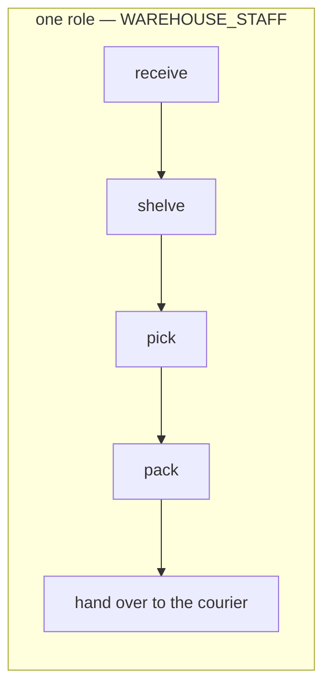

**The spec.** The code already matches. Nothing has to change.

| | |
| --- | --- |
| the role | `ROLE_WAREHOUSE_STAFF = 8` in `warehouse.role_base.v1.Role` |
| a warehouse team's roles | `WAREHOUSE_OWNER` (6) · `WAREHOUSE_ADMIN` (9) · `WAREHOUSE_STAFF` (8) |
| what Staff may call today | receive stock, fulfil a restock, move stock, pack and ship an order, read racks, batches and stock |
| dev fixture | `wh_staff` in `san seed dev` |

> 🔄 *(2026-10-02, later)* Decided: Staff accepts the restock too — [staff-accepts-the-restock](#staff-accepts-the-restock).

⚠ **What it does NOT decide.** *"Receives"* names the floor work. Whether Staff may also **accept** a restock, which
fixes the unit price and the fee the selling team owes, is still [Q4](./context_clarify.md#question). The build
already lets Staff do it, because `RestockRequestFulfill` is the count and the acceptance in one call.

## one-role-per-person-per-team

> `context.md` §General 2 *(owner, 2026-10-02)*: *"One person have only one role in one team. in different team it
> can be another role."* It answers [Q2](./context_clarify.md#question) as recommended.

**The verdict.** A membership is **(person, team) → exactly one role**. Changing someone's role in a team replaces
it, never adds a second. In any other team the same person may hold any role that team's type offers.

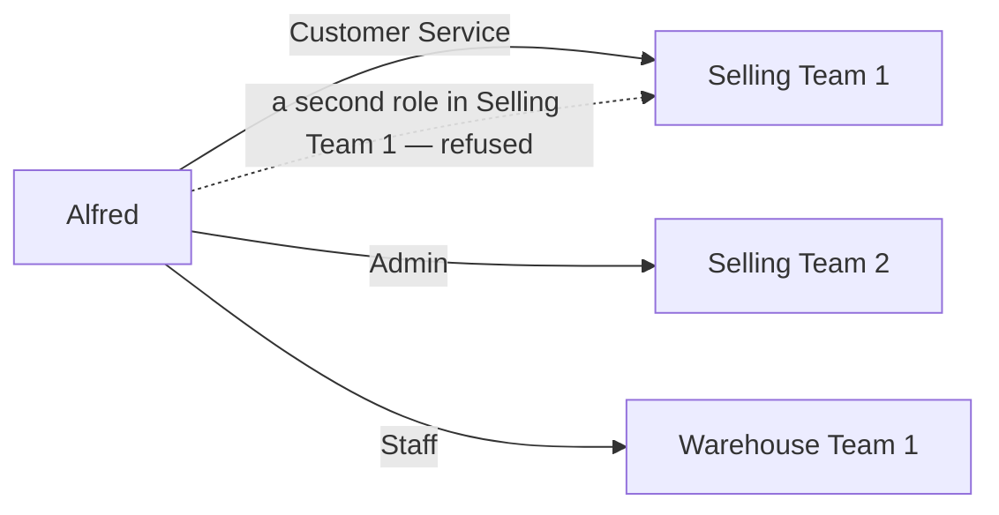

**The spec.** The code already matches. Nothing has to change.

| | |
| --- | --- |
| the rule, in the database | `UNIQUE (team_id, user_id)` on `user_team_roles` — migration 00002 |
| assigning a role | `TeamUserUpdate` is an upsert on that key: a new role replaces the old one |
| reading a role | the access check reads ONE role per (user, team), cached; the unique key is what makes that safe |
| across teams | no limit — the same user may be a member of any number of teams, of any type |

✅ **Confirmed by the owner (2026-10-02, Q20a–d: *"yes"*).** *"Different team"* means **any** other team, a warehouse team and a selling team included.

⚠ **What it does NOT close.** One human can still record a count and confirm it: a manager alone (Owner and Admin
may count), or anyone holding Root or Admin in the root team, which acts in every team. That is
[inventory Q12](../inventory/context_clarify.md#question).

## root-is-granted-only-through-san

> `context.md` §root team 1 *(owner, 2026-10-02)*: *"root is generated by default. No one can assign to other user
> with root role."* · *"root can add or remove or reset password by developer tool in `tools/san`"*. And §Default
> Data: *"its added by migration or tools in `tools/san`"*. It answers the Root half of [Q5](./context_clarify.md#question),
> **against my recommendation** (Root grants Root): not even a Root grants Root in the app.

> 🔄 *(2026-10-05, built)* Enforced on the server: `checkMemberWrite` in `user_v1/member_rules.go`, called by `TeamUserUpdate`
> and `CreateUser` under a lock on the person's `users` row. A role must also be of its team's type.

**The verdict.** Root exists from the start. The app never grants or revokes it, not even for a Root. Adding a Root,
removing one, and resetting a Root's password happen only through `tools/san`, run by a developer.

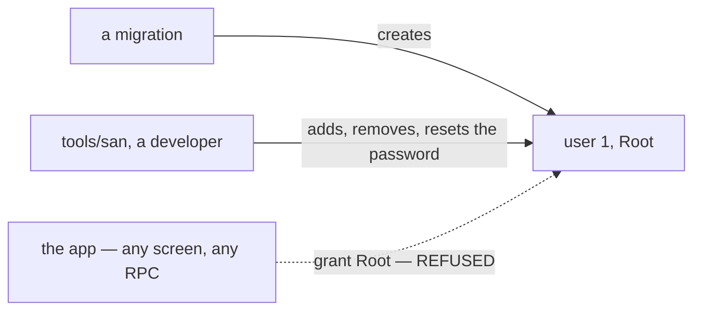

**The spec.** ⚠ **Not built. The app can grant Root today**, three ways:

| | today | after |
| --- | --- | --- |
| `CreateUser` | grants Root in the root team | refuses Root in every team |
| `TeamUserUpdate`, add | stores any role, Root included | refuses Root |
| the role picker | offers Root for the root and admin team types | never offers Root |
| `tools/san` | `seed root` sets user 1's password · `user reset-password` resets anyone's | also adds and removes a Root. Its shape waits on [Q8](./context_clarify.md#question) |

## root-can-do-anything

> `context.md` §root team 1 *(owner, 2026-10-02)*: *"root is superuser and can do whatever."* It answers the scope
> half of [Q5](./context_clarify.md#question), **against my recommendation** (unscoped reads, scoped writes).

**The verdict.** Root reads and writes in every team without being a member of it.

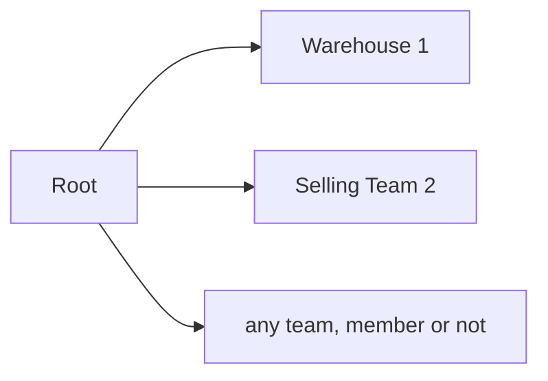

**The spec.** Built, nothing to change: the access check lets Root in the root team past every team's scope.

| | |
| --- | --- |
| where | `user_service/access_interceptors`, the root-team check |
| ⚠ the same check | also passes `ROLE_ADMIN` in the root team, which keeps it — [the-administrator-can-do-anything](#the-administrator-can-do-anything) |
| what it decides elsewhere | Root may confirm another team's stock count ([inventory Q12d](../inventory/context_clarify.md#question)) |

## dev-root-password-is-root1234

> `context.md` §Default Data 1 *(owner, 2026-10-02)*: *"username `root` with password `root1234` and email
> `root@pdc.com`"*, changed from `root123`. It answers the length half of [Q6](./context_clarify.md#question),
> as recommended.

**The verdict.** In development, Root logs in as `root` / `root1234`, email `root@pdc.com`. It is 8 characters,
so it passes the app's own rule, and Root can reset back to it from any password screen.

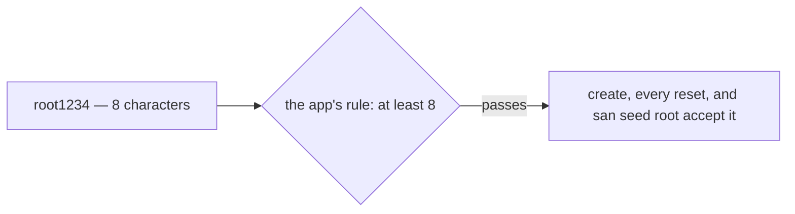

**The spec.** ⚠ **Not built yet.**

| | today | after |
| --- | --- | --- |
| the password | none. Root cannot log in until `san seed root` sets one | `root1234` |
| the email | `root@system.local` | `root@pdc.com` |
| which writes it | — | the migration — [the-migration-writes-the-dev-root-password](#the-migration-writes-the-dev-root-password) |
| the FAQ's login table | lists `dev` / `devpassword123` only | gains a `root` row |

## the-migration-writes-the-dev-root-password

> Owner, in chat *(2026-10-02)*: *"its okay write password in migration, in production sure we change better, but in
> development its usefull for anyone that need clone and run / test our code."* It answers [Q6](./context_clarify.md#question),
> **against my recommendation** (the migration stays passwordless and `tools/san` writes it).

**The verdict.** A migration gives root the password `root1234` and the email `root@pdc.com`, so a fresh clone
logs in as root with no extra step. Production changes the password after its first migration, with
`san seed root`.

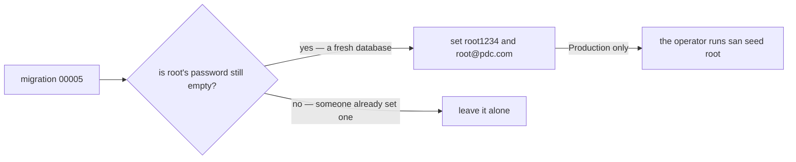

**The spec.** ⚠ **Not built yet.**

| | |
| --- | --- |
| the migration | a new `00005` in `user_service`. 00003 has already run, so it is not edited. 🔄 *(2026-10-06)* **`00007`**: `00005` went to the membership log and `00006` to `erased_at` first, and goose refuses a lower number added after a higher one has run. 🔄 *(2026-10-06, later)* **the next free number** — `00007` went to the phone key (`user_phone_key`); `00008` today |
| the password | a bcrypt hash of `root1234`, never the plain text |
| ⚠ only while empty | `WHERE id = 1 AND password = ''`: a database whose root password was already set keeps it. Without this, a new migration would **reset** a production root password back to the public one |
| the email | `root@pdc.com`, only while it is still `root@system.local` |
| Down | undoes only what it wrote, and only where its own values are still there |
| the same commit updates | the FAQ's getting-started, `san seed root`'s description, and docs/tools/san.md ([the-migration-now-writes-the-dev-password](./context_clarify.md#the-migration-now-writes-the-dev-password)) |

⚠ **Accepted risk.** A **fresh** production database starts with a Root whose password is public in this repo, and
Root can do anything, until the operator runs `san seed root`.

## a-user-is-never-deleted

> Owner, in chat *(2026-10-02)*: *"for 7a, 7b, i follow your recomend"*. It answers [Q7a](./context_clarify.md#question),
> as recommended.

> 🔄 *(2026-10-06, built)* `DeleteUser` is gone — the RPC, its two messages, the handler and its test. No screen offered it.

**The verdict.** No user is ever deleted. A person who leaves is suspended, and every record they made keeps their
name.

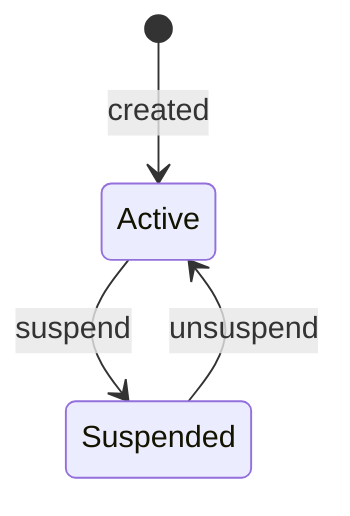

**The spec.** ⚠ **Not built. The build deletes today.**

| | today | after |
| --- | --- | --- |
| `DeleteUser` | a hard delete for Root and the root team's Admin. The row and every membership go | removed: the RPC, its handler and test, and the Users screen's Delete row action and its dialog |
| the records that hold a user id | 22 columns in 8 services, which show *"User #57"* after a delete | always resolve to a name |

## the-username-is-editable

> Owner, in chat *(2026-10-02)*: *"for 7a, 7b, i follow your recomend"*. It answers [Q7b](./context_clarify.md#question),
> as recommended.

> 🔄 *(2026-10-06, built)* `UpdateUser` takes the optional `username`: lowercased like create, a taken name is `already_exists`,
> user 1 keeps `root` (`failed_precondition`). The Edit dialog's *thrown away* mark is retired.

**The verdict.** Editing a user may change their username. A typo is fixed in place, never by deleting and making the
account again.

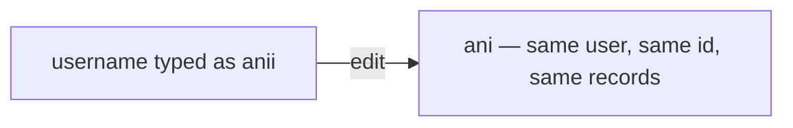

**The spec.** ⚠ **Not built.**

| | |
| --- | --- |
| the call | `UpdateUser` gains an optional `username`, with the same rule as create: lowercase letters and digits |
| unique | a username already taken is refused, the same as at create |
| sign-in | the person signs in with the new username from then on |
| root | user 1 keeps `root` ([dev-root-password-is-root1234](#dev-root-password-is-root1234)) |

## superseded-two-levels-of-suspend

> ⛔ **Superseded (2026-10-02)** by [only-root-and-the-administrator-suspend](#only-root-and-the-administrator-suspend): the
> owner changed their mind, and a team's Owner or Admin no longer suspends anyone. Kept, not deleted, so the record
> shows what was decided and when.

> Owner, in chat *(2026-10-02)*: *"for 7c, root and administrator allow suspend all user, for team owner and team admin,
> its just allow suspend on team scope."* It answers [Q7c](./context_clarify.md#question), **wider than I recommended**
> (Root and the System Administrator only).

**The verdict.** Suspend has two levels.

- **The account.** Root and the System Administrator suspend any user, and the person is refused in every team.
- **One membership.** A team's Owner or Admin suspends a member in **that team only**. The person still works in their
  other teams, and keeps the membership, so unsuspending gives back exactly what they had.

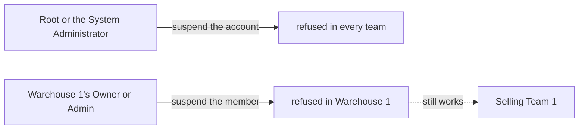

⚠ **How I read "team scope".** The *effect* stops at the team. The other reading, that a team owner may suspend the
whole **account** of anyone in their team, would cut that person out of teams the owner does not run. Say if you meant
that one, and this decision is renamed.

**The spec.** The account level is built. The team level is not.

| | |
| --- | --- |
| the account | built: `SuspendUser`, refused at sign-in and on every live token |
| "the administrator" | the System Administrator, `ROLE_ADMIN` — [the-administrator-can-do-anything](#the-administrator-can-do-anything) |
| the membership | ⚠ not built: a membership gains a suspended mark, with who set it and when |
| the access check | ⚠ a suspended membership counts as no role in that team. The cached role is cleared the moment it changes, as adding and removing a member already do |
| the call | ⚠ suspend and unsuspend a member, scoped to the team, for its Owner and Admin |
| the screen | ⚠ the team's member list shows a Suspended badge, and offers Suspend and Unsuspend |
| still open | may a team's Admin suspend its Owner, and may anyone suspend themselves ([Q7f](./context_clarify.md#question)) |

## a-suspended-user-is-never-picked

> Owner, in chat *(2026-10-02)*: *"for 7d, i follow your recomendation"*. It answers [Q7d](./context_clarify.md#question),
> as recommended.

> 🔄 *(2026-10-05)* Bounded: a "who" filter is not a picker that gives, so it keeps suspended and former people with a
> badge — [a-filter-keeps-former-and-suspended-people](#a-filter-keeps-former-and-suspended-people).

**The verdict.** A suspended user cannot be newly given anything, and is still visible wherever they already are.

| suspended … | when picking someone (add to a team, grant a shop) | in a list, and on the records they made |
| --- | --- | --- |
| everywhere (the account) | never offered | shown, with a Suspended badge |
| ~~in one team (the membership)~~ | ⛔ lapsed with [superseded-two-levels-of-suspend](#superseded-two-levels-of-suspend): there is no team-level suspend | |

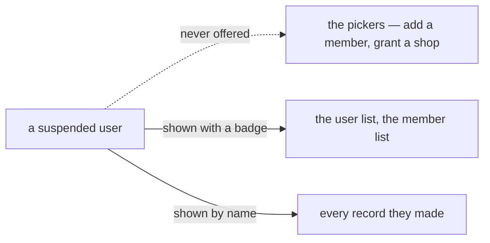

> 🔄 *(2026-10-06)* **The server half is built**: `TeamUserUpdate` refuses to add a suspended person to a team
> (`failed_precondition`), which also refuses one as a new team's first Owner. The search half is not.

> 🔄 *(2026-10-06, built)* **The search half is built too**: `SearchUser` leaves out suspended accounts, for everyone. The
> "who" filters keep them, with a badge ([a-filter-keeps-former-and-suspended-people](#a-filter-keeps-former-and-suspended-people)).

**The spec.** ⚠ **The search is not built: a suspended user is still offered by the pickers.**

| | |
| --- | --- |
| the user search behind the pickers | leaves out suspended accounts. ~~And members suspended in the team being picked for~~ ⛔ lapsed with [superseded-two-levels-of-suspend](#superseded-two-levels-of-suspend) |
| the user list and member list | keep them, with a Suspended badge and a filter |
| a record's author | still resolves to their name |

## erase-keeps-the-row

> Owner, in chat *(2026-10-02)*: *"for 7e yes its only root and administrator"*. It answers [Q7e](./context_clarify.md#question),
> **wider than I recommended** (Root only).

**The verdict.** When a former user asks to have their personal data removed, they are **erased, not deleted**. The row
and the id stay, so every record still has someone behind it, and their personal data is blanked. Root and the System
Administrator do it.

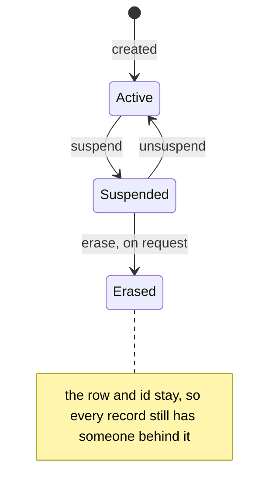

**The spec.** ⚠ **Not built.**

| | |
| --- | --- |
| who | Root and the System Administrator, `ROLE_ADMIN` — [the-administrator-can-do-anything](#the-administrator-can-do-anything) |
| when | only an account that is already suspended |
| what is blanked | the name, email, phone and photo. The password is cleared, so the account can never sign in again |
| the username | replaced with one that cannot collide, such as `erased57`, so the old one is free for somebody else |
| what a record shows | *"Former user #57"* |
| undo | none, so the screen confirms it, as every destructive action does |

> 🔄 *(2026-10-06, built)* `UserErase` (`user_v1/user_erase.go`): under the `users`-row lock `SuspendUser` takes, by the
> people who may suspend the account (nobody themselves, a Root never, an Administrator only by Root), and only while
> it is suspended. Blanks the name, email, phone and photo link, clears the password and stamps
> `last_password_reset`; the username becomes `erased<id>`; memberships stay. The screen shows such a person as
> *"Former user #57"* — `UserItem` and the membership history (`lib/users.ts` `formerUserId`). Three things the spec
> does not settle are [Q30](./context_clarify.md#question): whether *Erased* is final, the `erased<id>` name, and the
> photo file.

## only-root-and-the-administrator-suspend

> `context.md` §Suspend Users 1–4 *(owner, 2026-10-02)*: *"no user can be deleted in our system. we just do suspend."* ·
> *"Only Root and Administrator can supend user."* · *"Root can't suspend another root."* · *"administrator can't
> suspend another administrator. Only root can do it."* The owner changed their mind: it supersedes
> [superseded-two-levels-of-suspend](#superseded-two-levels-of-suspend), and it closes [Q7f](./context_clarify.md#question).

> 🔄 *(2026-10-05, built)* `SuspendUser` judges the target by its root-team role under a lock on the target's `users` row:
> a Root never, an Administrator only by Root, nobody themselves (`checkSuspend`, `user_v1/member_rules.go`).

**The verdict.** A suspend is always **account-wide**, and only Root and the Administrator do it, never sideways.

| who | may suspend | may not suspend |
| --- | --- | --- |
| Root | an Administrator, and anyone below | another Root |
| the Administrator | anyone below Administrator | another Administrator, or a Root |
| a team's Owner or Admin | nobody. They remove a member from their own team instead | — |

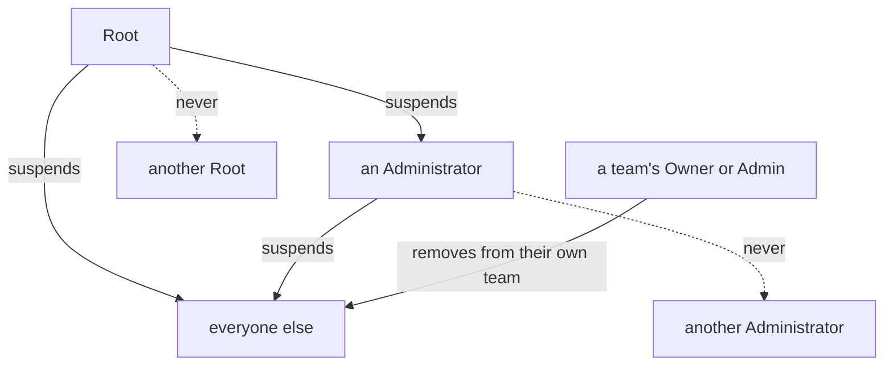

✅ **Confirmed by the owner (2026-10-02, Q20a–d: *"yes"*).** An Administrator may not suspend a Root either. If even a Root may not, an Administrator below
it may not. A Root is managed only through `tools/san` ([root-is-granted-only-through-san](#root-is-granted-only-through-san)).
And because no Root suspends a Root and no Administrator an Administrator, **nobody can suspend themselves**.

**The spec.** ⚠ **Partly built.**

| | today | after |
| --- | --- | --- |
| who calls `SuspendUser` | Root and the root team's Admin | the same: the Administrator is `ROLE_ADMIN` — [the-administrator-can-do-anything](#the-administrator-can-do-anything) |
| whom it refuses | **user 1 only**, by id. A second Root, or another Admin, can be suspended | refused **by role**: a Root target always; an Administrator target unless the caller is Root |
| the Users screen | offers Suspend on every row | offers it only where the rule allows |
| a team's member list | — | no Suspend. Remove from the team stays |

## every-role-has-a-code-name

> `context.md` §Role That exists across teams *(owner, 2026-10-02)*: each role is now *"Called"* by a name. It
> answers Critique 5 (one word "Admin" for four jobs) by giving every Admin its own name.

**The verdict.** Ten roles, each with one name, and each team type has its own.

| team | roles |
| --- | --- |
| warehouse | `warehouse_owner` · `warehouse_admin` · `warehouse_staff` |
| selling | `selling_owner` · `selling_admin` · `selling_cs` |
| admin | `admin_owner` · `admin_administrator` |
| root | `root` · `administrator` |

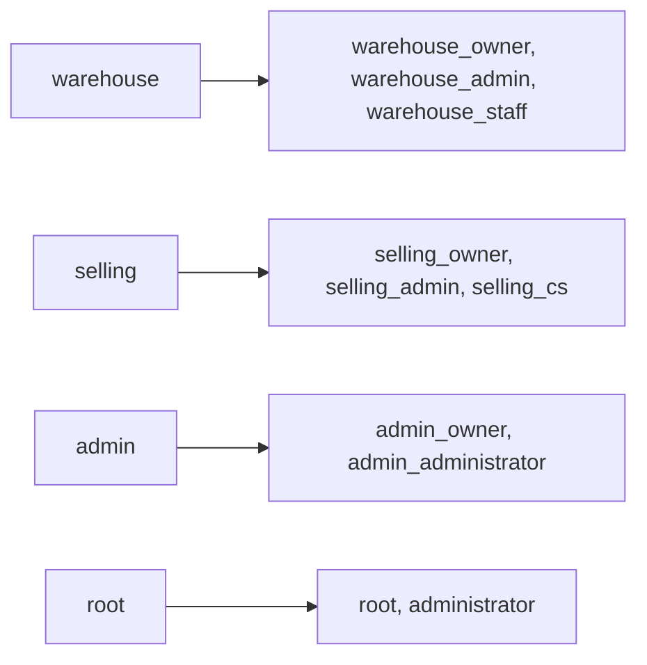

**The spec.** ⚠ **Five of the ten match the build.** They become the code's names —
[the-role-names-are-the-codes-names](#the-role-names-are-the-codes-names).

| name | in the build today |
| --- | --- |
| `warehouse_owner` · `warehouse_admin` · `warehouse_staff` | ✅ `ROLE_WAREHOUSE_OWNER` · `_ADMIN` · `_STAFF` |
| `root` · `administrator` | ✅ `ROLE_ROOT` · `ROLE_ADMIN` |
| `selling_owner` · `selling_admin` · `selling_cs` | ⚠ named `ROLE_TEAM_OWNER` · `ROLE_TEAM_ADMIN` · `ROLE_TEAM_CUSTOMER_SERVICE` |
| `admin_owner` · `admin_administrator` | ⛔ do not exist. The admin team borrows the selling team's two |
| *(not a person's role)* | `ROLE_SYSTEM`, the identity the system acts under. It stays out of this list |

## root-can-be-several

> `context.md` §root team 1 *(owner, 2026-10-02)*: *"root can be more than one user."* It answers
> [Q8](./context_clarify.md#question), as recommended.

**The verdict.** More than one user may be Root. Each one is added and removed only through `tools/san`
([root-is-granted-only-through-san](#root-is-granted-only-through-san)).

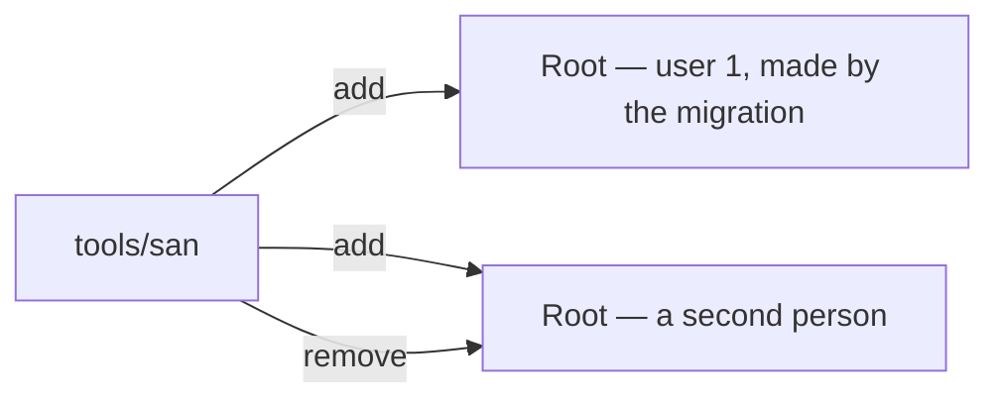

**The spec.** ⚠ **Not built.**

| | |
| --- | --- |
| `tools/san` | a command to add a Root and to remove one |
| suspend | already refuses user 1 only, by id. With several Roots it must refuse by role ([only-root-and-the-administrator-suspend](#only-root-and-the-administrator-suspend)) |
| the last Root | ✅ confirmed (Q20c): removing the last Root is refused, so the system is never left with nobody who can do anything |

## root-grants-the-administrator

> `context.md` §root team 2 *(owner, 2026-10-02)*: *"Granted by: The Root."* It answers half of
> [Q5](./context_clarify.md#question), as recommended.

> 🔄 *(2026-10-05, built)* Enforced on the server: `checkMemberWrite` in `user_v1/member_rules.go`, called by `TeamUserUpdate`
> and `CreateUser` under a lock on the person's `users` row. A role must also be of its team's type.

**The verdict.** Only Root grants the System Administrator (`administrator`). An Administrator does not make another.

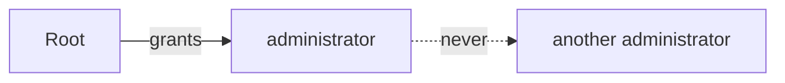

**The spec.** ⚠ **Not built.** Today the root team's Admin can grant `ROLE_ADMIN` too, through `CreateUser` and
`TeamUserUpdate`. Both must refuse `ROLE_ADMIN` unless the caller is Root, and the role picker offers it only to Root.

## staff-accepts-the-restock

> Owner, in chat *(2026-10-02)*: *"for q4, yes"*, confirmed as *"Staff accepts restock"* — the literal question, not my
> recommendation. It answers the restock half of [Q4](./context_clarify.md#question), **against my recommendation**
> (Owner or Admin accepts, Staff counts).

**The verdict.** When a restock arrives, Staff counts it and accepts it in one act: what arrived, what was lost or
broken, and with it the batch's unit price. No Owner or Admin has to confirm it.

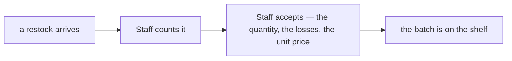

**The spec.** Built, nothing to change: `RestockRequestFulfill` takes the count and the acceptance in one call, open to
`warehouse_staff`. A loss found here is the selling team's
([selling-team-bears-the-receiving-loss](../inventory/context_clarify.md#selling-team-bears-the-receiving-loss)), so no
warehouse debt is created by a Staff member's count.

## owner-root-and-administrator-add-members

> `context.md` §How Managing Team User Member *(owner, 2026-10-02)*: *"How Root/Administrator/Owner add member team"*,
> with a flow. It answers half of [Q5](./context_clarify.md#question), as recommended (the team's Owner).

> 🔄 *(2026-10-02, later)* The selling team's Admin manages members too —
> [the-selling-admin-manages-members](#the-selling-admin-manages-members).

> 🔄 *(2026-10-02, later)* The flow now changes an existing member's role — [an-existing-member-gets-change-role](#an-existing-member-gets-change-role).

**The verdict.** A member is added to a team by **Root**, **the Administrator**, or **that team's Owner**, from the
team's member page: search for the person, create them if they are not in the system, pick their role, submit.

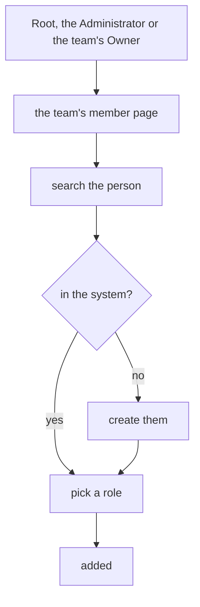

**The spec.** ⚠ **Partly built.**

| | today | after |
| --- | --- | --- |
| the page | the team detail page and the Users page both open an Add Member dialog | the same |
| who | Root, the Administrator, the Owner — **and the team's Admin** | Root, the Administrator, the Owner, and the **warehouse and selling** Admins — [the-admin-team-admin-alone-does-not-manage-members](#the-admin-team-admin-alone-does-not-manage-members) |
| search, pick a role, submit | built | built, in a search popup — [a-member-is-found-in-a-search-popup](#a-member-is-found-in-a-search-popup) |
| *"no → create user"* | ⚠ not in the dialog. Creating is a separate dialog on the Users page | the dialog offers *create* when the search misses |
| the roles offered | the team type's roles, Root included for the root and admin teams | never Root ([root-is-granted-only-through-san](#root-is-granted-only-through-san)), `administrator` only to Root ([root-grants-the-administrator](#root-grants-the-administrator)) |

## the-selling-owner-and-admin-set-markup-reserve-and-lock

> `context.md` §selling team *(owner, 2026-10-02)*: the Owner's and the Admin's *"Responsbility: set markup · reserve ·
> lock · manage member"*. It answers [Q4](./context_clarify.md#question), as recommended.

**The verdict.** The selling team's **Owner** and **Admin** set the cross markup, the reserve and the shared lock.
Customer Service does not: the person taking orders cannot reprice another team's supply.

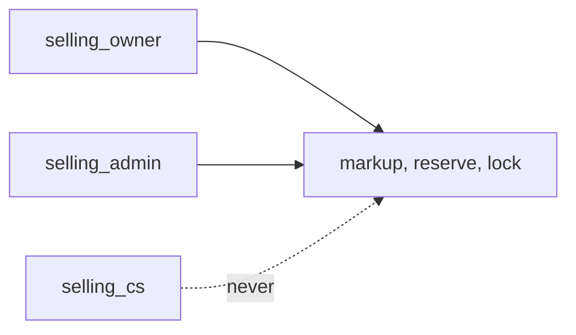

**The spec.** Built for the selling roles: the three are fields of `ProductCreate` and `ProductUpdate`, open to the
selling Owner and Admin and closed to Customer Service. ⚠ The same two calls are also open to the **warehouse** Owner
and Admin, in their own team. Whether a warehouse writes products at all is product's to say.

## an-owner-never-makes-another-owner

> `context.md` §warehouse team, §selling team, §admin team *(owner, 2026-10-02)*: *"Owner can't create another owner"*,
> under each team's Owner. It answers half of [Q5](./context_clarify.md#question), as recommended.

> 🔄 *(2026-10-05)* The first Owner is the person the Create Team form names, not whoever created the team —
> [the-create-team-form-names-the-first-owner](#the-create-team-form-names-the-first-owner).

> 🔄 *(2026-10-05, built)* Enforced on the server: `checkMemberWrite` in `user_v1/member_rules.go`, called by `TeamUserUpdate`
> and `CreateUser` under a lock on the person's `users` row. A role must also be of its team's type.

**The verdict.** No Owner gives the Owner role, in any team. A team's first Owner comes with the team, which the
Administrator creates. A second Owner is made by Root or the Administrator.

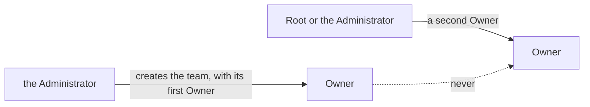

**The spec.** ⚠ **Not built.** Today an Owner can give the Owner role through `TeamUserUpdate`, and create a user who
is an Owner through `CreateUser`. Both must refuse it unless the caller is Root or the Administrator, and the role
picker stops offering it to an Owner.

## the-selling-admin-manages-members

> `context.md` §selling team, The Admin *(owner, 2026-10-02)*: *"Responsbility: … manage member"*. It answers the
> selling half of [Q5](./context_clarify.md#question), **against my recommendation** (only the Owner).

**The verdict.** The selling team's Admin adds and removes members, as its Owner does.

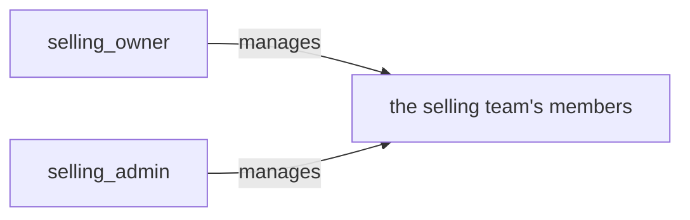

**The spec.** Built: `TeamUserUpdate` is open to the selling Admin. Two limits come from other decisions: it never
gives the Owner role (if an Owner may not, an Admin below it may not either —
[an-owner-never-makes-another-owner](#an-owner-never-makes-another-owner)), and it never gives the Admin role either — [no-admin-makes-another-admin](#no-admin-makes-another-admin).

## superseded-only-the-selling-admin-manages-members

> ⛔ **Superseded (2026-10-02)** by [the-admin-team-admin-alone-does-not-manage-members](#the-admin-team-admin-alone-does-not-manage-members): the owner gave the warehouse Admin *"manage member"*. Kept, not
> deleted, so the record shows what was decided and when.

> Owner, in chat *(2026-10-02)*: *"for q5 no"* — read as no to both halves of [Q5](./context_clarify.md#question),
> since my recommendation was *"yes, and no"*. **Against my recommendation** on this half (the same rule in every team
> type).

**The verdict.** Of the four Admins, only the **selling** team's manages members. The **warehouse** Admin and the
**admin team's** Admin do not: in those teams, members are managed by the Owner, Root and the Administrator.

| team | manages members |
| --- | --- |
| warehouse | Owner · Root · Administrator |
| selling | Owner · **Admin** · Root · Administrator |
| admin | Owner · Root · Administrator |

```mermaid
flowchart LR
  SA["selling_admin"] -->|"manages"| SM["selling members"]
  WA["warehouse_admin"] -.->|"no"| WM["warehouse members"]
  AA["admin_administrator"] -.->|"no"| AM["admin team members"]
```

**The spec.** ⚠ **Not built.** `TeamUserUpdate` and `CreateUser` are open to `ROLE_WAREHOUSE_ADMIN`, which loses
both. The admin team's Admin cannot be told apart from the selling one until it has its own role
([the-role-names-are-the-codes-names](#the-role-names-are-the-codes-names)), so that half lands with the rename.

## no-admin-makes-another-admin

> Owner, in chat *(2026-10-02)*: *"for q5 no"*, the second half of [Q5](./context_clarify.md#question), as recommended.

> 🔄 *(2026-10-05, built)* Enforced on the server: `checkMemberWrite` in `user_v1/member_rules.go`, called by `TeamUserUpdate`
> and `CreateUser` under a lock on the person's `users` row. A role must also be of its team's type.

**The verdict.** No Admin gives the Admin role. With [an-owner-never-makes-another-owner](#an-owner-never-makes-another-owner),
the rule is one sentence: **nobody gives their own role.** In practice: `selling_admin` adds Customer Service and `warehouse_admin` adds Staff, never another Admin
(see [the-admin-team-admin-alone-does-not-manage-members](#the-admin-team-admin-alone-does-not-manage-members)).

```mermaid
flowchart LR
  O["selling_owner"] -->|"may give"| A["selling_admin"]
  A -->|"may give"| C["selling_cs"]
  A -.->|"never"| A2["another selling_admin"]
```

**The spec.** ⚠ **Not built.** `TeamUserUpdate` and `CreateUser` refuse a role equal to the caller's own, and the
role picker stops offering it.

## the-administrator-can-do-anything

> Owner, in chat *(2026-10-02)*: *"for q9 keep do anything"*. It answers [Q9](./context_clarify.md#question),
> **against my recommendation** (narrowed to its listed jobs, "do anything" Root's alone).

**The verdict.** The System Administrator (`administrator`) can do anything in any team, as Root can, **except** what
the doc forbids it by name.

| the Administrator may | except |
| --- | --- |
| everything, in every team | grant Root ([root-is-granted-only-through-san](#root-is-granted-only-through-san)) |
| | grant another Administrator ([root-grants-the-administrator](#root-grants-the-administrator)) |
| | suspend a Root or another Administrator ([only-root-and-the-administrator-suspend](#only-root-and-the-administrator-suspend)) |

```mermaid
flowchart LR
  A["administrator"] --> T["every team, every call"]
  A -.->|"never"| G["grant Root or administrator"]
  A -.->|"never"| S["suspend Root or administrator"]
```

**The spec.** Built: the access check lets `ROLE_ADMIN` in the root team past every team's scope. The three
exceptions are not built — each is listed in its own decision. The dev fixture's `dev` user keeps its reach.
⚠ **Accepted:** Root can make a do-anything account in the app, without `tools/san`.

## the-role-names-are-the-codes-names

> Owner, in chat *(2026-10-02)*: *"for q 10 yes"*. It answers [Q10](./context_clarify.md#question), as recommended.

> 🔄 *(2026-10-02, later)* What the two new admin-team roles may call is decided — [admin-team-roles-manage-only-their-team](#admin-team-roles-manage-only-their-team). The rename itself is
> **not built yet**, on the owner's word: the proto still has the old names.

> 🔄 *(2026-10-05, later)* **The four renames are built**, numbers kept and the old names `reserved`. The two new admin-team
> roles are not yet ([the-admin-team-roles-are-added-first](#the-admin-team-roles-are-added-first)).

> 🔄 *(2026-10-05)* The hold is lifted: the rename comes before the grant checks, with no alias —
> [rename-the-roles-before-the-grant-checks](#rename-the-roles-before-the-grant-checks), [no-alias-for-the-old-role-names](#no-alias-for-the-old-role-names). The policy count is now 444 lines in 19 protos, not 284.

**The verdict.** Each role has one name, from the doc to the proto to the screen.
[every-role-has-a-code-name](#every-role-has-a-code-name)'s ten names become the proto's `ROLE_` names.

```mermaid
flowchart LR
  D["the doc — selling_owner"] --> P["the proto — ROLE_SELLING_OWNER"]
  P --> S["the screen — Owner, in a selling team"]
```

**The spec.** ⚠ **Not built.**

| today | after | number |
| --- | --- | --- |
| `ROLE_TEAM_OWNER` | `ROLE_SELLING_OWNER` | 3, kept |
| `ROLE_TEAM_ADMIN` | `ROLE_SELLING_ADMIN` | 4, kept |
| `ROLE_TEAM_CUSTOMER_SERVICE` | `ROLE_SELLING_CS` | 5, kept |
| `ROLE_ADMIN` | `ROLE_ADMINISTRATOR` | 2, kept |
| — | `ROLE_ADMIN_OWNER` | new |
| — | `ROLE_ADMIN_ADMINISTRATOR` | new |
| `ROLE_ROOT`, the three `ROLE_WAREHOUSE_` | unchanged | — |

- **A rename keeps the number**, and the number is what is stored, so every role already held stays valid.
- **The admin team's members move** from the selling pair onto the two new roles. Which teams are admin teams is
  team_service's fact, so the move asks it for their ids; user_service never joins another service's table.
- **The same change** regenerates both sides, rewrites every policy line naming the old roles (284 across the
  protos), and updates CLAUDE.md's roling section and every doc that names them.

## a-member-is-found-in-a-search-popup

> Owner, in chat *(2026-10-02)*: *"for q11, we provide search popup"*. It answers how the person is found, half of
> [Q11](./context_clarify.md#question).

**The verdict.** The person to add is found in a **search popup**: type, and the matching people are listed to pick
from.

```mermaid
flowchart LR
  T["type in the search popup"] --> L["the matching people"]
  L --> P["pick one"]
  P --> R["pick a role, submit"]
```

**The spec.** Built: the Add Member dialog's search field lists matches as you type. What it matches, and who may open
it, is decided: [only-member-managers-open-the-search](#only-member-managers-open-the-search) and [managers-search-by-exact-username-phone-or-email](#managers-search-by-exact-username-phone-or-email).

## the-admin-team-admin-alone-does-not-manage-members

> `context.md` §warehouse team, The Admin *(owner, 2026-10-02)*: *"Responsbility: manage member"*, added after
> [superseded-only-the-selling-admin-manages-members](#superseded-only-the-selling-admin-manages-members). The admin team's Admin still has no responsibility listed. It supersedes that decision and returns
> half of my Q5 recommendation (the same rule in every team type) — except for the admin team.

**The verdict.** Members are managed by each team's Owner, by the **warehouse** Admin and the **selling** Admin, and
by Root and the Administrator. The **admin team's** Admin does not manage members.

| team | manages members |
| --- | --- |
| warehouse | Owner · **Admin** · Root · Administrator |
| selling | Owner · **Admin** · Root · Administrator |
| admin | Owner · Root · Administrator |

```mermaid
flowchart LR
  WA["warehouse_admin"] -->|"manages"| WM["warehouse members"]
  SA["selling_admin"] -->|"manages"| SM["selling members"]
  AA["admin_administrator"] -.->|"no"| AM["admin team members"]
```

**The spec.** Built for the warehouse and selling Admins: `TeamUserUpdate` and `CreateUser` are open to both. ⚠ The
admin team's Admin cannot be told apart from the selling one until it has its own role
([the-role-names-are-the-codes-names](#the-role-names-are-the-codes-names)); then it is left out of both calls. Neither
Admin gives the Admin role ([no-admin-makes-another-admin](#no-admin-makes-another-admin)).

## an-existing-member-gets-change-role

> `context.md` §How Root/Administrator/Owner add member team *(owner, 2026-10-02)*: *"Is Already Have Role ? → no →
> Select Role · yes → Change Role → Submit"*. It answers half of [Q11d](./context_clarify.md#question), **against my
> recommendation** (shown as already a member and not added, with changing a role as its own action).

**The verdict.** The add flow handles both cases. A person who is not yet in the team gets **Select Role**. A person
who already holds a role in it gets **Change Role**, in the same flow, and the submit changes their role.

```mermaid
flowchart TD
  S["search the person"] --> E{"in the system?"}
  E -->|"no"| C["create them"]
  C --> SR["Select Role"]
  E -->|"yes"| H{"already has a role in this team?"}
  H -->|"no"| SR
  H -->|"yes"| CR["Change Role — their current role is shown"]
  SR --> SUB["submit"]
  CR --> SUB
```

> 🔄 *(2026-10-06, built)* `SearchUser` answers `roles_in_team` for the team being added to, so the popup shows an existing
> member's role and the step reads *Change Role*. The server checks the rank against that role and logs it as a change.

**The spec.** ⚠ **Half built.** The server already does it: an add for someone already in the team overwrites their role.
What is missing is that it happens **silently**.

| | today | after |
| --- | --- | --- |
| the popup, for an existing member | looks like a plain add | shows their current role, and the step reads *Change Role* |
| the submit | overwrites the role | the same, with the screen having said so |
| whose role it may change | anyone's, to anything | only a role below the caller's — [change-role-only-below-your-own](#change-role-only-below-your-own) |

## only-member-managers-open-the-search

> Owner, in chat *(2026-10-02)*: *"for q11 i follow your recomendation"*. It answers [Q11a](./context_clarify.md#question), as recommended.

**The verdict.** Only those who manage members open the search popup: the team's Owner, the warehouse and selling
Admins, Root and the Administrator. Staff and Customer Service do not.

```mermaid
flowchart LR
  M["Owner, warehouse or selling Admin, Root, Administrator"] -->|"opens"| P["the search popup"]
  F["Staff, Customer Service"] -.->|"never"| P
```

> 🔄 *(2026-10-06, built)* `SearchUser`'s `team_id` is its scope (`use_scope`), and its policy names Root, the
> Administrator, the selling and warehouse Owners and Admins, and the admin team's Owner. At team 0 — the root team — only
> Root and the Administrator pass: Create Team's Owner picker. Staff and Customer Service filter their lists through the
> lists' own services ([a-who-filter-lists-the-people-on-its-rows](#a-who-filter-lists-the-people-on-its-rows)).

**The spec.** ⚠ **Not built.** `SearchUser` is open to anyone signed in, and unscoped. A role list on an unscoped
message is checked against the root team, so team roles there would never match. It gains the **team being added to**
as its scope, and its policy names the Owners and the warehouse and selling Admins.

## managers-search-by-exact-username-phone-or-email

> Owner, in chat *(2026-10-02)*: *"for q11 i follow your recomendation"*. It answers [Q11b](./context_clarify.md#question), as recommended.

**The verdict.** An Owner or Admin finds a person by typing their **exact** username, phone or email, so they find
someone they already know and never browse other teams' people. Root and the Administrator keep the broad search.

| who | what the search matches |
| --- | --- |
| an Owner, a warehouse or selling Admin | the whole username, phone or email, exactly |
| Root, the Administrator | any part of a name or username, as today |

```mermaid
flowchart LR
  O["an Owner types ani01"] --> X["exactly one person, or none"]
  R["Root types ani"] --> B["every Ani, up to 20"]
```

> 🔄 *(2026-10-06, built)* An Owner or an Admin matches the whole username or email (case-blind) or the phone, compared
> by `user_phone_key` (migration `00007`: the digits, a leading 0 read as 62) through a partial expression index. Root and
> the Administrator keep the substring match. 2 queries, ~1 ms at 10 000 accounts; the broad search reads every account
> on a miss, 4.5 ms ([audit](../../../audits/services/user_service/performances/SearchUser.md)). Stored numbers are not
> rewritten — that is [Q31](./context_clarify.md#question).

**The spec.** ⚠ **Not built.** Today every caller gets the partial match. Suspended accounts are left out for everyone
([a-suspended-user-is-never-picked](#a-suspended-user-is-never-picked)). ✅ Confirmed (Q20d): a phone matches however
it is written, so `0812…` and `+62812…` are the same number.

## a-result-shows-the-phones-last-four-digits

> Owner, in chat *(2026-10-02)*: *"for q11 i follow your recomendation"*. It answers [Q11c](./context_clarify.md#question), as recommended.

**The verdict.** A search result shows the person's name, username and photo, and the **last four digits** of their
phone, so two people with one name are told apart without showing anyone's number.

```mermaid
flowchart LR
  A1["Ani Lestari · ani01 · phone ending 7890"]
  A2["Ani Rahma · anir · phone ending 1234"]
```

> 🔄 *(2026-10-06, built)* `PublicUser.phone_last4`, filled by `SearchUser` only — `UserByIDs` sends none. Empty when the
> number has four digits or fewer, since then the last four are all of it.

**The spec.** ⚠ **Not built.** The result type carries id, username, name and photo. It gains the last four digits,
computed on the server. The full number never leaves it.

## change-role-only-below-your-own

> Owner, in chat *(2026-10-02)*: *"for q11 i follow your recomendation"*. It answers [Q11d](./context_clarify.md#question), as recommended, and bounds
[an-existing-member-gets-change-role](#an-existing-member-gets-change-role).

> 🔄 *(2026-10-05)* The Admin's row below grants nothing: each team has one role under Admin, so an Admin adds and removes
> it and changes nobody's role — [an-admin-changes-nobodys-role](#an-admin-changes-nobodys-role).

> 🔄 *(2026-10-05, built)* Enforced on the server: `checkMemberWrite` in `user_v1/member_rules.go`, called by `TeamUserUpdate`
> and `CreateUser` under a lock on the person's `users` row. A role must also be of its team's type.

**The verdict.** *Change Role* may change only a role **below your own**, and only to a role **below your own**. Nobody
changes their own role. Root and the Administrator change anyone's, inside their own limits.

| in a team | may change | to |
| --- | --- | --- |
| the Owner | an Admin, Staff, Customer Service | Admin, Staff, Customer Service |
| an Admin | Staff, Customer Service | Staff, Customer Service |
| Root, the Administrator | anyone | any team role. Never Root, and `administrator` only by Root |

```mermaid
flowchart LR
  O["Owner"] -->|"may change"| A["Admin"]
  O -->|"may change"| F["Staff or Customer Service"]
  A -->|"may change"| F
  A -.->|"never"| O
  O -.->|"never their own"| O
```

So an Admin never demotes the Owner, and the last Owner cannot demote themselves and leave the team with none.

**The spec.** ⚠ **Not built.** `TeamUserUpdate` checks no role today. It compares the caller's role in the team with
the target's current role and the new one, and refuses anything not below the caller's. The role picker offers only
what the caller may give.

## a-phone-or-email-belongs-to-one-account

> Owner, in chat *(2026-10-02)*: *"for q11 i follow your recomendation"*. It answers [Q11e](./context_clarify.md#question), as recommended.

> 🔄 *(2026-10-02, later)* Confirmed against shared numbers — [one-account-per-phone-stays-a-refusal](#one-account-per-phone-stays-a-refusal).

**The verdict.** A phone number or an email belongs to **one** account. Creating a user, or editing one, refuses a
phone or email already in use, and offers to add that person instead.

```mermaid
flowchart LR
  C["create Ani, phone 0812-3456-7890"] --> Q{"is the phone already someone's?"}
  Q -->|"yes"| A["refused — add that person instead"]
  Q -->|"no"| OK["created"]
```

**The spec.** ⚠ **Not built.** Username is unique, and email is unique when given. Phone is not: it needs a unique index
(when given), which a migration can add only once any duplicates already stored are resolved. `CreateUser` and
`UpdateUser` both refuse a taken phone or email.

## a-shop-grant-picks-from-the-teams-members

> Owner, in chat *(2026-10-02)*: *"for q11 i follow your recomendation"*. It answers [Q11f](./context_clarify.md#question), as recommended.

**The verdict.** Granting a shop picks the person from **the team's members**, never from every user in the system.

```mermaid
flowchart LR
  G["grant a shop"] --> M["the team's members"]
  G -.->|"never"| E["every user in the system"]
```

**The spec.** ⚠ **Not built.** The shop page's picker is used without a team, so it searches everyone. Given the team,
the same picker lists its members. Whether the server refuses a grant to a non-member is the shop context's to check.

## admin-team-roles-manage-only-their-team

> Owner, in chat *(2026-10-02)*, choosing *"Team management only"* when asked which calls `admin_owner` and
> `admin_administrator` get once the admin team has its own roles. As recommended.

> 🔄 *(2026-10-02, later)* Widened for **reading**: the admin team also reads every warehouse and selling team —
> [the-admin-team-monitors-all-and-manages-its-own](#the-admin-team-monitors-all-and-manages-its-own). Its writes stay inside itself.

> 🔄 *(2026-10-05, built)* `ROLE_ADMIN_OWNER` holds `TeamInfoUpdate`, `TeamUpdate`, `UserList`, `TeamMemberLogList`, `CreateUser`
> and `TeamUserUpdate`; `ROLE_ADMIN_ADMINISTRATOR` the first four — it reads its members and manages none, as the accepted
> prototype shows. A test walks every request policy and fails if either role appears anywhere else.

> 🔄 *(2026-10-06, built)* `ROLE_ADMIN_OWNER` also holds `SearchUser`, the Add Member popup's search, now that it is
> limited to the people who manage members ([only-member-managers-open-the-search](#only-member-managers-open-the-search)).
> Seven calls; the Admin's four are unchanged.

**The verdict.** The admin team's roles manage **their own team** and nothing else. They get none of the selling calls
(orders, products, shops) that they reach today by borrowing the selling roles, because the admin team does not sell.

| role | may |
| --- | --- |
| `admin_owner` | edit its team, and manage its members ([the-admin-team-admin-alone-does-not-manage-members](#the-admin-team-admin-alone-does-not-manage-members)) |
| `admin_administrator` | edit its team |

```mermaid
flowchart LR
  AO["admin_owner"] --> T["its team's info"]
  AO --> M["its team's members"]
  AA["admin_administrator"] --> T
  AO -.->|"never"| S["orders, products, shops"]
  AA -.->|"never"| S
```

**The spec.** ⚠ **Not built — it lands with the rename** ([the-role-names-are-the-codes-names](#the-role-names-are-the-codes-names)).

| | |
| --- | --- |
| policies | `ROLE_ADMIN_OWNER` joins the team-info and member policies; `ROLE_ADMIN_ADMINISTRATOR` joins the team-info one. Neither joins any selling policy |
| data | no admin-type team exists in the dev database, so no member has to move there |
| ⚠ dev data, untouched | four root-team memberships hold role 4 (today's `ROLE_TEAM_ADMIN`, after the rename `selling_admin`), which the root team does not have: three leftover test accounts and one person. They are the owner's data, so the build only stops new ones — a role must belong to its team's type |
| the business's own reach | `business_level.md` §Admin gives the admin team *"manage all resource"* of other teams. This decision is about its own team; that reach is still not built and not asked |

## the-admin-team-monitors-all-and-manages-its-own

> Owner, in chat *(2026-10-02)*: *"for q12, q13, q14, q15, 1q6 i follow your recomendation"*. It answers [Q12](./context_clarify.md#question), as recommended, and resolves
[the-admin-team-manages-nothing-but-itself](./context_clarify.md#the-admin-team-manages-nothing-but-itself).

> 🔄 *(2026-10-06)* Its screen is decided — [the-admin-team-monitors-read-only](#the-admin-team-monitors-read-only), built as its own pass.

**The verdict.** **Monitor all, manage own.** The admin team **reads** every warehouse and selling team, which is
`business_level.md`'s *"monitoring … all resource"*. It **writes** only inside itself
([admin-team-roles-manage-only-their-team](#admin-team-roles-manage-only-their-team)).

```mermaid
flowchart LR
  A["admin_owner, admin_administrator"] -->|"read"| W["every warehouse team"]
  A -->|"read"| S["every selling team"]
  A -->|"read and write"| T["the admin team itself"]
  A -.->|"never write"| W
  A -.->|"never write"| S
```

**The spec.** ⚠ **Not built.** Today an admin-type team reaches nothing outside itself.

| | |
| --- | --- |
| which calls are reads | a request message says so in the proto, the same way it declares its roles. A read is never inferred from the RPC's name |
| the access check | lets a member of an admin-type team past the scope of a warehouse or selling team **for a read only**. It needs the team's type, which user_service already resolves from team_service |
| who | the admin team's two roles, once they exist ([the-role-names-are-the-codes-names](#the-role-names-are-the-codes-names)) |
| a write | refused outside the admin team, as now |

## every-role-change-is-logged

> Owner, in chat *(2026-10-02)*: *"for q12, q13, q14, q15, 1q6 i follow your recomendation"*. It answers [Q13](./context_clarify.md#question), as recommended.

**The verdict.** Every change to a team's membership is written down: an add, a role change, a removal. The team's
member page shows the history.

| when | who did it | whom | team | role before | role after |
| --- | --- | --- | --- | --- | --- |
| 2026-10-02 14:05 | ani01 | budi | Selling Team 2 | Customer Service | Admin |

```mermaid
flowchart LR
  A["add"] --> LOG["the membership log"]
  C["Change Role"] --> LOG
  R["remove"] --> LOG
  LOG --> P["the team's member page"]
```

> 🔄 *(2026-10-06, built)* `team_member_logs` (user_service migration `00005`), written by `TeamUserUpdate` and
> `CreateUser` in the transaction of the change; `TeamMemberLogList` reads it, newest first, optionally one person's.
> A repeated grant of the role a person already holds is not a change and writes nothing. Each row carries the override
> flag ([an-override-is-stamped-in-every-service](#an-override-is-stamped-in-every-service)). **Not built:** the
> `tools/san` row — there is no `san` command that adds or removes a Root yet
> ([root-can-be-several](#root-can-be-several)); when there is, it writes one with the developer as the agent.

**The spec.** ✅ **Built** (2026-10-06), but for the `tools/san` row. It was: a membership is one row that a change
overwrites and a removal deletes.

| | |
| --- | --- |
| the log | a new table in user_service, written in the **same transaction** as the change, so a change cannot happen without its row |
| a row | who, whom, team, action (add, change, remove), role before, role after, when. Never updated, never deleted |
| `tools/san` | adding or removing a Root writes a row too, with the developer as *who* |
| the docs | [docs/database-schema.md](../../database-schema.md) gains the table in the same commit |

## an-override-is-stamped-in-every-service

> Owner, in chat *(2026-10-02)*: *"for q12, q13, q14, q15, 1q6 i follow your recomendation"*. It answers [Q14](./context_clarify.md#question), as recommended.

**The verdict.** When Root or the Administrator writes inside a team they are not a member of, the record says so, in
every service. A team can see what the platform did inside it.

```mermaid
flowchart LR
  R["Root or the Administrator"] -->|"writes in Warehouse 1, not a member"| W["the record"]
  W --> M["marked: override"]
  T["Warehouse 1's own Admin"] -->|"writes"| W2["the record"]
  W2 --> N["not marked"]
```

> 🔄 *(2026-10-06)* The membership log stamps it too: Root or the Administrator adding, changing or removing a member of
> a team they hold no role in.

**The spec.** ⚠ **Not built, except in liability's terms log and user_service's membership log.** The access check already tells a handler that the
caller got in this way. Each service's write that records who acted also records that it was an override. One rule for
every service, so it cannot exist in one and be forgotten in the next. Counts and losses:
[inventory Q12d](../inventory/context_clarify.md#question).

## the-two-administrators-have-distinct-labels

> Owner, in chat *(2026-10-02)*: *"for q12, q13, q14, q15, 1q6 i follow your recomendation"*. It answers [Q15](./context_clarify.md#question), as recommended.

> 🔄 *(2026-10-05, built)* *System Administrator*, *Admin Team Admin*, and *Admin Team Owner* beside them, in `ROLE_LABEL`
> (`frontend/src/lib/roles.ts`).

**The verdict.** The two roles one word apart are never shown with the same word.

| role | shown as |
| --- | --- |
| `administrator` | *System Administrator* |
| `admin_administrator` | *Admin Team Admin* |

```mermaid
flowchart LR
  A["administrator"] --> L1["System Administrator — every team"]
  B["admin_administrator"] --> L2["Admin Team Admin — its own team"]
```

**The spec.** ⚠ **Not built.** The role labels live in the two language catalogues and are read by the role picker and
every badge. The bare word *Administrator* is used for neither.

## one-account-per-phone-stays-a-refusal

> Owner, in chat *(2026-10-02)*: *"for q12, q13, q14, q15, 1q6 i follow your recomendation"*. It answers [Q16](./context_clarify.md#question), as recommended.

**The verdict.** One account per phone stays a **refusal**, not a warning. A person who shares a number, or has none,
is created with the phone left empty.

```mermaid
flowchart LR
  P["a phone already in use"] --> X["refused — add that person instead"]
  E["no phone of their own"] --> OK["created with the phone empty"]
```

**The spec.** As in [a-phone-or-email-belongs-to-one-account](#a-phone-or-email-belongs-to-one-account): unique when
given, so any number of accounts may have none.

## removing-a-member-drops-their-shop-access

> Owner, in chat *(2026-10-02)*: *"for q17, q19 i follow your recomendation, for q18 settlement is customer service too"*. It answers [Q17](./context_clarify.md#question), as recommended.

**The verdict.** A member is removed by the same people who add one — the Owner, the warehouse and selling Admins, Root,
the Administrator — and only when the person's role is **below their own**. Nobody removes themselves. The person
leaves **that team only**: their account, their other teams, and their name on every record stay.

```mermaid
flowchart TD
  W["the Owner, a warehouse or selling Admin, Root, the Administrator"] --> R{"is the person's role below yours?"}
  R -->|"no, or it is you"| X["refused"]
  R -->|"yes"| D["removed from this team only"]
  D --> LOG["a row in the membership log"]
  D --> EV["the shop side is told"]
  EV --> G["their shop grants in this team are dropped, a primary CS flag is cleared"]
```

**The spec.** ⚠ **Not built.** Today a removal deletes one row, checks no role, and tells no other service.

| | |
| --- | --- |
| who | the remove action of `TeamUserUpdate` checks the caller's role against the person's, as Change Role does ([change-role-only-below-your-own](#change-role-only-below-your-own)) |
| the log | a row in the membership log, in the same transaction ([every-role-change-is-logged](#every-role-change-is-logged)) |
| the shop side | a *member removed* event names the team and the person. The shop side drops their grants in that team and clears a primary CS flag. Like every event, it needs its topic made by `san pubsub ensure` |

## customer-service-runs-orders-restock-requests-and-settlements

> Owner, in chat *(2026-10-02)*: *"for q17, q19 i follow your recomendation, for q18 settlement is customer service too"*. It answers [Q18](./context_clarify.md#question) — **as recommended, except settlements**: I would have kept posting
and importing a settlement for the selling Owner and Admin.

**The verdict.** Customer Service's job is what the build already lets it do: record, cancel and look up orders, work
the marketplace drafts, pick and return stock for its orders, create and cancel restock requests, read products,
suppliers and shops — **and settlements: posting one, and importing a marketplace's settlement file**.

```mermaid
flowchart LR
  CS["selling_cs"] --> O["orders and drafts"]
  CS --> R["restock requests"]
  CS --> S["settlements — post, import"]
  CS --> V["read products, suppliers, shops"]
  CS -.->|"never"| M["markup, reserve, lock — the Owner and Admin"]
```

**The spec.** Built — nothing to change: `selling_cs` is in all 62 of those calls today, the settlement post and both
imports included. ⚠ Your doc's Customer Service line still lists nothing; this decision is the written list until it does.

## the-warehouse-admin-equals-the-owner-except-money

> Owner, in chat *(2026-10-02)*: *"for q17, q19 i follow your recomendation, for q18 settlement is customer service too"*. It answers [Q19](./context_clarify.md#question), as recommended.

**The verdict.** The warehouse Admin does everything the warehouse Owner does, **except three money acts**, which stay
the Owner's.

| the Owner only | why |
| --- | --- |
| set or delete the liability terms | they are what a selling team pays this warehouse |
| transfer money between financial accounts | money leaves one account for another |
| add capital to a financial account | money comes in from the owner |

```mermaid
flowchart LR
  O["warehouse_owner"] --> D["the daily work — 81 calls"]
  A["warehouse_admin"] --> D
  O --> M["liability terms, transfer, capital"]
  A -.->|"never"| M
```

**The spec.** ⚠ **Not built.** `LiabilityTermsSet`, `LiabilityTermsDelete`, `FinancialAccountTransfer` and
`FinancialAccountCapital` lose `ROLE_WAREHOUSE_ADMIN`. Recording, confirming and rejecting a payment, and reconciling,
stay open to the Admin. The **selling** Admin is not covered by this decision: those calls are open to it today, and
nothing here changes that.

## the-history-is-a-tab-beside-the-members

> Owner, in chat *(2026-10-02)*: *"make member and membership history as tab"*. Feedback on the prototype, before
> [Q23](./context_clarify.md#question).

**The verdict.** The Users page shows a team's members and its membership history on **two tabs**, not one under the
other. Root and the System Administrator keep their third tab, everyone across every team.

```mermaid
flowchart LR
  U["Users page"] --> M["My Team User — the members"]
  U --> H["Membership History — who added, changed, removed whom"]
  U -.->|"Root and the System Administrator only"| A["All User"]
```

**The spec.** Built in the prototype. The history tab sits beside the members because it is the same team's. It loads
only when opened. Add Member shows on both team tabs, not on All User. The history's ⚠ mark moves to its tab.

## superseded-short-code-is-a-unique-alias

> ⛔ **Superseded the same day** by [a-user-has-no-short-code](#a-user-has-no-short-code). Kept as the record.

> Owner, in chat *(2026-10-05)*: *"for q24, its just for unique alias"*. Answers the first half of
> [Q24](./context_clarify.md#question). It goes against my reading, which was a *who did this* mark for slips and labels.

**The verdict.** `short_code` (§General Data In Users) is a person's **alias**: a short name that is **unique**. It has
no other job. It is not a mark on paper, so the rules I derived from paper do not apply: it may change, and 0 and 1 are
allowed.

```mermaid
flowchart LR
  U["Ani Rahma"] --> C["short_code ANIR — unique"]
  C --> T1["Selling Team 1"]
  C --> T2["Warehouse Team 1"]
  X["another user"] -.->|"ANIR — refused, taken"| C
```

**The spec.** ⚠ **Not built**: no column exists. It sits on the user, not on a membership, so it is unique across the
whole system and the same in every team. Four rules are still open in [Q24](./context_clarify.md#question): whether it
replaces the per-team `alias`, whether it is required, its format and who changes it, and whether the Add Member popup
searches by it.

## a-user-has-no-short-code

> Owner, in chat *(2026-10-05)*: *"i cancel it"*, and `short_code` removed from §General Data In Users. Supersedes
> [superseded-short-code-is-a-unique-alias](#superseded-short-code-is-a-unique-alias) and closes
> [Q24](./context_clarify.md#question).

> 🔄 *(2026-10-05, later)* Still no short_code, but the record is wider than the three fields below: phone and photo are
> in it, and the per-team `alias` goes — [a-user-is-name-username-email-phone-and-photo](#a-user-is-name-username-email-phone-and-photo).

**The verdict.** A user has **no short_code**. §General Data In Users is name, username and email. The username is
the one unique handle a person has.

```mermaid
flowchart LR
  U["a user"] --> N["name"]
  U --> H["username — the one unique handle"]
  U --> E["email"]
  U -.->|"cancelled"| S["short_code"]
```

**The spec.** Nothing to build or remove: no short_code column ever existed. Whether the phone, the photo and the
build's unused per-team `alias` belong to the record is [Q25](./context_clarify.md#question).

## a-who-filter-lists-the-people-on-its-rows

> Owner, in chat *(2026-10-05)*: *"yes for 3 question i follow your recomendation"*, confirmed as all four open
> questions. It answers [Q21a](./context_clarify.md#question), as recommended.

**The verdict.** A "who" filter (*created by*, *accepted by*) offers **the people who appear on the rows that list can
show**, and the list's own service answers it. It never borrows a member list or the system-wide user search.

```mermaid
flowchart LR
  F["a who filter"] --> L["the list's own service — the people on its rows"]
  L --> N["UserByIDs — their names"]
  F -.->|"never"| UL["UserList — a team's members"]
  F -.->|"never"| SU["SearchUser — every user"]
```

> 🔄 *(2026-10-06, built)* `RestockActorList` (inventory_service, `role` = raised or accepted) and `OrderCreatorList`
> (selling_service): the distinct user ids on the rows the team may list, the latest first, paged (the picker asks for
> 200). The orders list gained the filter itself — `OrderListFilter.created_by_user_id`, mirrored on the stat — and
> `Order.created_by_user_id` on each row, so the creator name on the orders list and the pick queue is real now. The pages
> use `PersonFilterSelect`, which loads the set whole and filters as you type; no picker calls `UserList` or `SearchUser`
> for this any more. 2 queries each, 5–11 ms over a team's 10 000–17 000 rows.

**The spec.** ⚠ **Not built.** Three pages, each filter asking a manager tool today:

| page | filter | answered by |
| --- | --- | --- |
| restock, selling side | created by · accepted by | inventory_service, over the restock requests this team may see |
| restock, warehouse side | created by · accepted by | inventory_service, over the restock requests this warehouse may see |
| orders, selling side | created by | selling_service, over the orders this team may see |

- Each service returns the **distinct user ids** in that role on rows the caller may read, and the picker resolves the
  names with `UserByIDs`. Nothing new is exposed: every name is already printed on a row the caller can see.
- **Across teams**, a selling team's *accepted by* lists the warehouse people who accepted its own restocks, without
  reading the warehouse's member list.
- The picker loads the set whole and filters as you type. It grows only with staff turnover.
- After this, `SearchUser` serves the Add Member popup alone, and `UserList` by team serves the member page and the shop
  grant.

## whoever-reads-a-list-may-filter-it

> Owner, in chat *(2026-10-05)*. It answers [Q21b](./context_clarify.md#question), as recommended.

**The verdict.** Whoever may read a list may use its "who" filter. Customer Service and Staff run these lists
([customer-service-runs-orders-restock-requests-and-settlements](#customer-service-runs-orders-restock-requests-and-settlements),
[staff-accepts-the-restock](#staff-accepts-the-restock)), so they filter them too.

```mermaid
flowchart LR
  CS["Customer Service"] --> R["may read the list"]
  ST["Staff"] --> R
  OW["Owner, Admin"] --> R
  R --> F["may use its who filter"]
```

> 🔄 *(2026-10-06, built)* Each who-list RPC carries its list's roles exactly: Customer Service and Staff included.

**The spec.** ⚠ **Not built.** The filter's RPC carries **the list's own policy**, not a member-management one. Today
Customer Service and Staff are refused on four of the six filters, and a selling Owner on *accepted by* once a warehouse
is picked. All of that goes with [a-who-filter-lists-the-people-on-its-rows](#a-who-filter-lists-the-people-on-its-rows).

## a-filter-keeps-former-and-suspended-people

> Owner, in chat *(2026-10-05)*. It answers [Q21c](./context_clarify.md#question), as recommended, and bounds
> [a-suspended-user-is-never-picked](#a-suspended-user-is-never-picked).

**The verdict.** A "who" filter looks **back**, so it keeps everyone who appears on a row, including a person who has
left the team and a suspended account, shown with a badge. *Never picked* covers pickers that **give** something (add to
a team, grant a shop), not a filter.

| picker | gives something? | a suspended or former person |
| --- | --- | --- |
| Add Member popup | yes, a membership | never offered |
| shop grant | yes, a shop | never offered |
| a who filter | no, it reads | offered, with a badge |

```mermaid
flowchart LR
  S["a suspended or former person"] -.->|"never offered"| G["pickers that give — add a member, grant a shop"]
  S -->|"offered, with a badge"| F["a who filter — last year's restocks are still theirs"]
```

> 🔄 *(2026-10-06, built)* `PublicUser.is_suspended` (from `UserByIDs`), badged by `PersonFilterSelect`; a former user reads
> as *Former user #57*.

**The spec.** ⚠ **Not built.** The filter's answer carries each person's suspended state, and the picker badges it.
Former members need nothing extra: they are on the rows, so they are in the set.

## an-admin-changes-nobodys-role

> Owner, in chat *(2026-10-05)*. It answers [Q22](./context_clarify.md#question), as recommended, and reads
> [change-role-only-below-your-own](#change-role-only-below-your-own) for the Admin.

**The verdict.** An Admin **adds and removes** the floor role, and **changes nobody's role**. Each team has one role
below Admin, so there is never another role to change to. The rule is unchanged; this is what it means for an Admin.

| team | below the Admin | an Admin may |
| --- | --- | --- |
| warehouse | Staff | add Staff, remove Staff |
| selling | Customer Service | add Customer Service, remove Customer Service |

```mermaid
flowchart LR
  A["an Admin"] -->|"adds, removes"| F["Staff or Customer Service"]
  A -.->|"no other role below to change to"| C["Change Role"]
```

**The spec.** Built in the prototype: Change Role is hidden when nothing is left to pick, and the popup says so
(`add-member-nothing-to-change`). ⚠ **The server is not built**: `TeamUserUpdate` refuses an Admin's role change through
[change-role-only-below-your-own](#change-role-only-below-your-own), with no special case.

## the-user-prototype-is-accepted

> Owner, in chat *(2026-10-05)*. It answers [Q23a](./context_clarify.md#question), as recommended. **design_accept
> passed.**

**The verdict.** The user prototype is the design to build: the screens, and the contract additions that came with
them. The next pass is backend analysis.

```mermaid
flowchart LR
  P["the prototype — Storybook"] -->|"accepted 2026-10-05"| B["backend analysis"]
  B --> I["implementation — the decided-not-built list"]
```

**The spec.** The prototype as built on 2026-10-02, with the changes the decisions below make:

| part | what is accepted |
| --- | --- |
| Users page | three tabs: My Team User · Membership History · All User (Root and the Administrator only). A role column, a rank-gated ⋯ menu, Change Role, Erase, no Delete |
| Add Member popup | search → Select Role / Change Role / Create and Add, the only way an account is made ([an-account-is-made-only-from-the-member-search](#an-account-is-made-only-from-the-member-search)) |
| contract (additive) | `UserList` MEMBERSHIP slice · `SearchUser.team_id` + `roles_in_team` · `PublicUser.phone_last4` · `UpdateUser.username` · `UserErase` · `TeamMemberLogList` · `DeleteUser` deprecated |
| choices accepted with it | Suspend and Erase in both tabs, since they act on the account · the team detail page's member list unchanged, its Add Member opens the popup · the role rename still unbuilt, by the owner's *"not yet"* |

## a-root-team-form-starts-with-no-role

> Owner, in chat *(2026-10-05)*. It answers [Q23b](./context_clarify.md#question), as recommended.

**The verdict.** In the **root team**, a form that gives a role starts with **no role selected**. The only role on offer
there is the System Administrator, and that is never a default. In every other team a form starts on the lowest role.

```mermaid
flowchart LR
  R["the root team"] --> N["no role preselected — the Administrator is chosen on purpose"]
  O["any other team"] --> L["the lowest role — Staff or Customer Service"]
```

**The spec.** Built in the prototype: `defaultGrant` in `frontend/src/lib/roles.ts`.

## an-account-is-made-only-from-the-member-search

> Owner, in chat *(2026-10-05)*. It answers [Q23c](./context_clarify.md#question), as recommended.

**The verdict.** There is **one way to make an account**: search for the person in the Add Member popup, and create
them only when the search finds nobody. The **New User** button is removed, so nobody makes a second account for
someone already here.

```mermaid
flowchart LR
  S["Add Member — search"] -->|"found"| A["Select Role or Change Role"]
  S -->|"nobody"| C["Create User, then Add"]
  N["New User button"] -.->|"removed"| C
```

**The spec.** Done in the prototype on 2026-10-05: `CreateUserDialog` and its button are gone from the Users page. The
All User tab has no create; Root and the Administrator add a person from the team they are adding them to. `CreateUser`
stays, because the popup's Create calls it.

## a-user-is-name-username-email-phone-and-photo

> Owner, in chat *(2026-10-05)*. It answers [Q25](./context_clarify.md#question), as recommended, and extends
> [a-user-has-no-short-code](#a-user-has-no-short-code).

**The verdict.** A user is **name, username, email, phone and photo**. That is the whole record. The per-team `alias`,
which no screen fills, is **removed**.

| field | unique | what needs it |
| --- | --- | --- |
| name | no | every screen |
| username | system-wide | login, search |
| email | when given | search |
| phone | when given | the forgot-password OTP, search, the last four digits, one account per person |
| photo | — | avatars |

```mermaid
flowchart LR
  U["a user"] --> N["name"]
  U --> H["username"]
  U --> E["email"]
  U --> P["phone"]
  U --> F["photo"]
  M["a membership — team, user, role"] -.->|"removed"| A["alias"]
```

**The spec.** ⚠ **Not built.** Every user field already exists. Removing `alias` touches the membership row
(`UserTeamRole.Alias`, so a user_service migration and `docs/database-schema.md`) and four proto fields:
`UserMembership.alias`, `CreateUserRequest.alias`, `TeamAccessItem.alias` and `AddTeamUser.alias`. Each is `reserved`,
never renumbered.

## only-name-and-username-are-required

> Owner, in chat *(2026-10-05)*. It answers [Q25](./context_clarify.md#question), as recommended.

**The verdict.** **Name and username are required.** Email and phone are optional, and unique when given
([a-phone-or-email-belongs-to-one-account](#a-phone-or-email-belongs-to-one-account)). A packer has a WhatsApp number
and rarely an email they check, so a required email gets invented, and the second person given the same made-up
address is refused.

```mermaid
flowchart LR
  R["required"] --> N["name"]
  R --> H["username"]
  O["optional, unique when given"] --> E["email"]
  O --> P["phone"]
```

**The spec.** The prototype's create form marks the name required and refuses a blank one. ⚠ **The server is not
built**: `CreateUserRequest.name` has a maximum length and no minimum, so it accepts a blank name, and `UpdateUser` may
blank one. Both gain a minimum length of one.

## the-admin-team-roles-are-added-first

> Owner, in chat *(2026-10-05)*: *"yes"*, confirmed as Q26 and Q27. It answers [Q26a](./context_clarify.md#question),
> as recommended.

> 🔄 *(2026-10-05, built)* The enum (`ROLE_ADMIN_OWNER = 11`, `ROLE_ADMIN_ADMINISTRATOR = 12`), the six policies, the labels
> and the Owner grant are built. Not built: the admin team's reads, which have no screen yet ([Q28](./context_clarify.md#question)),
> and moving existing members, since no admin-type team exists.

**The verdict.** `admin_owner` and `admin_administrator` are added **first**, before any other user build step. They
only add, so they clash with no branch, and three decisions wait on them.

```mermaid
flowchart LR
  A["add admin_owner, admin_administrator"] --> R["the admin team reads every team"]
  A --> L["the label Admin Team Admin"]
  A --> M["the admin team's Admin kept out of member management"]
  A --> F["an admin-type team's Owner is admin_owner, not the selling Owner"]
```

**The spec.** ⚠ **Not built.**

| | |
| --- | --- |
| the enum | `ROLE_ADMIN_OWNER` and `ROLE_ADMIN_ADMINISTRATOR`, the next free numbers (7 is reserved, 10 is `ROLE_SYSTEM`) |
| what they may call | the team-info and member policies only, never a selling one — [admin-team-roles-manage-only-their-team](#admin-team-roles-manage-only-their-team). `admin_administrator` joins team-info only — [the-admin-team-admin-alone-does-not-manage-members](#the-admin-team-admin-alone-does-not-manage-members) |
| the Owner grant | an admin-type team's Owner gets `admin_owner`. Today `ownerRoleFor` (team_service `mapper.go`) gives it `ROLE_TEAM_OWNER`, the selling Owner |
| built with it | the admin team reads every team ([the-admin-team-monitors-all-and-manages-its-own](#the-admin-team-monitors-all-and-manages-its-own)) and the two labels ([the-two-administrators-have-distinct-labels](#the-two-administrators-have-distinct-labels)) |
| stored data | an admin-type team's members move onto the new roles. Dev has none |

## rename-the-roles-before-the-grant-checks

> Owner, in chat *(2026-10-05)*. It answers [Q26b](./context_clarify.md#question), as recommended, and **lifts the hold**
> of 2026-10-02 on [the-role-names-are-the-codes-names](#the-role-names-are-the-codes-names).

**The verdict.** The four roles are renamed **now**, before the code that compares roles is written. The old name has
already misled the code once (`ownerRoleFor` read `ROLE_TEAM_OWNER` as "a team's owner"), and the grant checks are
where it would mislead it again. No open branch edits a policy today.

```mermaid
flowchart LR
  A["1a — add admin_owner, admin_administrator"] --> R["1b — rename four roles"]
  R --> U["2 — user_service rules"]
  U --> O["3 — the other services"]
```

**The spec.** ⚠ **Not built.** The names are [the-role-names-are-the-codes-names](#the-role-names-are-the-codes-names)'s
table, every number kept.

| step | what | items in the state report |
| --- | --- | --- |
| 1a | [the-admin-team-roles-are-added-first](#the-admin-team-roles-are-added-first), with the admin team's reads and the labels | 1 (the new roles) · 12 · 15 |
| 1b | `ROLE_TEAM_OWNER` → `ROLE_SELLING_OWNER`, `ROLE_TEAM_ADMIN` → `ROLE_SELLING_ADMIN`, `ROLE_TEAM_CUSTOMER_SERVICE` → `ROLE_SELLING_CS`, `ROLE_ADMIN` → `ROLE_ADMINISTRATOR` | 1 (the rename) |
| 2 | grant checks, the search, one account per phone or email, suspend by role, no delete, erase, the username, the dev root, `san` adds and removes a Root, the membership log, removal, the record | 2–11 · 13 · 16 · 19 |
| 3 | the override stamp, the warehouse Admin's money limits, the who filters in inventory and selling | 14 · 17 · 18 |

1a and 1b may land in either order; both come before step 2. One change rewrites the proto policies, both generated
sides, the Go and TypeScript references, CLAUDE.md's roling section and every live doc that names the old roles.
`_decision.md` files keep the names they were written with.

## no-alias-for-the-old-role-names

> Owner, in chat *(2026-10-05)*. It answers [Q26c](./context_clarify.md#question), as recommended.

**The verdict.** The old role names are **not** kept as aliases. Stored roles are numbers, so nothing stored changes;
only a browser tab still running the old app sends an old name, and it is refused until it reloads.

```mermaid
flowchart LR
  D["the database, the cache, the token"] -->|"numbers — unaffected"| OK["nothing to migrate"]
  T["a tab on the old app"] -->|"sends ROLE_TEAM_OWNER"| X["refused"]
  X -->|"reload"| N["the new app — ROLE_SELLING_OWNER"]
```

**The spec.** No `allow_alias`, which buf's `STANDARD` lint forbids anyway. If a deployed build ever has daily users
when the rename ships, this is revisited before it ships, not after.

## the-create-team-form-names-the-first-owner

> Owner, in chat *(2026-10-05)*. It answers [Q27](./context_clarify.md#question), as recommended, and says who
> [an-owner-never-makes-another-owner](#an-owner-never-makes-another-owner)'s *"first Owner"* is.

> 🔄 *(2026-10-05, later)* ⚠ Built alone, this cuts Root and the Administrator off from the teams they create: the team
> switcher lists memberships only. It waits on [Q28](./context_clarify.md#question).

> 🔄 *(2026-10-06)* No longer waiting: it ships with the switcher's *All teams*, so the creator always has a way in —
> [the-switcher-ships-with-the-create-team-form](#the-switcher-ships-with-the-create-team-form).

**The verdict.** A new team's first Owner is **a person the Create Team form names**, found with the Add Member search
and created if missing. Whoever creates the team is **not** made a member: Root and the Administrator already act in
every team.

```mermaid
flowchart LR
  A["Root or the Administrator — Create Team"] --> F["the form names Ani — found, or created"]
  F --> T["the team"]
  T --> O["Ani — its Owner"]
  A -.->|"not a member"| T
```

> 🔄 *(2026-10-06, built)* After [the-pass-1-prototype-is-accepted](#the-pass-1-prototype-is-accepted).
> `owner_user_id` is required; `TeamCreate` grants that person the team type's Owner role and the caller is not made
> a member. Built with it: a **refused** Owner (unknown, suspended) **hard-deletes** the team so its code stays free —
> `team_code` is unique across deleted teams too — while an unknown outcome still soft-deletes
> ([team_service rpc.md](../../services/team_service/rpc.md)).

**The spec.** ✅ **Built** (2026-10-06). It was: `TeamCreate` granted the **caller** the Owner role
([team_create.go](../../../backend/services/team_service/team_v1/team_create.go)).

| | |
| --- | --- |
| the contract | `TeamCreateRequest` names the Owner. The saga grants **that** user the team type's Owner role, and still soft-deletes the team if the grant fails |
| the role | the team type's Owner: `warehouse_owner`, `selling_owner` or `admin_owner` ([the-admin-team-roles-are-added-first](#the-admin-team-roles-are-added-first)) |
| the screen | the Create Team form gains an Owner field, using the Add Member search |
| the lifecycle | a contract and a screen changed after design_accept, so this is **its own prototype pass**, previewed and accepted on its own ([contract-accepted-with-the-screens](../../development_lifecycle_decision.md#contract-accepted-with-the-screens)) |

## the-switcher-offers-every-team

> Owner, in chat *(2026-10-06)*: *"i follow your recomendation"*, after Q28 was elaborated into five parts. It answers
> [Q28a and Q28b](./context_clarify.md#question), as recommended.

**The verdict.** The team switcher keeps **My teams** (your memberships) and adds **All teams** under it for those who
reach every team: Root and the System Administrator, with full reach, and the admin team's two roles, read-only over
every warehouse and selling team. *All teams* is searched on the server and paged, because it grows with every seller.

```mermaid
flowchart TB
  O["open the switcher"] --> M["My teams — your memberships, as now"]
  O --> Q{"Root, the Administrator, or the admin team?"}
  Q -->|"yes"| A["All teams — searched on the server, paged"]
  A --> P["pick Toko Melati"]
```

**The spec.** ⚠ **Not built.**

| | |
| --- | --- |
| who sees *All teams* | Root and the Administrator: every team · `admin_owner`, `admin_administrator`: every warehouse and selling team |
| the search | `TeamList` — it already pages, searches by name, and any signed-in user may call it |
| after a reload | the picked team is restored **by id** (`TeamByIds`), not looked up in your memberships |
| a team you are in | stays under *My teams*, with your own role — *All teams* never shadows a membership |

## a-non-member-root-acts-under-a-strip

> Owner, in chat *(2026-10-06)*. It answers [Q28c](./context_clarify.md#question), as recommended.

**The verdict.** In a team they are not in, Root and the System Administrator are offered **what their platform role
may do** — everything the server already lets them do — under a strip on every page: *Not a member — acting as Root*
(or *as the System Administrator*). Each write is stamped as an override
([an-override-is-stamped-in-every-service](#an-override-is-stamped-in-every-service)).

```mermaid
flowchart LR
  R["Root picks Toko Melati"] --> S["strip — Not a member, acting as Root"]
  R --> F["every screen offers Root's reach"]
  F --> W["a write — stamped as an override"]
```

**The spec.** ⚠ **Not built.** The current team's role is their **platform role** (`ROLE_ROOT`,
`ROLE_ADMINISTRATOR`), which every role helper already treats as reaching everything, plus a *not a member* flag that
draws the strip. The server needs nothing new: the root-team bypass already lets them in, and a caller with no role
in the team is what an override is.

## the-admin-team-monitors-read-only

> Owner, in chat *(2026-10-06)*. It answers [Q28d](./context_clarify.md#question), as recommended. It is the screen
> [the-admin-team-monitors-all-and-manages-its-own](#the-admin-team-monitors-all-and-manages-its-own) had none of.

**The verdict.** In a team it monitors, the admin team sees the team type's screens with **no write control**, under a
*Monitoring — read-only* strip. The server refuses its writes; a request passes only when the proto marks it a read.

```mermaid
flowchart LR
  A["admin_owner picks Gudang Pusat"] --> S["strip — Monitoring, read-only"]
  A --> R["a read — marked a read in the proto — passes"]
  A -.->|"refused"| W["a write"]
```

**The spec.** ⚠ **Not built — its own pass** ([the-switcher-ships-with-the-create-team-form](#the-switcher-ships-with-the-create-team-form)).

| | |
| --- | --- |
| the proto | each of the 142 team-scoped request messages is marked a read or not, by hand. About 59 look like reads by name; a name decides nothing |
| the access check | a member of an admin-type team passes another team's scope for a marked read, and only for that. Roles 11 and 12 exist only in admin-type teams, since a role must be of its team's type |
| the screens | a read-only flag on the current team hides every write control — the 21 screens that read the role, and any write offered to *any member* |

## the-switcher-ships-with-the-create-team-form

> Owner, in chat *(2026-10-06)*. It answers [Q28e](./context_clarify.md#question), as recommended.

**The verdict.** Two passes. **Now**, one prototype: the switcher's *All teams* for Root and the Administrator, their
*not a member* strip, and the Create Team form's Owner field
([the-create-team-form-names-the-first-owner](#the-create-team-form-names-the-first-owner)) — built together, so the
creator is never cut off. **After**, the admin team's read-only half, as its own pass.

```mermaid
flowchart LR
  subgraph "pass 1 — now"
    S["All teams for Root and the Administrator"]
    N["the not-a-member strip"]
    C["Create Team names its Owner"]
  end
  subgraph "pass 2 — after"
    R["the admin team, read-only"]
  end
  S --> R
```

**The spec.** Pass 1 needs only the screens and one contract change (`TeamCreateRequest` names the Owner); the
server already lets Root and the Administrator into every team. Pass 2 is the proto marking, the access-check change
and the read-only mode.

## the-pass-1-prototype-is-accepted

> Owner, in chat *(2026-10-06)*: *"okay, remember decision and do it for me"*, after the recommendation to accept both
> parts. It answers [Q29a and Q29b](./context_clarify.md#question), as recommended.

**The verdict.** Pass 1 of [the-switcher-ships-with-the-create-team-form](#the-switcher-ships-with-the-create-team-form)
is the design to build, as previewed: the switcher's *All teams* for Root and the Administrator, the *not a member*
strip, a team you are not in restored on a reload, and Create Team's **required Owner**, with its contract
`TeamCreateRequest.owner_user_id`. The five choices made in the prototype are accepted with it.

```mermaid
flowchart LR
  F["Create Team — Owner: Ani, found or created"] --> T["TeamCreate — owner_user_id required"]
  T --> G["user_service — Ani gets the team type's Owner role"]
  T -.->|"not a member"| C["the creator — Root or the Administrator"]
  C --> A["reaches the team from All teams, under the strip"]
```

**The spec — the choices accepted with it.**

| choice | why |
| --- | --- |
| a new Owner is made first, as an account with no team, then the team. If the team is refused, the new person **stays picked**, so Create again reuses them | never two accounts for one person; users are never deleted, and the next search finds them |
| the Owner field uses the shared user search, not Add Member's exact match | only Root and the Administrator create teams, and they search broadly |
| *All teams* lists the first 20 before anything is typed | a page caps it; typing narrows it |
| the strip does not say *"recorded as an override"* | not until [an-override-is-stamped-in-every-service](#an-override-is-stamped-in-every-service) is built |
| the admin team's read-only half is not in this pass | pass 2 |

**The backend it unlocks** is [the-create-team-form-names-the-first-owner](#the-create-team-form-names-the-first-owner)'s
spec: `owner_user_id` required, that person granted the team type's Owner role, the creator not made a member. A
suspended person is refused as the Owner, because [a-suspended-user-is-never-picked](#a-suspended-user-is-never-picked)
says a suspended user *"cannot be newly given anything"*.

## an-erased-account-is-final

> Owner, in chat *(2026-10-06)*: *"for q30 yes"*, confirmed as all three recommendations. It answers
> [Q30a](./context_clarify.md#question), as recommended.

**The verdict.** *Erased* has no way out, as [erase-keeps-the-row](#erase-keeps-the-row)'s diagram always drew it.
Nothing brings an erased account, or its personal data, back.

```mermaid
stateDiagram-v2
  [*] --> Active : created
  Active --> Suspended : suspend
  Suspended --> Active : unsuspend
  Suspended --> Erased : erase
  Erased --> [*]
  note right of Erased : no unsuspend, no new password, no team, no edit
```

> 🔄 *(2026-10-06, built)* `users.erased_at` (migration `00006`, with a CHECK that an erased account stays suspended).
> `lockMembership` reads it under the row lock; `SuspendUser` refuses an unsuspend, both password writers and
> `applyUserUpdates` put `erased_at IS NULL` in the UPDATE itself (so an erase landing while they wait is seen, not
> overwritten), and `TeamUserUpdate` refuses an erased newcomer. Erasing again succeeds and does nothing more yet. The
> Users screen shows the row as *Erased* and offers no edit, password, restore or erase on it.

**The spec.**

| | |
| --- | --- |
| the mark | `users.erased_at`, set by `UserErase` — the account says it was erased, rather than being recognised by its name |
| refused once set | unsuspending it, giving it a password (by an admin, by `tools/san`, by a reset code), adding it to a team, and editing its name, username, email or phone |
| still allowed | removing it from a team, and reading it — it is still the person behind every record it made |

The last refusal, editing, is my reading of *final*: an edit would bring personal data back as surely as an unsuspend
brings the account back.

## erased-usernames-are-reserved

> Owner, in chat *(2026-10-06)*, as above. It answers [Q30b](./context_clarify.md#question), as recommended.

**The verdict.** `erased` followed by digits names an erased account and nothing else. Creating or renaming an account
to one is refused, so erasing user 57 can never collide with somebody already called `erased57`.

| | |
| --- | --- |
| refused | `CreateUser` and `UpdateUser` with a username matching `erased` + one or more digits. 🔄 *(2026-10-06, built: `refuseReservedUsername`, `invalid_argument`)* |
| allowed | `erasedani`, `erased`, `ani57erased` — only the exact shape erase uses is kept |

## erase-deletes-the-photo-file

> Owner, in chat *(2026-10-06)*, as above. It answers [Q30c](./context_clarify.md#question), as recommended.

**The verdict.** Erasing a person deletes the photos they uploaded, not only the link to them: every profile picture
they ever uploaded, the original and its thumbnail, and the document rows that describe them.

```mermaid
sequenceDiagram
  participant U as user_service
  participant D as document_service
  U->>U: UserErase — blank the account, COMMIT
  U->>D: delete every profile picture this person uploaded
  D->>D: the stored files, original and thumbnail, then their rows
  D-->>U: how many
```

| | |
| --- | --- |
> 🔄 *(2026-10-06, built)* `DocumentService.ProfilePictureErase` (files first, then the shares and rows in one
> transaction; a partial index on `created_by_id`, document_service `00007`), called by `UserErase` after its commit with
> the caller's bearer. Erasing an erased account again retries it. The local file store retries a delete that Windows
> refuses while another is finishing, which two simultaneous erases hit.

| which files | every `PROFILE_PICTURE` document the person uploaded — older photos they replaced too, which are as personal as the current one |
| when | after the account is blanked and committed, never inside that transaction — a network call holds no lock |
| if it fails | the account stays erased, and erasing it again retries only the photos |

## a-phone-is-saved-in-international-form

> Owner, in chat *(2026-10-06)*: *"follow your recomendation"*, after *"elaborate q31"*. It answers [Q31a](./context_clarify.md#question),
> as recommended: **b**.

**The verdict.** A phone is rewritten when it is saved into ONE form: `+`, the country code, the number. `0812-3456-7890`
is stored as `+6281234567890`. Every reader — the duplicate check, the search, the forgot-password code — reads that one
value.

```mermaid
flowchart LR
  T1["0812-3456-7890"] --> N["normalizePhone"]
  T2["+62 812 3456 7890"] --> N
  T3["62-812-3456-7890"] --> N
  N --> S["stored: +6281234567890"]
  S --> U["the unique index"]
  S --> Q["the search"]
  S --> O["the forgot-password code"]
```

**The spec.**

| | |
| --- | --- |
| where | `normalizePhone` (`user_v1/phone.go`), called by `CreateUser`, `UpdateUser` and `UpdateProfile` |
| the rule | `+` → `+` and the digits · a leading `0` → `+62` and the rest · a leading `62` → `+` and the digits |
| one account per number | a unique index on `phone_number` (when set); the handlers check first, so the refusal names the phone |
| the search | normalises what is typed the same way and compares it to the column — `user_phone_key` and its index go |
| the code SMS | is sent to the stored value, which is the form the SMS provider expects |

It reverses my own interim recommendation (c, keep as typed): the code SMS needs the international form anyway, and c
kept two forms of every number for each new feature to choose between.

## a-phone-has-8-to-15-digits

> Owner, in chat *(2026-10-06)*: *"follow your recomendation"*. It answers [Q31b](./context_clarify.md#question), as recommended: **ii**.

**The verdict.** A phone is digits, optionally separated by spaces, dashes, dots or brackets, with a `+` only at the
start, and **8 to 15 digits** — before and after the rewrite. Anything else is refused when it is typed, with what is wrong.

```mermaid
flowchart LR
  A["0812-3456-7890"] -->|"12 digits"| OK["saved"]
  B["021-1234567"] -->|"10 digits, a Jakarta landline"| OK
  C["0811"] -->|"4 digits"| X["refused"]
  D["abc"] -->|"not digits"| X
```

**The spec.** `InvalidArgument`, naming this decision. 15 is the international maximum (E.164); 8 lets a landline through.
An empty phone is still allowed — a phone is optional ([only-name-and-username-are-required](#only-name-and-username-are-required)).

## a-phone-starts-with-0-or-a-country-code

> Owner, in chat *(2026-10-06)*: *"follow your recomendation"*. It answers [Q31c](./context_clarify.md#question), as recommended: **ii**.

**The verdict.** A number must start with `0` (read as Indonesian), with `+` and a country code, or with `62`. A number
like `812-3456-7890` — the 0 dropped — is refused with *start with 0, or with + and the country code*, never guessed: a
guess can send someone's reset code to a stranger abroad.

```mermaid
flowchart LR
  P["typed"] --> Z{"starts with"}
  Z -->|"0"| ID["+62…"]
  Z -->|"+ and a country code"| INT["kept"]
  Z -->|"62"| ID2["+62…"]
  Z -->|"anything else"| R["refused"]
```

**The spec.** `InvalidArgument`. `+0…` is refused too: no country code starts with 0.

## stored-phones-are-rewritten-once

> Owner, in chat *(2026-10-06)*: *"follow your recomendation"*. It answers [Q31d](./context_clarify.md#question), as recommended.

**The verdict.** The migration that adds the unique index rewrites every stored phone it can read into the international
form, **leaves one it cannot read as it is** (refused only when someone next edits it — blanking it would quietly take a
phone away), and **stops, naming both accounts, when two share a number**, for a person to resolve
([a-phone-or-email-belongs-to-one-account](#a-phone-or-email-belongs-to-one-account)).

```mermaid
flowchart TD
  M["migration 00008"] --> R["rewrite every readable phone"]
  R --> D{"two accounts on one number?"}
  D -->|"yes"| STOP["stop — name both, nothing changed"]
  D -->|"no"| U["the unique index"]
  U --> G["user_phone_key and its index dropped"]
```

**The spec.** user_service `00008`. The rewrite is `user_phone_international(text)`, an SQL twin of `normalizePhone`; a
test asserts the two agree on every case. Development held `0811` (left) and `+15551234567` (already the form), no pair.
