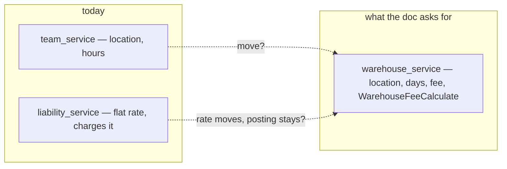
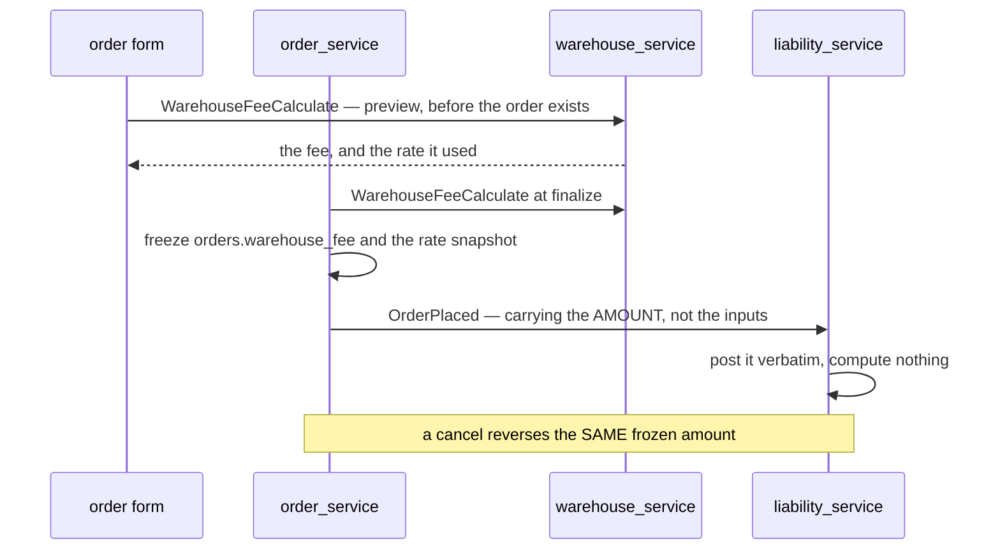
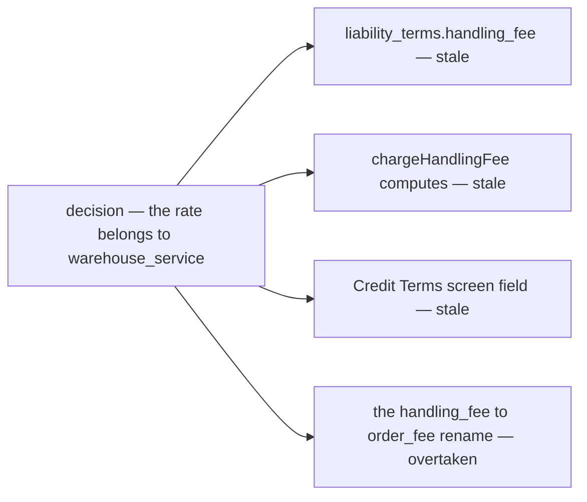

# Clarity — warehouse `context.md`

What [context.md](./context.md) leaves open. **That doc is yours — this one is mine.** Answered points are
deleted, so this file is always the current open set; what you settle goes in `context_decision.md`.

> 🆕 **First pass, 2026-09-16.** The context is four lines long, and three of the four things it asks for
> **already exist somewhere else in the build** — the location and the open/close grid are a shipped table in
> `team_service`, and the order fee is a shipped **flat** rate in `liability_service`. So the first question is
> not *how do we build this*, it is **what does `warehouse_service` TAKE OVER**, and what happens to the rate
> that is already charging money.

Siblings: [order](../order/context_clarify.md) · [balance](../balance/context_clarify.md) ·
[inventory](../inventory/context_clarify.md) · [technical/balance](../../technical/balance/team_balance_design_clarify.md).

---

## What is already built, before anything is designed

| what your doc asks for | where it lives TODAY | shape today |
| --- | --- | --- |
| Location Info | `team_service.warehouse_infos.location` | one free-text line, no region codes |
| Open/Close Order Day | `team_service.warehouse_infos.receiving_hours` + `operating_hours` | a weekly JSONB grid, ⛔ **read by nobody — no RPC consults it** |
| Fee Configuration | `liability_service.liability_terms.handling_fee` | a **flat rupiah amount per order**, per creditor→debtor **pair**, `0` = charge nothing |
| `WarehouseFeeCalculate` | nothing | the fee is computed **inside liability**, from the `OrderPlaced` push, and never returned to anyone |
| `orders.warehouse_fee` *(order context)* | nothing | ⛔ the column does not exist — no order stores what it was charged |



---

## Proposed Design

### a-warehouse-is-a-warehouse-team

A warehouse is **a team of `TEAM_TYPE_WAREHOUSE`**, and `warehouse_id` everywhere in the build is that team's
id — on `orders`, on every stock row, on every rack, on `warehouse_products`. Keep it. `warehouse_service`
then owns the **profile of a warehouse team**, never a second identity.

**→ Recommend:** one profile row per warehouse team, `UNIQUE (warehouse_id)`. A team that opens a second
building becomes a **second team** — that keeps stock, racks and orders addressable by one id with no
migration. If a team must ever run two buildings under one balance, say so now, because it changes the grain
of `stock`, `racks` and `orders.warehouse_id` and nothing else about this design.

### the-warehouse-profile-moves-out-of-team-service

`warehouse_infos` is a warehouse-only table sitting in the service that owns **identity**. Your doc claims its
two columns for `warehouse_service`.

**→ Recommend: move it.** `team_service` goes back to *who exists*, `warehouse_service` owns *what a warehouse
is like* — location, calendar, fee. Splitting them instead (fee here, hours there) means a warehouse profile
screen has to call two services, and the owner of one property cannot say who owns the other.

| step | |
| --- | --- |
| 1 | `warehouse_service/db_migrations` creates `warehouses` (location) + `warehouse_days` + `warehouse_fee_terms` |
| 2 | one-off backfill copies `team_service.warehouse_infos` across, then drops it |
| 3 | `WarehouseInfoDetail` / `WarehouseInfoUpdate` move to `warehouse.warehouse.v1` — the two frontend call sites change with them |

### the-fee-is-basis-points-with-a-floor-and-a-cap

`fee_percent` as a float over money is how rounding bugs get written. Money is `int64` rupiah everywhere in
this system, and `liability_terms.product_markup_bp` **already** uses basis points for exactly this reason.

```
fee = clamp( basis * fee_bp / 10000 , min_fee , max_fee )
```

| field | type | meaning |
| --- | --- | --- |
| `fee_bp` | `int64` | 250 = 2.5%. No float, ever |
| `min_fee` | `int64` | 🆕 **not in your list — I think it is missing.** Picking and packing a Rp 10.000 order is the same work as a Rp 1.000.000 one. At 2.5% the small one pays Rp 250 |
| `max_fee` | `int64 NULL` | ⚠ **NULL = uncapped, and `0` must be REFUSED.** `liability_terms.credit_limit` already carries this trap — nil is unlimited, 0 is nothing — and it is the one field in that table with a warning comment on it |
| no row at all | — | **charge nothing.** The same default liability already ships: a warehouse that configured nothing is not silently billing anybody |

### the-order-freezes-the-fee-and-the-ledger-posts-it

The fee must be computed **once**, at finalize, and stored. Today liability recomputes it from its own terms
when the push arrives — so a rate edited between commit and delivery charges a number the order never saw.



| | |
| --- | --- |
| the RPC is **pure** | it reads config, writes nothing, and knows nothing about orders — which is what lets the form preview a fee for a warehouse the seller has not chosen yet |
| it takes a **basis**, not an `order_id` | `warehouse_service` must not depend on `order_service` to price work |
| it is **batch** | `repeated` items in, `repeated` out — one call prices three candidate warehouses side by side |
| it returns the **rate snapshot** | `fee_bp`, `min_fee`, `max_fee`, and whether the pair row or the default answered — so a disputed charge can be explained months later |
| history | no effective-dating. The order froze the amount, and a `warehouse_fee_terms_log` records who changed the rate and when — the pattern `liability_terms_log` already uses |

### closed-means-refused

An open/close grid nothing consults is decoration — that is its state today.

| | → |
| --- | --- |
| order create / finalize names a warehouse closed at that moment | **refuse**, naming the day and the next opening |
| the warehouse picker | shows closed warehouses **disabled**, with the reason |
| timezone | one, fixed: **Asia/Jakarta**. A per-warehouse timezone is a real feature only when a warehouse sits outside WIB |
| one-off dates | the weekly grid cannot say *Idul Fitri*. **→ Recommend a `warehouse_closures` exception list** (date, reason) beside the grid |
| receiving vs operating | keep both, and be explicit: **`receiving_hours` gates orders, `operating_hours` gates restock and return arrival** |

---

## Critique

| | Problem | → Recommend |
| --- | --- | --- |
| **percent-of-what** | `fee_percent` names a rate and no **basis**. An order has `subtotal`, `shipping_cost`, `total`, `cogs` and `marketplace_total`, and they are all different numbers | **goods `subtotal`, frozen at finalize.** The warehouse should not take a cut of courier money (`shipping_cost`) nor of marketplace vouchers it cannot see (`marketplace_total`, which is `0` on a phone order). Say it in the doc — this is the single most load-bearing unstated word |
| **flat-vs-percent-is-a-live-rate-change** | `liability_terms.handling_fee` is charging money **today**, flat per order. A percent with a cap is not an extension of it — it is a different contract for every existing pair | a migration that reads each pair's flat fee and writes `fee_bp = 0, min_fee = max_fee = <the flat fee>`, reproducing today's charge exactly, and the warehouse edits from there. Never a silent reinterpretation of the old column |
| **two-services-would-own-one-rate** | if the rate moves to `warehouse_service` and `liability_terms.handling_fee` stays, both are *the fee* and nothing says which wins. See [Contradiction](#the-fee-rate-would-exist-in-two-services) | **liability keeps the posting and the credit limit, and loses the rate.** Drop `handling_fee` from `liability_terms` in the same change that adds `warehouse_fee_terms` |
| **the-pair-override-disappears** | your field list is one config per warehouse. `liability_terms` is per **pair**, with `counterparty_id = 0` as the default row — so a warehouse can already price one seller differently, and that capability would vanish | keep the pair grain: `(warehouse_id, selling_team_id)`, `selling_team_id = 0` = the default row. The same shape liability already uses, so the screen and the concept carry over |
| **nobody-reads-the-calendar** | `receiving_hours` has a table, a proto, an editor and a test, and **no caller** — an order can be placed into a warehouse that is shut | [closed-means-refused](#closed-means-refused) |
| **location-is-free-text** | one string cannot be matched against `region_service`, cannot suggest the nearest warehouse, and cannot fill a courier pickup form. `orders` already freezes provinsi→desa codes **and** names for exactly this reason | the same shape as the order address: codes + names + `address_line`, with the free text kept as the last line |
| **who-may-change-a-price-others-pay** | `WarehouseInfoUpdate` is `WAREHOUSE_OWNER` / `WAREHOUSE_ADMIN`. A fee is money other teams owe — a rate edited unilaterally at 2am changes every order placed after it | the rate is writable by `ROOT`/`ADMIN` **and** the warehouse owner, every edit is logged with the actor, and the seller sees the rate on the order form before finalizing. If a rate is meant to be *agreed* rather than *set*, that is a different feature and worth saying |
| **the-fee-is-invisible-to-the-payer** | nothing in the doc lets a selling team **see** a warehouse's rate before choosing it. Today the first sight of the charge is a ledger row | `WarehouseFeeCalculate` is callable by any authenticated team, pricing the caller's own pair, and the warehouse picker shows the fee beside each candidate |
| **responsibility-is-one-line** | *"manage warehouse teams"* is the only stated responsibility, and it is the one thing `team_service` already does. What is **not** ours is unwritten — stock is inventory's, the balance is liability's, the racks are inventory's | a *Whats Not* section, like the order context has. It is what stops this service growing into the warehouse's everything |
| **no-cancel-rule** | balance context says `order_fee` *"can be canceled in order canceled"*. Nothing here says whether a **return** or a **lost** parcel refunds the fee — the work was done either way | **the charge stands on return and on lost**, reversed only on `cancel`. Worth one line, because the opposite is arguable and someone will ask |

---

## Question

### what-is-the-fee-a-percent-of
`fee_percent` × **what**? Goods `subtotal` · `total` (with shipping) · `marketplace_total` · `cogs`.
**→ Recommend goods `subtotal`, frozen at finalize** — the warehouse handled goods, not shipping, and
`marketplace_total` is `0` for an order taken over the phone, which would silently make that fee 0 too.

### does-a-min-fee-exist
A cap with no floor prices small orders at nearly nothing while the picking work is identical.
**→ Recommend adding `min_fee`**, defaulting to 0 so it changes nothing until a warehouse sets it.

### does-the-fee-stay-per-pair
One rate per warehouse, or a rate per (warehouse, selling team) with a default row — which is what
`liability_terms` does today and what the Credit Terms screen already edits.
**→ Recommend per pair with a default row.** A single rate is then the same table with only the default row used.

### who-owns-the-rate-after-this
`liability_terms.handling_fee` is live. Does it **move** to `warehouse_service` and get dropped there, or does
`warehouse_service` only *calculate* while liability keeps storing?
**→ Recommend the move**, with the flat→`min = max` migration so no pair's charge changes on the day.

### does-the-order-freeze-the-fee
Does `orders.warehouse_fee` hold the amount the order was quoted, with liability posting **that** number rather
than recomputing? **→ Yes** — [the design](#the-order-freezes-the-fee-and-the-ledger-posts-it). Today a rate
edited between commit and push delivery charges a number nobody was shown.

### does-the-warehouse-profile-move-out-of-team-service
`warehouse_infos` (location + both weekly grids) lives in `team_service` and is built. Does it move whole into
`warehouse_service`? **→ Recommend yes, in one migration** — otherwise the warehouse profile is owned by two
services and the doc is true of neither.

### what-does-a-closed-day-actually-do
Refuse the order · warn and allow · queue it to the next open day. And does it gate **restock arrival** too?
**→ Recommend refuse for orders (`receiving_hours`) and refuse for arrivals (`operating_hours`)**, both naming
the next opening. Today neither is read at all.

### are-there-one-off-closures
The weekly grid cannot express a public holiday. **→ Recommend a `warehouse_closures` date list** with a
reason, read by the same check.

### is-the-fee-refunded-on-return-or-lost
Balance context reverses `order_fee` on **cancel**. Return and lost are unstated.
**→ Recommend the charge stands** on both — the warehouse did the work.

### is-a-warehouse-ever-two-buildings
Everything built assumes `warehouse_id` is a warehouse **team**. If one team can run two locations, that
changes `stock`, `racks` and `orders.warehouse_id` — not this service. **→ Recommend one team per building.**

### what-is-NOT-the-warehouse-services-job
Stock, racks and opname are inventory's. The balance and the posting are liability's. Identity and membership
are team's. **→ Recommend a *Whats Not* section** naming those four, as the order context has.

---

# Contradiction

## the-fee-rate-would-exist-in-two-services

One decision — *the fee config belongs to `warehouse_service`* — leaves **four** sites asserting the old
answer. Grouped by cause, not by symptom.

| site | what it says today | |
| --- | --- | --- |
| `liability_terms.handling_fee` | *"Flat per order, whole rupiah"* — and it is **charging** | the rate, in the wrong service and the wrong shape |
| `chargeHandlingFee` ([order_fees.go](../../../backend/services/liability_service/liability_v1/order_fees.go)) | computes the fee from those terms at push time | would have to post a number it is handed |
| the Credit Terms screen | edits *Handling fee* beside the credit limit | the fee field leaves, the limit stays |
| [technical/balance Q8](../../technical/balance/team_balance_design_clarify.md#question) | asks whether `handling_fee` should be **renamed** `order_fee` | ⚠ **overtaken** — a column about to move should not be renamed first |

**Which is wrong:** the build — the doc is your current statement. **→ Recommend** deciding
[who-owns-the-rate-after-this](#who-owns-the-rate-after-this) **before** that Q8 rename is done, or the rename
lands on a column that is being deleted.



## the-warehouse-profile-is-already-owned-elsewhere

*"Property or Field that must Have — Location Info, Open/Close Order Day info"* (this doc) — while
[database-schema.md](../../database-schema.md) has **`warehouse_infos`** holding exactly those, in
`team_service`, with `WarehouseInfoDetail` / `WarehouseInfoUpdate` shipped and a frontend editor on them.
**Which is wrong:** neither — they are the same requirement written twice, in two services.
**→ Recommend** [the move](#the-warehouse-profile-moves-out-of-team-service), so one of them stops being true.

## the-order-fee-column-the-order-context-promises-is-not-built

*"`warehouse_fee`"* in [order/context.md](../order/context.md) §Table That Must Have — while no `warehouse_fee`
column, field or proto exists anywhere in the build, and the amount lives **only** as a `liability_entries` row
posted after the fact. **Which is wrong:** the build. **→ Recommend** the freeze
([does-the-order-freeze-the-fee](#does-the-order-freeze-the-fee)) — it is the same change that makes this
column mean something.

---

# Awaiting

- **What the fee is FOR, in the warehouse's words** — per order, per line, per unit, per volume? A percent of
  money says the warehouse is paid as a commission on sales, which is a business stance worth stating
  explicitly, because everything downstream (returns, short picks, cross-product orders) inherits it.
- **Whether a warehouse can refuse a selling team outright** — today a seller picks any warehouse and the fee
  decides the price. A *not accepting new sellers* state is unwritten.
- **Capacity** — nothing yet says a warehouse can be full, or that an order can be refused for volume.
