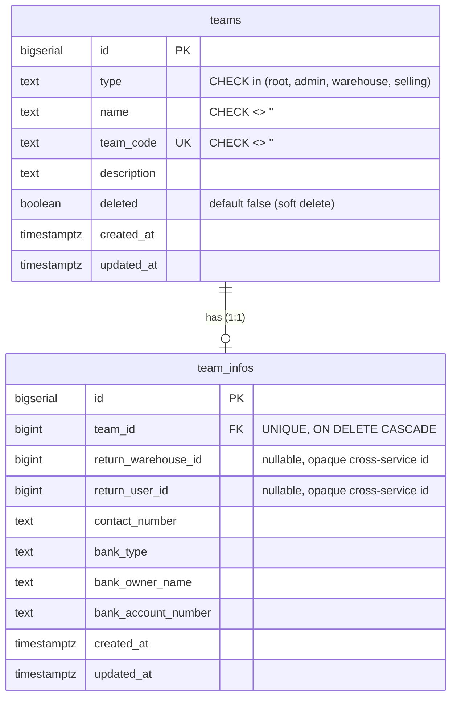
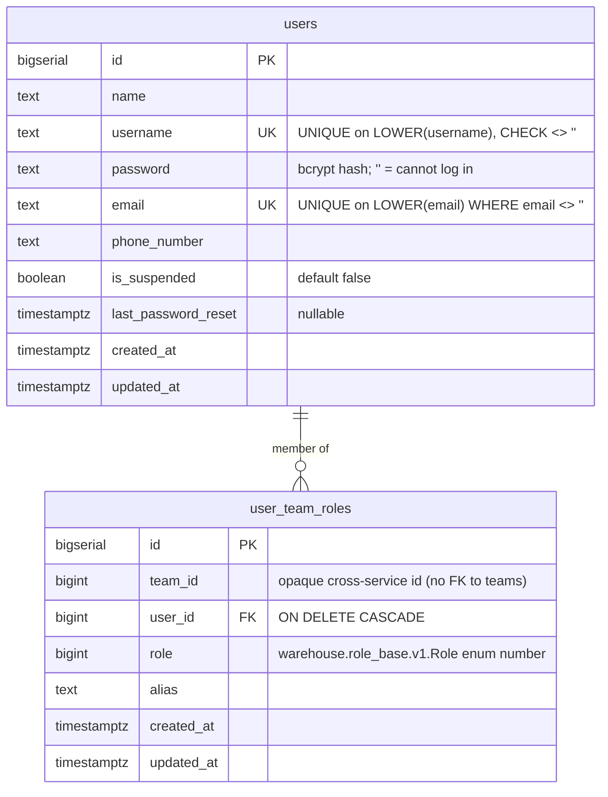
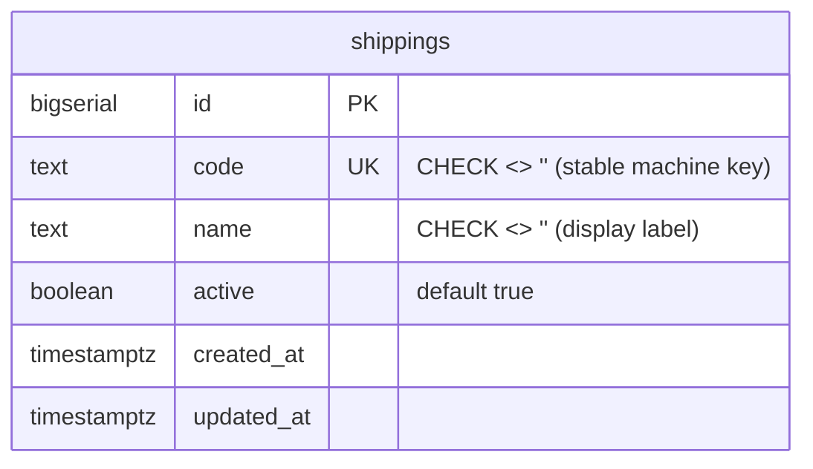
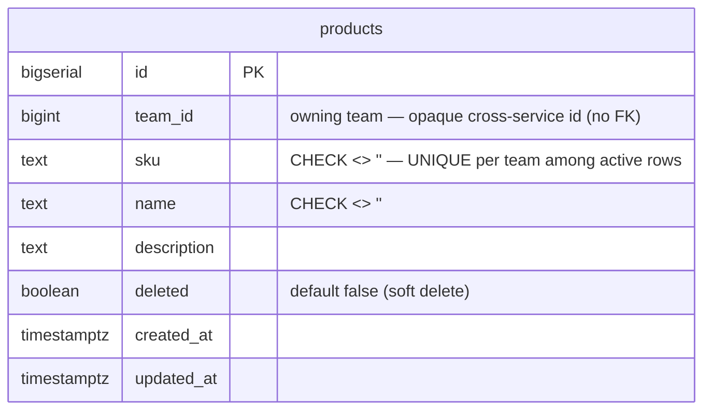
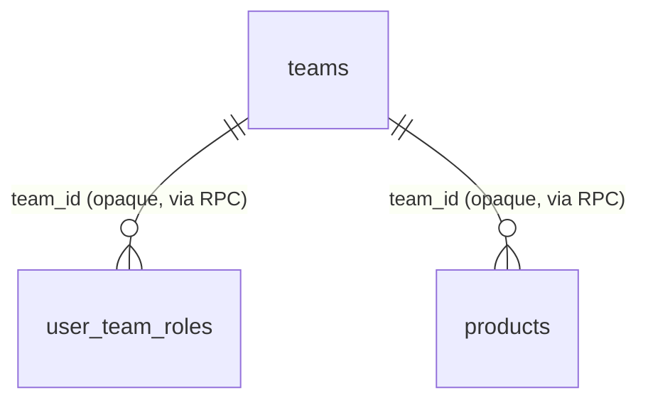

# Database schema

The authoritative schema is the goose migrations under
`backend/services/<service>/db_migrations/` — this document mirrors them for humans. **Keep it in
sync: any migration that changes the schema updates this file in the same commit** (HARD RULE 3).

Each service owns its own tables. **There are no cross-service foreign keys** — a service refers to
another's rows by an *opaque id* it never joins on (it resolves them over RPC, e.g.
`team_service.TeamByIds`). Those logical links are drawn as dashed relationships below and are not
enforced by the database.

---

## team_service

`backend/services/team_service/db_migrations/`

- **`teams`** — one row per team (a warehouse *is* a team; see `plans/team_service/`). Root-ness is
  structural: `CHECK ((type = 'root') = (id = 1))` ties `id = 1` and `type = 'root'` together so the
  hardcoded root-team scope in the access interceptor can never drift from the data. Indexes:
  `UNIQUE (team_code)`, and a partial `(type) WHERE deleted = FALSE`.
- **`team_infos`** — 1:1 with `teams` (`UNIQUE (team_id)`, which is what makes `TeamInfoUpdate` a
  real `ON CONFLICT` upsert). `return_warehouse_id` / `return_user_id` are opaque ids owned by other
  services — no FK is possible across the service boundary.

---

## user_service

`backend/services/user_service/db_migrations/`

- **`users`** — the identity table. `password = ''` is a deliberate "cannot log in" marker (bcrypt
  never matches an empty hash), used by the seeded root account until a password is set. Case-
  insensitive uniqueness on both `username` and (non-empty) `email`.
- **`user_team_roles`** — a user's role within a team. `role` stores the raw proto `Role` enum
  *number* (not a Postgres enum — proto enums are open). `UNIQUE (team_id, user_id)` is load-bearing:
  the authorization read takes one row, and it is what makes `TeamUserUpdate` an upsert. `team_id`
  is opaque — **no FK to `team_service.teams`** (that would couple the two services' databases);
  team display data is resolved over RPC, never joined.

---

## shipping_service

`backend/services/shipping_service/db_migrations/`

- **`shippings`** — the courier catalogue (JNE, J&T, SiCepat, …), seeded by the migration as stable
  reference data. `code` is unique and is what a shipment stores; `active=false` retires a courier
  without deleting it. No relations — it stands alone.

---

## product_service

`backend/services/product_service/db_migrations/`

- **`products`** — a team's catalogue items. Every RPC is team-scoped (`team_id` carries
  `use_scope`), so a product is only ever reachable within its owning team. `sku` is unique per team
  **among active products only** (`UNIQUE (team_id, sku) WHERE deleted = FALSE`), so a soft-deleted
  product frees its SKU for reuse and two teams may share a SKU. `team_id` is opaque — no FK to
  `team_service.teams`.

---

## Cross-service links (logical, not enforced)

`user_team_roles.team_id`, `products.team_id`, `team_infos.return_warehouse_id`, and
`team_infos.return_user_id` point at rows owned by other services. They carry no database foreign key by design (HARD RULE 3 — services
stay independent); the owning service resolves them over Connect RPC.
