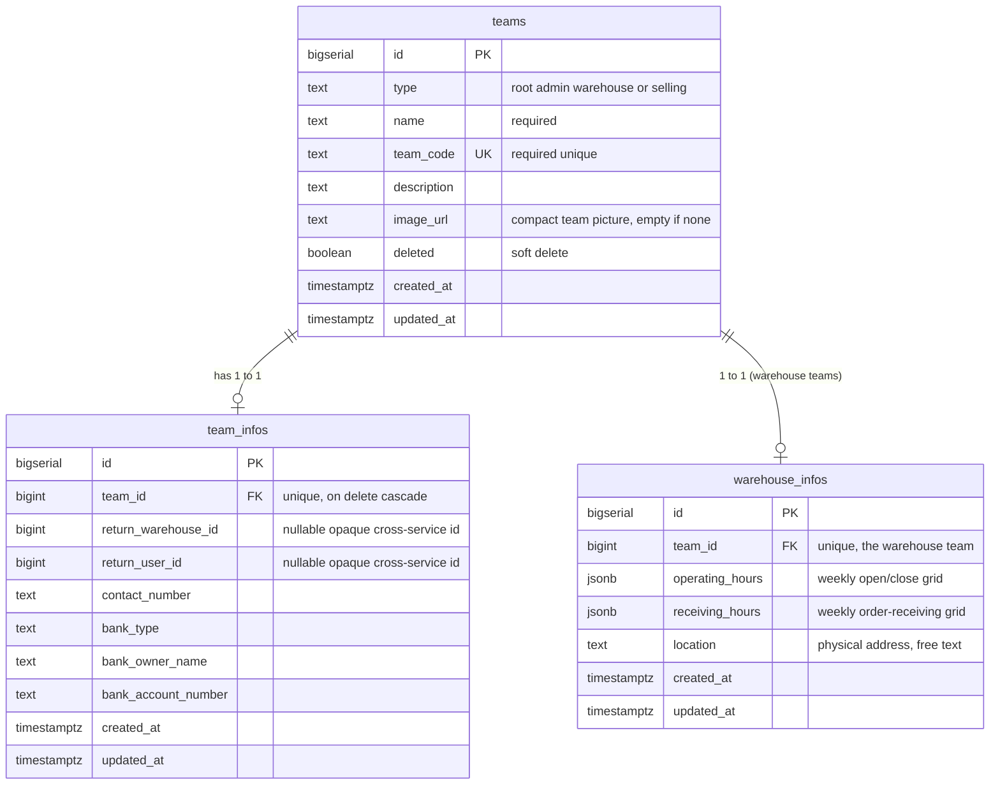
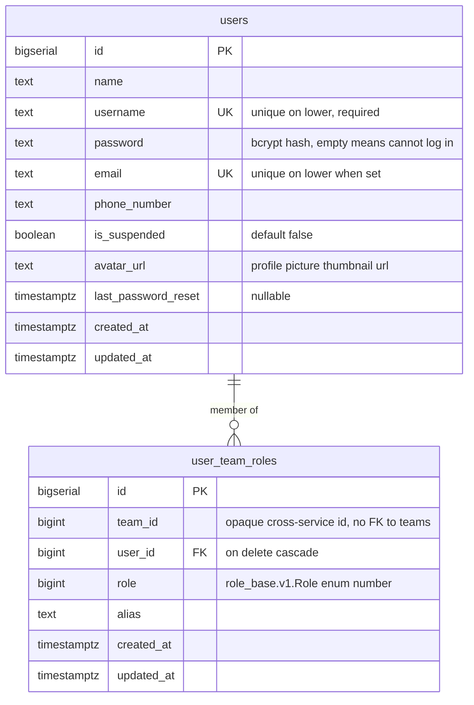
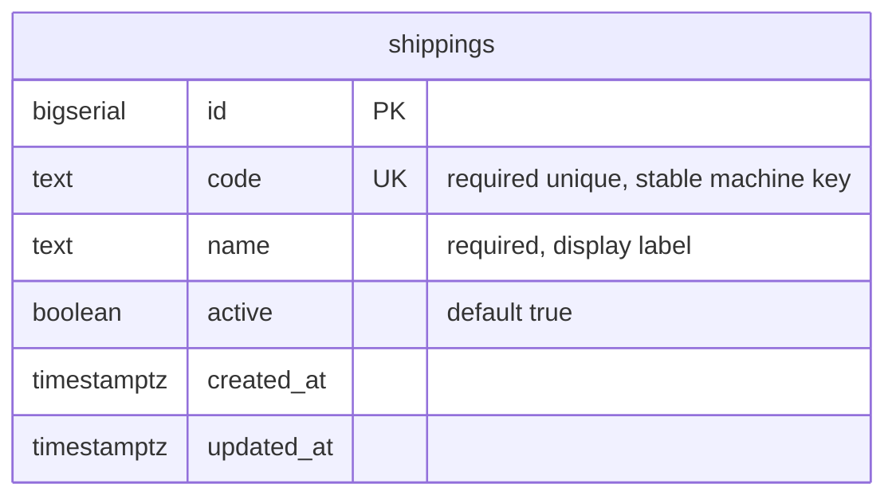
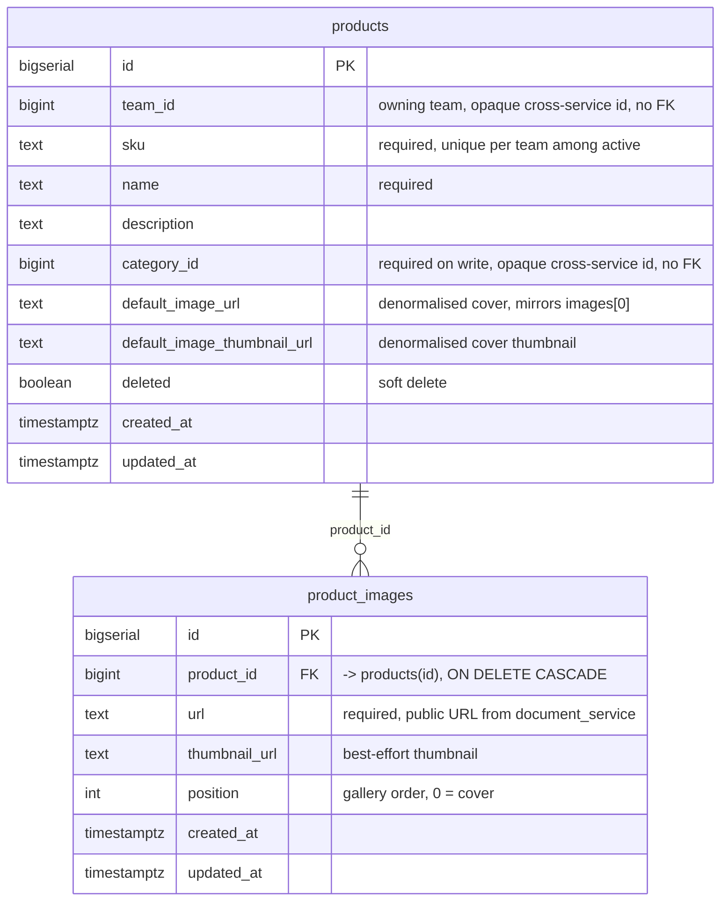
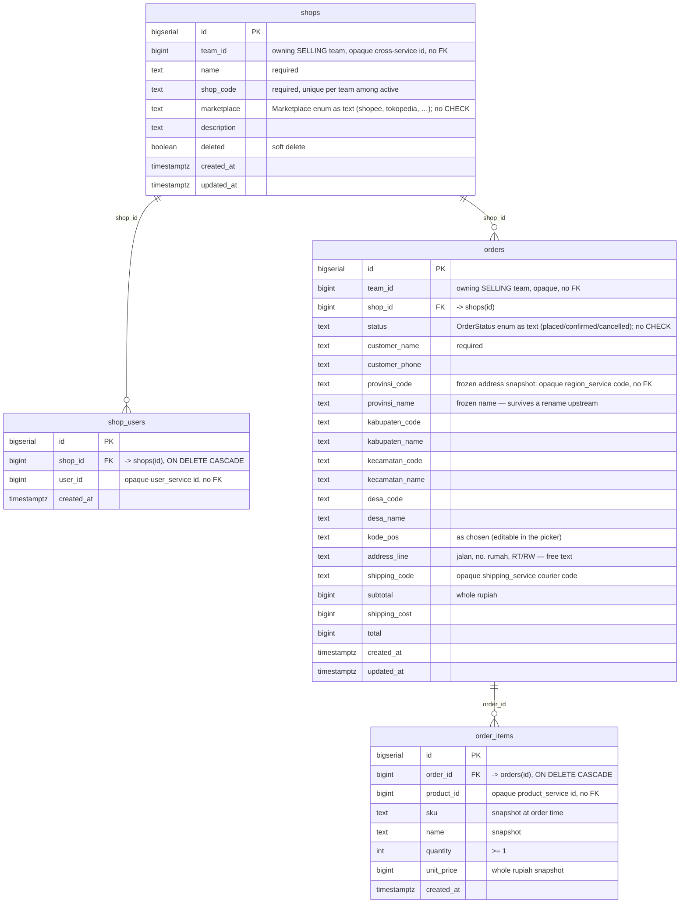
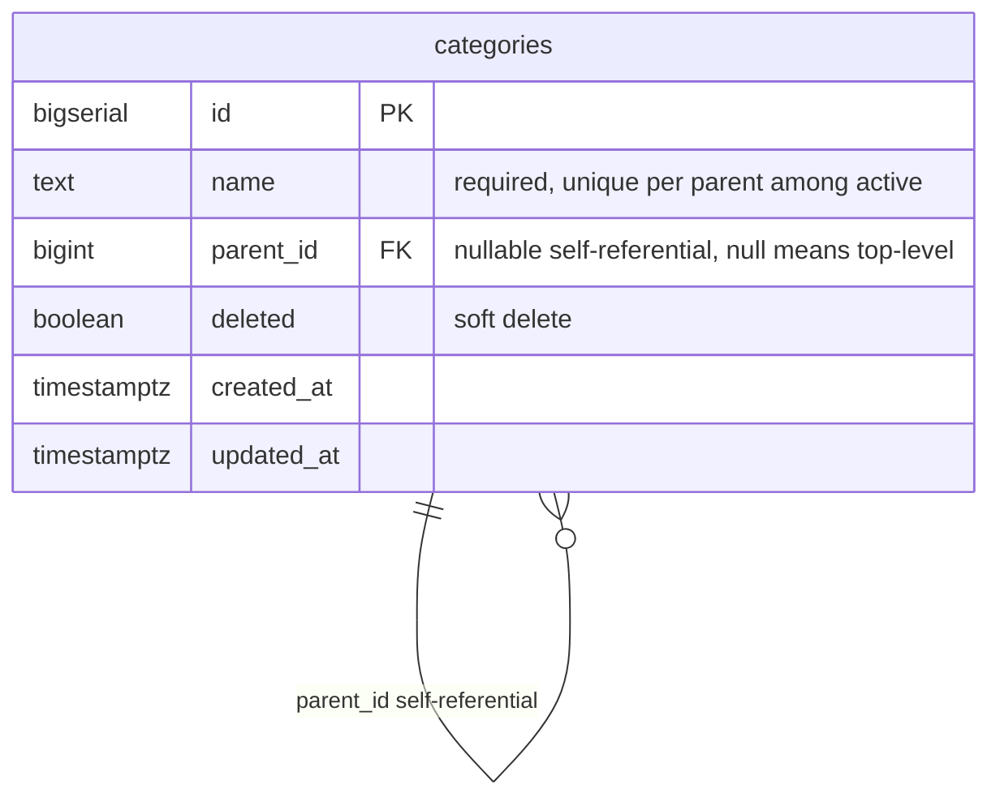
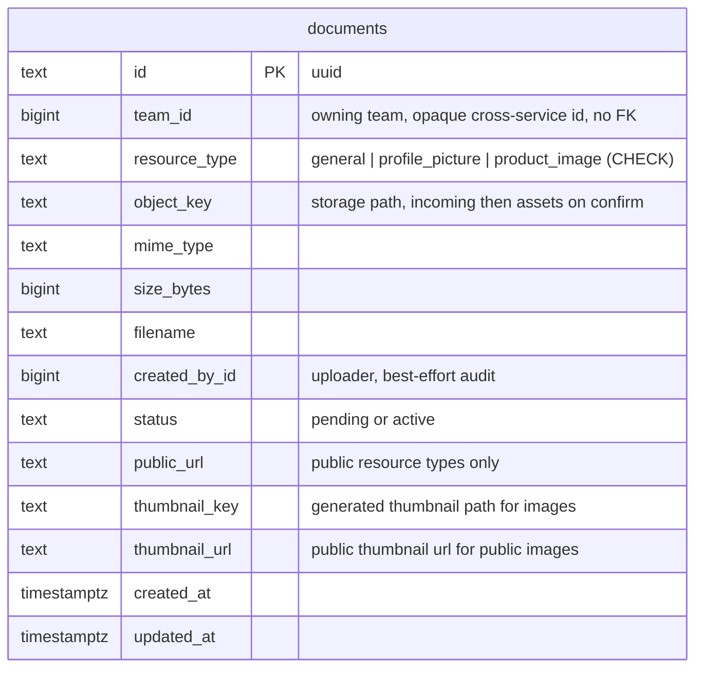
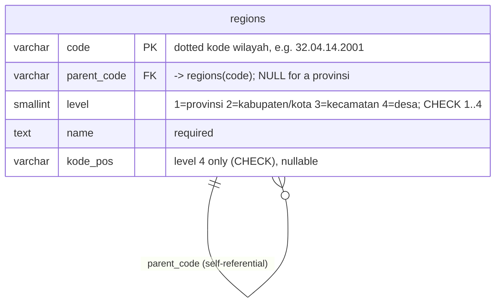
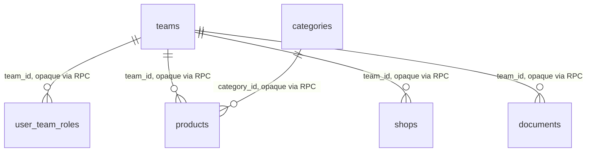

# Database schema

The authoritative schema is the goose migrations under
`backend/services/<service>/db_migrations/` — this document mirrors them for humans. **Keep it in
sync: any migration that changes the schema updates this file in the same commit** (HARD RULE 3).

Each service owns its own tables. **There are no cross-service foreign keys** — a service refers to
another's rows by an *opaque id* it never joins on (it resolves them over RPC, e.g.
`team_service.TeamByIds`). Those logical links are described in the prose and are not enforced by
the database.

---

## team_service

`backend/services/team_service/db_migrations/`

- **`teams`** — one row per team (a warehouse *is* a team; see `plans/team_service/`). Root-ness is
  structural: `CHECK ((type = 'root') = (id = 1))` ties `id = 1` and `type = 'root'` together so the
  hardcoded root-team scope in the access interceptor can never drift from the data. Indexes:
  `UNIQUE (team_code)`, and a partial `(type) WHERE deleted = FALSE`.
- **`team_infos`** — 1:1 with `teams` (`UNIQUE (team_id)`, which is what makes `TeamInfoUpdate` a
  real `ON CONFLICT` upsert). `return_warehouse_id` / `return_user_id` are opaque ids owned by other
  services — no FK is possible across the service boundary.
- **`warehouse_infos`** — 1:1 with a WAREHOUSE `teams` row (`UNIQUE (team_id)`, so `WarehouseInfoUpdate`
  is an `ON CONFLICT` upsert). The two schedules are stored as JSONB (a per-day open/close grid; the
  handler validates and marshals). `location` is the warehouse's physical address (#39). A warehouse
  with no row yet reads as "every day closed, no location".

---

## user_service

`backend/services/user_service/db_migrations/`

- **`users`** — the identity table. An empty `password` is a deliberate "cannot log in" marker
  (bcrypt never matches an empty hash), used by the seeded root account until a password is set.
  Case-insensitive uniqueness on both `username` and (non-empty) `email`.
- **`user_team_roles`** — a user's role within a team. `role` stores the raw proto `Role` enum
  *number* (not a Postgres enum — proto enums are open). `UNIQUE (team_id, user_id)` is load-bearing:
  the authorization read takes one row, and it is what makes `TeamUserUpdate` an upsert. `team_id`
  is opaque — **no FK to `team_service.teams`** (that would couple the two services' databases);
  team display data is resolved over RPC, never joined.

---

## shipping_service

`backend/services/shipping_service/db_migrations/`

- **`shippings`** — the courier catalogue (JNE, J&T, SiCepat, …), seeded by the migration as stable
  reference data, and curated by root/admin. `code` is unique and is what a shipment stores;
  `active = false` retires a courier without deleting it. No relations — it stands alone.

---

## product_service

`backend/services/product_service/db_migrations/`

- **`products`** — a team's catalogue items. Every RPC is team-scoped (`team_id` carries
  `use_scope`), so a product is only ever reachable within its owning team. `sku` is unique per team
  **among active products only** (`UNIQUE (team_id, sku) WHERE deleted = FALSE`), so a soft-deleted
  product frees its SKU for reuse and two teams may share a SKU. `team_id` is opaque — no FK to
  `team_service.teams`. `category_id` is likewise an **opaque cross-service id** (a `category_service`
  node, no FK); it is **required on write** (the handler rejects 0), `DEFAULT 0` only so pre-existing
  rows survive the migration. `default_image_url` / `default_image_thumbnail_url` are the
  **denormalised cover** (mirror of the first `product_images` row) so a list renders a picture
  without a join.
- **`product_images`** — a product's gallery, **up to 5** (enforced by the handler + proto, not the
  DB), ordered by `position` (0 = cover). `url`/`thumbnail_url` are produced by the two-phase
  `document_service` upload (resource type `PRODUCT_IMAGE`, served at a stable public URL) and stored
  verbatim. `ProductUpdate` replaces the whole set when its `images` wrapper is present. `ON DELETE
  CASCADE` covers a hard delete; products are normally soft-deleted, so images stay with them.

---

## selling_service

`backend/services/selling_service/db_migrations/`

- **`shops`** — a selling team's marketplace storefronts (#66). Team-scoped (`team_id` carries
  `use_scope`), so a shop is only ever reachable within its owning team. `shop_code` is unique per
  team **among active shops only** (`UNIQUE (team_id, shop_code) WHERE deleted = FALSE`), so a
  soft-deleted shop frees its code and two teams may share one. `marketplace` stores the shared
  `warehouse.marketplace.v1.Marketplace` enum **as text**, mapped via `pkgs/san_marketplace` — the
  same helper `inventory_service.supplier_channels` uses, so the two domains cannot drift to different
  encodings (#120). Deliberately **without** a `CHECK` IN-list: the mapper + proto validation guard
  the value, and an IN-list is just one more place to drift when the enum grows (the trap behind #80).
  No credentials are stored — "just shop info". selling_service also owns orders (the #23
  decomposition).
- **`shop_users`** — which users may work on a shop (#86); one row per (shop, user) grant, `UNIQUE
  (shop_id, user_id)`. `user_id` is an **opaque** user_service id (no FK). The RPCs are scoped
  through the shop's team (the request carries the team_id, and the handler verifies the shop
  belongs to it); the frontend resolves the ids to names via `UserByIDs`. `ON DELETE CASCADE` drops
  the grants when a shop is hard-deleted.
- **`orders`** / **`order_items`** — the SELLING side of an order (#67): who ordered, from which
  shop, and the frozen money (whole rupiah). Team-scoped (`team_id` opaque); `shop_id` is a real FK
  (same service). `status` is the `OrderStatus` enum as text (`placed`/`confirmed`/`cancelled` —
  selling-side only; fulfillment states wait on the warehouse core), no `CHECK` (mapper + proto
  guard it). `order_items` snapshots each line (`product_id` opaque; `sku`/`name`/`unit_price` frozen
  at order time), `ON DELETE CASCADE`. `OrderCreate` does **not** touch inventory (that is #69), and
  COGS/margin are the revenue side (#74). The UI is #68.
- **The order's delivery address is a SNAPSHOT** (#118) — the ten `provinsi_*` … `address_line`
  columns, which replaced the old free-text `customer_address` (the migration carries that text into
  `address_line`, since the street detail is exactly what it held). Both the **codes and the names**
  are frozen: `region_service`'s rows change (a desa is renamed, merged, split) and a historical order
  must keep reading what was agreed — so rendering a past order never touches `region_service`, and
  there is **no FK** to it (HARD RULE 3; each consumer keeps its own snapshot). Flat columns rather
  than one JSONB blob: an address is a fixed 4-tier shape, and "which orders ship to this kecamatan"
  is a question worth being able to ask. The whole address is **optional** — as the free text it
  replaced was.

`backend/services/category_service/db_migrations/`

- **`categories`** — a **global**, nested product-category taxonomy. Unlike `products`, it is **not
  team-scoped** (there is no `team_id`): root/admin curate one shared tree and every authenticated
  user reads it. `parent_id` is a **self-referential FK** to `categories(id)` — `NULL` marks a
  top-level category — so the table is a single tree the client assembles from the flat list. `name`
  is unique among **active** siblings (`UNIQUE (COALESCE(parent_id, 0), name) WHERE deleted = FALSE`,
  which folds the NULL top-level parent into one bucket), so a soft delete frees the name for reuse.
  A category with active children cannot be deleted.

---

## document_service

`backend/services/document_service/db_migrations/`

- **`documents`** — metadata for one stored file; the bytes live in object storage, not the DB.
  Team-scoped (`team_id` opaque, no FK). `status` goes `pending` → `active` on ConfirmUpload, which
  also moves `object_key` from the `incoming/` prefix to `assets/`. `public_url`/`thumbnail_url` are
  set only for public resource types (`profile_picture`, `product_image`); an image upload also gets
  a generated thumbnail.

---

## inventory_service

`backend/services/inventory_service/db_migrations/`

```mermaid
erDiagram
    stock_levels {
        bigint      warehouse_id "opaque team_service id (a WAREHOUSE team), no FK"
        bigint      product_id   "opaque product_service id, no FK"
        bigint      rack_id      FK "-> racks(id) ON DELETE RESTRICT; NULL = UNPLACED (#135)"
        bigint      on_hand      "THIS PLACE's running total, CHECK >= 0; a warehouse total is a SUM"
        timestamptz updated_at
    }

    stock_movements {
        bigserial   id            PK
        bigint      warehouse_id  "opaque, no FK"
        bigint      product_id    "opaque, no FK"
        bigint      rack_id       FK "-> racks(id); the place moved onto/off; NULL = unplaced (#135)"
        bigint      delta         "signed: + in, - out"
        bigint      balance       "THIS PLACE's on-hand after this movement"
        smallint    kind          "MovementKind enum number"
        text        reason
        text        ref
        bigint      actor_user_id "who, best-effort audit"
        timestamptz created_at
    }

    suppliers ||--o{ supplier_channels : "supplier_id"

    racks {
        bigserial   id           PK
        bigint      warehouse_id "the WAREHOUSE team it stands in, opaque, no FK"
        text        code         "the label on the shelf (A-01-3); unique per warehouse among active"
        text        name         "optional human name"
        text        description
        boolean     deleted      "soft delete"
        timestamptz created_at
        timestamptz updated_at
    }

    stock_access_grants {
        bigserial   id              PK
        bigint      warehouse_id    "the warehouse GRANTING, opaque, no FK"
        bigint      selling_team_id "the selling team allowed to draw, opaque, no FK"
        boolean     revoked         "soft, so a revocation is auditable"
        timestamptz created_at
        timestamptz updated_at
    }

    suppliers {
        bigserial   id          PK
        bigint      team_id     "owning team, opaque cross-service id, no FK"
        text        code        "required, unique per team among active"
        text        name        "required"
        text        contact
        text        province
        text        city
        text        address
        text        description
        boolean     deleted     "soft delete"
        timestamptz created_at
        timestamptz updated_at
    }

    supplier_channels {
        bigserial   id          PK
        bigint      supplier_id FK "-> suppliers(id), ON DELETE CASCADE"
        text        type        "SupplierChannelType as text (online/offline); no CHECK"
        text        marketplace "online only: marketplace code (shopee/tiktok/...); empty otherwise"
        text        name        "required, the store/shop name"
        text        url         "online only, optional link to the store"
        text        contact     "phone/WA, primary for an offline shop"
        text        location    "offline only, physical address"
        timestamptz created_at
        timestamptz updated_at
    }

    restock_requests ||--o{ restock_request_items : "restock_request_id"
    suppliers ||--o{ restock_requests : "supplier_id (nullable)"

    restock_requests {
        bigserial   id                 PK
        bigint      requesting_team_id "SELLING team that raised it, opaque, no FK"
        bigint      warehouse_id       "target WAREHOUSE team that fulfils it, opaque, no FK"
        text        shipping_code      "opaque shipping_service courier code"
        text        status             "RestockRequestStatus as text (pending/fulfilled/cancelled); no CHECK"
        text        order_ref          "optional: free-text reference to an order elsewhere; '' = none"
        text        receipt            "optional: courier tracking number (resi)"
        bigint      supplier_id        FK "optional -> suppliers(id) ON DELETE SET NULL; same service"
        bigint      shipping_cost      "the freight, whole rupiah, CHECK >= 0"
        text        payment_type       "RestockPaymentType as text (shopee_pay/bank_account); no CHECK"
        text        note               "optional free text"
        timestamptz created_at
        timestamptz updated_at
    }

    restock_request_items {
        bigserial   id                 PK
        bigint      restock_request_id FK "-> restock_requests(id), ON DELETE CASCADE"
        bigint      product_id         "opaque product_service id, no FK"
        text        sku                "snapshot at request time"
        text        name               "snapshot"
        bigint      quantity           "how many were ASKED FOR, CHECK > 0"
        bigint      price              "whole rupiah PER UNIT, CHECK >= 0"
        bigint      received_quantity  "what ARRIVED, counted at acceptance; stock receives THIS; 0 until fulfilled; no CHECK vs quantity"
        bigint      received_rack_id   FK "-> racks(id) ON DELETE RESTRICT; WHERE it was shelved (#137); NULL = unplaced / not accepted"
        timestamptz created_at
        timestamptz updated_at
    }
```

- **`stock_access_grants`** — the arrangement by which a WAREHOUSE lets a SELLING team draw its stock
  (#147). It exists because of a hole #69 found: a CS person placing an order holds a role in the
  *selling* team while the stock belongs to the *warehouse* team, and the access interceptor's rule is
  absolute — a role in another team does not authorize this one. What was missing is the **real business
  fact** that this warehouse stores goods for that selling team, recorded rather than inferred so it is
  visible, revocable, and **fails closed**: no grant, no draw.
  - The **warehouse grants**, so `warehouse_id` is the scoped team — it is that warehouse's stock being
    made drawable, and a selling team cannot grant itself access to anyone.
  - **Soft delete** (`revoked`), because *"who was allowed to take our stock, and when did that stop"* is
    exactly the question asked after a discrepancy, and a deleted row cannot answer it. The unique index
    is **partial on `revoked = FALSE`**, so revoking frees the pair to be granted again — the same shape
    as `racks_warehouse_code_active_unique`, and for the same reason.
  - `CHECK (warehouse_id <> selling_team_id)`: a warehouse already has full access to its own stock
    through its own roles, so a self-grant would be a no-op that reads like a permission.
  - ⚠ **Nothing consults these rows yet.** Teaching the scope check to read them is #148, deliberately a
    separate change because it touches the access interceptor every RPC's authorization runs through,
    where a mistake is silent. A test pins the inertness so the two cannot quietly entangle.
- **`stock_levels`** / **`stock_movements`** — on-hand stock and the append-only ledger behind it.
  `stock_movements` is the source of truth (never UPDATE/DELETE a row); `stock_levels` is a derived
  cache of the running on-hand, maintained inside each movement's transaction, with a
  `CHECK (on_hand >= 0)` that turns an over-draw into a failed movement rather than a negative on-hand.
  Scoped by `warehouse_id` (`use_scope`); `product_id` is an opaque `product_service` id. Both ids are
  opaque cross-service ids — no FK. `rack_id` **is** a real FK: racks live in the same service.
- **Stock is located ON a rack** (#135) — the grain is **(warehouse, rack, product)**, and a row's
  `on_hand` is **that place's**, not the warehouse's total for the product. A warehouse total is a
  **SUM across a product's places** (`StockList` groups by `(warehouse_id, product_id)`); a ledger
  row's `balance` is likewise that place's running balance, because a movement is a statement about
  one place — "this shelf went from 40 to 49".
  - **`rack_id IS NULL` means UNPLACED** — "somewhere in this warehouse, not yet on a shelf". It is a
    real, workable state (the put-away queue, #136), not a missing value: it is what arrived before
    anyone shelved it. Every row predating #135 is unplaced, which is the truth — the system had never
    been told where anything sits, and it must not invent a location it was never given.
  - **The identity is a UNIQUE INDEX, not a PK**, because a PK column may not be NULL and "unplaced"
    must be. `stock_levels_place_unique` carries **`NULLS NOT DISTINCT`** (Postgres 15+; compose pins
    17) and that clause is load-bearing: by default Postgres treats every NULL as distinct from every
    other, so a plain unique index would accept *many* unplaced rows for one (warehouse, product) —
    each a separate "somewhere", silently double-counting the same goods on every read.
  - **Consequently every query matches the rack with `IS NOT DISTINCT FROM`, never `=`.** In SQL
    `rack_id = NULL` is never true, not even against a NULL row, so a plain `=` would fail to find
    unplaced stock and report a phantom shortage for goods sitting right there. This is also why
    writes to `stock_levels` go through raw SQL rather than GORM's primary-key path — see the model.
  - **`ON DELETE RESTRICT`** on both `rack_id` FKs: stock on a rack being deleted must be dealt with
    explicitly (#138), never stranded at a location nobody can reach.
- **`suppliers`** — a team's vendors (who it buys stock from). Team-scoped (`team_id` carries
  `use_scope`), so a supplier is only ever reachable within its owning team. `code` is unique per team
  **among active suppliers only** (`UNIQUE (team_id, code) WHERE deleted = FALSE`), so a soft-deleted
  supplier frees its code for reuse and two teams may share one. `team_id` is opaque — no FK to
  `team_service.teams`. `contact`/`province`/`city`/`address`/`description` are free-text profile
  fields. Structurally mirrors `selling_service.shops` (team-scoped CRUD, unique per-team code, soft
  delete, search, pagination).
- **`racks`** — the physical places inside one warehouse (#129). Scoped to the `warehouse_id`, which
  **is** a team (a warehouse is a team), carrying `use_scope`; opaque, no FK. `code` is the label
  someone reads off the shelf and is unique per warehouse **among active racks only**
  (`UNIQUE (warehouse_id, code) WHERE deleted = FALSE`), so a soft-deleted rack frees its label for
  re-use — a shelf gets re-labelled — and two warehouses may both have an `A-01-3`. Only **warehouse**
  teams have racks; a selling team has nowhere to put a shelf.
- **`racks` is the REGISTRY, not a location model.** Nothing references a rack yet: stock is still
  counted per `(warehouse_id, product_id)` in `stock_levels`. Putting stock **on** a rack is
  `plans/inventory_service/` §3's open decision (warehouse-level vs bin-level), and writing down the
  racks a warehouse has does not settle it — it is the prerequisite, not the answer.
- **`supplier_channels`** — the ways a team can reach or order from a supplier (#120): an **online**
  channel (a store on a marketplace) or an **offline** channel (a physical shop). `supplier_id` is a
  **real FK** to `suppliers` (same service, `ON DELETE CASCADE`); scope to a team is enforced by the
  handler (it verifies the supplier is in the team before touching its channels), not by a column on
  this table. `type` and `marketplace` are stored **as text** (mapped in the handler, no `CHECK`
  IN-list, cf. #80); the `marketplace` code is the shared `warehouse.marketplace.v1.Marketplace`
  vocabulary (the same enum `selling_service.shops.marketplace` uses — promoted to a neutral proto so
  neither domain owns it, #120), set only for an online channel. An online channel must name a
  marketplace;
  an offline one keeps `contact`/`location`. Channels are hard-deleted (no history to keep).
- **`restock_requests`** / **`restock_request_items`** — a SELLING team's request for a WAREHOUSE to
  restock (#105/#124). Two-sided: `requesting_team_id` (the selling team, `use_scope` on
  create/cancel/list) raises a `pending` request naming a `warehouse_id` (the target warehouse,
  `use_scope` on fulfil/list) and a `shipping_code`. The warehouse **fulfils** it in one transaction —
  a `stock_movements` RECEIVE for **every line** plus a status flip to `fulfilled`, so the ledger and
  the request can't diverge and a request is never half-received; the requester may **cancel** a
  still-pending one. `status` is the `RestockRequestStatus` enum **as text** (mapped in the handler,
  no `CHECK` IN-list, cf. #80). Both team ids are opaque — no FK; indexes on `requesting_team_id` and
  `warehouse_id` serve the two list views.
- A request carries **many priced lines** (#124), same shape as `orders`/`order_items`:
  `restock_request_items` snapshots each line's `sku`/`name` at request time (the product may live in
  another team's catalogue and be renamed later), with a `quantity` (`CHECK > 0`) and a `price`
  (whole rupiah **per unit**, `CHECK >= 0` — zero is legitimate for a transfer or a sample).
  `ON DELETE CASCADE`.
- **`quantity` is what was ASKED FOR; `received_quantity` is what ARRIVED** (#133), and the two are
  different facts, which is why both are stored. A request is a *promise*; the delivery is a *fact*,
  and they disagree often enough — 9 of the 10, one line that never turned up, occasionally 11 — that
  conflating them would mean recording stock the warehouse does not physically have. **Stock receives
  `received_quantity`**, counted by the warehouse at acceptance. The asked-for is never overwritten by
  it: the **gap between the two is the point**, being what someone chases the supplier about, and a row
  that quietly said 9 were asked for would erase the discrepancy it exists to record.
  - `received_quantity` is `0` until acceptance and stays `0` for a line that never arrived, so it only
    means anything once `status = 'fulfilled'` — on a pending request it reads as *uncounted*, not as
    *nothing came*.
  - **No `CHECK` against `quantity`.** A short delivery is ordinary and an over-delivery is real; the
    column records what was counted, and the person counting is the authority. A constraint here would
    only force them to write down a number they can see is wrong.
  - **`received_rack_id` says WHERE it was shelved** (#137) — counting and shelving are one act, so
    acceptance records both. `NULL` covers two situations this column does not distinguish on its own:
    *received but not shelved yet*, and *not accepted yet*. `status` and `received_quantity` tell those
    apart, and duplicating that here would just be a third thing to keep in sync.
  - Both `received_quantity` and `received_rack_id` are **write-only-by-the-warehouse**. They ride the
    shared line message so a line can READ back what happened to it, and `restockItemModels` therefore
    ignores both on the way in — a requesting team that could set them would be declaring its own
    delivery received, and saying which shelf it went on, for goods the warehouse never saw.
- **Optional** context on the header (#124/#127): `order_ref` — the order this restock is *for*, as
  **free text** (`''` = untied); `receipt` — the courier's tracking number (resi); and `supplier_id` —
  who the goods are bought from. `supplier_id` is the one **real FK**, because `suppliers` is the
  *same service* (`ON DELETE SET NULL`, so a request keeps its history if a supplier is ever
  hard-deleted). The handler additionally requires the supplier to belong to the **requesting team** —
  another team's supplier reads as `NotFound`, so the error can't be used to confirm an id exists.
- `order_ref` **was** a `uint64 order_id` (#124) and became text in #127. That was a shape fix, not a
  rename: the order is written down from a marketplace or a chat *elsewhere*, so it was never a row in
  this system — a reference that happens to be numeric never pointed at anything here, and a real one
  like `SHP-2026-ABC/01` could not be stored at all. The migration carries the old ids across as text.
- The restock's own money (#127): `shipping_cost` is the **freight** (whole rupiah, `CHECK >= 0`) —
  the goods' cost lives per line in `restock_request_items.price`, and this sits on top, which is what
  the create screen's summary adds to the products' total. `payment_type` is the `RestockPaymentType`
  enum **as text** (`shopee_pay` / `bank_account`, mapped in the handler, no `CHECK` IN-list per #80;
  `''` = none recorded), and `note` is free text.

---

## region_service

`backend/services/region_service/db_migrations/`

- **`regions`** — Indonesia's administrative hierarchy (provinsi → kabupaten/kota → kecamatan →
  desa/kelurahan) with a kode pos on each desa (#112/#114). **Global reference data**: unlike almost
  every other table here there is **no `team_id`** and no `use_scope` — regions are the same for
  everyone, so the reads are unscoped and open to any authenticated user.
- **One self-referential table, not four typed ones** (owner call, `plans/region_service/` §4.2
  option A). `code` — the government's dotted kode wilayah — **is** the identity, and the hierarchy is
  derivable from it (`11` → `11.01` → `11.01.01` → `11.01.01.2001`), so the upstream source loads
  near-verbatim and "children of X" is a single indexed predicate (`WHERE parent_code = ?`).
  `parent_code` is a **real self-FK** (`ON DELETE CASCADE`) — an orphan is a picker that dead-ends.
- `level` carries a range `CHECK (1..4)`: a 4-tier structure fixed by law, so unlike an enum IN-list
  it cannot drift as the data grows (cf. #80). `kode_pos` is `CHECK`-confined to level 4 — officially
  one postcode per desa, so it is a column, not a table.
- **Indexes:** `parent_code` (the cascading picker's only query), `LOWER(name) text_pattern_ops`
  (case-insensitive **prefix** typeahead — a leading-wildcard "contains" search would need `pg_trgm`),
  and `level` (a scoped search: "find a kecamatan named X").
- **The 91 599 rows are NOT in the migration.** They are generated from pinned upstream dumps and
  loaded separately — `go run ./cmd/tool region build-seed` then `… region load-seed` (idempotent
  upsert; ~5 s). Postgres runs in Docker and cannot read a host file, so a server-side `COPY … FROM
  '<path>'` inside the migration would not work; this mirrors how the category taxonomy is seeded
  from a file. See
  [the seed README](../backend/services/region_service/db_migrations/seed/README.md).
- **Consumers snapshot, they do not FK.** A saved address (an order's customer address, a warehouse
  address) freezes the codes **+** names **+** kode pos on its own record, so history cannot mutate
  when a desa is renamed or merged. `region_service` is reached only via its RPCs — no cross-service
  FK (HARD RULE 3).

---

## Cross-service links (logical, not enforced)

`user_team_roles.team_id`, `products.team_id`, `documents.team_id`,
`team_infos.return_warehouse_id`, and `team_infos.return_user_id` point at rows owned by other
services. They carry no database foreign key by design (HARD RULE 3 — services stay independent);
the owning service resolves them over Connect RPC.
