# Database schema

The authoritative schema is the goose migrations under
`backend/services/<service>/db_migrations/` — this document mirrors them for humans. **Keep it in
sync: any migration that changes the schema updates this file in the same commit** (HARD RULE 3).

Each service owns its own tables. **There are no cross-service foreign keys** — a service refers to
another's rows by an *opaque id* it never joins on (it resolves them over RPC, e.g.
`team_service.TeamByIds`). Those logical links are described in the prose and are not enforced by
the database.

---

## team_service

`backend/services/team_service/db_migrations/`

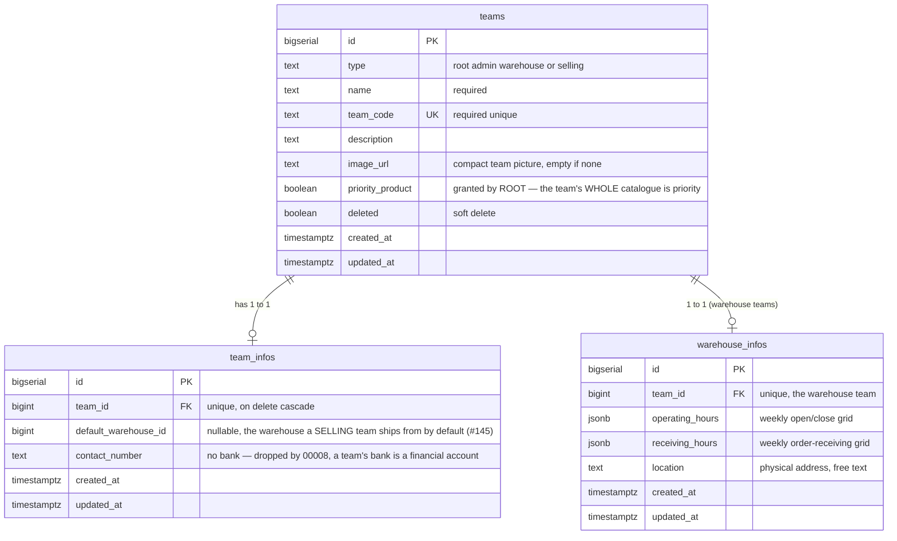
```mermaid
erDiagram
    teams ||--o| team_infos : "has 1 to 1"
    teams ||--o| warehouse_infos : "1 to 1 (warehouse teams)"

    teams {
        bigserial   id          PK
        text        type        "root admin warehouse or selling"
        text        name        "required"
        text        team_code   UK "required unique"
        text        description
        text        image_url   "compact team picture, empty if none"
        boolean     priority_product "granted by ROOT — the team's WHOLE catalogue is priority"
        boolean     deleted     "soft delete"
        timestamptz created_at
        timestamptz updated_at
    }

    team_infos {
        bigserial   id                  PK
        bigint      team_id             FK "unique, on delete cascade"
        bigint      default_warehouse_id "nullable, the warehouse a SELLING team ships from by default (#145)"
        text        contact_number "no bank — dropped by 00008, a team's bank is a financial account"
        timestamptz created_at
        timestamptz updated_at
    }

    warehouse_infos {
        bigserial   id              PK
        bigint      team_id         FK "unique, the warehouse team"
        jsonb       operating_hours "weekly open/close grid"
        jsonb       receiving_hours "weekly order-receiving grid"
        text        location        "physical address, free text"
        timestamptz created_at
        timestamptz updated_at
    }
```

- **`teams`** — one row per team (a warehouse *is* a team). Root-ness is
  structural: `CHECK ((type = 'root') = (id = 1))` ties `id = 1` and `type = 'root'` together so the
  hardcoded root-team scope in the access interceptor can never drift from the data. Indexes:
  `UNIQUE (team_code)`, a partial `(type) WHERE deleted = FALSE`, and a partial
  `(id) WHERE priority_product AND NOT deleted`.
  - **`priority_product`** — the priority-product feature, granted by **ROOT**, applying to the team's
    **whole catalogue**: every product it owns is a priority product to everybody discovering products.
    It backs the product picker's *Priority Product* tab.

    On the **team** rather than on each product, because the decision is about a team — one write,
    and automatically true of everything the team adds later, with no backfill when a team is granted
    the feature. In **`teams`** rather than `team_infos` for a policy reason, not a layout one:
    `TeamInfoUpdate` is callable by `ROLE_SELLING_OWNER`, so a capability granted by root must not live
    in a message a team owner can write, or a team could grant itself the feature.

    ⚠ **`product_service` never reads this column** — it cannot, because `teams` belongs to
    `team_service` and cross-service joins are forbidden (HARD RULE 3). The caller reads the priority
    **team ids** from `TeamList(filter.priority_product_only)` and passes them to `ProductDiscover` as
    `owner_team_ids` / `exclude_owner_team_ids`, so `product_service` filters by ids it was handed and
    never learns what "priority" means. One flag, one owner, two independent schemas.

    ⚠ **How root SETS it is not designed yet** (owner) — the column and the read path landed first, so
    no RPC writes it today.
- **`team_infos`** — 1:1 with `teams` (`UNIQUE (team_id)`, which is what makes `TeamInfoUpdate` a
  real `ON CONFLICT` upsert).
  - **No return warehouse and no return user (00009).** The return warehouse is the order context's
    `team_return_configurations` (selling_service, below), which order create reads without calling
    this service; the return user was read by nothing. Both columns were dropped, not copied — nothing
    had read them.
  - **`default_warehouse_id`** (#145) — the warehouse a SELLING team ships from by default. Every
    order must name a warehouse (#72), and a team almost always ships from the same building, so this
    is that answer held once rather than asked every time.
    It is a **default, not a rule**: the order form pre-fills an *untouched* field with it, the person
    may still choose another, and the server keeps refusing an order that names none. A server-side
    fallback would quietly undo that refusal — which exists so a warehouse-less order cannot reach the
    database at all.
- **`warehouse_infos`** — 1:1 with a WAREHOUSE `teams` row (`UNIQUE (team_id)`, so `WarehouseInfoUpdate`
  is an `ON CONFLICT` upsert). The two schedules are stored as JSONB (a per-day open/close grid; the
  handler validates and marshals). `location` is the warehouse's physical address (#39). A warehouse
  with no row yet reads as "every day closed, no location".

---

## user_service

`backend/services/user_service/db_migrations/`

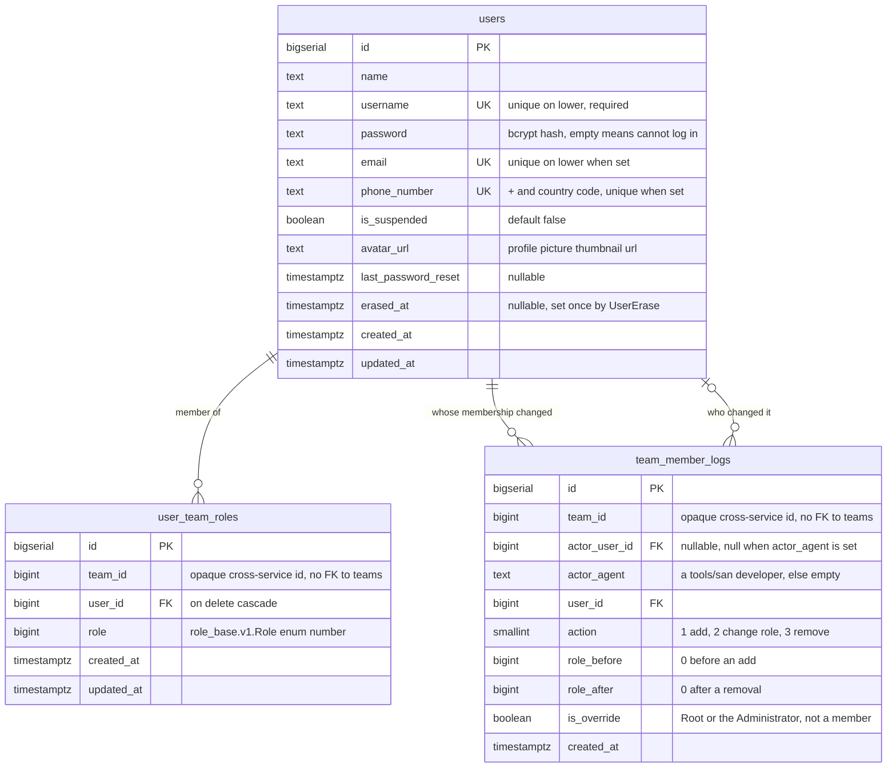
```mermaid
erDiagram
    users ||--o{ user_team_roles : "member of"
    users ||--o{ team_member_logs : "whose membership changed"
    users |o--o{ team_member_logs : "who changed it"

    users {
        bigserial   id                  PK
        text        name
        text        username            UK "unique on lower, required"
        text        password            "bcrypt hash, empty means cannot log in"
        text        email               UK "unique on lower when set"
        text        phone_number        UK "+ and country code, unique when set"
        boolean     is_suspended        "default false"
        text        avatar_url          "profile picture thumbnail url"
        timestamptz last_password_reset "nullable"
        timestamptz erased_at           "nullable, set once by UserErase"
        timestamptz created_at
        timestamptz updated_at
    }

    user_team_roles {
        bigserial   id         PK
        bigint      team_id    "opaque cross-service id, no FK to teams"
        bigint      user_id    FK "on delete cascade"
        bigint      role       "role_base.v1.Role enum number"
        timestamptz created_at
        timestamptz updated_at
    }

    team_member_logs {
        bigserial   id            PK
        bigint      team_id       "opaque cross-service id, no FK to teams"
        bigint      actor_user_id FK "nullable, null when actor_agent is set"
        text        actor_agent   "a tools/san developer, else empty"
        bigint      user_id       FK
        smallint    action        "1 add, 2 change role, 3 remove"
        bigint      role_before   "0 before an add"
        bigint      role_after    "0 after a removal"
        boolean     is_override   "Root or the Administrator, not a member"
        timestamptz created_at
    }
```

- **`users`** — the identity table. An empty `password` is a deliberate "cannot log in" marker
  (bcrypt never matches an empty hash), used by the seeded root account until a password is set.
  Case-insensitive uniqueness on both `username` and (non-empty) `email`. `erased_at` marks an account erased on
  request ([an-erased-account-is-final](business/user/context_decision.md#an-erased-account-is-final)): set once, never
  cleared, and a CHECK (`users_erased_is_suspended`) keeps such an account suspended for good. `phone_number` is
  stored in ONE form, `+` and the country code (`+6281234567890`), and **unique when set** — `users_phone_unique` (`00008`)
  ([a-phone-is-saved-in-international-form](business/user/context_decision.md#a-phone-is-saved-in-international-form),
  [a-phone-or-email-belongs-to-one-account](business/user/context_decision.md#a-phone-or-email-belongs-to-one-account)). The
  handlers write that form (`normalizePhone`); `00008` rewrote the stored ones with `user_phone_international(text)`, its
  SQL twin, which stays for that test. A number it could not read was left as it was. `00007`'s `user_phone_key` and its
  index are dropped by `00008`.
- **`user_team_roles`** — a user's role within a team. `role` stores the raw proto `Role` enum
  *number* (not a Postgres enum — proto enums are open). `UNIQUE (team_id, user_id)` is load-bearing:
  the authorization read takes one row, and it is what makes `TeamUserUpdate` an upsert. `team_id`
  is opaque — **no FK to `team_service.teams`** (that would couple the two services' databases);
  team display data is resolved over RPC, never joined. Its `alias` column was dropped in `00009`
  ([a-user-is-name-username-email-phone-and-photo](business/user/context_decision.md#a-user-is-name-username-email-phone-and-photo)).
- **`team_member_logs`** — the membership log
  ([every-role-change-is-logged](business/user/context_decision.md#every-role-change-is-logged)): one row per add,
  role change and removal, written in the **same transaction** as the `user_team_roles` change, so a membership
  never changes without its row. **Append-only** — never updated, never deleted. A CHECK makes each row a real
  change (an add has no role before it, a removal none after, a role change two different roles); nothing
  changing writes nothing. Read newest first per team, and per person within a team — indexes
  `(team_id, id DESC)` and `(team_id, user_id, id DESC)`.

---

## shipment_service

`backend/services/shipment_service/db_migrations/` — design: [business/shipment/context_decision.md](business/shipment/context_decision.md)

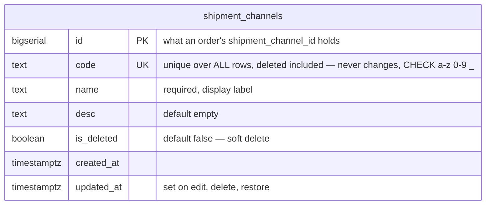
```mermaid
erDiagram
    shipment_channels {
        bigserial   id         PK "what an order's shipment_channel_id holds"
        text        code       UK "unique over ALL rows, deleted included — never changes, CHECK a-z 0-9 _"
        text        name       "required, display label"
        text        desc       "default empty"
        boolean     is_deleted "default false — soft delete"
        timestamptz created_at
        timestamptz updated_at "set on edit, delete, restore"
    }
```

- **`shipment_channels`** — the courier catalogue, one row per COURIER (never courier + service level).
  Seeded with `jne`, `jnt`, `sicepat` by the migration, because it must exist in production too.
  Curated by root only. No relations — it stands alone; other services hold its `id` (or, until the
  order redesign, its `code`) with no FK.
- **The unique index on `code` is PLAIN, not partial.** A deleted channel keeps its code, and creating
  that code again is refused in favour of restore — a partial index would let a second `jne` split the
  orders and the third-party app's mapping between two ids.

## shipping_service — REMOVED

⚠ **The service is gone; its TABLE is not.** `shipping_service` was replaced by `shipment_service` on
2026-09-16 — see [the-old-catalogue-bridges-by-code](business/shipment/context_decision.md#the-old-catalogue-bridges-by-code).
No drop migration was written: one service's migration never touches another's table (HARD RULE 3), so
an existing database keeps an unused `shippings` table and `shipping_service_version`, and a fresh one
never creates them. Rows that still store a courier code outside the new seed (`anteraja`, `tiki`, …)
render as the raw code until root creates that channel.

---

## product_service

`backend/services/product_service/db_migrations/`

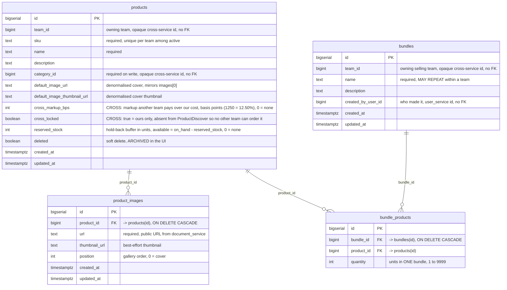
```mermaid
erDiagram
    products ||--o{ product_images : "product_id"
    bundles ||--o{ bundle_products : "bundle_id"
    products ||--o{ bundle_products : "product_id"

    products {
        bigserial   id                          PK
        bigint      team_id                     "owning team, opaque cross-service id, no FK"
        text        sku                         "required, unique per team among active"
        text        name                        "required"
        text        description
        bigint      category_id                 "required on write, opaque cross-service id, no FK"
        text        default_image_url           "denormalised cover, mirrors images[0]"
        text        default_image_thumbnail_url "denormalised cover thumbnail"
        int         cross_markup_bps            "CROSS: markup another team pays over our cost, basis points (1250 = 12.50%), 0 = none"
        boolean     cross_locked                "CROSS: true = ours only, absent from ProductDiscover so no other team can order it"
        int         reserved_stock              "hold-back buffer in units, available = on_hand - reserved_stock, 0 = none"
        boolean     deleted                     "soft delete, ARCHIVED in the UI"
        timestamptz created_at
        timestamptz updated_at
    }

    product_images {
        bigserial   id            PK
        bigint      product_id    FK "-> products(id), ON DELETE CASCADE"
        text        url           "required, public URL from document_service"
        text        thumbnail_url "best-effort thumbnail"
        int         position      "gallery order, 0 = cover"
        timestamptz created_at
        timestamptz updated_at
    }

    bundles {
        bigserial   id                 PK
        bigint      team_id            "owning selling team, opaque cross-service id, no FK"
        text        name               "required, MAY REPEAT within a team"
        text        description
        bigint      created_by_user_id "who made it, user_service id, no FK"
        timestamptz created_at
        timestamptz updated_at
    }

    bundle_products {
        bigserial id         PK
        bigint    bundle_id  FK "-> bundles(id), ON DELETE CASCADE"
        bigint    product_id FK "-> products(id)"
        int       quantity   "units in ONE bundle, 1 to 9999"
    }
```

- **`products`** — a team's catalogue items. Every RPC is team-scoped (`team_id` carries
  `use_scope`), so a product is only ever reachable within its owning team. `sku` is unique per team
  **among active products only** (`UNIQUE (team_id, sku) WHERE deleted = FALSE`), so a soft-deleted
  product frees its SKU for reuse and two teams may share a SKU. `team_id` is opaque — no FK to
  `team_service.teams`. `category_id` is likewise an **opaque cross-service id** (a `category_service`
  node, no FK); it is **required on write** (the handler rejects 0), `DEFAULT 0` only so pre-existing
  rows survive the migration. `default_image_url` / `default_image_thumbnail_url` are the
  **denormalised cover** (mirror of the first `product_images` row) so a list renders a picture
  without a join.
- **`product_images`** — a product's gallery, **up to 5** (enforced by the handler + proto, not the
  DB), ordered by `position` (0 = cover). `url`/`thumbnail_url` are produced by the two-phase
  `document_service` upload (resource type `PRODUCT_IMAGE`, served at a stable public URL) and stored
  verbatim. `ProductUpdate` replaces the whole set when its `images` wrapper is present. `ON DELETE
  CASCADE` covers a hard delete; products are normally soft-deleted, so images stay with them.
- **`bundles`** (`00006`) — a selling team's **picking recipes** ([product_bundle.md](business/product/product_bundle.md)):
  no stock, no price. The name **may repeat** within a team, so there is no unique index on it. A bundle is
  **hard-deleted**, because no order refers to one — the order form expands it into product lines and keeps no link
  back. `bundles_team_updated_idx (team_id, updated_at DESC, id DESC)` serves BundleList's default order.
- **`bundle_products`** — one product per bundle and how many go into one bundle: `UNIQUE (bundle_id, product_id)`,
  `CHECK (quantity BETWEEN 1 AND 9999)`. Whose product it is comes from `products.team_id` — **no copy** on the line.
  `product_id` is a real FK (same service); a product is only ever archived, so the FK never blocks, and an archived
  product's line keeps naming it. `bundle_products_product_idx (product_id)` serves the search's join.

---

## selling_service

`backend/services/selling_service/db_migrations/`


```mermaid
erDiagram
    shops ||--o{ shop_users : "shop_id"
    shops ||--o{ orders : "shop_id"
    orders ||--o{ order_items : "order_id"
    orders ||--o{ order_timeline_logs : "order_id"
    order_drafts ||--o{ order_draft_items : "draft_id"
    team_return_configurations
    product_return_maps

    shops {
        bigserial   id          PK
        bigint      team_id     "owning SELLING team, opaque cross-service id, no FK"
        text        name        "required"
        text        shop_code   "required, unique per team among active"
        text        marketplace "Marketplace enum as text (shopee, tokopedia, …); no CHECK"
        text        description
        boolean     deleted     "soft delete"
        timestamptz created_at
        timestamptz updated_at
    }

    shop_users {
        bigserial   id         PK
        bigint      shop_id    FK "-> shops(id), ON DELETE CASCADE"
        bigint      user_id    "opaque user_service id, no FK"
        boolean     is_primary "the shop's primary CS, at most one per shop, partial unique (00014)"
        timestamptz created_at
    }

    orders {
        bigserial   id               PK
        bigint      team_id          "owning SELLING team, opaque, no FK"
        bigint      shop_id          FK "-> shops(id)"
        text        status           "OrderStatus as text, the eleven (00015) — default pending; no CHECK"
        text        customer_name    "required"
        text        customer_phone
        text        buyer_username   "the buyer's marketplace username (00021), trimmed. Optional — '' = none, NOT NULL"
        text        provinsi_code    "frozen address snapshot: opaque region_service code, no FK"
        text        provinsi_name    "frozen name — survives a rename upstream"
        text        kabupaten_code
        text        kabupaten_name
        text        kecamatan_code
        text        kecamatan_name
        text        desa_code
        text        desa_name
        text        kode_pos         "as chosen (editable in the picker)"
        text        address_line     "jalan, no. rumah, RT/RW — free text"
        text        shipping_code    "opaque courier code — matched against shipment_service.shipment_channels.code"
        bigint      goods_cost         "the owner's goods_cost - sum of the lines' frozen total, a borrowed line WITH its markup; the warehouse fee's basis. Whole rupiah, rounded once; 0 = unknown, not free (cogs until 00027)"
        double      total_cost         "the owner's total_cost - goods_cost + warehouse_fee, frozen at create (00027). Unrounded, CHECK >= 0; back-filled with a NULL fee as 0"
        bigint      platform_total     "the owner's platform_total - what the buyer paid on the platform (marketplace_total until 00026). Required at placement since 00022, checked in code; 0 only before that"
        text        order_external_ref_id "the MARKETPLACE'S own id for this order, verbatim; '' = none. Indexed with team_id for the statement lookup (00014). NOT unique — its rule is checked in code, not built yet"
        bigint      created_by_user_id  "who created it — from the TOKEN at placement, never the request (00013). settlement copies it onto the account; 0 = not recorded"
        text        receipt_document_id "the shipping receipt — an opaque document_service id, no FK; '' = none"
        text        receipt_filename    "snapshot of what the receipt was called when attached"
        text        receipt_mime_type   "image/* or application/pdf — how to render it without fetching it"
        text        receipt             "the TRACKING NUMBER printed on that slip (00018), verbatim — the owner's orders.receipt, Order.receipt_code on the wire. '' = not recorded. Searched with ILIKE, not indexed"
        double      warehouse_fee       "the warehouse's fee, FROZEN at create from WarehouseFeeCalculate on goods_cost (00019, step 3 of the-flat-rate-is-dropped-last). Unrounded. NULL = never priced, placed before 00019. 0 = a warehouse charging nothing. CHECK >= 0"
        timestamptz platform_created_at        "when the BUYER ordered on the storefront (00020) — required at placement, checked in code. NULL only before 00020"
        timestamptz platform_shipment_deadline "the marketplace's own ship-by time, its kirim sebelum (00020). Optional, NULL = none"
        timestamptz created_at
        timestamptz updated_at
    }

    order_items {
        bigserial   id         PK
        bigint      order_id   FK "-> orders(id), ON DELETE CASCADE"
        bigint      product_id "opaque product_service id, no FK"
        text        sku        "snapshot at order time"
        text        name       "snapshot"
        int         quantity   ">= 1"
        bigint      unit_cost     "the owner's unit_cost - the take's drawn cost per unit, whole rupiah (#74); server-set, 0 = unknown"
        double      total         "the owner's total - the line's FROZEN total as the take priced it, goods plus the product's own markup (00023). Unrounded, CHECK >= 0. NULL = never frozen, placed before 00023"
        double      unit_cost_with_markup "the owner's unit_cost_with_markup - one unit after the owner's markup, as the take returned it; the unit cost on an own line (00025). Unrounded, CHECK >= 0. NULL = never frozen"
        double      markup_total  "the owner's markup_total - what the markup added, total minus the drawn cost; 0 on an own line (00025). Unrounded, CHECK >= 0. NULL = never frozen"
        timestamptz created_at
    }

    order_timeline_logs {
        bigserial   id         PK
        bigint      order_id   FK "-> orders(id), ON DELETE CASCADE"
        text        status     "OrderStatus as text, the status moved into; '' = a NOTE row, no move (00017, a-note-is-a-timeline-row)"
        text        note       "why a move needed a reason, or the note itself - the order's only notes since 00029 dropped orders.note"
        text        from       "warehouse or selling — the side that wrote it; quoted, an SQL keyword"
        bigint      actor_id   "who wrote it — opaque user_service id, no FK; 0 = not recorded"
        timestamptz created_at "when it happened — the row is written at that moment"
    }

    order_drafts {
        bigserial   id             PK
        bigint      team_id        "the scope, carries use_scope"
        bigint      author_user_id "personal — only the author lists it; opaque, no FK"
        text        source         "which app pushed it"
        text        external_id    "the marketplace's own id — UNIQUE with team_id and source"
        jsonb       touched_fields "field names a human has edited; the push writes only what is absent here"
        bigint      shop_id        "0 until known — no FK, can go stale"
        bigint      warehouse_id   "0 until known — no FK, can go stale"
        text        customer_name  "optional, like everything below"
        text        customer_phone
        text        buyer_username "the buyer's marketplace username (00021), trimmed — '' = none. Promote copies it"
        text        provinsi_code  "same frozen-address shape as orders (#118)"
        text        provinsi_name
        text        kabupaten_code
        text        kabupaten_name
        text        kecamatan_code
        text        kecamatan_name
        text        desa_code
        text        desa_name
        text        kode_pos
        text        address_line
        text        shipping_code
        bigint      platform_total "what the buyer paid on the platform, as pushed or typed (00022; marketplace_total until 00026). 0 allowed on a draft — Promote copies it, and refuses a 0"
        timestamptz platform_created_at        "when the buyer ordered on the storefront, as pushed or corrected (00020). NULL allowed on a draft — Promote refuses it"
        timestamptz platform_shipment_deadline "the marketplace's ship-by time (00020). Optional everywhere"
        timestamptz created_at
        timestamptz updated_at
    }

    order_draft_items {
        bigserial   id            PK
        bigint      draft_id      FK "-> order_drafts(id), ON DELETE CASCADE"
        text        external_sku  "what the app scraped, never overwritten"
        text        external_name "what the app scraped, never overwritten"
        bigint      product_id    "0 until a person maps it — the unmapped line IS the incompleteness"
        int         quantity      "no CHECK, unlike order_items — a scrape may not have read it"
        bigint      unit_price    "what the marketplace charged per unit, as scraped — the owner's platform_price; deleted with the draft"
        timestamptz created_at
        timestamptz updated_at
    }

    team_return_configurations {
        bigserial   id           PK
        bigint      team_id      "the SELLING team — UNIQUE, opaque, no FK (00016)"
        bigint      warehouse_id "where its returns are received — any warehouse, CHECK > 0, opaque, no FK"
        timestamptz created_at
        timestamptz updated_at
    }

    product_return_maps {
        bigserial   id                PK
        bigint      team_id           "the SELLING team that maps it — opaque, no FK (00024)"
        bigint      shared_product_id "the BORROWED product, another team's — UNIQUE with team_id, CHECK > 0, opaque"
        bigint      own_product_id    "the team's own product a return comes back as — CHECK > 0, never equal to shared"
        timestamptz created_at
        timestamptz updated_at        "mirrors created_at — the row is written once"
    }

    order_event_logs {
        text        id         PK "the EVENT id - order-placed:N, order-status-changed:LOG (00030)"
        bytea       raw        "the event as received, protojson"
        date        day        "the Jakarta day its figures went to"
        timestamptz created_at "when it was received"
    }

    order_daily_reports {
        bigserial        id           PK
        date             day          "the move s Jakarta day (00030)"
        text             metric       "created, cancelled, return_created, return_arrived, lost_created"
        bigint           team_id      "the seller - UNIQUE with day, metric, shop, warehouse, user"
        bigint           shop_id
        bigint           warehouse_id
        bigint           user_id      "the order s creator, 0 = none recorded"
        bigint           order_count
        double_precision total        "sum of total_cost"
        bigint           mp_total     "sum of platform_total"
        timestamptz      last_updated
    }
```

- **`shops`** — a selling team's marketplace storefronts (#66). Team-scoped (`team_id` carries
  `use_scope`), so a shop is only ever reachable within its owning team. `shop_code` is unique per
  team **among active shops only** (`UNIQUE (team_id, shop_code) WHERE deleted = FALSE`), so a
  soft-deleted shop frees its code and two teams may share one. `marketplace` stores the shared
  `warehouse.marketplace.v1.Marketplace` enum **as text**, mapped via `pkgs/san_marketplace` — the
  same helper `supplier_service.supplier_channels` uses, so the two domains cannot drift to different
  encodings (#120). Deliberately **without** a `CHECK` IN-list: the mapper + proto validation guard
  the value, and an IN-list is just one more place to drift when the enum grows (the trap behind #80).
  No credentials are stored — "just shop info". selling_service also owns orders (the #23
  decomposition).
- **`shop_users`** — which users may work on a shop (#86); one row per (shop, user) grant, `UNIQUE
  (shop_id, user_id)`. `user_id` is an **opaque** user_service id (no FK). The RPCs are scoped
  through the shop's team (the request carries the team_id, and the handler verifies the shop
  belongs to it); the frontend resolves the ids to names via `UserByIDs`. `ON DELETE CASCADE` drops
  the grants when a shop is hard-deleted.
  - **`is_primary`** (`00014`) — the shop's **primary CS**
    ([the-primary-cs-is-a-flag-on-a-grant](business/shop/context_decision.md#the-primary-cs-is-a-flag-on-a-grant)):
    a flag on ONE grant, so a primary is never someone without access, and removing the grant removes the
    flag. `UNIQUE (shop_id) WHERE is_primary` holds it to one; every change to it takes the shop's row
    `FOR UPDATE` first. The migration flagged each shop's earliest grant. It is read onto
    `Shop.primary_user_id` and by `ShopAccessCheck` — a shop with none cannot import a statement.
- **`orders_team_external_ref_idx`** (`00014`) — `(team_id, order_external_ref_id) WHERE
  order_external_ref_id <> ''`, for `OrderByExternalRefs`: the settlement importer resolves a whole
  statement's refs to orders in one query. **Not unique, by decision** — two live orders may share a ref, and the
  form warns instead ([a-duplicate-ref-is-warned-not-refused](business/order/context_decision.md#a-duplicate-ref-is-warned-not-refused)).
- **`order_timeline_logs`** (00017) — the order's timeline, the owner's own table
  ([order-timeline-logs-replaces-order-events](business/order/context_decision.md#order-timeline-logs-replaces-order-events)):
  one **append-only** row per status change, or per **note** written while working the order (*no goods on Rak A*),
  with who wrote it and **from which side**. Read by the order detail — its status rows by the Timeline, its note rows by *Catatan*.
  - **It replaced `order_events`, which 00017 DROPPED, not migrated** — the owner's decision carries nothing over,
    so an order placed before 00017 starts its timeline empty.
  - **The timeline and `orders.status` are BOTH kept, and neither derives the other.** The column says where the
    order is NOW — what the list filters, sorts and counts on — while the timeline says what happened, when, by whom
    and from which side.
  - **Written at ONE choke point.** Every move passes through `setOrdersStatus`, which stamps the status and appends
    the rows under one timestamp, in the same transaction; a batch move is one multi-row INSERT
    ([a-batch-move-saves-in-one-transaction](technical/frontend/warehouse_order_list_decision.md#a-batch-move-saves-in-one-transaction)).
    Placement appends its own `pending` row in `placeOrder`, from `selling`.
  - **`from`** is the end of the order that made the move — `selling` for placement and cancel, the warehouse's moves
    `warehouse`. A team that is both ends, making a move either may make, writes `warehouse`. `from` is an SQL
    keyword, so a hand-written query quotes it.
  - **`CHECK (status <> '' OR note <> '')`** — a row is a move, a note, or both; never nothing.
  - **`actor_id = 0` means "not recorded"**, never "nobody".
  - **Statuses repeat**: a warehouse hands an order back to `pending` and confirms it again, so `pending` and
    `processed` can each appear twice. No unique key on `(order_id, status)`.
  - **A NOTE IS A ROW WITH NO STATUS** ([a-note-is-a-timeline-row](technical/frontend/order_detail_decision.md#a-note-is-a-timeline-row)):
    `status = ''`, the trimmed `note`, `from`, `actor_id`, `created_at`. Either end writes one with `OrderNoteCreate`
    (`from` follows the scope: the order's team `selling` — a team that is both ends included — its warehouse
    `warehouse`). **Never edited, never deleted** — a correction is a new note.
    - **The create form's note is the order's FIRST NOTE ROW**, written by `placeOrder` in the same INSERT as the
      placement row: from `selling`, by the person placing it, at the order's `created_at` — so it reads straight after
      `pending` in `(created_at, id)` order.
    - **`orders.note` is GONE** (`00029`): each non-blank note moved into its order's first note row the same way — from
      `selling`, `actor_id = created_by_user_id`, `created_at = orders.created_at`, trimmed — and the column was dropped.
      The Down puts each order's earliest note row back into a re-added column and deletes no row.
    - **A note row moves nothing**: the list's `status_at` subquery matches `status = orders.status`, which a note row
      never does.
- **An order freezes what its goods COST** (#74) — `order_items.unit_cost` per line, and `orders.goods_cost` (`cogs`
  until `00027`) as what the goods cost the SELLER: Σ the lines' frozen `total`, so a borrowed line counts WITH its
  owner's markup ([the-cross-charge-lives-on-the-line](business/order/context_decision.md#the-cross-charge-lives-on-the-line)).
  A line carries no price of its own: `order_items.unit_price` was dropped by `00028`
  ([an-order-line-carries-no-marketplace-price](business/order/context_decision.md#an-order-line-carries-no-marketplace-price),
  corrected 2026-10-23); what the marketplace charged lives on `order_draft_items.unit_price` only, and lines Promote
  placed before 2026-10-23 lost the marketplace price they held (dev data only — accepted).
  - **Server-set, ignored on input.** The cost is what the take draws (since the tenth order pass, not `StockCost`'s
    read), because a client supplying it would be writing its own margin — the one number nobody placing an order
    should get to choose. `orderItemModels` deliberately reads no money from the request, the same way it ignores
    `id`.
  - **The cost is the batches' — what the goods cost TO GET HERE** (#155, ledgers stage 3). `StockCost` answers the
    WEIGHTED AVERAGE of the units the warehouse holds, Σ `stock_valuation` ÷ Σ `stock_count` over the product's
    `batches` there, and a product with none left reads its newest batch's price. Each batch was minted at the
    accept's LANDED price — the line total ÷ the ordered count, plus (shipping + the courier's charge) ÷ every unit
    ordered in the restock (unit-price-is-line-price-plus-costs-per-unit, all-qty-is-every-unit-ordered) — so freight
    is in the COGS, and a broken unit costs what a good one does. Only arrived stock counts: a restock not yet accepted
    has no batch. The order take itself charges oldest batch first, so this is the preview a form freezes.
  - It is safe to change because the answer is **frozen onto the line**: a new rule changes future orders and never
    rewrites what past ones recorded. This contract is still whole rupiah, rounded at the read, until it turns
    `double` too (money-is-double-in-the-api-too).
  - **0 means UNKNOWN, not free.** A product never restocked has no recorded cost, and every row
    predating this column is in that position. A margin computed over an unknown cost reads as pure
    profit, so treat 0 as a flag rather than a figure. `StockCost` omits unknown products entirely
    rather than returning zero for them, precisely to keep the two apart.
  - `goods_cost` is denormalised onto the header because `OrderList` returns a summary **without** lines; it
    cannot drift, because the lines it was computed from are frozen too. It is rounded ONCE from the unrounded line
    totals, so Σ line totals and the header agree to the rupiah. ⚠ An order placed before `00027` keeps the drawn cost
    it was frozen with (no markup) — the same figure on any order with no borrowed line; not recomputed
    ([a-lines-money-is-frozen-at-finalize](business/order/context_decision.md#a-lines-money-is-frozen-at-finalize)).
- **What the order cost the seller** — `orders.total_cost` (`00027`), the owner's "goods + warehouse fee": `goods_cost`
  + `warehouse_fee`, frozen beside them in the order's transaction. `DOUBLE PRECISION`, unrounded like the fee, `CHECK >= 0`.
  Back-filled for existing rows as `goods_cost + COALESCE(warehouse_fee, 0)` — a NULL fee still says "never priced", and
  every reader that needs that (the margin) reads the fee, not this. `margin = platform_total − total_cost`
  ([an-order-records-no-shipping-cost](business/order/context_decision.md#an-order-records-no-shipping-cost)).
- **Dropped by `00027`**: `orders.subtotal`, `orders.total` (our quote, which was not the same figure on the two doors)
  and `orders.shipping_cost` / `order_drafts.shipping_cost` — an order records no shipping
  ([an-order-records-no-shipping-cost](business/order/context_decision.md#an-order-records-no-shipping-cost),
  [cod-and-shipping-are-the-platforms](business/order/context_decision.md#cod-and-shipping-are-the-platforms)). A
  draft's `shipping_cost` touched mark was dropped with it. The Downs re-add the columns at 0: the values are gone.
- **An order freezes what the WAREHOUSE charges for it** (`00019`, step 3 of the-flat-rate-is-dropped-last) —
  `orders.warehouse_fee`, priced once at create by warehouse_service's `WarehouseFeeCalculate` on `goods_cost`
  (the-fee-is-priced-on-goods-cost — a borrowed line's markup is in the basis) and never recomputed, so a rate changed
  later cannot rewrite what an order cost.
  - **Priced after the take, inside the order's transaction**, because its basis is the draw
    (an-order-is-costed-at-what-leaves-the-shelf): a warehouse that never set its fee fails the transaction
    (a-warehouse-with-no-rate-takes-no-orders) and the take is given back. The form refuses such a warehouse first.
  - **`DOUBLE PRECISION`, unrounded** (rupiah-is-floating-point) — when a frozen fee is rounded is not decided.
  - **NULL is NEVER PRICED, 0 is a price.** Every order before `00019` is NULL and is not back-filled: the flat fee
    those orders paid is a liability row the order cannot read. The list's money and the census treat NULL as an
    unknown total beli, exactly as a `goods_cost` of 0.
  - **What the ledger posts** (step 4, the-event-carries-the-warehouse-fee): `OrderPlaced.warehouse_fee` carries this
    column as stored, and liability posts it — rounded once to whole rupiah at its own edge, since its entries are
    `BIGINT` — and reads no rate. NULL posts nothing.
- **Each line freezes its TOTAL** (`00023`) — `order_items.total`, what inventory's take priced the line at: the goods
  it drew plus, on another team's product, that product's own `cross_markup_bps`
  ([inventory-computes-the-markup](business/order/context_decision.md#inventory-computes-the-markup)). The order
  applies nothing; it freezes what the take returned.
  - **It is the product fee.** `OrderPlaced` carries each line's total, and liability posts Σ the owning team's totals
    with no markup of its own
    ([the-ledger-charges-the-frozen-line-total](technical/balance/team_balance_design_decision.md#the-ledger-charges-the-frozen-line-total)).
  - **Written once, complete.** `placeOrder` inserts the header, picks, then inserts the lines with the take's answer —
    in the order's one transaction, so a line is never stored short and patched
    ([a-lines-money-is-frozen-at-finalize](business/order/context_decision.md#a-lines-money-is-frozen-at-finalize)).
  - **`DOUBLE PRECISION`, unrounded** (rupiah-is-floating-point), like `warehouse_fee`. Liability rounds the SUM, once,
    at its own edge.
  - **NULL is NEVER FROZEN**: every line before `00023`, and a product the take named no total for. Not back-filled —
    the take's figures for those orders were never kept.
  - **The same draw as `unit_cost`** — both come from the take's oldest-first answer
    ([an-order-is-costed-at-what-leaves-the-shelf](business/order/context_decision.md#an-order-is-costed-at-what-leaves-the-shelf));
    the weighted average is no line's figure any more.
- **The rest of the line's money** (`00025`) — `order_items.unit_cost_with_markup` and `markup_total`, the owner's last
  two money columns of a line (§Table That Must Have). Frozen beside `unit_cost` and `total` from the same take answer,
  in the same INSERT; the order applies nothing ([inventory-computes-the-markup](business/order/context_decision.md#inventory-computes-the-markup)).
  - **An own line has no markup**: `unit_cost_with_markup` is the drawn unit cost and `markup_total` is exactly 0. The
    take prices the markup ON the draw's value (value × rate), so float noise never lands it under the `CHECK >= 0`.
  - **`markup_total` = `total` − `unit_cost` × `quantity` only within rounding** — `unit_cost` is whole rupiah, the
    other three are unrounded `DOUBLE PRECISION` (rupiah-is-floating-point).
  - **NULL is NEVER FROZEN** — every line before `00025`, and a product the take named no draw for. Not back-filled.
  - Exposed read-only on `OrderItem` (`total`, `unit_cost_with_markup`, `markup_total`, absent when NULL). No screen
    shows the two new ones yet.
- **The platform's two dates** (`00020`), on `orders` and `order_drafts` — the owner's `platform_created_at` and
  `platform_shipment_deadline`. Both NULL on every row before the column; not back-filled.
  - **`platform_created_at` is required to PLACE** (platform-created-at-is-required-at-finalize), by `placeOrder`'s
    shared rule, so both doors meet it. A draft may hold it NULL while it is worked on.
  - **`platform_shipment_deadline` is optional** (the-shipment-deadline-is-the-platforms-and-optional): the marketplace's
    promise, never computed.
  - The order list's date window reads either `created_at` or `platform_created_at`
    (the-date-filter-switches-created-or-platform). Neither is indexed — the window is read over rows the team scope
    has already narrowed.
  - On a draft each date is its own `touched_fields` name, so a person's correction survives the app's next push.
- **The buyer's username** (`00021`), on `orders` and `order_drafts` — the name the buyer goes by on the marketplace,
  which is not `customer_name` (who the parcel is addressed to). `TEXT NOT NULL DEFAULT ''`: `''` is the one way to say
  none, and every row before the column reads as it; not back-filled.
  - **Optional everywhere** (the-buyers-username-is-optional) — no rule on either door refuses an empty one.
  - **Trimmed by the handlers** (create, push, update), so spaces alone are stored as `''`. Promote copies the draft's.
  - On a draft it is its own `touched_fields` name (`buyer_username`). No index: nothing searches or joins on it.
- **What the buyer paid** — `orders.platform_total` (`00008`, as `marketplace_total`), and since `00022`
  `order_drafts.platform_total` (`BIGINT NOT NULL DEFAULT 0`, whole rupiah). The owner's `platform_total`: `00026`
  renamed both columns at once, values kept
  ([the-total-is-ours-the-platform-total-is-theirs](business/order/context_decision.md#the-total-is-ours-the-platform-total-is-theirs)).
  - **Required to PLACE** (platform-total-is-required-at-finalize), by `placeOrder`'s shared rule, so both doors meet
    it: an order refused at 0 names what is missing. Settlement opens the order's account on it, and still skips a 0 —
    the guard for orders placed before the rule, which carry none.
  - **A draft may hold 0** while it is worked on. The app pushes it; a person types it on the draft page; Promote
    COPIES it rather than recomputing it from the lines, because no line can say what the buyer paid.
  - On a draft it is its own `touched_fields` name (`platform_total` — `00026` renamed the mark in every stored array,
    so a person's typed figure stays protected). Not back-filled; no index.
- **`orders.receipt`** (`00018`) — the TRACKING NUMBER printed on the slip, beside the `receipt_*` columns that name
  the FILE it is printed on. The owner's `orders.receipt`; on the wire `Order.receipt_code`, because the proto's
  `receipt` is the file. Written at create; the seller's *Edit Resi* (pending, processed, picked —
  the-seller-edits-the-resi-until-handover) is decided and not built.
  The list's search reaches it with ILIKE, which no b-tree serves (see audits/…/OrderList.md).
- **`orders`** / **`order_items`** — the SELLING side of an order (#67): who ordered, from which
  shop, and the frozen money (whole rupiah). Team-scoped (`team_id` opaque); `shop_id` is a real FK
  (same service). `status` is the `OrderStatus` enum as text — the eleven of the status diagram
  (`pending`, `processed`, `picked`, `shipping`, `shipped`, `completed`, `problem`, `lost`, `return`,
  `return_completed`, `cancel`), default `pending` since 00015, which moved every old row:
  `placed → pending`, `confirmed`/`picking → processed`, `packed → picked`, `shipped → shipping` (the old
  `shipped` was the handover), `cancelled → cancel`. No `CHECK` (mapper + proto guard it). `order_items` snapshots each line (`product_id` opaque; `sku`/`name` frozen
  at order time, and the take's money — no marketplace price), `ON DELETE CASCADE`. `OrderCreate` does **not** touch inventory (that is #69), and
  COGS/margin are the revenue side (#74). The UI is #68.
- **The order's delivery address is a SNAPSHOT** (#118) — the ten `provinsi_*` … `address_line`
  columns, which replaced the old free-text `customer_address` (the migration carries that text into
  `address_line`, since the street detail is exactly what it held). Both the **codes and the names**
  are frozen: `region_service`'s rows change (a desa is renamed, merged, split) and a historical order
  must keep reading what was agreed — so rendering a past order never touches `region_service`, and
  there is **no FK** to it (HARD RULE 3; each consumer keeps its own snapshot). Flat columns rather
  than one JSONB blob: an address is a fixed 4-tier shape, and "which orders ship to this kecamatan"
  is a question worth being able to ask. The whole address is **optional** — as the free text it
  replaced was.
- **`order_drafts`** / **`order_draft_items`** — an incomplete order **pushed in by a third-party
  app** (#190), finished by a person here and promoted
  into a real order. A draft is not a quotation, not a reservation, not an unpaid marketplace order,
  and it holds no stock.
  - **Its own table, not an `ORDER_STATUS_DRAFT` on `orders`.** The reason is not tidiness: on one
    table, *every* reader of `orders` becomes responsible for excluding drafts — the list, the pick
    queue, the revenue chain, every count — and one forgotten `AND status <> 'draft'` puts an
    unfinished scrape into somebody's revenue report. Apart, `orders` keeps every `NOT NULL` it has
    (a real order always has a shop, a warehouse, a customer) while this table carries almost none,
    because incompleteness is what a draft **is**. A draft never publishes `OrderCreatedEvent` —
    placement does, and a draft was never placed.
  - **`UNIQUE (team_id, source, external_id)` is what makes the push idempotent.** An external caller
    on a flaky network will retry, and without this one bad connection quietly fills the list with
    near-identical drafts nobody can tell apart. Per **team**, not per author, so the same marketplace
    order cannot become two drafts because two people's logins pushed it. The `CHECK` that both are
    non-empty exists because empty strings would make that index collide across unrelated drafts.
  - **`touched_fields` is how a re-scrape cannot destroy someone's work.** `OrderDraftPush` writes
    only fields absent from this list; `OrderDraftUpdate` (a person, in our UI) always wins and adds
    to it. The app and the person authenticate as the *same user*, so identity cannot tell them
    apart — the **RPC** is what carries the distinction.
  - **A line keeps BOTH the scrape and the mapping.** `external_sku`/`external_name` are what the
    marketplace said and are never overwritten, even by a person editing the line: they are the
    evidence of what the buyer ordered, and keeping them beside `product_id` is what lets somebody
    spot a wrong mapping. `product_id` is `0` until mapped, and an unmapped line is precisely the
    incompleteness that keeps this a draft.
  - **No `quantity >= 1` CHECK**, unlike `order_items` — a scrape can arrive with a quantity it could
    not read, and refusing the whole push over one unreadable line would lose the other nine. Promote
    is where every requirement lands, by running the same validation `OrderCreate` runs.
  - `author_user_id` makes a draft **personal**, as a *handler filter* — the request still carries
    `team_id` with `use_scope`, because a team-level policy without a scope is a dead letter.
    `shop_id` / `warehouse_id` / a mapped `product_id` have **no FK** and can go stale underneath a
    draft; promote re-checks them and names which reference died.
- **`team_return_configurations`** (00016) — where a selling team's returned parcels are received
  ([the-return-warehouse-lives-in-team-return-configurations](business/order/context_decision.md#the-return-warehouse-lives-in-team-return-configurations)).
  One row per team; **no row = not set**, the state order create will refuse once its check is on
  ([create-refuses-a-team-with-no-return-warehouse](business/order/context_decision.md#create-refuses-a-team-with-no-return-warehouse)).
  - **In the order context, not in `team_infos`**, because order create is what reads it — its own
    table, no call to team_service. It replaced `team_infos.return_warehouse_id` (dropped by team 00009).
  - **`UNIQUE (team_id)` is what makes the Set one `INSERT … ON CONFLICT DO UPDATE`**, so two managers
    saving at once leave one row holding the later warehouse.
  - **Any warehouse** ([a-team-may-pick-any-return-warehouse](business/order/context_decision.md#a-team-may-pick-any-return-warehouse)):
    nothing checks the pair. `CHECK (warehouse_id > 0)` because there is no clear — a team without one
    has no row.
  - Starts **empty**: the rollout is the table and its screen, a row for every team, then the check.
- **`product_return_maps`** (00024) — which of a selling team's **own** products a **borrowed** product (another
  team's, sold by this one) comes back as when its order is returned
  ([the-return-map-is-selling-services-and-read-by-ids](technical/frontend/order_create_decision.md#the-return-map-is-selling-services-and-read-by-ids),
  the owner's [order_return.md](business/order/order_return.md) §Table Must Have item 2).
  - **`UNIQUE (team_id, shared_product_id)` — on the source, not the pair**
    ([the-map-is-unique-on-its-source](business/order/context_decision.md#the-map-is-unique-on-its-source)): one own
    product per borrowed product per team. It is the write's `ON CONFLICT … DO NOTHING` arbiter, so two people mapping the
    same product at once leave one row and both are handed it; and it is the index both reads use (`ProductReturnMapByIds`,
    and order create's check).
  - **Written once** ([a-return-map-is-written-once](business/order/context_decision.md#a-return-map-is-written-once)):
    nothing updates a row, so `updated_at` mirrors `created_at`. Moving a team off a pair is a stock transfer, not an
    `UPDATE`.
  - **Order create refuses a borrowed line with no row**
    ([a-borrowed-line-needs-its-map-at-create](business/order/context_decision.md#a-borrowed-line-needs-its-map-at-create)),
    on both doors; an own line never reads the table
    ([an-own-line-never-touches-the-map](business/order/context_decision.md#an-own-line-never-touches-the-map)).
  - Both product ids are opaque product_service ids with no FK. Ownership — the borrowed one is another team's, the own
    one is this team's — is checked by the write against product_service; the table only refuses a product mapped to
    itself (`CHECK (shared_product_id <> own_product_id)`). No `warehouse_id`: a map is a catalogue fact.
- **`order_daily_reports`** / **`order_event_logs`** (00030) — the ORDER METRICS' report and its fold's dedup
  ([order_statistic_metric.md](business/order/order_statistic_metric.md)). ⚠ **Both are derived**: built by
  selling_service's own webhook from `OrderPlaced`, `OrderCancelled` and `OrderStatusChanged`
  ([a-report-is-fed-by-events-only-for-now](business/analytic/context_decision.md#a-report-is-fed-by-events-only-for-now));
  nothing on a write path reads them.
  - **One row per (day, metric, seller, shop, warehouse, creator)** — the upsert target, so two moves on one day ADD.
    The day is the move's own instant as a Jakarta date
    ([a-fact-counts-on-the-day-it-happened](business/order/order_statistic_metric_decision.md#a-fact-counts-on-the-day-it-happened));
    everything else is read off the order, which does not change after it is placed.
  - **The claim is the dedup**: `order_event_logs`' `INSERT … ON CONFLICT (id) DO NOTHING` in the fold's own transaction,
    on the EVENT id, so a redelivery counts nothing. Raced: 40/40, no increment lost, no event counted twice.
  - **Two scope indexes**, `(team_id, metric, day)` and `(warehouse_id, metric, day)` — a seller's and a warehouse's reads
    ([a-warehouse-reads-the-orders-it-ships](business/order/order_statistic_metric_decision.md#a-warehouse-reads-the-orders-it-ships)).
    Root reads every row; over 100 000 rows a year of it is a 13–30 ms scan.
  - **Not backfilled.** Orders placed before the fold ran have no row
    ([are-past-orders-folded](business/order/order_statistic_metric_clarify.md#are-past-orders-folded)).

`backend/services/category_service/db_migrations/`

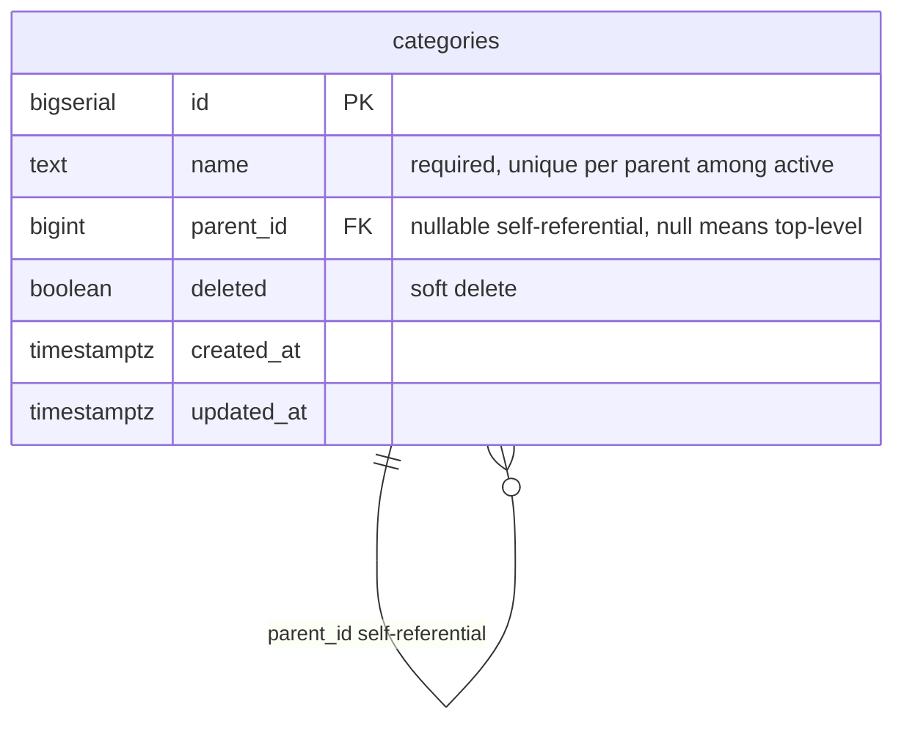
```mermaid
erDiagram
    categories ||--o{ categories : "parent_id self-referential"

    categories {
        bigserial   id          PK
        text        name        "required, unique per parent among active"
        bigint      parent_id   FK "nullable self-referential, null means top-level"
        boolean     deleted     "soft delete"
        timestamptz created_at
        timestamptz updated_at
    }
```

- **`categories`** — a **global**, nested product-category taxonomy. Unlike `products`, it is **not
  team-scoped** (there is no `team_id`): root/admin curate one shared tree and every authenticated
  user reads it. `parent_id` is a **self-referential FK** to `categories(id)` — `NULL` marks a
  top-level category — so the table is a single tree the client assembles from the flat list. `name`
  is unique among **active** siblings (`UNIQUE (COALESCE(parent_id, 0), name) WHERE deleted = FALSE`,
  which folds the NULL top-level parent into one bucket), so a soft delete frees the name for reuse.
  A category with active children cannot be deleted.

---

## document_service

`backend/services/document_service/db_migrations/`

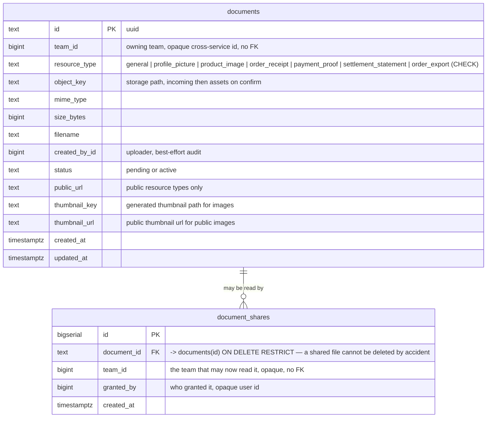
```mermaid
erDiagram
    documents ||--o{ document_shares : "may be read by"

    documents {
        text        id            PK "uuid"
        bigint      team_id       "owning team, opaque cross-service id, no FK"
        text        resource_type "general | profile_picture | product_image | order_receipt | payment_proof | settlement_statement | order_export (CHECK)"
        text        object_key    "storage path, incoming then assets on confirm"
        text        mime_type
        bigint      size_bytes
        text        filename
        bigint      created_by_id "uploader, best-effort audit"
        text        status        "pending or active"
        text        public_url    "public resource types only"
        text        thumbnail_key "generated thumbnail path for images"
        text        thumbnail_url "public thumbnail url for public images"
        timestamptz created_at
        timestamptz updated_at
    }

    document_shares {
        bigserial   id          PK
        text        document_id FK "-> documents(id) ON DELETE RESTRICT — a shared file cannot be deleted by accident"
        bigint      team_id     "the team that may now read it, opaque, no FK"
        bigint      granted_by  "who granted it, opaque user id"
        timestamptz created_at
    }
```

- **`documents`** — metadata for one stored file; the bytes live in object storage, not the DB.
  Team-scoped (`team_id` opaque, no FK). `status` goes `pending` → `active` on ConfirmUpload, which
  also moves `object_key` from the `incoming/` prefix to `assets/`. `public_url`/`thumbnail_url` are
  set only for public resource types (`profile_picture`, `product_image`); an image upload also gets
  a generated thumbnail. `order_receipt` (an order's courier slip or the marketplace's PDF) is
  **private** like `general` — it names a buyer and an address, so it is read through a short-lived
  signed URL rather than a stable public one. So is `payment_proof` (a-payment-must-carry-proof): a
  transfer slip names an account number. And `settlement_statement` (`00006`) — the .xlsx the settlement
  importer stores under the hash of its bytes before it reads it: it lists every order and what the
  platform took. And `order_export` (`00008`) — an order list exported as .xlsx
  ([one-export-is-the-list-as-a-file](technical/frontend/warehouse_order_list_decision.md#one-export-is-the-list-as-a-file)),
  stored as the person who exported it: it names buyers and their phone numbers. A partial index on `created_by_id` WHERE `resource_type = 'profile_picture'` (`00007`) serves
  `ProfilePictureErase` ([erase-deletes-the-photo-file](business/user/context_decision.md#erase-deletes-the-photo-file)),
  which deletes every photo one person uploaded — removing their share rows first, deliberately, since `RESTRICT`
  would otherwise refuse it.

- **`document_shares`** — the ONE way a document is readable outside the team that owns it
  ([a-payment-must-carry-proof](business/balance/context_decision.md#a-payment-must-carry-proof)).
  `GetDownloadUrl` matches the owning team **OR** a share row, and nothing else.
  - **The grant is made by the OWNER, in the owner's scope.** No service asks another service for
    permission, and `document_service` never learns what a payment is — it learns *"team X may read
    document D"*, which the owner is entitled to assert about their own file.
  - ⚠ **The alternative was rejected and is worth not re-proposing**: an internal, non-team-scoped
    signing path so `liability_service` could vouch for the reader. It works, and it replaces *there
    is no read without a row saying you may* with *trust that service* — one bug in its relation
    check would leak every private file in the system.
  - ⚠ **`ON DELETE RESTRICT` is the point, not a default.** A creditor accepted or rejected a payment
    by looking at the file, so evidence for a decision somebody may be asked about later cannot be
    withdrawn by the party who supplied it. **There is no unshare** for the same reason.
  - Unique on `(document_id, team_id)`: granting twice is the same fact, so a retry is a no-op rather
    than a second row or an error.

---

## inventory_service

`backend/services/inventory_service/db_migrations/`


```mermaid
erDiagram
    legacy_suppliers ||--o{ legacy_supplier_channels : "supplier_id"

    placements {
        bigserial   id           PK "the screen says Racks (00028 renamed racks)"
        bigint      warehouse_id "the WAREHOUSE team it stands in, opaque, no FK"
        text        code         "the label on the shelf, saved trimmed and lowercase (a-01-3) - CHECK; unique per warehouse among those in use"
        text        name         "optional human name"
        text        description
        timestamptz deleted_at   "soft delete, only at zero stock; NULL = in use"
        timestamptz created_at
        timestamptz updated_at
    }

    legacy_suppliers {
        bigserial   id          PK
        bigint      team_id     "MOVED to supplier_service.suppliers by san supplier move, ids kept"
        text        code
        text        name
        text        contact
        text        province
        text        city
        text        address
        text        description
        boolean     deleted     "soft delete"
        timestamptz created_at
        timestamptz updated_at
    }

    legacy_supplier_channels {
        bigserial   id          PK
        bigint      supplier_id FK "-> legacy_suppliers(id), ON DELETE CASCADE"
        text        type        "online/offline"
        text        marketplace
        text        name
        text        url
        text        contact
        text        location
        timestamptz created_at
        timestamptz updated_at
    }

    restocks ||--o{ restock_items : "restock_id"
    restocks ||--o{ restock_logs : "restock_id"
    restock_items ||--o{ restock_problem_items : "restock_id, product_id"

    restocks {
        bigserial   id                 PK
        bigint      team_id            "SELLING team that raised it, opaque, no FK (requesting_team_id until 00030)"
        bigint      warehouse_id       "target WAREHOUSE team that accepts it, opaque, no FK"
        text        status             "ongoing / arrived / accepted / lost / cancelled (mapper-guarded, #80)"
        text        invoice_ref_id     "the store's INVOICE reference (order_ref until 00030)"
        text        receipt            "optional: courier tracking number (resi)"
        text        receipt_file       "a photo of the label; '' = none"
        bigint      shipment_id        "the courier, opaque shipment_service id, no FK; 0 = not named"
        bigint      finance_account_id "the account that paid, opaque financial_account_service id; 0 = raised before it was required"
        bigint      transaction_id     "the accept's inventory transaction; 0 until accepted"
        float8      shipment_cost      "the freight the selling team paid, CHECK >= 0 (shipping_cost until 00030)"
        float8      subtotal           "00030: sum of line totals, written by every create and edit"
        float8      total              "00030: subtotal + shipment_cost, never the courier's charge"
        float8      warehouse_additional_cost "the courier's ONE charge at the door, CHECK >= 0; outside the total, inside the unit price"
        text        warehouse_additional_cost_note "what the charge was for — required above 0 by the contract"
        text        payment_type       "RestockPaymentType as text (shopee_pay/bank_account); read-only history"
        text        note               "the selling team's note on the whole restock"
        bigint      created_by_user_id "who RAISED it, opaque user_service id, no FK; 0 = not recorded"
        bigint      arrived_by_user_id "who SIGNED for the box; 0 = not signed"
        bigint      accepted_by_user_id "who COUNTED it; 0 = not accepted yet"
        bigint      lost_by_user_id    "who GAVE IT UP as lost; 0 = not lost"
        bigint      cancelled_by_user_id "who CALLED IT OFF; 0 = not cancelled"
        timestamptz arrived_at         "nullable: when the box was signed for"
        timestamptz accepted_at        "nullable: when the warehouse accepted"
        timestamptz lost_at            "nullable: when it was given up as lost"
        timestamptz cancelled_at       "nullable: when the selling team called it off"
        timestamptz created_at
        timestamptz updated_at
    }

    restock_logs {
        bigserial   id                 PK
        bigint      restock_id         FK "-> restocks(id), ON DELETE CASCADE"
        text        from_status        "status words as restocks stores them; '' = the create"
        text        to_status          "the same as from_status for an edit"
        bigint      actor_user_id      "who did it, opaque user_service id, no FK; 0 = not recorded"
        text        description        "what moved it, or what an edit changed"
        timestamptz created_at         "WHEN IT HAPPENED, set by the writer; 00030 folded the backfill's at into it"
    }

    restock_items {
        bigserial   id                 PK
        bigint      restock_id         FK "-> restocks(id), ON DELETE CASCADE; UNIQUE with product_id"
        bigint      product_id         "opaque product_service id, no FK; once per restock"
        text        sku                "snapshot at raise time"
        text        name               "snapshot"
        bigint      count              "how many were ORDERED, CHECK > 0 (quantity until 00030)"
        float8      total              "THE LINE TOTAL, the truth, CHECK >= 0 (total_price until 00030)"
        float8      price_unit         "00030: total / count, for display, rewritten whenever either changes"
        bigint      received_count     "what was IN THE BOX, broken included; 0 until accepted (received_quantity, good units only, until 00030)"
        bigint      supplier_id        "the line's supplier, opaque supplier_service id, nullable"
        bigint      supplier_channel_id "the line's store, opaque supplier_service id, nullable"
        text        note               "the selling team's note on the line"
        timestamptz created_at
        timestamptz updated_at
    }

    restock_problem_items {
        bigserial   id                  PK
        bigint      restock_id          FK "with product_id -> restock_items(restock_id, product_id), ON DELETE CASCADE"
        bigint      product_id          "the line's product — a product IS its line"
        bigint      supplier_channel_id "the line's store, copied at accept, nullable"
        text        problem_type        "broken | missing, CHECKed; UNIQUE with restock_id, product_id"
        bigint      count               "CHECK > 0"
        float8      price_unit          "the LANDED unit price, filled at accept, CHECK >= 0"
        float8      total               "price_unit x count, CHECK >= 0"
        text        note                "the warehouse's optional note"
        timestamptz created_at
    }

    warehouse_products {
        bigserial   id           PK
        bigint      warehouse_id "opaque team_service id (a WAREHOUSE team), no FK"
        bigint      product_id   "opaque product_service id, no FK"
        timestamptz created_at
    }
```

- **`warehouse_products`** (#142) — WHICH PRODUCTS A WAREHOUSE HANDLES. A warehouse must not see the
  whole catalogue: it holds no products of its own (products belong to selling teams), so a
  team-scoped product list shows it nothing useful. This is the list it should see instead.
  - **Written by `RestockRequestCreate`**, in the same transaction as the request (owner,
    2026-07-20): asking a warehouse to stock something is what makes that product visible there, and a
    request whose products the crew cannot see is one nobody can act on. A transfer's create links its products to the
    receiving warehouse the same way (a-transfer-links-its-products-to-the-receiver).
  - **Not derivable from the rack rows**, which is why it is its own table rather than a query over
    them. A product asked for but not yet received has no stock level at all, and the crew
    expecting it still have to be able to find it. "Handles" and "currently holds" are two facts.
  - `UNIQUE (warehouse_id, product_id)` — the arrangement exists once. Writers upsert with
    `ON CONFLICT DO NOTHING`, because a second restock request for a product a warehouse already
    stocks is the normal case, not an error worth failing the request over.
  - It lives in **inventory_service** because this service already owns warehouse×product facts
    (`batches` and `product_placements` are keyed on that pair) and owns the restock flow that writes it — so no
    cross-service write is needed to maintain it (HARD RULE 3).
- **Stock lives in the decided ledgers** — see [The decided ledgers](#the-decided-ledgers-00025-00026) below. `00029`
  **dropped** the tables they replaced: `stock_levels` and `stock_movements` (→ `product_placements` and their log),
  `stock_batches` and `stock_shelf_batches` (→ `batches` and their log — a rack counts units per product, never per
  batch), `stock_owner_movements` (→ the owner's `batch_logs`, the owner being `batches.team_id`) and
  `restock_received_placements` (→ the restock accept's own rack rows). Its down half is not reversible: nothing is in
  production and development data is reseeded (no-switch-over-the-ledgers-replace-todays-tables).
- **`legacy_suppliers`** / **`legacy_supplier_channels`** — **MOVED OUT** (the-supplier-gets-its-own-service).
  They were `suppliers` and `supplier_channels`; `00023_legacy_suppliers` renamed them — and their indexes and
  sequences, whose names are schema-wide — so supplier_service's `00001` can create its own under the decided
  names (every service shares one database). Nothing in inventory_service reads them any more: only
  `san supplier move` does, copying their rows into supplier_service with the ids kept
  (existing-suppliers-move-with-their-ids). ⚠ A **later** migration drops them, once the move has run on every
  database — dropping them in 00023 would have lost the rows before the command could read them.
  inventory_service is therefore pinned before supplier_service in every apply order.
- **`placements`** (`racks` until `00028`) — the physical places inside one warehouse (#129); the screen still says
  Racks (the-racks-page-is-the-placement-list). Scoped to the `warehouse_id`, which **is** a team, carrying
  `use_scope`; opaque, no FK. `code` is the label someone reads off the shelf, saved **trimmed and lowercase**
  (rack-codes-are-saved-lowercase, `CHECK (code = lower(btrim(code)))`), unique per warehouse **among those in use**
  (`WHERE deleted_at IS NULL`) — a soft-deleted rack frees its label for re-use. Soft delete is `deleted_at`, allowed
  only at zero stock (a-placement-deletes-at-zero-stock). `00028` lowercased the existing codes; two that differed only
  by case in one warehouse keep the later one's id as a suffix. What a rack holds is its `product_placements` rows.
- **`restocks`** / **`restock_items`** / **`restock_problem_items`** — a SELLING team's parcel to a WAREHOUSE
  (restock.md §Table Should We Have In Restock). They were `restock_requests`, `restock_request_items` and
  `restock_damaged_units` until **`00030`** gave them the owner's names and turned their money `DOUBLE PRECISION`
  (money-is-double-in-the-api-too) in one migration. Two-sided: `team_id` (the selling team, `use_scope` on create,
  update, cancel, mark lost) raises it to a `warehouse_id` (`use_scope` on arrive, accept, labels); either side lists
  and reads it. `status` is text, mapped in the handler (no `CHECK` IN-list, cf. #80). The **accept** is one
  transaction: the row locked, the problem rows, the decided ledgers' `restock` transaction (a batch per line with good
  units, their rack rows) and the status — so the ledger and the restock never diverge.
- **The money** is double and stored as typed. A line's `total` is the truth (a-line-is-typed-as-its-total); its
  `price_unit` is `total ÷ count`, rewritten with it, for display. `restocks.subtotal` (Σ line totals) and `total`
  (`subtotal + shipment_cost`) are written by every create and every edit, never the courier's charge
  (the-couriers-charge-stays-out-of-total), which is `warehouse_additional_cost`, one per restock with its note.
- **`count` is what was ORDERED; `received_count` is what was IN THE BOX**, broken units included
  (any-warehouse-member-counts-what-arrived). Both are kept: the gap is what somebody chases the supplier about. The
  good units are `received_count − broken`; more in the box than ordered is refused
  (accept-refuses-more-than-the-line-says). Until `00030` the column was `received_quantity` and held only the good
  units; the migration added the broken back.
- **`restock_problem_items` is what never became stock** — `broken` as typed, `missing` worked out as
  `count − received_count` (a-short-unit-at-the-door-is-missing), each with the landed unit price filled by the system
  (the-problem-price-is-filled-by-the-system) and the warehouse's optional note. Keyed by **restock and product**: a
  product appears once per restock, so the product finds its line, and the composite FK to
  `restock_items (restock_id, product_id)` says so. One row per kind (`UNIQUE (restock_id, product_id, problem_type)`);
  `00030` merged the older rows of one kind on one line.
- **Where the good units went** is the accept's own rack rows in `product_placement_logs` — there is no unplaced pile
  (there-is-no-unplaced-pile). `restock_received_placements` held this until `00029` dropped it.
- **`restock_logs`** — the trail, one append-only row per status change and per edit, from and to status
  (every-status-change-is-logged, edits-are-in-the-same-trail), written in the same transaction as the change with the
  same instant. It replaced `restock_request_events` in `00024`; `00030` keyed it by `restock_id` and folded its `at`
  into `created_at` (the backfilled rows keep their moment). The columns on `restocks` stay too: the list filters and
  sorts on them, and a filter cannot reach into a child table cheaply.
- **Who handled it, and when**: the `*_by_user_id` columns are stamped from the caller's identity, never the request
  body; opaque user_service ids with no FK, names resolved at read time. Nothing is backfilled — a restock raised
  before `00018` keeps `0` / `NULL`. The timestamps are what the list's date-range filter ranges on
  (`RestockDateField`); partial indexes on `(team_id, accepted_at)` and `(team_id, cancelled_at)` serve it.
- **A line's supplier and store** (`supplier_id`, `supplier_channel_id`) are opaque supplier_service ids, both
  optional, the store one of the supplier's (a-line-may-name-a-supplier-without-a-channel). The handler asks
  supplier_service that a newly named one is live; one a line already holds is not re-checked, so deleting a supplier
  never bricks the restocks that name it.
- **`sku` / `name`** are snapshots at raise time — the product may be renamed later, and the restock must keep reading
  as it was raised.
- `payment_type` is read-only history from before paying accounts (a-restock-must-name-the-account-that-paid).
  `shipping_code` (a free-text courier code from `00003`) was never on the contract's restock, and `00030` dropped it.

### The decided ledgers (`00025`, `00026`)

Stage 1 of [the ledger build](development_state/inventory/ledgers.md): the tables that replace `stock_levels`,
`stock_movements`, `stock_batches`, `stock_shelf_batches` and `stock_owner_movements` outright
([no-switch-over-the-ledgers-replace-todays-tables](technical/stock/design_decision.md#no-switch-over-the-ledgers-replace-todays-tables)).
They are written only through `inventory_service/inventory_ledgers`; `00029` dropped the old tables (stage 5).

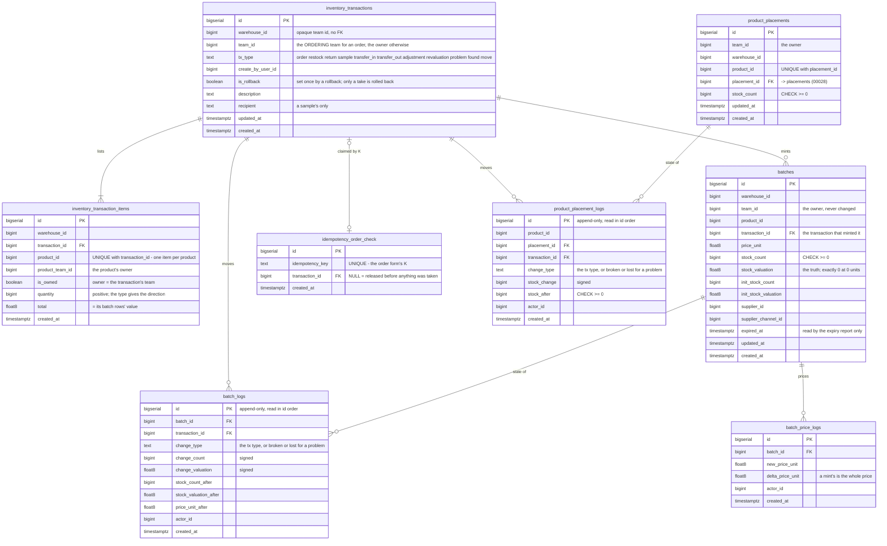
```mermaid
erDiagram
    inventory_transactions {
        bigserial   id                PK
        bigint      warehouse_id      "opaque team id, no FK"
        bigint      team_id           "the ORDERING team for an order, the owner otherwise"
        text        tx_type           "order restock return sample transfer_in transfer_out adjustment revaluation problem found move"
        bigint      create_by_user_id
        boolean     is_rollback       "set once by a rollback; only a take is rolled back"
        text        description
        text        recipient         "a sample's only"
        timestamptz updated_at
        timestamptz created_at
    }
    inventory_transaction_items {
        bigserial   id               PK
        bigint      warehouse_id
        bigint      transaction_id   FK
        bigint      product_id       "UNIQUE with transaction_id - one item per product"
        bigint      product_team_id  "the product's owner"
        boolean     is_owned         "owner = the transaction's team"
        bigint      quantity         "positive; the type gives the direction"
        float8      total            "= its batch rows' value"
        timestamptz created_at
    }
    batches {
        bigserial   id                   PK
        bigint      warehouse_id
        bigint      team_id              "the owner, never changed"
        bigint      product_id
        bigint      transaction_id       FK "the transaction that minted it"
        float8      price_unit
        bigint      stock_count          "CHECK >= 0"
        float8      stock_valuation      "the truth; exactly 0 at 0 units"
        bigint      init_stock_count
        float8      init_stock_valuation
        bigint      supplier_id
        bigint      supplier_channel_id
        timestamptz expired_at           "read by the expiry report only"
        timestamptz updated_at
        timestamptz created_at
    }
    batch_logs {
        bigserial   id                    PK "append-only, read in id order"
        bigint      batch_id              FK
        bigint      transaction_id        FK
        text        change_type           "the tx type, or broken or lost for a problem"
        bigint      change_count          "signed"
        float8      change_valuation      "signed"
        bigint      stock_count_after
        float8      stock_valuation_after
        float8      price_unit_after
        bigint      actor_id
        timestamptz created_at
    }
    batch_price_logs {
        bigserial   id               PK
        bigint      batch_id         FK
        float8      new_price_unit
        float8      delta_price_unit "a mint's is the whole price"
        bigint      actor_id
        timestamptz created_at
    }
    product_placements {
        bigserial   id           PK
        bigint      team_id      "the owner"
        bigint      warehouse_id
        bigint      product_id   "UNIQUE with placement_id"
        bigint      placement_id FK "-> placements (00028)"
        bigint      stock_count  "CHECK >= 0"
        timestamptz updated_at
        timestamptz created_at
    }
    idempotency_order_check {
        bigserial   id              PK
        text        idempotency_key "UNIQUE - the order form's K"
        bigint      transaction_id  FK "NULL = released before anything was taken"
        timestamptz created_at
    }
    product_placement_logs {
        bigserial   id             PK "append-only, read in id order"
        bigint      product_id
        bigint      placement_id   FK
        bigint      transaction_id FK
        text        change_type    "the tx type, or broken or lost for a problem"
        bigint      stock_change   "signed"
        bigint      stock_after    "CHECK >= 0"
        bigint      actor_id
        timestamptz created_at
    }
    inventory_transactions ||--|{ inventory_transaction_items : "lists"
    inventory_transactions ||--o{ batches : "mints"
    inventory_transactions ||--o{ batch_logs : "moves"
    inventory_transactions ||--o{ product_placement_logs : "moves"
    batches ||--o{ batch_logs : "state of"
    batches ||--o{ batch_price_logs : "prices"
    product_placements ||--o{ product_placement_logs : "state of"
    inventory_transactions |o--o| idempotency_order_check : "claimed by K"
```

- **Money is `double precision`**, compared at 4 places through `pkgs/san_money`, never with `=`
  ([stock-money-is-float64-compared-at-4-digits](technical/stock/design_decision.md#stock-money-is-float64-compared-at-4-digits)).
- **Logs are append-only** — no `updated_at`, no UPDATE, no DELETE
  ([ledger-logs-are-append-only](technical/ledger/mutation_and_ledger_decision.md#ledger-logs-are-append-only)).
- **Two invariants**, checked by `inventory_ledgers.Verify` in every mutation's test: both ledgers move the same units
  per product, and an item equals its batch rows.
- **Each log is indexed by its transaction alone** — `batch_logs_transaction_idx` and, since `00031`,
  `product_placement_logs_transaction_idx (transaction_id)`, which replaced `(warehouse_id, transaction_id)`: every
  reader asks by transaction and none names the warehouse
  ([placement-logs-are-indexed-by-transaction](technical/stock/design_decision.md#placement-logs-are-indexed-by-transaction)).
- **The reserve read has its own index** — `00032` `batches_owner_product_idx ON batches (team_id, product_id) WHERE
  stock_count > 0`: the take and `StockTakeQuote` sum an owner's stock of a product across EVERY warehouse in one grouped
  read, and every other batches index leads with `warehouse_id`
  ([the-reserve-is-read-once-for-every-line](business/inventory/order_decision.md#the-reserve-is-read-once-for-every-line)).
- **Written set-based** — a write locks each ledger's rows in one statement, works the rows out in memory, and stores
  each table with one `UPDATE … FROM unnest(…)` or one multi-row `INSERT`, however many lines
  ([ledger-writes-are-set-based](technical/stock/design_decision.md#ledger-writes-are-set-based)).

### Warehouse transfers (`00027`)

A selling team moving its own stock from warehouse A to warehouse B
([warehouse_transfer_decision.md](business/inventory/warehouse_transfer_decision.md)). Its two legs are ledger
transactions — `transfer_out` at create, `transfer_in` at accept — so these tables hold only what the ledgers cannot:
the trip, the lifecycle, and what went wrong at B's door. **A line's pick list and B's put-away are not stored here**:
they are the legs' `product_placement_logs`, read back.

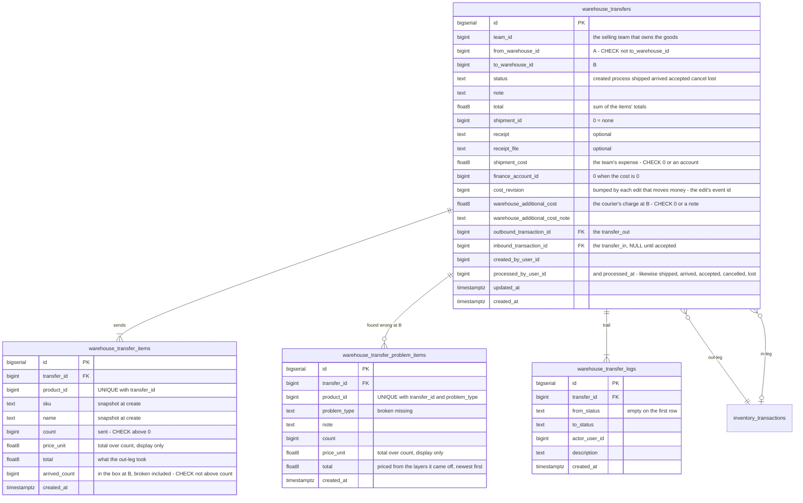
```mermaid
erDiagram
    warehouse_transfers {
        bigserial   id                             PK
        bigint      team_id                        "the selling team that owns the goods"
        bigint      from_warehouse_id              "A - CHECK not to_warehouse_id"
        bigint      to_warehouse_id                "B"
        text        status                         "created process shipped arrived accepted cancel lost"
        text        note
        float8      total                          "sum of the items' totals"
        bigint      shipment_id                    "0 = none"
        text        receipt                        "optional"
        text        receipt_file                   "optional"
        float8      shipment_cost                  "the team's expense - CHECK 0 or an account"
        bigint      finance_account_id             "0 when the cost is 0"
        bigint      cost_revision                  "bumped by each edit that moves money - the edit's event id"
        float8      warehouse_additional_cost      "the courier's charge at B - CHECK 0 or a note"
        text        warehouse_additional_cost_note
        bigint      outbound_transaction_id        FK "the transfer_out"
        bigint      inbound_transaction_id         FK "the transfer_in, NULL until accepted"
        bigint      created_by_user_id
        bigint      processed_by_user_id           "and processed_at - likewise shipped, arrived, accepted, cancelled, lost"
        timestamptz updated_at
        timestamptz created_at
    }
    warehouse_transfer_items {
        bigserial   id            PK
        bigint      transfer_id   FK
        bigint      product_id    "UNIQUE with transfer_id"
        text        sku           "snapshot at create"
        text        name          "snapshot at create"
        bigint      count         "sent - CHECK above 0"
        float8      price_unit    "total over count, display only"
        float8      total         "what the out-leg took"
        bigint      arrived_count "in the box at B, broken included - CHECK not above count"
        timestamptz created_at
    }
    warehouse_transfer_problem_items {
        bigserial   id           PK
        bigint      transfer_id  FK
        bigint      product_id   "UNIQUE with transfer_id and problem_type"
        text        problem_type "broken missing"
        text        note
        bigint      count
        float8      price_unit   "total over count, display only"
        float8      total        "priced from the layers it came off, newest first"
        timestamptz created_at
    }
    warehouse_transfer_logs {
        bigserial   id            PK
        bigint      transfer_id   FK
        text        from_status   "empty on the first row"
        text        to_status
        bigint      actor_user_id
        text        description
        timestamptz created_at
    }
    warehouse_transfers ||--|{ warehouse_transfer_items : "sends"
    warehouse_transfers ||--o{ warehouse_transfer_problem_items : "found wrong at B"
    warehouse_transfers ||--|{ warehouse_transfer_logs : "trail"
    warehouse_transfers }o--|| inventory_transactions : "out-leg"
    warehouse_transfers }o--o| inventory_transactions : "in-leg"
```

- **Money is `double precision`** like the ledgers'; the contract still carries whole rupiah until the cut-over turns it
  `double`.
- **Indexed for each side's list**, newest first: `(team_id, id DESC)`, `(from_warehouse_id, id DESC)`,
  `(to_warehouse_id, id DESC)`.

---

## region_service

`backend/services/region_service/db_migrations/`

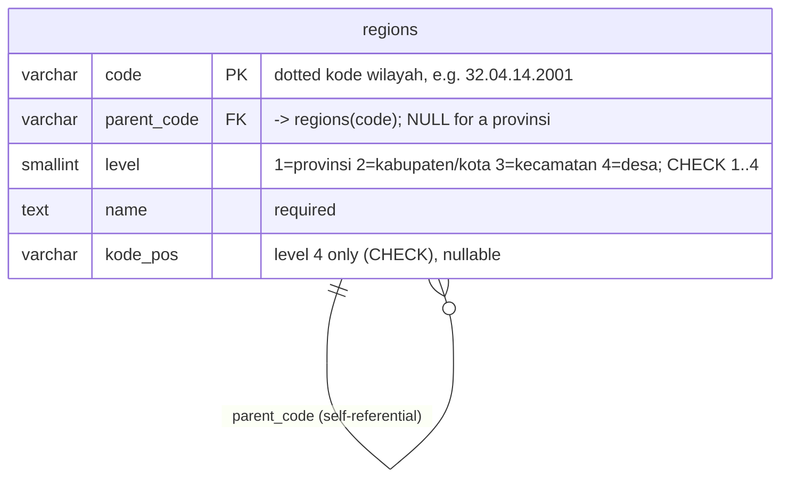
```mermaid
erDiagram
    regions ||--o{ regions : "parent_code (self-referential)"

    regions {
        varchar     code        PK "dotted kode wilayah, e.g. 32.04.14.2001"
        varchar     parent_code FK "-> regions(code); NULL for a provinsi"
        smallint    level       "1=provinsi 2=kabupaten/kota 3=kecamatan 4=desa; CHECK 1..4"
        text        name        "required"
        varchar     kode_pos    "level 4 only (CHECK), nullable"
    }
```

- **`regions`** — Indonesia's administrative hierarchy (provinsi → kabupaten/kota → kecamatan →
  desa/kelurahan) with a kode pos on each desa (#112/#114). **Global reference data**: unlike almost
  every other table here there is **no `team_id`** and no `use_scope` — regions are the same for
  everyone, so the reads are unscoped and open to any authenticated user.
- **One self-referential table, not four typed ones** (owner call). `code` — the government's dotted kode wilayah — **is** the identity, and the hierarchy is
  derivable from it (`11` → `11.01` → `11.01.01` → `11.01.01.2001`), so the upstream source loads
  near-verbatim and "children of X" is a single indexed predicate (`WHERE parent_code = ?`).
  `parent_code` is a **real self-FK** (`ON DELETE CASCADE`) — an orphan is a picker that dead-ends.
- `level` carries a range `CHECK (1..4)`: a 4-tier structure fixed by law, so unlike an enum IN-list
  it cannot drift as the data grows (cf. #80). `kode_pos` is `CHECK`-confined to level 4 — officially
  one postcode per desa, so it is a column, not a table.
- **Indexes:** `parent_code` (the cascading picker's only query), `LOWER(name) text_pattern_ops`
  (case-insensitive **prefix** typeahead — a leading-wildcard "contains" search would need `pg_trgm`),
  and `level` (a scoped search: "find a kecamatan named X").
- **The 91 599 rows are NOT in the migration.** They are generated from pinned upstream dumps and
  loaded separately — `go run ./tools/san region build-seed` then `… region load-seed` (idempotent
  upsert; ~5 s). Postgres runs in Docker and cannot read a host file, so a server-side `COPY … FROM
  '<path>'` inside the migration would not work; this mirrors how the category taxonomy is seeded
  from a file. See
  [the seed README](../backend/services/region_service/db_migrations/seed/README.md).
- **Consumers snapshot, they do not FK.** A saved address (an order's customer address, a warehouse
  address) freezes the codes **+** names **+** kode pos on its own record, so history cannot mutate
  when a desa is renamed or merged. `region_service` is reached only via its RPCs — no cross-service
  FK (HARD RULE 3).

---

## Cross-service links (logical, not enforced)

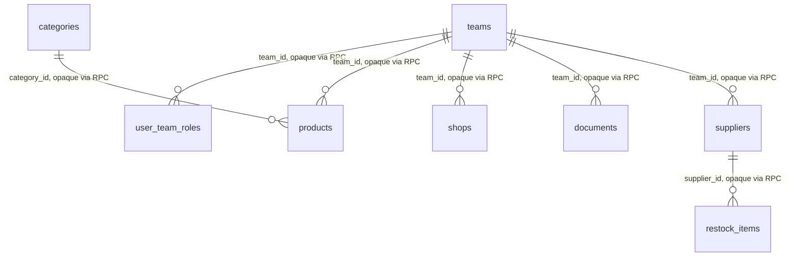
```mermaid
erDiagram
    teams ||--o{ user_team_roles : "team_id, opaque via RPC"
    teams ||--o{ products : "team_id, opaque via RPC"
    teams ||--o{ shops : "team_id, opaque via RPC"
    teams ||--o{ documents : "team_id, opaque via RPC"
    categories ||--o{ products : "category_id, opaque via RPC"
    teams ||--o{ suppliers : "team_id, opaque via RPC"
    suppliers ||--o{ restock_items : "supplier_id, opaque via RPC"
```

`user_team_roles.team_id`, `products.team_id`, `documents.team_id`,
`team_return_configurations.team_id` / `.warehouse_id`, and `product_return_maps.team_id` / `.shared_product_id` /
`.own_product_id` point at rows owned by other services. They carry no database foreign key by design (HARD RULE 3 — services stay independent);
the owning service resolves them over Connect RPC.

---

## revenue_service — REMOVED

⚠ **The service is gone; its TABLE is not.** `revenue_service` was deleted on 2026-08-28 with its
statistics deferred — see
[revenue-service-is-removed-and-statistics-deferred](business/settlement/context_decision.md#revenue-service-is-removed-and-statistics-deferred).

**No drop migration was written, deliberately.** `order_revenues` and every row in it remain in the
database, so a future statistics service can backfill the history instead of starting at zero. Its
goose version table `revenue_service_version` remains too, and a fresh database simply never creates
either — the migrations were deleted with the service, so `migrate up-all` no longer knows about them.

⚠ **A fresh database and an existing one therefore differ here**, and that is the accepted cost of
keeping the history: an old database has an orphaned table, a new one has nothing. Whichever service
picks the statistics back up owns the decision about which shape to standardise on.

The columns it held — `revenue`, `cogs`, `shipping_cost`, `expected_margin`, `cost_known`,
`voided_at` — are all still carried by `OrderPlacedEvent` / `OrderCancelledEvent`, which
`selling_service` keeps publishing with no consumer for exactly this reason.

## expense_service

`backend/services/expense_service/db_migrations/`

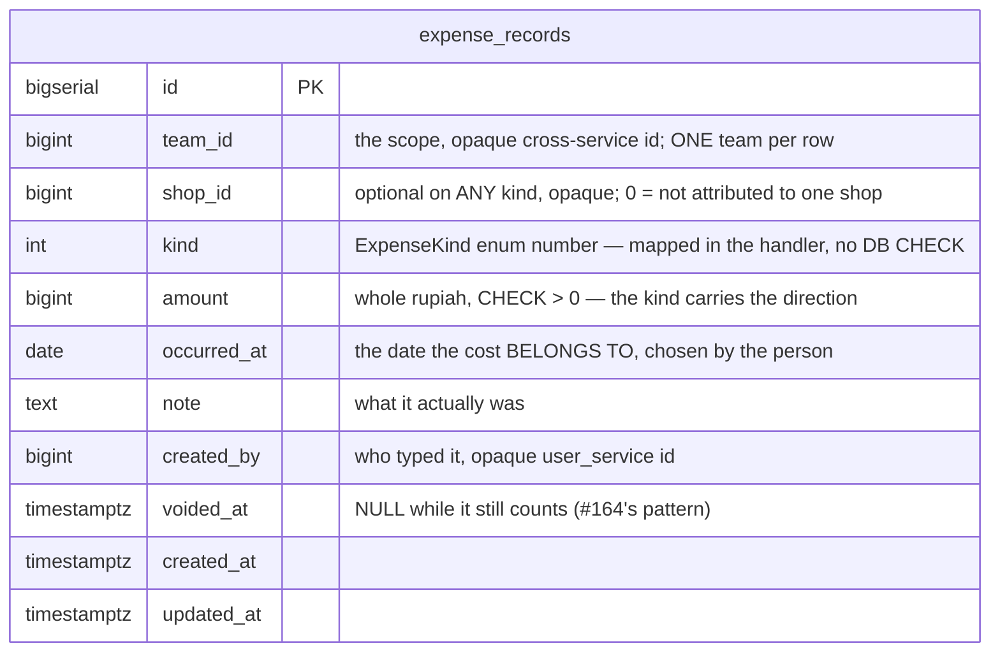
```mermaid
erDiagram
    expense_records {
        bigserial   id          PK
        bigint      team_id     "the scope, opaque cross-service id; ONE team per row"
        bigint      shop_id     "optional on ANY kind, opaque; 0 = not attributed to one shop"
        int         kind        "ExpenseKind enum number — mapped in the handler, no DB CHECK"
        bigint      amount      "whole rupiah, CHECK > 0 — the kind carries the direction"
        date        occurred_at "the date the cost BELONGS TO, chosen by the person"
        text        note        "what it actually was"
        bigint      created_by  "who typed it, opaque user_service id"
        timestamptz voided_at   "NULL while it still counts (#164's pattern)"
        timestamptz created_at
        timestamptz updated_at
    }
```

- **`expense_records`** (#161/#167) — money the business spent that **no order caused**: ads budget,
  payroll, rent. `revenue_service` already knows what an order earned; this is everything else.
  - **A PERSON TYPES IT**, and every decision here follows from that. A revenue row is written by the
    system from an order and frozen (#153); a cost row is entered by hand about a period, so it can be
    wrong — hence correctable, hence `created_by`, hence `voided_at` rather than a delete.
  - **`amount` is CHECK > 0.** The `kind` already says the money is going out, so a signed amount would
    let a negative cost silently become revenue. It is a database constraint rather than a handler rule
    because that is the one arithmetic mistake this table must not permit.
  - **`occurred_at` is a DATE the person picks**, not the insert timestamp. Payroll is paid on the 5th
    for the month before, and filing it under the 5th puts it in the wrong month for every report that
    matters. A date, not a timestamp — nobody records the hour the rent was paid.
  - **ONE team per row.** A warehouse *is* a team, so warehouse payroll is a cost on that warehouse's
    `team_id` — and it is **never recharged onward** to the selling teams it fulfils for (owner,
    2026-07-21). A recharge would have been a second team here, which is why it was settled before
    this table was written rather than migrated in later.
  - **`shop_id` is optional on EVERY kind** (owner), not only ads: a team running two shops may split
    its packing wages or a subscription between them.
  - **`kind` has no DB `CHECK`** (cf. #80). Proto enums are open and append-only, so a check
    constraint would reject a kind the contract already allows on the day one is added.
  - Indexed on `(team_id, occurred_at DESC, id DESC) WHERE voided_at IS NULL` — every screen and every
    total asks for one team's live costs over a period.

---

## liability_service

`backend/services/liability_service/db_migrations/`

> ⚠ **These tables were called `settlement_*` until 2026-08-28.** The service renamed because the word
> `settlement` now means the MARKETPLACE PAYOUT — see
> [the-name-settlement-moves-to-the-payout](business/settlement/context_decision.md#the-name-settlement-moves-to-the-payout).
>
> Migrations 00001–00003 create the tables under the new names. **`00004_adopt_legacy_settlement_tables.sql`**
> then copies any rows a database still holds under the old names and drops them — including the old
> `settlement_service_version` goose table, which would otherwise hand a future (real) `settlement_service`
> a migration history that was never its own. On a fresh database every step of 00004 is a no-op.

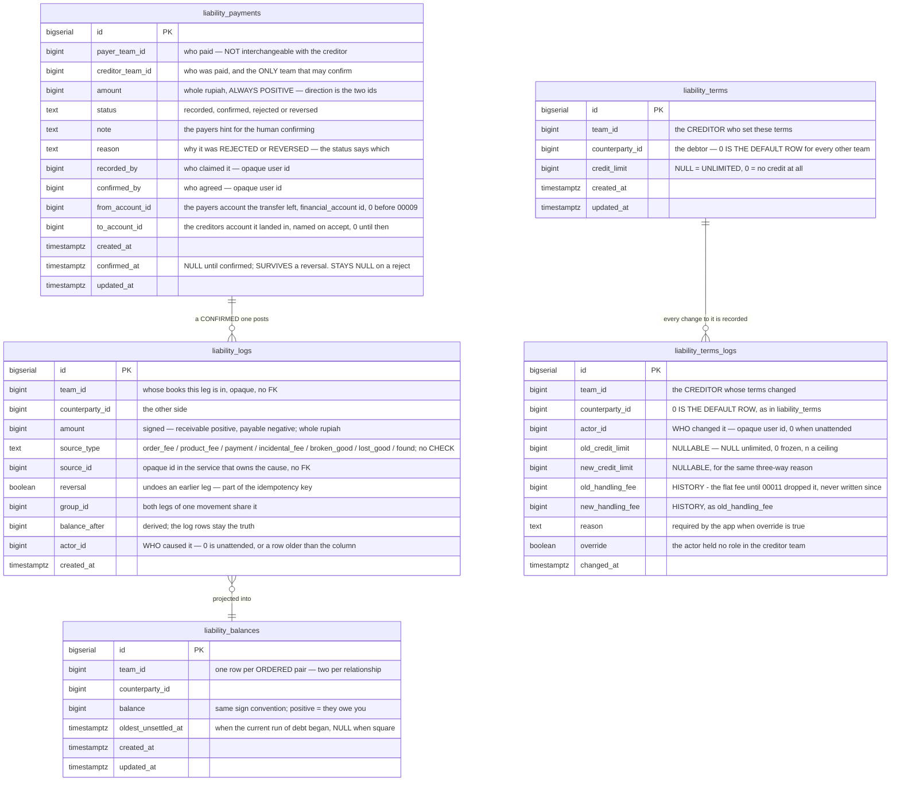
```mermaid
erDiagram
    liability_logs }o--|| liability_balances : "projected into"
    liability_payments ||--o{ liability_logs : "a CONFIRMED one posts"
    liability_terms ||--o{ liability_terms_logs : "every change to it is recorded"
    liability_terms {
        bigserial   id                PK
        bigint      team_id           "the CREDITOR who set these terms"
        bigint      counterparty_id   "the debtor — 0 IS THE DEFAULT ROW for every other team"
        bigint      credit_limit      "NULL = UNLIMITED, 0 = no credit at all"
        timestamptz created_at
        timestamptz updated_at
    }

    liability_logs {
        bigserial   id              PK
        bigint      team_id         "whose books this leg is in, opaque, no FK"
        bigint      counterparty_id "the other side"
        bigint      amount          "signed — receivable positive, payable negative; whole rupiah"
        text        source_type     "order_fee / product_fee / payment / incidental_fee / broken_good / lost_good / found; no CHECK"
        bigint      source_id       "opaque id in the service that owns the cause, no FK"
        boolean     reversal        "undoes an earlier leg — part of the idempotency key"
        bigint      group_id        "both legs of one movement share it"
        bigint      balance_after   "derived; the log rows stay the truth"
        bigint      actor_id        "WHO caused it — 0 is unattended, or a row older than the column"
        timestamptz created_at
    }

    liability_balances {
        bigserial   id                  PK
        bigint      team_id             "one row per ORDERED pair — two per relationship"
        bigint      counterparty_id
        bigint      balance             "same sign convention; positive = they owe you"
        timestamptz oldest_unsettled_at "when the current run of debt began, NULL when square"
        timestamptz created_at
        timestamptz updated_at
    }

    liability_payments {
        bigserial   id               PK
        bigint      payer_team_id    "who paid — NOT interchangeable with the creditor"
        bigint      creditor_team_id "who was paid, and the ONLY team that may confirm"
        bigint      amount           "whole rupiah, ALWAYS POSITIVE — direction is the two ids"
        text        status           "recorded, confirmed, rejected or reversed"
        text        note             "the payers hint for the human confirming"
        text        reason           "why it was REJECTED or REVERSED — the status says which"
        bigint      recorded_by      "who claimed it — opaque user id"
        bigint      confirmed_by     "who agreed — opaque user id"
        bigint      from_account_id  "the payers account the transfer left, financial_account id, 0 before 00009"
        bigint      to_account_id    "the creditors account it landed in, named on accept, 0 until then"
        timestamptz created_at
        timestamptz confirmed_at     "NULL until confirmed; SURVIVES a reversal. STAYS NULL on a reject"
        timestamptz updated_at
    }

    liability_terms_logs {
        bigserial   id                    PK
        bigint      team_id               "the CREDITOR whose terms changed"
        bigint      counterparty_id       "0 IS THE DEFAULT ROW, as in liability_terms"
        bigint      actor_id              "WHO changed it — opaque user id, 0 when unattended"
        bigint      old_credit_limit      "NULLABLE — NULL unlimited, 0 frozen, n a ceiling"
        bigint      new_credit_limit      "NULLABLE, for the same three-way reason"
        bigint      old_handling_fee      "HISTORY - the flat fee until 00011 dropped it, never written since"
        bigint      new_handling_fee      "HISTORY, as old_handling_fee"
        text        reason                "required by the app when override is true"
        boolean     override              "the actor held no role in the creditor team"
        timestamptz changed_at
    }
```

- **`liability_logs`** — the ledger of what teams owe each other (#183). Immutable and
  append-only: a correction is a
  **compensating entry**, never an update or delete, because a ledger you can edit is not evidence of
  anything.
  - **Every movement writes TWO legs in one transaction**, one per side, holding exact negatives —
    posting half a movement is impossible by construction rather than by discipline. `group_id` (from
    `liability_group_seq`) is what lets "show me both sides of this posting" be a query instead of a
    heuristic match on amount, opposite sign and a near timestamp.
  - **One sign convention, stated once**: from `team_id`'s side, a receivable is **positive** and a
    payable is **negative**. Nothing anywhere returns an `abs()` of it under another name — two fields
    called "payable" that disagree in sign is a bug that reaches the screen. The UI renders direction
    as **words** from this one signed number.
  - **`(source_type, source_id)` rather than a note.** "Why do I owe this?" is the first question
    anyone asks a balance, and a note cannot be joined, filtered or counted. It is also what lets an
    order's fee and its cancellation reversal read as one story.
  - **`UNIQUE (team_id, counterparty_id, source_type, source_id, reversal)` is load-bearing.** The
    order fees arrive on Pub/Sub, which delivers **at least once**, so a redelivered order is normal
    rather than an error — the consumer can only safely ACK a duplicate because this index makes the
    duplicate harmless. `counterparty_id` is in the key because **one order posts several entries** (a
    handling fee plus one product fee per owning team), and `reversal` is in it because a compensating
    entry shares the other four values with the entry it undoes.
  - `CHECK (team_id <> counterparty_id)` — a team owing itself could only come from a bug upstream,
    and a ledger is the wrong place to discover one quietly.
- **`liability_balances`** — a **projection** of the entries, kept because "what do we owe each
  other" is asked far more often than it changes. Every balance must stay recomputable by summing the
  entries alone, or the ledger cannot be audited; there is a test that does exactly that.
  - **`UNIQUE (team_id, counterparty_id)` is in the FIRST migration, deliberately.** Lock-then-read
    cannot protect a row that does not exist yet: two concurrent first-postings for a new pair both
    find nothing, both insert, and one update is lost. Only a database constraint prevents it, and
    the posting path upserts against this index (`ON CONFLICT … DO UPDATE … RETURNING`) so the
    database serialises them.
  - **Two rows per relationship**, one from each side. Both teams then read their own position with
    the same query and the same sign convention, and neither has to know which way round the pair was
    stored.
  - **`oldest_unsettled_at` is the age of the current NON-ZERO RUN** — set as the balance leaves zero,
    cleared as it returns. Ageing is the point of the position screen ("Rp 2.4m, oldest unsettled 47
    days" is actionable in a way a balance alone is not). A per-entry FIFO age would be truer under
    partial payments and needs an allocation model — which payment settled which entry — that nothing
    here has; see §5.3 of the brainstorming doc.
- **`liability_terms`** — a **creditor's terms toward one debtor** (#186/#189): how far it will let them run.
  - **`counterparty_id = 0` IS the default row**, applying to every team without one of their own.
    That is the whole override mechanism, and it is why 0 is not a valid team id anywhere else. The
    lookup is "this debtor's row, else the default, else nothing".
  - ⚠ **`credit_limit` NULL is UNLIMITED; `0` is NO CREDIT AT ALL.** They are opposites, and encoding
    unlimited as 0 is the trap — the day somebody wants to freeze a team they will type 0 and grant
    infinite credit instead. Removing a limit **deletes the row**, which is why the API has a delete.
  - ⛔ **No markup** (`00010` dropped `product_markup_bp`, and the logs' `old_/new_product_markup_bp` with it —
    [the-ledger-charges-the-frozen-line-total](technical/balance/team_balance_design_decision.md#the-ledger-charges-the-frozen-line-total)).
    The markup is the product's, applied by inventory's take and frozen on `order_items.total`; the product fee
    posts those totals and reads nothing here. `liability_terms_non_negative` was rebuilt over the fee and the limit,
    since dropping the column would have dropped the whole CHECK.
  - ⛔ **No fee** (`00011` dropped `handling_fee` — step 5 of
    [the-flat-rate-is-dropped-last](business/teams/warehouse/context_decision.md#the-flat-rate-is-dropped-last)). The
    warehouse's fee is warehouse_service's rate, frozen on `orders.warehouse_fee` and posted from `OrderPlaced`.
    `liability_terms_non_negative` is rebuilt again, over the limit alone. The log keeps `old_/new_handling_fee` as
    history: unlike the markup's, they recorded real money.
  - **The two fees default differently, deliberately.** An order with no frozen `warehouse_fee` charges the warehouse
    nothing — it is a *price*, frozen on the order, and liability guesses none. The product fee
    needs no row at all: it is a *cost transfer* — the goods left the owner's stock and do not come back — and
    it is the lines' frozen totals. See `docs/services/liability_service/rpc.md`.
  - Created with #186 rather than #189, because the order fees have to READ it before anything writes
    it. #189 added the RPCs that write it — until then every row was absent, so every fee was 0 and
    every credit limit unlimited.
- **`liability_terms_logs`** — WHO changed a limit, when, and why
  ([a-limit-change-is-recorded](business/balance/context_decision.md#a-limit-change-is-recorded)).
  The threshold is the ONLY control this design has — no cycle, no due date, no overdue state — so
  lowering one is the most consequential act in this context: it stops a team trading. An unrecorded
  override is the difference between a supervisor and a back door.
  - ⚠ **BOTH limit columns are NULLABLE, and that is the entire point of the table.** `NULL`, `0` and
    a number are three different acts — unlimited, frozen, a real ceiling — and a NOT NULL column
    flattens the first into the second, recording *"they removed the limit"* as *"they froze the
    team"*. Those are opposites, and the wrong one of the two is the one that stops a team trading.
  - **`override` is DERIVED BY THE SERVER** from the role the access interceptor resolved: it is true
    when the actor held **no role in the creditor team**, i.e. they were let in by the root-team
    bypass. Never sent by the caller — whether a write was an override is a fact about who made it,
    and the caller is the one party with a reason to misreport it.
  - **A DELETE is logged as a removal**, with `new_credit_limit` NULL rather than 0. Deleting a pair's
    terms lifts the ceiling entirely, so recording 0 would say the act froze the team it freed.
  - **A no-op delete logs nothing.** The RPC still succeeds — the caller asked for a state and it
    holds — but nothing changed, and a history full of no-ops is one nobody reads.
  - ⚠ **It is NOT `liability_logs`, and the two must never merge**
    ([two-logs-two-names](technical/balance/team_balance_design_decision.md#two-logs-two-names)). This
    is a RULE that changed; that one is MONEY that moved. They appear on the same page because
    somebody asking *"why is this team blocked"* needs both, and only one of them is a ledger.
- **`liability_payments`** — one team's claim that it paid another, and the creditor's agreement that
  the money arrived (#188). **Liability is two-phase**: the payer RECORDS, the creditor CONFIRMS, and
  only the confirm posts to the ledger.
  - ⚠ **It is NOT the ledger.** This table holds the claim; `liability_logs` holds what moved. A payment
    sitting at `recorded` has changed no balance at all — one side asserting a transfer is not evidence
    that it landed, and only the creditor can see the money arrive. That asymmetry is also why
    counterparties are teams only: an external party has no account and could never confirm.
  - **`amount` is always POSITIVE**; direction lives in the two team columns. A negative payment would be
    a refund, which is a different thing and is not modelled.
  - ⚠ **`rejected` AND `reversed` ARE DIFFERENT FAILURES.** Rejecting refuses a CLAIM and posts
    **nothing**; reversing undoes a CONFIRMATION with a compensating entry. Only the second ever
    touched the ledger. Before `rejected` existed, a creditor facing a payment that never landed could
    only leave it pending forever or confirm-then-reverse — two real movements for money that never
    moved. `balance_context.md` §Payment Flow draws both arms and the lifecycle makes both terminal.
  - **One `reason` column serves both**, because the `status` already says which act filled it. Two
    columns would leave one permanently NULL on every row. It was `reversal_reason` while only one act
    could write it (migration `00007`).
  - **A reject leaves `confirmed_by` / `confirmed_at` empty.** Borrowing them to record who refused
    would make every *"when was this agreed"* query count refusals as agreements.
  - **A reversal is a compensating entry, never an edit.** The confirmation stays and an
    equal-and-opposite entry joins it — "it was briefly settled" is what an audit needs to see.
    `confirmed_at` / `confirmed_by` SURVIVE a reversal: when it was agreed, and by whom, are facts.
  - **`liability_payments_awaiting_idx` is the badge query** — `(creditor_team_id, status, id DESC)`, the
    creditor's inbox of what is waiting on them. A payment nobody notices is a debt that stays open for
    no reason.
  - ⚠ **Confirm locks the row `FOR UPDATE`.** It is a check-then-act on money, and two managers clicking
    Confirm in the same second is ordinary here — without the lock both reads see `recorded`, both post,
    and the debt is paid off twice. Proven against a real Postgres in `payment_confirm_race_test.go`
    (8 concurrent confirms → exactly one succeeds, balance lands on 0).
  - **`from_account_id` / `to_account_id` say where the money LEFT and where it LANDED**
    ([a-team-payment-posts-on-accept](business/financial_account/context_decision.md#a-team-payment-posts-on-accept),
    migration `00009`) — opaque financial_account_service ids, no FK. The payer names `from` when recording,
    the creditor names `to` when accepting; each is checked as one of that team's active, named accounts
    before it is written. On accept both ride `LiabilityPaymentAccepted`, and the accounts post one
    `team_payment` row on each. `0` = not named: `to` until accepted, and `from` on every payment recorded
    before `00009` — that one's acceptance posts only the `to` leg.

---

## settlement_service

`backend/services/settlement_service/db_migrations/`

The ledger of **what the marketplace pays us** for an order.

> ⚠ **Not `liability_service` above**, which is what TEAMS OWE EACH OTHER. That service held this name
> until 2026-08-28 — see
> [the-name-settlement-moves-to-the-payout](business/settlement/context_decision.md#the-name-settlement-moves-to-the-payout).
> The two are easy to confuse: both are order-aware ledgers with a state projection. Only this one is
> **allowed to never balance**.

**The one idea.** `initial_total` is a frozen copy of `order.platform_total` — what the buyer
actually paid, a fact rather than a prediction. The running balance is therefore not drift from a
guess, it is exactly *how much of what the buyer paid never reached us*: the platform's take, which the
platform never itemises. So the balance **never reaches zero, and that is correct** — there is no
`settled` flag and no outstanding figure anywhere in this schema.

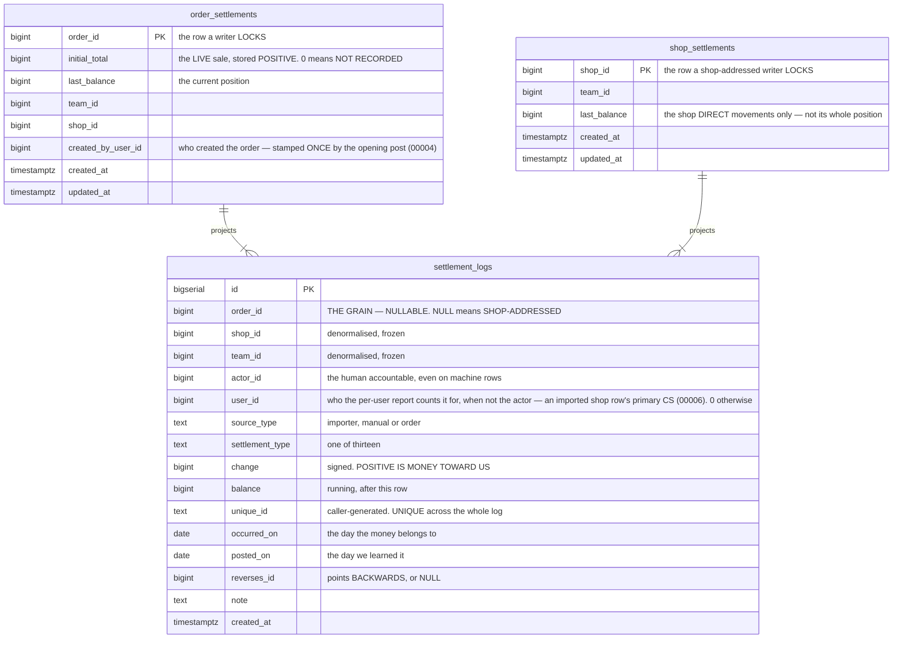
```mermaid
erDiagram
  settlement_logs {
    bigserial id PK
    bigint order_id "THE GRAIN — NULLABLE. NULL means SHOP-ADDRESSED"
    bigint shop_id "denormalised, frozen"
    bigint team_id "denormalised, frozen"
    bigint actor_id "the human accountable, even on machine rows"
    bigint user_id "who the per-user report counts it for, when not the actor — an imported shop row's primary CS (00006). 0 otherwise"
    text source_type "importer, manual or order"
    text settlement_type "one of thirteen"
    bigint change "signed. POSITIVE IS MONEY TOWARD US"
    bigint balance "running, after this row"
    text unique_id "caller-generated. UNIQUE across the whole log"
    date occurred_on "the day the money belongs to"
    date posted_on "the day we learned it"
    bigint reverses_id "points BACKWARDS, or NULL"
    text note
    timestamptz created_at
  }

  order_settlements {
    bigint order_id PK "the row a writer LOCKS"
    bigint initial_total "the LIVE sale, stored POSITIVE. 0 means NOT RECORDED"
    bigint last_balance "the current position"
    bigint team_id
    bigint shop_id
    bigint created_by_user_id "who created the order — stamped ONCE by the opening post (00004)"
    timestamptz created_at
    timestamptz updated_at
  }

  shop_settlements {
    bigint shop_id PK "the row a shop-addressed writer LOCKS"
    bigint team_id
    bigint last_balance "the shop DIRECT movements only — not its whole position"
    timestamptz created_at
    timestamptz updated_at
  }

  order_settlements ||--|{ settlement_logs : projects
  shop_settlements ||--|{ settlement_logs : projects
```

### Two grains, and why there are two accounts

A row is addressed to an **order** or to a **shop** (`an-entry-names-an-order-or-a-shop`). Both carry
`shop_id` and `team_id`, so both fold into the same daily report — but only the order grain has an
account keyed by order.

| | order-addressed | shop-addressed |
| --- | --- | --- |
| `order_id` | set | **NULL** |
| the account | `order_settlements` | `shop_settlements` |
| what it is for | one order's payout | a platform **withdrawal**, a **system adjustment** — things that name no order |
| `initial_total` | yes | — a sale belongs to an order, and the handler refuses one without |
| on `OrderSettlementDetail` | yes | **never** — that panel is one order's log |

⚠ **BOTH ACCOUNTS EXIST TO BE LOCKED**, not merely read. Each is a read-modify-write on a running
balance, so without a row to take `FOR UPDATE` two concurrent posts read the same previous value and
the second erases the first. Proven absent for both grains in `post_entry_race_test.go`.

⛔ **`shop_settlements.last_balance` IS NOT THE SHOP'S POSITION.** It sums the shop's DIRECT rows only.
The order-addressed rows carry the same `shop_id` and fold into the same daily report, so
`shop_settlement_daily_reports.close_balance` is a different and larger number. Two figures, one word.

### The sign convention, and the one place it flips

| | |
| --- | --- |
| `settlement_logs.change` | **positive is money toward us** — so `initial_total` is NEGATIVE (the platform owes us the sale) and `fund` is POSITIVE |
| `order_settlements.initial_total` | the sale as a **person** says it, **POSITIVE** |
| where they meet | the projection, and nowhere else — no screen negates by hand |

Both state figures are recomputable from the log alone, which is what makes the ledger auditable:

```
last_balance  =  SUM(change) over every row
initial_total = −SUM(change) over { initial_total, initial_total_cancel }
```

The second line is why a **cancel needs no special case**: its `change` is the exact opposite of the
sale's, so the running sum returns to zero on its own.

### Indexes, and what each is for

| index | answers |
| --- | --- |
| `settlement_logs_unique_idx` (unique_id) | ⚠ **the idempotency key, GLOBAL** (`00002`). All three writers retry; this is what makes a retried cancel absorb instead of crediting twice. Scoped to `(order_id, unique_id)` until `order_id` became nullable — Postgres treats NULL as distinct from NULL, so the scoped form would have admitted a shop-addressed key twice, silently |
| `settlement_logs_order_idx` (order_id, id) **WHERE order_id IS NOT NULL** | the panel's running balance, oldest first. ⚠ **Partial** (`00003`): with the column nullable, every shop-addressed row would otherwise sit in this index under one NULL group the panel never reads |
| `settlement_logs_team_occurred_idx` / `_shop_occurred_idx` | a period's movement for a team or a shop |
| `order_settlements_team_balance_idx` (team_id, last_balance) | the list screen, ranked by loss |
| `order_settlements_shop_idx` (shop_id, last_balance) | the same, narrowed to one shop |

### The reports — folded from the log, never written by the ledger (`00005`)

The daily tables are built by settlement's own webhook consuming `SettlementLogPosted`
([the-fold-owns-the-report-not-the-writer](business/settlement/context_decision.md#the-fold-owns-the-report-not-the-writer)).
**Every table below is DERIVED** — `AnalyticReplayCompute` can rebuild it — and nothing on the ledger's
write path reads or writes one.

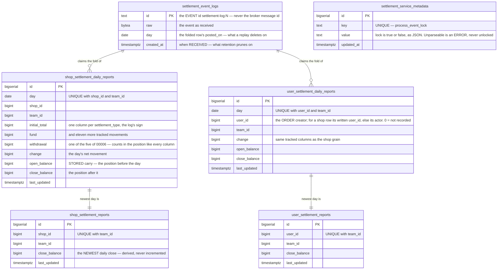
```mermaid
erDiagram
  settlement_event_logs {
    text id PK "the EVENT id settlement-log:N — never the broker message id"
    bytea raw "the event as received"
    date day "the folded row's posted_on — what a replay deletes on"
    timestamptz created_at "when RECEIVED — what retention prunes on"
  }

  shop_settlement_daily_reports {
    bigserial id PK
    date day "UNIQUE with shop_id and team_id"
    bigint shop_id
    bigint team_id
    bigint initial_total "one column per settlement_type, the log's sign"
    bigint fund "and eleven more tracked movements"
    bigint withdrawal "one of the five of 00006 — counts in the position like every column"
    bigint change "the day's net movement"
    bigint open_balance "STORED carry — the position before the day"
    bigint close_balance "the position after it"
    timestamptz last_updated
  }

  user_settlement_daily_reports {
    bigserial id PK
    date day "UNIQUE with user_id and team_id"
    bigint user_id "the ORDER creator; for a shop row its written user_id, else its actor. 0 = not recorded"
    bigint team_id
    bigint change "same tracked columns as the shop grain"
    bigint open_balance
    bigint close_balance
    timestamptz last_updated
  }

  shop_settlement_reports {
    bigserial id PK
    bigint shop_id "UNIQUE with team_id"
    bigint team_id
    bigint close_balance "the NEWEST daily close — derived, never incremented"
    timestamptz last_updated
  }

  user_settlement_reports {
    bigserial id PK
    bigint user_id "UNIQUE with team_id"
    bigint team_id
    bigint close_balance
    timestamptz last_updated
  }

  settlement_service_metadata {
    bigserial id PK
    text key "UNIQUE — process_event_lock"
    text value "lock is true or false, as JSON. Unparseable is an ERROR, never unlocked"
    timestamptz updated_at
  }

  settlement_event_logs ||--o{ shop_settlement_daily_reports : "claims the fold of"
  settlement_event_logs ||--o{ user_settlement_daily_reports : "claims the fold of"
  shop_settlement_daily_reports ||--|| shop_settlement_reports : "newest day is"
  user_settlement_daily_reports ||--|| user_settlement_reports : "newest day is"
```

| | |
| --- | --- |
| **the tracked columns** | `initial_total`, `initial_total_cancel`, `other`, `fund`, `external_ads_fee`, `affiliate_fee`, `marketplace_adjustment`, `system_adjustment`, and since `00006` `withdrawal`, `shipment_adjustment`, `logistic_reimbursement`, `platform_reimbursement`, `marketplace_program` — the settlement_type TEXT is the column name — plus `change`. ⚠ **Widened WITH `SettlementPost`, never after**: the fold refuses a type it has no column for |
| **`withdrawal` is in the position** | summed into `change` and the carry like every column ([withdrawal-counts-in-the-position](business/settlement/context_decision.md#withdrawal-counts-in-the-position)) — so `close_balance` is the shortfall PLUS what was withdrawn, and the report calls it *Position to date* |
| **who a shop row counts for** | the user grain folds an order row for its creator, and a shop row for its `settlement_logs.user_id` when set — an imported shop row's primary CS, carried on the event — else for its actor ([settlement-asks-the-shop-for-its-primary-cs](business/settlement/settlement_importer_decision.md#settlement-asks-the-shop-for-its-primary-cs)) |
| **the carry** | `open(D) = Σ change before D`, `close(D) = Σ change up to D` ([the-carry-materialises-the-day-boundary-position](business/settlement/context_decision.md#the-carry-materialises-the-day-boundary-position)). Maintained by increment: a late event shifts every later day |
| **a quiet day has NO row** | a position read falls back to the last row at or before the date |
| **the dedup and the fold share ONE transaction** | a failure rolls the claim back with the compute, so the redelivery is really reprocessed |
| **no genesis row** | the fold opens a new scope at 0, true for a log with nothing older ([genesis-is-not-needed-when-the-log-starts-empty](business/settlement/context_decision.md#genesis-is-not-needed-when-the-log-starts-empty)) |
| **retention** | `settlement_event_logs` is pruned at **45 days** from receipt by `AnalyticMaintenanceRun` — longer than the broker's 31, or a redelivery would fold twice |

| index | answers |
| --- | --- |
| `*_daily_reports_scope_day_idx` (scope, team_id, day) UNIQUE | the fold's upsert target, its `prev` lookup and its later-day shift — equality on the scope, a range on day |
| `*_daily_reports_team_day_idx` (team_id, day) | a team's series and its ranking over a window |
| `*_daily_reports_day_idx` / `settlement_event_logs_day_idx` | the replay's delete — three tables, one predicate |
| `settlement_event_logs_created_idx` | the retention prune |

### Two things the schema deliberately does NOT hold

- **A non-null `order_id`.** It WAS `NOT NULL` until
  [an-entry-names-an-order-or-a-shop](business/settlement/context_decision.md#an-entry-names-an-order-or-a-shop)
  made it nullable (`00003`), which is what gives a platform **withdrawal** or a `system_adjustment` a
  shop-addressed home.
- **The shop's primary CS as a table.** An imported shop row's `user_id` is ASKED of the shop
  (`ShopAccessCheck`) before the write and kept on the row — settlement stores the answer, never the shop.
  The `00006` migration also rewrote any `source_type` `exporter` to `importer`
  ([the-source-is-named-importer](business/settlement/settlement_importer_decision.md#the-source-is-named-importer)).
- **No `order_ref`, names or `goods_cost`.** Settlement keys on our internal order id and never sees the
  marketplace's reference; the names and the cost live in `selling_service`, and a service does not
  read another's tables. The screens supply all four from where they already are.

---

## settlement_importer_service

`backend/services/settlement_importer_service/db_migrations/`

A platform statement, uploaded as a file and posted to the settlement ledger line by line
([settlement_importer.md](business/settlement/settlement_importer.md)). **It owns no ledger** — the rows it
posts are `settlement_logs` rows, written by `SettlementPost` under the uploader's token. These two tables
say what an upload DID: the import screen pages over the first, one file's page over the second.

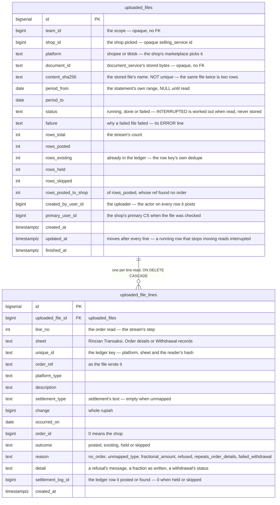
```mermaid
erDiagram
  uploaded_files ||--o{ uploaded_file_lines : "one per line read, ON DELETE CASCADE"
  uploaded_files {
    bigserial id PK
    bigint team_id "the scope — opaque, no FK"
    bigint shop_id "the shop picked — opaque selling_service id"
    text platform "shopee or tiktok — the shop's marketplace picks it"
    text document_id "document_service's stored bytes — opaque, no FK"
    text content_sha256 "the stored file's name. NOT unique — the same file twice is two rows"
    date period_from "the statement's own range, NULL until read"
    date period_to
    text status "running, done or failed — INTERRUPTED is worked out when read, never stored"
    text failure "why a failed file failed — its ERROR line"
    int rows_total "the stream's count"
    int rows_posted
    int rows_existing "already in the ledger — the row key's own dedupe"
    int rows_held
    int rows_skipped
    int rows_posted_to_shop "of rows_posted, whose ref found no order"
    bigint created_by_user_id "the uploader — the actor on every row it posts"
    bigint primary_user_id "the shop's primary CS when the file was checked"
    timestamptz created_at
    timestamptz updated_at "moves after every line — a running row that stops moving reads interrupted"
    timestamptz finished_at
  }
  uploaded_file_lines {
    bigserial id PK
    bigint uploaded_file_id FK "uploaded_files"
    int line_no "the order read — the stream's step"
    text sheet "Rincian Transaksi, Order details or Withdrawal records"
    text unique_id "the ledger key — platform, sheet and the reader's hash"
    text order_ref "as the file wrote it"
    text platform_type
    text description
    text settlement_type "settlement's text — empty when unmapped"
    bigint change "whole rupiah"
    date occurred_on
    bigint order_id "0 means the shop"
    text outcome "posted, existing, held or skipped"
    text reason "no_order, unmapped_type, fractional_amount, refused, repeats_order_details, failed_withdrawal"
    text detail "a refusal's message, a fraction as written, a withdrawal's status"
    bigint settlement_log_id "the ledger row it posted or found — 0 when held or skipped"
    timestamptz created_at
  }
```

| | |
| --- | --- |
| **nothing unique but the ids** | duplicates are caught row by row, by the ledger's key — never file by file ([the-row-key-is-the-only-dedupe](business/settlement/settlement_importer_decision.md#the-row-key-is-the-only-dedupe)). The same file twice is a second row whose lines read `existing` |
| **INTERRUPTED is derived** | a `running` row whose `updated_at` is over two minutes old — the server stopped mid-file ([an-import-finishes-whether-anyone-watches](business/settlement/settlement_importer_decision.md#an-import-finishes-whether-anyone-watches)). The list filters it in SQL on the same line; nothing sweeps it |
| **every line is kept** | not only the ones worth a look — the file page's three views (held · skipped · posted to the shop) are filters over all of them |
| **no FK across services** | `team_id`, `shop_id`, `order_id`, `document_id`, `settlement_log_id` are other services' ids, kept as given |

| index | answers |
| --- | --- |
| `uploaded_files_team_created_idx` (team_id, created_at DESC, id DESC) | the import screen — a team's uploads, newest first |
| `uploaded_files_team_shop_created_idx` (team_id, shop_id, created_at DESC, id DESC) | the same, one shop's |
| `uploaded_file_lines_file_outcome_idx` (uploaded_file_id, outcome, line_no) | one file's page — its lines by outcome, in the file's order |

---

## financial_account_service

`backend/services/financial_account_service/db_migrations/`

The money a team actually HOLDS — its bank accounts, ShopeePay wallet and cash box
([context_decision.md](business/financial_account/context_decision.md)). `financial_accounts` is the ledger's
STATE and `financial_account_logs` its LOG: a balance moves only with a log row, in the same transaction
([the-accounts-are-one-ledger](business/financial_account/context_decision.md#the-accounts-are-one-ledger)).
Money is `NUMERIC(20,2)`, rounded to whole rupiah as it posts — the wire is `double`
([rupiah-is-floating-point](business/order/context_decision.md#rupiah-is-floating-point)).

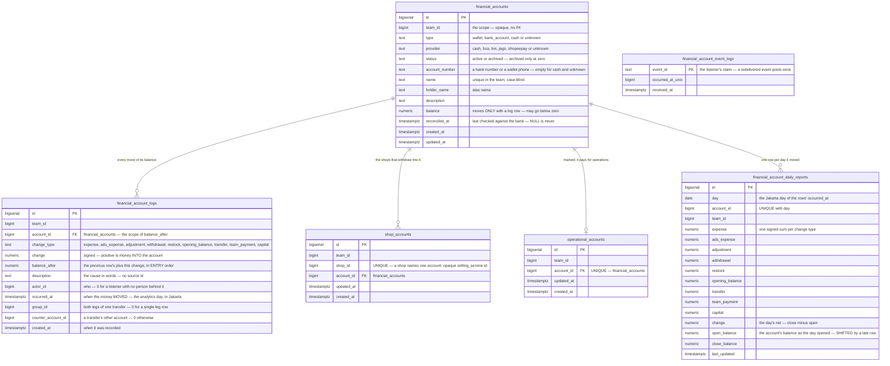
```mermaid
erDiagram
  financial_accounts ||--o{ financial_account_logs : "every move of its balance"
  financial_accounts ||--o{ shop_accounts : "the shops that withdraw into it"
  financial_accounts ||--o| operational_accounts : "marked: it pays for operations"
  financial_accounts ||--o{ financial_account_daily_reports : "one row per day it moved"
  financial_accounts {
    bigserial id PK
    bigint team_id "the scope — opaque, no FK"
    text type "wallet, bank_account, cash or unknown"
    text provider "cash, bca, bni, jago, shopeepay or unknown"
    text status "active or archived — archived only at zero"
    text account_number "a bank number or a wallet phone — empty for cash and unknown"
    text name "unique in the team, case-blind"
    text holder_name "atas nama"
    text description
    numeric balance "moves ONLY with a log row — may go below zero"
    timestamptz reconciled_at "last checked against the bank — NULL is never"
    timestamptz created_at
    timestamptz updated_at
  }
  financial_account_logs {
    bigserial id PK
    bigint team_id
    bigint account_id FK "financial_accounts — the scope of balance_after"
    text change_type "expense, ads_expense, adjustment, withdrawal, restock, opening_balance, transfer, team_payment, capital"
    numeric change "signed — positive is money INTO the account"
    numeric balance_after "the previous row's plus this change, in ENTRY order"
    text description "the cause in words — no source id"
    bigint actor_id "who — 0 for a listener with no person behind it"
    timestamptz occurred_at "when the money MOVED — the analytics day, in Jakarta"
    bigint group_id "both legs of one transfer — 0 for a single-leg row"
    bigint counter_account_id "a transfer's other account — 0 otherwise"
    timestamptz created_at "when it was recorded"
  }
  shop_accounts {
    bigserial id PK
    bigint team_id
    bigint shop_id "UNIQUE — a shop names one account; opaque selling_service id"
    bigint account_id FK "financial_accounts"
    timestamptz updated_at
    timestamptz created_at
  }
  operational_accounts {
    bigserial id PK
    bigint team_id
    bigint account_id FK "UNIQUE — financial_accounts"
    timestamptz updated_at
    timestamptz created_at
  }
  financial_account_daily_reports {
    bigserial id PK
    date day "the Jakarta day of the rows' occurred_at"
    bigint account_id "UNIQUE with day"
    bigint team_id
    numeric expense "one signed sum per change type"
    numeric ads_expense
    numeric adjustment
    numeric withdrawal
    numeric restock
    numeric opening_balance
    numeric transfer
    numeric team_payment
    numeric capital
    numeric change "the day's net — close minus open"
    numeric open_balance "the account's balance as the day opened — SHIFTED by a late row"
    numeric close_balance
    timestamptz last_updated
  }
  financial_account_event_logs {
    text event_id PK "the listener's claim — a redelivered event posts once"
    bigint occurred_at_unix
    timestamptz received_at
  }
```

### One write path

Every row goes through the ledger's `post`, on an account its caller has locked `FOR UPDATE`: the log row,
the balance and the day's report row in one transaction — the report row is upserted and every LATER day of
the account shifted, so a row dated last week moves every day since and the report is never behind the
balance ([the-daily-row-is-written-with-the-log-row](business/financial_account/context_decision.md#the-daily-row-is-written-with-the-log-row)).
A transfer locks both accounts in id order. The lock order is `audits/services/financial_account_service/concurrency/lock-order.md`.

| index | answers |
| --- | --- |
| `financial_accounts_provider_number_unique` (provider, account_number) WHERE account_number <> '' | one real account, one row, across ALL teams — a cash box and an unknown account exempt ([a-real-account-is-recorded-once](business/financial_account/context_decision.md#a-real-account-is-recorded-once)) |
| `financial_accounts_team_name_unique` (team_id, lower(name)) | a picker never shows two of the same |
| `financial_accounts_team_status_idx` (team_id, status) | the accounts page and every picker |
| `financial_account_logs_account_id_idx` (account_id, id) | one account's statement newest first — and the previous row a post reads |
| `shop_accounts_shop_unique` (shop_id) | a shop names one account ([a-shop-has-one-account](business/financial_account/context_decision.md#a-shop-has-one-account)) — also what makes two first withdrawals of a new shop make ONE unknown account |
| `operational_accounts_account_unique` (account_id) | an account is marked once |
| `financial_account_daily_reports_account_day_unique` (account_id, day) | the upsert's conflict target, the previous-day lookup and the later-day shift |
| `financial_account_daily_reports_team_day_idx` (team_id, day) | a team's series and its rankings |

`shop_accounts.shop_id` is an opaque `selling_service` id — `FinancialAccountShopSet` asks the shop's service
whether it is the team's before linking it, and the withdrawal listener trusts settlement's event.

---

## supplier_service

`backend/services/supplier_service/db_migrations/` — the suppliers a selling team buys from, and the online stores
each sells through (docs/business/supplier/context_decision.md, the-supplier-gets-its-own-service).

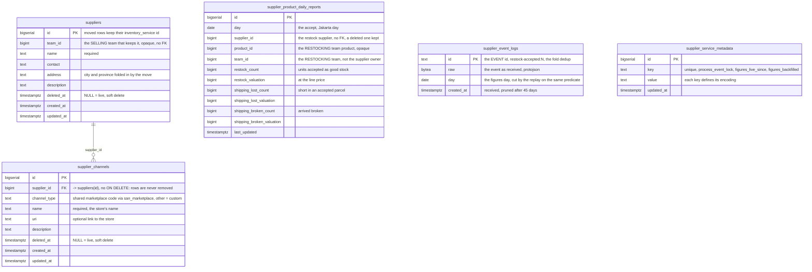
```mermaid
erDiagram
    suppliers ||--o{ supplier_channels : "supplier_id"

    suppliers {
        bigserial   id          PK "moved rows keep their inventory_service id"
        bigint      team_id     "the SELLING team that keeps it, opaque, no FK"
        text        name        "required"
        text        contact
        text        address     "city and province folded in by the move"
        text        description
        timestamptz deleted_at  "NULL = live, soft delete"
        timestamptz created_at
        timestamptz updated_at
    }

    supplier_channels {
        bigserial   id           PK
        bigint      supplier_id  FK "-> suppliers(id), no ON DELETE: rows are never removed"
        text        channel_type "shared marketplace code via san_marketplace, other = custom"
        text        name         "required, the store's name"
        text        uri          "optional link to the store"
        text        description
        timestamptz deleted_at   "NULL = live, soft delete"
        timestamptz created_at
        timestamptz updated_at
    }

    supplier_product_daily_reports {
        bigserial   id                        PK
        date        day                       "the accept, Jakarta day"
        bigint      supplier_id               "the restock supplier, no FK, a deleted one kept"
        bigint      product_id                "the RESTOCKING team product, opaque"
        bigint      team_id                   "the RESTOCKING team, not the supplier owner"
        bigint      restock_count             "units accepted as good stock"
        bigint      restock_valuation         "at the line price"
        bigint      shipping_lost_count       "short in an accepted parcel"
        bigint      shipping_lost_valuation
        bigint      shipping_broken_count     "arrived broken"
        bigint      shipping_broken_valuation
        timestamptz last_updated
    }

    supplier_event_logs {
        text        id          PK "the EVENT id, restock-accepted:N, the fold dedup"
        bytea       raw         "the event as received, protojson"
        date        day         "the figures day, cut by the replay on the same predicate"
        timestamptz created_at  "received, pruned after 45 days"
    }

    supplier_service_metadata {
        bigserial   id          PK
        text        key         "unique, process_event_lock, figures_live_since, figures_backfilled"
        text        value       "each key defines its encoding"
        timestamptz updated_at
    }
```

- **Reads cross teams, writes do not** (another-team-sees-everything-of-a-supplier). Any team reads any live
  supplier and its stores — Discover Supplier is a list across every team; only the team in `team_id` writes. So
  a write's `WHERE` carries `team_id = ?` and a read's does not.
- **Delete is soft, on both** (a-deleted-supplier-is-kept-for-its-figures, a-store-delete-is-soft-too) — a past
  restock names its supplier and store, and the daily figures still read them. Every read states
  `deleted_at IS NULL` itself (not GORM's hidden scope), because `SupplierByIds` deliberately reads deleted
  rows. Deleting a supplier does **not** mark its stores: they hide with it.
- `channel_type` is the shared `warehouse.marketplace.v1.Marketplace` code **as text**, mapped by
  `pkgs/san_marketplace` — the same encoding `selling_service.shops.marketplace` uses; no `CHECK` IN-list (#80).
- Ids: the move inserts the legacy rows **with their ids**, then sets both sequences past the largest id, so a
  supplier created afterwards never takes one a restock already holds.

| index | serves |
| --- | --- |
| `suppliers_team_live_idx` (team_id, id DESC) WHERE deleted_at IS NULL | My Supplier — a team's live suppliers, newest first |
| `supplier_channels_supplier_live_idx` (supplier_id, id DESC) WHERE deleted_at IS NULL | a supplier's live stores — the Channels tab, Discover's badges and its store-name search |

### The figures — `00002_supplier_figures`

A supplier's figures are a FOLD of inventory_service's *Restock Accepted* event (the-report-is-processed-like-settlement,
the-figures-screens-are-accepted) — every table here is DERIVED and rebuilt by `AnalyticReplayCompute`; nothing on a
write path reads them.

- **The key is the owner's** — unique (`day`, `supplier_id`, `product_id`, `team_id`), the fold's upsert target
  (the-report-is-keyed-by-team-not-by-store). All six figures are movements, so the upsert ADDS and no later day
  changes — there is no balance to carry, unlike settlement's.
- **`supplier_id` is the RESTOCK's** while restock lines name no store
  (the-supplier-comes-from-the-restock-until-lines-name-a-store); no FK, because a deleted supplier's figures stay.
- **The dedup row is the event's id**, never the broker's message id — a republish, a replay and the backfill all
  collide on `restock-accepted:<id>`. It is pruned 45 days after receipt (`AnalyticMaintenanceRun`).
- **`supplier_service_metadata`** holds three keys: `process_event_lock` (`{"lock":true|false}`, seeded false — the
  replay's switch, and a value that does not parse is an error, never "unlocked"); `figures_live_since` (the earliest
  accept the WEBHOOK has folded, a fixed-width UTC instant — the backfill's cutoff, never pruned); `figures_backfilled`
  (the one-shot backfill has run).

| index | serves |
| --- | --- |
| `supplier_product_daily_reports_key_idx` UNIQUE (day, supplier_id, product_id, team_id) | the fold's upsert · the replay's delete · every window scan — the ranking |
| `supplier_product_daily_reports_supplier_day_idx` (supplier_id, day) | one supplier over a window — the Statistics tab's series and by-product table |
| `supplier_event_logs_day_idx` (day) · `_created_idx` (created_at) | the replay's delete · the prune |

**Not here yet:** `supplier_channel_products` — the store-to-product link
(restock-accepted-links-the-product-to-its-channel) needs a store on each restock line, which the restock does not
record yet.

---

## warehouse_service

`backend/services/warehouse_service/db_migrations/`

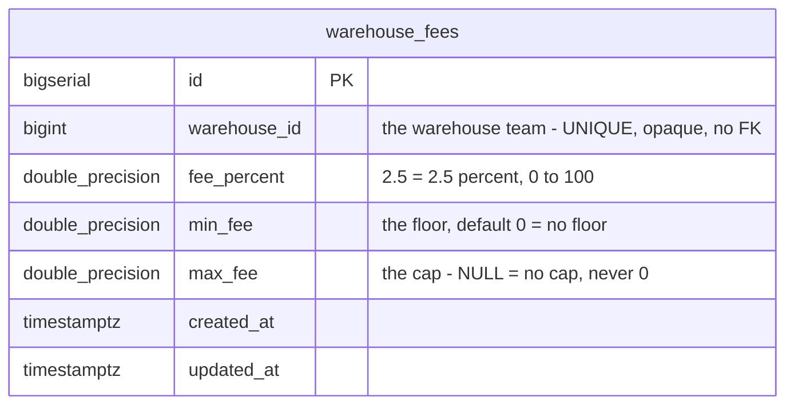
```mermaid
erDiagram
    warehouse_fees {
        bigserial        id           PK
        bigint           warehouse_id "the warehouse team - UNIQUE, opaque, no FK"
        double_precision fee_percent  "2.5 = 2.5 percent, 0 to 100"
        double_precision min_fee      "the floor, default 0 = no floor"
        double_precision max_fee      "the cap - NULL = no cap, never 0"
        timestamptz      created_at
        timestamptz      updated_at
    }
```

- **`warehouse_fees`** (`00001`) — what a warehouse charges per order
  ([warehouse-prices-balance-records](business/teams/warehouse/context_decision.md#warehouse-prices-balance-records)): the
  owner's §Property 3 plus the decided floor. **One row per warehouse**, the same rate for every seller
  ([one-rate-per-warehouse](business/teams/warehouse/context_decision.md#one-rate-per-warehouse)):
  `fee = clamp(goods_cost × fee_percent / 100, min_fee, max_fee)`
  ([the-fee-has-a-floor-and-a-cap](business/teams/warehouse/context_decision.md#the-fee-has-a-floor-and-a-cap)).
  - **`max_fee` NULL is no cap, and 0 is refused** by `CHECK (max_fee > 0)`
    ([an-empty-cap-means-no-cap](business/teams/warehouse/context_decision.md#an-empty-cap-means-no-cap)).
    `CHECK (max_fee IS NULL OR min_fee <= max_fee)`: equal is a flat fee.
  - **No row = the warehouse never set its fee**, and takes no orders
    ([a-warehouse-with-no-rate-takes-no-orders](business/teams/warehouse/context_decision.md#a-warehouse-with-no-rate-takes-no-orders));
    `0%` is a rate, a missing row is not.
  - **`UNIQUE (warehouse_id)`** makes `WarehouseFeeSet` one `INSERT … ON CONFLICT DO UPDATE`, so two managers saving at once
    leave one row.
  - **Money is `DOUBLE PRECISION`** ([rupiah-is-floating-point](business/order/context_decision.md#rupiah-is-floating-point)).
  - **All five steps are built** ([the-flat-rate-is-dropped-last](business/teams/warehouse/context_decision.md#the-flat-rate-is-dropped-last)):
    an order freezes this table's fee and the ledger posts what the order froze; step 5 dropped
    `liability_terms.handling_fee` (liability `00011`). This table is the only fee rate there is.
