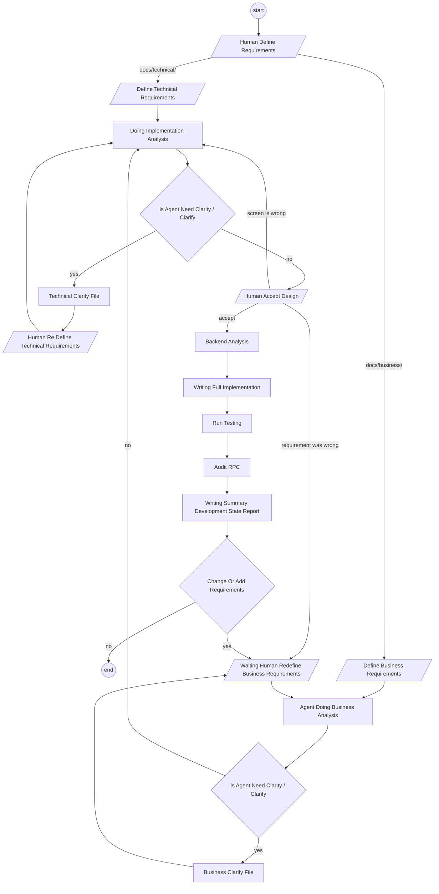
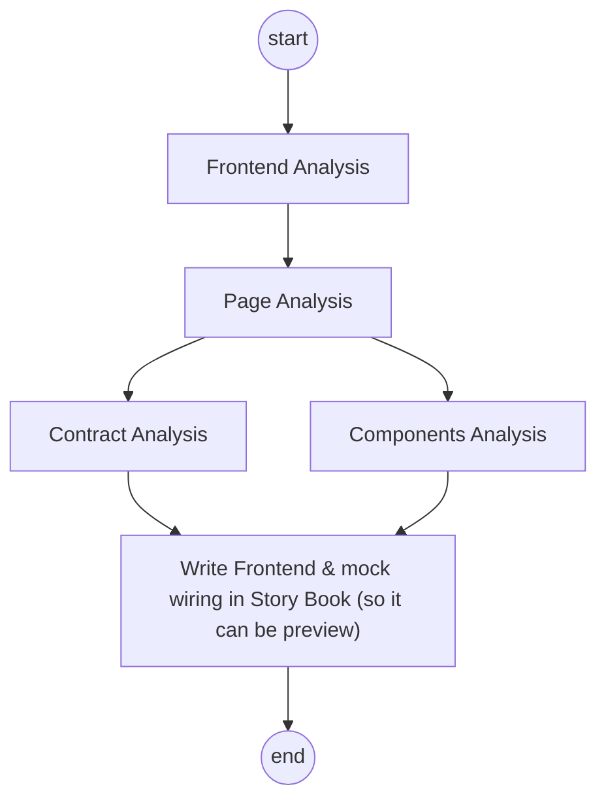

# Development Lifecycle.

1. `state_report`, its live in `docs/development_state/[big_context]/[small_context].md`
2. for business requirements, its live in `docs/business/[big_context]/[small_context].md`, its human written.
3. for technical requirements, its live in `docs/technical/[big_context]/[small_context].md`, its human written.
4. when Agent need clarity or clarify, its writed in same location of file that need clarify with suffix `_clarify.md`
5. Agent save feedback decision from human to file. its writed in same location of file that need clarify with suffix `_decision.md`
6. `design_accept` is human previewing the story book prototype. it **blocks** — nothing after it runs until human accept. see [design-accept-blocks](development_lifecycle_decision.md#design-accept-blocks)
7. summarize all clarity / clarify question in 7 biggest question in `docs/biggest_question.md`
8. `docs/biggest_question.md` is a **derived** file — regenerate it, never hand-edit it. rebuild it whenever any `_clarify.md` changes, and rank by what is BLOCKED. the 7 is a display cap, so the file must say how many questions are NOT shown and where they live.
9. build it from `_clarify.md` only, never from `_decision.md` — an answered question leaves the summary the moment it is recorded.

`Run Testing` is unit then integration then e2e. `Audit RPC` is the performance audit and, for a
write RPC, the concurrency audit — only a HEAVY or UNSAFE result gets written up.

## What Happen in `Implementation Analysis`
1. `implementation_analysis` is frontend first review in story book with complete wiring + mock
2. it produce a previewable prototype and nothing else — no backend, no migration — so a reject at `design_accept` only costs the prototype

The contract is accepted at the same gate as the screens — it is derived from them, so it is part of
what human is looking at. See
[contract-accepted-with-the-screens](development_lifecycle_decision.md#contract-accepted-with-the-screens).
