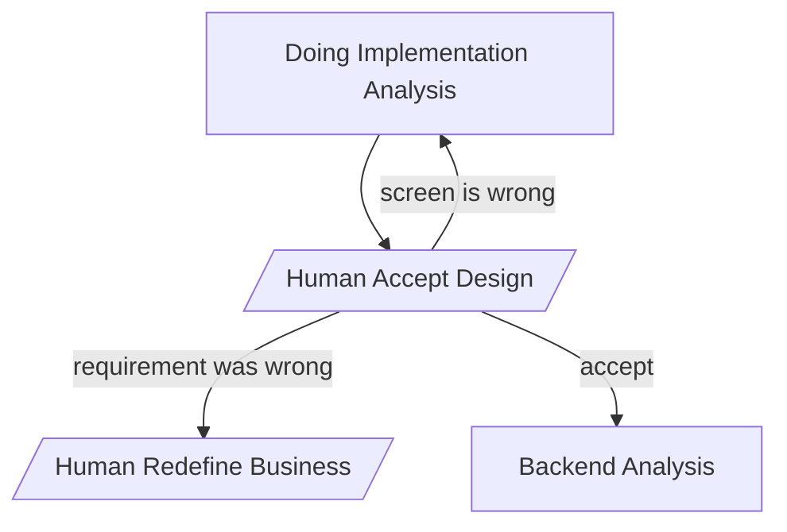

# Decisions — `development_lifecycle.md`

What the owner decided about [development_lifecycle.md](development_lifecycle.md), recorded before
it was acted on. **Append-only** — an entry is never edited away, so the next agent can see what was
already settled and does not re-propose it. Nothing is currently open — there is no `_clarify.md` for this doc.

---

## design-accept-blocks

**2026-08-27** · asked in `_clarify.md` § Question 1

**Decided: `design_accept` BLOCKS.** No implementation work starts while the owner is looking at the
Storybook prototype. `backend_analysis` is reachable only through the `accept` edge.

**Why:** a gate that can be walked past is decoration. The work that would start while nobody is
looking is exactly the work the gate exists to avoid paying for — the proto, the migration and the
handlers, all derived from a screen that may be about to change.

**Spec**

| | |
| --- | --- |
| what is being accepted | the previewable Storybook prototype — pages, components, mock wiring, and the contract derived from them (see [contract-accepted-with-the-screens](#contract-accepted-with-the-screens)) |
| who accepts | the owner, previewing at `npm run storybook` |
| while it is open | nothing downstream runs. The pass waits. |
| the three outcomes | `accept` → `backend_analysis` · `screen is wrong` → `implementation_analysis` · `requirement was wrong` → `redefine_business` |
| recorded where | an entry in this file, before work continues |

---

## contract-accepted-with-the-screens

**2026-08-27** · asked in `_clarify.md` § Question 2

**Decided: the contract is accepted at the SAME gate as the screens.** There is no separate contract
review.

**Why:** `contract_analysis` is derived from `pages_analysis` — it is a description of what the page
must show and do, so it is already part of what the owner is looking at. A second gate would review
the same decision twice, and a contract reviewed apart from its screens is reviewed without the thing
that justifies it.

**Spec**

| | |
| --- | --- |
| accepted together | `pages_analysis`, `components_analysis`, `contract_analysis`, `write_storybook` |
| accepted separately | nothing — one gate covers the whole prototype |
| consequence | a contract change after `accept` is a **new pass**, not an amendment to a settled one |

⚠ That last row is the cost of this decision, and it is the intended one: it makes the contract
expensive to change *after* the gate, which is what keeps the gate meaningful.

**Watch it on the first passes.** A contract gap is most likely to be found during `backend_analysis`
or `implementation`, and the only route back is the whole prototype again. If that bites twice, the
fix is a narrow edge from the gap back to `pages_analysis` that re-accepts only the changed screen —
recorded then as a decision that supersedes the strict reading. Until it bites, strict is correct and
cheaper than the escape hatch.

---

## gate-sits-before-backend-analysis

**2026-08-27** · applied to `development_lifecycle.md` at the owner's request

**Decided: `design_accept` sits between `implementation_analysis` and `backend_analysis`, and
`backend_analysis` moves OUT of the Implementation Analysis sub-flow.**

Previously the sub-flow ran `write_storybook → backend_analysis`, which designed the backend against
a screen nobody had accepted yet. Now Implementation Analysis produces a previewable prototype and
nothing else, so a rejection costs only the prototype — no proto decided, no migration written, no
handlers built.

## two-gates-not-one

**2026-08-27** · applied

**Decided: two gates, different weights.**

| gate | weight | for |
| --- | --- | --- |
| `design_accept` | **blocking** | the expensive decision, taken while it is still cheap |
| `add_requirements` | light | the owner previews `dev` continuously — a checkpoint, not an inspection |

`add_requirements` restores the loop that was commented out of the draft. It is what stops `end`
meaning *the agent declared itself finished*.

## test-then-audit

**2026-08-27** · applied

**Decided: `Run Testing` and `Audit RPC` are separate nodes.**

`Run Testing` is unit → integration → e2e. `Audit RPC` is the performance audit plus, for a write
RPC, the concurrency audit — only a HEAVY or UNSAFE result is written up. The audits are neither
tests nor implementation, so without a node of their own they had no place in the lifecycle and
would simply not happen.
