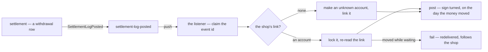

# Development state — financial_account

**Pass:** ✅ **implemented (2026-10-01)** — design_accept passed ([the-prototype-and-its-contract-are-accepted](../../business/financial_account/context_decision.md#the-prototype-and-its-contract-are-accepted)), and the service, its schema,
the withdrawal listener and the routed screens are built, tested end to end and audited. Before it: the Storybook prototype
(`implementation_analysis`), and business analysis on the owner's new [financial_account/context.md](../../business/financial_account/context.md)
— a team's bank, ShopeePay and cash accounts, each with a balance and a log — re-examined after each of the owner's
edits. Questions: [context_clarify.md](../../business/financial_account/context_clarify.md). Decisions:
[context_decision.md](../../business/financial_account/context_decision.md) — **forty owner decisions**. **Nothing is open** —
the business analysis is done, the analytics included. No technical doc.

## Decided

| decision | what it means for the build |
| --- | --- |
| [the-accounts-are-one-ledger](../../business/financial_account/context_decision.md#the-accounts-are-one-ledger) | `financial_accounts` is the state, `financial_account_logs` the log — no balance moves without a log row, in the same transaction |
| [every-log-row-names-its-account](../../business/financial_account/context_decision.md#every-log-row-names-its-account) *(line 82)* | every log row carries `account_id` — `balance_after` runs per account · `team_id` stays as a copy (⚠ my reading) · an index on `(account_id, id)` (⚠ my spec) |
| [provider-replaces-account-type](../../business/financial_account/context_decision.md#provider-replaces-account-type) *(critique 2, half)* | the column is `provider` — `account_type` in older entries means it · `type` stays, picked apart ([type-and-provider-are-picked-apart](../../business/financial_account/context_decision.md#type-and-provider-are-picked-apart)) |
| [an-account-has-a-name-and-a-holder](../../business/financial_account/context_decision.md#an-account-has-a-name-and-a-holder) *(critique 3)* | `name` and `holder_name` on every account · ⚠ `name` required and unique in the team, my spec |
| [the-log-keeps-the-day-the-money-moved](../../business/financial_account/context_decision.md#the-log-keeps-the-day-the-money-moved) *(critique 7)* | `occurred_at` on every log row — the event's time from the broker, a picked day by hand · `balance_after` stays in entry order (⚠ my spec) |
| [an-account-opens-with-a-log-row](../../business/financial_account/context_decision.md#an-account-opens-with-a-log-row) *(critique 4)* | `FinancialAccountCreate` posts `opening_balance` in the same transaction · ⚠ even at 0, and none for an `unknown` account — my spec |
| [an-account-is-archived-only-at-zero](../../business/financial_account/context_decision.md#an-account-is-archived-only-at-zero) *(critique 8)* | `FinancialAccountArchive` refused unless the balance is 0 · ⚠ an archived account takes no hand row but still takes broker rows — my spec |
| [type-and-provider-are-picked-apart](../../business/financial_account/context_decision.md#type-and-provider-are-picked-apart) *(critique 2, against my recommendation)* | `type` and `provider` both picked on the form — no derivation, a mismatched pair saves |
| [the-description-names-the-cause](../../business/financial_account/context_decision.md#the-description-names-the-cause) *(critique 1, against my recommendation)* | no `source_id`, no `reversal` — the cause is `description`, written by the listener from the event (⚠ my spec) · dedup is the library's `Claim(event_id)` |
| [a-team-payment-posts-on-accept](../../business/financial_account/context_decision.md#a-team-payment-posts-on-accept) | the team-payment listener hears only the balance service's acceptance · the event carries `from_account_id` and `to_account_id` — both new on `liability_service`'s payment · two `team_payment` rows |
| [a-team-payment-is-never-reversed](../../business/financial_account/context_decision.md#a-team-payment-is-never-reversed) *(Q14)* | an accepted payment is final — `LiabilityPaymentReverse` is removed, so there is no reversal topic and the two rows never post back |
| [the-team-description-says-where-to-pay](../../business/financial_account/context_decision.md#the-team-description-says-where-to-pay) *(Q9, against my recommendation)* | no `payee_accounts`, no payee RPCs — a payer reads the creditor team's `description` (⚠ my reading of which description) · the creditor picks *to* on acceptance |
| [analytics-are-delivered-the-settlement-way](../../business/financial_account/context_decision.md#analytics-are-delivered-the-settlement-way) *(lines 122–130)* | `AnalyticTimeSearch` (DAILY, MONTHLY, YEARLY) and `AnalyticGroupSearch` + `AnalyticGroupMetric` (by `provider`, `change_type`) — settlement's shape · the daily table behind them: the three rows below |
| [a-row-counts-on-the-day-the-money-moved](../../business/financial_account/context_decision.md#a-row-counts-on-the-day-the-money-moved) *(Q15)* | the analytics day is `occurred_at` in Jakarta time, never `created_at` |
| [the-daily-row-is-one-account-one-day](../../business/financial_account/context_decision.md#the-daily-row-is-one-account-one-day) *(Q16)* | `financial_account_daily_reports` — unique `(day, account_id)`, a signed sum per `change_type`, `open_balance`, `close_balance` · no state table |
| [the-daily-row-is-written-with-the-log-row](../../business/financial_account/context_decision.md#the-daily-row-is-written-with-the-log-row) *(Q17)* | every log write upserts its day's row and shifts later days in the same transaction — no event table, lock or replay · ⚠ audit it with `audit-sql`: two writes on one account shift the same days |
| [the-prototype-and-its-contract-are-accepted](../../business/financial_account/context_decision.md#the-prototype-and-its-contract-are-accepted) | ✅ design_accept — the three screens, the picker and the 14 + 3 RPC contract are what was built · my proposals in the prototype accepted with it |
| [account-grouped-joins-the-metrics](../../business/financial_account/context_decision.md#account-grouped-joins-the-metrics) *(critique 9)* | `AnalyticGroupSearch` also groups by account — keys are account ids |
| [a-row-comes-by-hand-or-from-the-broker](../../business/financial_account/context_decision.md#a-row-comes-by-hand-or-from-the-broker) | two ways in: the account screens, or a listener per topic. No RPC for other services to write with |
| [shopeepay-is-the-wallet-a-team-pays-with](../../business/financial_account/context_decision.md#shopeepay-is-the-wallet-a-team-pays-with) *(Q5)* | a `shopeepay` account is the team's e-wallet — no settlement row ever posts to an account |
| [a-real-account-is-recorded-once](../../business/financial_account/context_decision.md#a-real-account-is-recorded-once) *(Q6)* | a partial unique index on `(provider, account_number)` where a number exists, across all teams, archived included · a cash box exempt · the `team_infos` copy never happens — the columns were dropped ([the-team-record-holds-no-bank](../../business/financial_account/context_decision.md#the-team-record-holds-no-bank)) |
| [below-zero-is-warned-never-refused](../../business/financial_account/context_decision.md#below-zero-is-warned-never-refused) *(Q7)* | no balance check on any write path · a warning on the list and the account page while below zero |
| [opening-transfer-and-team-payment-join-the-types](../../business/financial_account/context_decision.md#opening-transfer-and-team-payment-join-the-types) *(Q4, three of four)* | three more `change_type` values · ⚠ their posting rules — the opening row at create, two legs per transfer, a team payment at confirm — are my spec, marked so in the decision |
| [capital-joins-the-types](../../business/financial_account/context_decision.md#capital-joins-the-types) *(Q4, the fourth)* | the owner's money in or out, one signed type · ⚠ two rows sharing a `group_id` when it moves between teams — my spec |
| [adjustment-is-for-reconciling-only](../../business/financial_account/context_decision.md#adjustment-is-for-reconciling-only) *(Q4)* | no RPC takes an adjustment amount — `Reconcile` takes the bank's figure and posts the difference · ⚠ a note on a non-zero difference and a `reconciled_at` stamp are my spec |
| [the-log-says-balance-after](../../business/financial_account/context_decision.md#the-log-says-balance-after) *(critique 5)* | the log's column is `balance_after` = the previous row's + this row's `change` |
| [restock-is-never-typed-by-hand](../../business/financial_account/context_decision.md#restock-is-never-typed-by-hand) *(Q10, for restock)* | no hand RPC takes a `restock` · it comes only from a restock event inventory does not publish yet — until then a restock's payment shows only through a reconcile |
| [one-way-in-per-type](../../business/financial_account/context_decision.md#one-way-in-per-type) *(Q10)* | the hand RPCs are Create, Transfer, Capital, Reconcile, and none takes a `change_type` · a listener each for `withdrawal` (settlement — exists), `restock`, `expense`, `team_payment` (their events are new) |
| [revenue-stays-in-settlement](../../business/financial_account/context_decision.md#revenue-stays-in-settlement) *(Q1, the name)* | the type is `withdrawal` (was `revenue_fund`) · the listener posts only settlement's `withdrawal` rows, sign turned · ⚠ the label *+ Withdrawal from <the shop>* is my spec |
| [a-shop-names-the-account-it-withdraws-into](../../business/financial_account/context_decision.md#a-shop-names-the-account-it-withdraws-into) *(Q1)* | the owner's `shop_accounts` — the withdrawal listener looks the shop up there · ✅ `shop_id` unique — [a-shop-has-one-account](../../business/financial_account/context_decision.md#a-shop-has-one-account) |
| [a-shop-with-no-account-gets-an-unknown-one](../../business/financial_account/context_decision.md#a-shop-with-no-account-gets-an-unknown-one) *(Q11, against my recommendation)* | the withdrawal listener, finding no `shop_accounts` row, creates an account with `type` and `account_type` `unknown`, connects it to the shop and posts there — nothing is held · ⚠ one per shop, its name, no opening row, what it may do are my spec · ✅ one per shop holds, `shop_id` unique · how it becomes real: [an-unknown-account-is-filled-in-or-moved-in](../../business/financial_account/context_decision.md#an-unknown-account-is-filled-in-or-moved-in) |
| [a-shop-has-one-account](../../business/financial_account/context_decision.md#a-shop-has-one-account) *(line 19)* | `shop_accounts (shop_id)` unique — one account per shop, many shops per account · a new shop's second concurrent withdrawal rolls back and retries onto the first one's row (⚠ my spec) |
| [the-team-record-holds-no-bank](../../business/financial_account/context_decision.md#the-team-record-holds-no-bank) *(Q9, two parts)* | ✅ **built** — `team_service` `00008_drop_team_bank` drops the three columns · `TeamInfo` / `TeamInfoUpdateRequest` reserve 3–5 · the team detail and row menu read *Contact* · stored numbers are gone, not copied · where a team is paid is still Q9 |
| [an-unknown-account-is-filled-in-or-moved-in](../../business/financial_account/context_decision.md#an-unknown-account-is-filled-in-or-moved-in) *(Q12)* | `FinancialAccountIdentify`, admin and up, on an `unknown` account only — not registered: fill in provider, number, holder, name, rows kept · registered: transfer the balance in, re-point the shop, archive the unknown at zero, one transaction |
| [a-restock-must-name-the-account-that-paid](../../business/financial_account/context_decision.md#a-restock-must-name-the-account-that-paid) *(Q2, required against my recommendation)* | *Paid from* is **required** at create — an operational account, replacing `payment_type` on new restocks · goods plus shipping from the lines · an edit posts the difference · a cancel asks whether the money came back · the courier's cost line names the warehouse's account (⚠ my reading) · old restocks post nothing · a new inventory event · ⚠ a team with no operational account cannot raise a restock — accounts are set up before the field ships |
| [an-expense-must-name-the-account-that-paid](../../business/financial_account/context_decision.md#an-expense-must-name-the-account-that-paid) *(Q3, required against my recommendation)* | *Paid from* is **required** on every expense a person types — `ADS`, `PAYROLL`, `OPERATIONAL`, `OTHER` · `STOCK_LOSS` outside it (⚠ my reading) · a void reverses · a new expense event · an ads charge from the seller balance: [settlement-ads-and-accounts-are-independent](../../business/financial_account/context_decision.md#settlement-ads-and-accounts-are-independent) |
| [settlement-ads-and-accounts-are-independent](../../business/financial_account/context_decision.md#settlement-ads-and-accounts-are-independent) *(Q13)* | settlement's ads rows never reach an account and nothing syncs · an ad is in an account only as an `ADS` expense naming the account that paid · *Paid from* required with no exception |
| [ads-expense-joins-the-types](../../business/financial_account/context_decision.md#ads-expense-joins-the-types) *(line 93)* | `ads_expense` is a type beside `expense` · ⚠ my reading: the expense listener posts it when the kind is `ADS`, `expense` for every other kind |
| [operational-accounts-pay-for-operations](../../business/financial_account/context_decision.md#operational-accounts-pay-for-operations) *(Q2, which account)* | the owner's `operational_accounts` — the restock's *Paid from* picks among them |
| [seeing-is-team-wide-moving-is-admin-and-up](../../business/financial_account/context_decision.md#seeing-is-team-wide-moving-is-admin-and-up) *(Q8)* | `FinancialAccountList`, `FinancialAccountOverview` and `FinancialAccountLogList` open to every member of the team · Create, Update, Archive, Restore, Transfer, Capital, Reconcile, ShopSet to admin and up — `SELLING_ADMIN`/`SELLING_OWNER`, `WAREHOUSE_ADMIN`/`WAREHOUSE_OWNER`, `ADMINISTRATOR`/`ROOT` (⚠ my reading of *admin up*) · 🔄 *(2026-10-06)* **Transfer and Capital lose `WAREHOUSE_ADMIN`** ([the-warehouse-admin-equals-the-owner-except-money](../../business/user/context_decision.md#the-warehouse-admin-equals-the-owner-except-money)); the screens hide them by `canTransferMoney` · balances stay on their own RPC so narrowing *for now* later is one policy line |

## What exists — built 2026-10-01

| | where |
| --- | --- |
| the contract | [financial_account.proto](../../../proto/warehouse/financial_account/v1/financial_account.proto) — `FinancialAccountService` (14 RPCs) and `FinancialAccountAnalyticService` (3), as accepted |
| **the service** | [backend/services/financial_account_service/](../../../backend/services/financial_account_service/) — one handler file per RPC and a unit test beside each · the ledger's one write path [ledger.go](../../../backend/services/financial_account_service/financial_account_v1/ledger.go): lock the account, the log row, the balance, the day's report row and every later day's shift, one transaction · mounted in the dev server, wired by Wire |
| the schema | [00001_create_financial_accounts.sql](../../../backend/services/financial_account_service/db_migrations/00001_create_financial_accounts.sql) — `financial_accounts`, `financial_account_logs`, `shop_accounts`, `operational_accounts`, `financial_account_daily_reports`, the listener's `financial_account_event_logs` · [database-schema.md](../../database-schema.md#financial_account_service) · flows: [rpc.md](../../services/financial_account_service/rpc.md) |
| the withdrawal listener | push route `/event/financial-account-withdrawal/push` on `settlement-log-posted` — settlement's `withdrawal` rows into the shop's account, sign turned; an `unknown` account made for a shop with none · subscription declared in `san pubsub ensure` ([san.md](../../tools/san.md)) |
| ShopSet's one outside question | [financial_account_deps.go](../../../backend/cmd/app_development/financial_account_deps.go) — `ShopAccessCheck` under the caller's token, before the transaction: another team's shop is refused |
| the screens | `/financial-accounts`, `/financial-accounts/:id`, `/financial-accounts/report` — routed, **Accounts** in the menu for every member of a selling or warehouse team · the prototype's pages on the real client |
| tests | 50 unit tests · 48 stories · [e2e/financial_accounts.spec.ts](../../../frontend/e2e/financial_accounts.spec.ts) — 10 steps against the real server, the withdrawal pushed to the listener's route |
| audits | [audits/services/financial_account_service/](../../../audits/services/financial_account_service/) — 9 performance reports, the lock-order matrix |
| the dev database | migrated 2026-10-01: financial_account_service 00001 |

```sh
go test ./backend/services/financial_account_service/...
go test -tags raceaudit -run 'TestRace_|TestInterleave_' ./backend/services/financial_account_service/financial_account_v1/
go test -tags perfaudit -run TestPerf_ -v ./backend/services/financial_account_service/financial_account_v1/
cd frontend && npx vitest run --project=storybook src/pages/financial-account* src/components/pickers/FinancialAccountSelect.stories.tsx
cd frontend && npx playwright test e2e/financial_accounts.spec.ts   # Docker up; the Pub/Sub emulator up and ensured
```

## How one withdrawal lands



## Audits — what they found

| | verdict |
| --- | --- |
| concurrency | ✅ safe — one lock, the account row, two only in id order ([lock-order.md](../../../audits/services/financial_account_service/concurrency/lock-order.md)) · ⚠ **one race found and fixed**: the listener read the shop's link before locking, so a withdrawal waiting on a move-in posted into the archived account the shop had left — it now re-checks under the lock and retries |
| `AnalyticTimeSearch` | 🔴 heavy — the balance is re-derived per bucket over the team's history: 156 ms for 30 days, 3.3 s for 200 daily points. Settlement's report has the same shape and the same open finding. **→ Recommend a running sum** ([report](../../../audits/services/financial_account_service/performances/AnalyticTimeSearch.md)) — the owner's call |
| 8 write paths | 🟡 heavy by the "> 5 statements" rule only — 6 to 15 fixed statements, 2–6 ms, none growing · **→ Recommend** reading a write's answer in one query instead of three; the 4-statement ledger leg left as is |
| every read but the series | not heavy — 1 to 4 queries, ≤ 47 ms at a production-like spread, no N+1 |

## Not built — the next passes, in the build order

| | needs first |
| --- | --- |
| *Paid from* on a restock → `restock` rows | inventory's restock event, naming the account ([a-restock-must-name-the-account-that-paid](../../business/financial_account/context_decision.md#a-restock-must-name-the-account-that-paid)) · the restock form swaps `PaymentTypeSelect` for `FinancialAccountSelect` (operational only, pre-picked) |
| *Paid from* on an expense → `expense` / `ads_expense` rows | expense's event ([an-expense-must-name-the-account-that-paid](../../business/financial_account/context_decision.md#an-expense-must-name-the-account-that-paid)) |
| *Received into* on a team payment → two `team_payment` rows | the balance service's acceptance event, with both account ids ([a-team-payment-posts-on-accept](../../business/financial_account/context_decision.md#a-team-payment-posts-on-accept)) |

Until each is wired, a reconcile catches what it moved as an `adjustment` — honest: it was not recorded.

## ⚠ Traps this pass walked into

| | |
| --- | --- |
| **The e2e broker has PULL subscriptions and the dev server no pull worker** | CI's `san pubsub ensure` passes no `--push-base-url`, so no event-driven path reaches a handler in e2e. The spec POSTs a Pub/Sub push envelope to the listener's route instead — the route, the decode, the claim and the post are real |
| **A listener has no caller token**, so it cannot ask the shop's service for a name | the server writes `shop #<id>` into an unknown account's name and a withdrawal's description; `withShopNames` in [vocab.ts](../../../frontend/src/features/financialAccount/vocab.ts) puts the name in on screen |
| **`gofmt -l` lists ~50 CRLF files in `tools/san`** | untouched files — format only the files you wrote |
| **Docker Desktop was down** | every `san_testdb` test SKIPS without Postgres — start Docker and `docker compose up -d` before believing a green run |

## Open

Nothing in the business analysis. For the owner: whether to adopt the running-sum read in `AnalyticTimeSearch` (and
settlement's), and the one-query answer for the writes — both open questions in their reports. Still empty in the
owner's doc: §General.

**Next agent:** the next pass is a restock event in inventory and its listener here — the build order above. A new
listener follows [withdrawal_listener.go](../../../backend/services/financial_account_service/financial_account_v1/withdrawal_listener.go): claim, then lock the
account, re-check what was read before the lock, then `post`. Its subscription goes in `tools/san/pubsub.go` and
[san.md](../../tools/san.md) beside `financial-account-withdrawal`.
