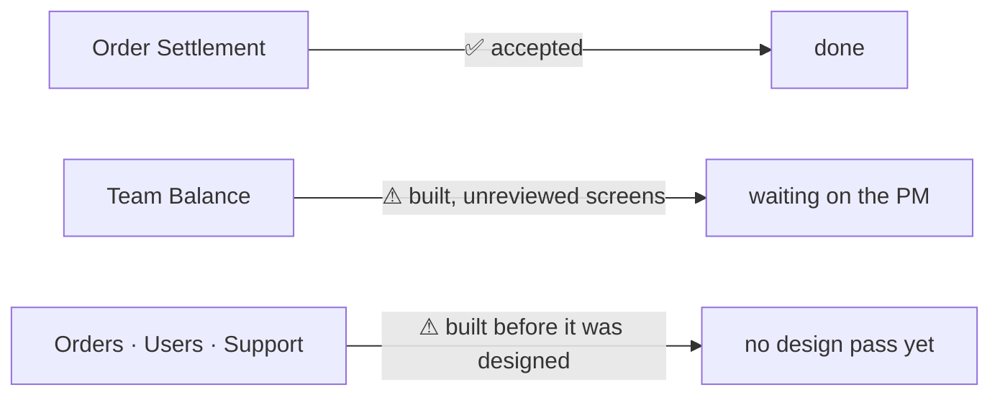

# Progress — Heri

For the **product manager**. One entry per finished slice, newest first
([a-report-fires-per-slice](../business/project/member_decision.md#a-report-fires-per-slice)).
Scope: [member.md](../business/project/member.md) — Order, Order Settlements, Team Balance,
Users & Role System, Documents, region, shipping, expense.

---

## 2026-08-31 · baseline

**The first entry is a baseline, not a slice.** Scopes were assigned today, and the work predates
them — **all 389 commits in this repository are from this machine**, so everything below was built
here, including the parts now assigned to Toni. This entry states where the whole system stands;
every entry after it covers one finished slice.

### Where each area stands

| Area | State | What a person can do with it today |
| --- | --- | --- |
| **Team Balance** | ⚠ **built, waiting on you** | Two teams can owe each other and settle up: every pair has two mirrored balances, six kinds of event move them, and a debt above the limit stops the debtor ordering. A payment carries **proof the creditor can open**, and is confirmed, rejected or reversed. Credit limits have a change log — who moved a limit, when, and why |
| **Order Settlement** | ✅ **done, design accepted** | What a marketplace order *actually* paid out — the fees, the deductions, the next-day adjustments — recorded per order, typed in by hand or posted by an external service |
| **Orders** | ⚠ built, never design-reviewed | Record an order, keep it as a draft and promote it, then confirm → pick → pack → ship. Shops and shop members are managed |
| **Users & Roles** | ⚠ built, never design-reviewed | Log in, reset a password by OTP, hold a different role in each team. The permission rule for every screen is declared on the request itself, so it cannot drift from the code |
| **Support** — documents, regions, courier catalogue, expenses | ⚠ built, never design-reviewed | Upload and share a document, resolve an address or postcode, pick a courier, record a cost like electricity or ads |

### ⛔ The one thing waiting on you

**Nobody has looked at the balance screens.** The lifecycle's `design_accept` gate blocks everything
after it, and it is the only thing between Team Balance and finished. Fifteen minutes with the
running app closes it — the steps are in
[balance/context.md](balance/context.md#the-next-agents-first-move).

### What is honest about the rest

**Most of this was built before it was designed** — that is recorded, not hidden, in
[the balance state report](balance/context.md). It is why *Orders* carries **13 open questions**, the
most of any area, and why the top of [biggest_question.md](../biggest_question.md) is about orders and
money rather than about screens.

### Evidence

The last recorded run had the **e2e suite green** (`6ae4d55`, 2026-08-31), with unit, integration and
end-to-end passing together for the first time. Two concurrency audits are written up in
[audits/](../../audits/). Detail per area is in the context files beside this one —
[balance](balance/context.md), [settlement](settlement/context.md).

### Next

1. **Get the balance screens previewed** — it is the only blocked gate in this lane.
2. **Wire settlement into order creation** — the one piece settlement is missing.
3. **Decide who owns the ledger** — it is the last unowned area, and both lanes touch it
   ([member_clarify.md Q1](../business/project/member_clarify.md#question)).
