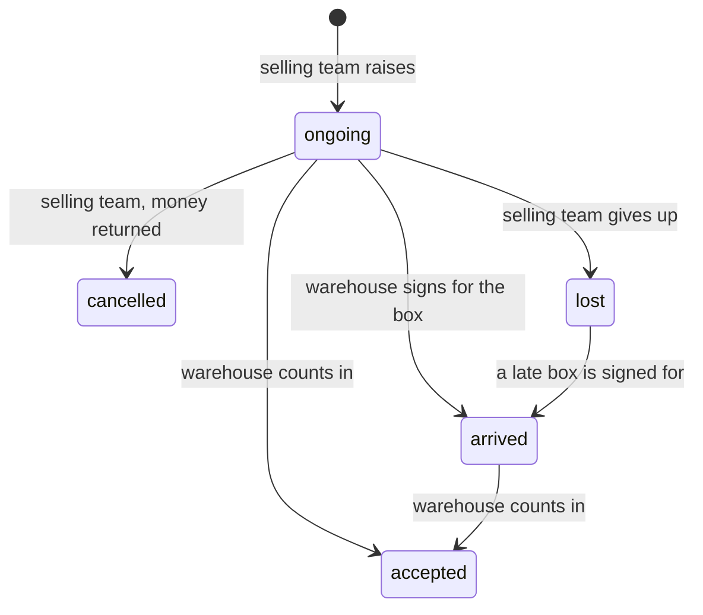

# Development state — inventory / restock

**As of 2026-10-09, the restock is DECIDED and PROTOTYPED. It is not built.** All 44 decisions are in
[restock_decision.md](../../business/inventory/restock_decision.md). One question is open:
[Q21](../../business/inventory/restock_clarify.md#question), whether a line added after the box arrived may name its
supplier (recommended: yes, for new lines only). The screens run in Storybook against a stub that plays the decided
rules. The contract was changed in place
([the-restock-contract-changes-in-place](../../business/inventory/restock_decision.md#the-restock-contract-changes-in-place)),
and the backend was carried along only far enough to compile and stay green. **Next step: the owner's design_accept on
the Storybook screens, then the backend step.**

## Lifecycle as decided

## What exists

| | |
| --- | --- |
| contract | `proto/warehouse/inventory/v1/restock_request.proto`, rewritten in place: statuses ONGOING=1 · ACCEPTED=2 · CANCELLED=3 · ARRIVED=4 · LOST=5 · problems BROKEN/MISSING with a system price · a line carries count, total, `price_unit`, `received_count`, `supplier_id`, `supplier_channel_id`, `note` · `RestockLog` replaces the events · new RPCs `RestockRequestArrive`, `RestockRequestAccept` (was Fulfill), `RestockRequestMarkLost` · Cancel carries `money_returned` · `events/v1`: `RestockAccepted` gains `accepted_at_unix` and per line `missing_count` (was lost), `supplier_id`, `supplier_channel_id`, plus new events `RestockCreated`/`Cancelled`/`Updated` (401–403) · `supplier/v1`: `SupplierChannel.deleted`, `SupplierChannelByIds` |
| backend: bridges, **no migration** | `restock_request_mapper.go` translates: stored `"pending"` = ONGOING, `"fulfilled"` = ACCEPTED, a stored `"lost"` problem row = MISSING · an empty problem note is stored as default words (`CHECK (reason <> '')`) · the restock-level supplier is stored as the lines' common supplier · events are mapped to `RestockLog` rows · **every field the old schema has no column for is accepted and DROPPED** |
| backend: Unimplemented | `restock_request_arrive.go`, `restock_request_mark_lost.go`, `supplier_v1/supplier_channel_by_ids.go` |
| backend: ported | accept (git-mv'd from fulfill), create, update, cancel, labels, the accepted event, stock cost, owner stock, product stock summary, inbound stat (`status IN restockInboundStatuses`, which is ongoing + arrived), and supplier's `analytic_fold.go` (`GetMissingCount`) |
| frontend: features | `features/restock/`: `summary.ts`, `lines.ts`, `counting.ts`, `statusTabs.ts`, `dateFields.ts`, `problemType.ts`, `queries.ts` (+ Accept/Arrive/MarkLost hooks), `LineSupplier`, `RestockItemsCell`, `SellingRestockActions`, `WarehouseRestockActions`, `RestockTimeline` (each with a story), `storyRestock.ts` (stories only) · `features/suppliers/queries.ts`: `useSupplierChannelsByIds` |
| frontend: components | `badges/RestockStatusBadge` (5 statuses) · new `badges/DeletedBadge` · new `pickers/SupplierChannelPicker` (the Connect Supplier Channel popup, all suppliers) · `pickers/RackSelect` `allowUnplaced` (default true; the accept passes false, per [there-is-no-unplaced-pile](../../business/inventory/restock_decision.md#there-is-no-unplaced-pile)) · `feedback/ConfirmDialog`: optional body, `confirmDisabled`, `dismissLabel` · `pickers/DamageTypeSelect` **removed** |
| frontend: pages | restock-request-form, restock-accept, restock-selling, restock-selling-detail, restock-warehouse, restock-warehouse-detail, restock-labels (each with an `index.stories.tsx`; all but labels have a `pending.ts`) · warehouse-product type fixes |
| Storybook | `.storybook/restockFixtures.ts` (restocks 501–507, one per state) · `.storybook/restockStub.ts` plays the decided rules (`resetRestockStub` runs in preview's `beforeEach`, `restockWire(id)`) · `supplierStub.ts` + `supplierChannelByIds` |
| docs | `docs/services/inventory_service/rpc.md` restock section (lifecycle, the accept transaction, the rules, the event) · liability, selling and supplier `rpc.md`: Fulfill renamed to Accept |
| tests | Go: every package green from the root, 0 skips · stories: **1171** green · mermaid: 1006 parse |

## Pending marks: what each screen admits it cannot do yet

| page | marks |
| --- | --- |
| restock-request-form | lineSupplier, lineNote, financeAccount, shipment, receiptFile: all `dropped` |
| restock-accept | courier, lineSupplier, lineNote: `sample` · problemNotes: `dropped` |
| restock-selling | lineSupplier, courier, moneyReturned, markLost: `dropped` |
| restock-selling-detail | payingAccount, courier, receiptPhoto, lineSupplier, lineNote, problemNotes, moneyReturned, markLost: `dropped` |
| restock-warehouse | courier, signForBox: `dropped` |
| restock-warehouse-detail | signForBox, courier, receiptPhoto, lineSupplier, lineNote, problemNotes: `dropped` |

Every mark goes away in the backend step, and the stories assert on them, so they fail the day they should change.

## The backend step: what it has to do

1. **Migrations** (inventory_service owns them; `docs/database-schema.md` in the same commit): rename the stored
   statuses (`pending` → `ongoing`, `fulfilled` → `accepted`) and the stored problem `lost` → `missing`, and drop the
   problem note's `CHECK`. Add columns for everything listed as dropped: line supplier/channel/note/count/total,
   restock receipt_file, shipment_id, invoice_ref_id, finance_account_id, the courier's charge and its note,
   arrived/lost actors and times, and the `restock_logs` trail. Then delete the bridges in the mapper.
2. **Arrive and MarkLost** for real. Implement `SupplierChannelByIds`.
3. ⚠ **Batch stopgap.** `restock_request_accept.go:243-244` sets `ArrivedQty = received + missing` and
   `DamagedQty = broken + missing` so the batch reads stay right. That contradicts
   [one-batch-per-line](../../business/inventory/restock_decision.md#one-batch-per-line); replace it when the batch
   is reworked.
4. ⚠ **No duplicate-product guard.**
   [a-product-appears-once-per-restock](../../business/inventory/restock_decision.md#a-product-appears-once-per-restock)
   is enforced by the form only. Create and update accept the same product twice.
5. **Events.** Publish `RestockCreated`/`Cancelled`/`Updated`, add their topics to `pubsub ensure`, and write the
   courier's debt inside the accept transaction
   ([the-couriers-debt-is-written-in-the-accept](../../business/inventory/restock_decision.md#the-couriers-debt-is-written-in-the-accept)).
6. **Stale e2e.** Update `e2e/restock.spec.ts` and `e2e/orders.spec.ts` for the reworked screens. Ids that no longer
   exist: `accept-cod-fee`, `accept-cost-note-0`, `restock-detail-edit`, `restock-detail-short`,
   `restock-detail-cost-incidental`, `restock-detail-labels`, `restock-timeline-created-by`,
   `restock-detail-lost-<id>`. They were left alone on purpose, because the prototype's ids may still move at
   design_accept. **They fail as they stand.**
7. Audit every new or changed write RPC (`audit-rpc-performance`, `audit-sql`). The accept locks the restock row
   first ([accept-locks-the-restock](../../business/inventory/restock_decision.md#accept-locks-the-restock)).

## Elsewhere

- The list pages have no phone arrangement yet (one block per row, FilterBar sheet).
- warehouse-product's **Incoming** reads ongoing restocks only (comment at `pages/warehouse-product/index.tsx:99`).
  An arrived box is incoming too, but the activity read takes one status.
- The receipt photo's upload type is not designed. It stays a `dropped` mark.
- Fixture: team 12 has only product 74, so a story that needs two of one team's products adds its own.
- `qrcode.react` sometimes misses Vite's optimizeDeps on the first labels story run. A re-run passes.
- The other inventory clarifies (context, order, opname, transaction) are still open; see
  [biggest_question.md](../../biggest_question.md).
