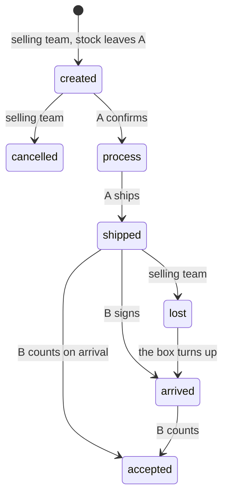

# Development state — inventory / warehouse_transfer

**As of 2026-10-10, the warehouse transfer is DECIDED and PROTOTYPED. It is not built.** All 27 decisions are in
[warehouse_transfer_decision.md](../../business/inventory/warehouse_transfer_decision.md); the clarify has no open question
and no open contradiction. The screens run in Storybook against a stub that plays the decided rules; in the app they are
routed and in the menu, and every call answers **Unimplemented**. **Next step: the owner's design_accept on the Storybook
screens and the contract, then the backend step.**

## Lifecycle as decided

## What exists

| | |
| --- | --- |
| contract | NEW `proto/warehouse/inventory/v1/warehouse_transfer.proto` — `WarehouseTransferService`: Create, List, Detail, Update, Cancel, MarkLost, Process, Ship, Arrive, Accept. Statuses CREATED=1 · PROCESS=2 · SHIPPED=3 · ARRIVED=4 · ACCEPTED=5 · CANCELLED=6 · LOST=7; `WarehouseTransferDirection` (outgoing/incoming) for a warehouse's list; problems BROKEN/MISSING. The list follows the guideline's columnar shape, `team_id` top-level |
| backend | `inventory_v1/warehouse_transfer_prototype.go` — `WarehouseTransferPrototype` embeds the generated Unimplemented handler; mounted in `register.go` and in reflection; `warehouse_transfer_prototype_test.go` pins every RPC as Unimplemented. **No tables, no migration** |
| frontend: features | `features/warehouseTransfer/`: `queries.ts` (list, detail, 8 mutations — Create/Cancel/Accept also invalidate stock), `adapt.ts`, `statusTabs.ts`, `summary.ts` (units, broken/missing, direction, `parseTransferId`), `SellingTransferActions` (Edit Cost · Cancel · Mark Lost + dialogs), `WarehouseTransferActions` (Process · Ship · Sign · Accept by side + dialogs), `TransferTimeline`, `TransferItemsCell`, `TransferDetailCards` (route, parcel, lines) — each with a story; `storyTransfer.ts` (stories only) |
| frontend: components | `badges/WarehouseTransferStatusBadge` (+ story) |
| frontend: pages | `warehouse-transfer-selling`, `-form`, `-selling-detail`, `-warehouse` (Outgoing/Incoming segment), `-warehouse-detail` (A's pick list), `-accept` (+ `count.ts`, `components/CountLineCard`) — each with `pending.ts` and `index.stories.tsx` |
| routing | `/inventories/transfer` (+ `/new`, `/:transferId`, `/:transferId/accept`) — list and detail pick the selling or warehouse page by team type, like restock; nav entry *Transfers* in `inventoriesFor` for both team types |
| Storybook | `.storybook/warehouseTransferFixtures.ts` (601–609, one per state, one each way, two owners) · `.storybook/warehouseTransferStub.ts` plays the rules (`resetWarehouseTransferStub` in preview's `beforeEach`, `transferWire(id)`) · registered in `stubTransport.ts` |
| shared fixtures touched | `fixtures.ts`: racks 44/45 appended for Gudang Cabang (14); `warehouseStock["74"] = 25` (team 12's Beras, so the form's picker is not empty). `stubTransport.ts`: `rackList` now **scoped by `req.teamId`**, as the server is — every existing story still passes |
| i18n | `warehouseTransfer.*` in en and id; `nav.warehouseTransfer` |
| docs | `docs/services/inventory_service/rpc.md` § Warehouse transfers (lifecycle, the create and accept transactions, the rules) |
| tests | Go: build/vet green, prototype test green, access-policy tests green · stories: **1232** green (61 new) · typecheck, build, mermaid (1047) green |

## Pending marks: what each screen admits

| page | marks |
| --- | --- |
| selling list, form, selling detail | `costEvent` — `missing`: the cost is stored, the paying account does not hear of it |
| warehouse list, warehouse detail | `labelPhoto` — `dropped`: the upload type is not designed |
| accept | `courierDebt` — `derived`: where the team's debt to B is held is undecided (shared with restock) |

## The backend step: what it has to do

1. **Migrations** (inventory_service): `warehouse_transfers`, `warehouse_transfer_items` (+ picks and placements),
   `warehouse_transfer_problem_items`, `warehouse_transfer_logs`; `UNIQUE (transfer_id, product_id)`,
   `UNIQUE (transfer_id, product_id, problem_type)`, `CHECK (from_warehouse_id <> to_warehouse_id)`. Update
   `docs/database-schema.md` in the same commit.
2. **Handlers**, one file per RPC with a unit test each, as methods on `*Service`; **delete `WarehouseTransferPrototype`**
   and add the compile-time assertion to `service.go`. Every status change locks the transfer row, then batches, then
   shelves (`a-transfer-is-locked-before-any-status-change`).
3. **The legs**: `transfer_out` at create through the batch and placement ledgers (fewest shelves first, oldest batches
   first); `transfer_in` at accept minting one batch per source batch, read from the outbound transaction's `batch_logs`.
4. **Events**: the shipping expense to `financial_account_service` (create, update difference, cancel refund) — not in the
   contract yet; add it to `events/v1` and `san pubsub ensure`. The courier's on-site charge as a debt inside the accept —
   where it is held is the open point shared with the restock.
5. **The in-transit figure** on the team's stock screen (`the-transfer-is-where-goods-in-transit-are`) is not built
   anywhere yet.
6. Retire `InventoryService.StockTransfer`, the instant one-product move this supersedes; nothing calls it.
7. Audit every write RPC (`audit-rpc-performance`, `audit-sql` — two staff at B's door is the normal case).

## Elsewhere

- The list pages have no phone arrangement yet (one block per row, FilterBar sheet) — the same gap as restock's lists.
- The stub picks every line from A's FIRST rack (it knows no rack counts) and prices new lines from a fixed table; the
  fixtures show the real split (601's Beras over two racks).
- `pickTeamIn` in the form story exists because `TeamSelect` remounts when its list lands: a story with two TeamSelects
  must read the input after the remount and pick from the listbox it controls.
