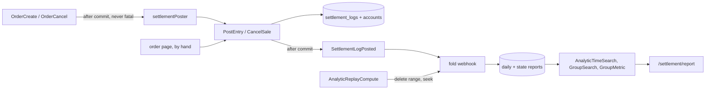

# Development state — settlement

**Pass:** `implementation` + `technical_test`, **COMPLETE** (2026-09-14). Backend `dabc331`; the report
screen and docs in the commit after it.

**Settlement is BUILT END TO END.** The ledger, the order seam, the event, the fold, the reports, the
maintenance RPCs, the report screen.

| | |
| --- | --- |
| proto | `settlement.proto` — **4 services, 8 RPCs** · `event.proto` — `SettlementLogPosted` (variant 300, topic `settlement-log-posted`) |
| schema | settlement `00001–00005`: `settlement_logs`, `order_settlements` (+`created_by_user_id`), `shop_settlements`, `settlement_event_logs`, `shop_/user_settlement_daily_reports`, `shop_/user_settlement_reports`, `settlement_service_metadata` · selling `00013`: `orders.created_by_user_id` |
| service | `backend/services/settlement_service/` — mounted, plus the push route `/event/settlement-fold/push` |
| wiring | `cmd/app_development/settlement_poster.go` (selling → settlement) · `replay_broker.go` (the replay's subscription) |
| provisioning | `san pubsub ensure` declares `settlement-fold` on `settlement-log-posted` |
| frontend | `/settlement` (list, now with a Report button), the order page's Settlement tab, **`/settlement/report`** (`pages/settlement-report/`), nav entry, `features/settlement/{analytics,measure}.ts` |
| docs | [rpc.md](../../services/settlement_service/rpc.md) · [database-schema.md](../../database-schema.md#settlement_service) · [san.md](../../tools/san.md#pubsub-ensure) |

```sh
go test ./backend/services/settlement_service/... ./backend/services/selling_service/...
go test -tags raceaudit -run 'TestRace_Settlement|TestRace_Fold' ./backend/services/settlement_service/settlement_v1/   # 5 pass — the fold's carry and redelivery storm included
go test -tags perfaudit -run TestPerf_Settlement -v ./backend/services/settlement_service/settlement_v1/
cd frontend && npx vitest run --project=storybook src/pages/settlement-report   # see the port trap below
go run ./tools/san migrate up-all --dsn "…"      # the dev DB is migrated to settlement 00005 / selling 00013
```

## What the build turned into code



| decision | where it lives |
| --- | --- |
| [order-service-calls-settlement](../../business/settlement/context_decision.md#order-service-calls-settlement) · [the-order-commits-without-settlement](../../business/settlement/context_decision.md#the-order-commits-without-settlement) | `order_place.go` `openSettlement`, `order_cancel.go` — after commit, logged not returned |
| [the-creator-is-read-from-the-token-at-placement](../../business/settlement/context_decision.md#the-creator-is-read-from-the-token-at-placement) · [the-creator-is-stamped-on-the-state-row](../../business/settlement/context_decision.md#the-creator-is-stamped-on-the-state-row) | `orders.created_by_user_id` via `eventActor`; stamped only by the account's INSERT … DO NOTHING |
| [the-cancel-key-is-order-plus-act-date](../../business/settlement/context_decision.md#the-cancel-key-is-order-plus-act-date) | `cancelKey` in `settlement_poster.go` — the date is `order.UpdatedAt` written by the cancel, in WIB |
| [a-missing-account-is-fixed-by-hand](../../business/settlement/context_decision.md#a-missing-account-is-fixed-by-hand) | `errSaleAlreadyOpen` — the handler refuses a second live sale unless it reverses |
| [the-fold-owns-the-report-not-the-writer](../../business/settlement/context_decision.md#the-fold-owns-the-report-not-the-writer) · [dedup-and-compute-share-one-transaction](../../business/settlement/context_decision.md#dedup-and-compute-share-one-transaction) | `analytic_fold.go` — lock FOR SHARE, claim, advisory locks shop→user, two scopes, one tx |
| [the-carry-is-stored-not-derived](../../business/settlement/context_decision.md#the-carry-is-stored-not-derived) · [genesis-is-not-needed-when-the-log-starts-empty](../../business/settlement/context_decision.md#genesis-is-not-needed-when-the-log-starts-empty) | `foldScope` — the doc's two statements plus the state row; no seed |
| [the-replay-cuts-three-tables-on-one-line](../../business/settlement/context_decision.md#the-replay-cuts-three-tables-on-one-line) · [the-replay-is-bounded-by-the-subscription-retention](../../business/settlement/context_decision.md#the-replay-is-bounded-by-the-subscription-retention) | `analytic_replay_compute.go` |
| [the-measure-is-sales-received-and-gap](../../business/settlement/context_decision.md#the-measure-is-sales-received-and-gap) · [posted-on-buckets-the-report](../../business/settlement/context_decision.md#posted-on-buckets-the-report) | the RPCs return the eight movements + position; `features/settlement/measure.ts` derives sales / received / gap / take rate |

## Choices the decisions left open — built as recommended, asked for a yes

| | |
| --- | --- |
| [context Q3](../../business/settlement/context_clarify.md#question) | `SettlementPost` publishes, whole row, after commit |
| [context Q4](../../business/settlement/context_clarify.md#question) | `marketplace_total = 0` opens no account |
| [context Q5](../../business/settlement/context_clarify.md#question) | a cancel undoes the LIVE sale; above it is refused; nothing live is a no-op |
| [analytic Q6](../../business/settlement/analytic_context_clarify.md#question) | the replay's reach = topic retention (31d), not `retain_acked_messages` |
| analytic built-notes | maintenance takes no lock · TEAM grouping crosses teams only from the root team · dedup keyed on the EVENT id |

## ⚠ What is NOT built

| | why |
| --- | --- |
| `export_service` | deferred by decision — `source_type = exporter` is honoured and nothing writes it |
| the reconcile RPC | [analytic Q4](../../business/settlement/analytic_context_clarify.md#question) — not in the owner's doc |
| a day re-fold from the log | [context clarify](../../business/settlement/context_clarify.md#-system_adjustment-in-the-log-repairs-one-class-of-damage-and-cannot-repair-the-other) — open |
| a screen reading a shop's OWN direct rows | shop-addressed rows fold into the report but no RPC lists them |
| Jakarta time on the DSN | [decided, deferred](../../technical/architecture/context_decision.md#the-system-runs-on-jakarta-time) — `posted_on` is the session's `CURRENT_DATE`, UTC today. Nothing in settlement converts, so the DSN fix carries it |
| the fixes the performance audit proposes | 🔴 **three reads are HEAVY** — [AnalyticTimeSearch](../../../audits/services/settlement_service/performances/AnalyticTimeSearch.md) (261 ms @ 20 daily buckets, 1.65 s @ 200), [AnalyticGroupSearch](../../../audits/services/settlement_service/performances/AnalyticGroupSearch.md) (261 ms), [AnalyticGroupMetric](../../../audits/services/settlement_service/performances/AnalyticGroupMetric.md) (185 ms). One cause: the position is found per scope by `DISTINCT ON` over the whole history, where `Σ change` gives it in one pass. **Not applied** — handler change, awaiting the owner. `SettlementPost` is 5 statements (+ a test-only SAVEPOINT), 1.8 ms — not heavy |
| an e2e spec for `/settlement/report` | stories only |

## ⚠ Traps this pass walked into

| | |
| --- | --- |
| **Vitest's browser port 63315 is inside a Windows-reserved TCP range** on this machine (`netsh int ipv4 show excludedportrange protocol=tcp` → 63278–63377) | `listen EACCES ::1:63315`, "no tests". `--browser.api.port` on the CLI is ignored by the project config; a throwaway config that `mergeConfig`s `test.browser.api.port` works. Machine state, not code |
| **GORM does not scan into an embedded struct of UNEXPORTED type** | every figure came back 0 with no error. Scan targets embed `settlement_service_models.SettlementMetricColumns` |
| **`gofmt -w` on a directory rewrote ~50 untouched CRLF files** | restore them with `git checkout --`; format only the files you wrote |
| **`git commit -- <paths>` rejects untracked files** | `git add` exactly those paths first — the owner keeps staged renames of their own docs in the index |
| **a `time.Time` bound against a `DATE` column** | compares as timestamptz, so the boundary moves with the session zone. Every day in the fold and reports is bound as a string and `CAST(… AS date)` |

## Open questions

[context_clarify](../../business/settlement/context_clarify.md#question) — 5 (withdrawal home, `problem
funding`, Q3–Q5 above) · [analytic_context_clarify](../../business/settlement/analytic_context_clarify.md#question)
— 6 · [meta_context_clarify](../../business/settlement/meta_context_clarify.md#question) — 1.
