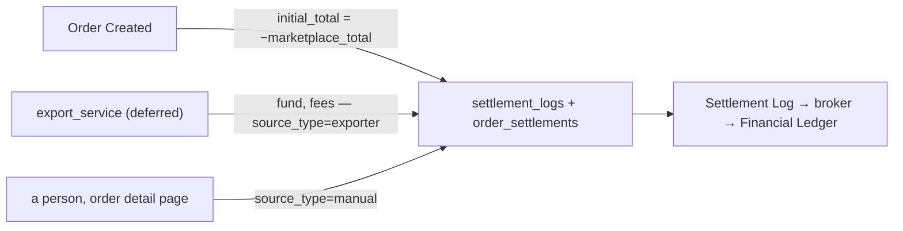

# Development state — settlement

**Pass:** `implementation` + `technical_test`, **COMPLETE** (2026-08-28). `design_accept` passed
before it — see [design-accepted](../../business/settlement/context_decision.md#design-accepted).
**Next:** `order_service` wiring (see *What is NOT built* below).

**Settlement is BUILT and SERVED.** Contract, schema, service, wiring, screens, tests and docs.

| | |
| --- | --- |
| proto | `proto/warehouse/settlement/v1/settlement.proto` — 2 services, 3 RPCs |
| schema | `settlement_logs` + `order_settlements`, 1 migration, applied |
| service | `backend/services/settlement_service/`, mounted in `app_development` and in reflection |
| tests | **17 unit** (real Postgres) + **2 concurrency** (`-tags raceaudit`), all pass |
| frontend | client, `features/settlement/`, route `/settlement`, menu entry (selling teams) |
| docs | [database-schema.md](../../database-schema.md#settlement_service) · [services/settlement_service/rpc.md](../../services/settlement_service/rpc.md) |

```sh
go test ./backend/services/settlement_service/...                                    # 17 pass
go test -tags raceaudit -run TestRace_Settlement ./backend/services/settlement_service/settlement_v1/
npx vitest run --project=storybook src/pages/order-settlement                        # 29 pass, unchanged
```

## The four decisions this pass turned into code

| decision | where it lives now |
| --- | --- |
| [initial-total-is-stored-positive](../../business/settlement/context_decision.md#initial-total-is-stored-positive) | the projection in `post_entry.go` — the ONLY sign flip |
| [every-entry-names-an-order](../../business/settlement/context_decision.md#every-entry-names-an-order) | `order_id BIGINT NOT NULL` on both tables |
| [the-cancel-key-is-order-plus-act-date](../../business/settlement/context_decision.md#the-cancel-key-is-order-plus-act-date) | `settlement_logs_unique_idx`, proved by `TestRace_SettlementPost_AbsorbsConcurrentRetries` |
| [only-machines-post-the-cancel](../../business/settlement/context_decision.md#only-machines-post-the-cancel) | `errCancelNotMachine`, enforceable because of [the-third-source-is-order](../../business/settlement/context_decision.md#the-third-source-is-order) |

## ⚠ What is NOT built, and what it costs

⛔ **1 is BLOCKED, and not on effort.** See below.

1. **`order_service` does not call settlement yet.** The contract and the in-process
   `Service.PostEntry` are both ready; nothing invokes them on order create or cancel. **Until that
   lands, every account must be opened by hand** — the automatic `initial_total` is the missing half.
   ⚠ It also carries a precondition: `order_service` must pass the **marketplace's cancel date**
   through, or [the-cancel-key-is-order-plus-act-date](../../business/settlement/context_decision.md#the-cancel-key-is-order-plus-act-date)
   is not implementable and reopens.
2. ✅ **DONE — the ledger is mounted as the THIRD TAB on the order detail page**
   (`pages/order-detail/components/SettlementTab.tsx`), with add and reverse wired to
   `usePostSettlementEntry`. Two stories pin it: a populated ledger against the design's own worked
   example, and the "never settled" case. The stub transport serves `OrderSettlementDetail`.
3. **`export_service` does not exist** — deliberate
   ([importing-is-not-settlements-job](../../business/settlement/context_decision.md#importing-is-not-settlements-job)).
   The `exporter` source is honoured by the API and nothing writes it yet.
4. **Four questions remain open** ([clarify](../../business/settlement/context_clarify.md#question)) —
   the failed-call behaviour, a `created` flag *(built anyway, as recommended)*, the platform
   withdrawal's home, and whether `problem funding` is `marketplace_adjustment`. Only the first blocks
   #1 above, and only for its error path.

## ⛔ Why `order_service` → settlement is BLOCKED

Two things stop it, and neither is work I can do without a decision.

**1. There is no cancel date to key on.** [the-cancel-key-is-order-plus-act-date](../../business/settlement/context_decision.md#the-cancel-key-is-order-plus-act-date)
requires the date the cancel ACTUALLY HAPPENED, and it named this precondition itself. Checked: the
order model, `order.proto` and `OrderCancel` carry **no cancel date at all** — our CS cancels in our
system, so there is no marketplace event to read one from. Substituting `now()` is exactly the option
the owner rejected, because a retry crossing midnight then credits the account twice.

**2. The transaction boundary is an OPEN question, not a detail.** `liability_service` posts in-process
by taking the caller's `tx`, which makes the write atomic with the order. Settlement could do the same —
but then a settlement failure **rolls the order back**, which is the opposite of the standing
recommendation that the order still commits. That is
[clarify Q1](../../business/settlement/context_clarify.md#question) /
[biggest_question.md](../../biggest_question.md) #2, and wiring it either way settles it silently.

**What is ready:** the contract, and `settlement_v1.Service.PostEntry(ctx, PostInput)` — the exported
in-process write path, deliberately shaped like `liability_v1.PostEntry` so the composition-root adapter
(the `*_poster.go` pattern) is a short file once the two answers land.

⚠ **Until then every account is opened BY HAND** from the order page's ledger tab. The screens work;
the automatic half does not exist.

## ⚠ A trap this pass walked into — read before migrating any renamed service

The dev database still held the OLD `settlement_*` tables and a `settlement_service_version` at
version 2, from before the service was renamed to `liability_service`. A new service reusing a retired
name **inherits its goose history**, so `migrate up` reported *"no migrations to run"* and silently
applied nothing.

[liability_service/db_migrations/00004_adopt_legacy_settlement_tables.sql](../../../backend/services/liability_service/db_migrations/00004_adopt_legacy_settlement_tables.sql)
already handles this — it copies any legacy rows and drops the old tables **including that version
table**, and is a no-op on a fresh database. The correct move was simply to run `migrate up-all`.

## Read this first

⚠ **`settlement` names two different things in this checkout.**

| | |
| --- | --- |
| **`backend/services/liability_service/`** — SHIPPED | what **teams owe each other**. 10 RPCs, 4 migrations, screens at `/liability`. ✅ **The rename from `settlement_service` has LANDED** — `pages/settlement/` is deleted and `proto/warehouse/liability/` is generated. |
| **`backend/services/settlement_service/`** — ✅ **NOW BUILT** | what the **marketplace pays us** for an order. 3 RPCs, 1 migration, screen at `/settlement`. This is what `settlement_service` means from here on. |

✅ **Settlement is small, and it is built.** An **order-scoped ledger with a write API**, and two read screens. File
import, per-marketplace parsing and matching all belong to a deferred **`export_service`**.

## The design in one page



- **The balance IS the loss.** `initial_total` is a frozen copy of `order.marketplace_total` — **what
  the buyer actually paid, a FACT not a prediction**. So the gap is exactly *how much of what the buyer
  paid never reached us*: the platform's take, which it never itemises. A residual is the expected end
  state — **there is no "settled" flag and no worklist of non-zero balances.**
- `net received = last_balance + initial_total` · `true margin = that − order.cogs`
- Append-only. No edit, no delete. A correction is a further row.
- Nothing is gated on `OrderStatus`.
- **Who may write is DECIDED:** `[ROOT, ADMIN, TEAM_OWNER, TEAM_ADMIN, CS]` scoped on `team_id`.
  `initial_total` is hand-postable by all of them **except `team_admin`** — and ⚠ only when the account
  holds no live one, because a second ADDS rather than replaces.

## What was decided

**37 decisions**, all in [context_decision.md](../../business/settlement/context_decision.md) with
specs. **One is ⛔ reversed** — read the index table there first. The load-bearing ones:

| decision | for code |
| --- | --- |
| [the-name-settlement-moves-to-the-payout](../../business/settlement/context_decision.md#the-name-settlement-moves-to-the-payout) | the shipped service renames to `liability_service` — folder, packages, proto package, 9 RPCs, 4 tables, goose version table, `features/settlement/`, i18n keys, and `/settlement*` routes **deleted**. ⚠ **must land before any `warehouse.settlement.v1` payout file exists** |
| [settlement-owns-revenue](../../business/settlement/context_decision.md#settlement-owns-revenue) | `revenue_service` is RETIRED — it was the same subscription freezing the same fact twice |
| [the-grain-is-the-order](../../business/settlement/context_decision.md#the-grain-is-the-order) · [the-state-holds-initial-total-and-last-balance](../../business/settlement/context_decision.md#the-state-holds-initial-total-and-last-balance) | `settlement_logs` scoped `order_id`; `order_settlements` holds `order_id`, `initial_total`, `last_balance` |
| [the-unique-id-is-generated-outside-settlement](../../business/settlement/context_decision.md#the-unique-id-is-generated-outside-settlement) · [the-recipe-is-the-callers-problem](../../business/settlement/context_decision.md#the-recipe-is-the-callers-problem) | `UNIQUE (order_id, unique_id)`. The recipe is the caller's, not settlement's |
| [hidden-cost-is-left-in-the-balance](../../business/settlement/context_decision.md#hidden-cost-is-left-in-the-balance) | the unexplained gap is real loss, left aggregated. **No `platform_fee` type** — the platform never itemises it |
| [a-residual-balance-is-normal](../../business/settlement/context_decision.md#a-residual-balance-is-normal) · [a-correction-is-a-new-row](../../business/settlement/context_decision.md#a-correction-is-a-new-row) | no settled flag, no worklist, no edit, no delete |
| [the-write-set-is-cs-and-up](../../business/settlement/context_decision.md#the-write-set-is-cs-and-up) · [initial-total-is-postable-by-cs-and-owners](../../business/settlement/context_decision.md#initial-total-is-postable-by-cs-and-owners) | the `request_policy` on every request message, and the type whitelist. ⚠ the handler must ALSO refuse a second live `initial_total` — the form hiding it is a convenience, not a control |
| [order-detail-manages-the-ledger](../../business/settlement/context_decision.md#order-detail-manages-the-ledger) | the ledger is a THIRD TAB on the order page — read, add, reverse. No edit, no delete |
| [entries-arrive-by-api-or-by-hand](../../business/settlement/context_decision.md#entries-arrive-by-api-or-by-hand) · [every-entry-names-its-actor](../../business/settlement/context_decision.md#every-entry-names-its-actor) | two write paths, `source_type` + `actor_id` on every row |

## Open questions — 4, and ONE of them now blocks the order_service wiring

Full set in [context_clarify.md](../../business/settlement/context_clarify.md#question). They split
cleanly by which lifecycle stage they belong to:

| # | question | blocks |
| --- | --- | --- |
| 1 | does the write response say `created` vs `already_existed`? | the contract |
| 2 | `marketplace_total` vs `order.total` when 0 | the **retired revenue screens**, not settlement's own |
| 3 | `initial_total` sign in `order_settlements` | the schema — `backend_analysis` |
| 4 | subscribe to `OrderCreatedEvent`, or does `selling_service` call? | the wiring — `backend_analysis` |
| 5 | is `order_id` ever NULL? | the schema — `backend_analysis` |
| 6 | where does a platform WITHDRAWAL live? | [architecture Q7](../../technical/architecture/context_clarify.md#question), not settlement |
| 7 | is `problem funding` just `marketplace_adjustment`? | one enum value |

**Every one carries a recommendation.** 1–2 are contract questions and the contract is accepted at
`design_accept` alongside the screens — so they travel INTO the prototype as proposals rather than
holding it up. 3–5 belong to `backend_analysis`, which is after the gate.

## What the next pass builds — AFTER the gate

`design_accept` blocks. Once accepted, `implementation` runs in this order and the first item is not
negotiable:

| # | | why in this order |
| --- | --- | --- |
| 1 | **the rename** — `settlement_service` → `liability_service` | **37 Go files** in the service (110 across the repo mention `settlement`), the proto package, 4 tables, `features/settlement/`, the `/settlement*` routes. ⚠ **Must land before any `warehouse.settlement.v1` file exists** — two things called settlement in one checkout is how the wrong one gets imported |
| 2 | the payout proto + `buf generate` | the namespace is only free after (1) |
| 3 | migration, models, the three RPCs | `backend_analysis` answers Q3–Q5 first |
| 4 | rewire the prototype to the real client | `pages/order-settlement/` → `pages/settlement/`, local types → generated |
| 5 | retire `revenue_service` | ⚠ changes what `/revenue`, `/profit` and `/daily-statement` show — see Q2, now the **#7 biggest question** repo-wide |

## Contradictions standing

- **`marketplace_total` is documented as the field nothing computes from** (`order.proto:216`) and
  settlement now opens every account from it. The ⚠ on line 226 (*never in margin or revenue*) stays
  correct; the "nothing computes" half is stale.
- **`liability_service` and `balance_service`** (`architecture/context.md:7`) are the same box under two
  names, and the architecture clarify proposes splitting the shipped service into a `balance_service` it
  believes does not exist yet. `export_service` has the same problem in advance — named in
  `settlement_context` §General Brief 3, absent from the doc that names services.

## ⚠ The order detail page is COPIED, not edited

`components/OrderDetailPreview.tsx` rebuilds the shell of
[frontend/src/pages/order-detail/index.tsx](../../../frontend/src/pages/order-detail/index.tsx) —
back button, header, vertical tabs — and adds **Settlement** as a third tab.

**Info and Timeline in it are the REAL shipped components**, so what the owner previews is the actual
page with one tab added, not a drawing of it. Only the tab under review is invented.

| | |
| --- | --- |
| why not just edit the real page? | it is live on `/orders/:orderId` against a real server. A fixture-fed ledger there shows **invented money on real orders** — and `design_accept` exists so a rejected design costs the prototype and nothing else |
| what happens when it is accepted? | **this file dies.** The third tab moves into `pages/order-detail/index.tsx` and the shell is deleted. It must never become a second order detail page that drifts from the first |

**The shipped order detail page now has its own story too** — `Pages/Order/OrderDetailPage`, 8 tests.
It had none before, so reviewing the settlement tab in place meant first making the page it sits on
previewable at all: `OrderDetail` had to be stubbed (it is a DIFFERENT message from a list row — it
is the only read that populates `items` and `events`), and so did `UserByIDs`, whose absence
`fetchActors` swallows into a silently name-less timeline.

The two stories check the same figure from both ends: `MarketplaceTotalDiffersFromOurs` proves
`order.marketplace_total` (245.000) and `order.total` (250.000) are **two different facts**, and
`MarketplaceTotalMatches` proves the first of them reaches the settlement tab unchanged.

The preview also pins the one figure both screens share: `MarketplaceTotalMatches` asserts the Info
tab's `order.marketplace_total` and the Settlement tab's `initial_total` print the **same number** —
[the-sale-is-recorded-once-and-copied-verbatim](../../business/settlement/context_clarify.md), rendered
as a test. Every derived figure inherits that copy, so a disagreement there is the worst thing this
design can get wrong.

---

# Implementation — step 1 of 5. ✅ **NO LONGER BLOCKED** (2026-08-29)

`design_accept` passed (2026-08-28) — see
[design-accepted](../../business/settlement/context_decision.md#design-accepted). The rename is done
in source **and generated**: `go build ./...` and `npm run typecheck` are both clean.

## ✅ The Buf token is no longer needed — the plugins are LOCAL

This section used to say `buf generate` was blocked on `buf registry login`. **That is fixed, and not
by logging in.** [proto/buf.gen.yaml](../../../proto/buf.gen.yaml) now uses `local:` plugins:

| plugin | pinned by |
| --- | --- |
| `protoc-gen-go` | a `tool` directive in the root [go.mod](../../../go.mod) |
| `protoc-gen-connect-go` | the same |
| `protoc-gen-es` | a devDependency in [frontend/package.json](../../../frontend/package.json) |

```sh
cd proto && buf generate      # needs Go and frontend/node_modules. No Buf account.
```

⚠ **`clean: true` still applies** — a failed run empties `backend/gen` and `frontend/src/gen` before
failing. They are committed: `git checkout -- backend/gen frontend/src/gen`.

### ⚠ The rejection recorded here was half right — read this before repeating it

This file rejected local plugins for **version drift**: the machine's `protoc-gen-go` is v1.36.11
against a committed v1.36.6, so generating locally rewrote every file with a different version stamp.
**The observation was correct and the conclusion did not follow.** It was rejecting *whatever happens
to be installed*, not *pinning to the version the config names*. Pinned, the output is byte-identical
— verified by generating into a scratchpad and diffing both trees.

| attempt | verdict |
| --- | --- |
| local plugins **on PATH** (`go install`) | ⛔ **still wrong.** A global plugin is whatever another project needed. This is the drift above |
| local plugins **pinned as dependencies** | ✅ **this is what shipped.** `go tool` builds the plugin from the module's own protobuf, and `protoc-gen-es` sits beside `@bufbuild/protobuf` at a matching version |
| **hand-renaming the generated `.pb.go`** | ⛔ **it corrupts the descriptor.** The rawDesc is a length-prefixed binary blob holding the file path and package name. `settlement` → `liability` is 10 chars → 9, so every embedded length is then wrong and the file fails to parse at init. This is the concrete reason behind *"generated code is never hand-edited"* |

⚠ **A generator and the runtime it generates against MUST be the same version.** `protoc-gen-es` 2.2.5
against `@bufbuild/protobuf` 2.12 dies with *"Cannot read properties of undefined (reading 'length')"*,
which reads like a corrupt `.proto` and is not.

## What IS done

| | |
| --- | --- |
| proto | `proto/warehouse/liability/v1/liability.proto` — package, 3 services, 9 RPCs, every message and enum. **`buf lint` passes** |
| Go | the service tree, both inner packages, every file, and every identifier repo-wide including the 4 other services that call it |
| migrations | 00001–00003 renamed to create `liability_*`; **00004 adopts any legacy rows and drops the old tables** — see [database-schema.md](../../database-schema.md#liability_service) |
| frontend | `features/liability/`, the money screens that read it, the Storybook stub and fixtures, both locales |
| **deleted** | `pages/settlement/` and `pages/counterparty/` (466 lines), their two routes, and their two e2e tests |
| docs | `docs/services/liability_service/`, three sibling `rpc.md` files, `database-schema.md` |

⚠ **The two deleted pages were the SUPERSEDED ones**, replaced by `/liability` and
`/liability/:counterpartyId` (#221/#222) with the nav already pointing at the new ones. The payout
screens want those exact paths.

**The e2e spec is now `e2e/liability.spec.ts`**, and its first test was NOT deleted even though its
screen was: it *creates* the COD debt the three later tests read, under `mode: "serial"`. Its
assertions were dropped and its name now says it seeds. The second test — the same debt read from the
creditor's side — was **retargeted** at `/liability` rather than deleted with the old page: nothing
else covers the two-sided reading.

## After `buf generate`, in order

1. `go build ./... && go vet ./... && go test ./...` from the repo root
2. `cd frontend && npm run typecheck && npm run test:stories`
3. `go run ./tools/san migrate up --service liability_service` — runs 00001–00004 and adopts the old rows
4. then step 2 of 5: the payout proto, in the namespace the rename just freed
