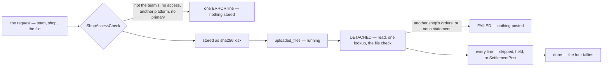

# Development state — settlement / settlement_importer

**Pass:** ✅ **implemented** (2026-09-29) — design_accept passed
([the-prototype-and-its-contract-are-accepted](../../business/settlement/settlement_importer_decision.md#the-prototype-and-its-contract-are-accepted)),
the owner answered what it waited on outside its doc the same day (settlement Q1, shop Q7, reader #23, the source
rename), and the whole of it is built, tested end to end and audited. Before it: the Storybook prototype
(`implementation_analysis`), and business analysis from 2026-09-26. Source:
[settlement_importer.md](../../business/settlement/settlement_importer.md) (owner) · questions:
[settlement_importer_clarify.md](../../business/settlement/settlement_importer_clarify.md) — none open ·
decided: [settlement_importer_decision.md](../../business/settlement/settlement_importer_decision.md) ·
flows: [rpc.md](../../services/settlement_importer_service/rpc.md).

## What exists — built 2026-09-29, in commit order

| | commit | |
| --- | --- | --- |
| the decisions | 816a758 | design_accept, [withdrawal-counts-in-the-position](../../business/settlement/context_decision.md#withdrawal-counts-in-the-position), [the-report-headline-is-position-to-date](../../business/settlement/context_decision.md#the-report-headline-is-position-to-date), [the-primary-cs-is-a-flag-on-a-grant](../../business/shop/context_decision.md#the-primary-cs-is-a-flag-on-a-grant), [the-built-tiktok-item-is-the-contract](../../technical/packages/excel_readers/context_decision.md#the-built-tiktok-item-is-the-contract), [the-source-is-named-importer](../../business/settlement/settlement_importer_decision.md#the-source-is-named-importer) |
| server streams authorized | 19c9a95 | the access interceptor checks a server stream's token from its headers before the handler, and its one request in `Receive` before the handler body; client and bidi streams stay refused. `CLAUDE.md`, both FAQ answers, `san.md` rewritten with it |
| the shop | f6dab3b | `ShopAccessCheck` (team-scoped, `is_have_access` = a grant or a manager role, via `RoleReader`) · `shop_users.is_primary` (00014, one per shop, backfilled from each shop's earliest grant) · `ShopUserSetPrimary` · `Shop.primary_user_id` · the first grant becomes primary |
| orders | f6dab3b | `OrderByExternalRefs` — up to 2,000 refs a call, every match answered, on `orders_team_external_ref_idx` |
| settlement | 9f20652 | the five types of 2026-09-24 in the enum, mapper, fold columns (00006) and `SettlementMetric` · `SOURCE_TYPE_IMPORTER` (00006 rewrote `exporter`) · an imported shop row asks the shop for its primary CS BEFORE the transaction (`ShopPrimary`) and writes `settlement_logs.user_id`, carried on the event and read by the fold · the report's *Position to date* and *Withdrawn* |
| the reader | 5039c93 | `ShopeeSettlementDocument.GetDetails()` — each row's `Status` and `Jenis Transaksi`, outside the hash |
| documents | 5204843 | `DOCUMENT_RESOURCE_TYPE_SETTLEMENT_STATEMENT`, private |
| **the service** | f163139 | [backend/services/settlement_importer_service/](../../../backend/services/settlement_importer_service/) — `uploaded_files`, `uploaded_file_lines` (00001) · the two streamed imports and the three reads · mounted, with its four dependencies as Connect clients forwarding the uploader's token ([settlement_importer_deps.go](../../../backend/cmd/app_development/settlement_importer_deps.go)) · the dev server lets running imports finish before it stops |
| the screens | b8265c7 + c9c1861 | the list and the Import File dialog (`/settlement/imports`), one file's page (`/settlement/imports/:fileId`) — built in the prototype against the real client, so they needed nothing new · the shop's Primary CS badge, Make primary and the *No primary CS* warnings |
| the dev database | — | migrated 2026-09-29: selling 00014, settlement 00006, document 00006, settlement_importer 00001 |

```sh
go test ./backend/services/settlement_importer_service/... ./backend/services/selling_service/... ./backend/services/settlement_service/... ./backend/services/user_service/access_interceptors/ ./backend/pkgs/san_excel_readers/ ./backend/pkgs/san_auth/
cd frontend && npx playwright test e2e/settlement_imports.spec.ts e2e/shops.spec.ts   # needs the Pub/Sub emulator — see the traps
cd frontend && npx vitest run --project=storybook src/pages/settlement-imports src/pages/settlement-import-detail src/pages/settlement-report
```

## How one import runs



Each line becomes POSTED (to its order, or to the shop when its ref finds none), EXISTING, HELD (unmapped type, a
fraction, a refusal from settlement) or SKIPPED (a failed withdrawal and its refund; TikTok's Earnings and GMV Pay
Deduction). The details are in [rpc.md](../../services/settlement_importer_service/rpc.md).

## What is decided — and where it lives

| decision | in the code |
| --- | --- |
| [the-import-is-one-streamed-call](../../business/settlement/settlement_importer_decision.md#the-import-is-one-streamed-call) · [every-stream-message-is-a-leveled-log-line](../../business/settlement/settlement_importer_decision.md#every-stream-message-is-a-leveled-log-line) | `import_run.go` · `stream_log.go` — the guideline's slog binding as a `slog.Handler`, so `level` is a field; `step` · `count` · `file` are attributes |
| [a-server-stream-is-authorized-on-its-request](../../business/settlement/settlement_importer_decision.md#a-server-stream-is-authorized-on-its-request) | `access_interceptors/interceptor.go` — `authenticate` (headers) and `gate.authorize` (the body), shared with unary calls |
| [the-shop-is-checked-before-the-file-is-stored](../../business/settlement/settlement_importer_decision.md#the-shop-is-checked-before-the-file-is-stored) · [a-shop-with-no-primary-cs-cannot-import](../../business/settlement/settlement_importer_decision.md#a-shop-with-no-primary-cs-cannot-import) | `checkShop` — four refusals, one ERROR line each |
| [the-file-is-named-by-its-content-hash](../../business/settlement/settlement_importer_decision.md#the-file-is-named-by-its-content-hash) · [the-row-key-is-the-only-dedupe](../../business/settlement/settlement_importer_decision.md#the-row-key-is-the-only-dedupe) | `<sha256>.xlsx`, nothing unique on the file · keys `<platform>:<sheet>:<GenerateUniqueID>` |
| [a-file-with-another-shops-orders-is-refused](../../business/settlement/settlement_importer_decision.md#a-file-with-another-shops-orders-is-refused) | `foreignShop` — a ref found ONLY in other shops; the shop holding the most such refs is named |
| [an-unmatched-ref-posts-to-the-shop](../../business/settlement/settlement_importer_decision.md#an-unmatched-ref-posts-to-the-shop) · [user-id-is-the-orders-creator-else-the-shops-primary-cs](../../business/settlement/settlement_importer_decision.md#user-id-is-the-orders-creator-else-the-shops-primary-cs) · [settlement-asks-the-shop-for-its-primary-cs](../../business/settlement/settlement_importer_decision.md#settlement-asks-the-shop-for-its-primary-cs) | `postLine` passes the order's creator when found; settlement's `importedShopRowUser` asks for the primary |
| [a-tiktok-row-finds-its-order-by-related-order-id](../../business/settlement/settlement_importer_decision.md#a-tiktok-row-finds-its-order-by-related-order-id) · [tiktok-affiliate-commission-posts-as-affiliate-fee](../../business/settlement/settlement_importer_decision.md#tiktok-affiliate-commission-posts-as-affiliate-fee) | `readTiktok` — `RelatedOrderRefID`; the `Affiliate…` columns as their own row, a held fund holds its commission |
| [only-a-successful-withdrawal-is-recorded](../../business/settlement/settlement_importer_decision.md#only-a-successful-withdrawal-is-recorded) | `readShopee` — completed AND outgoing; `readTiktok` — `Transferred` |
| [an-import-finishes-whether-anyone-watches](../../business/settlement/settlement_importer_decision.md#an-import-finishes-whether-anyone-watches) · [an-upload-is-never-reverted](../../business/settlement/settlement_importer_decision.md#an-upload-is-never-reverted) · [the-import-has-no-dry-run-for-now](../../business/settlement/settlement_importer_decision.md#the-import-has-no-dry-run-for-now) | `context.WithoutCancel` + `streamSink.detach` · INTERRUPTED derived from a stale `updated_at` · no revert, no dry run, no Cancel anywhere |
| [cs-and-up-import-daily](../../business/settlement/settlement_importer_decision.md#cs-and-up-import-daily) | the proto's policy on all five requests · `canImportSettlement` for the menu |

## ⚠ My readings, built — the owner may overturn each cheaply

| | |
| --- | --- |
| a skipped Earnings / GMV Pay Deduction line is INFO, a failed withdrawal WARN | the accepted prototype showed routine skips outside the closing summary; the withdrawal decision says WARN |
| the order a ref finds, among several in the shop | a live order before a cancelled one, then the newest — the uniqueness rule is not built, so duplicates can exist |
| a new grant on a shop left with NO primary becomes it | the recorded reading of *first* — re-adding an existing grant changes nothing |
| `ShopAccessCheck` keeps the owner's field name `is_have_access` | critique 10 had suggested `has_access` |
| the handler's read cap is 15 MB | the browser sends JSON: 10 MB of file is ~13.4 MB of base64. The file itself is held to 10 MB |
| a DB failure mid-import leaves the row running | it reads interrupted after two minutes, and the same file again finishes it |

## ⛔ What is NOT built — and whose it is

| | owner |
| --- | --- |
| **the order uniqueness rule** — [an-order-is-unique-by-shop-and-marketplace-ref](../../business/order/context_decision.md#an-order-is-unique-by-shop-and-marketplace-ref): a ref required on every order, no two live orders sharing it | the order context — its drafts-vs-orders and same-second questions are open there |
| **the write gate on the order RPCs** and the rollout grants — [a-write-needs-a-grant-or-a-manager](../../business/shop/context_decision.md#a-write-needs-a-grant-or-a-manager) | the shop context — only the imports are gated |
| **the move to `shop_service`** — [the-shop-gets-its-own-service](../../business/shop/context_decision.md#the-shop-gets-its-own-service) | the shop context — only `NewShopClient` and the adapters in `cmd/app_development` change |
| **a closed shop's statements** — a deleted shop answers `NotFound`, so it cannot import | [shop Q3](../../business/shop/context_clarify.md#question) |
| **whether a TikTok period re-downloaded in the 2026-09 layout keeps its keys** | the reader — [its questions](../../technical/packages/excel_readers/context_clarify.md#question) |
| `auto_import.md` — an empty heading beside the doc | [critique 11](../../business/settlement/settlement_importer_clarify.md#critique) |
| a screen listing a shop's OWN rows — so a wrong imported shop row has no screen to offset it from | settlement |

## Measured

| | |
| --- | --- |
| every real sample | all 26 workbooks import to DONE through the streamed handler (`TestImport_EverySampleStatementImports`, skipped where `examples/` is absent) — the failed-withdrawal samples skip exactly their two rows each, 5 TikTok files hold one unmapped type each |
| end to end | `e2e/settlement_imports.spec.ts` — 4 pass in ~30 s against the real server: refused with no primary CS, 5 of 5 rows (3 posted, 2 to the shop, 1 held, 1 skipped), the file's page, the same file again all *already there* |
| largest file | Shopee 1,463 rows / 19 days · TikTok 830 + 41 withdrawals / 26 days · 246 KB in bytes |
| keys across files | 193 lines appear in two or more samples, and 0 change key |
| withdrawals vs `fund` | −839,987,638 against +827,877,151 — 101% — now IN the position, by decision |

## Audited (2026-09-29)

Every RPC this pass wrote or widened, audited for performance and every write for concurrency. The reports live in
`audits/` and hold the numbers.

| service | performance | concurrency | fixed by this pass | open — the owner's |
| --- | --- | --- | --- | --- |
| settlement_importer | 🔴 both imports, by design: 2 statements and 2 commits a line, 4.98 s of the importer's own SQL for 1,500 rows ([Shopee](../../../audits/services/settlement_importer_service/performances/ShopeeSettlementImport.md), [TikTok](../../../audits/services/settlement_importer_service/performances/TiktokSettlementImport.md)) · the three reads ✅ ≤ 3 ms | ✅ safe — 8 uploads of one file, every key once ([lock-order](../../../audits/services/settlement_importer_service/concurrency/lock-order.md)) | — | the line-write shape (one statement a line, 2.9×) · what INTERRUPTED means, since no internal call has a timeout |
| settlement — the imported shop row | 🔴 N+1: one `ShopAccessCheck` a row, 1,500 on the largest file ([report](../../../audits/services/settlement_service/performances/SettlementPost.md)) | 🟡 one key racing on two shops answers `internal`, not `invalid_argument` ([report](../../../audits/services/settlement_service/concurrency/SettlementPost.md)) | ✅ a retry of a stored row no longer needs the shop (760b8e2) · ✅ the shop-grain race test, red since 9f20652, repaired | a cache per `(team, shop)` · map the cross-account 23505 to `errUniqueIDTaken` |
| selling — the shop, the refs | ✅ `ShopAccessCheck`, `ShopUserAdd`, `ShopUserSetPrimary` · 🟡 `OrderByExternalRefs` at its 2,000 cap, ~1,900 rows, and 45 of its 50 ms a host stall, not the query ([report](../../../audits/services/selling_service/performances/OrderByExternalRefs.md)) | 🟡 Make primary racing a removal replied OK and left no primary ([report](../../../audits/services/selling_service/concurrency/ShopUserSetPrimary.md)) | ✅ the set must land or roll back (a96a491) | lock the grant at the check, or Remove takes the shop lock · `FOR NO KEY UPDATE` in `lockShop`, which today holds back every order on the shop ([the-lock-no-grep-finds](../../../audits/services/selling_service/concurrency/lock-order.md#the-lock-no-grep-finds)) · `OrderDraftPromote` may place a draft twice — seen, not raced |

## ⚠ Traps for whoever touches it next

- ⚠ **No Pub/Sub emulator means every `SettlementPost` waits 60 s.** `event_source` waits up to `publishTimeout` for the
  broker's ack, so an import with the emulator down crawls a minute a line. `docker compose --profile pubsub up -d` and
  `go run ./tools/san pubsub ensure --project warehouse-dev --emulator` before running the e2e or importing in dev. The
  same wait hits order placement. **CI had no emulator either** — since f1854cd its test job starts one and runs
  `san pubsub ensure` before the e2e, unverified until the next PR runs it.
- ⚠ **The detached import shares `san_testdb.DB(t)`'s one transaction in tests.** Read the database only after the
  stream has ended or `Service.Wait()` returned — never while an import goroutine may still be writing.
- ⚠ **Nothing may write to a stream after its handler returns.** `streamSink.detach` is called before the handler
  returns and every send takes the same lock; keep it that way.
- ⚠ **A stream handler's ctx has the identity and bearer, not the scope** — read `team_id` off the request.
- ⚠ **The importer is a CLIENT of four services under the uploader's token.** A new call it makes goes through an
  interface it owns and an adapter at the composition root — never an import of another service's package (the shop
  lives in selling, which calls settlement: a Go-level cycle waiting to happen).
- ⚠ **Never ask the shop while the account is locked** — settlement asks before its transaction; keep it there.
- ⚠ **A failed ask is HELD, not returned** (`postEntry`'s `askErr`): a retry of a stored row is answered from the
  ledger whatever the shop says, and only a NEW row is refused. Returning it early broke the retry for a day.
- ⚠ **Make primary's set must land** — `ShopUserRemove` takes no shop lock, and the `RowsAffected` check is all that
  stops a racing removal from leaving the shop with no primary.
- ⚠ **The `raceaudit` and `perfaudit` tests are outside CI.** A shop-grain race test stayed red for a day
  unnoticed. After touching a write path, run `go test -tags raceaudit ./backend/services/<service>/...`.
  `TestInterleave_ImportedShopRow_AKeyCollidingAcrossShopsAnswersInternal` fails **by design** until the owner
  answers the 23505 mapping.
- ⚠ **Two people per imported row** — `actor_id` is the uploader, `user_id` the primary CS on a shop row. Never write
  one into the other.
- ⚠ **The commission is on the DETAIL, never the item**, and a file with no `Affiliate…` column is refused.
- ⚠ **Look a TikTok row up by `Related order ID`**, never `Order/adjustment ID`.
- ⚠ **A re-import cannot correct anything** — a repeat key returns the stored row, a key on another account is refused.
- ⚠ **The owner's `tools/report_withdrawal/` is theirs** — read it, never edit it.
