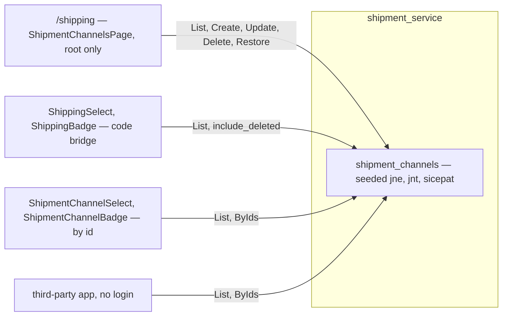

# Development state — shipment

**DONE — fully implemented (2026-09-16).** Business design decided, prototype accepted
([the-prototype-is-accepted](../../business/shipment/context_decision.md#the-prototype-is-accepted)), backend built,
wired, tested, audited. Deferred by decision, not missing: tracking, the handover to the courier.

- Owner doc: [context.md](../../business/shipment/context.md)
- Decisions: [context_decision.md](../../business/shipment/context_decision.md) — 15
- Clarify: [context_clarify.md](../../business/shipment/context_clarify.md) — **empty**

## What exists

| layer | where |
| --- | --- |
| contract | `proto/warehouse/shipment/v1/shipment.proto` — reads `allow_all`, writes `ROLE_ROOT` |
| migration | `backend/services/shipment_service/db_migrations/00001_create_shipment_channels.sql` (plain unique index on code, seed) |
| handlers | `backend/services/shipment_service/shipment_v1/` — one file per RPC; update/delete/restore share `write_row.go` (single `UPDATE … RETURNING`) |
| unit tests | 16, one `<rpc>_test.go` per RPC, real Postgres |
| wiring | `wire.go` + `service_api.go` (replaced shipping_service) |
| frontend | `pages/shipment-channels/` at `/shipping`, nav item root-only; `features/shipment/`; the two new components; `features/shipping/catalogue.ts` now reads shipment_service |
| stories | page, `ShipmentChannelSelect`, `ShipmentChannelBadge`, plus the re-pointed `ShippingSelect`/`ShippingBadge` — full suite 1441 pass |
| e2e | `frontend/e2e/shipment_channels.spec.ts` — 4 pass (public reads / 401 write, seed, create+edit, delete/refuse/restore) |
| perf audit | all 6 fast, no report. Probes build-tagged `perfaudit` beside the handlers |
| concurrency audit | all 4 writes safe, no report — `shipment_channel_race_test.go` (tag `raceaudit`), service lock-order table in `audits/services/shipment_service/concurrency/lock-order.md` |

## Removed

`shipping_service` (service, `warehouse.shipping.v1`, generated code), `pages/shipping-channels`, the
`catalog.shipping.*` i18n keys, the `ShippingService` Storybook stub and the `couriers` fixture.

## ⚠ Known leftovers — by decision

| | why |
| --- | --- |
| selling orders + restocks still store `shipping_code` | the move to `shipment_channel_id` is the ORDER redesign's ([the-old-catalogue-bridges-by-code](../../business/shipment/context_decision.md#the-old-catalogue-bridges-by-code)) |
| codes outside the seed (`anteraja`, `tiki`, …) on old rows render as the raw code | root creates the channel to name them |
| `shippings` + `shipping_service_version` remain in existing databases | no service migrates another's table |
| `docs/technical/architecture/context_clarify.md` still proposes a `shipping_service` | a proposal in an agent clarify, superseded by the shipment decisions — re-examine it with that doc |

## Next, when picked up

- Order redesign: `ShipmentChannelSelect` / `ShipmentChannelBadge` + `useShipmentChannelsByIds` are ready for `shipment_channel_id`; then retire the code bridge (`features/shipping/catalogue.ts`, `ShippingSelect`, `ShippingBadge`).
- Tracking and handover: undesigned ([tracking-is-deferred](../../business/shipment/context_decision.md#tracking-is-deferred), [the-handover-is-shipments-and-deferred](../../business/shipment/context_decision.md#the-handover-is-shipments-and-deferred)).
