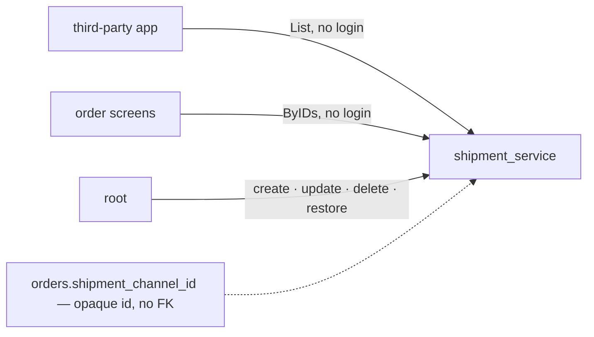

# Development state — shipment

**Business design: fully decided (2026-09-16). Prototype built — WAITING AT `design_accept`.** Nothing downstream (backend analysis, migration, handlers) may start until the owner accepts ([design-accept-blocks](../../development_lifecycle_decision.md#design-accept-blocks)).

- Owner doc: [context.md](../../business/shipment/context.md)
- Decisions: [context_decision.md](../../business/shipment/context_decision.md) — 13, every one with its spec
- Clarify: [context_clarify.md](../../business/shipment/context_clarify.md) — **empty**

## What was decided, in one table

| | |
| --- | --- |
| grain | one channel per **courier** — no service level |
| table | `shipment_channels`: `id`, `code` (unique over ALL rows, never changes), `name`, `desc`, `is_deleted`, `created_at`, `updated_at` |
| delete | soft only; a deleted code comes back by **restore**, same id — never a re-create |
| seed | `jne`, `jnt`, `sicepat` in the migration |
| reads | `ShipmentChannelList` (live only, guideline List shape, paged) and `ShipmentChannelByIDs` (deleted too, flagged) — **both `allow_all`, no login** |
| writes | create / update (`name`, `desc`) / delete / restore — **`ROLE_ROOT` only**, no `use_scope` |
| courier text | NOT ours — the third-party app maps platform text to our id; no alias table |
| deferred | tracking · the handover to the courier |

## The prototype (implementation_analysis, 2026-09-16)

Owner chose **new shipment, retire old** — the old `shipping` code is untouched until acceptance.

| piece | where | preview |
| --- | --- | --- |
| contract | [proto/warehouse/shipment/v1/shipment.proto](../../../proto/warehouse/shipment/v1/shipment.proto) — generated, **no handler, no migration** | — |
| page | [pages/shipment-channels/](../../../frontend/src/pages/shipment-channels/) — search, show-deleted, create, edit (code read-only), delete (confirmed), restore | `Pages/Shipment/ShipmentChannels` |
| picker | [ShipmentChannelSelect](../../../frontend/src/components/pickers/ShipmentChannelSelect.tsx) — live only, emits the id | `Components/Pickers/ShipmentChannelSelect` |
| badge | [ShipmentChannelBadge](../../../frontend/src/components/badges/ShipmentChannelBadge.tsx) — deleted still named, unknown as #id | `Components/Badges/ShipmentChannelBadge` |
| reads/writes | [features/shipment/](../../../frontend/src/features/shipment/) | — |
| stub | `ShipmentChannelService` in .storybook/stubTransport.ts — writeable, reset per story, enforces code uniqueness over deleted rows | — |

20 story tests pass. **Not in the router or the nav** — the dev app would call a service no server mounts.

### ⚠ Accept these with the screens

| | why |
| --- | --- |
| `ShipmentChannelListFilter.include_deleted` (default false) | NOT in the decisions — derived from the screen: root cannot restore a channel it cannot see. The default keeps [a-deleted-channel-still-resolves-by-id](../../business/shipment/context_decision.md#a-deleted-channel-still-resolves-by-id)'s "list is live only" for the picker and the app |
| the RPC is `ShipmentChannelByIds`, not `ByIDs` | matches every existing proto (`SupplierByIds`) |
| column `desc` is proto field `desc` | kept the owner's name |
| code pattern `^[a-z0-9_]+# Development state — shipment

**Business design: fully decided (2026-09-16). Prototype built — WAITING AT `design_accept`.** Nothing downstream (backend analysis, migration, handlers) may start until the owner accepts ([design-accept-blocks](../../development_lifecycle_decision.md#design-accept-blocks)).

- Owner doc: [context.md](../../business/shipment/context.md)
- Decisions: [context_decision.md](../../business/shipment/context_decision.md) — 13, every one with its spec
- Clarify: [context_clarify.md](../../business/shipment/context_clarify.md) — **empty**

## What was decided, in one table

| | |
| --- | --- |
| grain | one channel per **courier** — no service level |
| table | `shipment_channels`: `id`, `code` (unique over ALL rows, never changes), `name`, `desc`, `is_deleted`, `created_at`, `updated_at` |
| delete | soft only; a deleted code comes back by **restore**, same id — never a re-create |
| seed | `jne`, `jnt`, `sicepat` in the migration |
| reads | `ShipmentChannelList` (live only, guideline List shape, paged) and `ShipmentChannelByIDs` (deleted too, flagged) — **both `allow_all`, no login** |
| writes | create / update (`name`, `desc`) / delete / restore — **`ROLE_ROOT` only**, no `use_scope` |
| courier text | NOT ours — the third-party app maps platform text to our id; no alias table |
| deferred | tracking · the handover to the courier |

, max 40 | a stable lowercase key for the app to map onto — not in the decisions |
| restore has no confirm, delete does | restore is undone by deleting again |

### After acceptance (not before)

1. `backend_analysis` → `shipment_service` (models, goose migration with the seed, handlers + a unit test per RPC, register, wire).
2. Route + nav entry (root only), then retire `shipping_service`, `pages/shipping-channels`, `ShippingSelect`, `ShippingBadge` and move order screens to the id.

## ⚠ What already exists and conflicts

`backend/services/shipping_service/` is a **built** courier catalogue: table `shippings` (`id`, `code`, `name`,
`active`, timestamps), RPCs `ShippingList` / `ShippingCreate` / `ShippingUpdate`, and `selling_service`'s order
model references it by code. Differences from the decided design:

| built | decided |
| --- | --- |
| name `shipping_service`, table `shippings` | `shipment_service`, `shipment_channels` |
| `active` | `is_deleted` + restore |
| no `desc` | `desc` |
| `ShippingList` unpaged (HARD RULE 9 exemption) | List shape, paged |
| no ByIDs | `ShipmentChannelByIDs`, deleted included |
| order stores a code | order stores `shipment_channel_id` ([order decision](../../business/order/context_decision.md#shipment-channel-is-an-id-into-shipment-service)) |

Whether to rename/rework `shipping_service` or build `shipment_service` new and retire it is **not decided** —
raise it at implementation time; do not pick silently (HARD RULE 8).

## Open elsewhere

- [an-order-cannot-be-created-without-a-channel](../../business/order/context_clarify.md#an-order-cannot-be-created-without-a-channel) — order's clarify.
