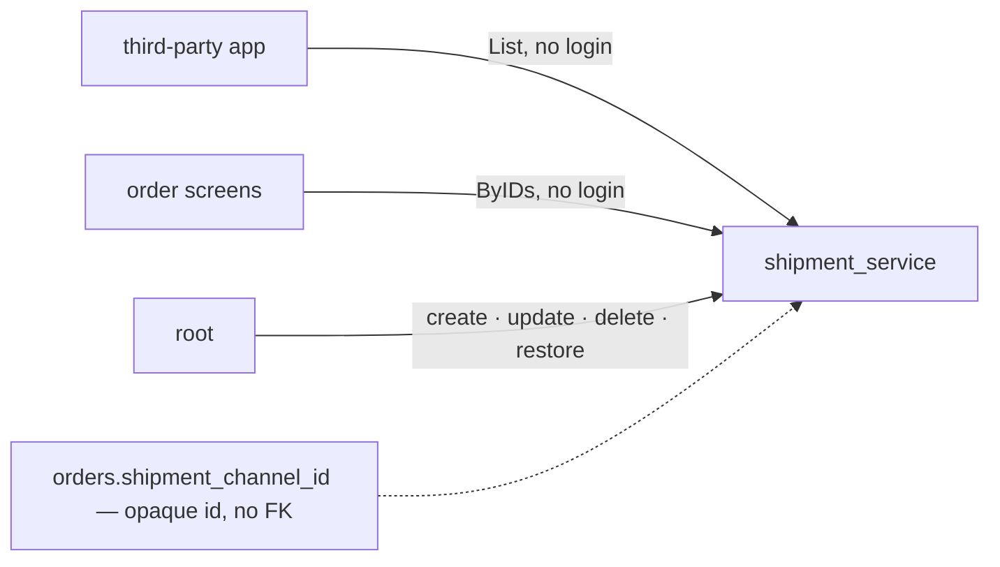

# Development state — shipment

**Business design: fully decided (2026-09-16). Nothing built.** Next pass: the lifecycle — frontend first.

- Owner doc: [context.md](../../business/shipment/context.md)
- Decisions: [context_decision.md](../../business/shipment/context_decision.md) — 13, every one with its spec
- Clarify: [context_clarify.md](../../business/shipment/context_clarify.md) — **empty**

## What was decided, in one table

| | |
| --- | --- |
| grain | one channel per **courier** — no service level |
| table | `shipment_channels`: `id`, `code` (unique over ALL rows, never changes), `name`, `desc`, `is_deleted`, `created_at`, `updated_at` |
| delete | soft only; a deleted code comes back by **restore**, same id — never a re-create |
| seed | `jne`, `jnt`, `sicepat` in the migration |
| reads | `ShipmentChannelList` (live only, guideline List shape, paged) and `ShipmentChannelByIDs` (deleted too, flagged) — **both `allow_all`, no login** |
| writes | create / update (`name`, `desc`) / delete / restore — **`ROLE_ROOT` only**, no `use_scope` |
| courier text | NOT ours — the third-party app maps platform text to our id; no alias table |
| deferred | tracking · the handover to the courier |

## ⚠ What already exists and conflicts

`backend/services/shipping_service/` is a **built** courier catalogue: table `shippings` (`id`, `code`, `name`,
`active`, timestamps), RPCs `ShippingList` / `ShippingCreate` / `ShippingUpdate`, and `selling_service`'s order
model references it by code. Differences from the decided design:

| built | decided |
| --- | --- |
| name `shipping_service`, table `shippings` | `shipment_service`, `shipment_channels` |
| `active` | `is_deleted` + restore |
| no `desc` | `desc` |
| `ShippingList` unpaged (HARD RULE 9 exemption) | List shape, paged |
| no ByIDs | `ShipmentChannelByIDs`, deleted included |
| order stores a code | order stores `shipment_channel_id` ([order decision](../../business/order/context_decision.md#shipment-channel-is-an-id-into-shipment-service)) |

Whether to rename/rework `shipping_service` or build `shipment_service` new and retire it is **not decided** —
raise it at implementation time; do not pick silently (HARD RULE 8).

## Open elsewhere

- [an-order-cannot-be-created-without-a-channel](../../business/order/context_clarify.md#an-order-cannot-be-created-without-a-channel) — order's clarify.
