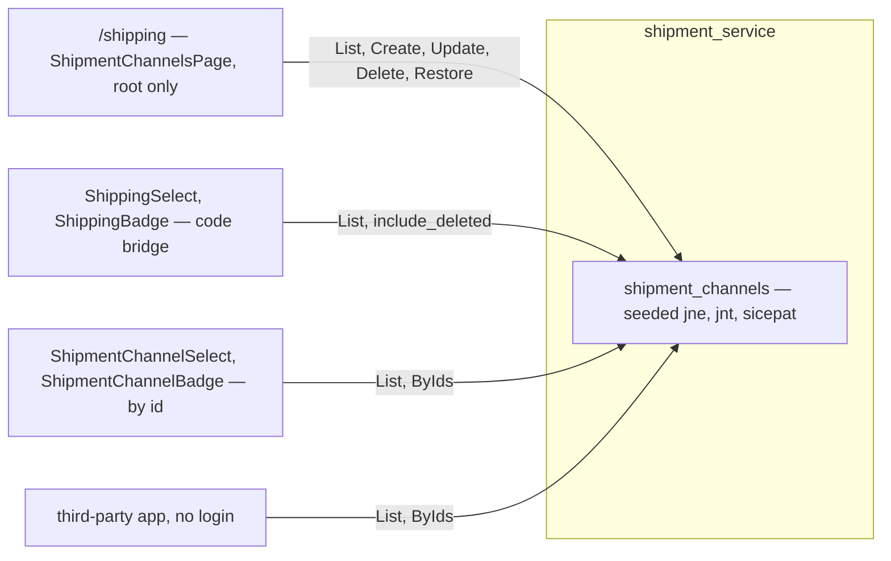

# Development state — shipment

**Channel catalogue DONE — fully implemented (2026-09-16).** Business design decided, prototype accepted
([the-prototype-is-accepted](../../business/shipment/context_decision.md#the-prototype-is-accepted)), backend built,
wired, tested, audited. Deferred by decision, not missing: tracking, the handover to the courier.

- Owner doc: [context.md](../../business/shipment/context.md)
- Decisions: [context_decision.md](../../business/shipment/context_decision.md) — 23
- Clarify: [context_clarify.md](../../business/shipment/context_clarify.md) — **1 open** (2026-10-05): Q1 the eight couriers live receipts ship by. `ReceiptCheck`'s Q2–Q4 were answered the same day

## `ReceiptCheck` — PROTOTYPE BUILT, waiting at `design_accept` (2026-10-05)

Every rule is decided (the seven decisions below). The prototype exists. **No backend:** the lifecycle blocks it until
the owner accepts the screen and the contract together.

| | |
| --- | --- |
| contract | [proto/warehouse/shipment/v1/receipt.proto](../../../proto/warehouse/shipment/v1/receipt.proto): `ReceiptService.ReceiptCheck`, generated, **not mounted** |
| frontend | [features/shipment/receiptCheck.ts](../../../frontend/src/features/shipment/receiptCheck.ts) `checkLabel(file)`: PDFs only, over 2 MB answered `unreadable` locally, a failed call is `null` (no check). `scanReceipt` in [checks.ts](../../../frontend/src/features/orders/form/checks.ts) calls it on the PICKED FILE; `useReceiptUpload` gained `onFile`; [ShippingReceiptCard](../../../frontend/src/features/orders/form/ShippingReceiptCard.tsx) warns for `multipleLabels` / `notShippingLabel` / `unreadable`, shows nothing for `unknownLabel` |
| storybook | `ReceiptService` stubbed in `.storybook/stubTransport.ts`: it answers by a `stub-result:<name>` marker in the fake PDF (`receiptLabelFile` in fixtures.ts). 5 new page stories in `Pages/Order/OrderCreate`; all 20 there pass |
| pending mark | `receiptScan` stays, its reason updated: outside Storybook nothing answers yet |
| decisions | [receipt-check-is-shipments](../../business/shipment/context_decision.md#receipt-check-is-shipments) · [receipt-check-takes-the-file-bytes](../../business/shipment/context_decision.md#receipt-check-takes-the-file-bytes) · [receipt-check-returns-what-the-library-reads](../../business/shipment/context_decision.md#receipt-check-returns-what-the-library-reads) · [receipt-check-needs-a-login](../../business/shipment/context_decision.md#receipt-check-needs-a-login) · [a-label-outcome-is-a-result-not-an-error](../../business/shipment/context_decision.md#a-label-outcome-is-a-result-not-an-error) · [receipt-check-caps-the-body-before-reading](../../business/shipment/context_decision.md#receipt-check-caps-the-body-before-reading) · [receipt-check-logs-only-the-result](../../business/shipment/context_decision.md#receipt-check-logs-only-the-result) |

**After `design_accept`, the backend:** `shipment_v1/receipt_check.go` and its `_test.go`, a `ReceiptService` handler
mounted in `register.go` with `connect.WithReadMaxBytes(3 << 20)`, wire, a perf audit (read-only, so no concurrency
audit), and then the pending mark comes off.

⚠ **The engine's import path is moving.** The owner's receipt_readers doc now says the package has its own repo as a
submodule (`github.com/pdcgo/san_receipt_readers`), so the handler imports it from there, not from
`backend/pkgs/san_receipt_readers`.

⚠ **Read and not used:** the label's recipient (name, phone, address). Whether it may fill the customer card is the
order form's question, and it has not been raised yet.

## What exists

```mermaid
flowchart LR
  subgraph "shipment_service"
    T["shipment_channels — seeded jne, jnt, sicepat"]
  end
  PAGE["/shipping — ShipmentChannelsPage, root only"] -->|"List, Create, Update, Delete, Restore"| T
  OLD["ShippingSelect, ShippingBadge — code bridge"] -->|"List, include_deleted"| T
  NEW["ShipmentChannelSelect, ShipmentChannelBadge — by id"] -->|"List, ByIds"| T
  APP["third-party app, no login"] -->|"List, ByIds"| T
```

| layer | where |
| --- | --- |
| contract | `proto/warehouse/shipment/v1/shipment.proto` — reads `allow_all`, writes `ROLE_ROOT` |
| migration | `backend/services/shipment_service/db_migrations/00001_create_shipment_channels.sql` (plain unique index on code, seed) |
| handlers | `backend/services/shipment_service/shipment_v1/` — one file per RPC; update/delete/restore share `write_row.go` (single `UPDATE … RETURNING`) |
| unit tests | 16, one `<rpc>_test.go` per RPC, real Postgres |
| wiring | `wire.go` + `service_api.go` (replaced shipping_service) |
| frontend | `pages/shipment-channels/` at `/shipping`, nav item root-only; `features/shipment/`; the two new components; `features/shipping/catalogue.ts` now reads shipment_service |
| stories | page, `ShipmentChannelSelect`, `ShipmentChannelBadge`, plus the re-pointed `ShippingSelect`/`ShippingBadge` — full suite 1441 pass |
| e2e | `frontend/e2e/shipment_channels.spec.ts` — 4 pass (public reads / 401 write, seed, create+edit, delete/refuse/restore) |
| perf audit | all 6 fast, no report. Probes build-tagged `perfaudit` beside the handlers |
| concurrency audit | all 4 writes safe, no report — `shipment_channel_race_test.go` (tag `raceaudit`), service lock-order table in `audits/services/shipment_service/concurrency/lock-order.md` |

## Removed

`shipping_service` (service, `warehouse.shipping.v1`, generated code), `pages/shipping-channels`, the
`catalog.shipping.*` i18n keys, the `ShippingService` Storybook stub and the `couriers` fixture.

## ⚠ Known leftovers — by decision

| | why |
| --- | --- |
| selling orders + restocks still store `shipping_code` | the move to `shipment_channel_id` is the ORDER redesign's ([the-old-catalogue-bridges-by-code](../../business/shipment/context_decision.md#the-old-catalogue-bridges-by-code)) |
| codes outside the seed (`anteraja`, `tiki`, …) on old rows render as the raw code | root creates the channel to name them |
| `shippings` + `shipping_service_version` remain in existing databases | no service migrates another's table |
| `docs/technical/architecture/context_clarify.md` still proposes a `shipping_service` | a proposal in an agent clarify, superseded by the shipment decisions — re-examine it with that doc |

## Next, when picked up

- Order redesign: `ShipmentChannelSelect` / `ShipmentChannelBadge` + `useShipmentChannelsByIds` are ready for `shipment_channel_id`; then retire the code bridge (`features/shipping/catalogue.ts`, `ShippingSelect`, `ShippingBadge`).
- Tracking and handover: undesigned ([tracking-is-deferred](../../business/shipment/context_decision.md#tracking-is-deferred), [the-handover-is-shipments-and-deferred](../../business/shipment/context_decision.md#the-handover-is-shipments-and-deferred)).
