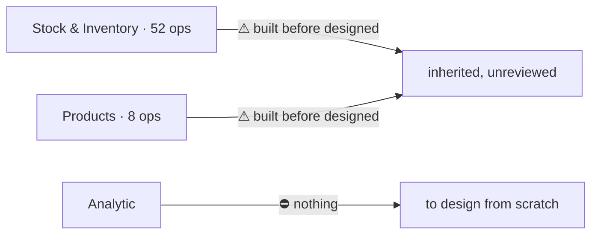

# Progress — Toni

For the **product manager**. One entry per finished slice, newest first
([a-report-fires-per-slice](../business/project/member_decision.md#a-report-fires-per-slice)).
Scope: [member.md](../business/project/member.md) — Stock & Inventory, Products, Analytic.

---

## 2026-08-31 · handover, day zero

**No work has been reported in this lane yet, and this entry does not claim any.** The scope was
assigned today, and everything already built in it was written on Heri's machine — all 389 commits
in the repository have one author. So this first entry records **what is being inherited**, not what
was done.

### What already exists in this lane

| Area | State | What a person can do with it today |
| --- | --- | --- |
| **Stock & Inventory** | ⚠ **built, never design-reviewed** — 52 operations, the largest single part of the system | Receive a restock, accept what actually arrived, and freeze what each unit cost including freight. Move, pick, transfer and adjust stock; run a stock opname; place goods on racks and find them again; handle returns. Suppliers and their channels live here too |
| **Products** | ⚠ built, never design-reviewed | Create and edit a product, browse and search the catalogue, restore a deleted one |
| **Analytic** | ⛔ **nothing exists** — neither design nor code | The business doc is seven lines long: *"Provide Analitical Data to user."* This is the greenfield half of the lane |

### ⚠ What the PM should know about this handover

**60 operations and roughly 9,800 lines are changing hands without their author.** The mitigation is
already in the repository and is the reason it exists: every settled question is written down as a
named decision beside the doc it belongs to, so the reasoning is readable without asking anybody.
The gap is that **stock has never been through a design review** — the screens exist, but nobody has
sat down and accepted them.

### The most expensive open question in this lane

**What a unit actually costs.** The frozen unit cost is calculated when goods are received, and it
decides margin, cross-team charges and what a breakage repays — for the life of that batch. It is
currently **#2 in [biggest_question.md](../biggest_question.md)**, and one of its two halves is a
live defect: an unpredictable tip paid at the door is being capitalised into the cost of the goods.
That decision now sits entirely inside this lane, which is the main practical gain of assigning
Products here.

### Next

1. **Read the two clarify files first** — [stock](../business/stock/context_clarify.md) (7 open
   questions) and [product](../business/product/context_clarify.md) (6). They are the current
   argument, not a history.
2. **Take the unit-cost question**, now that both halves of it are in one lane.
3. **Design Analytic from nothing** — it is the only area in the system with no design at all, and
   it reads the ledger, which is still unowned
   ([member_clarify.md Q1](../business/project/member_clarify.md#question)).
