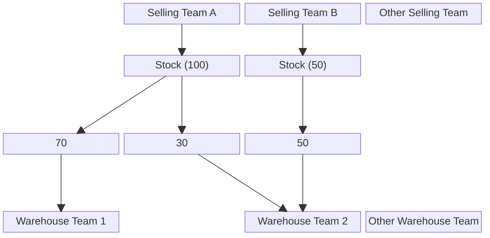
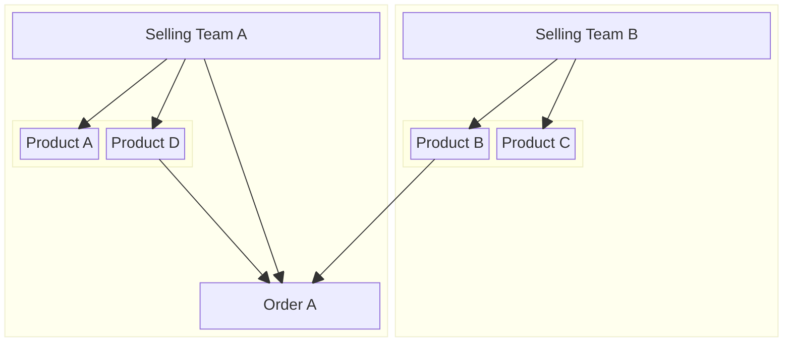

# Business Contexts.

## Business Core.
Our business is sell products to the customer in online platform.

## This is "Whats Should be covered The Project for Supporting The Business".
1. provide order management for online marketplace platform.
2. provide stock management.
3. provide transparency accounting.
4. provide flexible statistic about :
    - order
    - accounting
    - cost
    - etc.
5. supporting sharing stock between selling team.
6. provide balance management in team level. the balance is used in:
    - sharing stock
    - cost of stock broken or lost
    - cover shipping fee
    - cover warehouse order processing fee.
7. provide cost tracking like electricity, ads, payroll and other.

## Other Context Related.
For more explanation read this.
1. [Stock Context](./stock_context.md)
2. [Product Context](./product_context.md)
3. [Team Balance Management Context](./balance_context.md)
4. [Order Context](./order_context.md)
5. [User Context](./user_context.md)

## Business Entity.
In our business handle 4 main team.
1. Admin Team.
2. Warehouse Team.
3. Selling Team.
4. Root Team.

In our business, we can have multiple team on that.

## Root Team
### The responsbility
1. its developer team that have highest access for all resource.

## Admin Team
### The responsbility
1. Monitoring and manage all resource warehouse and selling team.

## Warehouse Team
### The responsbility
1. Handle stock
2. processing order that created by selling team until order is taken by shipment channel. until its shipped.
3. handle return goods, broken and losts.
4. Ownership of stock is by selling team. But, warehouse managing phisique of goods and placement of goods
5. every broken and lost in warehouse, warehouse have responsbility reimburse the cost (Unit Price) to the team that own the goods.
6. warehouse dont have responsbility every broken/lost goods at receiving restock or return goods from the returning orders.
7. doing stock opname.

## Selling Team
### The responsbility
1. Handle and manage Order from marketplace    
2. Manage Shop in marketplace
3. Manage the product.
4. Decide and mint restock transaction that can be accepted by warehouse later.
5. Manage Supplier of the Products that later have restocked to the warehouse.

## Stock Ownership
1. Ownership of stock is by selling team.

## Cross / Shared goods On Order Concept.

## Suplier as The Source Goods of the Product We Sell
1. we don't rely one supplier to support our selling. instead of that, we have many supplier with different source rely the selling team decision they own.
    - supplier can be vendor for a big quantity.
    - supplier can be came from other marketplace platform.
    - supplier can be just random url product on internet in small quantity goods needed. 
