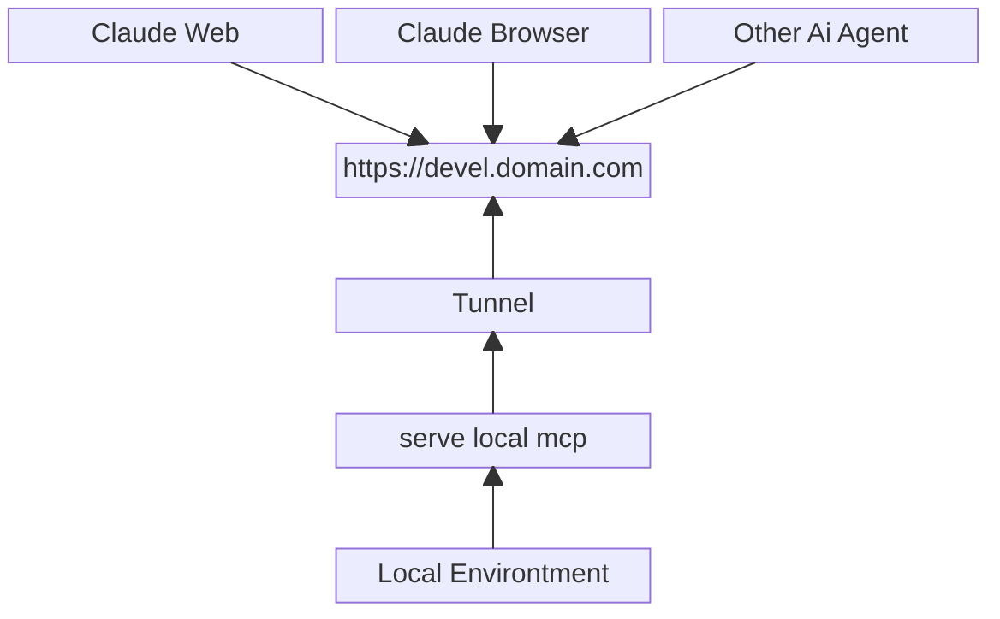

# This Is Development Requirements

## Unified Tools Development.
1. We must have unified development tools to:
    - running mcp
    - seed
    - migration
    - deploy

2. the tools writen with `golang` and lived in `tools/san`

## Development MCP Tools
We have mcp tools that can provide local development across other platform. 

Outside Env like `claude web`, `claude browser` and other ai agent outside connect uri mcp.
Uri mcp is tunnelling from mcp that serve from local environtment.

## Technical Use
1. its on [unified development tool](#unified-tools-development)
2. for running its use `san remote mcp`. 

## Technical Spec
1. when run `san remote mcp`, its show token that can use to authentication in outside env remote mcp