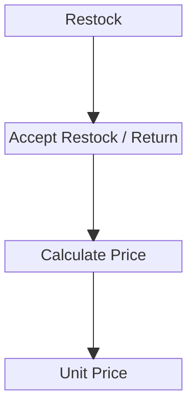

# Product Context


## Business Problems.
This is for preface so we can understand why and how we designing the system properly.
1. because we have many suplier that mention in [this](./business_level.md#suplier-as-the-source-goods-of-the-product-we-sell), thats affect to our pricing:
    - price is more unpredictable, flexible and dinamic.

## Unit Pricing System.
we have unique pricing system design. there is no one price in products. the price know if the product have been stocked/restocked.

So, in system we need batch pricing system that use FIFO.


### Unit Price Components.
1. On restock, Unit price depends on 3 things.
    - Product Price
    - Shipment Fee
    - Additional Warehouse Fee on Accept stock (optional)

    The calculation is:
    ```math
    UnitPrice = ProductPrice + ((ShipmentFee + AdditionalWarehouseFee) / AllProductQtyRestock)
    ```
2. on return, unit price come from COGS. So if its contain cross product the unit price became to how much the team have order buyed.

## Product in business View.
1. product is catalogue that have by selling team.
2. the stock of the products is hold by warehouse team.
3. our product have special attribute:
    - cross/shared fee markup.


### Cross/Shared Fee Markup.
1. its value is percent form.
2. its used to calculating when other selling team need our product at their order.
3. fee calculation is 
    ```math
    fee = UnitPrice * Fee Markup
    ```

### Cross/Shared Products Rule.
For Fair Sharing we have several feature on the products.
1. reserved stock, So when stock < several, its cannot be shared.
2. shared lock. when its turn on, its prevent product to be shared to other team.


## Pricing Behavior.
this is explanation how pricing behavior decided.
1. if the product used by own team orders, the COGS is just unit_price.
2. if the product used by another team orders, use [this](#crossshared-fee-markup) so:
    ```math
    COGS = UnitPrice + fee
    ```


## System Requirements.
for system requirements it live in [this](./systems/systems_product_context.md)


