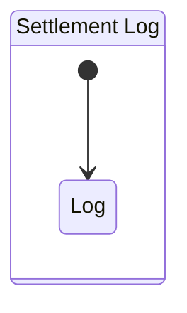

# Settlement Contexts.

## The Existing Problems.
1. our order live in other platform outside our system, we record that twice in our system.
2. in order, when complete, it can have fund. but sometimes, also can charge shipping cost, ads fee, platform fee, problem funding and other unperdictable +/- fund or cost/fee
3. and total order in begining, its often have diff payout at the end, and its also still happen other fee in next day

## Flow.
