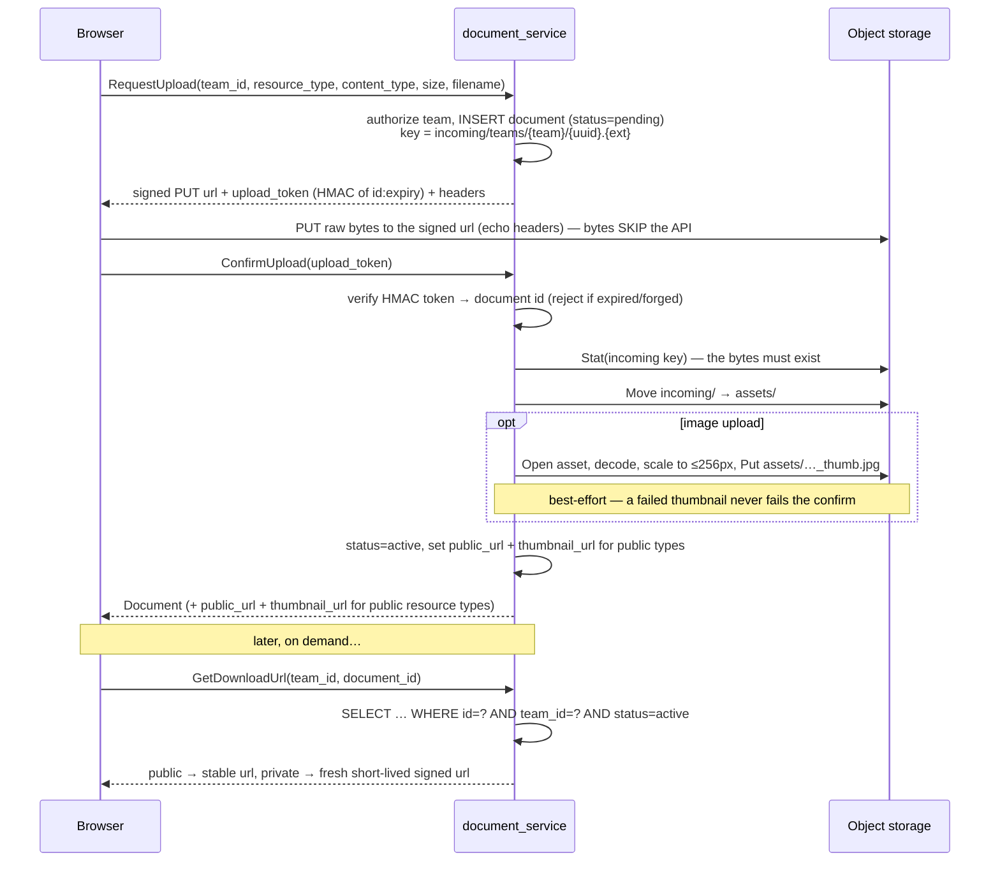
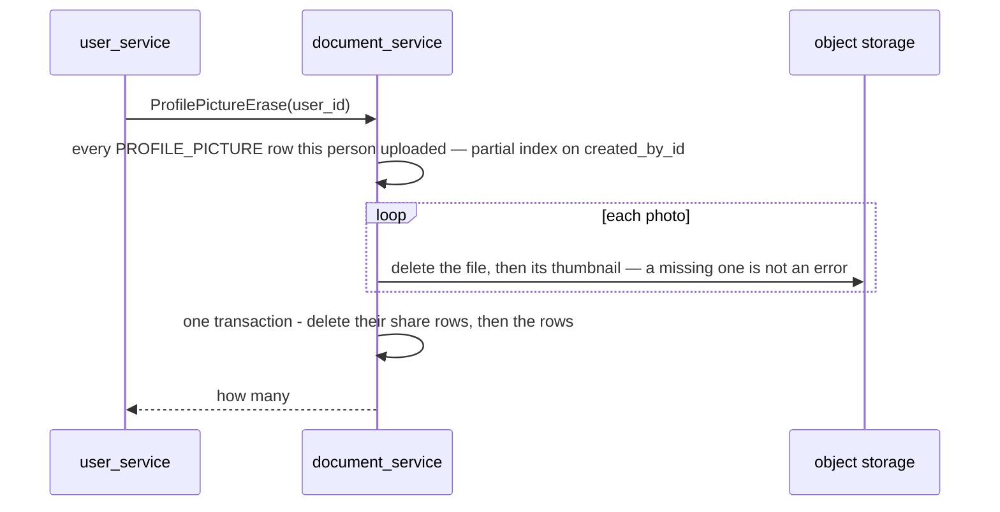

# document_service — complex RPC flows

The upload is a **two-phase** flow across three RPCs; it warrants a diagram even though it has no
cross-service dependency, because the bytes travel a path the API server never sees.

## Two-phase, presigned-PUT upload

**Why these choices:**
- **Two phases (`pending` → `active`).** A metadata row is written before the bytes exist; it is
  only promoted once `ConfirmUpload` verifies the object is actually in storage. So a half-finished
  upload never leaves a row claiming a file that isn't there. Unconfirmed `incoming/` objects are
  reaped by a storage lifecycle TTL.
- **The `upload_token` is a server-signed HMAC** of `documentID:expiry`. It is how `ConfirmUpload`
  recovers *which* document to promote without trusting a client-supplied id, and it can't be forged
  without the server secret. Verified in constant time.
- **`GetDownloadUrl` is team-scoped** — the `team_id = ?` clause means another team's document reads
  as `NotFound`, closing a cross-team read gap. Public resource types (e.g. profile pictures) get a
  stable URL; private ones get a fresh short-lived signed URL each call.
- **Image uploads get a thumbnail** generated on confirm — decoded, scaled so its longest side is
  ≤256px, re-encoded as JPEG, and stored beside the asset. `thumbnail_url` (public types) lets the
  UI load a light preview fast. Generation is best-effort: a non-decodable image just yields no
  thumbnail, never a failed upload.
- **Resource types split public from private.** `PROFILE_PICTURE` and `PRODUCT_IMAGE` are public —
  shown inline from a stable URL. `GENERAL`, `ORDER_RECEIPT`, `PAYMENT_PROOF` and `SETTLEMENT_STATEMENT`
  are private — a statement is the .xlsx the settlement importer uploads **as a client of this contract**,
  under the uploader's own token, before it reads it. The rest of this point is the receipt's case: an order's courier slip
  (image or PDF) names a buyer and where their parcel went, so it is opened through a signed URL by
  somebody who belongs to the team. Adding a type means four edits in step — the proto enum,
  `resourceTypeToText`/`FromText`, `isPublic`, and the `documents_resource_type_valid` CHECK.
- **Storage is behind a `Signer`/`ObjectStore` seam** (`docstore`). Dev/tests use a local
  filesystem backend with an unauthenticated `/local-storage` file endpoint (path-traversal
  guarded); a cloud backend implements the same two interfaces and changes nothing else.

Code: `backend/services/document_service/document_v1/{request_upload,confirm_upload,get_download_url}.go`,
`backend/services/document_service/docstore/`.

## ProfilePictureErase — the photos of an erased person

Called by user_service's `UserErase` ([erase-deletes-the-photo-file](../../business/user/context_decision.md#erase-deletes-the-photo-file)),
with the caller's own bearer, so the policy (Root and the Administrator) is checked against the person erasing.

- **Files first, rows last.** A file that fails to delete stops the call with its row still there, so the next erase
  finds it again. The other order would leave a file no row points to — the one state nothing can clean up.
- **Idempotent.** No rows is `erased = 0`, not an error; a file already gone is skipped. Two erases of one person at
  once both succeed — the local store retries a delete Windows refuses while another one is finishing
  ([lock order](../../../audits/services/document_service/concurrency/lock-order.md)).
- **Every photo, not the current one:** a photo the person replaced is as personal as the one they kept.

Code: `backend/services/document_service/document_v1/profile_picture_erase.go`.
