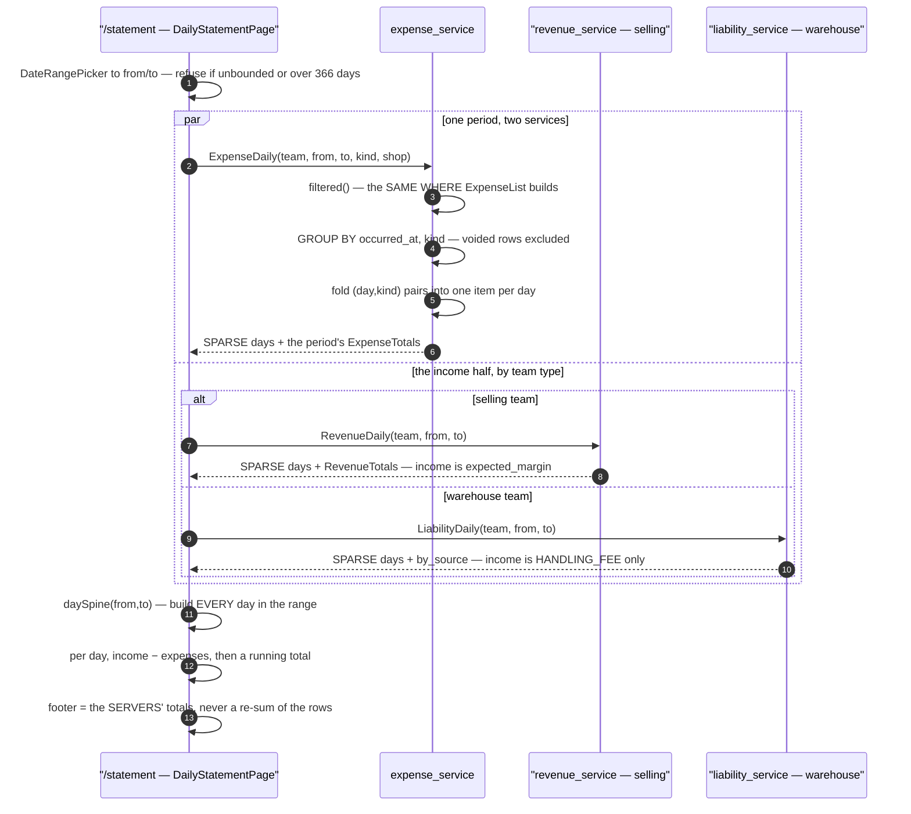

# expense_service — RPC & the daily statement

## What an expense is here

Money the business spent that **no order caused** (#161): ads budget, payroll, rent, subscriptions.

The defining fact is that **a person typed it**. A revenue row is written by the system from an order
and frozen; an expense row is entered by hand about a period. Everything else follows: the form has to
be quick, the mistake has to be fixable (`ExpenseUpdate`), the row records **who** entered it, and a
retraction is a **void**, never a delete.

Deliberately not here: per-order costs (COGS and shipping are frozen onto the order, #74), and any
ledger — no balances, no double entry, the same call revenue made.

### One kind nobody types: `STOCK_LOSS`

`EXPENSE_KIND_STOCK_LOSS` is written by **inventory_service**, not by a person. When a warehouse adjusts
a batch as damaged or lost, `StockAdjust` values the units at the batch's frozen `unit_cost` and posts
the money as an expense on the **warehouse's own team** (#211,
[expense_poster.go](../../../backend/cmd/app_development/expense_poster.go)).

It had been filed as `OPERATIONAL` until 2026-08-14, and that was the bug: shrinkage sat in the same
bucket as rent and electricity, so *"how much did we break this month"* had no answer — which is most of
what a warehouse's own P&L is made of. Rent is a decision somebody made; a dropped pallet is not, and
only one of the two is worth a manager's morning.

Three consequences worth knowing:

- **The form does not offer it.** `COST_KINDS` (the picker) excludes it and `COST_FILTER_KINDS` includes
  it — reading a kind and being able to type one are different permissions. A hand-typed loss beside the
  automatic ones would make the total partly a guess.
- **History stays mixed.** Rows written before the kind existed are still `OPERATIONAL`. They are only
  identifiable by their free-text note, so a backfill would be a guess that could move a real rent row
  (owner). The split is honest from that date forward, not backwards.
- ⚠ **It does not yet separate BROKEN from LOST.** `stock_batches` carries one `damaged_qty` and
  `MovementKind` has a single `ADJUST`, so the DAMAGED/LOST distinction exists in the `StockAdjust`
  request and is **discarded on write** — that is what #227 is for. One combined figure now, split when
  #227 lands, is additive rather than a rework (owner).

> ⚠ **A batch with an unknown `unit_cost` posts NOTHING.** `unit_cost` is nullable and nil means unknown,
> never 0 (#74), so `StockAdjust` skips the expense entirely for those units. Stock genuinely written off
> is therefore **invisible in the money**, and — unlike the revenue side, which counts its unknown-cost
> orders and says so — nothing counts these. A warehouse's loss figure is a floor, not a total. Fixing it
> needs somewhere to record "units written off at unknown cost", which is a schema decision and not this
> RPC's to make.

Most of the service is single-table CRUD and needs no diagram. The one flow that does is the statement,
because it **spans two services**.

---

## The daily statement — `ExpenseDaily`, and whichever income half applies

`ExpenseList` answers *"what did this period cost"*. `ExpenseDaily` answers *"which **day** did it"* —
and it is the **shared half** of one screen, `/statement`. The other half depends on who is reading:

| | income comes from | because |
| --- | --- | --- |
| **selling** team | `RevenueDaily` — the expected margin on its orders | it sells |
| **warehouse** team | `LiabilityDaily` — the handling fees it charged | it has no orders at all |

The expenses half needs no branch, and that is the neat part: a warehouse's written-off stock is already
an expense on its own team, so the same RPC serves both.

**The statement is assembled on the CLIENT.** No service owns it, because none holds the others' numbers
(HARD RULE 3): no shared model package, no table another can read. A backend "statement" RPC would have
made one service own a figure derived from data it does not have.

### A warehouse manager must be able to read this

`ExpenseDailyRequest` carries `ROLE_WAREHOUSE_OWNER` and `ROLE_WAREHOUSE_ADMIN`, which `ExpenseListRequest`
does **not**. That difference is deliberate and load-bearing: without them a warehouse owner gets
`PermissionDenied` on exactly half of their own statement, and the screen would report their fees as pure
profit. `ExpenseList` keeps the narrower set only because no warehouse screen calls it yet — the policies
should differ because of what is built, never because one was forgotten.

### One query, grouped twice

The day item carries a **per-kind split**, so a day that jumped can be read without opening the expense
list. That costs nothing extra: it is the same scan one `GROUP BY` wider — `(occurred_at, kind)` — and
the pairs are folded back into days **in Go**, as a loop over already-sorted rows, rather than as a
second round trip.

A kind with nothing that day is **absent** rather than `0`, matching `ExpenseTotals`. Absent and zero
read identically on a card, and building the empty ones would mean the handler knowing the enum's
members — which would then need editing every time a kind is added.

### The filter is `filtered()`, not a second copy

`ExpenseDaily` builds the `ExpenseListRequest` its period and filters are equivalent to and hands it to
the same `filtered()` helper the list uses. That is the point rather than a tidy-up: a series filtered
to Ads beside a footer that still counted payroll would put a table and a total describing different
things on one screen. One WHERE, three readers.

### The period IS the pagination

`ExpenseDaily` takes no page cursor, and that does not breach HARD RULE 9. The rule guards a `repeated`
whose length grows **with the data**. This one grows with `to − from`, which the caller states:

| | |
| --- | --- |
| Both bounds **required** | unlike `ExpenseList`, where they are optional and a page carries the risk |
| Span **capped at 366 days** | `InvalidArgument` beyond it — refused, never clamped |
| Result | ten years of expenses and one year of expenses return the same 366 rows |

The cap must match the other two services' exactly. The series are read side by side, and a cap that
differed would let the statement load half a period and still look complete. It lives in **four** places:
`maxPeriodDays` in expense, revenue and liability, and `MAX_PERIOD_DAYS` in
[frontend/src/lib/period.ts](../../../frontend/src/lib/period.ts).

### Sparse series, one calendar

Both services **omit** days that hold nothing, and the client builds the date spine — it has to build
one anyway to line the two series up, and a server that also emitted empty days would be a second
calendar free to disagree with it.

A quiet day is still **rendered**, dimmed. A missing row cannot tell a reader "nothing was spent" apart
from "that day did not load".

### No timezone question on this side

`occurred_at` is a **DATE**, chosen by a person — there is no instant to convert and therefore no zone
to get wrong. The revenue half buckets a `TIMESTAMPTZ` and has to name one; see
[revenue_service/rpc.md](../revenue_service/rpc.md) for the UTC-vs-UTC+7 caveat that carries.

### Voided rows

Excluded from every daily figure, exactly as they are from `ExpenseTotals`. The interesting case is a
day whose **only** entry was voided: that day vanishes from the series rather than reading as a zero. A
zero would assert somebody looked at the day and found nothing, which is a different claim from the day
having no live entries at all.

The expense **list** still shows a voided row, struck through — an entry made and then withdrawn is
exactly what somebody looking at a changed total wants to see. Only the money views drop it.
