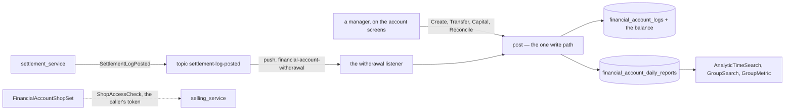
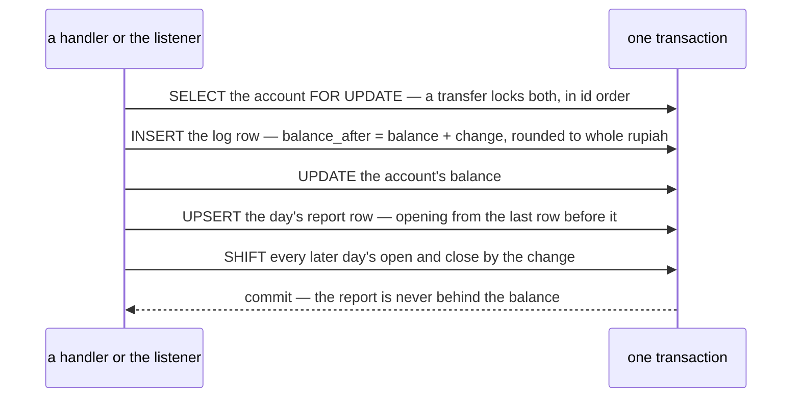
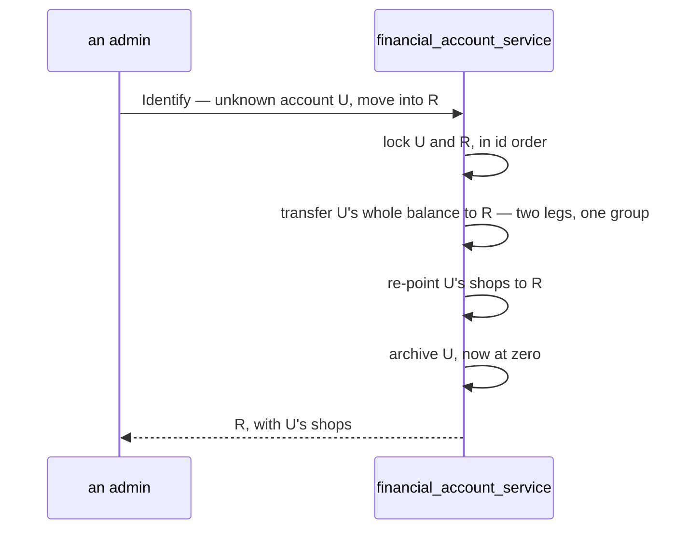
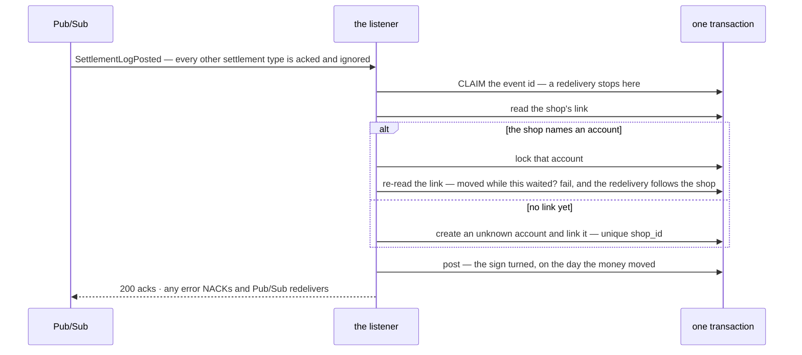

# financial_account_service — RPC flows

The money a team actually **holds** — its bank accounts, ShopeePay wallet and cash box, each with a balance
that moves only with a log row ([context_decision.md](../../business/financial_account/context_decision.md)).

> ⚠ **Not [settlement_service](../settlement_service/rpc.md)**, which is what the marketplace pays us, nor
> **[liability_service](../liability_service/rpc.md)**, which is what teams owe each other. A withdrawal is
> where settlement's money arrives HERE: settlement records it leaving the marketplace wallet, this service
> records it landing in the shop's account.

| service | RPC | what it is |
| --- | --- | --- |
| `FinancialAccountService` | `FinancialAccountList` · `FinancialAccountByIds` | the team's accounts — **no balance** |
| | `FinancialAccountOverview` | the balances — per account, and a total per type |
| | `FinancialAccountLogList` | one account's statement, newest first |
| | `FinancialAccountCreate` | an account, and its `opening_balance` row in the same transaction |
| | `FinancialAccountUpdate` · `Archive` · `Restore` | name, holder, description · out of the pickers only at zero · back |
| | `FinancialAccountIdentify` | an `unknown` account filled in, or moved into a registered one |
| | `FinancialAccountTransfer` · `Capital` · `Reconcile` | the hand rows — two legs · the owner's money · the bank's figure in, the difference posted |
| | `FinancialAccountShopSet` · `OperationalSet` | which account a shop withdraws into · which accounts pay for operations |
| `FinancialAccountAnalyticService` | `AnalyticTimeSearch` · `AnalyticGroupSearch` · `AnalyticGroupMetric` | settlement's report shape, read from one row per account per day |
| *(push route)* | `/event/financial-account-withdrawal/push` | settlement's `withdrawal` rows into the shop's account |

Every member of the team **sees**; admin and up **moves** the money
([seeing-is-team-wide-moving-is-admin-and-up](../../business/financial_account/context_decision.md#seeing-is-team-wide-moving-is-admin-and-up)) —
except `Transfer` and `Capital`, which a warehouse leaves to its Owner
([the-warehouse-admin-equals-the-owner-except-money](../../business/user/context_decision.md#the-warehouse-admin-equals-the-owner-except-money)).
Other services never call a write — they publish, and this service listens
([a-row-comes-by-hand-or-from-the-broker](../../business/financial_account/context_decision.md#a-row-comes-by-hand-or-from-the-broker)).

---

## post — the one write path

Every row, by hand or from the listener, goes through `post` (`ledger.go`) on an account its caller has
**locked `FOR UPDATE`**. That lock is the whole concurrency story: `balance_after` is read under it, and the
day's report row and the later-day shift are per account, so the same lock serialises them.

It never refuses — below zero included
([below-zero-is-warned-never-refused](../../business/financial_account/context_decision.md#below-zero-is-warned-never-refused)).
Whether a row may be posted at all (archived, unknown) is the caller's check, made under the lock.

---

## FinancialAccountIdentify — move in

Fill-in instead updates U's type, provider, number, holder and name in place — its rows stay. A number
already recorded is refused, and the message points at move-in.

---

## The withdrawal listener

| case | what happens |
| --- | --- |
| the same event twice, even at once | posted once — the claim is the write |
| a new shop's first withdrawals at once | one creates the unknown account; the others hit the unique `shop_id`, roll back with their claim, and are redelivered into it |
| a move-in commits while a withdrawal waits on the old account | the re-check under the lock sees the new link and fails; the redelivery posts into the real account |
| an archived account the shop still names | posts — refusing would dead-letter money that moved |

The description names the shop by id (`Withdrawal from shop #21`) — a listener hears an event, not a person,
so it has no caller to ask the shop's service with. The screens put the shop's name in.

---

## FinancialAccountShopSet

`shop_id` arrives in the request, so the shop's service is asked first — `ShopAccessCheck` under the caller's
token, BEFORE the transaction, so no lock is held across the call. Another team's shop or a deleted one is
NotFound, and nothing is linked. Then the account is locked and the link upserted on `shop_id` — pointing a
shop here moves it off the account it named.
