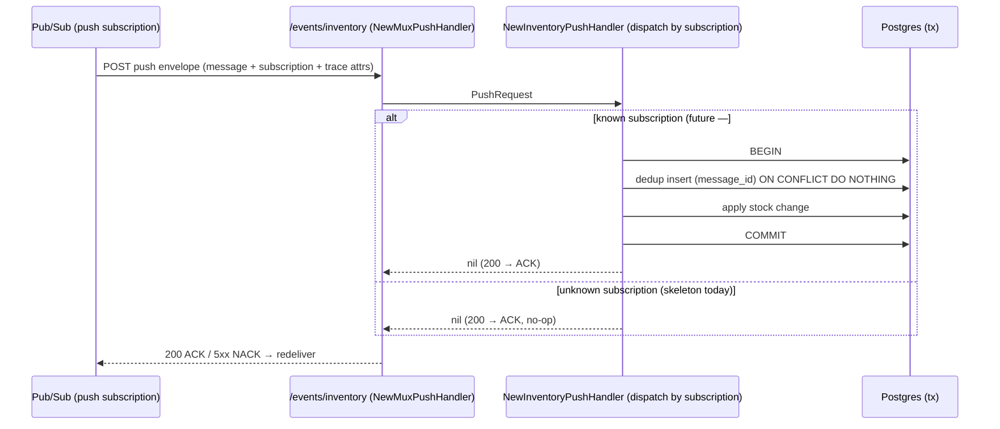

# inventory_service — RPC & event flows

## Pub/Sub push receiver (#102)

`inventory_service` exposes a **Pub/Sub PUSH** endpoint so it can react to events published by other
services (the counterpart to publishing via `event_source.NewPubsubEventSender`). It is a plain HTTP
endpoint — **not** a Connect RPC — mounted at **`/events/inventory`** in
[register.go](../../../backend/services/inventory_service/register.go) and wrapped by
`event_source.NewMuxPushHandler` (which continues the publisher's trace and encodes the ACK/NACK
contract).

One handler dispatches by **subscription name** (`push.subscription`), so a single endpoint can serve
several subscriptions.

**Status: SKELETON.** No subscription consumes events yet — inventory reacts to order/stock events,
and that integration (order → stock) lands with **#69**, which also introduces the stock-event
contract. Until then the handler ACKs every message as a no-op (returning non-2xx would make Pub/Sub
redeliver forever).

When a real subscription is wired, the handler will, in **one transaction**: insert an **exactly-once**
dedup row keyed by `message.messageId` (`ON CONFLICT DO NOTHING` — a redelivery finds the row and
skips), then decode the event with `event_source.DecodeEvent` and apply the stock change. If the work
fails, the whole transaction (dedup row included) rolls back so a redelivery reprocesses it.

> **Dead-letter policy required.** `event_source/push.go` returns a non-2xx for a malformed or failed
> message, and Pub/Sub redelivers any non-2xx forever. Every push subscription pointed at this
> endpoint must therefore have a dead-letter policy so a poison message is eventually parked, not
> looped. (Push-endpoint authentication — OIDC/token — is a deployment concern, not handled in code.)
