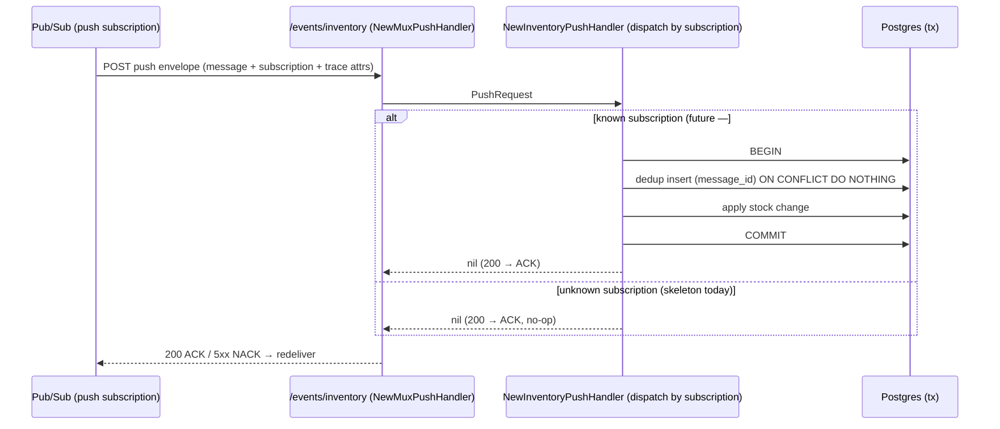
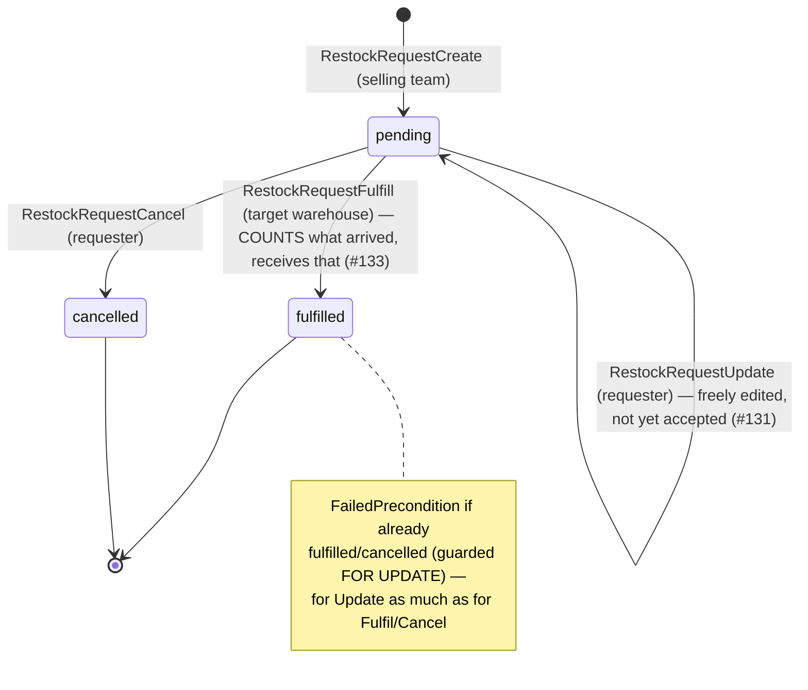
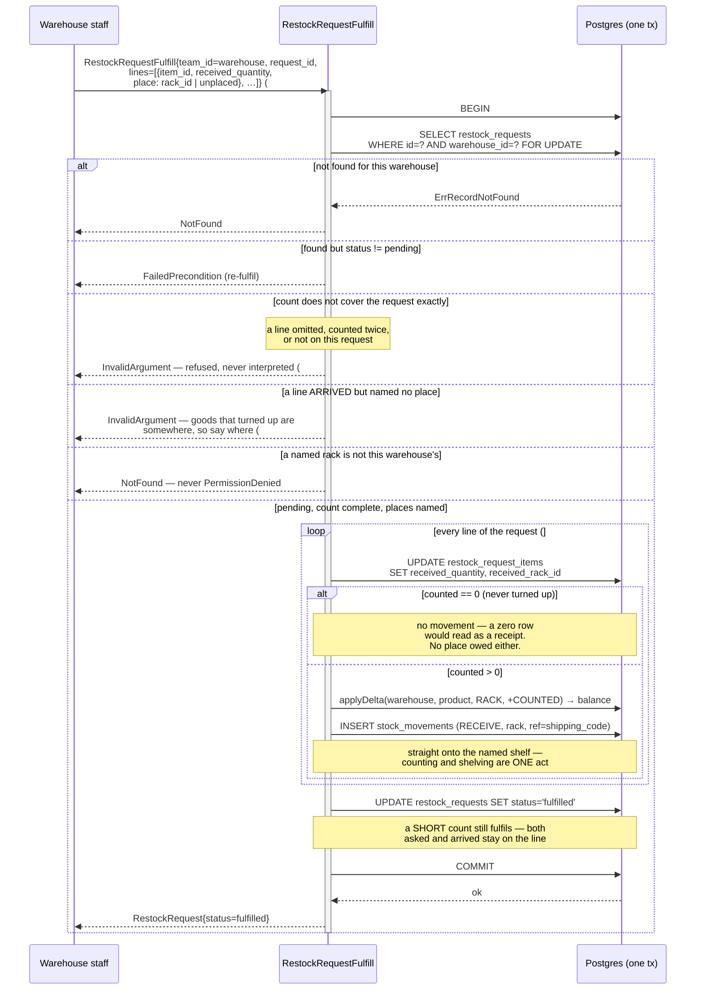
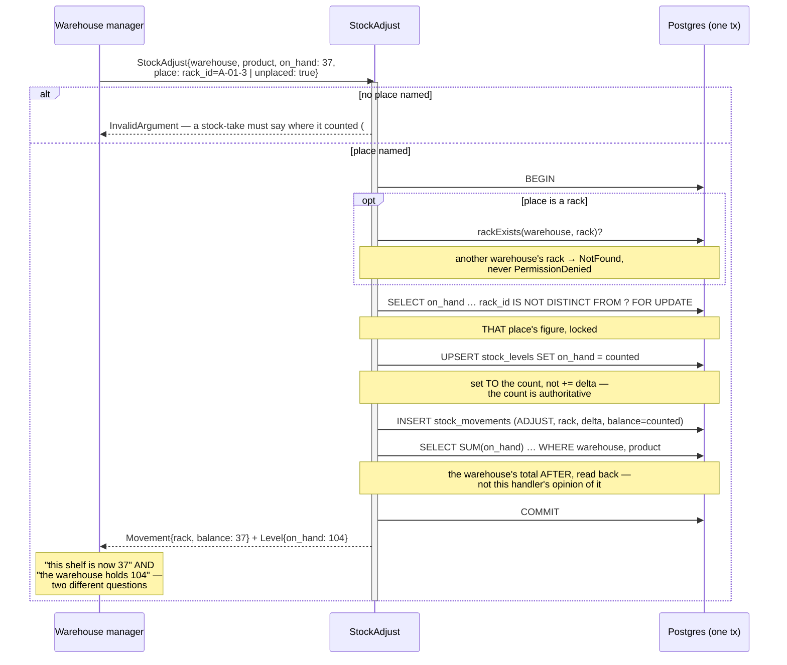
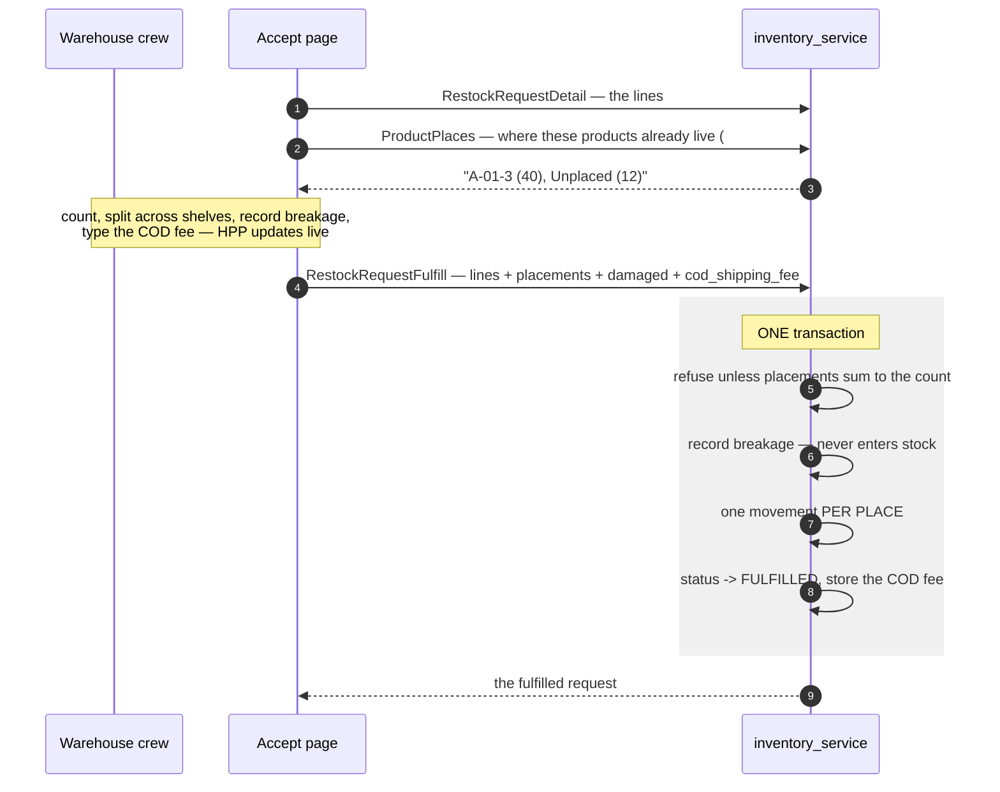

# inventory_service — RPC & event flows

## Pub/Sub push receiver (#102)

`inventory_service` exposes a **Pub/Sub PUSH** endpoint so it can react to events published by other
services (the counterpart to publishing via `event_source.NewPubsubEventSender`). It is a plain HTTP
endpoint — **not** a Connect RPC — mounted at **`/events/inventory`** in
[register.go](../../../backend/services/inventory_service/register.go) and wrapped by
`event_source.NewMuxPushHandler` (which continues the publisher's trace and encodes the ACK/NACK
contract).

One handler dispatches by **subscription name** (`push.subscription`), so a single endpoint can serve
several subscriptions.

**Status: SKELETON.** No subscription consumes events yet — inventory reacts to order/stock events,
and that integration (order → stock) lands with **#69**, which also introduces the stock-event
contract. Until then the handler ACKs every message as a no-op (returning non-2xx would make Pub/Sub
redeliver forever).

When a real subscription is wired, the handler will, in **one transaction**: insert an **exactly-once**
dedup row keyed by `message.messageId` (`ON CONFLICT DO NOTHING` — a redelivery finds the row and
skips), then decode the event with `event_source.DecodeEvent` and apply the stock change. If the work
fails, the whole transaction (dedup row included) rolls back so a redelivery reprocesses it.

> **Dead-letter policy required.** `event_source/push.go` returns a non-2xx for a malformed or failed
> message, and Pub/Sub redelivers any non-2xx forever. Every push subscription pointed at this
> endpoint must therefore have a dead-letter policy so a poison message is eventually parked, not
> looped. (Push-endpoint authentication — OIDC/token — is a deployment concern, not handled in code.)

---

## Restock requests (#105)

A **two-sided** flow across two teams and three tables. A SELLING team asks a WAREHOUSE to restock a
product; the warehouse fulfils it, and *fulfilment is what receives the stock*. The request row and
the stock ledger can never diverge because the fulfil does both in **one transaction**.

- **`RestockRequestCreate`** — the SELLING team (`requesting_team_id`, `use_scope`) raises a `pending`
  request naming the target `warehouse_id`, a `shipping_code`, and **one or more priced lines**
  (product + `sku`/`name` snapshot + quantity + per-unit price, #124). Optionally an `order_ref` (free
  text — the order lives in someone else's system, #127), a `receipt` (resi), a `supplier_id` (must be
  the requesting team's own, else **NotFound**), plus the restock's own money and context: a
  `shipping_cost` (the freight, on top of the per-line prices), a `payment_type`, and a `note`.
  No stock is touched.
- **`RestockRequestList`** — returns rows where `requesting_team_id = team_id` **OR**
  `warehouse_id = team_id`, so the one RPC serves both the requester's "my requests" view and the
  warehouse's "incoming" view. Paginated, newest first. Lines are **preloaded** in one extra query
  keyed by request id, so a page costs 2 queries rather than N+1.
- **`RestockRequestDetail`** — one request in full, with its lines, for the detail page (#125). The
  same two-sided scope as List, and the scope **is** the `WHERE` clause: a request that is neither
  yours nor targeting you reads as **NotFound**, never PermissionDenied — a permission error would
  confirm the id exists.
- **`RestockRequestFulfill`** — the TARGET WAREHOUSE (`warehouse_id`, `use_scope`) receives the stock
  and flips the status, atomically. The request is loaded `FOR UPDATE` scoped to this warehouse
  (another warehouse's request reads as **NotFound**) and must be `pending` (a re-fulfil is
  **FailedPrecondition**). **Every line is received inside the one transaction** (#124) — a request
  half-received would be worse than one not received at all, and the status flip has to mean all of
  it landed. A request with no lines is refused rather than "fulfilled" having moved nothing.
  - **Accepting IS counting** (#133) **AND shelving** (#137). The call carries `lines` — one
    `RestockRequestReceivedLine` per item, each saying how many turned up **and which shelf they went
    on** — and **stock receives `received_quantity`, never the requested `quantity`**, onto the rack
    named. A request is a promise and a delivery is a fact; receiving the promise on the warehouse's
    behalf would be inventing stock it does not have.
  - **A line that arrived must say WHERE it went** (#137). Goods that turned up are somewhere, and the
    system is told rather than guessing: a placeless arrived line is **InvalidArgument**. A line
    counted `0` owes no place — nothing is there to put anywhere — and one left pre-filled beside a
    zeroed count is an ordinary screen state, not a contradiction worth refusing. `unplaced` stays a
    legal answer for a warehouse that has not shelved yet; #136 is how that pile gets shelved later.
    The rack must belong to the **accepting** warehouse (another's reads as **NotFound**).
  - **The count must cover the request exactly**: every line named once, nothing omitted, nothing
    extra. An incomplete count is **InvalidArgument** — refused, not interpreted. Reading a missing
    line as "all of it came" or "none did" is a guess, and a guess about stock is drift. There is
    deliberately **no "accept as asked" shortcut**, because that shortcut is how a warehouse ends up
    holding stock nobody ever counted.
  - **A short count still fulfils.** The goods arrived and the request has done its job. Nothing is
    hidden by that: `quantity` (asked) and `received_quantity` (arrived) both stay on the line, so the
    shortfall remains on the record for whoever chases the supplier.
  - **A line counted `0` moves no stock at all** — no zero-quantity movement is appended. A ledger row
    saying nothing happened is worse than no row, because it reads as a receipt.
- **`RestockRequestUpdate`** — the REQUESTER edits its own request **while the warehouse has not
  accepted it** (#131). Until then nothing has physically happened, so there is nothing to protect and
  the request is freely editable — the warehouse it targets included. Once it is `fulfilled` the goods
  have moved, and once `cancelled` it is closed, so both are **FailedPrecondition**; another team's
  request is **NotFound**, as for Cancel.
  - It is a **full replace, not a patch** — the edit screen is the create form re-opened, so it
    submits every field back and an empty one means *cleared*. The handler writes with a **column
    map, not a struct**: GORM skips a struct's zero values, which would silently keep the old note or
    supplier while the form showed them gone.
  - **Lines are rewritten, not diffed** (delete + re-insert in the transaction). While a request is
    pending nothing references a line — stock only moves at fulfil — so their ids are not worth
    preserving, and a rewrite cannot drift the way a partial diff can.
  - Guarded `FOR UPDATE` **inside the transaction**, like Fulfil and Cancel: the status check and the
    write must be atomic, or an edit racing the warehouse's acceptance could land just after the stock
    was received and change the quantities that were accepted. Both take the same row lock, so the
    loser sees the other's committed status and bails.
  - **The supplier is only re-validated when it CHANGES.** A full replace re-sends the supplier the
    form prefilled, so an unchanged id is the request *preserving* a reference it already holds, not
    making a new one. Since `SupplierDelete` is a **soft** delete and `supplierExists()` requires
    `deleted = false`, re-checking an untouched id would make deleting a supplier permanently brick
    every pending request that names it — rejecting the edit over a field the person never touched.
    *Adopting* a deleted supplier is still **NotFound**; *keeping* one that predates the deletion is
    not.
- **`RestockRequestCancel`** — the REQUESTER (`requesting_team_id`, `use_scope`) cancels its own
  still-`pending` request (another team's reads as **NotFound**; a non-pending one is
  **FailedPrecondition**). No stock is touched.

### Lifecycle

`pending` is the only writable state: it is where the requester still owns the request, and it is why
edit and cancel both live there and nowhere else.

### Fulfil transaction (the one that must not diverge)

The warehouse arrives at this with a **count**, not a confirmation: it has opened the box, and `lines`
says how many of each line actually turned up **and which shelf each went on**. Everything below moves
that number, onto that shelf — never the ask, never a guessed place.

`applyDelta` + `appendMovement` are the same stock primitives `StockReceive` uses (see
[service.go](../../../backend/services/inventory_service/inventory_v1/service.go)), so a fulfilment is
indistinguishable in the ledger from a manual receive except for its `reason` (`"restock request"`)
and `ref` (the request's `shipping_code`).

---

## Stock lives in a PLACE (#135) — and what that changes about reads

Since #135 the grain is **(warehouse, rack, product)**. One idea explains most of the surprises here:

> **A movement is a statement about ONE PLACE; a level is a statement about ONE WAREHOUSE.**

- `applyDelta`/`appendMovement` take a place. A movement's `delta` and `balance` are **that place's** —
  "this shelf went from 40 to 49" — never the warehouse's total for the product.
- `StockList` **sums across a product's places** and returns one line per product: "how much of X do we
  have here?" has never meant "on which shelf". Its page total counts **products**, not rows, or a
  warehouse spreading one product over more shelves would silently shrink its own page.
- **`rack_id IS NULL` = unplaced** — a real place ("somewhere in this warehouse, not yet shelved"),
  not a missing value. Every query matches it with **`IS NOT DISTINCT FROM`, never `=`**: `rack_id =
  NULL` is never true in SQL, so a plain `=` reports a phantom shortage for goods sitting right there.

### A stock-take counts a SHELF (#139)

`StockAdjust` corrects **one place** to a counted figure, and the request must **say which** — a rack,
or explicitly the unplaced pile. It is a **required `oneof`**, and the handler re-checks it rather than
reading the zero value, because `GetRackId()` returns 0 both for *"unplaced"* and for *"said nothing"*.
Silently treating the second as the first is the bug the field exists to prevent: a stock-take that
corrects a pile nobody counted. **Refuse, do not interpret** — the same rule as the per-line count in
`RestockRequestFulfill`.

The rejected alternative was a warehouse-level figure. It needed a rule for spreading a correction
across a product's shelves (proportionally? onto unplaced? refuse?) and **every such rule invents a
fact nobody observed**. A stock-take that corrects the wrong shelf is worse than no stock-take, because
it is believed.

Correcting one shelf leaves the product's other shelves **exactly as they were** — that is the point,
and it is what the warehouse-level alternative could not promise.

### Reading a rack, and why it needs another service (#138)

`RackStock` answers the question a person standing at a shelf actually has: **what is on THIS rack, and
how much of each**. It is the mirror of `StockList` — that one sums a product *across* its racks
("how much of X does this warehouse hold"), this one reads a single rack.

Two things it refuses to conflate:

- **Another warehouse's rack is NotFound, never an empty shelf.** If "not yours" looked like "nothing
  on it", a probe could map another warehouse's rack ids by which came back empty.
- **A line counted to zero is not on the rack.** A level can fall to 0 without being deleted (a
  stock-take zeroing a shelf), and listing it would show a product that is not there.

**It returns product ids only — never names.** That is not laziness, it is the service boundary: a
warehouse holds **other teams' goods** (a selling team's restock puts its product on this shelf), so
the ids belong to catalogues `inventory_service` does not own, and inventing a name for them would be
guessing. The caller resolves them through `product_service`'s **`ProductByIds`** — added for exactly
this, and the reason the §4 question ("whose product is in whose warehouse") had to be settled before
this screen could exist. See `plans/inventory_service/brainstorming.md` §4, including the two things it
is honest about: it is **new exposure for warehouse roles**, and *"only what it holds"* is **not
enforced** and cannot be by `product_service`, which does not know what any warehouse holds.

### Moving stock inside a warehouse (#136)

`StockMove` changes **where** stock sits, never **how much** there is. That invariant is the definition
of a move, and it is what makes it a different fact from a receive: the warehouse's total for the
product is identical before and after.

**One verb for both jobs**, because they are one act with different arguments:

| | |
| --- | --- |
| `from: unplaced → to: rack` | **shelving** what arrived — the pile #135 left behind, which is everything predating #137 |
| `from: rack → to: rack` | **re-organising** a shelf |

- **Both ends are required, and must differ.** Moving stock onto the place it already sits is a
  mistake, not a no-op worth recording — honouring it would write a ledger pair saying nothing
  happened, twice. `InvalidArgument`.
- **The source is decremented FIRST**, deliberately. `applyDelta`'s guard refuses to take a place
  below zero, so taking first means an over-move is rejected *before* anything is credited anywhere.
  Crediting first and then discovering the source was short would still roll back — but it would have
  written a positive movement for goods that were never there.
- **Both legs commit together.** A move that took stock off a shelf without putting it anywhere would
  destroy goods that are physically in the building.
- **One `MOVEMENT_KIND_MOVE`, not an OUT/IN pair** like a transfer. A transfer needs two kinds because
  its legs are in two *warehouses* and each side only ever sees its own; both legs of a move are in the
  same warehouse, so a reader sees the pair together and the rack plus the sign already tell the story.
- Staff may do it, unlike `StockTransfer` (a manager action): nothing leaves the building, and the
  person carrying the box is the one who knows where it went.

**A rack that still holds stock cannot be deleted** (#138) — `FailedPrecondition`, empty the shelf
first, and **`StockMove` is how you empty it**. The check lives in the handler because the FK cannot do it: `stock_levels.rack_id` is
`ON DELETE RESTRICT`, but `RackDelete` is a **soft** delete, so the row is never removed and the
constraint never fires. Unguarded, #137 made this a live bug — the goods were **stranded**, still in
`stock_levels` at a location that had vanished from every list, where nobody could find or fix them.
Moving them to unplaced instead was rejected: the boxes are still physically on that shelf until a
person moves them, so recording them as "somewhere" would invent a location nobody observed.

---

## Accepting a delivery (#154, #155, #157)

Accepting is **counting** (#133) — and since #154 it is also saying **where each part went** and
**what arrived broken**, with a COD fee that changes what it all cost. That is a form with sections,
so the warehouse's Accept surface is a **page**, not a dialog.

### The three rules the screen mirrors

| Rule | Why |
| --- | --- |
| A blank count is **not** zero | 0 means "looked, nothing came". Blank means nobody counted — submitting it as 0 would write off a line no one examined. |
| Placements must **sum** to the count | Counting 8 and placing 7 is an error in one of the two, and which is not knowable. Refused, never interpreted. |
| Breakage **never** enters stock | Stock that cannot be sold is stock that fails at the shelf, in front of a customer. |

The screen shows the imbalance **while typing** rather than refusing at the end — being told what is
wrong after pressing a disabled button is how a form wastes somebody's time. But the guard is a single
expression mirroring the server's rules: a second one beside it is how a screen's idea of "ready to
send" drifts from the handler's idea of "acceptable".

### HPP moves as you type

The COD fee feeds the cost live (#155), because the person entering it is entitled to see what it does
before committing. The screen's arithmetic mirrors `StockCost`'s SQL — same divisor (sellable units),
same rounding (down) — so the figure on screen is the one an order will actually book.
