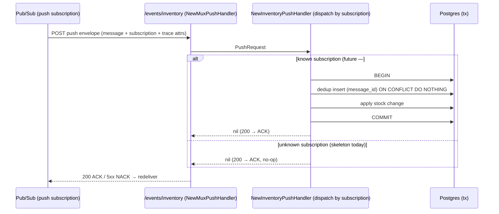
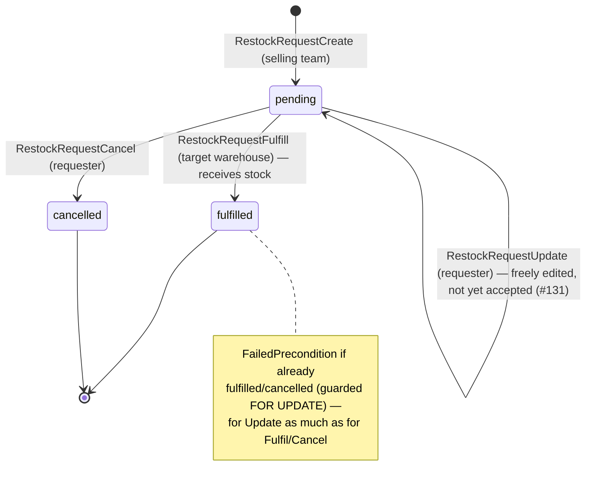
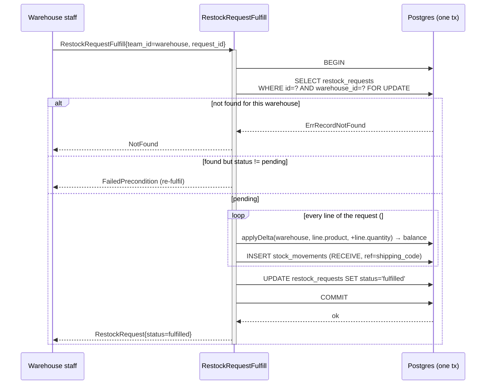

# inventory_service — RPC & event flows

## Pub/Sub push receiver (#102)

`inventory_service` exposes a **Pub/Sub PUSH** endpoint so it can react to events published by other
services (the counterpart to publishing via `event_source.NewPubsubEventSender`). It is a plain HTTP
endpoint — **not** a Connect RPC — mounted at **`/events/inventory`** in
[register.go](../../../backend/services/inventory_service/register.go) and wrapped by
`event_source.NewMuxPushHandler` (which continues the publisher's trace and encodes the ACK/NACK
contract).

One handler dispatches by **subscription name** (`push.subscription`), so a single endpoint can serve
several subscriptions.

**Status: SKELETON.** No subscription consumes events yet — inventory reacts to order/stock events,
and that integration (order → stock) lands with **#69**, which also introduces the stock-event
contract. Until then the handler ACKs every message as a no-op (returning non-2xx would make Pub/Sub
redeliver forever).

When a real subscription is wired, the handler will, in **one transaction**: insert an **exactly-once**
dedup row keyed by `message.messageId` (`ON CONFLICT DO NOTHING` — a redelivery finds the row and
skips), then decode the event with `event_source.DecodeEvent` and apply the stock change. If the work
fails, the whole transaction (dedup row included) rolls back so a redelivery reprocesses it.

> **Dead-letter policy required.** `event_source/push.go` returns a non-2xx for a malformed or failed
> message, and Pub/Sub redelivers any non-2xx forever. Every push subscription pointed at this
> endpoint must therefore have a dead-letter policy so a poison message is eventually parked, not
> looped. (Push-endpoint authentication — OIDC/token — is a deployment concern, not handled in code.)

---

## Restock requests (#105)

A **two-sided** flow across two teams and three tables. A SELLING team asks a WAREHOUSE to restock a
product; the warehouse fulfils it, and *fulfilment is what receives the stock*. The request row and
the stock ledger can never diverge because the fulfil does both in **one transaction**.

- **`RestockRequestCreate`** — the SELLING team (`requesting_team_id`, `use_scope`) raises a `pending`
  request naming the target `warehouse_id`, a `shipping_code`, and **one or more priced lines**
  (product + `sku`/`name` snapshot + quantity + per-unit price, #124). Optionally an `order_ref` (free
  text — the order lives in someone else's system, #127), a `receipt` (resi), a `supplier_id` (must be
  the requesting team's own, else **NotFound**), plus the restock's own money and context: a
  `shipping_cost` (the freight, on top of the per-line prices), a `payment_type`, and a `note`.
  No stock is touched.
- **`RestockRequestList`** — returns rows where `requesting_team_id = team_id` **OR**
  `warehouse_id = team_id`, so the one RPC serves both the requester's "my requests" view and the
  warehouse's "incoming" view. Paginated, newest first. Lines are **preloaded** in one extra query
  keyed by request id, so a page costs 2 queries rather than N+1.
- **`RestockRequestDetail`** — one request in full, with its lines, for the detail page (#125). The
  same two-sided scope as List, and the scope **is** the `WHERE` clause: a request that is neither
  yours nor targeting you reads as **NotFound**, never PermissionDenied — a permission error would
  confirm the id exists.
- **`RestockRequestFulfill`** — the TARGET WAREHOUSE (`warehouse_id`, `use_scope`) receives the stock
  and flips the status, atomically. The request is loaded `FOR UPDATE` scoped to this warehouse
  (another warehouse's request reads as **NotFound**) and must be `pending` (a re-fulfil is
  **FailedPrecondition**). **Every line is received inside the one transaction** (#124) — a request
  half-received would be worse than one not received at all, and the status flip has to mean all of
  it landed. A request with no lines is refused rather than "fulfilled" having moved nothing.
- **`RestockRequestUpdate`** — the REQUESTER edits its own request **while the warehouse has not
  accepted it** (#131). Until then nothing has physically happened, so there is nothing to protect and
  the request is freely editable — the warehouse it targets included. Once it is `fulfilled` the goods
  have moved, and once `cancelled` it is closed, so both are **FailedPrecondition**; another team's
  request is **NotFound**, as for Cancel.
  - It is a **full replace, not a patch** — the edit screen is the create form re-opened, so it
    submits every field back and an empty one means *cleared*. The handler writes with a **column
    map, not a struct**: GORM skips a struct's zero values, which would silently keep the old note or
    supplier while the form showed them gone.
  - **Lines are rewritten, not diffed** (delete + re-insert in the transaction). While a request is
    pending nothing references a line — stock only moves at fulfil — so their ids are not worth
    preserving, and a rewrite cannot drift the way a partial diff can.
  - Guarded `FOR UPDATE` **inside the transaction**, like Fulfil and Cancel: the status check and the
    write must be atomic, or an edit racing the warehouse's acceptance could land just after the stock
    was received and change the quantities that were accepted. Both take the same row lock, so the
    loser sees the other's committed status and bails.
  - **The supplier is only re-validated when it CHANGES.** A full replace re-sends the supplier the
    form prefilled, so an unchanged id is the request *preserving* a reference it already holds, not
    making a new one. Since `SupplierDelete` is a **soft** delete and `supplierExists()` requires
    `deleted = false`, re-checking an untouched id would make deleting a supplier permanently brick
    every pending request that names it — rejecting the edit over a field the person never touched.
    *Adopting* a deleted supplier is still **NotFound**; *keeping* one that predates the deletion is
    not.
- **`RestockRequestCancel`** — the REQUESTER (`requesting_team_id`, `use_scope`) cancels its own
  still-`pending` request (another team's reads as **NotFound**; a non-pending one is
  **FailedPrecondition**). No stock is touched.

### Lifecycle

`pending` is the only writable state: it is where the requester still owns the request, and it is why
edit and cancel both live there and nowhere else.

### Fulfil transaction (the one that must not diverge)

`applyDelta` + `appendMovement` are the same stock primitives `StockReceive` uses (see
[service.go](../../../backend/services/inventory_service/inventory_v1/service.go)), so a fulfilment is
indistinguishable in the ledger from a manual receive except for its `reason` (`"restock request"`)
and `ref` (the request's `shipping_code`).
