# inventory_service — RPC & event flows

## Pub/Sub push receiver (#102)

`inventory_service` exposes a **Pub/Sub PUSH** endpoint so it can react to events published by other
services (the counterpart to publishing via `event_source.NewPubsubEventSender`). It is a plain HTTP
endpoint — **not** a Connect RPC — mounted at **`/events/inventory`** in
[register.go](../../../backend/services/inventory_service/register.go) and wrapped by
`event_source.NewMuxPushHandler` (which continues the publisher's trace and encodes the ACK/NACK
contract).

One handler dispatches by **subscription name** (`push.subscription`), so a single endpoint can serve
several subscriptions.

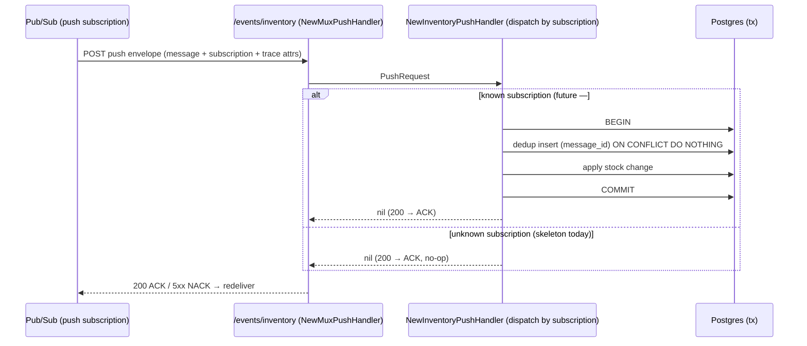
```mermaid
sequenceDiagram
    participant PS as Pub/Sub (push subscription)
    participant H as /events/inventory (NewMuxPushHandler)
    participant D as NewInventoryPushHandler (dispatch by subscription)
    participant DB as Postgres (tx)

    PS->>H: POST push envelope (message + subscription + trace attrs)
    H->>D: PushRequest
    alt known subscription (future — #69)
        D->>DB: BEGIN
        D->>DB: dedup insert (message_id) ON CONFLICT DO NOTHING
        D->>DB: apply stock change
        D->>DB: COMMIT
        D-->>H: nil  (200 → ACK)
    else unknown subscription (skeleton today)
        D-->>H: nil  (200 → ACK, no-op)
    end
    H-->>PS: 200 ACK  /  5xx NACK → redeliver
```

**Status: SKELETON.** No subscription consumes events yet — inventory reacts to order/stock events,
and that integration (order → stock) lands with **#69**, which also introduces the stock-event
contract. Until then the handler ACKs every message as a no-op (returning non-2xx would make Pub/Sub
redeliver forever).

When a real subscription is wired, the handler will, in **one transaction**: insert an **exactly-once**
dedup row keyed by `message.messageId` (`ON CONFLICT DO NOTHING` — a redelivery finds the row and
skips), then decode the event with `event_source.DecodeEvent` and apply the stock change. If the work
fails, the whole transaction (dedup row included) rolls back so a redelivery reprocesses it.

> **Dead-letter policy required.** `event_source/push.go` returns a non-2xx for a malformed or failed
> message, and Pub/Sub redelivers any non-2xx forever. Every push subscription pointed at this
> endpoint must therefore have a dead-letter policy so a poison message is eventually parked, not
> looped. (Push-endpoint authentication — OIDC/token — is a deployment concern, not handled in code.)

---

## Restock requests

A **two-sided** flow across two teams. A SELLING team restocks into a WAREHOUSE; the warehouse signs for the box and
counts it in, and *the accept is what receives the stock*. The design is
[restock.md](../../business/inventory/restock.md) and its decisions in
[restock_decision.md](../../business/inventory/restock_decision.md); the contract was **rewritten in place** to it
([the-restock-contract-changes-in-place](../../business/inventory/restock_decision.md#the-restock-contract-changes-in-place)).

> ⚠ **Until the restock backend step.** The contract is ahead of the tables: `finance_account_id`, `shipment_id`,
> `receipt_file`, a line's `supplier_id` / `supplier_channel_id` / `note`, a problem row's `note` and cancel's
> `money_returned` are **accepted but not stored**; `RestockRequestArrive` and `RestockRequestMarkLost` answer
> **Unimplemented**. The stored status text still says `pending` for ONGOING and `fulfilled` for ACCEPTED, and a
> missing problem row is stored as `lost` — the mapper translates; renaming the data is that step's migration.

| RPC | Who | From → to | What it does |
| --- | --- | --- | --- |
| `RestockRequestCreate` | selling team | → ongoing | the restock and its lines in one transaction; each product once; the lines' common supplier is stored at the restock level until lines store their own |
| `RestockRequestList` / `Detail` | either side | — | rows where `requesting_team_id = team` **OR** `warehouse_id = team`; a third team reads **NotFound**. Every filter server-side; a lens narrows the two-sided scope, never replaces it |
| `RestockRequestUpdate` | selling team | ongoing | a full replace of the restock. The arrived window — lines only, new lines allowed, none removed — opens with `Arrive` |
| `RestockRequestArrive` | warehouse | ongoing / lost → arrived | *Unimplemented until the backend step* |
| `RestockRequestAccept` | warehouse | ongoing / arrived → accepted | counts the box in — below |
| `RestockRequestMarkLost` | selling team | ongoing → lost | *Unimplemented until the backend step* |
| `RestockRequestCancel` | selling team | ongoing → cancelled | ongoing only, so a second cancel is refused — the money comes back once |
| `RestockRequestLabels` | warehouse | accepted | one label per placement the good units went to |
| `RestockInboundStat` | warehouse | — | what is still coming: ongoing **and** arrived |

### Lifecycle

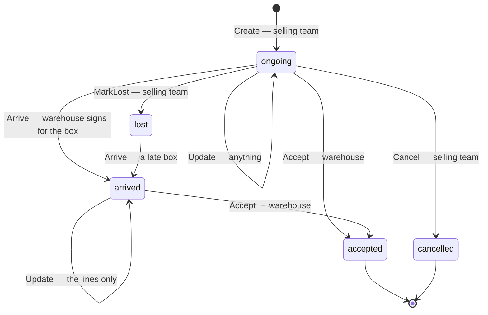
```mermaid
stateDiagram-v2
    [*] --> ongoing: Create — selling team
    ongoing --> ongoing: Update — anything
    ongoing --> arrived: Arrive — warehouse signs for the box
    ongoing --> accepted: Accept — warehouse
    arrived --> arrived: Update — the lines only
    arrived --> accepted: Accept — warehouse
    ongoing --> lost: MarkLost — selling team
    lost --> arrived: Arrive — a late box
    ongoing --> cancelled: Cancel — selling team
    accepted --> [*]
    cancelled --> [*]
```

Every move takes the restock row `FOR UPDATE` first and checks the status under it, so an accept and a cancel at the
same second queue on one lock and the second sees what the first did
([accept-locks-the-restock](../../business/inventory/restock_decision.md#accept-locks-the-restock)).

### The accept transaction

Per line the warehouse types **what is in the box** and **how many of those are broken**; good and missing are worked
out ([any-warehouse-member-counts-what-arrived](../../business/inventory/restock_decision.md#any-warehouse-member-counts-what-arrived)).

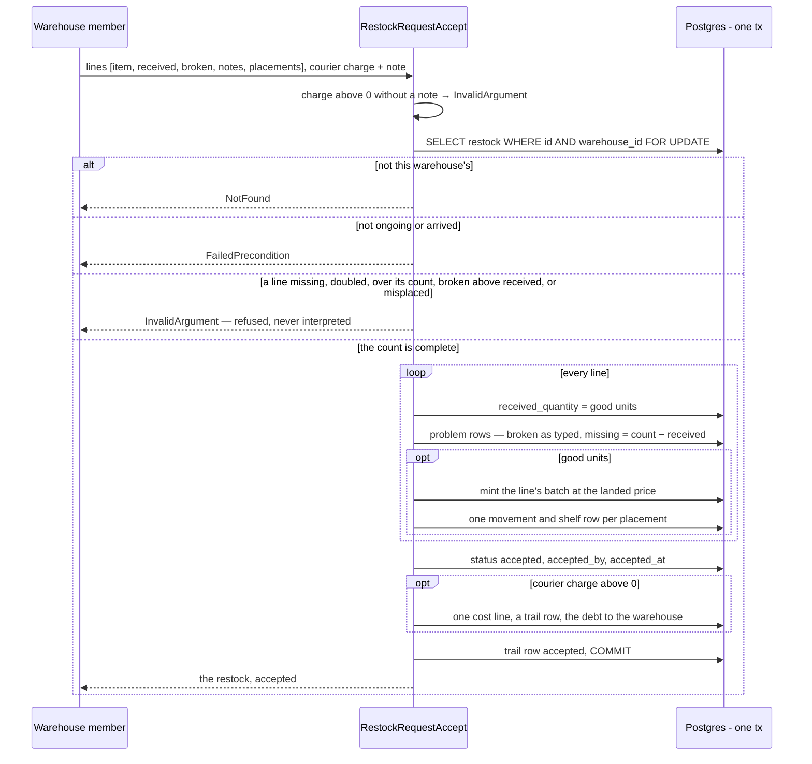
```mermaid
sequenceDiagram
    participant W as Warehouse member
    participant H as RestockRequestAccept
    participant DB as Postgres - one tx

    W->>H: lines [item, received, broken, notes, placements], courier charge + note
    H->>H: charge above 0 without a note → InvalidArgument
    H->>DB: SELECT restock WHERE id AND warehouse_id FOR UPDATE
    alt not this warehouse's
        H-->>W: NotFound
    else not ongoing or arrived
        H-->>W: FailedPrecondition
    else a line missing, doubled, over its count, broken above received, or misplaced
        H-->>W: InvalidArgument — refused, never interpreted
    else the count is complete
        loop every line
            H->>DB: received_quantity = good units
            H->>DB: problem rows — broken as typed, missing = count − received
            opt good units
                H->>DB: mint the line's batch at the landed price
                H->>DB: one movement and shelf row per placement
            end
        end
        H->>DB: status accepted, accepted_by, accepted_at
        opt courier charge above 0
            H->>DB: one cost line, a trail row, the debt to the warehouse
        end
        H->>DB: trail row accepted, COMMIT
        H-->>W: the restock, accepted
    end
```

| Rule | Decision |
| --- | --- |
| received above the line's count is refused — the selling team adds the extra by an edit first | [accept-refuses-more-than-the-line-says](../../business/inventory/restock_decision.md#accept-refuses-more-than-the-line-says) |
| the short units are a MISSING row, worked out, never typed | [a-short-unit-at-the-door-is-missing](../../business/inventory/restock_decision.md#a-short-unit-at-the-door-is-missing) |
| the good units go onto placements of this warehouse, exactly received − broken; there is no unplaced choice | [there-is-no-unplaced-pile](../../business/inventory/restock_decision.md#there-is-no-unplaced-pile) |
| a problem row's worth is the line's share, filled on read | [the-problem-price-is-filled-by-the-system](../../business/inventory/restock_decision.md#the-problem-price-is-filled-by-the-system) |
| one batch per line with good units; unit cost = line total ÷ good units + (shipping + courier charge) ÷ all good units | [one-batch-per-line](../../business/inventory/restock_decision.md#one-batch-per-line) |
| one courier's charge, its note required; outside the restock's total, inside the unit price; the debt posts in the same transaction | [the-courier-is-paid-once-per-restock](../../business/inventory/restock_decision.md#the-courier-is-paid-once-per-restock), [the-couriers-debt-is-written-in-the-accept](../../business/inventory/restock_decision.md#the-couriers-debt-is-written-in-the-accept) |
| an empty problem note is stored as words while 00013's `CHECK (reason <> '')` stands | [a-broken-reason-is-optional](../../business/inventory/restock_decision.md#a-broken-reason-is-optional) |

`applyDelta` + `appendMovement` are the same stock primitives `StockReceive` uses, so an accept is indistinguishable in
the ledger from a manual receive except for its `reason` (`"restock request"`) and `ref` (the tracking number).

---

## Stock lives in a PLACE (#135) — and what that changes about reads

Since #135 the grain is **(warehouse, rack, product)**. One idea explains most of the surprises here:

> **A movement is a statement about ONE PLACE; a level is a statement about ONE WAREHOUSE.**

- `applyDelta`/`appendMovement` take a place. A movement's `delta` and `balance` are **that place's** —
  "this shelf went from 40 to 49" — never the warehouse's total for the product.
- `StockList` **sums across a product's places** and returns one line per product: "how much of X do we
  have here?" has never meant "on which shelf". Its page total counts **products**, not rows, or a
  warehouse spreading one product over more shelves would silently shrink its own page.
- **`rack_id IS NULL` = unplaced** — a real place ("somewhere in this warehouse, not yet shelved"),
  not a missing value. Every query matches it with **`IS NOT DISTINCT FROM`, never `=`**: `rack_id =
  NULL` is never true in SQL, so a plain `=` reports a phantom shortage for goods sitting right there.

### A stock-take counts a SHELF (#139)

`StockAdjust` corrects **one place** to a counted figure, and the request must **say which** — a rack,
or explicitly the unplaced pile. It is a **required `oneof`**, and the handler re-checks it rather than
reading the zero value, because `GetRackId()` returns 0 both for *"unplaced"* and for *"said nothing"*.
Silently treating the second as the first is the bug the field exists to prevent: a stock-take that
corrects a pile nobody counted. **Refuse, do not interpret** — the same rule as the per-line count in
`RestockRequestAccept`.

The rejected alternative was a warehouse-level figure. It needed a rule for spreading a correction
across a product's shelves (proportionally? onto unplaced? refuse?) and **every such rule invents a
fact nobody observed**. A stock-take that corrects the wrong shelf is worse than no stock-take, because
it is believed.

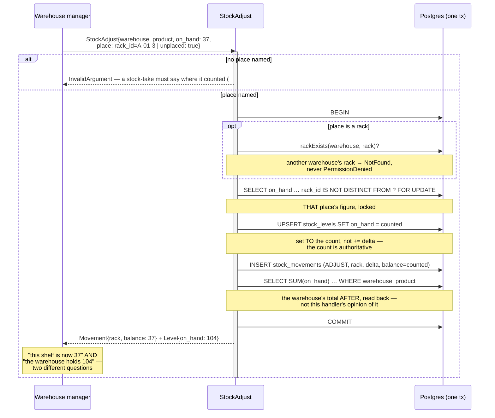
```mermaid
sequenceDiagram
    participant W as Warehouse manager
    participant H as StockAdjust
    participant DB as Postgres (one tx)

    W->>H: StockAdjust{warehouse, product, on_hand: 37,<br/>place: rack_id=A-01-3 | unplaced: true}
    activate H
    alt no place named
        H-->>W: InvalidArgument — a stock-take must say where it counted (#139)
    else place named
        H->>DB: BEGIN
        opt place is a rack
            H->>DB: rackExists(warehouse, rack)?
            Note over H,DB: another warehouse's rack → NotFound,<br/>never PermissionDenied
        end
        H->>DB: SELECT on_hand … rack_id IS NOT DISTINCT FROM ? FOR UPDATE
        Note over H,DB: THAT place's figure, locked
        H->>DB: UPSERT stock_levels SET on_hand = counted
        Note over H,DB: set TO the count, not += delta —<br/>the count is authoritative
        H->>DB: INSERT stock_movements (ADJUST, rack, delta, balance=counted)
        H->>DB: SELECT SUM(on_hand) … WHERE warehouse, product
        Note over H,DB: the warehouse's total AFTER, read back —<br/>not this handler's opinion of it
        H->>DB: COMMIT
        H-->>W: Movement{rack, balance: 37} + Level{on_hand: 104}
        Note over W: "this shelf is now 37" AND<br/>"the warehouse holds 104" —<br/>two different questions
    end
    deactivate H
```

Correcting one shelf leaves the product's other shelves **exactly as they were** — that is the point,
and it is what the warehouse-level alternative could not promise.

### Reading a rack, and why it needs another service (#138)

`RackStock` answers the question a person standing at a shelf actually has: **what is on THIS rack, and
how much of each**. It is the mirror of `StockList` — that one sums a product *across* its racks
("how much of X does this warehouse hold"), this one reads a single rack.

Two things it refuses to conflate:

- **Another warehouse's rack is NotFound, never an empty shelf.** If "not yours" looked like "nothing
  on it", a probe could map another warehouse's rack ids by which came back empty.
- **A line counted to zero is not on the rack.** A level can fall to 0 without being deleted (a
  stock-take zeroing a shelf), and listing it would show a product that is not there.

**It returns product ids only — never names.** That is not laziness, it is the service boundary: a
warehouse holds **other teams' goods** (a selling team's restock puts its product on this shelf), so
the ids belong to catalogues `inventory_service` does not own, and inventing a name for them would be
guessing. The caller resolves them through `product_service`'s **`ProductByIds`** — added for exactly
this, and the reason the §4 question ("whose product is in whose warehouse") had to be settled before
this screen could exist. Two things that decision is honest about: it is **new exposure for warehouse
roles**, and *"only what it holds"* is **not enforced** and cannot be by `product_service`, which
does not know what any warehouse holds.

### Moving stock inside a warehouse (#136)

`StockMove` changes **where** stock sits, never **how much** there is. That invariant is the definition
of a move, and it is what makes it a different fact from a receive: the warehouse's total for the
product is identical before and after.

**One verb for both jobs**, because they are one act with different arguments:

| | |
| --- | --- |
| `from: unplaced → to: rack` | **shelving** what arrived — the pile #135 left behind, which is everything predating #137 |
| `from: rack → to: rack` | **re-organising** a shelf |

- **Both ends are required, and must differ.** Moving stock onto the place it already sits is a
  mistake, not a no-op worth recording — honouring it would write a ledger pair saying nothing
  happened, twice. `InvalidArgument`.
- **The source is decremented FIRST**, deliberately. `applyDelta`'s guard refuses to take a place
  below zero, so taking first means an over-move is rejected *before* anything is credited anywhere.
  Crediting first and then discovering the source was short would still roll back — but it would have
  written a positive movement for goods that were never there.
- **Both legs commit together.** A move that took stock off a shelf without putting it anywhere would
  destroy goods that are physically in the building.
- **One `MOVEMENT_KIND_MOVE`, not an OUT/IN pair** like a transfer. A transfer needs two kinds because
  its legs are in two *warehouses* and each side only ever sees its own; both legs of a move are in the
  same warehouse, so a reader sees the pair together and the rack plus the sign already tell the story.
- Staff may do it, unlike `StockTransfer` (a manager action): nothing leaves the building, and the
  person carrying the box is the one who knows where it went.

**A rack that still holds stock cannot be deleted** (#138) — `FailedPrecondition`, empty the shelf
first, and **`StockMove` is how you empty it**. The check lives in the handler because the FK cannot do it: `stock_levels.rack_id` is
`ON DELETE RESTRICT`, but `RackDelete` is a **soft** delete, so the row is never removed and the
constraint never fires. Unguarded, #137 made this a live bug — the goods were **stranded**, still in
`stock_levels` at a location that had vanished from every list, where nobody could find or fix them.
Moving them to unplaced instead was rejected: the boxes are still physically on that shelf until a
person moves them, so recording them as "somewhere" would invent a location nobody observed.

---

## Accepting a delivery (#154, #155, #157)

Accepting is **counting** — what is in the box and how many are broken, per line — and **saying where the good units
went**, with the courier's charge at the door beside it. That is a form with sections, so the warehouse's Accept surface
is a **page**, not a dialog.

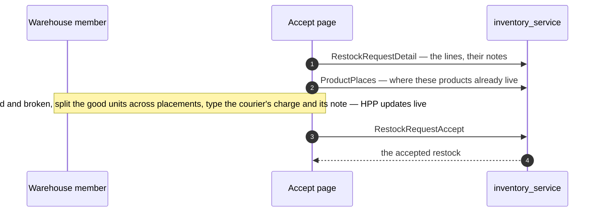
```mermaid
sequenceDiagram
    autonumber
    participant W as Warehouse member
    participant UI as Accept page
    participant I as inventory_service

    UI->>I: RestockRequestDetail — the lines, their notes
    UI->>I: ProductPlaces — where these products already live
    Note over W,UI: type received and broken, split the good units across placements, type the courier's charge and its note — HPP updates live
    UI->>I: RestockRequestAccept
    I-->>UI: the accepted restock
```

### The rules the screen mirrors

| Rule | Why |
| --- | --- |
| A blank count is **not** zero | 0 means "looked, none of it was in the box". Blank means nobody counted. |
| Received above the line's count **blocks** Accept | the selling team adds the extra by an edit first (accept-refuses-more-than-the-line-says) |
| Missing is **worked out**, never typed | ordered − received (a-short-unit-at-the-door-is-missing) |
| Placements must **sum** to received − broken | counting 8 good and placing 7 is an error in one of the two |
| The courier's charge needs a note, and sits **outside** the total | the-courier-is-paid-once-per-restock, the-couriers-charge-stays-out-of-total |

The guard is a single expression mirroring the handler's rules — a second one beside it is how a screen's idea of
"ready to send" drifts from the handler's idea of "acceptable". The HPP preview mirrors the accept's arithmetic, the
courier's charge included, so the figure on screen is the one the batch freezes.

---

## RestockInboundStat — the receiving warehouse's headline (owner, 2026-07-30)

The mirror of `OwnerStockStat` below, and it exists **because it is not the same question**. The buyer
asks *what have I committed that has not landed*; the warehouse asks *what work is still at my door*.

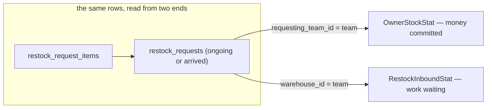
```mermaid
flowchart LR
    subgraph "the same rows, read from two ends"
      RR["restock_requests (ongoing or arrived)"]
      RI[restock_request_items]
      RI --> RR
    end
    RR -->|"requesting_team_id = team"| O["OwnerStockStat — money committed"]
    RR -->|"warehouse_id = team"| I["RestockInboundStat — work waiting"]
```

Four figures over **ongoing and arrived restocks coming to this warehouse**, narrowed by the same
`requesting_team_id` lens the list uses — a headline that ignored the filter under it would contradict
the table it sits above.

| Figure | What it is | Why not the obvious thing |
| --- | --- | --- |
| `restock_count` | `COUNT(*)` over the pending REQUESTS | Over requests, not the item join — a two-line delivery is **one** delivery. 3 deliveries of 400 pieces and 30 of 400 are the same stock and completely different amounts of door-opening. |
| `product_count` | **DISTINCT** `product_id` across the queue | Counting LINES reports 4 for one SKU on four deliveries. It is one thing to find a shelf for, and put-away is the job this number sizes. |
| `unit_count` | Σ ordered `count` | The **asked** quantity — nobody has counted these yet, which is exactly why they are in the queue. |
| `amount` | Σ `total_price` | **Goods only.** Shipping is what the buying team paid to get them moving and the courier's charge is 0 until someone accepts, so either would answer a question about somebody else's spending. |
| `oldest_pending_unix` | `MIN(created_at)` over the REQUESTS | Over requests, not their lines — a line-less request still waits at the door, and a MIN over the item join would skip it. A count of 7 hides the box that has sat since Monday. |

**Still coming is the whole meaning of it** — on its way, or at the door not yet counted. An accepted restock has
become stock; a lost or cancelled one never arrives. Either leaking in produces a queue that never drains.

`MIN`/`MAX` over no rows is **NULL, not 0** — the scan target is nullable, and an empty queue reports
`0` (the RPC's "never"), which the UI renders as an em dash rather than "0 days".

Its policy carries **warehouse roles only** — this is deliberately not one RPC serving both sides.
`OwnerStockStat`'s policy has no warehouse roles at all, so the receiving crew would have got
PermissionDenied from it; letting one RPC answer both is how two different numbers silently converge.

## OwnerStockByIds / OwnerStockStat — the catalogue owner's stock (the selling team's product list)

Every other read in this service answers **for a warehouse**: the caller is the building, and
`team_id` is that building's team. These two answer **for the selling team that owns the goods** —
*how much of my product is on a shelf, anywhere, and what is it worth* — which no RPC could answer
before.

### Ownership is derived, never asserted

`inventory_service` does not know who owns a product: `product_id` is an opaque id and no stock row
carries an owner. What it does know is **how the stock got there** — every unit arrives on an accepted
restock line, and a restock names the team that raised it:

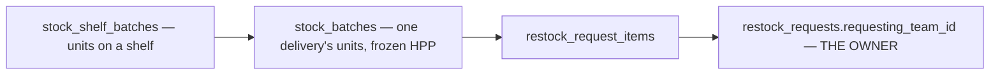
```mermaid
flowchart LR
    SSB[stock_shelf_batches — units on a shelf] --> B[stock_batches — one delivery's units, frozen HPP]
    B --> RI[restock_request_items]
    RI --> RR["restock_requests.requesting_team_id — THE OWNER"]
```

That chain **is** the authorization. A caller passing another team's product id joins to none of its
rows and gets nothing back — no ownership column that could disagree with the restock it came from,
and no trust placed in the client.

### The page's three reads

The product list is one screen over three services, and each answers for the **whole page** rather
than per row — a per-row fetch is an N+1 that only reveals itself once a real catalogue is loaded.

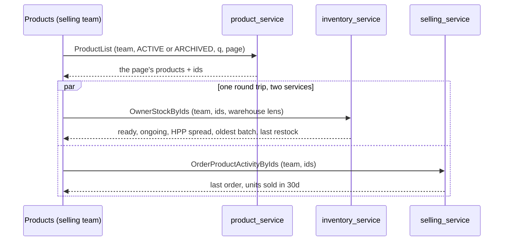
```mermaid
sequenceDiagram
    participant UI as Products (selling team)
    participant P as product_service
    participant I as inventory_service
    participant S as selling_service

    UI->>P: ProductList (team, ACTIVE or ARCHIVED, q, page)
    P-->>UI: the page's products + ids

    par one round trip, two services
        UI->>I: OwnerStockByIds (team, ids, warehouse lens)
        I-->>UI: ready, ongoing, HPP spread, oldest batch, last restock
    and
        UI->>S: OrderProductActivityByIds (team, ids)
        S-->>UI: last order, units sold in 30d
    end
```

The stat row above the tabs is the same three questions asked of the whole catalogue —
`ProductList` for the count, `OwnerStockStat`, `OrderActivityStat` — and deliberately **not** a total
of the visible page: a headline that moved every time somebody typed in the search box would be
describing the search rather than the business.

### The rules these reads keep

| Rule | Why |
| --- | --- |
| Unknown-cost batches add **units, not money** | A batch whose HPP was never recorded is not free (#74). It counts in `ready_qty` and contributes nothing to `ready_value`; `cost_known` says whether the spread means anything at all. |
| The cost **spread**, not an average | The same product genuinely arrives at different prices. The average is exactly what hides that. |
| Oldest batch = oldest with **ready units** | A delivery that has sold out is not old stock; it is gone. Dating the column from it would flag healthy products as stale. |
| Ongoing is an **estimate** and never summed into ready | Its cost settles on what actually lands (#74). |
| A **cancelled** order is not a sale | On the selling side, both `last_order_unix` and the 30-day units exclude cancelled orders — otherwise a dead product reads as alive on the strength of a mistake somebody corrected. |
| A product with nothing behind it is **absent**, not zeroed | The caller knows which ids it asked about. "Nothing to say" travels lighter, and the UI renders it as *unknown* rather than a confident `0` beside a full shelf. |

### The warehouse lens

`filter.warehouse_id = 0` means every warehouse holding this team's goods. Set it and **every figure
restates as that one building's** — which is the honest reading, because stock is held per warehouse
and a total can never tell you whether *one* of them can fill an order. The UI says so out loud by
appending the warehouse's name to each stock column header.

## OwnerCostLayerList / OwnerBatchList / OwnerStockHistory — the owner's product DETAIL (#232)

`OwnerStockByIds` above answers per-product aggregates. These three answer **what those aggregates are
made of**, behind the selling team's product detail: its Price, Batch and Stock history tabs, which
until now had never shown a row.

They are not new questions — `CostLayerList`, `BatchList` and `StockHistory` have answered them for a
warehouse all along. But every one of those is scoped to the **warehouse team** and admits **warehouse
roles only**, so a selling team has no building to name and no role to ask with. The three owner reads
are the same questions asked by the team that owns the goods:

| | scope | warehouse | who may call |
| --- | --- | --- | --- |
| `CostLayerList` / `BatchList` / `StockHistory` | the warehouse team | **is** the scope | warehouse roles |
| `OwnerCostLayerList` / `OwnerBatchList` / `OwnerStockHistory` | the **selling** team | a **lens** (0 = all) | selling roles |

The warehouse becoming a *lens* rather than the scope is the substantive change. An owner's purchases
are not a fact about a building — 200 units in Surabaya and 300 in Jakarta are one purchase history —
so `warehouse_id` narrows the answer instead of defining it, and the Batch rows carry the building
they landed in as a column.

### The ledger the owner reads is a different table

`OwnerStockHistory` reads **`stock_owner_movements`**, not `stock_movements`. The ledger answers for a
SHELF: its `balance` is a rack's running total, its `rack_id` is the point of the row, and a
shelf-to-shelf move is among its commonest events. None of those is a fact about what an owner holds.

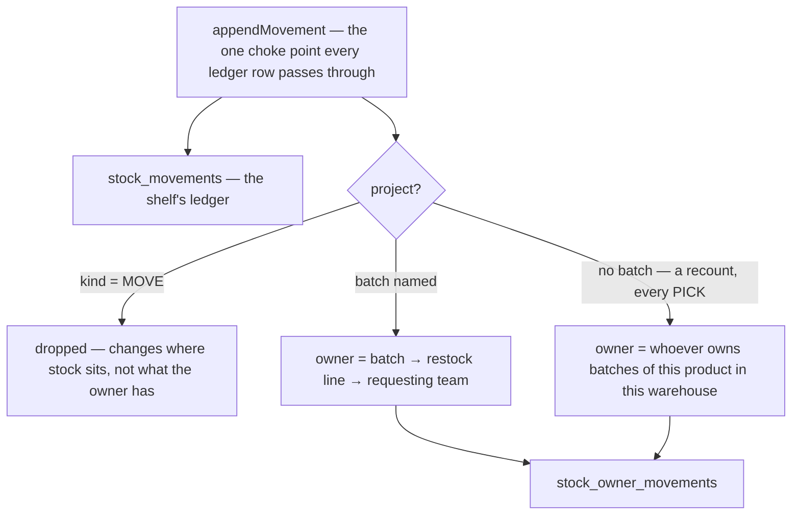
```mermaid
flowchart TB
    AM["appendMovement — the one choke point every ledger row passes through"]
    AM --> SM[stock_movements — the shelf's ledger]
    AM --> P{"project?"}
    P -->|"kind = MOVE"| DROP["dropped — changes where stock sits, not what the owner has"]
    P -->|"batch named"| CHAIN["owner = batch → restock line → requesting team"]
    P -->|"no batch — a recount, every PICK"| PROD["owner = whoever owns batches of this product in this warehouse"]
    CHAIN --> SOM[stock_owner_movements]
    PROD --> SOM
```

Two rules, because a batch-less event cannot climb the chain at all. A movement that resolves to **no**
owner is not projected — stock nobody restocked here has no owner to tell.

### Why the balance is computed and not stored

`OwnerMovement.balance` is the owner's on-hand of that product **in that building** after the event —
a running `SUM(delta) OVER (PARTITION BY warehouse_id ORDER BY id)` over their own ledger.

- **Derived, not stored.** Stored, it would be a number maintained by two writers on different shelves
  of the same product with nothing serialising them: two concurrent receives would each read the same
  "previous" balance and write the same "after". Derived, it cannot drift from the rows it is made of,
  and rebuilding the projection reproduces every figure exactly.
- **The window runs BEFORE the filters.** Kind and date narrow the result *outside* the subquery.
  Summing after them would produce "the total of the adjustments I asked to see" — a number about the
  filter rather than about the stock.
- **`PARTITION BY warehouse_id`, always.** With the lens set it is a single partition and costs
  nothing. With the lens open it is what keeps each row's balance a statement about ONE building,
  rather than a total that adds together stock in cities which can never fill each other's orders.

### This projection is meant to move

Today `appendMovement` writes both tables in one transaction, so the owner's history can never be
missing an event the shelf's ledger recorded. Later it becomes an **event consumer** (owner) — the
rows and the read shape do not change when it does, which is the reason the owner's lens lives in its
own table now rather than being fused into `stock_movements`.

---

## A stock opname — counting a whole shelf (`StockOpname`)

`StockAdjust` with reason `RECOUNT` has been able to correct **one product on one shelf** since #139.
That is the posting, not the job. Nobody walks to A-01-3 to count one product: they stand at the shelf,
count everything on it, and the useful fact afterwards is *"A-01-3 was counted, and here is what was
wrong"* — not five unrelated corrections that happen to share a rack.

`StockOpname` is that act. It reuses the recount mechanics per line and adds the two things a sweep
needs: **all-or-nothing**, and **the whole picture of the variance**.

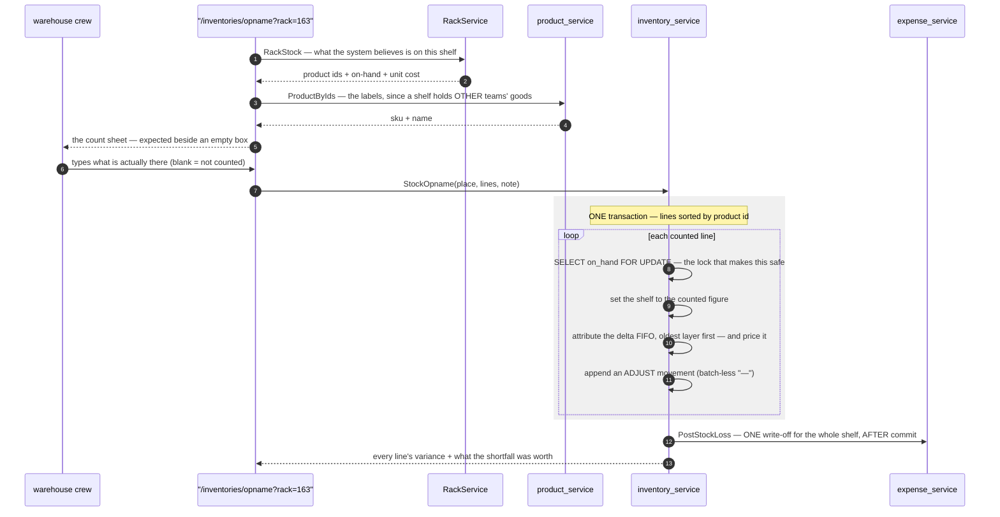
```mermaid
sequenceDiagram
    autonumber
    participant P as warehouse crew
    participant UI as "/inventories/opname?rack=163"
    participant R as RackService
    participant PS as product_service
    participant I as inventory_service
    participant E as expense_service

    UI->>R: RackStock — what the system believes is on this shelf
    R-->>UI: product ids + on-hand + unit cost
    UI->>PS: ProductByIds — the labels, since a shelf holds OTHER teams' goods
    PS-->>UI: sku + name
    UI-->>P: the count sheet — expected beside an empty box

    P->>UI: types what is actually there (blank = not counted)
    UI->>I: StockOpname(place, lines, note)

    rect rgb(240, 240, 240)
        Note over I: ONE transaction — lines sorted by product id
        loop each counted line
            I->>I: SELECT on_hand FOR UPDATE — the lock that makes this safe
            I->>I: set the shelf to the counted figure
            I->>I: attribute the delta FIFO, oldest layer first — and price it
            I->>I: append an ADJUST movement (batch-less "—")
        end
    end

    I->>E: PostStockLoss — ONE write-off for the whole shelf, AFTER commit
    I-->>UI: every line's variance + what the shortfall was worth
```

### The two rules that matter most

| | |
| --- | --- |
| **Only the lines sent are counted** | A product on the shelf and absent from `lines` is left completely alone — **never zeroed**. The tempting reading ("a sweep means everything else is gone") would turn one forgotten row or one lost page into a silent write-off of real stock, and a stock-take is BELIEVED. Emptying a shelf is `counted_qty = 0`, said out loud. |
| **A zero-variance line still writes a movement** | `last_opname_unix` is read from the newest `ADJUST` on that `(product, rack)`, so a correct count that wrote nothing would leave the shelf looking permanently overdue for the count somebody just did. Counting and changing are different things. |

### What a shortfall is worth

The delta lands on the batches on that shelf **oldest first** (owner's Q1), and the write-off is priced
at **the layers the draw actually consumed** — not at "the oldest layer's cost" applied to everything.
A shortfall spanning two deliveries at different prices is worth the sum of what it took from each.

`value_known = false` says the figure is a **floor**: a batch's `unit_cost` is nullable and nil means
UNKNOWN, never 0 (#74), so units drawn from a costless layer leave priced at nothing. The screen says
"at least X" rather than showing a confident total.

A **surplus is never valued**. Stock that turns up was not bought, and booking a negative expense for it
would let a sloppy count read as income.

### Concurrency

Two people counting one shelf at the same second is the normal case here, not an edge case. Every line
takes a `FOR UPDATE` row lock on `stock_levels`, and **the lines are sorted by product id before
locking** — a deadlock guard, not tidiness: two requests locking `7 then 3` and `3 then 7` would have
Postgres kill one of them, and the person would see a stock-take fail for no reason they could explain.

Proved rather than asserted — see
[audits/services/inventory_service/concurrency/lock-order.md](../../../audits/services/inventory_service/concurrency/lock-order.md).

### Not yet

- **The unplaced pile cannot be counted here.** `RackStock` is a per-rack read and the pile has no rack
  id. The screen says so rather than showing an empty shelf.
- **A shelf larger than one screen** is flagged (`truncated`) rather than silently counted in part. The
  uncounted rows are safe — the server never touches a product it was not sent — but the person would
  otherwise believe they had finished.

## Broken, lost, and found — the warehouse reimburses the owner (business_level §Warehouse 5)

A `DAMAGED` / `LOST` adjust already wrote the units off the shelf and their frozen cost to expense.
That answered *"what did our losses cost us"* and left the other question unanswered: the goods
belonged to a **selling team**, and until now they were simply gone.

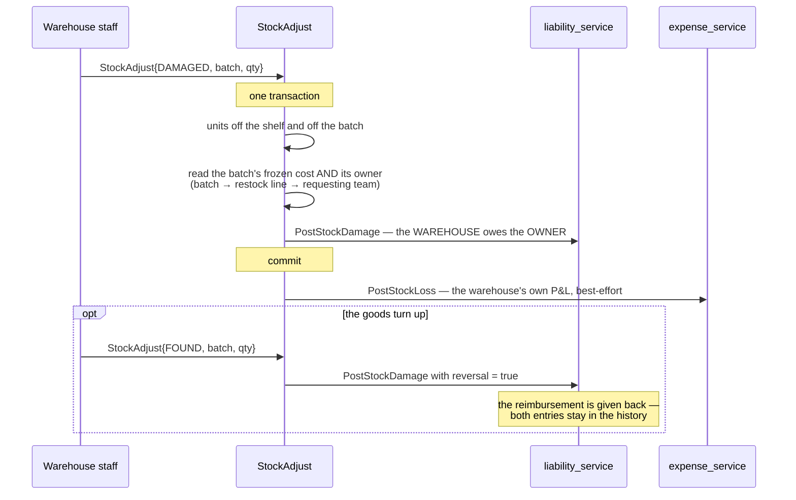
```mermaid
sequenceDiagram
    participant W as Warehouse staff
    participant I as StockAdjust
    participant S as liability_service
    participant E as expense_service

    W->>I: StockAdjust{DAMAGED, batch, qty}
    Note over I: one transaction
    I->>I: units off the shelf and off the batch
    I->>I: read the batch's frozen cost AND its owner<br/>(batch → restock line → requesting team)
    I->>S: PostStockDamage — the WAREHOUSE owes the OWNER
    Note over I: commit
    I->>E: PostStockLoss — the warehouse's own P&L, best-effort

    opt the goods turn up
        W->>I: StockAdjust{FOUND, batch, qty}
        I->>S: PostStockDamage with reversal = true
        Note over S: the reimbursement is given back —<br/>both entries stay in the history
    end
```

### ⚠ The direction is the whole point

Every other posting from this service has the **selling team owing the warehouse**. This one is
reversed: the warehouse holds the goods, the selling team owns them (§Warehouse 4), so losing them is
a **debt**, not a discount. Getting it backwards would bill the team whose stock was destroyed.

### Two records of one event, and both are wanted

| | answers |
| --- | --- |
| `EXPENSE_KIND_STOCK_WRITE_OFF` | *what did our losses cost us* — the warehouse's own P&L |
| `LIABILITY_SOURCE_TYPE_STOCK_DAMAGE` | *who do we now have to pay* |

Neither replaces the other. Dropping either loses a real question's answer.

### The debt commits with the stock; the expense does not

The liability posting joins the adjust's **transaction**; the expense posting stays best-effort
after it. Same distinction `LiabilityPoster` already draws: an expense is a *derived* record and a
dropped one is a gap a report can find, while an obligation that fails to commit leaves the owning
team's goods gone with nothing recorded — the situation the ledger exists to prevent.

### What is NOT charged here

| | |
| --- | --- |
| **`FOUND`** | posts the same source type as a **reversal**, against its own movement — never by deleting the entry that charged it |
| **`RECOUNT`** | names no batch, so it can point at no cost layer and no owner. (That `StockOpname` *does* value its shortfalls is a known recorded contradiction, untouched by this change.) |
| **unknown cost** | `unit_cost` NULL is *"we do not know"*, not free (#74). Nothing is posted — a zero entry would consume the pair's idempotency key for that movement, so a later backfill could never post the real figure. |
| **the warehouse's own goods** | a team cannot owe itself |
| **damage at RECEIVING, and on returned orders** | **§Warehouse 6** — neither enters the warehouse's custody, and neither travels this RPC |

### Idempotency

`source_id` is the **adjust movement**. Every adjust writes exactly one, so a retried adjust is
refused by the ledger's unique index, and a damage and its later find can never collide.

### An opname shortfall reimburses too (owner, 2026-08-20)

`StockOpname` is a recount in bulk, and §Warehouse 7 makes counting the shelf the warehouse's own job.
A shortfall it finds is stock lost in the warehouse exactly as one filed as a `LOST` adjust is — so it
posts the same `STOCK_DAMAGE` obligation.

Before this, the same physical loss reimbursed the owner or did not **depending on which RPC noticed
it**, which is the worst kind of inconsistency: invisible, and only in the accounts.

| | |
| --- | --- |
| **one debt per owner, per line** | keyed on that line's movement, so `source_id` means the same thing it means for an adjust and a re-run is refused by the ledger rather than charging twice |
| **⚠ a shortfall can span several owners** | a shelf holds whatever restocks filled it. 15 missing may take 10 units of team A's layer and 5 of team B's — at *their own* costs. `fifoDraw.ByOwner` carries the split rather than collapsing it; summing would pay the first team and leave the second with nothing |
| **a surplus reimburses nobody** | and is not a reversal either — stock that turns up on a count was never established as lost, so there is no debt of its own to give back. Only a `FOUND` adjust against a specific batch reverses a specific reimbursement |
| **unknown cost** | posts nothing, same as the adjust path (#74) |
| **the warehouse's own goods** | a team cannot owe itself |

The obligation joins the count's **transaction**; the expense stays best-effort after it — the same
split the single-adjust path draws, and for the same reason.

⚠ **`StockAdjust` with reason `RECOUNT` still does neither** — no write-off and no reimbursement. It is
now the only one of the three paths out of step, on both axes — an open **contradiction**, left
standing deliberately: changing a shipped money path is the owner's call.

## RestockRequestAccept — announces the accept

After the accept COMMITS, `RestockRequestAccept` publishes `RestockAccepted` — the restock, its two teams, its
supplier, the accept's Jakarta day and instant, and per line the ordered count, the total, the good units, the broken,
the missing and the line's supplier
([restock-accepted-carries-every-line](../../business/inventory/restock_decision.md#restock-accepted-carries-every-line)).
supplier_service folds it into a supplier's figures ([its doc](../supplier_service/rpc.md#the-figures--a-fold-of-restock-accepted)).
The restock's other money events — Restock Created, Cancelled and Updated, for the financial account — are in the
contract and published from the backend step.

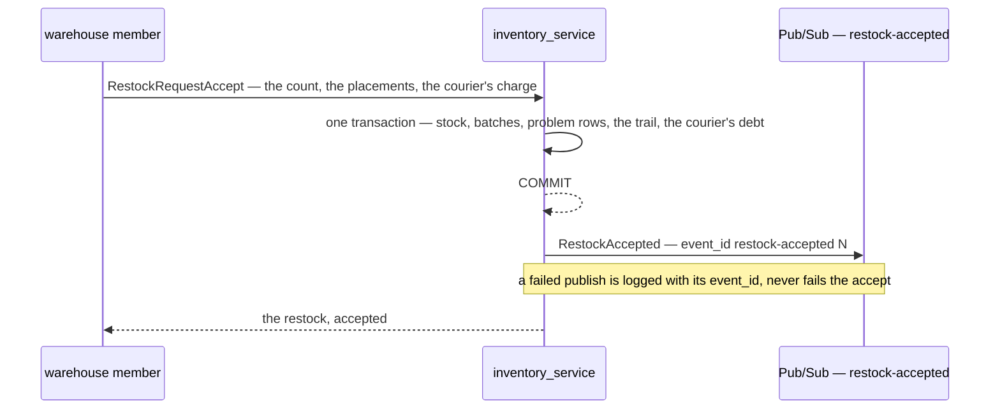
```mermaid
sequenceDiagram
  participant W as warehouse member
  participant INV as inventory_service
  participant PS as Pub/Sub — restock-accepted
  W->>INV: RestockRequestAccept — the count, the placements, the courier's charge
  INV->>INV: one transaction — stock, batches, problem rows, the trail, the courier's debt
  INV-->>INV: COMMIT
  INV->>PS: RestockAccepted — event_id restock-accepted N
  Note over INV,PS: a failed publish is logged with its event_id, never fails the accept
  INV-->>W: the restock, accepted
```

| | |
| --- | --- |
| after, never inside | an event for an accept that rolled back would fold goods that never arrived |
| a failed publish | logged; the supplier's figures are short that restock until a replay or an adjustment — never wrong the other way (no-outbox-the-publish-is-trusted) |
| `RestockAcceptedEvent` | the pure builder, exported — `san supplier backfill-figures` builds the very same event for a restock accepted before it existed |
