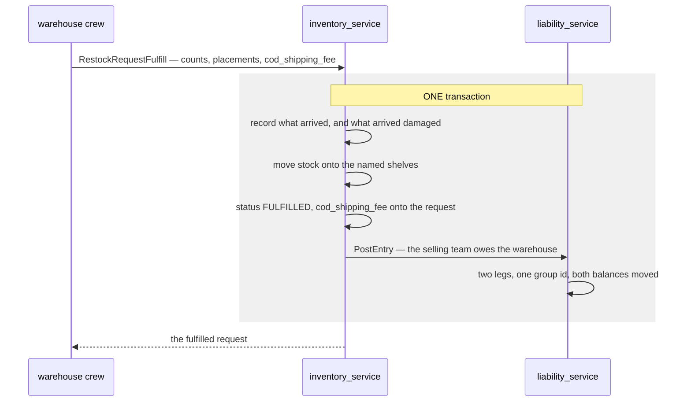
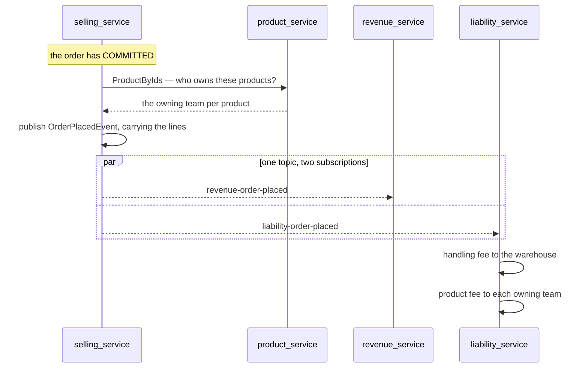
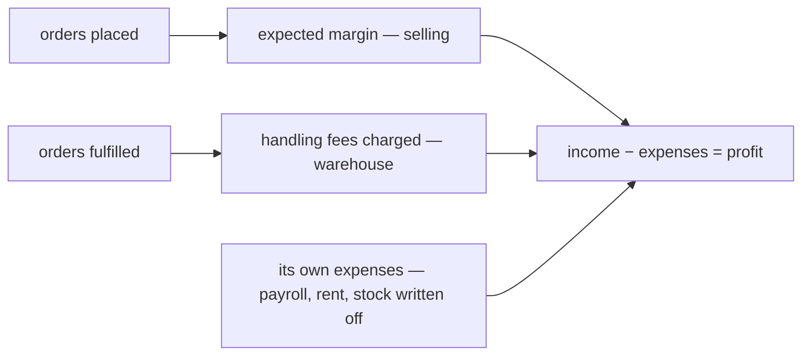
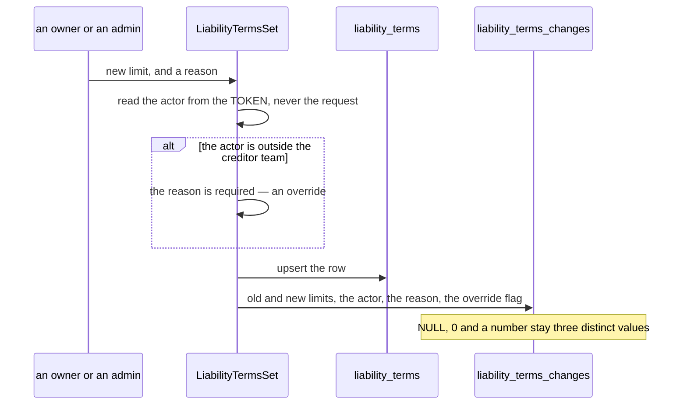
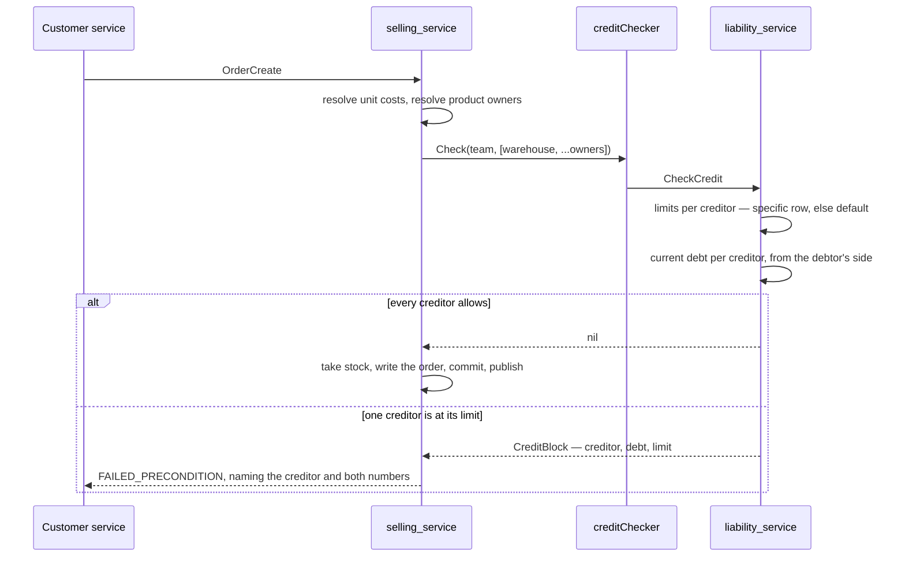
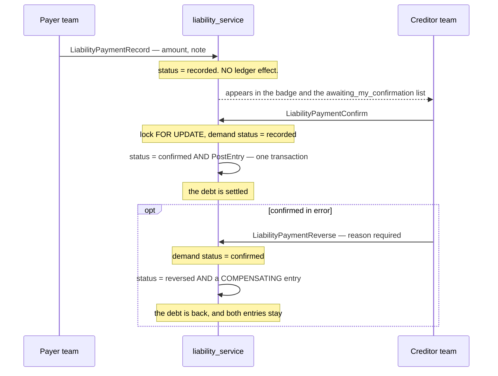

# liability_service — the ledger of what teams owe each other

Tables: [database-schema.md](../../database-schema.md#liability_service).

## The first writer — a COD restock (#184)

An obligation this system already creates and never recorded: a warehouse **accepts** a restock that
arrived COD, paying the courier at the door for goods it does not own.

**Why in the transaction and not after it.** If the stock movement commits and the obligation does
not, the warehouse is out of pocket with no record — which is *exactly* the situation this service
was built to fix, reproduced by the code meant to fix it. A test rolls the posting back and asserts
the goods never reach a shelf.

⚠ **This does not change what COD does today.** The fee still flows into HPP and into the order's
COGS (#155) — that is *costing*, and it stays. Liability adds the missing half: who is owed it, and
has it been repaid. The same rupiah answers two different questions, and there is a test asserting
the costing column still holds the number, because a change like this is exactly where one of the two
quietly disappears.

**A fee of 0 posts nothing.** Most deliveries are not COD, and an entry of zero would be a ledger row
saying nothing happened — worse than no row, because it reads as a debt of nothing rather than the
absence of one.

## How the two services are joined

`inventory_service` declares `LiabilityPoster` in its own terms and imports nothing from liability;
the adapter lives in
[cmd/app_development/liability_poster.go](../../../backend/cmd/app_development/liability_poster.go).
Same shape as `StockPicker` and `ProductCatalog`, with **one deliberate difference**:

| | Atomic? | Failure handling |
| --- | --- | --- |
| selling → inventory (`StockPicker`) | ❌ another service's commit | takes the stock, **compensates** if the order then fails |
| inventory → liability (`LiabilityPoster`) | ✅ same database | one transaction, **nothing to compensate** |

The cost is named rather than buried: passing a transaction across a service boundary means the two
are not independently deployable while this call is in-process. The day liability moves to its own
database this becomes an event, the atomicity argument has to be re-made, and the reconciliation
report (#187) is what covers the gap.

## The write path has no wire surface

`PostEntry` is a **domain function, not an RPC**, and deliberately so: nothing outside this system may
assert that one team owes another. Every posting originates from a real event inside it — a restock
accepted, an order placed, a payment confirmed. The proto's RPCs are reads plus the payment flow;
there is no "post an entry" endpoint and there should not be one.

It is also **policy-free**. It records; it never refuses. The credit check (#189) is an explicit
pre-check in the order flow, never a guard inside the posting path — a ledger that sometimes declines
to record reality is how books stop matching the world.

## Idempotency, and why a duplicate is a normal answer

`ErrAlreadyPosted` is returned when the movement is already on the books, and callers **swallow it**.

The order fees (#186) arrive on Pub/Sub, which delivers **at least once**: a redelivered order is
expected, not an error. A consumer that NACKed a duplicate would make Pub/Sub redeliver a message
that can never succeed — a poison loop built entirely out of correct behaviour. The unique index
`(team_id, counterparty_id, source_type, source_id, reversal)` is what makes ACKing safe.

`reversal` is in that key because a compensating entry shares the other four columns with the entry
it undoes; without it, a cancellation would be swallowed as a duplicate of the fee it was cancelling.

## The order-driven fees, on order events (#186)

Two more obligations, both driven by `OrderPlacedEvent` and both reversed by `OrderCancelledEvent`.

**The owner is resolved AT PLACEMENT and rides on the event.** Same choice the money already makes,
and for the same reason: a product moved to another team next month must not rewrite who was owed for
a sale that happened today. A consumer reading the catalogue at consume time would do exactly that.
A failed lookup does not fail the order — the order is already committed, the owner rides as `0`, and
liability reads that as "nobody to pay".

**Two subscriptions on one topic.** `revenue-order-placed` and `liability-order-placed` are separate
subscriptions, each with its own delivery state, so liability falling behind never delays a revenue
row. The dev-server loopback models this fan-out explicitly — it delivered to one subscription per
topic until liability became a second consumer.

### The two fees default differently, and that is deliberate

| | Default with no configuration | Because |
| --- | --- | --- |
| **Handling fee** | **charge nothing** | It is a **price** the warehouse sets. A warehouse that has configured nothing must not be silently billing anybody. |
| **Product fee** | **charge cost, markup 0** | It is a **cost transfer**. The goods left the owner's stock and do not come back (§2.2 — "money from the first moment"), so the owner is owed what they cost whether or not anybody configured anything. The **markup** is the optional part. |

Defaulting the product fee to zero as well would mean one team's goods walk out of another team's
warehouse free, which is the one outcome §2.2 explicitly rejects.

**The anchor is the frozen `unit_cost`, never the buyer-paid price.** A markup on what the buyer paid
is a commission model wearing a sale's clothes: on goods that cost 60.000 and sold for 100.000 at
20%, cost+markup owes the owner 72.000 while buyer-paid+markup owes 20.000 — the owner loses 40.000
on their own stock.

**One fee per owning team, not per line.** Two lines of the same team's goods are one debt, and the
idempotency key is `(source_type, source_id, counterparty)` — per-line postings would collide and the
second line would silently vanish.

⚠ **An unknown cost charges nothing and is not refused** (Q10). A product received straight into
stock has no recorded cost, so cost+markup computes zero. The sale is not blocked over a bookkeeping
gap. Nothing is written, because a zero-amount entry would consume that pair's idempotency key for
that order and block the real fee forever — so the gap is visible as a **missing** entry, which is
exactly what the reconciliation report (#187) looks for.

### Cancelling reads back what was charged

`ReverseOrder` does not recompute fees — it reads its own entries for that order and posts their
opposites. The cancel event carries only ids and needs no more: **the ledger already knows what it
charged.** Re-deriving from rates would disagree with the original the moment a rate changed between
placement and cancellation.

It reverses only `order_fee` and `product_fee`. ⚠ **The incidental obligation is left alone** — that
debt is what the warehouse paid at the door for goods it does not own, and an order falling through
does not give the warehouse its money back.

⚠ **The reversal names WHO CANCELLED**, not who placed. It is a second act, often by a second person,
and `OrderCancelledEvent` now carries its own `actor_id` for exactly that reason
([every-entry-names-who-posted-it](../../technical/balance/team_balance_design_decision.md#every-entry-names-who-posted-it)).

Only the **debtor's legs** are read. Both sides of every movement are stored, so reading every row
for the order would find each fee twice and reverse it twice — refused as a duplicate, but by luck
rather than by intent.

---

## `LiabilityDaily` — a warehouse's income half of the daily statement

A selling team earns the **margin on its orders**, and revenue_service holds one row per order. A
warehouse has no orders at all — `order_revenues.team_id` is always the *selling* team — so pointing a
warehouse at revenue_service returns nothing.

What a warehouse earns is the **fees it charges the teams it fulfils for**, and those exist only here.
Without this RPC its daily statement would put real expenses against a margin of zero and report every
single day as a pure loss (owner, 2026-08-14).

### It reports the ledger — it does not decide what "income" means

Every source type comes back in `by_source`, and the **caller** picks. The four are not the same kind of
thing, and summing them would double-count:

| source | what it is | the statement treats it as |
| --- | --- | --- |
| `HANDLING_FEE` | the warehouse fulfilled an order and is owed for the work | **income** |
| `COD_FEE` | it paid a courier at the door for goods it does not own | shown, **not** income — a reimbursement |
| `PRODUCT_FEE` | one selling team owes another for its product | not a warehouse's at all |
| `PAYMENT` | a confirmed payment settling an existing balance | cash moving — already earned when charged |

COD is the subtle one. The warehouse is genuinely owed it, so it gets its own column — but the cash that
went out was never recorded as an expense, so counting the repayment as income would inflate the bottom
line against nothing. The screen says so in a banner rather than silently dropping a number the reader
can also see on the Liability screen.

Naming that judgement inside the RPC would bake one screen's opinion into the ledger's contract, so it
returns the enum whole.

### Sign, reversals and the aggregate

**One sign convention (§4.11), unchanged by aggregation:** from the scoped team's point of view a
receivable is **positive** and a payable is **negative**. The two legs of one movement are exact
negatives, so the same fee reads `+20.000` on the warehouse's series and `−20.000` on the selling team's.

**Reversals are INCLUDED, never filtered.** A cancelled order's fee is undone by an equal-and-opposite leg
and both stay. A plain `SUM` therefore nets the pair to zero, which is the honest figure — excluding
reversals would report income the ledger has already taken back, which on a statement reads as a good day
that never happened. The day still appears, with two entry legs and a net of zero.

### The period IS the pagination

No page cursor, and that does not breach HARD RULE 9 — the rule guards a `repeated` whose length grows
**with the data**, and this one grows with `to − from`, which the caller states.

| | |
| --- | --- |
| Both bounds **required** | an open end is the unbounded read the rule is about |
| Span **capped at 366 days** | `InvalidArgument` beyond it — refused, never clamped |
| Result | a ten-year-old ledger and a one-year-old ledger return the same 366 rows |

The cap must equal revenue's and expense's. All three are read side by side, and a cap that differed would
let the statement load part of a period and still look complete. It lives in **four** places:
`maxPeriodDays` in liability, revenue and expense, and `MAX_PERIOD_DAYS` in
[frontend/src/lib/period.ts](../../../frontend/src/lib/period.ts).

### Sparse series, one calendar

A day the ledger did not move is **absent**, not a zero row — the same contract the other two daily series
follow. The client owns the date spine because it must build one to line three services up, and a server
that also emitted empty days would be a second calendar free to disagree about what February contains.

A quiet day is still **rendered**, dimmed. A missing row cannot tell a reader "nothing was charged" apart
from "that day did not load".

### Bucketing

`created_at` is a `TIMESTAMPTZ`, cast with an explicit `AT TIME ZONE 'UTC'` — a bare `::date` converts
using the session's TimeZone, which nothing sets. The upper bound is **half-open** (`< to + 1 day`) for
the same reason revenue's is: `<= to` means `<= midnight` and would silently drop almost the whole final
day of every period.

> ⚠ The business is UTC+7, so an entry posted before 07:00 local lands on the previous day here. It is
> deliberate *consistency* rather than a fresh decision — see
> [revenue_service/rpc.md](../revenue_service/rpc.md) for the full note.

### The totals are built in the fold, not by a second query

The one place this differs from the revenue and expense handlers. They each had an existing period-totals
query to reuse, and reusing it keeps their footer identical to their list screen's. There is no such query
here, so a second one would be a second definition of the same sum — free to drift from the days above it,
which is exactly the failure the other two reuse their query to avoid.

## The rates and limits themselves — `LiabilityTermsService` (#189)

Until this landed, `liability_terms` was a table only the fee code READ. Nothing could write it, so
every handling fee was 0, every product markup was 0, and every credit limit was unlimited —
permanently. Three RPCs close that.

| RPC | |
| --- | --- |
| `LiabilityTermsList` | what the scoped team charges each debtor — the **creditor's own books**, never what it is charged |
| `LiabilityTermsSet` | upsert one pair's rate and limit |
| `LiabilityTermsDelete` | remove a pair's row entirely |
| `LiabilityTermsHistoryList` | every change to those terms, in order. ⛔ **declared, not implemented** — see below |

**The scope is the CREDITOR.** `team_id` is the team that WROTE these rows. A debtor asking what it
is charged is asking about somebody else's configuration and gets its own empty list.

**`counterparty_id = 0` is the DEFAULT row**, not a missing value — the rate applying to every team
without an override. That is the whole override mechanism, and it is why the list orders by
`counterparty_id ASC`: the default leads because it is the first thing anyone needs to read.

### ⚠ Absent is unlimited, `0` is no credit at all

The one place in this service where a wrong zero inverts the meaning.

| `credit_limit` | means |
| --- | --- |
| no terms row | **unlimited** |
| row, `NULL` | **unlimited** |
| row, `0` | **no credit at all** — blocks the very first order |

So the limit is a pointer end to end and is never read through a zero-defaulting getter.
`LiabilityTermsSet` passes `req.Msg.CreditLimit` straight to SQL rather than `GetCreditLimit()`,
because the getter flattens absent and zero to the same `0` — which would grant infinite credit to a
team somebody had just frozen.

`Set` is an UPSERT: "set the rate" is one act whether or not a row exists, and a create that failed
on the second edit would make the screen's Save button work exactly once. It writes `credit_limit`
unconditionally, NULL included — omitting the field is how a caller lifts a limit, so COALESCE-ing to
the stored value would make a limit permanent once set.

`Delete` removes the whole row, dropping that debtor back to the creditor's default. Deleting terms
that do not exist SUCCEEDS: the caller asked for a state, that state holds either way, and a retry
after a timeout must not fail because the first attempt worked.

**A rate change never rewrites history.** Terms decide what FUTURE postings charge; entries already
written are immutable facts about money that moved.

### The change log — `LiabilityTermsHistoryList`, declared and NOT implemented

⛔ **The handler refuses with `Unimplemented`.** It exists because the contract is derived from the
screen and accepted at the same gate as it (HARD RULE 6): the Credit Terms screen is a Storybook
prototype awaiting `design_accept`, and a service is mounted WHOLE — so the moment the proto grew an
RPC, every method of that interface had to exist or the build breaks.

⚠ **It refuses rather than returning an empty page.** An empty list is indistinguishable from *"nobody
has ever changed a limit"*, which is exactly the false reassurance an audit surface must not give.

Why a LOG and not two more columns on the terms row — both reasons come from decisions already made:

- **The limit IS the chase instrument.** [no-overdue-only-the-threshold](../../business/balance/context_decision.md#no-overdue-only-the-threshold)
  leaves a creditor no way to demand payment except lowering the limit, so raising and lowering it is
  an ongoing negotiation between two businesses. Only its latest value is not a record of that.
- **A raise silently erases the warning.** [the-threshold-warns-at-eighty-percent](../../business/balance/context_decision.md#the-threshold-warns-at-eighty-percent)
  makes 80% the only signal this design has. A team at 87% whose limit doubles drops to 43% and the
  badge vanishes — with columns alone, nothing anywhere shows it was ever warning.

What it needs before it can be written, and neither is the handler's decision:

| | |
| --- | --- |
| a `liability_terms_changes` table | ⚠ **both limit columns NULLABLE.** `NULL`, `0` and a number are three different acts, and an integer column flattens the first into the second — turning *"they removed the limit"* into *"they froze the team"* |
| the actor, stamped at write time | in `LiabilityTermsSet` / `LiabilityTermsDelete`, from the TOKEN — along with whether the writer was outside the creditor team. A caller cannot be trusted to report that its own write was an override |

`reason` is already on both write requests: **required when the actor is outside the creditor team**,
optional when they are. A creditor setting its own terms owes nobody an explanation; somebody else
changing them does — and that difference is the whole definition of an override here
([a-limit-change-is-recorded](../../business/balance/context_decision.md#a-limit-change-is-recorded)).

## The credit check — a pre-order gate, not a ledger guard (#189)

A limit only matters if something enforces it. `CheckCredit` is a **domain function**, called by
selling_service through an interface it owns, before an order writes anything.

### The rule is `debt < limit`, on CURRENT debt

Exposure can reach the limit plus one order's fees, and the **next** order is blocked. Friendlier
than a hard ceiling — a person is cut off next time rather than rejected mid-order for an amount they
cannot see — and it agrees with the eventual-consistency window rather than fighting it. The design
already accepts that an order may commit before its fees post, so a check reading a slightly stale
balance overshoots by about one order, which is exactly what this rule permits.

### Every creditor, independently — and the blocker is NAMED

An order draws on the fulfilling warehouse **and** each team whose goods it sells. Any one over its
limit stops the whole order. A check that only ever asked about the warehouse would pass every "is it
blocked" test while letting a frozen product owner's stock ship forever.

The refusal carries the creditor, the debt and the limit in its message, because the person hitting
it is **customer service** — who never sees the Liability screens and cannot look the numbers up.
It is `FAILED_PRECONDITION`, not `PERMISSION_DENIED`: the caller is allowed to place orders, and the
state of the world is what refuses.

### Where it sits in the order, and why

- **Before the transaction**, for the same reason the cost read is — it is a read, and holding the
  order's row lock across another service's call buys nothing and closes no window.
- **Before the stock draw.** A blocked order must not have taken stock it then gives back: a
  compensating return is a real movement in the warehouse's ledger, and one caused by a refusal the
  system could have made first is noise nobody can explain.
- **Never inside `PostEntry`.** The ledger records what happened and must never decline to record it.
  The fees of an order that slipped through still post truthfully; the *next* order is stopped.

### What fails open, and what does not

| | |
| --- | --- |
| the catalogue cannot resolve product owners | **fails OPEN** — logged, and only the warehouse's limit is applied. An outage there must not stop every order in the system; the uncharged product fee is what the reconciliation report is built to find |
| the **check itself** errors | **fails CLOSED** — the order is refused. We cannot say whether the team is over its limit, and allowing it would make an outage the way past every credit limit at once |
| no checker wired at all | permissive (`noCredit`), and deliberately not the production default — the composition root wires the real one |

## Settling a debt — `LiabilityPaymentService` (#188)

Until this landed a balance could only **grow**: fees posted, and nothing in the system could ever
bring one back to zero.

Liability is **two-phase**. The payer records; the creditor confirms; **only the confirm posts.**

### Why recording posts nothing

One side asserting a transfer is not evidence that it landed. A ledger that moved on a claim would
let any team write off its own debt by typing a number. Only the creditor can see the money arrive —
which is also why counterparties are **teams only**: an external party has no account and could never
confirm.

### The scope asymmetry IS the design

| RPC | `team_id` must be | |
| --- | --- | --- |
| `Record` | the **payer** | you may only assert a movement of your own money |
| `Confirm` | the **creditor** | a payer who could confirm their own payment could write off any debt |
| `Reverse` | the **creditor** | whoever confirmed is who un-confirms |

The scope is in the `WHERE` of the lookup, not a check after loading, so somebody else's payment
reads as **NOT FOUND** rather than forbidden — a caller must not be able to probe payment ids to
learn who owes whom.

### ⚠ Confirm locks the row, and the status change posts with it

Confirm is a check-then-act on money: read the status, decide it is `recorded`, post an entry that
settles a debt. Two managers clicking Confirm in the same second is an ordinary event here.

- **`FOR UPDATE`** — without it both reads see `recorded`, both post, and the debt is paid off twice.
  The ledger's unique index would catch the second posting, but as `ErrAlreadyPosted` from inside a
  transaction, which is a worse way to learn it.
- **One transaction** — a payment marked confirmed whose entry never landed is a debt the books still
  show and the screen says is settled.

Proven, not asserted: `payment_confirm_race_test.go` (`-tags raceaudit`) runs 8 concurrent confirms —
exactly one succeeds and the balance lands on 0 — and races Confirm against Reverse.

### ⚠ A payment moves value the OPPOSITE way to a fee

`paymentPosting` puts the **payer** in the `CreditorTeamID` field. That is not a mistake: paying
reduces the payer's payable, so their balance moves **up** toward zero while the team that was paid
moves **down**. Writing the teams the "natural" way round would settle the debt backwards —
arithmetically consistent, completely wrong, and invisible until somebody reads a screen.

`reversal` distinguishes the confirmation from its undoing inside the ledger's idempotency key
`(source_type, source_id, counterparty, reversal)` — which is what lets one payment be posted once
and un-posted once, and neither of them twice.

### Reversal is compensation, never an edit

The confirmation stays in the ledger and an equal-and-opposite entry joins it, so the balance nets
back and the history shows the payment was agreed and then withdrawn. `confirmed_at` and
`confirmed_by` **survive** — when it was agreed, and by whom, are facts, and clearing them would
erase who to ask about it.

The `reason` is required by the contract and stored. Reversing says a person got it wrong, and the
next reader deserves better than two entries that cancel out for no stated reason.

> ⚠ **The stored `reversal_reason` has no getter on the wire yet.** `LiabilityPayment` carries no
> reason field, so the column is written and cannot be read back. Worth a proto field before the
> screens land — until then the reason is recoverable only from the database.

### The badge — `awaiting_my_confirmation`

A payment nobody notices is a debt that stays open for no reason. `LiabilityPositionList` answers
the count inside the query it already makes, so the badge and the rows cannot disagree, and
`LiabilityPaymentList` lists the same set.

It means `recorded` payments where **this team is the creditor** — never the ones it recorded itself,
which are waiting on somebody else. Counting both sides would show every payer a permanent
notification for work that is not theirs.

## The fifth obligation — stock the warehouse broke or lost (`STOCK_DAMAGE`)

`LIABILITY_SOURCE_TYPE_STOCK_DAMAGE`, posted from `inventory_service`'s `StockAdjust` through
`LiabilityPoster.PostStockDamage`. `source_id` is the **adjust movement**.

⚠ **It is the only obligation in this service where the WAREHOUSE is the debtor.** Every other one —
COD/restock outlay, handling fee, product fee — has the selling team owing the warehouse. Here the
warehouse holds goods it does not own (business_level §Warehouse 4), so breaking them is a debt to
the owner rather than a cost it absorbs alone.

| | |
| --- | --- |
| debtor | the **warehouse** |
| creditor | the **owning team**, resolved batch → restock line → requesting team |
| amount | qty × the batch's **frozen** unit cost |
| reversal | `true` when the goods are **FOUND** again |

The `Reversal` flag rather than a swap of the two teams: the swap would produce the right arithmetic
with the wrong idempotency key, so a find and its damage would not read as one story.

**It does not replace the write-off.** `expense_service` records the same event as the warehouse's own
P&L (`EXPENSE_KIND_STOCK_WRITE_OFF`); this records who it now owes. One answers *"what did our losses
cost us"*, the other *"who do we have to pay"*.

**Nothing is posted for an unknown cost** — the same Q10 rule the product fee follows: `unit_cost`
NULL means *we do not know*, not free, and a zero entry would consume the idempotency key so the real
figure could never be posted later. The reconciliation report (#187) is what names those.

The full flow, with what is and is not charged, is in
[inventory_service/rpc.md](../inventory_service/rpc.md).
